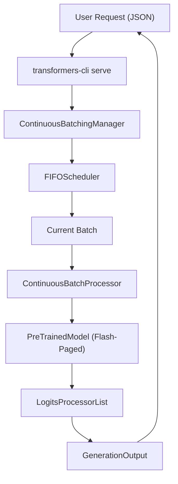
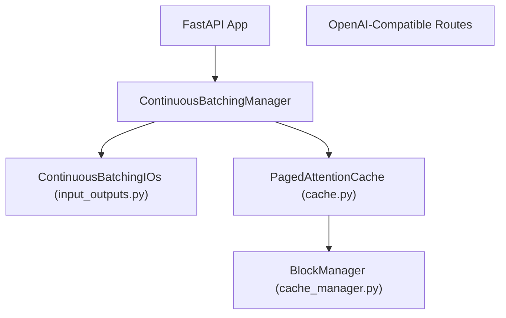

# 连续批处理与服务 (Continuous Batching and Serving)

相关源文件

-   [MIGRATION_GUIDE_V5.md](https://github.com/huggingface/transformers/blob/9a9997fd/MIGRATION_GUIDE_V5.md?plain=1)
-   [benchmark_v2/benchmark_scripts/continuous_batching_overall.py](https://github.com/huggingface/transformers/blob/9a9997fd/benchmark_v2/benchmark_scripts/continuous_batching_overall.py)
-   [docs/source/en/conversations.md](https://github.com/huggingface/transformers/blob/9a9997fd/docs/source/en/conversations.md?plain=1)
-   [docs/source/en/llm_tutorial.md](https://github.com/huggingface/transformers/blob/9a9997fd/docs/source/en/llm_tutorial.md?plain=1)
-   [docs/source/en/optimization_overview.md](https://github.com/huggingface/transformers/blob/9a9997fd/docs/source/en/optimization_overview.md?plain=1)
-   [docs/source/en/serve-cli/cursor.md](https://github.com/huggingface/transformers/blob/9a9997fd/docs/source/en/serve-cli/cursor.md?plain=1)
-   [docs/source/en/serve-cli/jan.md](https://github.com/huggingface/transformers/blob/9a9997fd/docs/source/en/serve-cli/jan.md?plain=1)
-   [docs/source/en/serve-cli/openweb_ui.md](https://github.com/huggingface/transformers/blob/9a9997fd/docs/source/en/serve-cli/openweb_ui.md?plain=1)
-   [docs/source/en/serve-cli/serving.md](https://github.com/huggingface/transformers/blob/9a9997fd/docs/source/en/serve-cli/serving.md?plain=1)
-   [docs/source/en/serve-cli/serving_optims.md](https://github.com/huggingface/transformers/blob/9a9997fd/docs/source/en/serve-cli/serving_optims.md?plain=1)
-   [examples/metrics-monitoring/README.md](https://github.com/huggingface/transformers/blob/9a9997fd/examples/metrics-monitoring/README.md?plain=1)
-   [examples/pytorch/continuous_batching.py](https://github.com/huggingface/transformers/blob/9a9997fd/examples/pytorch/continuous_batching.py)
-   [src/transformers/cli/add_new_model_like.py](https://github.com/huggingface/transformers/blob/9a9997fd/src/transformers/cli/add_new_model_like.py)
-   [src/transformers/cli/chat.py](https://github.com/huggingface/transformers/blob/9a9997fd/src/transformers/cli/chat.py)
-   [src/transformers/cli/download.py](https://github.com/huggingface/transformers/blob/9a9997fd/src/transformers/cli/download.py)
-   [src/transformers/cli/serve.py](https://github.com/huggingface/transformers/blob/9a9997fd/src/transformers/cli/serve.py)
-   [src/transformers/cli/system.py](https://github.com/huggingface/transformers/blob/9a9997fd/src/transformers/cli/system.py)
-   [src/transformers/cli/transformers.py](https://github.com/huggingface/transformers/blob/9a9997fd/src/transformers/cli/transformers.py)
-   [src/transformers/data/datasets/glue.py](https://github.com/huggingface/transformers/blob/9a9997fd/src/transformers/data/datasets/glue.py)
-   [src/transformers/data/processors/glue.py](https://github.com/huggingface/transformers/blob/9a9997fd/src/transformers/data/processors/glue.py)
-   [src/transformers/generation/continuous_batching/cache.py](https://github.com/huggingface/transformers/blob/9a9997fd/src/transformers/generation/continuous_batching/cache.py)
-   [src/transformers/generation/continuous_batching/cache_manager.py](https://github.com/huggingface/transformers/blob/9a9997fd/src/transformers/generation/continuous_batching/cache_manager.py)
-   [src/transformers/generation/continuous_batching/continuous_api.py](https://github.com/huggingface/transformers/blob/9a9997fd/src/transformers/generation/continuous_batching/continuous_api.py)
-   [src/transformers/generation/continuous_batching/input_outputs.py](https://github.com/huggingface/transformers/blob/9a9997fd/src/transformers/generation/continuous_batching/input_outputs.py)
-   [src/transformers/generation/continuous_batching/requests.py](https://github.com/huggingface/transformers/blob/9a9997fd/src/transformers/generation/continuous_batching/requests.py)
-   [src/transformers/generation/continuous_batching/scheduler.py](https://github.com/huggingface/transformers/blob/9a9997fd/src/transformers/generation/continuous_batching/scheduler.py)
-   [src/transformers/generation/continuous_batching/utils.py](https://github.com/huggingface/transformers/blob/9a9997fd/src/transformers/generation/continuous_batching/utils.py)
-   [src/transformers/integrations/flash_paged.py](https://github.com/huggingface/transformers/blob/9a9997fd/src/transformers/integrations/flash_paged.py)
-   [src/transformers/models/cohere/tokenization_cohere.py](https://github.com/huggingface/transformers/blob/9a9997fd/src/transformers/models/cohere/tokenization_cohere.py)
-   [src/transformers/pipelines/keypoint_matching.py](https://github.com/huggingface/transformers/blob/9a9997fd/src/transformers/pipelines/keypoint_matching.py)
-   [src/transformers/utils/logging.py](https://github.com/huggingface/transformers/blob/9a9997fd/src/transformers/utils/logging.py)
-   [tests/cli/test_serve.py](https://github.com/huggingface/transformers/blob/9a9997fd/tests/cli/test_serve.py)
-   [tests/generation/test_continuous_batching.py](https://github.com/huggingface/transformers/blob/9a9997fd/tests/generation/test_continuous_batching.py)

Continuous Batching (连续批处理) 是一种高吞吐量推理技术，通过在其他请求完成 Prefill (预填充) 或 Generation (生成) 步骤后立即将新请求插入批处理中，允许引擎同时处理多个请求。与等待批次中所有序列完成后再开始新批次的 Static batching (静态批处理) 不同，连续批处理在 token 级别运行，以最大化 GPU 利用率。

Transformers 库为连续批处理提供了一个完整的生态系统，包括内存高效的 Paged attention cache (分页注意力缓存)、Request scheduler (请求调度器) 以及与 OpenAI API 兼容的生产级 Serving CLI (服务 CLI)。

## 核心架构 (Core Architecture)

连续批处理系统由 `ContinuousBatchingManager` 编排（见于 [src/transformers/cli/serve.py63](https://github.com/huggingface/transformers/blob/9a9997fd/src/transformers/cli/serve.py#L63-L63)），它通过专门的处理循环协调请求的生命周期。

### ContinuousBatchProcessor

`ContinuousBatchProcessor` 是管理模型、KV cache (KV 缓存) 和调度器之间交互的内部引擎。它处理 "Prefill" (预填充) 阶段（处理初始 Prompt (提示)）和 "Decode" (解码) 阶段（为该请求每步生成一个新 token）之间的过渡。

主要职责：

-   **图管理 (Graph Management)**: 为了优化性能，它通过将张量填充到由 `q_padding_interval_size` 和 `kv_padding_interval_size` 定义的固定间隔来支持 CUDA graphs (CUDA 图) [src/transformers/generation/continuous_batching/continuous_api.py44-62](https://github.com/huggingface/transformers/blob/9a9997fd/src/transformers/generation/continuous_batching/continuous_api.py#L44-L62)
-   **编译 (Compilation)**: 它集成了 `torch.compile`，为变长预填充 (`_compiled_varlen`) 和解码 (`_compiled_decode`) 提供专门路径 [src/transformers/generation/continuous_batching/continuous_api.py150-157](https://github.com/huggingface/transformers/blob/9a9997fd/src/transformers/generation/continuous_batching/continuous_api.py#L150-L157)
-   **执行循环 (Execution Loop)**: 它运行一个连续循环，轮询新请求、调度批次并执行模型前向传递 [src/transformers/generation/continuous_batching/continuous_api.py176-200](https://github.com/huggingface/transformers/blob/9a9997fd/src/transformers/generation/continuous_batching/continuous_api.py#L176-L200)

### 请求生命周期与状态 (Request Lifecycle and State)

每个请求都通过 `RequestState` 进行追踪，它维护请求的状态、生成的 token 和分配的资源 [src/transformers/generation/continuous_batching/requests.py121-143](https://github.com/huggingface/transformers/blob/9a9997fd/src/transformers/generation/continuous_batching/requests.py#L121-L143)

| 状态 | 描述 |
| --- | --- |
| `PENDING` | 请求在队列中，等待资源。 |
| `PREFILLING` | 模型正在处理初始 Prompt (提示) token。 |
| `DECODING` | 模型正在为此请求每步生成一个 token。 |
| `FINISHED` | 生成完成（达到 EOS 或最大 token 数）。 |
| `FAILED` | 处理期间发生错误。 |

**来源：** [src/transformers/generation/continuous_batching/continuous_api.py82-160](https://github.com/huggingface/transformers/blob/9a9997fd/src/transformers/generation/continuous_batching/continuous_api.py#L82-L160) [src/transformers/generation/continuous_batching/requests.py81-143](https://github.com/huggingface/transformers/blob/9a9997fd/src/transformers/generation/continuous_batching/requests.py#L81-L143)

## 分页注意力缓存 (Paged Attention Cache)

为了处理多个请求的动态内存需求，Transformers 实现了 `PagedAttentionCache`。该系统受 vLLM 的混合分配器启发，通过将 KV 缓存划分为固定大小的 Block (块) 来减少内存碎片 [src/transformers/generation/continuous_batching/cache.py62-117](https://github.com/huggingface/transformers/blob/9a9997fd/src/transformers/generation/continuous_batching/cache.py#L62-L117)

### 缓存层次结构 (Cache Hierarchy)

1.  **Pages (页)**: 最小单位，存储一层中单个 token 的 KV 状态。
2.  **Blocks (块)**: `block_size` 个页的集合（默认 32）。这是分配的原子单位 [src/transformers/generation/continuous_batching/cache.py71-77](https://github.com/huggingface/transformers/blob/9a9997fd/src/transformers/generation/continuous_batching/cache.py#L71-L77)
3.  **Layer Groups (层组)**: 层按注意力类型（例如 "full" vs "sliding window"）分组。块会同时在组内的所有层分配，以简化管理 [src/transformers/generation/continuous_batching/cache.py81-83](https://github.com/huggingface/transformers/blob/9a9997fd/src/transformers/generation/continuous_batching/cache.py#L81-L83)

### 与 Flash Attention 的集成 (Integration with Flash Attention)

该系统使用专门的 Paged attention (分页注意力) 核。对于解码，它使用 `flash_attn_with_kvcache` 进行融合注意力和缓存更新。对于预填充或变长批次，它使用 `flash_attn_varlen_func` [src/transformers/integrations/flash_paged.py45-83](https://github.com/huggingface/transformers/blob/9a9997fd/src/transformers/integrations/flash_paged.py#L45-L83)

**来源：** [src/transformers/generation/continuous_batching/cache.py28-117](https://github.com/huggingface/transformers/blob/9a9997fd/src/transformers/generation/continuous_batching/cache.py#L28-L117) [src/transformers/integrations/flash_paged.py7-123](https://github.com/huggingface/transformers/blob/9a9997fd/src/transformers/integrations/flash_paged.py#L7-L123)

## 调度 (FIFOScheduler) (Scheduling (FIFOScheduler))

`Scheduler` 根据可用的 token 和缓存预算决定等待队列中的哪些请求进入活跃批次 [src/transformers/generation/continuous_batching/scheduler.py23-35](https://github.com/huggingface/transformers/blob/9a9997fd/src/transformers/generation/continuous_batching/scheduler.py#L23-L35)

默认实现是 `FIFOScheduler`，它按请求到达的顺序进行处理。它执行：

-   **预算管理 (Budget Management)**: 确保批次中查询 token 和 KV token 的总数不超过硬件限制 [src/transformers/generation/continuous_batching/scheduler.py55-63](https://github.com/huggingface/transformers/blob/9a9997fd/src/transformers/generation/continuous_batching/scheduler.py#L55-L63)
-   **前缀共享 (Prefix Sharing)**: 如果启用，调度器会搜索现有的 KV cache (KV 缓存) 前缀，以避免重新计算共享的 Prompt (提示) [src/transformers/generation/continuous_batching/scheduler.py133-140](https://github.com/huggingface/transformers/blob/9a9997fd/src/transformers/generation/continuous_batching/scheduler.py#L133-L140)
-   **块分配 (Block Allocation)**: 当请求的序列长度超过其当前分配的容量时，动态地向 `CacheAllocator` 请求新块 [src/transformers/generation/continuous_batching/scheduler.py111-127](https://github.com/huggingface/transformers/blob/9a9997fd/src/transformers/generation/continuous_batching/scheduler.py#L111-L127)

### 系统流：从请求到模型 (System Flow: Request to Model)

下图说明了自然语言请求如何转换为代码实体并在系统中处理。

**来源：** [src/transformers/generation/continuous_batching/scheduler.py23-140](https://github.com/huggingface/transformers/blob/9a9997fd/src/transformers/generation/continuous_batching/scheduler.py#L23-L140) [src/transformers/cli/serve.py76-112](https://github.com/huggingface/transformers/blob/9a9997fd/src/transformers/cli/serve.py#L76-L112)

## 服务与 CLI (Serving and CLI)

Transformers 提供了高层接口以在生产中部署这些模型。

### transformers-cli serve

`serve` 命令启动一个与 OpenAI API 规范兼容的基于 FastAPI 的服务器 [src/transformers/cli/serve.py77-112](https://github.com/huggingface/transformers/blob/9a9997fd/src/transformers/cli/serve.py#L77-L112)。它支持：

-   **Chat Completions (对话补全)**: 用于对话模型的 `/v1/chat/completions`。
-   **Transcriptions (语音转录)**: 用于类 Whisper 模型的 `/v1/audio/transcriptions` [src/transformers/cli/serve.py129-137](https://github.com/huggingface/transformers/blob/9a9997fd/src/transformers/cli/serve.py#L129-L137)
-   **Streaming (流式传输)**: 用于实时 token 交付的服务器发送事件 (SSE)。

### transformers chat

`chat` CLI 提供了一个交互式终端界面与模型通信，内部利用连续批处理逻辑实现响应式生成 [src/transformers/cli/chat.py1-50](https://github.com/huggingface/transformers/blob/9a9997fd/src/transformers/cli/chat.py#L1-L50)

### 实体关联图 (Entity Association Diagram)

该图映射了服务组件及其各自的实现文件和类。

**来源：** [src/transformers/cli/serve.py72-191](https://github.com/huggingface/transformers/blob/9a9997fd/src/transformers/cli/serve.py#L72-L191) [src/transformers/generation/continuous_batching/input_outputs.py86-130](https://github.com/huggingface/transformers/blob/9a9997fd/src/transformers/generation/continuous_batching/input_outputs.py#L86-L130)
