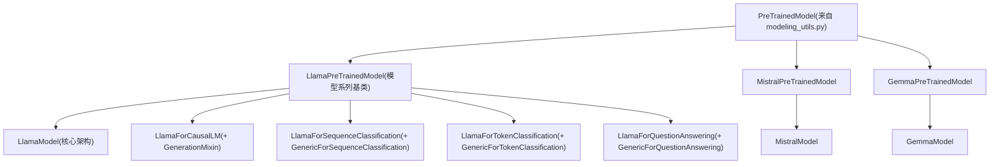
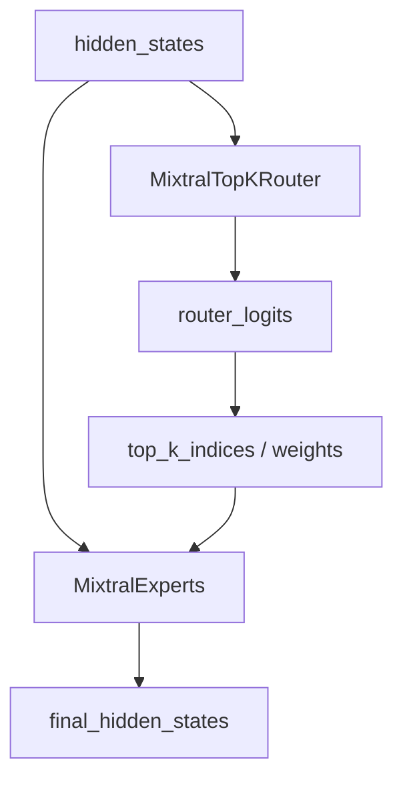

# 模型架构 (Model Architectures)

相关源文件

-   [src/transformers/models/cohere/modeling_cohere.py](https://github.com/huggingface/transformers/blob/9a9997fd/src/transformers/models/cohere/modeling_cohere.py)
-   [src/transformers/models/cohere2/modeling_cohere2.py](https://github.com/huggingface/transformers/blob/9a9997fd/src/transformers/models/cohere2/modeling_cohere2.py)
-   [src/transformers/models/cohere2/modular_cohere2.py](https://github.com/huggingface/transformers/blob/9a9997fd/src/transformers/models/cohere2/modular_cohere2.py)
-   [src/transformers/models/gemma/modeling_gemma.py](https://github.com/huggingface/transformers/blob/9a9997fd/src/transformers/models/gemma/modeling_gemma.py)
-   [src/transformers/models/gemma/modular_gemma.py](https://github.com/huggingface/transformers/blob/9a9997fd/src/transformers/models/gemma/modular_gemma.py)
-   [src/transformers/models/gemma2/modeling_gemma2.py](https://github.com/huggingface/transformers/blob/9a9997fd/src/transformers/models/gemma2/modeling_gemma2.py)
-   [src/transformers/models/gemma2/modular_gemma2.py](https://github.com/huggingface/transformers/blob/9a9997fd/src/transformers/models/gemma2/modular_gemma2.py)
-   [src/transformers/models/gemma3/configuration_gemma3.py](https://github.com/huggingface/transformers/blob/9a9997fd/src/transformers/models/gemma3/configuration_gemma3.py)
-   [src/transformers/models/gemma3/modeling_gemma3.py](https://github.com/huggingface/transformers/blob/9a9997fd/src/transformers/models/gemma3/modeling_gemma3.py)
-   [src/transformers/models/gemma3/modular_gemma3.py](https://github.com/huggingface/transformers/blob/9a9997fd/src/transformers/models/gemma3/modular_gemma3.py)
-   [src/transformers/models/gemma3n/configuration_gemma3n.py](https://github.com/huggingface/transformers/blob/9a9997fd/src/transformers/models/gemma3n/configuration_gemma3n.py)
-   [src/transformers/models/gemma3n/modeling_gemma3n.py](https://github.com/huggingface/transformers/blob/9a9997fd/src/transformers/models/gemma3n/modeling_gemma3n.py)
-   [src/transformers/models/gemma3n/modular_gemma3n.py](https://github.com/huggingface/transformers/blob/9a9997fd/src/transformers/models/gemma3n/modular_gemma3n.py)
-   [src/transformers/models/llama/modeling_llama.py](https://github.com/huggingface/transformers/blob/9a9997fd/src/transformers/models/llama/modeling_llama.py)
-   [src/transformers/models/mistral/modeling_mistral.py](https://github.com/huggingface/transformers/blob/9a9997fd/src/transformers/models/mistral/modeling_mistral.py)
-   [src/transformers/models/mixtral/modeling_mixtral.py](https://github.com/huggingface/transformers/blob/9a9997fd/src/transformers/models/mixtral/modeling_mixtral.py)
-   [src/transformers/models/olmo/modeling_olmo.py](https://github.com/huggingface/transformers/blob/9a9997fd/src/transformers/models/olmo/modeling_olmo.py)
-   [src/transformers/models/persimmon/modeling_persimmon.py](https://github.com/huggingface/transformers/blob/9a9997fd/src/transformers/models/persimmon/modeling_persimmon.py)
-   [src/transformers/models/phi/modeling_phi.py](https://github.com/huggingface/transformers/blob/9a9997fd/src/transformers/models/phi/modeling_phi.py)
-   [src/transformers/models/phi3/modeling_phi3.py](https://github.com/huggingface/transformers/blob/9a9997fd/src/transformers/models/phi3/modeling_phi3.py)
-   [src/transformers/models/qwen2/modeling_qwen2.py](https://github.com/huggingface/transformers/blob/9a9997fd/src/transformers/models/qwen2/modeling_qwen2.py)
-   [src/transformers/models/qwen2_moe/modeling_qwen2_moe.py](https://github.com/huggingface/transformers/blob/9a9997fd/src/transformers/models/qwen2_moe/modeling_qwen2_moe.py)
-   [src/transformers/models/stablelm/modeling_stablelm.py](https://github.com/huggingface/transformers/blob/9a9997fd/src/transformers/models/stablelm/modeling_stablelm.py)
-   [src/transformers/models/starcoder2/modeling_starcoder2.py](https://github.com/huggingface/transformers/blob/9a9997fd/src/transformers/models/starcoder2/modeling_starcoder2.py)
-   [tests/models/gemma3/test_modeling_gemma3.py](https://github.com/huggingface/transformers/blob/9a9997fd/tests/models/gemma3/test_modeling_gemma3.py)
-   [tests/models/gemma3n/test_modeling_gemma3n.py](https://github.com/huggingface/transformers/blob/9a9997fd/tests/models/gemma3n/test_modeling_gemma3n.py)

本页概述了 `transformers` 库支持的主要模型架构系列 (Model Architecture Families) 以及各实现之间共享的通用架构模式。该库支持 200 多种模型架构，这些架构组织在 `src/transformers/models/` 目录下。每个架构在实现特定技术创新的同时，也共享由 `src/transformers/modeling_utils.py` 中的 `PreTrainedModel` 提供的基础构建模块。

## 架构系列 (Architecture Families)

| 系列 | 代表模型 | 子页面 |
| --- | --- | --- |
| **仅解码器语言模型 (Decoder-Only LMs)** | LLaMA 系列, Mistral, Gemma, Qwen2, Phi, Falcon, GPT-2 | [仅解码器语言模型](/huggingface/transformers/5.1-decoder-only-language-models) |
| **注意力机制 (Attention Mechanisms)** | Eager, Flash Attention 2, SDPA, FlexAttention, GQA, MQA | [注意力机制](/huggingface/transformers/5.2-attention-mechanisms) |
| **位置嵌入 (Positional Embeddings)** | RoPE (Linear, Dynamic, YaRN, Llama3), MRoPE, Sinusoidal | [位置嵌入](/huggingface/transformers/5.3-positional-embeddings) |
| **混合专家 (Mixture-of-Experts)** | Mixtral, Qwen2MoE, Jamba, GraniteHybrid | [混合专家架构](/huggingface/transformers/5.4-mixture-of-experts-architecture) |
| **ASR / 语音 (ASR / Speech)** | Whisper, Bark, SpeechT5, Wav2Vec2 | [Whisper 与自动语音识别](/huggingface/transformers/5.5-whisper-and-automatic-speech-recognition) |
| **编码器-解码器 (Encoder-Decoder)** | T5, BART, mBART, Pegasus, Marian | [编码器-解码器模型](/huggingface/transformers/5.6-encoder-decoder-models) |
| **多模态视觉-语言模型 (Multimodal VLMs)** | LLaVA, PaliGemma, Qwen2.5-VL, Idefics, Gemma3 | [多模态视觉-语言模型](/huggingface/transformers/5.7-multimodal-vision-language-models) |
| **视觉模型 (Vision Models)** | CLIP, SigLIP, ViT, DINOv2, DETR, SAM | [视觉与计算机视觉模型](/huggingface/transformers/5.8-vision-and-computer-vision-models) |
| **状态空间模型 (State Space Models)** | Mamba, Mamba2, RWKV, Jamba (混合型), Bamba | [状态空间与循环模型](/huggingface/transformers/5.9-state-space-and-recurrent-models) |

所有模型系列都共享通用的构建模块（嵌入 (embeddings)、注意力机制 (attention mechanisms)、前馈网络 (feed-forward networks)、归一化层 (normalization layers)），但在具体实现和组合方式上有所不同。

**相关文档：**

-   关于模型加载机制，请参阅 [模型加载与权重管理](/huggingface/transformers/2.2-model-loading-and-weight-management)
-   关于训练模型，请参阅 [训练系统](/huggingface/transformers/3-training-system)
-   关于文本生成，请参阅 [生成系统](/huggingface/transformers/4-generation-system)

## 模型实现结构 (Model Implementation Structure)

`transformers` 中的所有模型实现都遵循一致的四级层次结构，这既提供了灵活性，又实现了不同架构之间的标准化。

### 模型类层次结构 (Model Class Hierarchy)

**来源：** [src/transformers/models/llama/modeling_llama.py315-331](https://github.com/huggingface/transformers/blob/9a9997fd/src/transformers/models/llama/modeling_llama.py#L315-L331) [src/transformers/models/mistral/modeling_mistral.py252-268](https://github.com/huggingface/transformers/blob/9a9997fd/src/transformers/models/mistral/modeling_mistral.py#L252-L268) [src/transformers/models/gemma/modeling_gemma.py308-324](https://github.com/huggingface/transformers/blob/9a9997fd/src/transformers/models/gemma/modeling_gemma.py#L308-L324) [src/transformers/modeling_layers.py31-34](https://github.com/huggingface/transformers/blob/9a9997fd/src/transformers/modeling_layers.py#L31-L34)

### 核心模型组件 (Core Model Components)

像 Llama 这样的现代大语言模型 (LLM) 架构由分层组件组成，这些组件组合成完整的模型：

**组件层次结构图 (Component Hierarchy Diagram)**

```mermaid
flowchart TD
    LlamaModel["LlamaModel"]
    embed_tokens["embed_tokens(nn.Embedding)"]
    layers["layers(nn.ModuleList[LlamaDecoderLayer])"]
    norm["norm(LlamaRMSNorm)"]
    rotary_emb["rotary_emb(LlamaRotaryEmbedding)"]
    self_attn["self_attn(LlamaAttention)"]
    mlp["mlp(LlamaMLP)"]
    input_layernorm["input_layernorm(LlamaRMSNorm)"]
    post_attention_layernorm["post_attention_layernorm(LlamaRMSNorm)"]
    q_proj["q_proj(nn.Linear)"]
    k_proj["k_proj(nn.Linear)"]
    v_proj["v_proj(nn.Linear)"]
    o_proj["o_proj(nn.Linear)"]
    apply_rotary_pos_emb["apply_rotary_pos_emb()"]
    eager_attention_forward["eager_attention_forward()"]
    gate_proj["gate_proj(nn.Linear)"]
    up_proj["up_proj(nn.Linear)"]
    down_proj["down_proj(nn.Linear)"]
    act_fn["ACT2FN[config.hidden_act]"]

    LlamaModel --> embed_tokens
    LlamaModel --> layers
    LlamaModel --> norm
    LlamaModel --> rotary_emb
    layers --> self_attn
    layers --> mlp
    layers --> input_layernorm
    layers --> post_attention_layernorm
    self --> attn_q_proj
    self --> attn_k_proj
    self --> attn_v_proj
    self --> attn_o_proj
    self --> attn_apply_rotary_pos_emb
    self --> attn_eager_attention_forward
    mlp --> gate_proj
    mlp --> up_proj
    mlp --> down_proj
    mlp --> act_fn
```

**来源：** [src/transformers/models/llama/modeling_llama.py363-378](https://github.com/huggingface/transformers/blob/9a9997fd/src/transformers/models/llama/modeling_llama.py#L363-L378) [src/transformers/models/llama/modeling_llama.py298-340](https://github.com/huggingface/transformers/blob/9a9997fd/src/transformers/models/llama/modeling_llama.py#L298-L340) [src/transformers/models/llama/modeling_llama.py228-295](https://github.com/huggingface/transformers/blob/9a9997fd/src/transformers/models/llama/modeling_llama.py#L228-L295) [src/transformers/models/llama/modeling_llama.py173-186](https://github.com/huggingface/transformers/blob/9a9997fd/src/transformers/models/llama/modeling_llama.py#L173-L186)

## 模型类别与实现模式 (Model Categories and Implementation Patterns)

### 仅解码器语言模型 (Decoder-Only Language Models)

大多数现代 LLM 遵循仅解码器 Transformer 架构。该库为 LLaMA (v1-v4)、Mistral、Gemma 和 Qwen 系列提供了优化实现。这些模型利用因果语言建模 (Causal Language Modeling) 头和高级注意力机制。有关详细架构，请参阅 [仅解码器语言模型](/huggingface/transformers/5.1-decoder-only-language-models)。

**来源：** [src/transformers/models/llama/modeling_llama.py359-560](https://github.com/huggingface/transformers/blob/9a9997fd/src/transformers/models/llama/modeling_llama.py#L359-L560) [src/transformers/models/mistral/modeling_mistral.py1-450](https://github.com/huggingface/transformers/blob/9a9997fd/src/transformers/models/mistral/modeling_mistral.py#L1-L450) [src/transformers/models/gemma/modeling_gemma.py1-460](https://github.com/huggingface/transformers/blob/9a9997fd/src/transformers/models/gemma/modeling_gemma.py#L1-L460)

### 混合专家 (Mixture-of-Experts, MoE) 模型

像 Mixtral 和 Qwen2-Moe 这样的 MoE 模型使用稀疏专家路由 (sparse expert routing) 来扩展容量。路由逻辑通常涉及一个 `gate` 网络，为每个标记 (token) 选择前 k 个 (top-k) 专家。有关 MoE 内部细节，请参阅 [混合专家架构](/huggingface/transformers/5.4-mixture-of-experts-architecture)。

**来源：** [src/transformers/models/mixtral/modeling_mixtral.py61-139](https://github.com/huggingface/transformers/blob/9a9997fd/src/transformers/models/mixtral/modeling_mixtral.py#L61-L139) [src/transformers/models/qwen2_moe/modeling_qwen2_moe.py62-146](https://github.com/huggingface/transformers/blob/9a9997fd/src/transformers/models/qwen2_moe/modeling_qwen2_moe.py#L62-L146)

### 多模态视觉-语言模型 (Multimodal Vision-Language Models)

像 LLaVA、PaliGemma 和 Gemma3 这样的模型将视觉编码器（如 SigLIP）与 LLM 骨干网络集成在一起。它们通常使用多模态投影器 (multimodal projector) 将视觉特征映射到文本嵌入空间。Gemma3 特别引入了具有 `full_attention` 和 `sliding_attention` 的混合层。详情请参阅 [多模态视觉-语言模型](/huggingface/transformers/5.7-multimodal-vision-language-models)。

**来源：** [src/transformers/models/gemma3/modeling_gemma3.py102-162](https://github.com/huggingface/transformers/blob/9a9997fd/src/transformers/models/gemma3/modeling_gemma3.py#L102-L162) [src/transformers/models/gemma3/modular_gemma3.py156-175](https://github.com/huggingface/transformers/blob/9a9997fd/src/transformers/models/gemma3/modular_gemma3.py#L156-L175)

### 状态空间与循环模型 (State Space and Recurrent Models)

像 Mamba 和 Mamba2 这样的状态空间模型 (SSM) 提供了线性时间序列建模。像 Jamba 这样的混合模型将 Transformer 注意力层与 SSM 层结合，以平衡性能。有关 SSM 内部细节，请参阅 [状态空间与循环模型](/huggingface/transformers/5.9-state-space-and-recurrent-models)。

## 通用架构组件 (Common Architectural Components)

### 注意力实现策略 (Attention Implementation Strategy)

模型支持多种注意力后端，包括 Eager、SDPA (缩放点积注意力 (Scaled Dot Product Attention)) 和 Flash Attention 2。组查询注意力 (Grouped-Query Attention, GQA) 在 Mistral 和 Llama 模型中是标准配置，用以减少 KV 缓存 (KV cache) 大小。

**来源：** [src/transformers/models/mistral/modeling_mistral.py96-118](https://github.com/huggingface/transformers/blob/9a9997fd/src/transformers/models/mistral/modeling_mistral.py#L96-L118) [src/transformers/models/llama/modeling_llama.py199-295](https://github.com/huggingface/transformers/blob/9a9997fd/src/transformers/models/llama/modeling_llama.py#L199-L295)

### 位置编码模式 (Positional Encoding Patterns)

旋转位置嵌入 (Rotary Position Embeddings, RoPE) 是主流的编码方案。实现方式从标准 RoPE 到交错版本（Cohere）和部分旋转（Phi）不等。有关 RoPE 内部细节，请参阅 [位置嵌入](/huggingface/transformers/5.3-positional-embeddings)。

| 模型系列 | 实现类 | 关键特性 |
| --- | --- | --- |
| Llama / Mistral | `LlamaRotaryEmbedding` | 标准 RoPE |
| Cohere | `CohereRotaryEmbedding` | 交错 RoPE |
| Phi | `PhiRotaryEmbedding` | 部分 RoPE 旋转 |
| Gemma3 | `Gemma3RotaryEmbedding` | 混合层的多 θ 值 |

**来源：** [src/transformers/models/llama/modeling_llama.py73-136](https://github.com/huggingface/transformers/blob/9a9997fd/src/transformers/models/llama/modeling_llama.py#L73-L136) [src/transformers/models/cohere/modeling_cohere.py69-131](https://github.com/huggingface/transformers/blob/9a9997fd/src/transformers/models/cohere/modeling_cohere.py#L69-L131) [src/transformers/models/gemma3/modeling_gemma3.py152-165](https://github.com/huggingface/transformers/blob/9a9997fd/src/transformers/models/gemma3/modeling_gemma3.py#L152-L165)

### 归一化与 MLP 策略 (Normalization and MLP Strategies)

-   **RMSNorm**: Llama 和 Mistral 中的标准配置。Gemma 变体使用 `1.0 + weight` 修改版。
-   **MLP**: 大多数模型使用带门控的 SwiGLU 结构，包含 `gate_proj`、`up_proj` 和 `down_proj`。

**来源：** [src/transformers/models/llama/modeling_llama.py53-70](https://github.com/huggingface/transformers/blob/9a9997fd/src/transformers/models/llama/modeling_llama.py#L53-L70) [src/transformers/models/gemma/modeling_gemma.py64-81](https://github.com/huggingface/transformers/blob/9a9997fd/src/transformers/models/gemma/modeling_gemma.py#L64-L81) [src/transformers/models/llama/modeling_llama.py171-184](https://github.com/huggingface/transformers/blob/9a9997fd/src/transformers/models/llama/modeling_llama.py#L171-L184)
