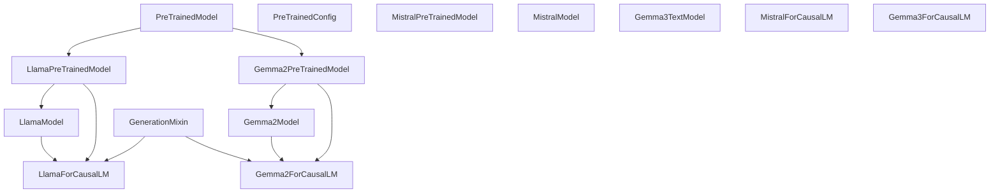
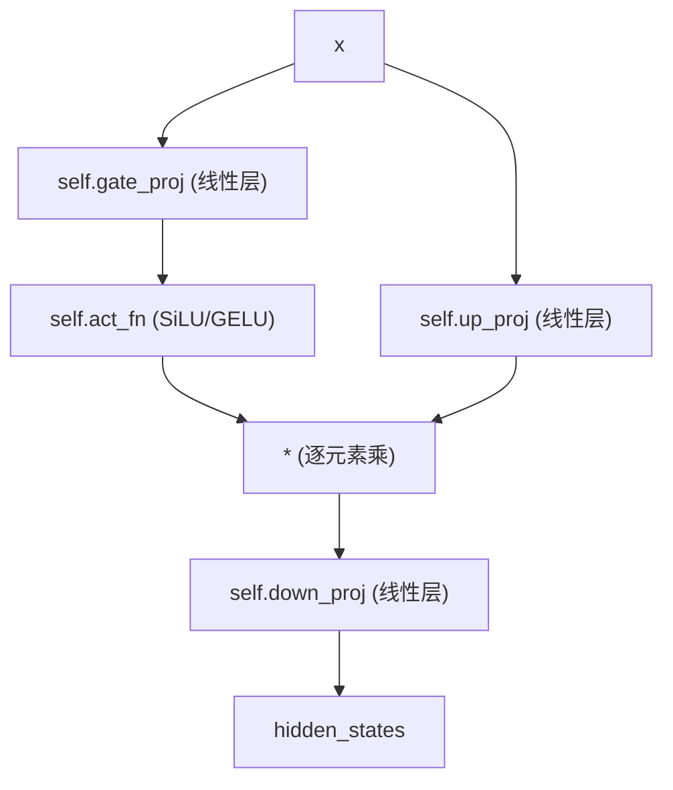
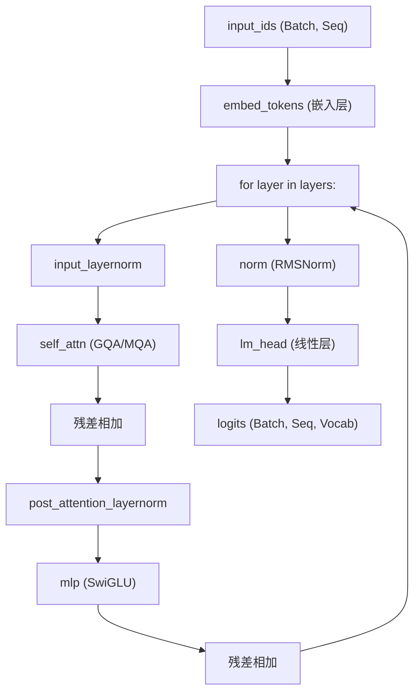

# 仅解码器语言模型 (Decoder-Only Language Models)

相关源文件

-   [docs/source/en/internal/file_utils.md](https://github.com/huggingface/transformers/blob/9a9997fd/docs/source/en/internal/file_utils.md?plain=1)
-   [docs/source/en/model_doc/barthez.md](https://github.com/huggingface/transformers/blob/9a9997fd/docs/source/en/model_doc/barthez.md?plain=1)
-   [docs/source/en/model_doc/distilbert.md](https://github.com/huggingface/transformers/blob/9a9997fd/docs/source/en/model_doc/distilbert.md?plain=1)
-   [docs/source/en/model_doc/gemma2.md](https://github.com/huggingface/transformers/blob/9a9997fd/docs/source/en/model_doc/gemma2.md?plain=1)
-   [docs/source/en/model_doc/gpt2.md](https://github.com/huggingface/transformers/blob/9a9997fd/docs/source/en/model_doc/gpt2.md?plain=1)
-   [docs/source/en/model_doc/granitevision.md](https://github.com/huggingface/transformers/blob/9a9997fd/docs/source/en/model_doc/granitevision.md?plain=1)
-   [docs/source/en/model_doc/phi.md](https://github.com/huggingface/transformers/blob/9a9997fd/docs/source/en/model_doc/phi.md?plain=1)
-   [docs/source/en/model_doc/sam_hq.md](https://github.com/huggingface/transformers/blob/9a9997fd/docs/source/en/model_doc/sam_hq.md?plain=1)
-   [docs/source/en/model_doc/stablelm.md](https://github.com/huggingface/transformers/blob/9a9997fd/docs/source/en/model_doc/stablelm.md?plain=1)
-   [docs/source/en/model_doc/starcoder2.md](https://github.com/huggingface/transformers/blob/9a9997fd/docs/source/en/model_doc/starcoder2.md?plain=1)
-   [docs/source/ko/model_doc/gemma2.md](https://github.com/huggingface/transformers/blob/9a9997fd/docs/source/ko/model_doc/gemma2.md?plain=1)
-   [src/transformers/integrations/executorch.py](https://github.com/huggingface/transformers/blob/9a9997fd/src/transformers/integrations/executorch.py)
-   [src/transformers/models/biogpt/modeling_biogpt.py](https://github.com/huggingface/transformers/blob/9a9997fd/src/transformers/models/biogpt/modeling_biogpt.py)
-   [src/transformers/models/bloom/modeling_bloom.py](https://github.com/huggingface/transformers/blob/9a9997fd/src/transformers/models/bloom/modeling_bloom.py)
-   [src/transformers/models/codegen/modeling_codegen.py](https://github.com/huggingface/transformers/blob/9a9997fd/src/transformers/models/codegen/modeling_codegen.py)
-   [src/transformers/models/cohere/modeling_cohere.py](https://github.com/huggingface/transformers/blob/9a9997fd/src/transformers/models/cohere/modeling_cohere.py)
-   [src/transformers/models/cohere2/modeling_cohere2.py](https://github.com/huggingface/transformers/blob/9a9997fd/src/transformers/models/cohere2/modeling_cohere2.py)
-   [src/transformers/models/cohere2/modular_cohere2.py](https://github.com/huggingface/transformers/blob/9a9997fd/src/transformers/models/cohere2/modular_cohere2.py)
-   [src/transformers/models/decision_transformer/modeling_decision_transformer.py](https://github.com/huggingface/transformers/blob/9a9997fd/src/transformers/models/decision_transformer/modeling_decision_transformer.py)
-   [src/transformers/models/falcon/modeling_falcon.py](https://github.com/huggingface/transformers/blob/9a9997fd/src/transformers/models/falcon/modeling_falcon.py)
-   [src/transformers/models/gemma/modeling_gemma.py](https://github.com/huggingface/transformers/blob/9a9997fd/src/transformers/models/gemma/modeling_gemma.py)
-   [src/transformers/models/gemma/modular_gemma.py](https://github.com/huggingface/transformers/blob/9a9997fd/src/transformers/models/gemma/modular_gemma.py)
-   [src/transformers/models/gemma2/modeling_gemma2.py](https://github.com/huggingface/transformers/blob/9a9997fd/src/transformers/models/gemma2/modeling_gemma2.py)
-   [src/transformers/models/gemma2/modular_gemma2.py](https://github.com/huggingface/transformers/blob/9a9997fd/src/transformers/models/gemma2/modular_gemma2.py)
-   [src/transformers/models/gemma3/configuration_gemma3.py](https://github.com/huggingface/transformers/blob/9a9997fd/src/transformers/models/gemma3/configuration_gemma3.py)
-   [src/transformers/models/gemma3/modeling_gemma3.py](https://github.com/huggingface/transformers/blob/9a9997fd/src/transformers/models/gemma3/modeling_gemma3.py)
-   [src/transformers/models/gemma3/modular_gemma3.py](https://github.com/huggingface/transformers/blob/9a9997fd/src/transformers/models/gemma3/modular_gemma3.py)
-   [src/transformers/models/gemma3n/configuration_gemma3n.py](https://github.com/huggingface/transformers/blob/9a9997fd/src/transformers/models/gemma3n/configuration_gemma3n.py)
-   [src/transformers/models/gemma3n/modeling_gemma3n.py](https://github.com/huggingface/transformers/blob/9a9997fd/src/transformers/models/gemma3n/modeling_gemma3n.py)
-   [src/transformers/models/gemma3n/modular_gemma3n.py](https://github.com/huggingface/transformers/blob/9a9997fd/src/transformers/models/gemma3n/modular_gemma3n.py)
-   [src/transformers/models/gpt2/modeling_gpt2.py](https://github.com/huggingface/transformers/blob/9a9997fd/src/transformers/models/gpt2/modeling_gpt2.py)
-   [src/transformers/models/gpt_bigcode/modeling_gpt_bigcode.py](https://github.com/huggingface/transformers/blob/9a9997fd/src/transformers/models/gpt_bigcode/modeling_gpt_bigcode.py)
-   [src/transformers/models/gpt_neo/modeling_gpt_neo.py](https://github.com/huggingface/transformers/blob/9a9997fd/src/transformers/models/gpt_neo/modeling_gpt_neo.py)
-   [src/transformers/models/gpt_neox/modeling_gpt_neox.py](https://github.com/huggingface/transformers/blob/9a9997fd/src/transformers/models/gpt_neox/modeling_gpt_neox.py)
-   [src/transformers/models/gpt_neox_japanese/modeling_gpt_neox_japanese.py](https://github.com/huggingface/transformers/blob/9a9997fd/src/transformers/models/gpt_neox_japanese/modeling_gpt_neox_japanese.py)
-   [src/transformers/models/gptj/modeling_gptj.py](https://github.com/huggingface/transformers/blob/9a9997fd/src/transformers/models/gptj/modeling_gptj.py)
-   [src/transformers/models/idefics/modeling_idefics.py](https://github.com/huggingface/transformers/blob/9a9997fd/src/transformers/models/idefics/modeling_idefics.py)
-   [src/transformers/models/llama/modeling_llama.py](https://github.com/huggingface/transformers/blob/9a9997fd/src/transformers/models/llama/modeling_llama.py)
-   [src/transformers/models/mistral/modeling_mistral.py](https://github.com/huggingface/transformers/blob/9a9997fd/src/transformers/models/mistral/modeling_mistral.py)
-   [src/transformers/models/mixtral/modeling_mixtral.py](https://github.com/huggingface/transformers/blob/9a9997fd/src/transformers/models/mixtral/modeling_mixtral.py)
-   [src/transformers/models/olmo/modeling_olmo.py](https://github.com/huggingface/transformers/blob/9a9997fd/src/transformers/models/olmo/modeling_olmo.py)
-   [src/transformers/models/opt/modeling_opt.py](https://github.com/huggingface/transformers/blob/9a9997fd/src/transformers/models/opt/modeling_opt.py)
-   [src/transformers/models/persimmon/modeling_persimmon.py](https://github.com/huggingface/transformers/blob/9a9997fd/src/transformers/models/persimmon/modeling_persimmon.py)
-   [src/transformers/models/phi/modeling_phi.py](https://github.com/huggingface/transformers/blob/9a9997fd/src/transformers/models/phi/modeling_phi.py)
-   [src/transformers/models/phi3/modeling_phi3.py](https://github.com/huggingface/transformers/blob/9a9997fd/src/transformers/models/phi3/modeling_phi3.py)
-   [src/transformers/models/qwen2/modeling_qwen2.py](https://github.com/huggingface/transformers/blob/9a9997fd/src/transformers/models/qwen2/modeling_qwen2.py)
-   [src/transformers/models/qwen2_moe/modeling_qwen2_moe.py](https://github.com/huggingface/transformers/blob/9a9997fd/src/transformers/models/qwen2_moe/modeling_qwen2_moe.py)
-   [src/transformers/models/stablelm/modeling_stablelm.py](https://github.com/huggingface/transformers/blob/9a9997fd/src/transformers/models/stablelm/modeling_stablelm.py)
-   [src/transformers/models/starcoder2/modeling_starcoder2.py](https://github.com/huggingface/transformers/blob/9a9997fd/src/transformers/models/starcoder2/modeling_starcoder2.py)
-   [tests/models/aya_vision/test_modeling_aya_vision.py](https://github.com/huggingface/transformers/blob/9a9997fd/tests/models/aya_vision/test_modeling_aya_vision.py)
-   [tests/models/cohere2/test_modeling_cohere2.py](https://github.com/huggingface/transformers/blob/9a9997fd/tests/models/cohere2/test_modeling_cohere2.py)
-   [tests/models/gemma/test_modeling_gemma.py](https://github.com/huggingface/transformers/blob/9a9997fd/tests/models/gemma/test_modeling_gemma.py)
-   [tests/models/gemma2/test_modeling_gemma2.py](https://github.com/huggingface/transformers/blob/9a9997fd/tests/models/gemma2/test_modeling_gemma2.py)
-   [tests/models/gemma3/test_modeling_gemma3.py](https://github.com/huggingface/transformers/blob/9a9997fd/tests/models/gemma3/test_modeling_gemma3.py)
-   [tests/models/gemma3n/test_modeling_gemma3n.py](https://github.com/huggingface/transformers/blob/9a9997fd/tests/models/gemma3n/test_modeling_gemma3n.py)
-   [tests/models/glm/test_modeling_glm.py](https://github.com/huggingface/transformers/blob/9a9997fd/tests/models/glm/test_modeling_glm.py)
-   [tests/models/gpt2/test_modeling_gpt2.py](https://github.com/huggingface/transformers/blob/9a9997fd/tests/models/gpt2/test_modeling_gpt2.py)
-   [tests/models/granitemoehybrid/test_modeling_granitemoehybrid.py](https://github.com/huggingface/transformers/blob/9a9997fd/tests/models/granitemoehybrid/test_modeling_granitemoehybrid.py)
-   [tests/models/llama/test_modeling_llama.py](https://github.com/huggingface/transformers/blob/9a9997fd/tests/models/llama/test_modeling_llama.py)
-   [tests/models/mistral/test_modeling_mistral.py](https://github.com/huggingface/transformers/blob/9a9997fd/tests/models/mistral/test_modeling_mistral.py)
-   [tests/models/mixtral/test_modeling_mixtral.py](https://github.com/huggingface/transformers/blob/9a9997fd/tests/models/mixtral/test_modeling_mixtral.py)
-   [tests/models/olmo/test_modeling_olmo.py](https://github.com/huggingface/transformers/blob/9a9997fd/tests/models/olmo/test_modeling_olmo.py)
-   [tests/models/olmo2/test_modeling_olmo2.py](https://github.com/huggingface/transformers/blob/9a9997fd/tests/models/olmo2/test_modeling_olmo2.py)
-   [tests/models/phi3/test_modeling_phi3.py](https://github.com/huggingface/transformers/blob/9a9997fd/tests/models/phi3/test_modeling_phi3.py)
-   [tests/models/qwen2/test_modeling_qwen2.py](https://github.com/huggingface/transformers/blob/9a9997fd/tests/models/qwen2/test_modeling_qwen2.py)
-   [tests/models/qwen2_moe/test_modeling_qwen2_moe.py](https://github.com/huggingface/transformers/blob/9a9997fd/tests/models/qwen2_moe/test_modeling_qwen2_moe.py)
-   [tests/models/qwen3/test_modeling_qwen3.py](https://github.com/huggingface/transformers/blob/9a9997fd/tests/models/qwen3/test_modeling_qwen3.py)
-   [tests/models/qwen3_moe/test_modeling_qwen3_moe.py](https://github.com/huggingface/transformers/blob/9a9997fd/tests/models/qwen3_moe/test_modeling_qwen3_moe.py)
-   [tests/models/starcoder2/test_modeling_starcoder2.py](https://github.com/huggingface/transformers/blob/9a9997fd/tests/models/starcoder2/test_modeling_starcoder2.py)

## 概述 (Overview)

仅解码器模型 (Decoder-only models) 是因果语言模型 (Autoregressive language models)，它们通过使用因果掩码 (causal masking)，基于之前的标记 (tokens) 预测下一个标记来生成文本。这种架构为现代大语言模型 (LLMs) 提供了动力，包括 **LLaMA** 系列 (LLaMA 1-4), **Mistral**, **Gemma** (1, 2, 3), **Qwen** (2, 3) 以及 **Falcon**。

在 `transformers` 库中，这些模型遵循统一的结构模式：

-   **标记嵌入层 (Token Embedding Layer)**: `nn.Embedding` (通常与输出头 (output head) 绑定)。
-   **解码器层堆栈 (Decoder Layer Stack)**: 一系列相同的块 (例如 `LlamaDecoderLayer`, `Gemma2DecoderLayer`)。
-   **最终归一化 (Final Normalization)**: 通常在输出头之前使用 `RMSNorm` 或 `LayerNorm`。
-   **因果语言建模头 (Causal Language Modeling Head)**: 一个将隐藏状态投影到词表对数概率 (vocabulary logits) 的线性层。

---

## 架构概述 (Architectural Overview)

### 模型层次结构与类结构 (Model Hierarchy and Class Structure)

所有仅解码器模型都继承自 `PreTrainedModel`，并实现一个“基础 (Base)”模型（提供隐藏状态）和一个 “ForCausalLM” 封装器（提供对数概率和损失）。

**核心模型类层次结构 (Core Model Class Hierarchy)**

**来源：**

-   [src/transformers/models/llama/modeling_llama.py344-360](https://github.com/huggingface/transformers/blob/9a9997fd/src/transformers/models/llama/modeling_llama.py#L344-L360)
-   [src/transformers/models/gemma2/modeling_gemma2.py43-50](https://github.com/huggingface/transformers/blob/9a9997fd/src/transformers/models/gemma2/modeling_gemma2.py#L43-L50)
-   [src/transformers/models/gemma3/modeling_gemma3.py50-60](https://github.com/huggingface/transformers/blob/9a9997fd/src/transformers/models/gemma3/modeling_gemma3.py#L50-L60)

---

## 通用架构组件 (Common Architectural Components)

### 归一化层 (Normalization Layers) (RMSNorm)

大多数现代解码器 (LLaMA, Mistral, Gemma, Qwen) 已将标准 `LayerNorm` 替换为 `RMSNorm`。它通过隐藏状态的均方根 (root mean square) 对输入进行缩放，为了效率省略了均值归一化 (mean-centering) 步骤。

**实现对比：**

-   **LLaMA/Mistral**: 标准 `RMSNorm` 实现 [src/transformers/models/llama/modeling_llama.py53-67](https://github.com/huggingface/transformers/blob/9a9997fd/src/transformers/models/llama/modeling_llama.py#L53-L67)
-   **Gemma/Gemma2/Gemma3**: 使用 “1 + weight” 缩放方法：`output * (1.0 + self.weight.float())` [src/transformers/models/gemma2/modeling_gemma2.py62-63](https://github.com/huggingface/transformers/blob/9a9997fd/src/transformers/models/gemma2/modeling_gemma2.py#L62-L63)

### 多层感知机 (Multi-Layer Perceptron, MLP)

MLP 块通常遵循 **SwiGLU** 架构，由三个线性投影组成：`gate_proj`、`up_proj` 和 `down_proj`。

**MLP 前向传播逻辑 (MLP Forward Pass Logic)**

**来源：**

-   [src/transformers/models/llama/modeling_llama.py173-186](https://github.com/huggingface/transformers/blob/9a9997fd/src/transformers/models/llama/modeling_llama.py#L173-L186)
-   [src/transformers/models/gemma2/modeling_gemma2.py69-82](https://github.com/huggingface/transformers/blob/9a9997fd/src/transformers/models/gemma2/modeling_gemma2.py#L69-L82)
-   [src/transformers/models/mistral/modeling_mistral.py35-48](https://github.com/huggingface/transformers/blob/9a9997fd/src/transformers/models/mistral/modeling_mistral.py#L35-L48)

---

## 模型系列深入探讨 (Model Family Deep Dive)

### LLaMA 系列 (LLaMA, LLaMA-2, LLaMA-3, LLaMA-4)

LLaMA 引入了“标准”现代解码器方案：

-   **预归一化 (Pre-normalization)**: 在注意力层和 MLP 之前使用 `LlamaRMSNorm` [src/transformers/models/llama/modeling_llama.py311-331](https://github.com/huggingface/transformers/blob/9a9997fd/src/transformers/models/llama/modeling_llama.py#L311-L331)
-   **RoPE**: 旋转位置嵌入 (Rotary Position Embeddings)，用于提供相对位置信息 [src/transformers/models/llama/modeling_llama.py73-135](https://github.com/huggingface/transformers/blob/9a9997fd/src/transformers/models/llama/modeling_llama.py#L73-L135)
-   **GQA**: 组查询注意力 (Grouped-Query Attention，在 LLaMA-2 70B 和 LLaMA-3 中引入)，用以减少 KV 缓存大小 [src/transformers/models/llama/modeling_llama.py189-198](https://github.com/huggingface/transformers/blob/9a9997fd/src/transformers/models/llama/modeling_llama.py#L189-L198)

### Mistral 与 Mixtral

Mistral 与 LLaMA 类似，但通常包含 **滑动窗口注意力 (Sliding Window Attention, SWA)**。

-   **SWA**: 限制标记可以关注的回溯距离，通过 `SlidingWindowCache` 或特定的掩码实现 [src/transformers/models/mistral/modeling_mistral.py17-18](https://github.com/huggingface/transformers/blob/9a9997fd/src/transformers/models/mistral/modeling_mistral.py#L17-L18)
-   **Mixtral**: 混合专家 (Mixture-of-Experts, MoE) 变体，使用 `MixtralSparseMoeBlock` 将标记路由到专家的子集 [src/transformers/models/mixtral/modeling_mixtral.py119-135](https://github.com/huggingface/transformers/blob/9a9997fd/src/transformers/models/mixtral/modeling_mixtral.py#L119-L135)

### Gemma 系列 (Gemma, Gemma2, Gemma3)

由 Google 开发的 Gemma 模型引入了特定调整：

-   **GemmaRMSNorm**: 在权重中添加 `1.0` 以提高数值稳定性 [src/transformers/models/gemma/modeling_gemma.py77](https://github.com/huggingface/transformers/blob/9a9997fd/src/transformers/models/gemma/modeling_gemma.py#L77-L77)
-   **缩放嵌入 (Scaled Embeddings)**: Gemma 通过 `GemmaTextScaledWordEmbedding` 将标记嵌入乘以 `sqrt(hidden_size)` [src/transformers/models/gemma/modeling_gemma.py50-61](https://github.com/huggingface/transformers/blob/9a9997fd/src/transformers/models/gemma/modeling_gemma.py#L50-L61)
-   **Gemma3**: 支持混合注意力层，在 `sliding_attention` 和 `full_attention` 之间交替 [src/transformers/models/gemma3/modular_gemma3.py116-120](https://github.com/huggingface/transformers/blob/9a9997fd/src/transformers/models/gemma3/modular_gemma3.py#L116-L120)

### Qwen 与 Falcon

-   **Qwen2/Qwen3**: 专注于强大的多语言性能和优化的 GQA/MoE 变体 [src/transformers/models/qwen2/modeling_qwen2.py](https://github.com/huggingface/transformers/blob/9a9997fd/src/transformers/models/qwen2/modeling_qwen2.py)
-   **Falcon**: 以 **多查询注意力 (Multi-Query Attention, MQA)** 著称，其中所有查询头 (query heads) 共享单个 KV 头 [src/transformers/models/falcon/modeling_falcon.py126-137](https://github.com/huggingface/transformers/blob/9a9997fd/src/transformers/models/falcon/modeling_falcon.py#L126-L137)

---

## 前向传播数据流 (Forward Pass Data Flow)

`CausalLM` 模型的前向传播流程从原始 ID 到隐藏状态，最后到用于下一个标记预测的对数概率。

**仅解码器数据流 (Decoder-Only Data Flow)**

**来源：**

-   [src/transformers/models/llama/modeling_llama.py380-439](https://github.com/huggingface/transformers/blob/9a9997fd/src/transformers/models/llama/modeling_llama.py#L380-L439)
-   [src/transformers/models/gemma2/modeling_gemma2.py442-515](https://github.com/huggingface/transformers/blob/9a9997fd/src/transformers/models/gemma2/modeling_gemma2.py#L442-L515)

---

## 关键函数与类 (Key Functions and Classes)

### 注意力实现 (Attention Implementations)

该库支持多种注意力后端，通过配置中的 `_attn_implementation` 进行选择：

-   **Eager**: 标准 PyTorch 实现 [src/transformers/models/mistral/modeling_mistral.py96-118](https://github.com/huggingface/transformers/blob/9a9997fd/src/transformers/models/mistral/modeling_mistral.py#L96-L118)
-   **SDPA**: 缩放点积注意力 (Scaled Dot Product Attention，PyTorch 原生)。
-   **Flash Attention 2**: 适用于 NVIDIA GPU 的高性能内核。

### KV 缓存 (KV Caching)

为了避免在生成期间重新计算先前标记的键和值，模型使用 `Cache` 系统。

-   **DynamicCache**: 默认缓存，随着标记生成而增长 [src/transformers/cache_utils.py](https://github.com/huggingface/transformers/blob/9a9997fd/src/transformers/cache_utils.py)
-   **StaticCache**: 用于 `torch.compile` 以提供固定形状的缓冲区 [tests/models/llama/test_modeling_llama.py20](https://github.com/huggingface/transformers/blob/9a9997fd/tests/models/llama/test_modeling_llama.py#L20-L20)

### RoPE (旋转位置嵌入)

在 `LlamaRotaryEmbedding` 或 `GemmaRotaryEmbedding` 中实现。它计算用于旋转查询和键向量的 `cos` 和 `sin` 频率。

-   **apply_rotary_pos_emb**: 执行旋转的核心函数 [src/transformers/models/llama/modeling_llama.py146-170](https://github.com/huggingface/transformers/blob/9a9997fd/src/transformers/models/llama/modeling_llama.py#L146-L170)

**来源：**

-   [src/transformers/models/llama/modeling_llama.py73-135](https://github.com/huggingface/transformers/blob/9a9997fd/src/transformers/models/llama/modeling_llama.py#L73-L135)
-   [src/transformers/models/gemma2/modeling_gemma2.py85-147](https://github.com/huggingface/transformers/blob/9a9997fd/src/transformers/models/gemma2/modeling_gemma2.py#L85-L147)
-   [src/transformers/models/mistral/modeling_mistral.py59-81](https://github.com/huggingface/transformers/blob/9a9997fd/src/transformers/models/mistral/modeling_mistral.py#L59-L81)

---

## 架构特性汇总表 (Summary Table of Architectural Traits)

| 模型 | 归一化类型 | 位置嵌入 | MLP 激活函数 | 注意力模式 |
| --- | --- | --- | --- | --- |
| **LLaMA-3** | `RMSNorm` | RoPE | SiLU | GQA |
| **Mistral** | `RMSNorm` | RoPE | SiLU | SWA + GQA |
| **Gemma 2** | `Gemma2RMSNorm` | RoPE | GELU | GQA + 软截断 (Soft-capping) |
| **Falcon** | `LayerNorm` | RoPE/ALiBi | GELU | MQA |
| **GPT-NeoX** | `LayerNorm` | RoPE | GELU | MHA (并行残差) |

**来源：**

-   [src/transformers/models/llama/modeling_llama.py](https://github.com/huggingface/transformers/blob/9a9997fd/src/transformers/models/llama/modeling_llama.py)
-   [src/transformers/models/gemma2/modeling_gemma2.py](https://github.com/huggingface/transformers/blob/9a9997fd/src/transformers/models/gemma2/modeling_gemma2.py)
-   [src/transformers/models/mistral/modeling_mistral.py](https://github.com/huggingface/transformers/blob/9a9997fd/src/transformers/models/mistral/modeling_mistral.py)
-   [src/transformers/models/falcon/modeling_falcon.py](https://github.com/huggingface/transformers/blob/9a9997fd/src/transformers/models/falcon/modeling_falcon.py)
-   [src/transformers/models/gpt_neox/modeling_gpt_neox.py](https://github.com/huggingface/transformers/blob/9a9997fd/src/transformers/models/gpt_neox/modeling_gpt_neox.py)
