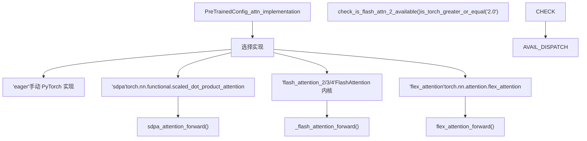

# 注意力机制 (Attention Mechanisms)

相关源文件

-   [docs/source/en/model_doc/kyutai_speech_to_text.md](https://github.com/huggingface/transformers/blob/9a9997fd/docs/source/en/model_doc/kyutai_speech_to_text.md?plain=1)
-   [docs/source/en/model_doc/pp_ocrv5_server_det.md](https://github.com/huggingface/transformers/blob/9a9997fd/docs/source/en/model_doc/pp_ocrv5_server_det.md?plain=1)
-   [src/transformers/activations.py](https://github.com/huggingface/transformers/blob/9a9997fd/src/transformers/activations.py)
-   [src/transformers/image_transforms.py](https://github.com/huggingface/transformers/blob/9a9997fd/src/transformers/image_transforms.py)
-   [src/transformers/image_utils.py](https://github.com/huggingface/transformers/blob/9a9997fd/src/transformers/image_utils.py)
-   [src/transformers/integrations/flash_attention.py](https://github.com/huggingface/transformers/blob/9a9997fd/src/transformers/integrations/flash_attention.py)
-   [src/transformers/integrations/hub_kernels.py](https://github.com/huggingface/transformers/blob/9a9997fd/src/transformers/integrations/hub_kernels.py)
-   [src/transformers/integrations/npu_flash_attention.py](https://github.com/huggingface/transformers/blob/9a9997fd/src/transformers/integrations/npu_flash_attention.py)
-   [src/transformers/integrations/sdpa_attention.py](https://github.com/huggingface/transformers/blob/9a9997fd/src/transformers/integrations/sdpa_attention.py)
-   [src/transformers/masking_utils.py](https://github.com/huggingface/transformers/blob/9a9997fd/src/transformers/masking_utils.py)
-   [src/transformers/modeling_flash_attention_utils.py](https://github.com/huggingface/transformers/blob/9a9997fd/src/transformers/modeling_flash_attention_utils.py)
-   [src/transformers/models/diffllama/modeling_diffllama.py](https://github.com/huggingface/transformers/blob/9a9997fd/src/transformers/models/diffllama/modeling_diffllama.py)
-   [src/transformers/models/diffllama/modular_diffllama.py](https://github.com/huggingface/transformers/blob/9a9997fd/src/transformers/models/diffllama/modular_diffllama.py)
-   [src/transformers/models/kyutai_speech_to_text/__init__.py](https://github.com/huggingface/transformers/blob/9a9997fd/src/transformers/models/kyutai_speech_to_text/__init__.py)
-   [src/transformers/models/kyutai_speech_to_text/configuration_kyutai_speech_to_text.py](https://github.com/huggingface/transformers/blob/9a9997fd/src/transformers/models/kyutai_speech_to_text/configuration_kyutai_speech_to_text.py)
-   [src/transformers/models/kyutai_speech_to_text/convert_kyutai_speech_to_text_to_hf.py](https://github.com/huggingface/transformers/blob/9a9997fd/src/transformers/models/kyutai_speech_to_text/convert_kyutai_speech_to_text_to_hf.py)
-   [src/transformers/models/kyutai_speech_to_text/feature_extraction_kyutai_speech_to_text.py](https://github.com/huggingface/transformers/blob/9a9997fd/src/transformers/models/kyutai_speech_to_text/feature_extraction_kyutai_speech_to_text.py)
-   [src/transformers/models/kyutai_speech_to_text/modeling_kyutai_speech_to_text.py](https://github.com/huggingface/transformers/blob/9a9997fd/src/transformers/models/kyutai_speech_to_text/modeling_kyutai_speech_to_text.py)
-   [src/transformers/models/kyutai_speech_to_text/modular_kyutai_speech_to_text.py](https://github.com/huggingface/transformers/blob/9a9997fd/src/transformers/models/kyutai_speech_to_text/modular_kyutai_speech_to_text.py)
-   [src/transformers/models/mimi/modeling_mimi.py](https://github.com/huggingface/transformers/blob/9a9997fd/src/transformers/models/mimi/modeling_mimi.py)
-   [src/transformers/models/moshi/modeling_moshi.py](https://github.com/huggingface/transformers/blob/9a9997fd/src/transformers/models/moshi/modeling_moshi.py)
-   [src/transformers/models/pp_ocrv5_server_det/__init__.py](https://github.com/huggingface/transformers/blob/9a9997fd/src/transformers/models/pp_ocrv5_server_det/__init__.py)
-   [src/transformers/models/pp_ocrv5_server_det/configuration_pp_ocrv5_server_det.py](https://github.com/huggingface/transformers/blob/9a9997fd/src/transformers/models/pp_ocrv5_server_det/configuration_pp_ocrv5_server_det.py)
-   [src/transformers/models/pp_ocrv5_server_det/image_processing_pp_ocrv5_server_det.py](https://github.com/huggingface/transformers/blob/9a9997fd/src/transformers/models/pp_ocrv5_server_det/image_processing_pp_ocrv5_server_det.py)
-   [src/transformers/models/pp_ocrv5_server_det/modular_pp_ocrv5_server_det.py](https://github.com/huggingface/transformers/blob/9a9997fd/src/transformers/models/pp_ocrv5_server_det/modular_pp_ocrv5_server_det.py)
-   [src/transformers/utils/generic.py](https://github.com/huggingface/transformers/blob/9a9997fd/src/transformers/utils/generic.py)
-   [tests/generation/test_flash_attention_parity.py](https://github.com/huggingface/transformers/blob/9a9997fd/tests/generation/test_flash_attention_parity.py)
-   [tests/models/kyutai_speech_to_text/test_modeling_kyutai_speech_to_text.py](https://github.com/huggingface/transformers/blob/9a9997fd/tests/models/kyutai_speech_to_text/test_modeling_kyutai_speech_to_text.py)
-   [tests/models/pp_ocrv5_server_det/test_modeling_pp_ocrv5_server_det.py](https://github.com/huggingface/transformers/blob/9a9997fd/tests/models/pp_ocrv5_server_det/test_modeling_pp_ocrv5_server_det.py)
-   [tests/pipelines/test_pipelines_table_question_answering.py](https://github.com/huggingface/transformers/blob/9a9997fd/tests/pipelines/test_pipelines_table_question_answering.py)
-   [tests/test_image_transforms.py](https://github.com/huggingface/transformers/blob/9a9997fd/tests/test_image_transforms.py)
-   [tests/utils/test_add_new_model_like.py](https://github.com/huggingface/transformers/blob/9a9997fd/tests/utils/test_add_new_model_like.py)
-   [tests/utils/test_file_utils.py](https://github.com/huggingface/transformers/blob/9a9997fd/tests/utils/test_file_utils.py)
-   [tests/utils/test_generic.py](https://github.com/huggingface/transformers/blob/9a9997fd/tests/utils/test_generic.py)
-   [tests/utils/test_image_utils.py](https://github.com/huggingface/transformers/blob/9a9997fd/tests/utils/test_image_utils.py)
-   [tests/utils/test_masking_utils.py](https://github.com/huggingface/transformers/blob/9a9997fd/tests/utils/test_masking_utils.py)

## 目的与范围 (Purpose and Scope)

本文件详细介绍了 Transformers 库中使用的注意力机制实现和掩码工具 (masking utilities)。内容涵盖：

-   **注意力实现 (Attention Implementations)**：多头注意力 (MHA)、多查询注意力 (MQA) 和组查询注意力 (GQA)。
-   **后端分发系统 (Backend Dispatch System)**：与 SDPA (缩放点积注意力 (Scaled Dot Product Attention))、Flash Attention (第 2、3 和 4 版本) 以及 Flex Attention 的集成。
-   **掩码工具 (Masking Utilities)**：用于创建因果、滑动窗口和填充掩码的 `masking_utils` 框架。
-   **高级模式 (Advanced Patterns)**：差分注意力 (Differential Attention) 和滑动窗口机制。

有关位置嵌入（RoPE、ALiBi）的信息，请参阅 [位置嵌入](/huggingface/transformers/5.3-positional-embeddings)。有关 KV 缓存 (KV-cache) 管理的信息，请参阅 [缓存系统](/huggingface/transformers/4.3-cache-system)。

---

## 注意力后端分发系统 (Attention Backend Dispatch System)

该库通过统一的分发系统支持多种注意力实现。模型根据 `config._attn_implementation`、硬件能力和已安装的依赖项选择后端。

### 注意力后端选择逻辑 (Attention Backend Selection Logic)


**来源**： [src/transformers/modeling_utils.py1024-1050](https://github.com/huggingface/transformers/blob/9a9997fd/src/transformers/modeling_utils.py#L1024-L1050) [src/transformers/modeling_flash_attention_utils.py73-109](https://github.com/huggingface/transformers/blob/9a9997fd/src/transformers/modeling_flash_attention_utils.py#L73-L109) [src/transformers/integrations/sdpa_attention.py40-50](https://github.com/huggingface/transformers/blob/9a9997fd/src/transformers/integrations/sdpa_attention.py#L40-L50)

### SDPA 后端 (`sdpa`)

SDPA 后端利用 `torch.nn.functional.scaled_dot_product_attention`。在现代 PyTorch (≥2.0) 上，它是大多数模型的默认选择。

-   **GQA 支持**：在 PyTorch ≥2.5 中，SDPA 可以使用 `enable_gqa` 标志原生处理组查询注意力 (Grouped-Query Attention) [src/transformers/integrations/sdpa_attention.py57-62](https://github.com/huggingface/transformers/blob/9a9997fd/src/transformers/integrations/sdpa_attention.py#L57-L62)
-   **因果处理 (Causal Handling)**：`is_causal` 标志会根据序列长度和掩码存在情况动态设置，以启用 FlashAttention 或 cuDNN 等硬件特定的优化 [src/transformers/integrations/sdpa_attention.py77-83](https://github.com/huggingface/transformers/blob/9a9997fd/src/transformers/integrations/sdpa_attention.py#L77-L83)
-   **NPU 优化**：在 Ascend NPU 上，掩码被转换为布尔值，以强制使用 `FlashAttentionScore` [src/transformers/integrations/sdpa_attention.py87-91](https://github.com/huggingface/transformers/blob/9a9997fd/src/transformers/integrations/sdpa_attention.py#L87-L91)

**来源**： [src/transformers/integrations/sdpa_attention.py16-105](https://github.com/huggingface/transformers/blob/9a9997fd/src/transformers/integrations/sdpa_attention.py#L16-L105)

### Flash Attention 集成

该库集成了 Flash Attention 第 2、3 和 4 版本。`_flash_attention_forward` 工具管理 Transformers 与 `flash_attn` 包之间的接口。

-   **内核备选 (Kernel Fallbacks)**：如果请求了特定版本但未安装，该库可以推荐社区维护的内核 [src/transformers/modeling_flash_attention_utils.py61-66](https://github.com/huggingface/transformers/blob/9a9997fd/src/transformers/modeling_flash_attention_utils.py#L61-L66)
-   **可变长度支持**：支持 `flash_attn_varlen_func` 以进行无填充 (padding-free) 训练 [src/transformers/modeling_flash_attention_utils.py139-142](https://github.com/huggingface/transformers/blob/9a9997fd/src/transformers/modeling_flash_attention_utils.py#L139-L142)
-   **左上角掩码 (Top-Left Masking)**：旧版 NPU 实现使用特定的左上角对齐的因果掩码 [src/transformers/modeling_flash_attention_utils.py41-47](https://github.com/huggingface/transformers/blob/9a9997fd/src/transformers/modeling_flash_attention_utils.py#L41-L47)

**来源**： [src/transformers/modeling_flash_attention_utils.py131-170](https://github.com/huggingface/transformers/blob/9a9997fd/src/transformers/modeling_flash_attention_utils.py#L131-L170) [src/transformers/integrations/flash_attention.py25-50](https://github.com/huggingface/transformers/blob/9a9997fd/src/transformers/integrations/flash_attention.py#L25-L50)

---

## 注意力实现：MHA, MQA, GQA

该库支持三种主要的头配置，主要通过 `repeat_kv` 工具进行管理。

| 实现 | 描述 | KV 头数量 |
| --- | --- | --- |
| **多头 (Multi-Head, MHA)** | 每个查询头都有唯一的键/值头。 | `num_heads == num_kv_heads` |
| **多查询 (Multi-Query, MQA)** | 所有查询头共享单个键/值头。 | `num_kv_heads == 1` |
| **组查询 (Grouped-Query, GQA)** | 查询头被分组；每个组共享一个 KV 头。 | `1 < num_kv_heads < num_heads` |

### 键值重复 (Key-Value Repetition)

`repeat_kv` 函数扩展 KV 张量以匹配查询头的数量。

```python
def repeat_kv(hidden_states: torch.Tensor, n_rep: int) -> torch.Tensor:
    batch, num_key_value_heads, slen, head_dim = hidden_states.shape
    if n_rep == 1:
        return hidden_states
    hidden_states = hidden_states[:, :, None, :, :].expand(batch, num_key_value_heads, n_rep, slen, head_dim)
    return hidden_states.reshape(batch, num_key_value_heads * n_rep, slen, head_dim)
```
**来源**： [src/transformers/integrations/sdpa_attention.py16-25](https://github.com/huggingface/transformers/blob/9a9997fd/src/transformers/integrations/sdpa_attention.py#L16-L25) [src/transformers/models/mimi/modeling_mimi.py201-210](https://github.com/huggingface/transformers/blob/9a9997fd/src/transformers/models/mimi/modeling_mimi.py#L201-L210)

---

## 掩码工具 (Masking Utilities) (`masking_utils`)

`masking_utils.py` 文件提供了一个功能框架，用于创建复杂的注意力掩码，特别是针对 **Flex Attention**。

### 掩码函数组合 (Mask Function Composition)

掩码被定义为接收 `(batch, head, q_idx, kv_idx)` 并返回布尔值的可调用对象。

-   **`and_masks` / `or_masks`**：组合多个掩码函数（例如：因果掩码 AND 填充掩码） [src/transformers/masking_utils.py46-72](https://github.com/huggingface/transformers/blob/9a9997fd/src/transformers/masking_utils.py#L46-L72)
-   **`sliding_window_overlay`**：将注意力限制在固定距离 `kv_idx > q_idx - sliding_window` 内 [src/transformers/masking_utils.py90-99](https://github.com/huggingface/transformers/blob/9a9997fd/src/transformers/masking_utils.py#L90-L99)
-   **`packed_sequence_mask_function`**：确保标记仅关注打包批次 (packed batch) 中同一子序列内的其他标记 [src/transformers/masking_utils.py162-170](https://github.com/huggingface/transformers/blob/9a9997fd/src/transformers/masking_utils.py#L162-L170)

### Flex Attention 集成

Flex Attention (PyTorch 2.5+) 使用 `BlockMask` 进行稀疏注意力。

```python
from torch.nn.attention.flex_attention import create_block_mask
# 示例：为 Flex Attention 创建滑动窗口因果掩码
mask_fn = sliding_window_causal_mask_function(window_size)
block_mask = create_block_mask(mask_fn, B, H, Q_LEN, KV_LEN)
```
**来源**： [src/transformers/masking_utils.py28-36](https://github.com/huggingface/transformers/blob/9a9997fd/src/transformers/masking_utils.py#L28-L36) [src/transformers/masking_utils.py114-119](https://github.com/huggingface/transformers/blob/9a9997fd/src/transformers/masking_utils.py#L114-L119)

---

## 高级注意力模式 (Advanced Attention Patterns)

### 差分注意力 (Differential Attention) (`DiffLlama`)

差分注意力计算两个独立的注意力图，并取其差值以消除噪声并强化关注重点。

1.  **拆分头 (Split Heads)**：`head_dim` 被拆分为两半 ($d = d/2$) [src/transformers/models/diffllama/modeling_diffllama.py111-112](https://github.com/huggingface/transformers/blob/9a9997fd/src/transformers/models/diffllama/modeling_diffllama.py#L111-L112)
2.  **双 Softmax**：为两半分别计算注意力分数。
3.  **减法**：结果 = $Attn_1 - \lambda \cdot Attn_2$，其中 $\lambda$ 是学习到的标量。

**来源**： [src/transformers/models/diffllama/modeling_diffllama.py23-50](https://github.com/huggingface/transformers/blob/9a9997fd/src/transformers/models/diffllama/modeling_diffllama.py#L23-L50)

### 滑动窗口注意力 (Sliding Window Attention)

用于 **Mistral** 和 **Mimi** 等模型，以在处理长上下文时使每层保持恒定的内存占用。

-   **掩码 (Masking)**：`create_sliding_window_causal_mask` 生成一个位掩码 (bitmask)，其中每行 $i$ 只能看到列 $[i - window\_size, i]$ [src/transformers/masking_utils.py114-119](https://github.com/huggingface/transformers/blob/9a9997fd/src/transformers/masking_utils.py#L114-L119)
-   **Mimi 卷积缓存 (Mimi Conv Cache)**：对于音频流，Mimi 使用 `MimiConv1dPaddingCache` 在处理滑动窗口注意力的同时管理因果卷积状态 [src/transformers/models/mimi/modeling_mimi.py77-105](https://github.com/huggingface/transformers/blob/9a9997fd/src/transformers/models/mimi/modeling_mimi.py#L77-L105)

**来源**： [src/transformers/models/mimi/modeling_mimi.py27-31](https://github.com/huggingface/transformers/blob/9a9997fd/src/transformers/models/mimi/modeling_mimi.py#L27-L31) [src/transformers/masking_utils.py90-101](https://github.com/huggingface/transformers/blob/9a9997fd/src/transformers/masking_utils.py#L90-L101)

---

## 性能与硬件集成 (Performance and Hardware Integration)

### Hub 内核 (Hub Kernels)

`hub_kernels.py` 集成允许 Transformers 从 Hugging Face Hub 动态加载优化的 Triton 或 CUDA 内核。

-   **`use_kernel_forward_from_hub`**：一个装饰器，用高性能内核替换标准层的 `forward` [src/transformers/integrations/hub_kernels.py63-70](https://github.com/huggingface/transformers/blob/9a9997fd/src/transformers/integrations/hub_kernels.py#L63-L70)
-   **支持的层**：包括 `MultiScaleDeformableAttention` (DETR)、`Llama4TextMoe` 以及 `GeluTanh` 等优化的激活函数 [src/transformers/integrations/hub_kernels.py87-100](https://github.com/huggingface/transformers/blob/9a9997fd/src/transformers/integrations/hub_kernels.py#L87-L100) [src/transformers/activations.py30-31](https://github.com/huggingface/transformers/blob/9a9997fd/src/transformers/activations.py#L30-L31)

**来源**： [src/transformers/integrations/hub_kernels.py1-120](https://github.com/huggingface/transformers/blob/9a9997fd/src/transformers/integrations/hub_kernels.py#L1-L120) [src/transformers/activations.py58-75](https://github.com/huggingface/transformers/blob/9a9997fd/src/transformers/activations.py#L58-L75)

### 实现矩阵 (Implementation Matrix)

| 特性 | Eager | SDPA | Flash Attn 2 | Flex Attn |
| --- | --- | --- | --- | --- |
| **训练** | 是 | 是 | 是 | 是 |
| **推理** | 是 | 是 | 是 | 是 |
| **因果掩码** | 手动 | 原生 | 原生 | 原生 |
| **GQA** | `repeat_kv` | 原生 (PT 2.5) | 原生 | 原生 |
| **滑动窗口** | 掩码 | 掩码 | 原生 (有限) | 原生 |

**来源**： [src/transformers/modeling_flash_attention_utils.py73-109](https://github.com/huggingface/transformers/blob/9a9997fd/src/transformers/modeling_flash_attention_utils.py#L73-L109) [src/transformers/integrations/sdpa_attention.py30-38](https://github.com/huggingface/transformers/blob/9a9997fd/src/transformers/integrations/sdpa_attention.py#L30-L38)
