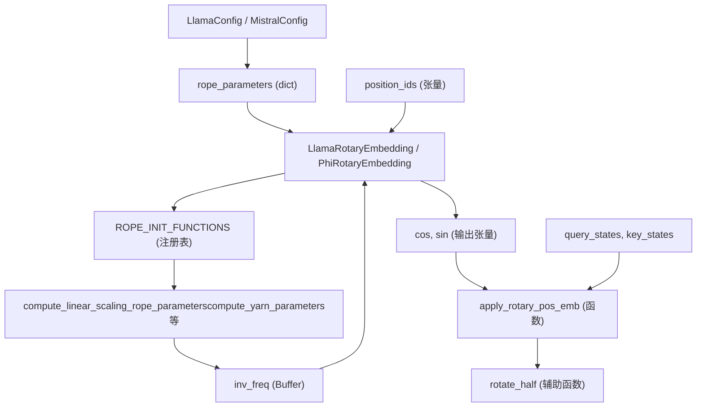
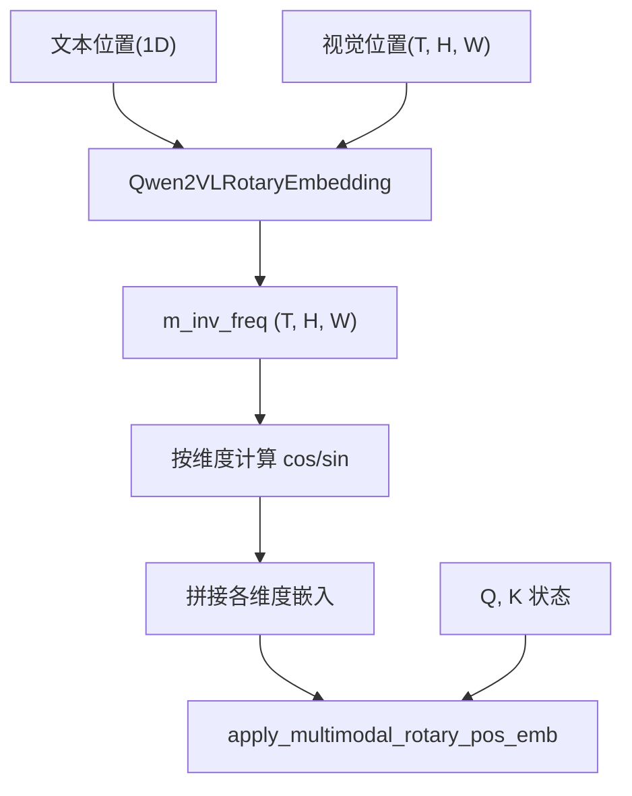

# 位置嵌入 (Positional Embeddings)

相关源文件

-   [src/transformers/modeling_rope_utils.py](https://github.com/huggingface/transformers/blob/9a9997fd/src/transformers/modeling_rope_utils.py)
-   [src/transformers/models/cohere/configuration_cohere.py](https://github.com/huggingface/transformers/blob/9a9997fd/src/transformers/models/cohere/configuration_cohere.py)
-   [src/transformers/models/cohere/modeling_cohere.py](https://github.com/huggingface/transformers/blob/9a9997fd/src/transformers/models/cohere/modeling_cohere.py)
-   [src/transformers/models/cohere/modular_cohere.py](https://github.com/huggingface/transformers/blob/9a9997fd/src/transformers/models/cohere/modular_cohere.py)
-   [src/transformers/models/cohere2/configuration_cohere2.py](https://github.com/huggingface/transformers/blob/9a9997fd/src/transformers/models/cohere2/configuration_cohere2.py)
-   [src/transformers/models/falcon/configuration_falcon.py](https://github.com/huggingface/transformers/blob/9a9997fd/src/transformers/models/falcon/configuration_falcon.py)
-   [src/transformers/models/fuyu/configuration_fuyu.py](https://github.com/huggingface/transformers/blob/9a9997fd/src/transformers/models/fuyu/configuration_fuyu.py)
-   [src/transformers/models/gemma/configuration_gemma.py](https://github.com/huggingface/transformers/blob/9a9997fd/src/transformers/models/gemma/configuration_gemma.py)
-   [src/transformers/models/gemma/modeling_gemma.py](https://github.com/huggingface/transformers/blob/9a9997fd/src/transformers/models/gemma/modeling_gemma.py)
-   [src/transformers/models/gemma2/configuration_gemma2.py](https://github.com/huggingface/transformers/blob/9a9997fd/src/transformers/models/gemma2/configuration_gemma2.py)
-   [src/transformers/models/glm/configuration_glm.py](https://github.com/huggingface/transformers/blob/9a9997fd/src/transformers/models/glm/configuration_glm.py)
-   [src/transformers/models/glm/convert_glm_weights_to_hf.py](https://github.com/huggingface/transformers/blob/9a9997fd/src/transformers/models/glm/convert_glm_weights_to_hf.py)
-   [src/transformers/models/glm/modular_glm.py](https://github.com/huggingface/transformers/blob/9a9997fd/src/transformers/models/glm/modular_glm.py)
-   [src/transformers/models/gpt_neox/configuration_gpt_neox.py](https://github.com/huggingface/transformers/blob/9a9997fd/src/transformers/models/gpt_neox/configuration_gpt_neox.py)
-   [src/transformers/models/helium/configuration_helium.py](https://github.com/huggingface/transformers/blob/9a9997fd/src/transformers/models/helium/configuration_helium.py)
-   [src/transformers/models/instructblip/configuration_instructblip.py](https://github.com/huggingface/transformers/blob/9a9997fd/src/transformers/models/instructblip/configuration_instructblip.py)
-   [src/transformers/models/instructblipvideo/configuration_instructblipvideo.py](https://github.com/huggingface/transformers/blob/9a9997fd/src/transformers/models/instructblipvideo/configuration_instructblipvideo.py)
-   [src/transformers/models/llama/configuration_llama.py](https://github.com/huggingface/transformers/blob/9a9997fd/src/transformers/models/llama/configuration_llama.py)
-   [src/transformers/models/llama/modeling_llama.py](https://github.com/huggingface/transformers/blob/9a9997fd/src/transformers/models/llama/modeling_llama.py)
-   [src/transformers/models/mistral/configuration_mistral.py](https://github.com/huggingface/transformers/blob/9a9997fd/src/transformers/models/mistral/configuration_mistral.py)
-   [src/transformers/models/mistral/modeling_mistral.py](https://github.com/huggingface/transformers/blob/9a9997fd/src/transformers/models/mistral/modeling_mistral.py)
-   [src/transformers/models/mixtral/configuration_mixtral.py](https://github.com/huggingface/transformers/blob/9a9997fd/src/transformers/models/mixtral/configuration_mixtral.py)
-   [src/transformers/models/mixtral/modeling_mixtral.py](https://github.com/huggingface/transformers/blob/9a9997fd/src/transformers/models/mixtral/modeling_mixtral.py)
-   [src/transformers/models/olmo/configuration_olmo.py](https://github.com/huggingface/transformers/blob/9a9997fd/src/transformers/models/olmo/configuration_olmo.py)
-   [src/transformers/models/olmo/modeling_olmo.py](https://github.com/huggingface/transformers/blob/9a9997fd/src/transformers/models/olmo/modeling_olmo.py)
-   [src/transformers/models/olmo/modular_olmo.py](https://github.com/huggingface/transformers/blob/9a9997fd/src/transformers/models/olmo/modular_olmo.py)
-   [src/transformers/models/olmo2/configuration_olmo2.py](https://github.com/huggingface/transformers/blob/9a9997fd/src/transformers/models/olmo2/configuration_olmo2.py)
-   [src/transformers/models/olmo2/modular_olmo2.py](https://github.com/huggingface/transformers/blob/9a9997fd/src/transformers/models/olmo2/modular_olmo2.py)
-   [src/transformers/models/paligemma/configuration_paligemma.py](https://github.com/huggingface/transformers/blob/9a9997fd/src/transformers/models/paligemma/configuration_paligemma.py)
-   [src/transformers/models/persimmon/configuration_persimmon.py](https://github.com/huggingface/transformers/blob/9a9997fd/src/transformers/models/persimmon/configuration_persimmon.py)
-   [src/transformers/models/persimmon/modeling_persimmon.py](https://github.com/huggingface/transformers/blob/9a9997fd/src/transformers/models/persimmon/modeling_persimmon.py)
-   [src/transformers/models/phi/configuration_phi.py](https://github.com/huggingface/transformers/blob/9a9997fd/src/transformers/models/phi/configuration_phi.py)
-   [src/transformers/models/phi/modeling_phi.py](https://github.com/huggingface/transformers/blob/9a9997fd/src/transformers/models/phi/modeling_phi.py)
-   [src/transformers/models/phi3/configuration_phi3.py](https://github.com/huggingface/transformers/blob/9a9997fd/src/transformers/models/phi3/configuration_phi3.py)
-   [src/transformers/models/phi3/modeling_phi3.py](https://github.com/huggingface/transformers/blob/9a9997fd/src/transformers/models/phi3/modeling_phi3.py)
-   [src/transformers/models/phi3/modular_phi3.py](https://github.com/huggingface/transformers/blob/9a9997fd/src/transformers/models/phi3/modular_phi3.py)
-   [src/transformers/models/qwen2/modeling_qwen2.py](https://github.com/huggingface/transformers/blob/9a9997fd/src/transformers/models/qwen2/modeling_qwen2.py)
-   [src/transformers/models/qwen2_moe/modeling_qwen2_moe.py](https://github.com/huggingface/transformers/blob/9a9997fd/src/transformers/models/qwen2_moe/modeling_qwen2_moe.py)
-   [src/transformers/models/stablelm/configuration_stablelm.py](https://github.com/huggingface/transformers/blob/9a9997fd/src/transformers/models/stablelm/configuration_stablelm.py)
-   [src/transformers/models/stablelm/modeling_stablelm.py](https://github.com/huggingface/transformers/blob/9a9997fd/src/transformers/models/stablelm/modeling_stablelm.py)
-   [src/transformers/models/starcoder2/modeling_starcoder2.py](https://github.com/huggingface/transformers/blob/9a9997fd/src/transformers/models/starcoder2/modeling_starcoder2.py)
-   [src/transformers/utils/attention_visualizer.py](https://github.com/huggingface/transformers/blob/9a9997fd/src/transformers/utils/attention_visualizer.py)
-   [src/transformers/utils/auto_docstring.py](https://github.com/huggingface/transformers/blob/9a9997fd/src/transformers/utils/auto_docstring.py)
-   [tests/models/falcon/test_modeling_falcon.py](https://github.com/huggingface/transformers/blob/9a9997fd/tests/models/falcon/test_modeling_falcon.py)
-   [tests/models/persimmon/test_modeling_persimmon.py](https://github.com/huggingface/transformers/blob/9a9997fd/tests/models/persimmon/test_modeling_persimmon.py)
-   [tests/models/phi/test_modeling_phi.py](https://github.com/huggingface/transformers/blob/9a9997fd/tests/models/phi/test_modeling_phi.py)
-   [tests/models/stablelm/test_modeling_stablelm.py](https://github.com/huggingface/transformers/blob/9a9997fd/tests/models/stablelm/test_modeling_stablelm.py)
-   [tests/utils/test_attention_visualizer.py](https://github.com/huggingface/transformers/blob/9a9997fd/tests/utils/test_attention_visualizer.py)
-   [tests/utils/test_modeling_rope_utils.py](https://github.com/huggingface/transformers/blob/9a9997fd/tests/utils/test_modeling_rope_utils.py)
-   [utils/check_docstrings.py](https://github.com/huggingface/transformers/blob/9a9997fd/utils/check_docstrings.py)

本文件涵盖了 `transformers` 库中使用的位置嵌入系统，用于将序列位置信息编码进 Transformer 模型中。重点关注 **旋转位置嵌入 (Rotary Position Embeddings, RoPE)** 及其变体，这是现代仅解码器语言模型 (Decoder-only LMs) 和视觉-语言模型 (VLMs) 中使用的主流位置编码机制。

有关使用这些嵌入的注意力机制，请参阅 [注意力机制](/huggingface/transformers/5.2-attention-mechanisms)。有关使用这些嵌入的模型架构，请参阅 [仅解码器语言模型](/huggingface/transformers/5.1-decoder-only-language-models) 和 [多模态视觉-语言模型](/huggingface/transformers/5.7-multimodal-vision-language-models)。

## 概述 (Overview)

位置嵌入使 Transformer 模型能够捕获输入数据的序列特性。与循环架构不同，Transformer 并行处理所有标记 (tokens)，因此需要显式的位置信息。该库实现了几种位置编码方案：

-   **旋转位置嵌入 (Rotary Position Embeddings, RoPE)**：LLama, Mistral, Qwen, Gemma 和大多数现代模型使用的主要方法 [src/transformers/models/llama/modeling_llama.py73-135](https://github.com/huggingface/transformers/blob/9a9997fd/src/transformers/models/llama/modeling_llama.py#L73-L135)
-   **RoPE 缩放策略 (RoPE Scaling Strategies)**：用于处理长于预训练上下文长度的序列扩展，包括 Linear, Dynamic NTK, YaRN 和 LongRoPE [src/transformers/modeling_rope_utils.py132-700](https://github.com/huggingface/transformers/blob/9a9997fd/src/transformers/modeling_rope_utils.py#L132-L700)
-   **多模态 RoPE (Multimodal RoPE, MRoPE)**：为 Qwen2-VL 等视觉-语言模型编码 3D 位置信息（时间、垂直和水平） [src/transformers/models/qwen2_vl/modeling_qwen2_vl.py109-226](https://github.com/huggingface/transformers/blob/9a9997fd/src/transformers/models/qwen2_vl/modeling_qwen2_vl.py#L109-L226)
-   **滑动窗口注意力掩码 (Sliding Window Attention Masking)**：将注意力限制在标记的局部窗口内，通常在 Mistral 和 Gemma2 等模型中与 RoPE 配合使用 [src/transformers/models/mistral/modeling_mistral.py17-32](https://github.com/huggingface/transformers/blob/9a9997fd/src/transformers/models/mistral/modeling_mistral.py#L17-L32)

来源： [src/transformers/models/llama/modeling_llama.py73-135](https://github.com/huggingface/transformers/blob/9a9997fd/src/transformers/models/llama/modeling_llama.py#L73-L135) [src/transformers/modeling_rope_utils.py1-900](https://github.com/huggingface/transformers/blob/9a9997fd/src/transformers/modeling_rope_utils.py#L1-L900) [src/transformers/models/mistral/modeling_mistral.py17-32](https://github.com/huggingface/transformers/blob/9a9997fd/src/transformers/models/mistral/modeling_mistral.py#L17-L32)

## RoPE 架构 (RoPE Architecture)

核心 RoPE 实现跨所有仅解码器模型遵循一致的模式。每个模型都有一个 `RotaryEmbedding` 类（例如 `LlamaRotaryEmbedding`, `MistralRotaryEmbedding`），它们继承通用行为，但可以根据不同架构进行自定义。

### 代码实体空间到自然语言空间 (Code Entity Space to Natural Language Space)

下图将参与 RoPE 初始化和应用的各个代码实体映射到它们在 Transformer 架构中的逻辑角色。

标题：RoPE 系统实体映射 (RoPE System Entity Mapping)


来源： [src/transformers/models/llama/modeling_llama.py73-167](https://github.com/huggingface/transformers/blob/9a9997fd/src/transformers/models/llama/modeling_llama.py#L73-L167) [src/transformers/modeling_rope_utils.py33-130](https://github.com/huggingface/transformers/blob/9a9997fd/src/transformers/modeling_rope_utils.py#L33-L130) [src/transformers/models/mistral/modeling_mistral.py122-160](https://github.com/huggingface/transformers/blob/9a9997fd/src/transformers/models/mistral/modeling_mistral.py#L122-L160)

## 核心 RoPE 实现 (Core RoPE Implementation)

### RotaryEmbedding 类 (RotaryEmbedding Class)

`RotaryEmbedding` 类管理逆频率 (inverse frequencies) 的预计算以及余弦/正弦 (cosine/sine) 分量的生成。

**关键组件：**

-   `inv_freq`：注册为非持久性缓冲区 (non-persistent buffer) 的逆频率张量 [src/transformers/models/llama/modeling_llama.py89](https://github.com/huggingface/transformers/blob/9a9997fd/src/transformers/models/llama/modeling_llama.py#L89-L89)
-   `rope_type`：指定 RoPE 变体（default, linear, dynamic, yarn, longrope 等） [src/transformers/models/llama/modeling_llama.py83](https://github.com/huggingface/transformers/blob/9a9997fd/src/transformers/models/llama/modeling_llama.py#L83-L83)
-   `attention_scaling`：应用于 cos/sin 的后处理缩放因子 [src/transformers/models/llama/modeling_llama.py87](https://github.com/huggingface/transformers/blob/9a9997fd/src/transformers/models/llama/modeling_llama.py#L87-L87)
-   `@dynamic_rope_update`：一个装饰器，用于为动态 RoPE 类型启用频率的即时重新计算 [src/transformers/modeling_rope_utils.py33-129](https://github.com/huggingface/transformers/blob/9a9997fd/src/transformers/modeling_rope_utils.py#L33-L129)

### 前向传播与旋转 (Forward Pass and Rotation)

前向传播计算当前序列位置的旋转嵌入：

1.  **频率计算**：`freqs = (inv_freq @ position_ids).transpose(1, 2)` [src/transformers/models/llama/modeling_llama.py130](https://github.com/huggingface/transformers/blob/9a9997fd/src/transformers/models/llama/modeling_llama.py#L130-L130)
2.  **嵌入生成**：`emb = torch.cat((freqs, freqs), dim=-1)`，接着应用 `.cos()` 和 `.sin()` [src/transformers/models/llama/modeling_llama.py131-133](https://github.com/huggingface/transformers/blob/9a9997fd/src/transformers/models/llama/modeling_llama.py#L131-L133)
3.  **应用**：`apply_rotary_pos_emb` 函数使用公式 `(q * cos) + (rotate_half(q) * sin)` 将旋转应用于查询和键状态 [src/transformers/models/mistral/modeling_mistral.py79-80](https://github.com/huggingface/transformers/blob/9a9997fd/src/transformers/models/mistral/modeling_mistral.py#L79-L80)

`rotate_half` 函数交换隐藏维度的两半并取反：

```python
def rotate_half(x):
    x1 = x[..., : x.shape[-1] // 2]
    x2 = x[..., x.shape[-1] // 2 :]
    return torch.cat((-x2, x1), dim=-1)
```
来源： [src/transformers/models/llama/modeling_llama.py38-142](https://github.com/huggingface/transformers/blob/9a9997fd/src/transformers/models/llama/modeling_llama.py#L138-L142) [src/transformers/models/mistral/modeling_mistral.py51-81](https://github.com/huggingface/transformers/blob/9a9997fd/src/transformers/models/mistral/modeling_mistral.py#L51-L81)

## RoPE 缩放与动态更新 (RoPE Scaling and Dynamic Updates)

### 缩放策略 (Scaling Strategies)

该库通过 `modeling_rope_utils.py` 中的 `ROPE_INIT_FUNCTIONS` 支持多种缩放策略 [src/transformers/modeling_rope_utils.py232-270](https://github.com/huggingface/transformers/blob/9a9997fd/src/transformers/modeling_rope_utils.py#L232-L270)：

| 策略 | 初始化函数 | 关键参数 |
| --- | --- | --- |
| **线性 (Linear)** | `_compute_linear_scaling_rope_parameters` | `factor` |
| **动态 NTK (Dynamic NTK)** | `_compute_dynamic_ntk_parameters` | `factor` |
| **YaRN** | `_compute_yarn_parameters` | `factor`, `beta_fast`, `beta_slow` |
| **LongRoPE** | `_compute_longrope_parameters` | `short_factor`, `long_factor` |
| **Llama 3** | `_compute_llama3_parameters` | `low_freq_factor`, `high_freq_factor` |

### dynamic_rope_update 装饰器 (The dynamic_rope_update Decorator)

`dynamic_rope_update` 装饰器封装了 RoPE 类的 `forward` 方法。它拦截调用以检查当前序列长度是否超过缓存的 `max_seq_len_cached` [src/transformers/modeling_rope_utils.py99](https://github.com/huggingface/transformers/blob/9a9997fd/src/transformers/modeling_rope_utils.py#L99-L99)

如果检测到增长，它会触发：

-   `dynamic_frequency_update`：使用缩放逻辑重新计算 `inv_freq` [src/transformers/modeling_rope_utils.py81-118](https://github.com/huggingface/transformers/blob/9a9997fd/src/transformers/modeling_rope_utils.py#L81-L118)
-   `longrope_frequency_update`：专门针对 LongRoPE，它根据 `original_max_position_embeddings` 在短期和长期因子 (factors) 之间切换 [src/transformers/modeling_rope_utils.py46-80](https://github.com/huggingface/transformers/blob/9a9997fd/src/transformers/modeling_rope_utils.py#L46-L80)

来源： [src/transformers/modeling_rope_utils.py33-230](https://github.com/huggingface/transformers/blob/9a9997fd/src/transformers/modeling_rope_utils.py#L33-L230) [src/transformers/models/llama/modeling_llama.py123](https://github.com/huggingface/transformers/blob/9a9997fd/src/transformers/models/llama/modeling_llama.py#L123-L123)

## 多模态 RoPE (Multimodal RoPE, MRoPE)

对于视觉-语言模型（例如 Qwen2-VL），RoPE 必须考虑空间维度。MRoPE 通过为时间 (T)、垂直 (H) 和水平 (W) 位置计算嵌入来扩展标准 RoPE [src/transformers/models/qwen2_vl/modeling_qwen2_vl.py109-226](https://github.com/huggingface/transformers/blob/9a9997fd/src/transformers/models/qwen2_vl/modeling_qwen2_vl.py#L109-L226)

### MRoPE 数据流 (MRoPE Data Flow)

标题：多模态 RoPE 数据流 (Multimodal RoPE Data Flow)


来源： [src/transformers/models/qwen2_vl/modeling_qwen2_vl.py109-226](https://github.com/huggingface/transformers/blob/9a9997fd/src/transformers/models/qwen2_vl/modeling_qwen2_vl.py#L109-L226)

## 滑动窗口注意力掩码 (Sliding Window Attention Masking)

几种架构 (Mistral, Mixtral, Gemma2, Qwen2-MoE) 利用滑动窗口注意力通过限制注意力跨度来管理长序列 [src/transformers/models/mistral/modeling_mistral.py17](https://github.com/huggingface/transformers/blob/9a9997fd/src/transformers/models/mistral/modeling_mistral.py#L17-L17)

### 掩码工具 (Masking Utilities)

-   `create_sliding_window_causal_mask`：生成一个将注意力限制在大小为 `sliding_window` 的窗口内的掩码 [src/transformers/models/mistral/modeling_mistral.py17](https://github.com/huggingface/transformers/blob/9a9997fd/src/transformers/models/mistral/modeling_mistral.py#L17-L17)
-   **混合掩码 (Hybrid Masking)**：像 Gemma2 这样的模型将滑动窗口层与全注意力层交错。`Gemma2Model` 预计算两种掩码类型，并将它们存储在由层的 `attention_type` 索引的映射中 [src/transformers/models/gemma2/modeling_gemma2.py430-467](https://github.com/huggingface/transformers/blob/9a9997fd/src/transformers/models/gemma2/modeling_gemma2.py#L430-L467)

来源： [src/transformers/models/mistral/modeling_mistral.py17-32](https://github.com/huggingface/transformers/blob/9a9997fd/src/transformers/models/mistral/modeling_mistral.py#L17-L32) [src/transformers/models/gemma2/modeling_gemma2.py305-467](https://github.com/huggingface/transformers/blob/9a9997fd/src/transformers/models/gemma2/modeling_gemma2.py#L305-L467) [src/transformers/models/mixtral/modeling_mixtral.py43-50](https://github.com/huggingface/transformers/blob/9a9997fd/src/transformers/models/mixtral/modeling_mixtral.py#L43-L50)

## 配置与 rope_scaling (Configuration and rope_scaling)

RoPE 通过模型配置中的 `rope_parameters` 字典进行配置。

### rope_scaling 配置 (rope_scaling Configurations)

`rope_scaling` (或 `rope_parameters["rope_type"]`) 决定了序列长度扩展的插值方法：

```python
# 示例：Llama 3 rope_parameters
rope_parameters = {
    "rope_type": "llama3",
    "factor": 8.0,
    "low_freq_factor": 1.0,
    "high_freq_factor": 4.0,
    "original_max_position_embeddings": 8192,
    "rope_theta": 500000.0
}
```

### 部分旋转因子 (Partial Rotary Factor)

像 Phi 和 Persimmon 这样的模型仅将 RoPE 应用于 `head_dim` 的一部分。这由 `partial_rotary_factor`（例如 Phi 为 0.4）控制，它缩放用于频率计算的维度：`dim = int(head_dim * partial_rotary_factor)` [src/transformers/models/phi/modeling_phi.py72-74](https://github.com/huggingface/transformers/blob/9a9997fd/src/transformers/models/phi/modeling_phi.py#L72-L74) [src/transformers/models/persimmon/modeling_persimmon.py97-99](https://github.com/huggingface/transformers/blob/9a9997fd/src/transformers/models/persimmon/modeling_persimmon.py#L97-L99)

来源： [src/transformers/models/llama/configuration_llama.py75-100](https://github.com/huggingface/transformers/blob/9a9997fd/src/transformers/models/llama/configuration_llama.py#L75-L100) [src/transformers/models/phi/modeling_phi.py71-82](https://github.com/huggingface/transformers/blob/9a9997fd/src/transformers/models/phi/modeling_phi.py#L71-L82) [src/transformers/modeling_rope_utils.py151-155](https://github.com/huggingface/transformers/blob/9a9997fd/src/transformers/modeling_rope_utils.py#L151-L155)
