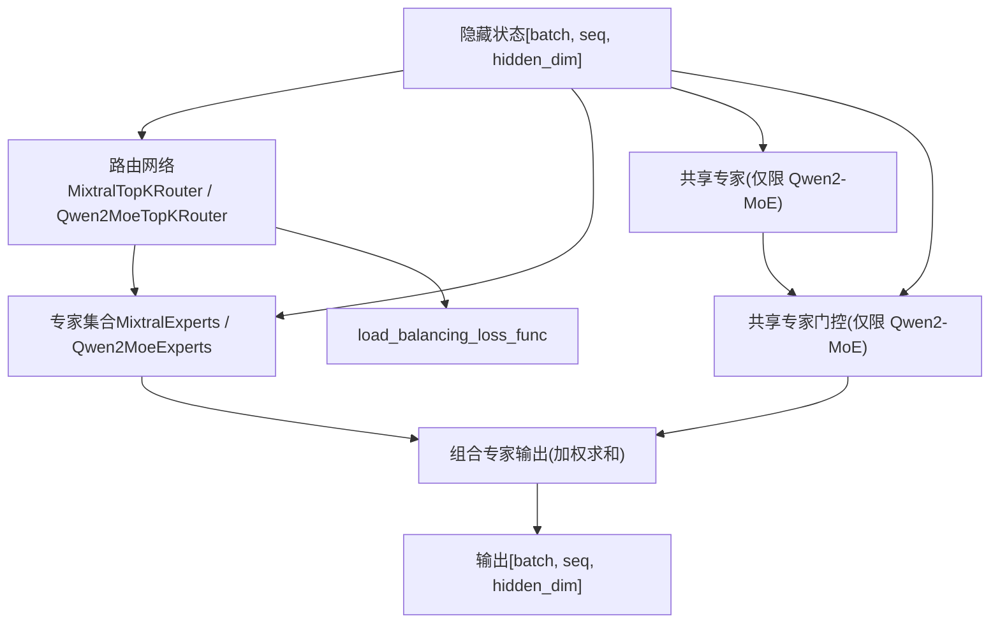
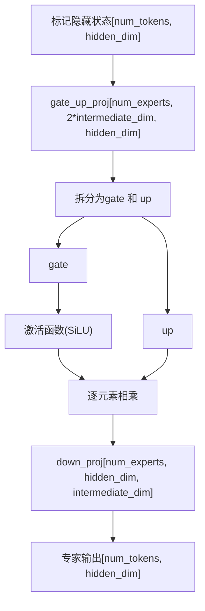
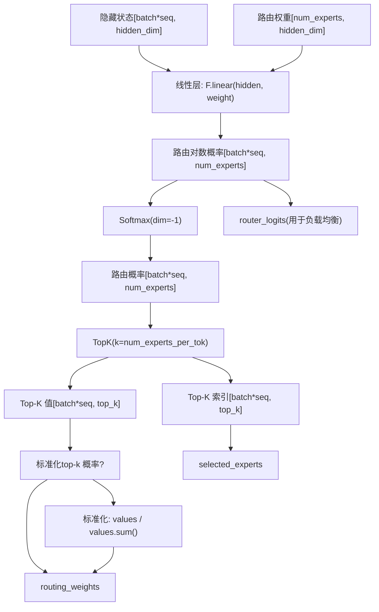

# 混合专家架构 (Mixture-of-Experts Architecture)

相关源文件

-   [docs/source/en/model_doc/granitemoehybrid.md](https://github.com/huggingface/transformers/blob/9a9997fd/docs/source/en/model_doc/granitemoehybrid.md?plain=1)
-   [docs/source/en/weightconverter.md](https://github.com/huggingface/transformers/blob/9a9997fd/docs/source/en/weightconverter.md?plain=1)
-   [examples/3D_parallel.py](https://github.com/huggingface/transformers/blob/9a9997fd/examples/3D_parallel.py)
-   [examples/pytorch/3d_parallel_checks.py](https://github.com/huggingface/transformers/blob/9a9997fd/examples/pytorch/3d_parallel_checks.py)
-   [examples/pytorch/context_parallel.py](https://github.com/huggingface/transformers/blob/9a9997fd/examples/pytorch/context_parallel.py)
-   [src/transformers/integrations/moe.py](https://github.com/huggingface/transformers/blob/9a9997fd/src/transformers/integrations/moe.py)
-   [src/transformers/integrations/tensor_parallel.py](https://github.com/huggingface/transformers/blob/9a9997fd/src/transformers/integrations/tensor_parallel.py)
-   [src/transformers/modeling_layers.py](https://github.com/huggingface/transformers/blob/9a9997fd/src/transformers/modeling_layers.py)
-   [src/transformers/models/bamba/modeling_bamba.py](https://github.com/huggingface/transformers/blob/9a9997fd/src/transformers/models/bamba/modeling_bamba.py)
-   [src/transformers/models/bamba/modular_bamba.py](https://github.com/huggingface/transformers/blob/9a9997fd/src/transformers/models/bamba/modular_bamba.py)
-   [src/transformers/models/cohere/modeling_cohere.py](https://github.com/huggingface/transformers/blob/9a9997fd/src/transformers/models/cohere/modeling_cohere.py)
-   [src/transformers/models/dbrx/modeling_dbrx.py](https://github.com/huggingface/transformers/blob/9a9997fd/src/transformers/models/dbrx/modeling_dbrx.py)
-   [src/transformers/models/falcon_h1/modeling_falcon_h1.py](https://github.com/huggingface/transformers/blob/9a9997fd/src/transformers/models/falcon_h1/modeling_falcon_h1.py)
-   [src/transformers/models/falcon_h1/modular_falcon_h1.py](https://github.com/huggingface/transformers/blob/9a9997fd/src/transformers/models/falcon_h1/modular_falcon_h1.py)
-   [src/transformers/models/gemma/modeling_gemma.py](https://github.com/huggingface/transformers/blob/9a9997fd/src/transformers/models/gemma/modeling_gemma.py)
-   [src/transformers/models/granitemoe/modeling_granitemoe.py](https://github.com/huggingface/transformers/blob/9a9997fd/src/transformers/models/granitemoe/modeling_granitemoe.py)
-   [src/transformers/models/granitemoehybrid/modeling_granitemoehybrid.py](https://github.com/huggingface/transformers/blob/9a9997fd/src/transformers/models/granitemoehybrid/modeling_granitemoehybrid.py)
-   [src/transformers/models/granitemoehybrid/modular_granitemoehybrid.py](https://github.com/huggingface/transformers/blob/9a9997fd/src/transformers/models/granitemoehybrid/modular_granitemoehybrid.py)
-   [src/transformers/models/granitemoeshared/modeling_granitemoeshared.py](https://github.com/huggingface/transformers/blob/9a9997fd/src/transformers/models/granitemoeshared/modeling_granitemoeshared.py)
-   [src/transformers/models/granitemoeshared/modular_granitemoeshared.py](https://github.com/huggingface/transformers/blob/9a9997fd/src/transformers/models/granitemoeshared/modular_granitemoeshared.py)
-   [src/transformers/models/jamba/modeling_jamba.py](https://github.com/huggingface/transformers/blob/9a9997fd/src/transformers/models/jamba/modeling_jamba.py)
-   [src/transformers/models/jamba/modular_jamba.py](https://github.com/huggingface/transformers/blob/9a9997fd/src/transformers/models/jamba/modular_jamba.py)
-   [src/transformers/models/jetmoe/modeling_jetmoe.py](https://github.com/huggingface/transformers/blob/9a9997fd/src/transformers/models/jetmoe/modeling_jetmoe.py)
-   [src/transformers/models/llama/modeling_llama.py](https://github.com/huggingface/transformers/blob/9a9997fd/src/transformers/models/llama/modeling_llama.py)
-   [src/transformers/models/mamba2/configuration_mamba2.py](https://github.com/huggingface/transformers/blob/9a9997fd/src/transformers/models/mamba2/configuration_mamba2.py)
-   [src/transformers/models/mamba2/modeling_mamba2.py](https://github.com/huggingface/transformers/blob/9a9997fd/src/transformers/models/mamba2/modeling_mamba2.py)
-   [src/transformers/models/mistral/modeling_mistral.py](https://github.com/huggingface/transformers/blob/9a9997fd/src/transformers/models/mistral/modeling_mistral.py)
-   [src/transformers/models/mixtral/modeling_mixtral.py](https://github.com/huggingface/transformers/blob/9a9997fd/src/transformers/models/mixtral/modeling_mixtral.py)
-   [src/transformers/models/olmo/modeling_olmo.py](https://github.com/huggingface/transformers/blob/9a9997fd/src/transformers/models/olmo/modeling_olmo.py)
-   [src/transformers/models/olmoe/modeling_olmoe.py](https://github.com/huggingface/transformers/blob/9a9997fd/src/transformers/models/olmoe/modeling_olmoe.py)
-   [src/transformers/models/persimmon/modeling_persimmon.py](https://github.com/huggingface/transformers/blob/9a9997fd/src/transformers/models/persimmon/modeling_persimmon.py)
-   [src/transformers/models/phi/modeling_phi.py](https://github.com/huggingface/transformers/blob/9a9997fd/src/transformers/models/phi/modeling_phi.py)
-   [src/transformers/models/phi3/modeling_phi3.py](https://github.com/huggingface/transformers/blob/9a9997fd/src/transformers/models/phi3/modeling_phi3.py)
-   [src/transformers/models/phimoe/modeling_phimoe.py](https://github.com/huggingface/transformers/blob/9a9997fd/src/transformers/models/phimoe/modeling_phimoe.py)
-   [src/transformers/models/qwen2/modeling_qwen2.py](https://github.com/huggingface/transformers/blob/9a9997fd/src/transformers/models/qwen2/modeling_qwen2.py)
-   [src/transformers/models/qwen2_moe/modeling_qwen2_moe.py](https://github.com/huggingface/transformers/blob/9a9997fd/src/transformers/models/qwen2_moe/modeling_qwen2_moe.py)
-   [src/transformers/models/stablelm/modeling_stablelm.py](https://github.com/huggingface/transformers/blob/9a9997fd/src/transformers/models/stablelm/modeling_stablelm.py)
-   [src/transformers/models/starcoder2/modeling_starcoder2.py](https://github.com/huggingface/transformers/blob/9a9997fd/src/transformers/models/starcoder2/modeling_starcoder2.py)
-   [src/transformers/models/zamba/modeling_zamba.py](https://github.com/huggingface/transformers/blob/9a9997fd/src/transformers/models/zamba/modeling_zamba.py)
-   [src/transformers/models/zamba2/configuration_zamba2.py](https://github.com/huggingface/transformers/blob/9a9997fd/src/transformers/models/zamba2/configuration_zamba2.py)
-   [src/transformers/models/zamba2/modeling_zamba2.py](https://github.com/huggingface/transformers/blob/9a9997fd/src/transformers/models/zamba2/modeling_zamba2.py)
-   [src/transformers/models/zamba2/modular_zamba2.py](https://github.com/huggingface/transformers/blob/9a9997fd/src/transformers/models/zamba2/modular_zamba2.py)
-   [tests/models/deepseek_vl/test_modeling_deepseek_vl.py](https://github.com/huggingface/transformers/blob/9a9997fd/tests/models/deepseek_vl/test_modeling_deepseek_vl.py)
-   [tests/models/deepseek_vl_hybrid/test_modeling_deepseek_vl_hybrid.py](https://github.com/huggingface/transformers/blob/9a9997fd/tests/models/deepseek_vl_hybrid/test_modeling_deepseek_vl_hybrid.py)
-   [tests/models/mamba2/test_modeling_mamba2.py](https://github.com/huggingface/transformers/blob/9a9997fd/tests/models/mamba2/test_modeling_mamba2.py)
-   [tests/tensor_parallel/test_tensor_parallel.py](https://github.com/huggingface/transformers/blob/9a9997fd/tests/tensor_parallel/test_tensor_parallel.py)
-   [tests/vlm_tester.py](https://github.com/huggingface/transformers/blob/9a9997fd/tests/vlm_tester.py)

本文件介绍了 Transformers 库中的混合专家 (Mixture-of-Experts, MoE) 架构实现，重点关注稀疏专家路由 (sparse expert routing)、专家权重管理、负载均衡机制以及像 Jamba 这样的 MoE-SSM 混合模型。有关通用仅解码器模型架构，请参阅 [5.1](https://github.com/huggingface/transformers/blob/9a9997fd/5.1)。有关 MoE 模型中使用的注意力机制，请参阅 [5.2](https://github.com/huggingface/transformers/blob/9a9997fd/5.2)。

## 概述 (Overview)

混合专家 (Mixture-of-Experts) 通过为每个标记 (token) 仅激活专家网络的子集，使得在保持计算成本亚线性增长的同时扩展模型容量。该库在 Mixtral、Qwen2-MoE 和 Jamba 等模型中实现了 MoE，在这些模型中，传统的 MLP 前馈层被替换为包含多个专家网络和路由机制的稀疏 MoE 块。

核心 MoE 组件包括：

-   **专家网络 (Expert networks)**：以前馈层集合的形式存储为 3D 参数张量或 `nn.ModuleList`。
-   **路由网络 (Router networks)**：选择要激活哪些专家的 top-k 门控机制。
-   **负载均衡 (Load balancing)**：用于鼓励专家利用率均匀分布的辅助损失函数。
-   **混合层 (Hybrid Layers)**：在 Jamba/Zamba 架构中与状态空间模型 (SSM)（如 Mamba）集成。

---

## MoE 块架构 (MoE Block Architecture)


**来源**： [src/transformers/models/mixtral/modeling_mixtral.py119-136](https://github.com/huggingface/transformers/blob/9a9997fd/src/transformers/models/mixtral/modeling_mixtral.py#L119-L136) [src/transformers/models/qwen2_moe/modeling_qwen2_moe.py355-375](https://github.com/huggingface/transformers/blob/9a9997fd/src/transformers/models/qwen2_moe/modeling_qwen2_moe.py#L355-L375) [src/transformers/models/jamba/modeling_jamba.py1410-1430](https://github.com/huggingface/transformers/blob/9a9997fd/src/transformers/models/jamba/modeling_jamba.py#L1410-L1430)

---

## 专家网络与权重管理 (Expert Networks and Weight Management)

专家以存储在 3D 张量中的前馈权重集合的形式实现，以实现高效的批处理计算。

### 专家参数结构 (Expert Parameter Structure)


### MixtralExperts 实现

`MixtralExperts` 类将所有专家权重存储为 3D 张量，并通过将标记路由到相应的专家来处理它们。

| 组件 | 形状 | 描述 |
| --- | --- | --- |
| `gate_up_proj` | `[num_experts, 2*intermediate_size, hidden_size]` | 融合的门控 (gate) 和上投影 (up projection) 权重 |
| `down_proj` | `[num_experts, hidden_size, intermediate_size]` | 下投影 (down projection) 权重 |
| `num_experts` | 标量 | 专家总数（例如 Mixtral-8x7B 为 8 个） |

**前向传播算法 (Forward Pass Algorithm)** [src/transformers/models/mixtral/modeling_mixtral.py74-98](https://github.com/huggingface/transformers/blob/9a9997fd/src/transformers/models/mixtral/modeling_mixtral.py#L74-L98)：

1.  从 `top_k_index` 创建 One-hot 掩码，以识别哪些标记分配给哪些专家。
2.  遍历至少分配了一个标记的专家 (`expert_hit`)。
3.  对于每个专家，使用掩码提取分配的标记。
4.  应用专家计算：`down_proj(act_fn(gate) * up)`，其中 `gate, up = gate_up_proj.chunk(2)`。
5.  通过路由权重对输出进行加权，并通过 `index_add_` 进行累加。

**来源**： [src/transformers/models/mixtral/modeling_mixtral.py62-99](https://github.com/huggingface/transformers/blob/9a9997fd/src/transformers/models/mixtral/modeling_mixtral.py#L62-L99) [src/transformers/models/qwen2_moe/modeling_qwen2_moe.py294-332](https://github.com/huggingface/transformers/blob/9a9997fd/src/transformers/models/qwen2_moe/modeling_qwen2_moe.py#L294-L332)

---

## 路由机制 (Routing Mechanisms)

### Top-K 路由架构 (Top-K Router Architecture)


### MixtralTopKRouter

[src/transformers/models/mixtral/modeling_mixtral.py101-117](https://github.com/huggingface/transformers/blob/9a9997fd/src/transformers/models/mixtral/modeling_mixtral.py#L101-L117)

```python
class MixtralTopKRouter(nn.Module):
    def __init__(self, config):
        self.top_k = config.num_experts_per_tok  # 通常为 2
        self.num_experts = config.num_local_experts  # 通常为 8
        self.weight = nn.Parameter(torch.empty(self.num_experts, self.hidden_dim))
```
**路由过程**：

1.  计算 `router_logits = F.linear(hidden_states, self.weight)`。
2.  应用 Softmax：`router_logits = softmax(router_logits.float(), dim=-1)`。
3.  选择 Top-k：`router_top_value, router_indices = topk(router_logits, self.top_k)`。
4.  标准化 Top-k 值：`router_top_value /= router_top_value.sum(dim=-1, keepdim=True)`。
5.  返回 `(router_logits, router_scores, router_indices)`。

**来源**： [src/transformers/models/mixtral/modeling_mixtral.py101-117](https://github.com/huggingface/transformers/blob/9a9997fd/src/transformers/models/mixtral/modeling_mixtral.py#L101-L117) [src/transformers/models/qwen2_moe/modeling_qwen2_moe.py334-353](https://github.com/huggingface/transformers/blob/9a9997fd/src/transformers/models/qwen2_moe/modeling_qwen2_moe.py#L334-L353)

---

## 负载均衡损失 (Load Balancing Loss)

辅助负载均衡损失鼓励标记在专家之间均匀分布，以防止“专家崩溃 (expert collapse)”。

### load_balancing_loss_func

[src/transformers/models/mixtral/modeling_mixtral.py498-578](https://github.com/huggingface/transformers/blob/9a9997fd/src/transformers/models/mixtral/modeling_mixtral.py#L498-L578)

**损失计算**：

1.  拼接来自所有层的 `gate_logits`：`[num_layers * batch * seq, num_experts]`。
2.  通过 Softmax 计算路由权重并选择 Top-k 专家。
3.  创建 One-hot 专家掩码：识别哪些标记选择了哪些专家。
4.  计算 `tokens_per_expert`：路由到每个专家的标记比例。
5.  计算 `router_prob_per_expert`：到每个专家的平均路由概率。
6.  计算损失：`sum(tokens_per_expert * router_prob_per_expert) * num_experts`。

**来源**： [src/transformers/models/mixtral/modeling_mixtral.py498-578](https://github.com/huggingface/transformers/blob/9a9997fd/src/transformers/models/mixtral/modeling_mixtral.py#L498-L578)

---

## 混合 MoE 与 SSM (Jamba) (Hybrid MoE and SSM (Jamba))

Jamba 模型引入了一种混合架构，其中层可以是标准的注意力层，也可以是 Mamba (SSM) 层，这两者之后都可以紧跟一个 MoE 块。

### 混合缓存管理 (Hybrid Cache Management)

Jamba 使用专门的 `HybridMambaAttentionDynamicCache` 来管理注意力（依赖序列长度）和 Mamba（状态大小恒定）的状态。

[src/transformers/models/jamba/modeling_jamba.py77-117](https://github.com/huggingface/transformers/blob/9a9997fd/src/transformers/models/jamba/modeling_jamba.py#L77-L117)

| 缓存类型 | 组件 | 形状 |
| --- | --- | --- |
| **注意力 (Attention)** | `key_cache`, `value_cache` | `(batch, heads, seq_len, head_dim)` |
| **Mamba** | `conv_states`, `ssm_states` | `(batch, d_inner, d_conv/d_state)` |

### JambaSparseMoeBlock

Jamba 的 MoE 实现可以根据 `@use_experts_implementation` 装饰器，使用融合的 `JambaExperts`（3D 张量）或专家的 `ModuleList`。

**来源**： [src/transformers/models/jamba/modeling_jamba.py77-117](https://github.com/huggingface/transformers/blob/9a9997fd/src/transformers/models/jamba/modeling_jamba.py#L77-L117) [src/transformers/models/jamba/modeling_jamba.py1410-1430](https://github.com/huggingface/transformers/blob/9a9997fd/src/transformers/models/jamba/modeling_jamba.py#L1410-L1430)

---

## 共享专家架构 (Qwen2-MoE) (Shared Expert Architecture (Qwen2-MoE))

Qwen2-MoE 使用一个 **共享专家 (shared expert)** 来处理所有标记，在稀疏专家之外提供了一个稠密骨干。

[src/transformers/models/qwen2_moe/modeling_qwen2_moe.py355-375](https://github.com/huggingface/transformers/blob/9a9997fd/src/transformers/models/qwen2_moe/modeling_qwen2_moe.py#L355-L375)

```python
class Qwen2MoeSparseMoeBlock(nn.Module):
    def __init__(self, config):
        self.gate = Qwen2MoeTopKRouter(config)
        self.experts = Qwen2MoeExperts(config)
        self.shared_expert = Qwen2MoeMLP(config, intermediate_size=config.shared_expert_intermediate_size)
        self.shared_expert_gate = nn.Linear(config.hidden_size, 1, bias=False)
```
**前向计算**：

1.  稀疏专家输出：`expert_output = self.experts(hidden_states, selected_experts, routing_weights)`。
2.  共享专家输出：`shared_expert_output = self.shared_expert(hidden_states)`。
3.  门控：`shared_expert_output = sigmoid(self.shared_expert_gate(hidden_states)) * shared_expert_output`。
4.  组合：`output = expert_output + shared_expert_output`。

**来源**： [src/transformers/models/qwen2_moe/modeling_qwen2_moe.py355-375](https://github.com/huggingface/transformers/blob/9a9997fd/src/transformers/models/qwen2_moe/modeling_qwen2_moe.py#L355-L375)

---

## 性能优化 (Performance Optimizations)

### 专家并行与 GroupedGemm (Expert Parallelism and GroupedGemm)

该库通过 `GroupedGemm` 等集成支持 MoE 的优化操作。`@use_experts_implementation` 装饰器用于在可用时将标准循环替换为高性能内核。

[src/transformers/models/mixtral/modeling_mixtral.py61-62](https://github.com/huggingface/transformers/blob/9a9997fd/src/transformers/models/mixtral/modeling_mixtral.py#L61-L62)

```python
@use_experts_implementation
class MixtralExperts(nn.Module):
    """存储为 3D 张量的专家权重集合。"""
```
### 针对 MoE 的张量并行 (Tensor Parallelism for MoE)

对于极大型 MoE 模型，该库提供了 `initialize_tensor_parallelism` 来将专家权重分片 (shard) 到多个 GPU 上。

[src/transformers/integrations/tensor_parallel.py40-102](https://github.com/huggingface/transformers/blob/9a9997fd/src/transformers/integrations/tensor_parallel.py#L40-L102)

| 并行策略 | 逻辑 |
| --- | --- |
| **专家分片 (Expert Sharding)** | 跨设备对 `num_experts` 维度进行分片。 |
| **权重分片 (Weight Sharding)** | 在每个专家内部对 `intermediate_dim` 进行分片。 |

**来源**： [src/transformers/models/mixtral/modeling_mixtral.py61-99](https://github.com/huggingface/transformers/blob/9a9997fd/src/transformers/models/mixtral/modeling_mixtral.py#L61-L99) [src/transformers/integrations/tensor_parallel.py40-102](https://github.com/huggingface/transformers/blob/9a9997fd/src/transformers/integrations/tensor_parallel.py#L40-L102)

---

## 权重转换模式 (Weight Conversion Patterns)

在将原始检查点（例如来自 Megatron-LM 或 DeepSpeed）转换为 Transformers 格式期间，MoE 模型通常需要复杂的权重映射。

### 转换映射模式 (Conversion Mapping Patterns)

该库使用 `WeightConverter` 和 `ConversionOps` 来处理打包的专家权重。

| 模型 | 权重模式 | 转换操作 (Conversion Op) |
| --- | --- | --- |
| **Mixtral** | `mlp.experts.{i}.w1` | 将 `MergeModulelist` 合并为 3D 张量 |
| **Qwen2-MoE** | `mlp.shared_expert` | 直接映射到 `Qwen2MoeMLP` |
| **Jamba** | `mamba.experts` | 基于层类型的混合分片 |

**来源**： [src/transformers/models/mixtral/modeling_mixtral.py62-71](https://github.com/huggingface/transformers/blob/9a9997fd/src/transformers/models/mixtral/modeling_mixtral.py#L62-L71) [src/transformers/models/qwen2_moe/modeling_qwen2_moe.py294-305](https://github.com/huggingface/transformers/blob/9a9997fd/src/transformers/models/qwen2_moe/modeling_qwen2_moe.py#L294-L305)
