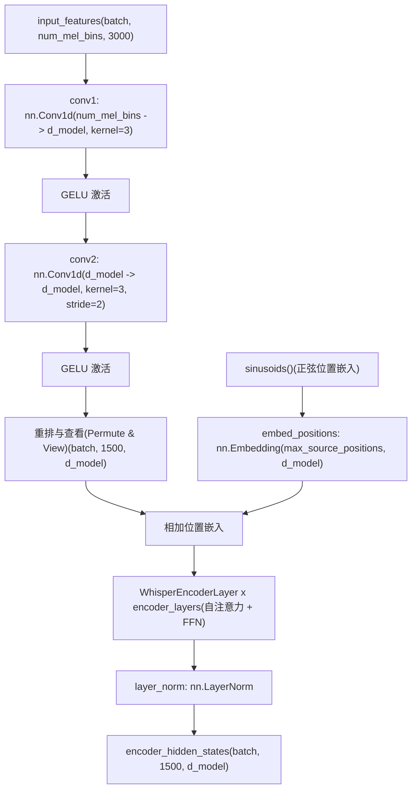
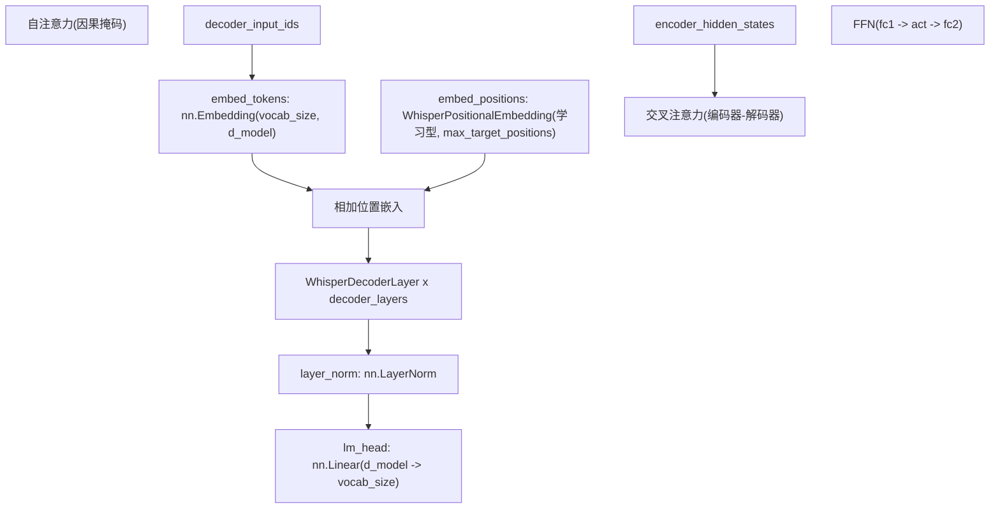
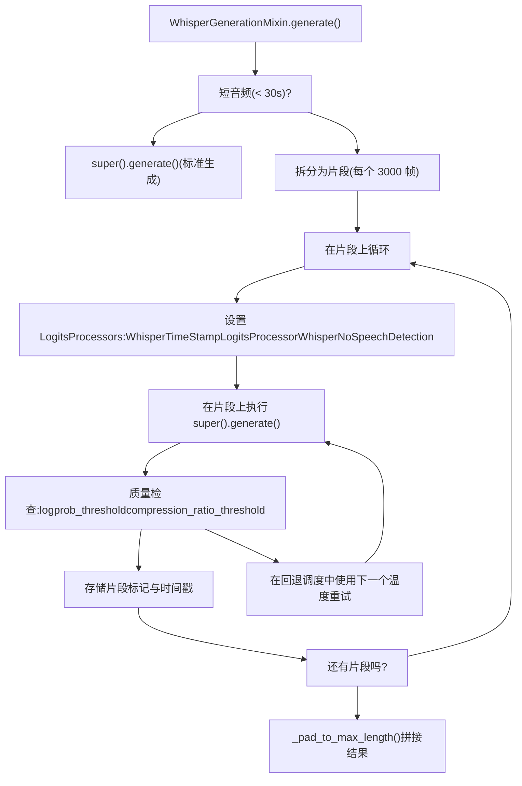
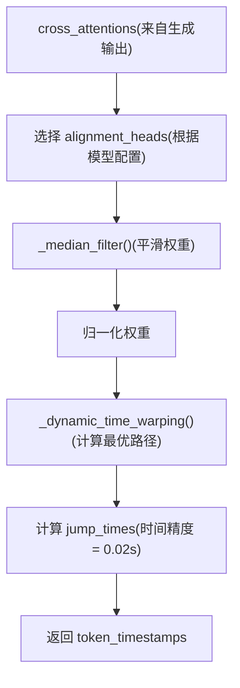
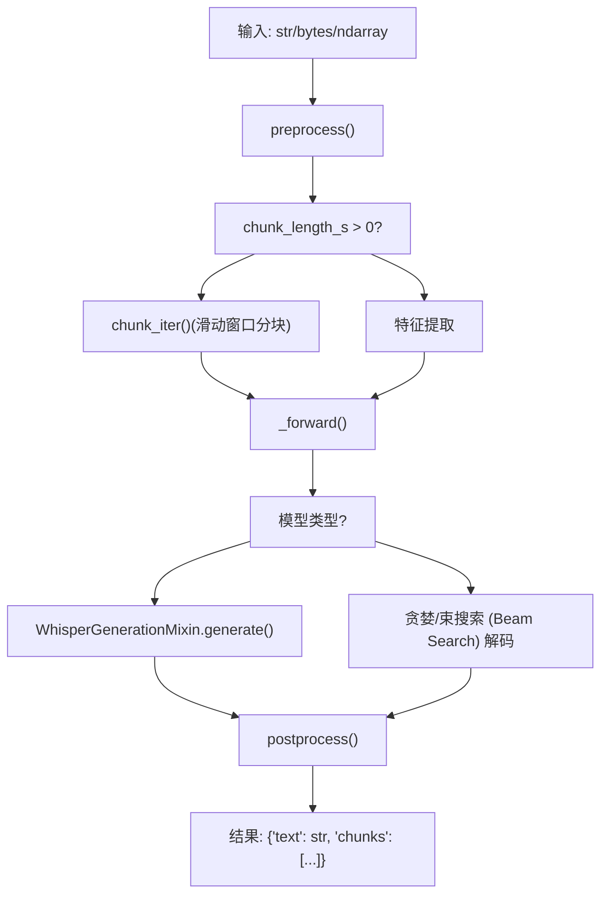

# Whisper 与自动语音识别 (Whisper and Automatic Speech Recognition)

相关源文件

-   [src/transformers/audio_utils.py](https://github.com/huggingface/transformers/blob/9a9997fd/src/transformers/audio_utils.py)
-   [src/transformers/models/audio_spectrogram_transformer/feature_extraction_audio_spectrogram_transformer.py](https://github.com/huggingface/transformers/blob/9a9997fd/src/transformers/models/audio_spectrogram_transformer/feature_extraction_audio_spectrogram_transformer.py)
-   [src/transformers/models/bark/generation_configuration_bark.py](https://github.com/huggingface/transformers/blob/9a9997fd/src/transformers/models/bark/generation_configuration_bark.py)
-   [src/transformers/models/bark/modeling_bark.py](https://github.com/huggingface/transformers/blob/9a9997fd/src/transformers/models/bark/modeling_bark.py)
-   [src/transformers/models/clap/feature_extraction_clap.py](https://github.com/huggingface/transformers/blob/9a9997fd/src/transformers/models/clap/feature_extraction_clap.py)
-   [src/transformers/models/clvp/processing_clvp.py](https://github.com/huggingface/transformers/blob/9a9997fd/src/transformers/models/clvp/processing_clvp.py)
-   [src/transformers/models/data2vec/modeling_data2vec_audio.py](https://github.com/huggingface/transformers/blob/9a9997fd/src/transformers/models/data2vec/modeling_data2vec_audio.py)
-   [src/transformers/models/hubert/modeling_hubert.py](https://github.com/huggingface/transformers/blob/9a9997fd/src/transformers/models/hubert/modeling_hubert.py)
-   [src/transformers/models/seamless_m4t/feature_extraction_seamless_m4t.py](https://github.com/huggingface/transformers/blob/9a9997fd/src/transformers/models/seamless_m4t/feature_extraction_seamless_m4t.py)
-   [src/transformers/models/sew/modeling_sew.py](https://github.com/huggingface/transformers/blob/9a9997fd/src/transformers/models/sew/modeling_sew.py)
-   [src/transformers/models/sew_d/modeling_sew_d.py](https://github.com/huggingface/transformers/blob/9a9997fd/src/transformers/models/sew_d/modeling_sew_d.py)
-   [src/transformers/models/speech_to_text/feature_extraction_speech_to_text.py](https://github.com/huggingface/transformers/blob/9a9997fd/src/transformers/models/speech_to_text/feature_extraction_speech_to_text.py)
-   [src/transformers/models/speecht5/feature_extraction_speecht5.py](https://github.com/huggingface/transformers/blob/9a9997fd/src/transformers/models/speecht5/feature_extraction_speecht5.py)
-   [src/transformers/models/speecht5/modeling_speecht5.py](https://github.com/huggingface/transformers/blob/9a9997fd/src/transformers/models/speecht5/modeling_speecht5.py)
-   [src/transformers/models/unispeech/modeling_unispeech.py](https://github.com/huggingface/transformers/blob/9a9997fd/src/transformers/models/unispeech/modeling_unispeech.py)
-   [src/transformers/models/unispeech_sat/modeling_unispeech_sat.py](https://github.com/huggingface/transformers/blob/9a9997fd/src/transformers/models/unispeech_sat/modeling_unispeech_sat.py)
-   [src/transformers/models/wav2vec2/modeling_wav2vec2.py](https://github.com/huggingface/transformers/blob/9a9997fd/src/transformers/models/wav2vec2/modeling_wav2vec2.py)
-   [src/transformers/models/wav2vec2_bert/modeling_wav2vec2_bert.py](https://github.com/huggingface/transformers/blob/9a9997fd/src/transformers/models/wav2vec2_bert/modeling_wav2vec2_bert.py)
-   [src/transformers/models/wav2vec2_conformer/modeling_wav2vec2_conformer.py](https://github.com/huggingface/transformers/blob/9a9997fd/src/transformers/models/wav2vec2_conformer/modeling_wav2vec2_conformer.py)
-   [src/transformers/models/wavlm/modeling_wavlm.py](https://github.com/huggingface/transformers/blob/9a9997fd/src/transformers/models/wavlm/modeling_wavlm.py)
-   [src/transformers/models/whisper/feature_extraction_whisper.py](https://github.com/huggingface/transformers/blob/9a9997fd/src/transformers/models/whisper/feature_extraction_whisper.py)
-   [src/transformers/models/whisper/generation_whisper.py](https://github.com/huggingface/transformers/blob/9a9997fd/src/transformers/models/whisper/generation_whisper.py)
-   [src/transformers/models/whisper/modeling_whisper.py](https://github.com/huggingface/transformers/blob/9a9997fd/src/transformers/models/whisper/modeling_whisper.py)
-   [src/transformers/models/whisper/processing_whisper.py](https://github.com/huggingface/transformers/blob/9a9997fd/src/transformers/models/whisper/processing_whisper.py)
-   [src/transformers/models/whisper/tokenization_whisper.py](https://github.com/huggingface/transformers/blob/9a9997fd/src/transformers/models/whisper/tokenization_whisper.py)
-   [src/transformers/pipelines/automatic_speech_recognition.py](https://github.com/huggingface/transformers/blob/9a9997fd/src/transformers/pipelines/automatic_speech_recognition.py)
-   [tests/models/audio_spectrogram_transformer/test_feature_extraction_audio_spectrogram_transformer.py](https://github.com/huggingface/transformers/blob/9a9997fd/tests/models/audio_spectrogram_transformer/test_feature_extraction_audio_spectrogram_transformer.py)
-   [tests/models/bark/test_modeling_bark.py](https://github.com/huggingface/transformers/blob/9a9997fd/tests/models/bark/test_modeling_bark.py)
-   [tests/models/encodec/test_feature_extraction_encodec.py](https://github.com/huggingface/transformers/blob/9a9997fd/tests/models/encodec/test_feature_extraction_encodec.py)
-   [tests/models/seamless_m4t/test_feature_extraction_seamless_m4t.py](https://github.com/huggingface/transformers/blob/9a9997fd/tests/models/seamless_m4t/test_feature_extraction_seamless_m4t.py)
-   [tests/models/speech_to_text/test_feature_extraction_speech_to_text.py](https://github.com/huggingface/transformers/blob/9a9997fd/tests/models/speech_to_text/test_feature_extraction_speech_to_text.py)
-   [tests/models/speecht5/test_feature_extraction_speecht5.py](https://github.com/huggingface/transformers/blob/9a9997fd/tests/models/speecht5/test_feature_extraction_speecht5.py)
-   [tests/models/speecht5/test_modeling_speecht5.py](https://github.com/huggingface/transformers/blob/9a9997fd/tests/models/speecht5/test_modeling_speecht5.py)
-   [tests/models/whisper/test_feature_extraction_whisper.py](https://github.com/huggingface/transformers/blob/9a9997fd/tests/models/whisper/test_feature_extraction_whisper.py)
-   [tests/models/whisper/test_modeling_whisper.py](https://github.com/huggingface/transformers/blob/9a9997fd/tests/models/whisper/test_modeling_whisper.py)
-   [tests/models/whisper/test_tokenization_whisper.py](https://github.com/huggingface/transformers/blob/9a9997fd/tests/models/whisper/test_tokenization_whisper.py)
-   [tests/pipelines/test_pipelines_automatic_speech_recognition.py](https://github.com/huggingface/transformers/blob/9a9997fd/tests/pipelines/test_pipelines_automatic_speech_recognition.py)
-   [tests/utils/test_audio_utils.py](https://github.com/huggingface/transformers/blob/9a9997fd/tests/utils/test_audio_utils.py)

本页介绍了 Whisper 的编码器-解码器架构、其扩展的生成接口 (`WhisperGenerationMixin`)、`AutomaticSpeechRecognitionPipeline` 以及相关的音频模型：Wav2Vec2、SpeechT5 和 Bark。

关于与 BART 和 T5 共享的基础编码器-解码器架构模式（交叉注意力 (cross-attention)、`shift_tokens_right`、`Seq2SeqLMOutput`），请参阅 [编码器-解码器模型](/huggingface/transformers/5.6-encoder-decoder-models)。关于 Whisper 所构建的生成基础设施（对数概率处理器 (logits processors)、缓存、解码策略），请参阅 [生成系统](/huggingface/transformers/4-generation-system)。

---

## Whisper 模型架构 (Whisper Model Architecture)

Whisper 是一种用于多任务语音处理的编码器-解码器 Transformer，任务包括：转录、翻译、语言识别和语音活动检测。编码器处理固定长度的对数梅尔频谱图 (log-mel spectrogram)；解码器在编码音频和任务/语言前缀的约束下生成文本。

### 音频预处理与编码器 (Audio Preprocessing and the Encoder)

原始音频在模型外部由 `WhisperFeatureExtractor` 预处理为形状为 `(batch, num_mel_bins, 3000)` 的对数梅尔频谱图，代表 100 帧/秒的 30 秒音频。编码器通过两个卷积层将其减少到 1500 帧，然后通过 Transformer 堆栈。

**图表：WhisperEncoder 组件 (modeling_whisper.py)**

来源： [src/transformers/models/whisper/modeling_whisper.py558-690](https://github.com/huggingface/transformers/blob/9a9997fd/src/transformers/models/whisper/modeling_whisper.py#L558-L690) [src/transformers/models/whisper/modeling_whisper.py53-62](https://github.com/huggingface/transformers/blob/9a9997fd/src/transformers/models/whisper/modeling_whisper.py#L53-L62)

`conv1` 将 `num_mel_bins → d_model` 进行映射；`conv2` 以步长 (stride) 2 进行下采样。两者均使用 GELU 激活。输出长度公式为 `(input_length - 1) // 2 + 1`，在 `_get_feat_extract_output_lengths()` 中实现。

[src/transformers/models/whisper/modeling_whisper.py549-555](https://github.com/huggingface/transformers/blob/9a9997fd/src/transformers/models/whisper/modeling_whisper.py#L549-L555)

`embed_positions` 保存了多达 `max_source_positions` 个位置的冻结正弦嵌入。`sinusoids()` 函数在初始化时生成它们。`embed_positions.requires_grad_(False)` 被直接设置，且 `_init_weights` 通过 `init.copy_()` 恢复正弦值，以确保在任何意外修改后仍能恢复。

[src/transformers/models/whisper/modeling_whisper.py540-548](https://github.com/huggingface/transformers/blob/9a9997fd/src/transformers/models/whisper/modeling_whisper.py#L540-L548)

每个 `WhisperEncoderLayer` 先应用预归一化 (pre-norm) 自注意力，然后应用 FFN（`fc1` → 激活 → `fc2`）。Float16 激活值被限制在 `finfo(float16).max - 1000` 以内，以防止溢出。

[src/transformers/models/whisper/modeling_whisper.py364-421](https://github.com/huggingface/transformers/blob/9a9997fd/src/transformers/models/whisper/modeling_whisper.py#L364-L421)

### Whisper 解码器 (WhisperDecoder)

**图表：WhisperDecoder 组件 (modeling_whisper.py)**

来源： [src/transformers/models/whisper/modeling_whisper.py693-800](https://github.com/huggingface/transformers/blob/9a9997fd/src/transformers/models/whisper/modeling_whisper.py#L693-L800) [src/transformers/models/whisper/modeling_whisper.py423-523](https://github.com/huggingface/transformers/blob/9a9997fd/src/transformers/models/whisper/modeling_whisper.py#L423-L523)

与编码器不同，解码器使用按位置索引的 **学习型 (learned)** 位置嵌入 (`WhisperPositionalEmbedding`)。每个 `WhisperDecoderLayer` 包含自注意力、交叉注意力和一个 FFN。

### 注意力与 EncoderDecoderCache (Attention and EncoderDecoderCache)

`WhisperAttention` 处理自注意力和交叉注意力。当 `key_value_states is not None` 时触发交叉注意力。

对于因果自动回归解码，Whisper 使用 `EncoderDecoderCache`，它封装了两个子缓存：

-   `self_attention_cache`：用于解码器自注意力的增长型 KV 缓存。
-   `cross_attention_cache`：用于编码器-解码器交叉注意力的固定型 KV 缓存。

在第一个解码步骤之后，编码器输出是固定的。`is_updated[layer_idx]` 追踪每一层是否已经写入了其交叉注意力键/值。

[src/transformers/models/whisper/modeling_whisper.py314-339](https://github.com/huggingface/transformers/blob/9a9997fd/src/transformers/models/whisper/modeling_whisper.py#L314-L339)

### 模型变体 (Model Variants)

| 类 | 继承自 | 任务 |
| --- | --- | --- |
| `WhisperModel` | `WhisperPreTrainedModel` | 基础编码器-解码器；`Seq2SeqModelOutput` |
| `WhisperForConditionalGeneration` | `WhisperGenerationMixin`, `WhisperPreTrainedModel` | 转录/翻译；`Seq2SeqLMOutput` |
| `WhisperForAudioClassification` | `WhisperPreTrainedModel` | 编码器 + `projector` + `classifier` |
| `WhisperForCausalLM` | `WhisperPreTrainedModel`, `GenerationMixin` | 仅解码器；用于辅助解码的草稿模型 (draft model) |

来源： [src/transformers/models/whisper/modeling_whisper.py527-556](https://github.com/huggingface/transformers/blob/9a9997fd/src/transformers/models/whisper/modeling_whisper.py#L527-L556) [tests/models/whisper/test_modeling_whisper.py351-360](https://github.com/huggingface/transformers/blob/9a9997fd/tests/models/whisper/test_modeling_whisper.py#L351-L360)

`WhisperPreTrainedModel` 声明 `main_input_name = "input_features"`，`input_modalities = ("audio", "text")`，并设置了 Flash Attention、SDPA 和 Flex Attention 支持标志。

[src/transformers/models/whisper/modeling_whisper.py532-540](https://github.com/huggingface/transformers/blob/9a9997fd/src/transformers/models/whisper/modeling_whisper.py#L532-L540)

---

## WhisperGenerationMixin

`WhisperGenerationMixin` 在 `src/transformers/models/whisper/generation_whisper.py` 中定义并扩展了 `GenerationMixin`。由于 `WhisperForConditionalGeneration` 在 `WhisperPreTrainedModel` 之前继承了它，其 `generate()` 方法具有优先级。

[src/transformers/models/whisper/generation_whisper.py240](https://github.com/huggingface/transformers/blob/9a9997fd/src/transformers/models/whisper/generation_whisper.py#L240-L240)

### 长文本转录循环 (Long-form Transcription Loop)

当音频长于 30 秒时，编码器特征被拆分为长度为 `num_segment_frames` 的分块并进行迭代处理。

**图表：长文本转录循环 (generation_whisper.py)**

来源： [src/transformers/models/whisper/generation_whisper.py383-900](https://github.com/huggingface/transformers/blob/9a9997fd/src/transformers/models/whisper/generation_whisper.py#L383-L900) [src/transformers/models/whisper/generation_whisper.py126-237](https://github.com/huggingface/transformers/blob/9a9997fd/src/transformers/models/whisper/generation_whisper.py#L126-L237)

### 通过 DTW 提取时间戳 (Timestamp Extraction via DTW)

`_extract_token_timestamps()` 使用生成过程中收集的交叉注意力权重，将每个输出标记映射到输入音频中的位置。

**图表：DTW 时间戳流水线 (generation_whisper.py)**

来源： [src/transformers/models/whisper/generation_whisper.py241-381](https://github.com/huggingface/transformers/blob/9a9997fd/src/transformers/models/whisper/generation_whisper.py#L241-L381) [src/transformers/models/whisper/generation_whisper.py64-115](https://github.com/huggingface/transformers/blob/9a9997fd/src/transformers/models/whisper/generation_whisper.py#L64-L115)

`_median_filter()` 应用宽度为 `config.median_filter_width` 的滑动中值滤波，以在动态时间规整 (Dynamic Time Warping, DTW) 之前平滑交叉注意力噪声。

[src/transformers/models/whisper/generation_whisper.py43-61](https://github.com/huggingface/transformers/blob/9a9997fd/src/transformers/models/whisper/generation_whisper.py#L43-L61)

---

## WhisperTokenizer

`src/transformers/models/whisper/tokenization_whisper.py` 中的 `WhisperTokenizer` 是一个 BPE 分词器，它处理 Whisper 的特殊标记词表，包括语言标签 (`<|en|>`)、任务标签 (`<|transcribe|>`) 和时间戳标记 (`<|0.00|>`)。

[src/transformers/models/whisper/tokenization_whisper.py163-276](https://github.com/huggingface/transformers/blob/9a9997fd/src/transformers/models/whisper/tokenization_whisper.py#L163-L276)

### 时间戳标记解码 (Timestamp Token Decoding)

时间戳标记的 ID 位于特殊标记范围之上。有两种方法解码这些标记：

-   `_decode_with_timestamps()`：返回一个将文本与时间戳注释交错的字符串。 [src/transformers/models/whisper/tokenization_whisper.py279-325](https://github.com/huggingface/transformers/blob/9a9997fd/src/transformers/models/whisper/tokenization_whisper.py#L279-L325)
-   `_compute_offsets()`：将连续的时间戳标记对识别为片段边界。 [src/transformers/models/whisper/tokenization_whisper.py328-420](https://github.com/huggingface/transformers/blob/9a9997fd/src/transformers/models/whisper/tokenization_whisper.py#L328-L420)

---

## AutomaticSpeechRecognitionPipeline

`src/transformers/pipelines/automatic_speech_recognition.py` 中的 `AutomaticSpeechRecognitionPipeline` 是一个 `ChunkPipeline`，支持多种 ASR 后端（Whisper、Wav2Vec2、Hubert 等）。

[src/transformers/pipelines/automatic_speech_recognition.py112-185](https://github.com/huggingface/transformers/blob/9a9997fd/src/transformers/pipelines/automatic_speech_recognition.py#L112-L185)

### 流水线数据流 (Pipeline Data Flow)

**图表：ASR 流水线流程 (automatic_speech_recognition.py)**

来源： [src/transformers/pipelines/automatic_speech_recognition.py209-600](https://github.com/huggingface/transformers/blob/9a9997fd/src/transformers/pipelines/automatic_speech_recognition.py#L209-L600)

对于长音频，`chunk_iter()` 产出重叠的特征提取器输出。`rescale_stride()` 将这些步长从音频样本空间转换为标记/对数概率空间。

[src/transformers/pipelines/automatic_speech_recognition.py41-84](https://github.com/huggingface/transformers/blob/9a9997fd/src/transformers/pipelines/automatic_speech_recognition.py#L41-L84)

---

## 相关音频模型 (Related Audio Models)

### Wav2Vec2 — 基于 CTC 的 ASR (Wav2Vec2 — CTC-based ASR)

Wav2Vec2 使用卷积特征编码器，后接一个 Transformer。与 Whisper 不同，它通常使用连接时序分类 (Connectionist Temporal Classification, CTC) 进行解码。

[src/transformers/models/wav2vec2/modeling_wav2vec2.py1-99](https://github.com/huggingface/transformers/blob/9a9997fd/src/transformers/models/wav2vec2/modeling_wav2vec2.py#L1-L99)

### SpeechT5 — 统一语音-文本模型 (SpeechT5 — Unified Speech-Text Model)

SpeechT5 使用共享的 Transformer 骨干，并配有模态特定的前置网络 (pre-nets) 和后置网络 (post-nets)。

-   `SpeechT5ForSpeechToText`：`SpeechT5SpeechEncoderPrenet` -> `SpeechT5TextDecoderPostnet`。
-   `SpeechT5ForTextToSpeech`：`SpeechT5TextEncoderPrenet` -> `SpeechT5SpeechDecoderPostnet` + `SpeechT5HifiGan`。

[src/transformers/models/speecht5/modeling_speecht5.py209-400](https://github.com/huggingface/transformers/blob/9a9997fd/src/transformers/models/speecht5/modeling_speecht5.py#L209-L400)

### Bark — 文本转音频生成 (Bark — Text-to-Audio Generation)

Bark 通过三个阶段生成音频：

1.  `BarkSemanticModel`：文本 -> 语义标记。
2.  `BarkCoarseModel`：语义 -> 粗糙声学标记。
3.  `BarkFineModel`：粗糙 -> 精细声学标记（8 个码本 (codebooks)）。

[src/transformers/models/bark/modeling_bark.py361-650](https://github.com/huggingface/transformers/blob/9a9997fd/src/transformers/models/bark/modeling_bark.py#L361-L650)

---

## 音频实用函数 (Audio Utility Functions)

`src/transformers/audio_utils.py` 提供了基于 NumPy 的音频数字信号处理 (DSP) 工具。

| 函数 | 用途 |
| --- | --- |
| `load_audio()` | 通过 `torchcodec` 或 `librosa` 从文件/URL 加载。 [src/transformers/audio_utils.py60-89](https://github.com/huggingface/transformers/blob/9a9997fd/src/transformers/audio_utils.py#L60-L89) |
| `spectrogram()` | 计算基于 STFT 的（梅尔/对数梅尔）频谱图。 [src/transformers/audio_utils.py200-231](https://github.com/huggingface/transformers/blob/9a9997fd/src/transformers/audio_utils.py#L200-L231) |
| `mel_filter_bank()` | 构建三角形梅尔滤波器组矩阵。 |

来源： [src/transformers/audio_utils.py60-231](https://github.com/huggingface/transformers/blob/9a9997fd/src/transformers/audio_utils.py#L60-L231)
