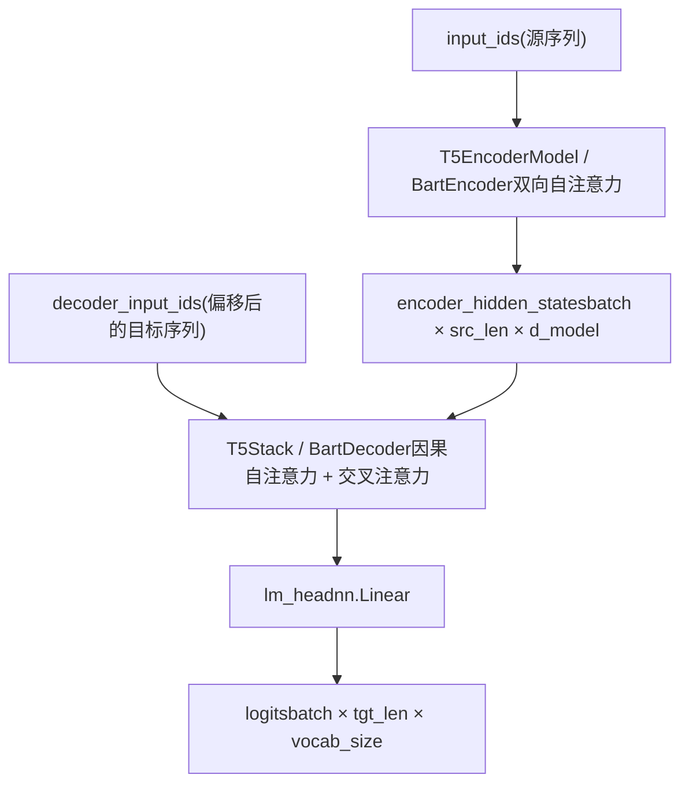
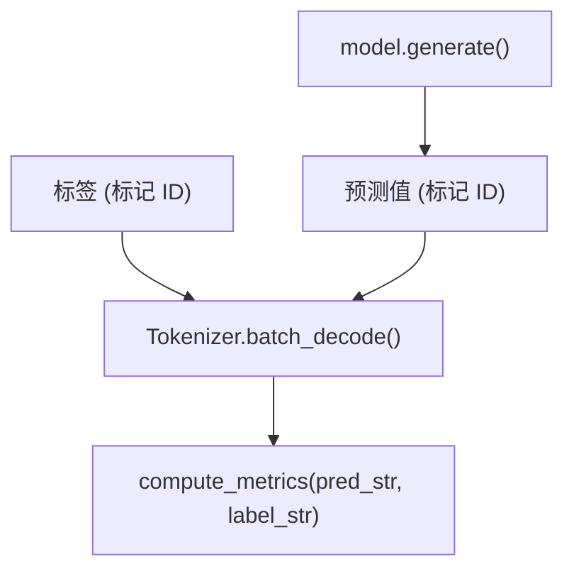
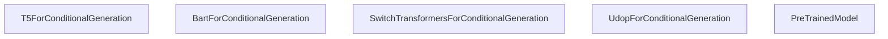

# 编码器-解码器模型 (Encoder-Decoder Models)

相关源文件

-   [docs/source/en/_config.py](https://github.com/huggingface/transformers/blob/9a9997fd/docs/source/en/_config.py)
-   [docs/source/en/model_doc/mt5.md](https://github.com/huggingface/transformers/blob/9a9997fd/docs/source/en/model_doc/mt5.md?plain=1)
-   [docs/source/en/model_doc/t5.md](https://github.com/huggingface/transformers/blob/9a9997fd/docs/source/en/model_doc/t5.md?plain=1)
-   [docs/source/en/model_doc/umt5.md](https://github.com/huggingface/transformers/blob/9a9997fd/docs/source/en/model_doc/umt5.md?plain=1)
-   [docs/source/en/perf_train_cpu.md](https://github.com/huggingface/transformers/blob/9a9997fd/docs/source/en/perf_train_cpu.md?plain=1)
-   [docs/source/en/perf_train_cpu_many.md](https://github.com/huggingface/transformers/blob/9a9997fd/docs/source/en/perf_train_cpu_many.md?plain=1)
-   [docs/source/it/perf_infer_cpu.md](https://github.com/huggingface/transformers/blob/9a9997fd/docs/source/it/perf_infer_cpu.md?plain=1)
-   [docs/source/ja/perf_infer_cpu.md](https://github.com/huggingface/transformers/blob/9a9997fd/docs/source/ja/perf_infer_cpu.md?plain=1)
-   [docs/source/ko/perf_infer_cpu.md](https://github.com/huggingface/transformers/blob/9a9997fd/docs/source/ko/perf_infer_cpu.md?plain=1)
-   [examples/pytorch/question-answering/trainer_qa.py](https://github.com/huggingface/transformers/blob/9a9997fd/examples/pytorch/question-answering/trainer_qa.py)
-   [examples/pytorch/question-answering/trainer_seq2seq_qa.py](https://github.com/huggingface/transformers/blob/9a9997fd/examples/pytorch/question-answering/trainer_seq2seq_qa.py)
-   [src/transformers/models/autoformer/modeling_autoformer.py](https://github.com/huggingface/transformers/blob/9a9997fd/src/transformers/models/autoformer/modeling_autoformer.py)
-   [src/transformers/models/bart/modeling_bart.py](https://github.com/huggingface/transformers/blob/9a9997fd/src/transformers/models/bart/modeling_bart.py)
-   [src/transformers/models/bigbird_pegasus/modeling_bigbird_pegasus.py](https://github.com/huggingface/transformers/blob/9a9997fd/src/transformers/models/bigbird_pegasus/modeling_bigbird_pegasus.py)
-   [src/transformers/models/blenderbot/modeling_blenderbot.py](https://github.com/huggingface/transformers/blob/9a9997fd/src/transformers/models/blenderbot/modeling_blenderbot.py)
-   [src/transformers/models/blenderbot_small/modeling_blenderbot_small.py](https://github.com/huggingface/transformers/blob/9a9997fd/src/transformers/models/blenderbot_small/modeling_blenderbot_small.py)
-   [src/transformers/models/informer/modeling_informer.py](https://github.com/huggingface/transformers/blob/9a9997fd/src/transformers/models/informer/modeling_informer.py)
-   [src/transformers/models/led/modeling_led.py](https://github.com/huggingface/transformers/blob/9a9997fd/src/transformers/models/led/modeling_led.py)
-   [src/transformers/models/longt5/modeling_longt5.py](https://github.com/huggingface/transformers/blob/9a9997fd/src/transformers/models/longt5/modeling_longt5.py)
-   [src/transformers/models/m2m_100/modeling_m2m_100.py](https://github.com/huggingface/transformers/blob/9a9997fd/src/transformers/models/m2m_100/modeling_m2m_100.py)
-   [src/transformers/models/marian/modeling_marian.py](https://github.com/huggingface/transformers/blob/9a9997fd/src/transformers/models/marian/modeling_marian.py)
-   [src/transformers/models/mbart/modeling_mbart.py](https://github.com/huggingface/transformers/blob/9a9997fd/src/transformers/models/mbart/modeling_mbart.py)
-   [src/transformers/models/mt5/__init__.py](https://github.com/huggingface/transformers/blob/9a9997fd/src/transformers/models/mt5/__init__.py)
-   [src/transformers/models/mt5/configuration_mt5.py](https://github.com/huggingface/transformers/blob/9a9997fd/src/transformers/models/mt5/configuration_mt5.py)
-   [src/transformers/models/mt5/modeling_mt5.py](https://github.com/huggingface/transformers/blob/9a9997fd/src/transformers/models/mt5/modeling_mt5.py)
-   [src/transformers/models/mvp/modeling_mvp.py](https://github.com/huggingface/transformers/blob/9a9997fd/src/transformers/models/mvp/modeling_mvp.py)
-   [src/transformers/models/nllb_moe/modeling_nllb_moe.py](https://github.com/huggingface/transformers/blob/9a9997fd/src/transformers/models/nllb_moe/modeling_nllb_moe.py)
-   [src/transformers/models/pegasus/modeling_pegasus.py](https://github.com/huggingface/transformers/blob/9a9997fd/src/transformers/models/pegasus/modeling_pegasus.py)
-   [src/transformers/models/pegasus_x/modeling_pegasus_x.py](https://github.com/huggingface/transformers/blob/9a9997fd/src/transformers/models/pegasus_x/modeling_pegasus_x.py)
-   [src/transformers/models/pix2struct/modeling_pix2struct.py](https://github.com/huggingface/transformers/blob/9a9997fd/src/transformers/models/pix2struct/modeling_pix2struct.py)
-   [src/transformers/models/plbart/modeling_plbart.py](https://github.com/huggingface/transformers/blob/9a9997fd/src/transformers/models/plbart/modeling_plbart.py)
-   [src/transformers/models/pop2piano/modeling_pop2piano.py](https://github.com/huggingface/transformers/blob/9a9997fd/src/transformers/models/pop2piano/modeling_pop2piano.py)
-   [src/transformers/models/speech_to_text/modeling_speech_to_text.py](https://github.com/huggingface/transformers/blob/9a9997fd/src/transformers/models/speech_to_text/modeling_speech_to_text.py)
-   [src/transformers/models/switch_transformers/configuration_switch_transformers.py](https://github.com/huggingface/transformers/blob/9a9997fd/src/transformers/models/switch_transformers/configuration_switch_transformers.py)
-   [src/transformers/models/switch_transformers/modeling_switch_transformers.py](https://github.com/huggingface/transformers/blob/9a9997fd/src/transformers/models/switch_transformers/modeling_switch_transformers.py)
-   [src/transformers/models/t5/__init__.py](https://github.com/huggingface/transformers/blob/9a9997fd/src/transformers/models/t5/__init__.py)
-   [src/transformers/models/t5/configuration_t5.py](https://github.com/huggingface/transformers/blob/9a9997fd/src/transformers/models/t5/configuration_t5.py)
-   [src/transformers/models/t5/modeling_t5.py](https://github.com/huggingface/transformers/blob/9a9997fd/src/transformers/models/t5/modeling_t5.py)
-   [src/transformers/models/time_series_transformer/modeling_time_series_transformer.py](https://github.com/huggingface/transformers/blob/9a9997fd/src/transformers/models/time_series_transformer/modeling_time_series_transformer.py)
-   [src/transformers/models/trocr/modeling_trocr.py](https://github.com/huggingface/transformers/blob/9a9997fd/src/transformers/models/trocr/modeling_trocr.py)
-   [src/transformers/models/udop/modeling_udop.py](https://github.com/huggingface/transformers/blob/9a9997fd/src/transformers/models/udop/modeling_udop.py)
-   [src/transformers/models/udop/processing_udop.py](https://github.com/huggingface/transformers/blob/9a9997fd/src/transformers/models/udop/processing_udop.py)
-   [src/transformers/models/umt5/__init__.py](https://github.com/huggingface/transformers/blob/9a9997fd/src/transformers/models/umt5/__init__.py)
-   [src/transformers/models/umt5/configuration_umt5.py](https://github.com/huggingface/transformers/blob/9a9997fd/src/transformers/models/umt5/configuration_umt5.py)
-   [src/transformers/models/umt5/modeling_umt5.py](https://github.com/huggingface/transformers/blob/9a9997fd/src/transformers/models/umt5/modeling_umt5.py)
-   [src/transformers/trainer_seq2seq.py](https://github.com/huggingface/transformers/blob/9a9997fd/src/transformers/trainer_seq2seq.py)
-   [tests/models/longt5/test_modeling_longt5.py](https://github.com/huggingface/transformers/blob/9a9997fd/tests/models/longt5/test_modeling_longt5.py)
-   [tests/models/mt5/test_modeling_mt5.py](https://github.com/huggingface/transformers/blob/9a9997fd/tests/models/mt5/test_modeling_mt5.py)
-   [tests/models/nllb_moe/test_modeling_nllb_moe.py](https://github.com/huggingface/transformers/blob/9a9997fd/tests/models/nllb_moe/test_modeling_nllb_moe.py)
-   [tests/models/switch_transformers/test_modeling_switch_transformers.py](https://github.com/huggingface/transformers/blob/9a9997fd/tests/models/switch_transformers/test_modeling_switch_transformers.py)
-   [tests/models/t5/test_modeling_t5.py](https://github.com/huggingface/transformers/blob/9a9997fd/tests/models/t5/test_modeling_t5.py)
-   [tests/models/udop/test_modeling_udop.py](https://github.com/huggingface/transformers/blob/9a9997fd/tests/models/udop/test_modeling_udop.py)
-   [tests/models/umt5/test_modeling_umt5.py](https://github.com/huggingface/transformers/blob/9a9997fd/tests/models/umt5/test_modeling_umt5.py)
-   [tests/trainer/test_trainer_seq2seq.py](https://github.com/huggingface/transformers/blob/9a9997fd/tests/trainer/test_trainer_seq2seq.py)

## 目的与范围 (Purpose and Scope)

本页涵盖了在 T5, BART, mBART, Marian, Pegasus, M2M-100, Blenderbot, PLBart, LED, BigBirdPegasus, NLLB-MoE, Switch Transformers 和 UDOP 中实现的通用编码器-解码器 Transformer 架构。它解释了编码器和解码器组件是如何构建的，交叉注意力 (cross-attention) 是如何连接它们的，`shift_tokens_right` 是如何设置教师强制 (teacher-forced) 训练的，以及 `Seq2SeqTrainer` 提供的专门训练基础设施。

有关 Whisper（音频专用编码器-解码器），请参阅 [5.5](https://github.com/huggingface/transformers/blob/9a9997fd/5.5)。有关同样使用基于交叉注意力的编码器-解码器模式的多模态视觉-语言模型（如 Qwen2-VL），请参阅 [5.7](https://github.com/huggingface/transformers/blob/9a9997fd/5.7)。有关生成期间使用的 KV 缓存类型，请参阅 [4.3](https://github.com/huggingface/transformers/blob/9a9997fd/4.3)。

---

## 架构概述 (Architecture Overview)

编码器-解码器模式将源处理（双向编码器）与目标生成（带交叉注意力的因果解码器）分开。编码器运行一次；解码器则以自动回归的方式一次运行一步。

**高层数据流 (High-Level Data Flow)**


来源： `src/transformers/models/t5/modeling_t5.py`, `src/transformers/models/bart/modeling_bart.py`

---

## T5 与 BART：关键架构差异 (T5 vs BART: Key Architectural Differences)

虽然两者都是编码器-解码器模型，但 T5 和 BART 在归一化和注意力机制上有所不同。

### T5 架构（相对偏置） (T5 Architecture (Relative Bias))

T5 使用 **相对位置偏置 (Relative Positional Bias)** 而不是绝对位置嵌入。该偏置在执行 Softmax 之前被添加到注意力分数中。

-   **LayerNorm**: T5 使用 `T5LayerNorm`（RMSNorm 风格），它仅进行缩放而不进行平移（无偏置） [src/transformers/models/t5/modeling_t5.py46-68](https://github.com/huggingface/transformers/blob/9a9997fd/src/transformers/models/t5/modeling_t5.py#L46-L68)
-   **门控激活 (Gated Activations)**: 现代 T5 变体 (v1.1, Flan-T5) 使用 `T5DenseGatedActDense`，它实现了 Gated-GELU 或 Gated-ReLU [src/transformers/models/t5/modeling_t5.py106-132](https://github.com/huggingface/transformers/blob/9a9997fd/src/transformers/models/t5/modeling_t5.py#L106-L132)

### BART 架构（学习型嵌入） (BART Architecture (Learned Embeddings))

BART 使用绝对 **学习型位置嵌入 (Learned Positional Embeddings)** [src/transformers/models/bart/modeling_bart.py74-98](https://github.com/huggingface/transformers/blob/9a9997fd/src/transformers/models/bart/modeling_bart.py#L74-L98)

-   **LayerNorm**: BART 使用带有权重和偏置的标准 `nn.LayerNorm`。
-   **激活函数 (Activation)**: 通常使用标准 GELU。

---

## 注意力机制 (Attention Mechanisms)

编码器-解码器架构在 `T5Attention` [src/transformers/models/t5/modeling_t5.py153-179](https://github.com/huggingface/transformers/blob/9a9997fd/src/transformers/models/t5/modeling_t5.py#L153-L179) 或 `BartAttention` [src/transformers/models/bart/modeling_bart.py143-184](https://github.com/huggingface/transformers/blob/9a9997fd/src/transformers/models/bart/modeling_bart.py#L143-L184) 模块内利用了三种不同的注意力配置。

| 类型 | 位置 | 掩码 | 键/值 (Key/Value) 来源 |
| --- | --- | --- | --- |
| **编码器自注意力** | 编码器 | 双向 | `hidden_states` (编码器) |
| **解码器自注意力** | 解码器 | 因果 | `hidden_states` (解码器) |
| **交叉注意力** | 解码器 | 无 | `encoder_hidden_states` |

### 交叉注意力与 EncoderDecoderCache (Cross-Attention and EncoderDecoderCache)

交叉注意力 K/V 来自固定的编码器输出。它们在第一个解码步计算一次，并在后续每一步重复使用。`EncoderDecoderCache` [src/transformers/cache_utils.py](https://github.com/huggingface/transformers/blob/9a9997fd/src/transformers/cache_utils.py) 维护独立的插槽，以将不断增长的解码器自注意力缓存与静态的交叉注意力缓存分开。

**注意力中的缓存路由 (Cache Routing in Attention)** 在 `T5Attention.forward` 或 `BartAttention.forward` 内部，模块会检测其角色：

-   **自注意力**: `key_value_states=None` → Q, K, V 全部从当前的 `hidden_states` 投影。
-   **交叉注意力**: `key_value_states=encoder_hidden_states` → Q 来自解码器，K/V 来自编码器 [src/transformers/models/t5/modeling_t5.py188-210](https://github.com/huggingface/transformers/blob/9a9997fd/src/transformers/models/t5/modeling_t5.py#L188-L210)

---

## 数据流：shift_tokens_right (Data Flow: shift_tokens_right)

`shift_tokens_right` 在训练期间（教师强制）从目标标签创建解码器输入序列。解码器看到真实值 (ground-truth) 前缀并预测下一个标记。

```python
def shift_tokens_right(input_ids: torch.Tensor, pad_token_id: int, decoder_start_token_id: int):
    shifted_input_ids = input_ids.new_zeros(input_ids.shape)
    shifted_input_ids[:, 1:] = input_ids[:, :-1].clone()
    shifted_input_ids[:, 0] = decoder_start_token_id
    # 用 `pad_token_id` 替换标签中可能的 -100 值
    shifted_input_ids.masked_fill_(shifted_input_ids == -100, pad_token_id)
    return shifted_input_ids
```
来源： `src/transformers/models/bart/modeling_bart.py:58-71`, `src/transformers/models/bigbird_pegasus/modeling_bigbird_pegasus.py:60-73`

**mBART 例外**：mBART 的 `shift_tokens_right` 读取最后一个非填充标记（语言 ID 标记），将其移动到位置 0，并将其余标记向右移动 [src/transformers/models/mbart/modeling_mbart.py64-81](https://github.com/huggingface/transformers/blob/9a9997fd/src/transformers/models/mbart/modeling_mbart.py#L64-L81)

---

## 序列到序列训练 (Sequence-to-Sequence Training)

### Seq2SeqTrainer

`Seq2SeqTrainer` [src/transformers/trainer_seq2seq.py55](https://github.com/huggingface/transformers/blob/9a9997fd/src/transformers/trainer_seq2seq.py#L55-L55) 扩展了基础 `Trainer`，以处理序列生成的评估复杂性。

**关键特性：**

1.  **预测并生成 (Predict with Generate)**：在评估期间，它可以使用 `model.generate()` 而不仅仅是前向传播，来计算 ROUGE 或 BLEU 等任务特定的指标 [src/transformers/trainer_seq2seq.py165](https://github.com/huggingface/transformers/blob/9a9997fd/src/transformers/trainer_seq2seq.py#L165-L165)
2.  **GenerationConfig 管理**：它从 `Seq2SeqTrainingArguments` 中加载并优先处理 `GenerationConfig` [src/transformers/trainer_seq2seq.py89-94](https://github.com/huggingface/transformers/blob/9a9997fd/src/transformers/trainer_seq2seq.py#L89-L94)
3.  **损失计算**：如果向前向传播提供了标签，它会自动处理标签和对数概率的偏移，以计算 `CrossEntropyLoss` [src/transformers/models/t5/modeling_t5.py1000-1015](https://github.com/huggingface/transformers/blob/9a9997fd/src/transformers/models/t5/modeling_t5.py#L1000-L1015)


来源： `src/transformers/trainer_seq2seq.py`, `tests/trainer/test_trainer_seq2seq.py`

---

## 专门架构 (Specialized Architectures)

### Switch Transformers (MoE)

`SwitchTransformers` 实现了一个混合专家 (Mixture-of-Experts, MoE) 编码器-解码器。它使用 `SwitchTransformersTop1Router` [src/transformers/models/switch_transformers/modeling_switch_transformers.py51](https://github.com/huggingface/transformers/blob/9a9997fd/src/transformers/models/switch_transformers/modeling_switch_transformers.py#L51-L51) 将标记路由到特定的专家。

-   **路由**: 标记根据 `router_probs` 进行路由，直到达到 `expert_capacity` [src/transformers/models/switch_transformers/modeling_switch_transformers.py97-105](https://github.com/huggingface/transformers/blob/9a9997fd/src/transformers/models/switch_transformers/modeling_switch_transformers.py#L97-L105)
-   **输出**: 返回包含负载均衡损失的 `Seq2SeqMoEOutput` [src/transformers/models/switch_transformers/modeling_switch_transformers.py38](https://github.com/huggingface/transformers/blob/9a9997fd/src/transformers/models/switch_transformers/modeling_switch_transformers.py#L38-L38)

### UDOP（多模态编码器-解码器） (UDOP (Multimodal Encoder-Decoder))

`Udop` (通用文档处理 (Universal Document Processing)) 扩展了该架构以同时处理图像和文本。

-   **嵌入融合**: `combine_image_text_embeddings` [src/transformers/models/udop/modeling_udop.py134](https://github.com/huggingface/transformers/blob/9a9997fd/src/transformers/models/udop/modeling_udop.py#L134-L134) 根据边界框 (`bbox`) 对齐，将视觉补丁 (patch) 嵌入与文本嵌入合并。
-   **空间偏置**: 使用 2D 相对位置偏置来实现对文档布局的理解。

### 长文档变体 (Long-Document Variants)

-   **LED**: 编码器使用带选定全局标记的局部滑动窗口注意力模式，以处理长序列。
-   **BigBirdPegasus**: 编码器使用 `BigBirdPegasusSelfAttention` [src/transformers/models/bigbird_pegasus/modeling_bigbird_pegasus.py112](https://github.com/huggingface/transformers/blob/9a9997fd/src/transformers/models/bigbird_pegasus/modeling_bigbird_pegasus.py#L112-L112)，它实现了块稀疏注意力，复杂度为 $O(n)$。

---

## 模型系列类映射 (Model Family Class Mapping)


来源： `src/transformers/models/t5/modeling_t5.py`, `src/transformers/models/bart/modeling_bart.py`, `src/transformers/models/switch_transformers/modeling_switch_transformers.py`, `src/transformers/models/udop/modeling_udop.py`

### 关键文件摘要 (Summary of Key Files)

-   **建模**: `src/transformers/models/t5/modeling_t5.py` [1-179](https://github.com/huggingface/transformers/blob/9a9997fd/1-179) `src/transformers/models/bart/modeling_bart.py` [1-184](https://github.com/huggingface/transformers/blob/9a9997fd/1-184)
-   **训练**: `src/transformers/trainer_seq2seq.py` [55-165](https://github.com/huggingface/transformers/blob/9a9997fd/55-165)
-   **配置**: `src/transformers/models/t5/configuration_t5.py` [1-41](https://github.com/huggingface/transformers/blob/9a9997fd/1-41) `src/transformers/models/switch_transformers/configuration_switch_transformers.py` [1-45](https://github.com/huggingface/transformers/blob/9a9997fd/1-45)
