# 多模态视觉语言模型 (Multimodal Vision-Language Models)

相关源文件

-   [src/transformers/models/aya\_vision/modeling\_aya\_vision.py](https://github.com/huggingface/transformers/blob/9a9997fd/src/transformers/models/aya_vision/modeling_aya_vision.py)
-   [src/transformers/models/blip\_2/modeling\_blip\_2.py](https://github.com/huggingface/transformers/blob/9a9997fd/src/transformers/models/blip_2/modeling_blip_2.py)
-   [src/transformers/models/chameleon/processing\_chameleon.py](https://github.com/huggingface/transformers/blob/9a9997fd/src/transformers/models/chameleon/processing_chameleon.py)
-   [src/transformers/models/emu3/processing\_emu3.py](https://github.com/huggingface/transformers/blob/9a9997fd/src/transformers/models/emu3/processing_emu3.py)
-   [src/transformers/models/ernie4\_5\_vl\_moe/modeling\_ernie4\_5\_vl\_moe.py](https://github.com/huggingface/transformers/blob/9a9997fd/src/transformers/models/ernie4_5_vl_moe/modeling_ernie4_5_vl_moe.py)
-   [src/transformers/models/fuyu/processing\_fuyu.py](https://github.com/huggingface/transformers/blob/9a9997fd/src/transformers/models/fuyu/processing_fuyu.py)
-   [src/transformers/models/glm46v/modeling\_glm46v.py](https://github.com/huggingface/transformers/blob/9a9997fd/src/transformers/models/glm46v/modeling_glm46v.py)
-   [src/transformers/models/glm4v/configuration\_glm4v.py](https://github.com/huggingface/transformers/blob/9a9997fd/src/transformers/models/glm4v/configuration_glm4v.py)
-   [src/transformers/models/glm4v/modeling\_glm4v.py](https://github.com/huggingface/transformers/blob/9a9997fd/src/transformers/models/glm4v/modeling_glm4v.py)
-   [src/transformers/models/glm4v/modular\_glm4v.py](https://github.com/huggingface/transformers/blob/9a9997fd/src/transformers/models/glm4v/modular_glm4v.py)
-   [src/transformers/models/glm4v\_moe/configuration\_glm4v\_moe.py](https://github.com/huggingface/transformers/blob/9a9997fd/src/transformers/models/glm4v_moe/configuration_glm4v_moe.py)
-   [src/transformers/models/glm4v\_moe/modeling\_glm4v\_moe.py](https://github.com/huggingface/transformers/blob/9a9997fd/src/transformers/models/glm4v_moe/modeling_glm4v_moe.py)
-   [src/transformers/models/glm4v\_moe/modular\_glm4v\_moe.py](https://github.com/huggingface/transformers/blob/9a9997fd/src/transformers/models/glm4v_moe/modular_glm4v_moe.py)
-   [src/transformers/models/glm\_ocr/modeling\_glm\_ocr.py](https://github.com/huggingface/transformers/blob/9a9997fd/src/transformers/models/glm_ocr/modeling_glm_ocr.py)
-   [src/transformers/models/got\_ocr2/modeling\_got\_ocr2.py](https://github.com/huggingface/transformers/blob/9a9997fd/src/transformers/models/got_ocr2/modeling_got_ocr2.py)
-   [src/transformers/models/got\_ocr2/modular\_got\_ocr2.py](https://github.com/huggingface/transformers/blob/9a9997fd/src/transformers/models/got_ocr2/modular_got_ocr2.py)
-   [src/transformers/models/idefics2/modeling\_idefics2.py](https://github.com/huggingface/transformers/blob/9a9997fd/src/transformers/models/idefics2/modeling_idefics2.py)
-   [src/transformers/models/idefics2/processing\_idefics2.py](https://github.com/huggingface/transformers/blob/9a9997fd/src/transformers/models/idefics2/processing_idefics2.py)
-   [src/transformers/models/idefics3/modeling\_idefics3.py](https://github.com/huggingface/transformers/blob/9a9997fd/src/transformers/models/idefics3/modeling_idefics3.py)
-   [src/transformers/models/idefics3/processing\_idefics3.py](https://github.com/huggingface/transformers/blob/9a9997fd/src/transformers/models/idefics3/processing_idefics3.py)
-   [src/transformers/models/instructblip/modeling\_instructblip.py](https://github.com/huggingface/transformers/blob/9a9997fd/src/transformers/models/instructblip/modeling_instructblip.py)
-   [src/transformers/models/instructblipvideo/modeling\_instructblipvideo.py](https://github.com/huggingface/transformers/blob/9a9997fd/src/transformers/models/instructblipvideo/modeling_instructblipvideo.py)
-   [src/transformers/models/instructblipvideo/modular\_instructblipvideo.py](https://github.com/huggingface/transformers/blob/9a9997fd/src/transformers/models/instructblipvideo/modular_instructblipvideo.py)
-   [src/transformers/models/internvl/modeling\_internvl.py](https://github.com/huggingface/transformers/blob/9a9997fd/src/transformers/models/internvl/modeling_internvl.py)
-   [src/transformers/models/internvl/modular\_internvl.py](https://github.com/huggingface/transformers/blob/9a9997fd/src/transformers/models/internvl/modular_internvl.py)
-   [src/transformers/models/llava/modeling\_llava.py](https://github.com/huggingface/transformers/blob/9a9997fd/src/transformers/models/llava/modeling_llava.py)
-   [src/transformers/models/llava/processing\_llava.py](https://github.com/huggingface/transformers/blob/9a9997fd/src/transformers/models/llava/processing_llava.py)
-   [src/transformers/models/llava\_next/modeling\_llava\_next.py](https://github.com/huggingface/transformers/blob/9a9997fd/src/transformers/models/llava_next/modeling_llava_next.py)
-   [src/transformers/models/llava\_next/processing\_llava\_next.py](https://github.com/huggingface/transformers/blob/9a9997fd/src/transformers/models/llava_next/processing_llava_next.py)
-   [src/transformers/models/llava\_next\_video/modeling\_llava\_next\_video.py](https://github.com/huggingface/transformers/blob/9a9997fd/src/transformers/models/llava_next_video/modeling_llava_next_video.py)
-   [src/transformers/models/llava\_next\_video/modular\_llava\_next\_video.py](https://github.com/huggingface/transformers/blob/9a9997fd/src/transformers/models/llava_next_video/modular_llava_next_video.py)
-   [src/transformers/models/llava\_next\_video/processing\_llava\_next\_video.py](https://github.com/huggingface/transformers/blob/9a9997fd/src/transformers/models/llava_next_video/processing_llava_next_video.py)
-   [src/transformers/models/llava\_onevision/modeling\_llava\_onevision.py](https://github.com/huggingface/transformers/blob/9a9997fd/src/transformers/models/llava_onevision/modeling_llava_onevision.py)
-   [src/transformers/models/llava\_onevision/processing\_llava\_onevision.py](https://github.com/huggingface/transformers/blob/9a9997fd/src/transformers/models/llava_onevision/processing_llava_onevision.py)
-   [src/transformers/models/mistral3/modeling\_mistral3.py](https://github.com/huggingface/transformers/blob/9a9997fd/src/transformers/models/mistral3/modeling_mistral3.py)
-   [src/transformers/models/mistral3/modular\_mistral3.py](https://github.com/huggingface/transformers/blob/9a9997fd/src/transformers/models/mistral3/modular_mistral3.py)
-   [src/transformers/models/mllama/processing\_mllama.py](https://github.com/huggingface/transformers/blob/9a9997fd/src/transformers/models/mllama/processing_mllama.py)
-   [src/transformers/models/paddleocr\_vl/modeling\_paddleocr\_vl.py](https://github.com/huggingface/transformers/blob/9a9997fd/src/transformers/models/paddleocr_vl/modeling_paddleocr_vl.py)
-   [src/transformers/models/paligemma/modeling\_paligemma.py](https://github.com/huggingface/transformers/blob/9a9997fd/src/transformers/models/paligemma/modeling_paligemma.py)
-   [src/transformers/models/paligemma/processing\_paligemma.py](https://github.com/huggingface/transformers/blob/9a9997fd/src/transformers/models/paligemma/processing_paligemma.py)
-   [src/transformers/models/pixtral/configuration\_pixtral.py](https://github.com/huggingface/transformers/blob/9a9997fd/src/transformers/models/pixtral/configuration_pixtral.py)
-   [src/transformers/models/pixtral/image\_processing\_pixtral.py](https://github.com/huggingface/transformers/blob/9a9997fd/src/transformers/models/pixtral/image_processing_pixtral.py)
-   [src/transformers/models/pixtral/modeling\_pixtral.py](https://github.com/huggingface/transformers/blob/9a9997fd/src/transformers/models/pixtral/modeling_pixtral.py)
-   [src/transformers/models/pixtral/processing\_pixtral.py](https://github.com/huggingface/transformers/blob/9a9997fd/src/transformers/models/pixtral/processing_pixtral.py)
-   [src/transformers/models/qwen2\_5\_omni/configuration\_qwen2\_5\_omni.py](https://github.com/huggingface/transformers/blob/9a9997fd/src/transformers/models/qwen2_5_omni/configuration_qwen2_5_omni.py)
-   [src/transformers/models/qwen2\_5\_omni/modeling\_qwen2\_5\_omni.py](https://github.com/huggingface/transformers/blob/9a9997fd/src/transformers/models/qwen2_5_omni/modeling_qwen2_5_omni.py)
-   [src/transformers/models/qwen2\_5\_omni/modular\_qwen2\_5\_omni.py](https://github.com/huggingface/transformers/blob/9a9997fd/src/transformers/models/qwen2_5_omni/modular_qwen2_5_omni.py)
-   [src/transformers/models/qwen2\_5\_vl/modeling\_qwen2\_5\_vl.py](https://github.com/huggingface/transformers/blob/9a9997fd/src/transformers/models/qwen2_5_vl/modeling_qwen2_5_vl.py)
-   [src/transformers/models/qwen2\_5\_vl/modular\_qwen2\_5\_vl.py](https://github.com/huggingface/transformers/blob/9a9997fd/src/transformers/models/qwen2_5_vl/modular_qwen2_5_vl.py)
-   [src/transformers/models/qwen2\_5\_vl/processing\_qwen2\_5\_vl.py](https://github.com/huggingface/transformers/blob/9a9997fd/src/transformers/models/qwen2_5_vl/processing_qwen2_5_vl.py)
-   [src/transformers/models/qwen2\_vl/modeling\_qwen2\_vl.py](https://github.com/huggingface/transformers/blob/9a9997fd/src/transformers/models/qwen2_vl/modeling_qwen2_vl.py)
-   [src/transformers/models/qwen2\_vl/processing\_qwen2\_vl.py](https://github.com/huggingface/transformers/blob/9a9997fd/src/transformers/models/qwen2_vl/processing_qwen2_vl.py)
-   [src/transformers/models/qwen3\_5/modeling\_qwen3\_5.py](https://github.com/huggingface/transformers/blob/9a9997fd/src/transformers/models/qwen3_5/modeling_qwen3_5.py)
-   [src/transformers/models/qwen3\_5/modular\_qwen3\_5.py](https://github.com/huggingface/transformers/blob/9a9997fd/src/transformers/models/qwen3_5/modular_qwen3_5.py)
-   [src/transformers/models/qwen3\_5\_moe/modeling\_qwen3\_5\_moe.py](https://github.com/huggingface/transformers/blob/9a9997fd/src/transformers/models/qwen3_5_moe/modeling_qwen3_5_moe.py)
-   [src/transformers/models/qwen3\_vl/modeling\_qwen3\_vl.py](https://github.com/huggingface/transformers/blob/9a9997fd/src/transformers/models/qwen3_vl/modeling_qwen3_vl.py)
-   [src/transformers/models/qwen3\_vl/modular\_qwen3\_vl.py](https://github.com/huggingface/transformers/blob/9a9997fd/src/transformers/models/qwen3_vl/modular_qwen3_vl.py)
-   [src/transformers/models/qwen3\_vl\_moe/modeling\_qwen3\_vl\_moe.py](https://github.com/huggingface/transformers/blob/9a9997fd/src/transformers/models/qwen3_vl_moe/modeling_qwen3_vl_moe.py)
-   [src/transformers/models/smolvlm/modeling\_smolvlm.py](https://github.com/huggingface/transformers/blob/9a9997fd/src/transformers/models/smolvlm/modeling_smolvlm.py)
-   [src/transformers/models/smolvlm/modular\_smolvlm.py](https://github.com/huggingface/transformers/blob/9a9997fd/src/transformers/models/smolvlm/modular_smolvlm.py)
-   [src/transformers/models/video\_llava/modeling\_video\_llava.py](https://github.com/huggingface/transformers/blob/9a9997fd/src/transformers/models/video_llava/modeling_video_llava.py)
-   [src/transformers/models/video\_llava/processing\_video\_llava.py](https://github.com/huggingface/transformers/blob/9a9997fd/src/transformers/models/video_llava/processing_video_llava.py)
-   [src/transformers/models/vipllava/modeling\_vipllava.py](https://github.com/huggingface/transformers/blob/9a9997fd/src/transformers/models/vipllava/modeling_vipllava.py)
-   [tests/models/aria/test\_modeling\_aria.py](https://github.com/huggingface/transformers/blob/9a9997fd/tests/models/aria/test_modeling_aria.py)
-   [tests/models/blip\_2/test\_modeling\_blip\_2.py](https://github.com/huggingface/transformers/blob/9a9997fd/tests/models/blip_2/test_modeling_blip_2.py)
-   [tests/models/idefics2/test\_modeling\_idefics2.py](https://github.com/huggingface/transformers/blob/9a9997fd/tests/models/idefics2/test_modeling_idefics2.py)
-   [tests/models/idefics3/test\_modeling\_idefics3.py](https://github.com/huggingface/transformers/blob/9a9997fd/tests/models/idefics3/test_modeling_idefics3.py)
-   [tests/models/instructblip/test\_modeling\_instructblip.py](https://github.com/huggingface/transformers/blob/9a9997fd/tests/models/instructblip/test_modeling_instructblip.py)
-   [tests/models/instructblipvideo/test\_modeling\_instructblipvideo.py](https://github.com/huggingface/transformers/blob/9a9997fd/tests/models/instructblipvideo/test_modeling_instructblipvideo.py)
-   [tests/models/llava/test\_modeling\_llava.py](https://github.com/huggingface/transformers/blob/9a9997fd/tests/models/llava/test_modeling_llava.py)
-   [tests/models/llava\_next/test\_modeling\_llava\_next.py](https://github.com/huggingface/transformers/blob/9a9997fd/tests/models/llava_next/test_modeling_llava_next.py)
-   [tests/models/llava\_next\_video/test\_modeling\_llava\_next\_video.py](https://github.com/huggingface/transformers/blob/9a9997fd/tests/models/llava_next_video/test_modeling_llava_next_video.py)
-   [tests/models/llava\_onevision/test\_modeling\_llava\_onevision.py](https://github.com/huggingface/transformers/blob/9a9997fd/tests/models/llava_onevision/test_modeling_llava_onevision.py)
-   [tests/models/paddleocr\_vl/test\_modeling\_paddleocr\_vl.py](https://github.com/huggingface/transformers/blob/9a9997fd/tests/models/paddleocr_vl/test_modeling_paddleocr_vl.py)
-   [tests/models/paligemma/test\_modeling\_paligemma.py](https://github.com/huggingface/transformers/blob/9a9997fd/tests/models/paligemma/test_modeling_paligemma.py)
-   [tests/models/paligemma2/test\_modeling\_paligemma2.py](https://github.com/huggingface/transformers/blob/9a9997fd/tests/models/paligemma2/test_modeling_paligemma2.py)
-   [tests/models/pixtral/test\_image\_processing\_pixtral.py](https://github.com/huggingface/transformers/blob/9a9997fd/tests/models/pixtral/test_image_processing_pixtral.py)
-   [tests/models/pixtral/test\_modeling\_pixtral.py](https://github.com/huggingface/transformers/blob/9a9997fd/tests/models/pixtral/test_modeling_pixtral.py)
-   [tests/models/qwen2\_5\_omni/test\_modeling\_qwen2\_5\_omni.py](https://github.com/huggingface/transformers/blob/9a9997fd/tests/models/qwen2_5_omni/test_modeling_qwen2_5_omni.py)
-   [tests/models/qwen2\_5\_vl/test\_modeling\_qwen2\_5\_vl.py](https://github.com/huggingface/transformers/blob/9a9997fd/tests/models/qwen2_5_vl/test_modeling_qwen2_5_vl.py)
-   [tests/models/qwen2\_vl/test\_modeling\_qwen2\_vl.py](https://github.com/huggingface/transformers/blob/9a9997fd/tests/models/qwen2_vl/test_modeling_qwen2_vl.py)
-   [tests/models/qwen3\_5/test\_modeling\_qwen3\_5.py](https://github.com/huggingface/transformers/blob/9a9997fd/tests/models/qwen3_5/test_modeling_qwen3_5.py)
-   [tests/models/qwen3\_5\_moe/test\_modeling\_qwen3\_5\_moe.py](https://github.com/huggingface/transformers/blob/9a9997fd/tests/models/qwen3_5_moe/test_modeling_qwen3_5_moe.py)
-   [tests/models/qwen3\_vl/test\_modeling\_qwen3\_vl.py](https://github.com/huggingface/transformers/blob/9a9997fd/tests/models/qwen3_vl/test_modeling_qwen3_vl.py)
-   [tests/models/qwen3\_vl\_moe/test\_modeling\_qwen3\_vl\_moe.py](https://github.com/huggingface/transformers/blob/9a9997fd/tests/models/qwen3_vl_moe/test_modeling_qwen3_vl_moe.py)
-   [tests/models/smolvlm/test\_modeling\_smolvlm.py](https://github.com/huggingface/transformers/blob/9a9997fd/tests/models/smolvlm/test_modeling_smolvlm.py)
-   [tests/models/video\_llava/test\_modeling\_video\_llava.py](https://github.com/huggingface/transformers/blob/9a9997fd/tests/models/video_llava/test_modeling_video_llava.py)
-   [tests/models/vipllava/test\_modeling\_vipllava.py](https://github.com/huggingface/transformers/blob/9a9997fd/tests/models/vipllava/test_modeling_vipllava.py)

## 目的与范围 (Purpose and Scope)

本页面记录了库中视觉语言模型 (VLM) 的架构和代码组织。内容涵盖了如何对像素输入（图像和视频帧）及音频信号进行编码、投影并合并到语言模型的标记嵌入空间中。主要重点是 **Qwen 系列** (`Qwen2-VL`, `Qwen2.5-VL`, `Qwen2.5-Omni`)，它们代表了多模态架构的最新技术，具有多模态 RoPE (M-RoPE)、窗口化视觉注意力以及原生全模态支持等特性。页面还详细介绍了 **LLaVA 系列**、**PaliGemma** 和 **BLIP-2** 架构。

有关图像预处理、处理器类和输入批处理（像素值、注意力掩码），请参阅第 2.4 页。有关这些模型所基于的仅解码器骨干 LLM，请参阅第 5.1 页。有关包括 RoPE 在内的位置编码基础知识，请参阅第 5.3 页。

---

## 结构模式 (Structural Patterns)

库中的 VLM 使用三种不同的模式将视觉信息注入语言模型。

| 模式 (Pattern) | 模型 (Models) | LLM 输入中的视觉标记 |
| --- | --- | --- |
| 嵌入替换 (Embedding replacement) | LLaVA, PaliGemma, Qwen2-VL, Qwen2.5-VL, Qwen2.5-Omni | 替换嵌入序列中的 `image_token_index` 占位符位置 |
| Q-Former 瓶颈 (Q-Former bottleneck) | BLIP-2, InstructBLIP | 固定的一组可学习查询向量与图像特征进行交叉注意力；输出用作 LLM 前缀 |
| 交叉注意力注入 (Cross-attention injection) | Idefics, MLLama | 视觉特征作为 `cross_attention_states` 传递给指定的解码器层 |

**Qwen2-VL 系列**代表了一种先进的嵌入替换架构，其带有自定义视觉编码器，可原生处理可变分辨率的图像和视频，应用多模态 RoPE 进行 3D 位置编码，并使用窗口化注意力 (Qwen2.5-VL) 以提高效率。

**架构到类桥梁：Qwen 与 LLaVA 系列 (Architecture-to-Class Bridge: Qwen & LLaVA Families)**

```mermaid
flowchart TD
    LlavaForConditionalGeneration["LlavaForConditionalGeneration"]
    LlavaModel["LlavaModel"]
    vision_tower["vision_tower (AutoModel)"]
    multi_modal_projector["multi_modal_projector (LlavaMultiModalProjector)"]
    language_model["language_model (AutoModel)"]
    Qwen2_5OmniForConditionalGeneration["Qwen2_5OmniForConditionalGeneration"]
    Qwen2_5OmniThinker["thinker (Qwen2_5OmniThinkerForConditionalGeneration)"]
    Qwen2_5OmniVisionEncoder["vision_encoder (Qwen2_5OmniVisionEncoder)"]
    Qwen2_5OmniAudioEncoder["audio_encoder (Qwen2_5OmniAudioEncoder)"]
    Qwen2_5_VLForConditionalGeneration["Qwen2_5_VLForConditionalGeneration"]
    Qwen2_5_VLModel["Qwen2_5_VLModel"]
    visual_qwen["visual (Qwen2_5_VisionTransformerPretrainedModel)"]
    Qwen2_5_VisionPatchEmbed["Qwen2_5_VisionPatchEmbed (Conv3d)"]
    Qwen2_5_VLVisionBlock["Qwen2_5_VLVisionBlock × depth"]
    Qwen2_5_VLPatchMerger["Qwen2_5_VLPatchMerger (Spatial Merge)"]
    Qwen2_5_VLTextModel["Qwen2_5_VLTextModel (with M-RoPE)"]

    LlavaForConditionalGeneration --> LlavaModel
    LlavaModel --> vision_tower
    LlavaModel --> multi_modal_projector
    LlavaModel --> language_model
    Qwen2 --> 5OmniForConditionalGeneration_Qwen2_5OmniThinker
    Qwen2 --> 5OmniThinker_Qwen2_5OmniVisionEncoder
    Qwen2 --> 5OmniThinker_Qwen2_5OmniAudioEncoder
    Qwen2 --> 5_VLForConditionalGeneration_Qwen2_5_VLModel
    Qwen2 --> 5_VLModel_visual_qwen
    visual --> qwen_Qwen2_5_VisionPatchEmbed
    visual --> qwen_Qwen2_5_VLVisionBlock
    visual --> qwen_Qwen2_5_VLPatchMerger
    Qwen2 --> 5_VLModel_Qwen2_5_VLTextModel
```

来源：[src/transformers/models/qwen2\_5\_vl/modeling\_qwen2\_5\_vl.py848-950](https://github.com/huggingface/transformers/blob/9a9997fd/src/transformers/models/qwen2_5_vl/modeling_qwen2_5_vl.py#L848-L950) [src/transformers/models/qwen2\_5\_omni/modeling\_qwen2\_5\_omni.py150-200](https://github.com/huggingface/transformers/blob/9a9997fd/src/transformers/models/qwen2_5_omni/modeling_qwen2_5_omni.py#L150-L200) [src/transformers/models/llava/modeling\_llava.py130-137](https://github.com/huggingface/transformers/blob/9a9997fd/src/transformers/models/llava/modeling_llava.py#L130-L137)

---

## Qwen2-VL 和 Qwen2.5-VL

### 视觉编码器架构 (Vision Encoder Architecture)

Qwen2-VL 和 Qwen2.5-VL 使用自定义的 ViT 风格编码器，旨在处理原生分辨率的图像和视频。关键组件包括：

| 类 (Class) | 角色 (Role) |
| --- | --- |
| `Qwen2_5_VisionPatchEmbed` | 卷积核为 `[temporal_patch_size, patch_size, patch_size]` 的 `nn.Conv3d`；对时间+空间分片进行标记化 |
| `Qwen2_5_VisionRotaryEmbedding` | 为 H 和 W 网格位置计算 2D RoPE 频率 |
| `Qwen2_5_VLVisionBlock` | 带有 `Qwen2_5_VLRMSNorm`、`VisionAttention` 和 `Qwen2_5_VLMLP` 的 Transformer 块 |
| `Qwen2_5_VLPatchMerger` | 将 `spatial_merge_size² = 4` 个相邻分片合并为一个标记；投影到 LLM 隐藏层大小 |

**`Qwen2_5_VisionPatchEmbed`** [src/transformers/models/qwen2\_5\_vl/modeling\_qwen2\_5\_vl.py91-114](https://github.com/huggingface/transformers/blob/9a9997fd/src/transformers/models/qwen2_5_vl/modeling_qwen2_5_vl.py#L91-L114)：使用 3D 卷积，以便原生处理时间维度分组。输入在投影前被重塑为 `(-1, in_channels, temporal_patch_size, patch_size, patch_size)`。

**`Qwen2_5_VLPatchMerger`** [src/transformers/models/qwen2\_5\_vl/modeling\_qwen2\_5\_vl.py133-147](https://github.com/huggingface/transformers/blob/9a9997fd/src/transformers/models/qwen2_5_vl/modeling_qwen2_5_vl.py#L133-L147)：接收展平的分片嵌入，并让其通过：`Qwen2_5_VLRMSNorm → view(-1, hidden_size) → nn.Linear → nn.GELU → nn.Linear`。

### 窗口化视觉注意力 (Qwen2.5-VL) (Windowed Vision Attention (Qwen2.5-VL))

Qwen2.5-VL 在视觉编码器中引入了窗口化注意力，以降低高分辨率图像的二次方成本。

-   `fullatt_block_indexes`：使用全（全局）注意力的层索引列表 [src/transformers/models/qwen2\_5\_vl/modular\_qwen2\_5\_vl.py92](https://github.com/huggingface/transformers/blob/9a9997fd/src/transformers/models/qwen2_5_vl/modular_qwen2_5_vl.py#L92-L92)
-   `window_size`：其他层中用于局部注意力的空间窗口大小 [src/transformers/models/qwen2\_5\_vl/modular\_qwen2\_5\_vl.py90](https://github.com/huggingface/transformers/blob/9a9997fd/src/transformers/models/qwen2_5_vl/modular_qwen2_5_vl.py#L90-L90)

### 多模态 RoPE (M-RoPE) (Multimodal RoPE (M-RoPE))

标准的 1D RoPE 为每个标记分配单个顺序位置。Qwen 的 M-RoPE 为每个标记分配三个位置索引：时间 `t`、高度 `h` 和宽度 `w`。头维度被拆分为三个部分。

**`apply_multimodal_rotary_pos_emb()`** [src/transformers/models/qwen2\_vl/modeling\_qwen2\_vl.py212-254](https://github.com/huggingface/transformers/blob/9a9997fd/src/transformers/models/qwen2_vl/modeling_qwen2_vl.py#L212-L254)：

-   为 3 个位置网格计算 `cos` 和 `sin`。
-   头维度被切分为由 `mrope_section` 定义的块。
-   对于文本标记，`t = h = w`，因此 M-RoPE 退化为标准的 1D RoPE。

来源：[src/transformers/models/qwen2\_5\_vl/modeling\_qwen2\_5\_vl.py91-147](https://github.com/huggingface/transformers/blob/9a9997fd/src/transformers/models/qwen2_5_vl/modeling_qwen2_5_vl.py#L91-L147) [src/transformers/models/qwen2\_vl/modeling\_qwen2\_vl.py212-254](https://github.com/huggingface/transformers/blob/9a9997fd/src/transformers/models/qwen2_vl/modeling_qwen2_vl.py#L212-L254) [src/transformers/models/qwen2\_5\_vl/modular\_qwen2\_5\_vl.py65-95](https://github.com/huggingface/transformers/blob/9a9997fd/src/transformers/models/qwen2_5_vl/modular_qwen2_5_vl.py#L65-L95)

---

## Qwen2.5-Omni：音频 + 视觉 + 文本 (Qwen2.5-Omni: Audio + Vision + Text)

`Qwen2_5OmniForConditionalGeneration` 扩展了架构，以同时支持音频、图像、视频和文本输入。

### 音频编码 (Audio Encoding)

**`Qwen2_5OmniAudioEncoder`** [src/transformers/models/qwen2\_5\_omni/modular\_qwen2\_5\_omni.py102-132](https://github.com/huggingface/transformers/blob/9a9997fd/src/transformers/models/qwen2_5_omni/modular_qwen2_5_omni.py#L102-L132)：

-   基于 `Qwen2AudioEncoder`。
-   处理 log-mel 滤波器组 (log-mel filter-bank) 特征。
-   使用 `n_window` 块进行卷积和闪存注意力 (flash attention)。
-   将输出投影到 `output_dim`（默认为 3584）以匹配 LLM。

### 多模态位置 ID (Multimodal Position IDs)

**`get_llm_pos_ids_for_vision()`** [src/transformers/models/qwen2\_5\_omni/modeling\_qwen2\_5\_omni.py153-170](https://github.com/huggingface/transformers/blob/9a9997fd/src/transformers/models/qwen2_5_omni/modeling_qwen2_5_omni.py#L153-L170)：根据空间合并大小和网格形状为视觉标记计算 3D 位置 ID (t, h, w)。这些 ID 与文本和音频位置 ID 连接，形成完整的 `position_ids` 张量。

来源：[src/transformers/models/qwen2\_5\_omni/modeling\_qwen2\_5\_omni.py150-170](https://github.com/huggingface/transformers/blob/9a9997fd/src/transformers/models/qwen2_5_omni/modeling_qwen2_5_omni.py#L150-L170) [src/transformers/models/qwen2\_5\_omni/modular\_qwen2\_5\_omni.py102-132](https://github.com/huggingface/transformers/blob/9a9997fd/src/transformers/models/qwen2_5_omni/modular_qwen2_5_omni.py#L102-L132)

---

## LLaVA 和 LLaVA-NeXT

### LLaVA 架构 (LLaVA Architecture)

LLaVA 通过多模态投影器将视觉骨干连接到语言模型。

**`LlavaMultiModalProjector`** [src/transformers/models/llava/modeling\_llava.py87-106](https://github.com/huggingface/transformers/blob/9a9997fd/src/transformers/models/llava/modeling_llava.py#L87-L106)：

-   一个两层 MLP：`Linear → Activation → Linear`。
-   将视觉特征从 `vision_config.hidden_size` 投影到 `text_config.hidden_size`。

**`LlavaModel.get_image_features()`** [src/transformers/models/llava/modeling\_llava.py150-184](https://github.com/huggingface/transformers/blob/9a9997fd/src/transformers/models/llava/modeling_llava.py#L150-L184)：

1.  从 `vision_tower` 获取隐藏状态。
2.  选择由 `vision_feature_layer` 指定的层。
3.  应用 `multi_modal_projector`。

### LLaVA-NeXT：任意分辨率 (LLaVA-NeXT: Any-Resolution)

LLaVA-NeXT 通过对图像进行分块处理来支持可变分辨率。

-   **`get_anyres_image_grid_shape()`** [src/transformers/models/llava\_next/modeling\_llava\_next.py41-69](https://github.com/huggingface/transformers/blob/9a9997fd/src/transformers/models/llava_next/modeling_llava_next.py#L41-L69)：根据 `image_grid_pinpoints` 计算网格形状。
-   **`unpad_image()`** [src/transformers/models/llava\_next/modeling\_llava\_next.py109-145](https://github.com/huggingface/transformers/blob/9a9997fd/src/transformers/models/llava_next/modeling_llava_next.py#L109-L145)：在调整大小后从图像张量中移除填充，以保持原始纵横比特征。

来源：[src/transformers/models/llava/modeling\_llava.py87-106](https://github.com/huggingface/transformers/blob/9a9997fd/src/transformers/models/llava/modeling_llava.py#L87-L106) [src/transformers/models/llava\_next/modeling\_llava\_next.py41-145](https://github.com/huggingface/transformers/blob/9a9997fd/src/transformers/models/llava_next/modeling_llava_next.py#L41-L145)

---

## PaliGemma

PaliGemma 将 SigLIP 视觉编码器与 Gemma 语言模型配对。

**`PaliGemmaMultiModalProjector`** [src/transformers/models/paligemma/modeling\_paligemma.py92-100](https://github.com/huggingface/transformers/blob/9a9997fd/src/transformers/models/paligemma/modeling_paligemma.py#L92-L100)：一个将 `hidden_size` 投影到 `projection_dim` 的单线性层。

### 双向注意力 (Bidirectional Attention)

PaliGemma 为视觉标记使用双向掩码。

-   **`token_type_ids_mask_function()`** [src/transformers/models/paligemma/modeling\_paligemma.py103-140](https://github.com/huggingface/transformers/blob/9a9997fd/src/transformers/models/paligemma/modeling_paligemma.py#L103-L140)：识别图像块并允许其中进行双向注意力的逻辑，同时保持文本的因果掩码。
-   **`create_causal_mask_mapping()`** [src/transformers/models/paligemma/modeling\_paligemma.py144-172](https://github.com/huggingface/transformers/blob/9a9997fd/src/transformers/models/paligemma/modeling_paligemma.py#L144-L172)：重写标准掩码创建以纳入 `token_type_ids` 逻辑。

来源：[src/transformers/models/paligemma/modeling\_paligemma.py92-140](https://github.com/huggingface/transformers/blob/9a9997fd/src/transformers/models/paligemma/modeling_paligemma.py#L92-L140)

---

## BLIP-2 和 Idefics

### BLIP-2 Q-Former

BLIP-2 使用 **查询 Transformer (Q-Former)** 来衔接不同模态。

-   **`Blip2ForConditionalGeneration`** [src/transformers/models/blip\_2/modeling\_blip\_2.py79-97](https://github.com/huggingface/transformers/blob/9a9997fd/src/transformers/models/blip_2/modeling_blip_2.py#L79-L97)：输出包含 `vision_outputs`、`qformer_outputs` 和 `language_model_outputs`。
-   可学习的查询标记对视觉特征进行注意力计算，然后被投影到语言模型的输入空间。

### Idefics2 视觉嵌入 (Idefics2 Vision Embeddings)

Idefics2 为适应可变分辨率对 SigLIP 进行了调整。

-   **`Idefics2VisionEmbeddings`** [src/transformers/models/idefics2/modeling\_idefics2.py106-135](https://github.com/huggingface/transformers/blob/9a9997fd/src/transformers/models/idefics2/modeling_idefics2.py#L106-L135)：使用分片嵌入卷积和可学习的 `position_embedding` 来处理原生纵横比。

来源：[src/transformers/models/blip\_2/modeling\_blip\_2.py79-97](https://github.com/huggingface/transformers/blob/9a9997fd/src/transformers/models/blip_2/modeling_blip_2.py#L79-L97) [src/transformers/models/idefics2/modeling\_idefics2.py106-135](https://github.com/huggingface/transformers/blob/9a9997fd/src/transformers/models/idefics2/modeling_idefics2.py#L106-L135)

---

## 模态合并与数据流 (Modality Merging and Data Flow)

该系列中的大多数模型遵循“分散与替换 (Scatter-and-Replace)”策略，将模态合并到 LLM 输入中。

**模态合并逻辑（以 LLaVA 为例） (Modality Merging Logic (LLaVA example))**

> **[Mermaid sequence]**
> *(图表结构无法解析)*

来源：[src/transformers/models/llava/modeling\_llava.py150-184](https://github.com/huggingface/transformers/blob/9a9997fd/src/transformers/models/llava/modeling_llava.py#L150-L184) [src/transformers/models/qwen2\_vl/modeling\_qwen2\_vl.py703-750](https://github.com/huggingface/transformers/blob/9a9997fd/src/transformers/models/qwen2_vl/modeling_qwen2_vl.py#L703-L750)

### 输出数据类 (Output Dataclasses)

多模态模型返回专门的输出对象，以携带来自所有组件的隐藏状态。

| 类 (Class) | 来源 | 关键字段 |
| --- | --- | --- |
| `Qwen2VLCausalLMOutputWithPast` | [modeling\_qwen2\_vl.py92](https://github.com/huggingface/transformers/blob/9a9997fd/modeling_qwen2_vl.py#L92-L92) | `logits`, `past_key_values`, `rope_deltas` |
| `LlavaCausalLMOutputWithPast` | [modeling\_llava.py63](https://github.com/huggingface/transformers/blob/9a9997fd/modeling_llava.py#L63-L63) | `logits`, `image_hidden_states` |
| `PaliGemmaCausalLMOutputWithPast` | [modeling\_paligemma.py68](https://github.com/huggingface/transformers/blob/9a9997fd/modeling_paligemma.py#L68-L68) | `logits`, `image_hidden_states` |
| `Blip2ForConditionalGenerationModelOutput` | [modeling\_blip\_2.py79](https://github.com/huggingface/transformers/blob/9a9997fd/modeling_blip_2.py#L79-L79) | `qformer_outputs`, `language_model_outputs` |

来源：[src/transformers/models/qwen2\_vl/modeling\_qwen2\_vl.py92-112](https://github.com/huggingface/transformers/blob/9a9997fd/src/transformers/models/qwen2_vl/modeling_qwen2_vl.py#L92-L112) [src/transformers/models/llava/modeling\_llava.py63-84](https://github.com/huggingface/transformers/blob/9a9997fd/src/transformers/models/llava/modeling_llava.py#L63-L84) [src/transformers/models/paligemma/modeling\_paligemma.py68-89](https://github.com/huggingface/transformers/blob/9a9997fd/src/transformers/models/paligemma/modeling_paligemma.py#L68-L89) [src/transformers/models/blip\_2/modeling\_blip\_2.py79-97](https://github.com/huggingface/transformers/blob/9a9997fd/src/transformers/models/blip_2/modeling_blip_2.py#L79-L97)
