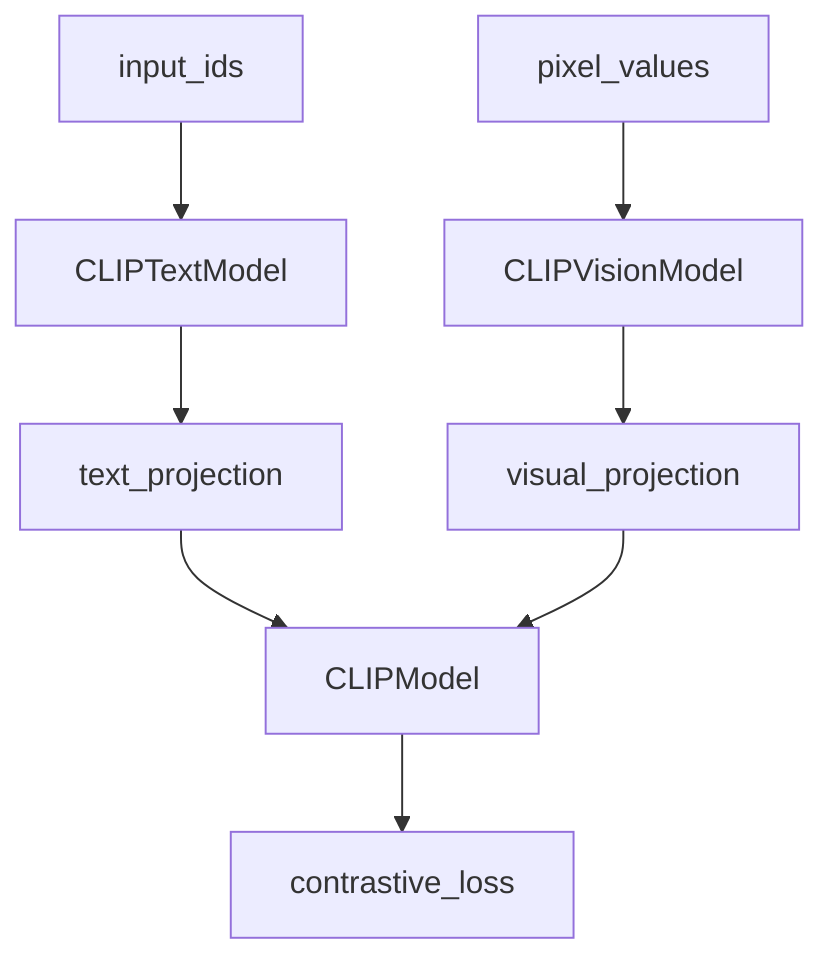
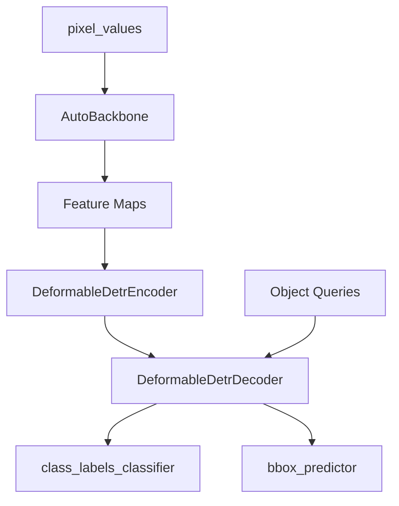

# 视觉与计算机视觉模型 (Vision and Computer Vision Models)

相关源文件

-   [docs/source/en/model\_doc/depth\_anything.md](https://github.com/huggingface/transformers/blob/9a9997fd/docs/source/en/model_doc/depth_anything.md?plain=1)
-   [docs/source/en/model\_doc/depth\_anything\_v2.md](https://github.com/huggingface/transformers/blob/9a9997fd/docs/source/en/model_doc/depth_anything_v2.md?plain=1)
-   [docs/source/en/model\_doc/dinov2\_with\_registers.md](https://github.com/huggingface/transformers/blob/9a9997fd/docs/source/en/model_doc/dinov2_with_registers.md?plain=1)
-   [docs/source/en/model\_doc/siglip.md](https://github.com/huggingface/transformers/blob/9a9997fd/docs/source/en/model_doc/siglip.md?plain=1)
-   [docs/source/en/model\_doc/vivit.md](https://github.com/huggingface/transformers/blob/9a9997fd/docs/source/en/model_doc/vivit.md?plain=1)
-   [docs/source/en/tasks/zero\_shot\_image\_classification.md](https://github.com/huggingface/transformers/blob/9a9997fd/docs/source/en/tasks/zero_shot_image_classification.md?plain=1)
-   [src/transformers/models/align/modeling\_align.py](https://github.com/huggingface/transformers/blob/9a9997fd/src/transformers/models/align/modeling_align.py)
-   [src/transformers/models/altclip/modeling\_altclip.py](https://github.com/huggingface/transformers/blob/9a9997fd/src/transformers/models/altclip/modeling_altclip.py)
-   [src/transformers/models/audio\_spectrogram\_transformer/modeling\_audio\_spectrogram\_transformer.py](https://github.com/huggingface/transformers/blob/9a9997fd/src/transformers/models/audio_spectrogram_transformer/modeling_audio_spectrogram_transformer.py)
-   [src/transformers/models/bridgetower/modeling\_bridgetower.py](https://github.com/huggingface/transformers/blob/9a9997fd/src/transformers/models/bridgetower/modeling_bridgetower.py)
-   [src/transformers/models/chinese\_clip/modeling\_chinese\_clip.py](https://github.com/huggingface/transformers/blob/9a9997fd/src/transformers/models/chinese_clip/modeling_chinese_clip.py)
-   [src/transformers/models/clip/modeling\_clip.py](https://github.com/huggingface/transformers/blob/9a9997fd/src/transformers/models/clip/modeling_clip.py)
-   [src/transformers/models/clipseg/modeling\_clipseg.py](https://github.com/huggingface/transformers/blob/9a9997fd/src/transformers/models/clipseg/modeling_clipseg.py)
-   [src/transformers/models/conditional\_detr/modeling\_conditional\_detr.py](https://github.com/huggingface/transformers/blob/9a9997fd/src/transformers/models/conditional_detr/modeling_conditional_detr.py)
-   [src/transformers/models/deformable\_detr/modeling\_deformable\_detr.py](https://github.com/huggingface/transformers/blob/9a9997fd/src/transformers/models/deformable_detr/modeling_deformable_detr.py)
-   [src/transformers/models/deit/modeling\_deit.py](https://github.com/huggingface/transformers/blob/9a9997fd/src/transformers/models/deit/modeling_deit.py)
-   [src/transformers/models/depth\_anything/configuration\_depth\_anything.py](https://github.com/huggingface/transformers/blob/9a9997fd/src/transformers/models/depth_anything/configuration_depth_anything.py)
-   [src/transformers/models/depth\_anything/convert\_depth\_anything\_to\_hf.py](https://github.com/huggingface/transformers/blob/9a9997fd/src/transformers/models/depth_anything/convert_depth_anything_to_hf.py)
-   [src/transformers/models/depth\_anything/modeling\_depth\_anything.py](https://github.com/huggingface/transformers/blob/9a9997fd/src/transformers/models/depth_anything/modeling_depth_anything.py)
-   [src/transformers/models/detr/modeling\_detr.py](https://github.com/huggingface/transformers/blob/9a9997fd/src/transformers/models/detr/modeling_detr.py)
-   [src/transformers/models/dinov2/modeling\_dinov2.py](https://github.com/huggingface/transformers/blob/9a9997fd/src/transformers/models/dinov2/modeling_dinov2.py)
-   [src/transformers/models/dinov2\_with\_registers/\_\_init\_\_.py](https://github.com/huggingface/transformers/blob/9a9997fd/src/transformers/models/dinov2_with_registers/__init__.py)
-   [src/transformers/models/dinov2\_with\_registers/configuration\_dinov2\_with\_registers.py](https://github.com/huggingface/transformers/blob/9a9997fd/src/transformers/models/dinov2_with_registers/configuration_dinov2_with_registers.py)
-   [src/transformers/models/dinov2\_with\_registers/convert\_dinov2\_with\_registers\_to\_hf.py](https://github.com/huggingface/transformers/blob/9a9997fd/src/transformers/models/dinov2_with_registers/convert_dinov2_with_registers_to_hf.py)
-   [src/transformers/models/dinov2\_with\_registers/modeling\_dinov2\_with\_registers.py](https://github.com/huggingface/transformers/blob/9a9997fd/src/transformers/models/dinov2_with_registers/modeling_dinov2_with_registers.py)
-   [src/transformers/models/dinov2\_with\_registers/modular\_dinov2\_with\_registers.py](https://github.com/huggingface/transformers/blob/9a9997fd/src/transformers/models/dinov2_with_registers/modular_dinov2_with_registers.py)
-   [src/transformers/models/dpt/modeling\_dpt.py](https://github.com/huggingface/transformers/blob/9a9997fd/src/transformers/models/dpt/modeling_dpt.py)
-   [src/transformers/models/edgetam/modeling\_edgetam.py](https://github.com/huggingface/transformers/blob/9a9997fd/src/transformers/models/edgetam/modeling_edgetam.py)
-   [src/transformers/models/edgetam\_video/modeling\_edgetam\_video.py](https://github.com/huggingface/transformers/blob/9a9997fd/src/transformers/models/edgetam_video/modeling_edgetam_video.py)
-   [src/transformers/models/git/modeling\_git.py](https://github.com/huggingface/transformers/blob/9a9997fd/src/transformers/models/git/modeling_git.py)
-   [src/transformers/models/grounding\_dino/configuration\_grounding\_dino.py](https://github.com/huggingface/transformers/blob/9a9997fd/src/transformers/models/grounding_dino/configuration_grounding_dino.py)
-   [src/transformers/models/groupvit/modeling\_groupvit.py](https://github.com/huggingface/transformers/blob/9a9997fd/src/transformers/models/groupvit/modeling_groupvit.py)
-   [src/transformers/models/idefics/vision.py](https://github.com/huggingface/transformers/blob/9a9997fd/src/transformers/models/idefics/vision.py)
-   [src/transformers/models/ijepa/modeling\_ijepa.py](https://github.com/huggingface/transformers/blob/9a9997fd/src/transformers/models/ijepa/modeling_ijepa.py)
-   [src/transformers/models/kosmos2/modeling\_kosmos2.py](https://github.com/huggingface/transformers/blob/9a9997fd/src/transformers/models/kosmos2/modeling_kosmos2.py)
-   [src/transformers/models/mask2former/modeling\_mask2former.py](https://github.com/huggingface/transformers/blob/9a9997fd/src/transformers/models/mask2former/modeling_mask2former.py)
-   [src/transformers/models/maskformer/modeling\_maskformer.py](https://github.com/huggingface/transformers/blob/9a9997fd/src/transformers/models/maskformer/modeling_maskformer.py)
-   [src/transformers/models/mpt/configuration\_mpt.py](https://github.com/huggingface/transformers/blob/9a9997fd/src/transformers/models/mpt/configuration_mpt.py)
-   [src/transformers/models/oneformer/modeling\_oneformer.py](https://github.com/huggingface/transformers/blob/9a9997fd/src/transformers/models/oneformer/modeling_oneformer.py)
-   [src/transformers/models/owlv2/modeling\_owlv2.py](https://github.com/huggingface/transformers/blob/9a9997fd/src/transformers/models/owlv2/modeling_owlv2.py)
-   [src/transformers/models/owlvit/modeling\_owlvit.py](https://github.com/huggingface/transformers/blob/9a9997fd/src/transformers/models/owlvit/modeling_owlvit.py)
-   [src/transformers/models/sam/configuration\_sam.py](https://github.com/huggingface/transformers/blob/9a9997fd/src/transformers/models/sam/configuration_sam.py)
-   [src/transformers/models/sam/modeling\_sam.py](https://github.com/huggingface/transformers/blob/9a9997fd/src/transformers/models/sam/modeling_sam.py)
-   [src/transformers/models/sam2/modeling\_sam2.py](https://github.com/huggingface/transformers/blob/9a9997fd/src/transformers/models/sam2/modeling_sam2.py)
-   [src/transformers/models/sam2/modular\_sam2.py](https://github.com/huggingface/transformers/blob/9a9997fd/src/transformers/models/sam2/modular_sam2.py)
-   [src/transformers/models/sam2\_video/modeling\_sam2\_video.py](https://github.com/huggingface/transformers/blob/9a9997fd/src/transformers/models/sam2_video/modeling_sam2_video.py)
-   [src/transformers/models/sam2\_video/modular\_sam2\_video.py](https://github.com/huggingface/transformers/blob/9a9997fd/src/transformers/models/sam2_video/modular_sam2_video.py)
-   [src/transformers/models/sam3\_tracker/modeling\_sam3\_tracker.py](https://github.com/huggingface/transformers/blob/9a9997fd/src/transformers/models/sam3_tracker/modeling_sam3_tracker.py)
-   [src/transformers/models/sam3\_tracker/modular\_sam3\_tracker.py](https://github.com/huggingface/transformers/blob/9a9997fd/src/transformers/models/sam3_tracker/modular_sam3_tracker.py)
-   [src/transformers/models/sam3\_tracker\_video/modeling\_sam3\_tracker\_video.py](https://github.com/huggingface/transformers/blob/9a9997fd/src/transformers/models/sam3_tracker_video/modeling_sam3_tracker_video.py)
-   [src/transformers/models/sam\_hq/configuration\_sam\_hq.py](https://github.com/huggingface/transformers/blob/9a9997fd/src/transformers/models/sam_hq/configuration_sam_hq.py)
-   [src/transformers/models/sam\_hq/modeling\_sam\_hq.py](https://github.com/huggingface/transformers/blob/9a9997fd/src/transformers/models/sam_hq/modeling_sam_hq.py)
-   [src/transformers/models/sam\_hq/modular\_sam\_hq.py](https://github.com/huggingface/transformers/blob/9a9997fd/src/transformers/models/sam_hq/modular_sam_hq.py)
-   [src/transformers/models/siglip/modeling\_siglip.py](https://github.com/huggingface/transformers/blob/9a9997fd/src/transformers/models/siglip/modeling_siglip.py)
-   [src/transformers/models/siglip2/modeling\_siglip2.py](https://github.com/huggingface/transformers/blob/9a9997fd/src/transformers/models/siglip2/modeling_siglip2.py)
-   [src/transformers/models/table\_transformer/modeling\_table\_transformer.py](https://github.com/huggingface/transformers/blob/9a9997fd/src/transformers/models/table_transformer/modeling_table_transformer.py)
-   [src/transformers/models/videomae/modeling\_videomae.py](https://github.com/huggingface/transformers/blob/9a9997fd/src/transformers/models/videomae/modeling_videomae.py)
-   [src/transformers/models/vit/modeling\_vit.py](https://github.com/huggingface/transformers/blob/9a9997fd/src/transformers/models/vit/modeling_vit.py)
-   [src/transformers/models/vit\_mae/modeling\_vit\_mae.py](https://github.com/huggingface/transformers/blob/9a9997fd/src/transformers/models/vit_mae/modeling_vit_mae.py)
-   [src/transformers/models/vit\_msn/modeling\_vit\_msn.py](https://github.com/huggingface/transformers/blob/9a9997fd/src/transformers/models/vit_msn/modeling_vit_msn.py)
-   [src/transformers/models/vitdet/modeling\_vitdet.py](https://github.com/huggingface/transformers/blob/9a9997fd/src/transformers/models/vitdet/modeling_vitdet.py)
-   [src/transformers/models/vivit/modeling\_vivit.py](https://github.com/huggingface/transformers/blob/9a9997fd/src/transformers/models/vivit/modeling_vivit.py)
-   [src/transformers/models/x\_clip/modeling\_x\_clip.py](https://github.com/huggingface/transformers/blob/9a9997fd/src/transformers/models/x_clip/modeling_x_clip.py)
-   [src/transformers/models/yolos/modeling\_yolos.py](https://github.com/huggingface/transformers/blob/9a9997fd/src/transformers/models/yolos/modeling_yolos.py)
-   [src/transformers/models/zoedepth/modeling\_zoedepth.py](https://github.com/huggingface/transformers/blob/9a9997fd/src/transformers/models/zoedepth/modeling_zoedepth.py)
-   [src/transformers/utils/backbone\_utils.py](https://github.com/huggingface/transformers/blob/9a9997fd/src/transformers/utils/backbone_utils.py)
-   [tests/models/conditional\_detr/test\_modeling\_conditional\_detr.py](https://github.com/huggingface/transformers/blob/9a9997fd/tests/models/conditional_detr/test_modeling_conditional_detr.py)
-   [tests/models/deformable\_detr/test\_modeling\_deformable\_detr.py](https://github.com/huggingface/transformers/blob/9a9997fd/tests/models/deformable_detr/test_modeling_deformable_detr.py)
-   [tests/models/depth\_anything/test\_modeling\_depth\_anything.py](https://github.com/huggingface/transformers/blob/9a9997fd/tests/models/depth_anything/test_modeling_depth_anything.py)
-   [tests/models/detr/test\_modeling\_detr.py](https://github.com/huggingface/transformers/blob/9a9997fd/tests/models/detr/test_modeling_detr.py)
-   [tests/models/dinov2/test\_modeling\_dinov2.py](https://github.com/huggingface/transformers/blob/9a9997fd/tests/models/dinov2/test_modeling_dinov2.py)
-   [tests/models/dpt/test\_modeling\_dpt.py](https://github.com/huggingface/transformers/blob/9a9997fd/tests/models/dpt/test_modeling_dpt.py)
-   [tests/models/dpt/test\_modeling\_dpt\_auto\_backbone.py](https://github.com/huggingface/transformers/blob/9a9997fd/tests/models/dpt/test_modeling_dpt_auto_backbone.py)
-   [tests/models/dpt/test\_modeling\_dpt\_hybrid.py](https://github.com/huggingface/transformers/blob/9a9997fd/tests/models/dpt/test_modeling_dpt_hybrid.py)
-   [tests/models/mask2former/test\_modeling\_mask2former.py](https://github.com/huggingface/transformers/blob/9a9997fd/tests/models/mask2former/test_modeling_mask2former.py)
-   [tests/models/maskformer/test\_modeling\_maskformer.py](https://github.com/huggingface/transformers/blob/9a9997fd/tests/models/maskformer/test_modeling_maskformer.py)
-   [tests/models/mpt/test\_modeling\_mpt.py](https://github.com/huggingface/transformers/blob/9a9997fd/tests/models/mpt/test_modeling_mpt.py)
-   [tests/models/nemotron/test\_modeling\_nemotron.py](https://github.com/huggingface/transformers/blob/9a9997fd/tests/models/nemotron/test_modeling_nemotron.py)
-   [tests/models/oneformer/test\_modeling\_oneformer.py](https://github.com/huggingface/transformers/blob/9a9997fd/tests/models/oneformer/test_modeling_oneformer.py)
-   [tests/models/owlv2/test\_modeling\_owlv2.py](https://github.com/huggingface/transformers/blob/9a9997fd/tests/models/owlv2/test_modeling_owlv2.py)
-   [tests/models/owlvit/test\_modeling\_owlvit.py](https://github.com/huggingface/transformers/blob/9a9997fd/tests/models/owlvit/test_modeling_owlvit.py)
-   [tests/models/prompt\_depth\_anything/test\_modeling\_prompt\_depth\_anything.py](https://github.com/huggingface/transformers/blob/9a9997fd/tests/models/prompt_depth_anything/test_modeling_prompt_depth_anything.py)
-   [tests/models/pvt/test\_modeling\_pvt.py](https://github.com/huggingface/transformers/blob/9a9997fd/tests/models/pvt/test_modeling_pvt.py)
-   [tests/models/sam/test\_modeling\_sam.py](https://github.com/huggingface/transformers/blob/9a9997fd/tests/models/sam/test_modeling_sam.py)
-   [tests/models/sam\_hq/test\_modeling\_sam\_hq.py](https://github.com/huggingface/transformers/blob/9a9997fd/tests/models/sam_hq/test_modeling_sam_hq.py)
-   [tests/models/siglip/test\_modeling\_siglip.py](https://github.com/huggingface/transformers/blob/9a9997fd/tests/models/siglip/test_modeling_siglip.py)
-   [tests/models/siglip2/test\_modeling\_siglip2.py](https://github.com/huggingface/transformers/blob/9a9997fd/tests/models/siglip2/test_modeling_siglip2.py)
-   [tests/models/table\_transformer/test\_modeling\_table\_transformer.py](https://github.com/huggingface/transformers/blob/9a9997fd/tests/models/table_transformer/test_modeling_table_transformer.py)
-   [tests/models/timm\_backbone/test\_modeling\_timm\_backbone.py](https://github.com/huggingface/transformers/blob/9a9997fd/tests/models/timm_backbone/test_modeling_timm_backbone.py)
-   [tests/models/video\_llama\_3/test\_modeling\_video\_llama\_3.py](https://github.com/huggingface/transformers/blob/9a9997fd/tests/models/video_llama_3/test_modeling_video_llama_3.py)
-   [tests/models/vit\_mae/test\_modeling\_vit\_mae.py](https://github.com/huggingface/transformers/blob/9a9997fd/tests/models/vit_mae/test_modeling_vit_mae.py)
-   [tests/models/vitdet/test\_modeling\_vitdet.py](https://github.com/huggingface/transformers/blob/9a9997fd/tests/models/vitdet/test_modeling_vitdet.py)
-   [tests/models/vivit/test\_modeling\_vivit.py](https://github.com/huggingface/transformers/blob/9a9997fd/tests/models/vivit/test_modeling_vivit.py)
-   [tests/utils/test\_backbone\_utils.py](https://github.com/huggingface/transformers/blob/9a9997fd/tests/utils/test_backbone_utils.py)

Transformers 库为计算机视觉任务提供了一套全面的模型，范围从通用图像编码器到用于目标检测和分割的专门架构。这些模型利用与 NLP 对应模型相同的 `PreTrainedModel` 基类，从而实现跨模态加载、保存和推理的统一 API。

## 对比视觉语言模型 (CLIP/SigLIP) (Contrastive Vision-Language Models (CLIP/SigLIP))

诸如 CLIP 和 SigLIP 之类的对比模型经过训练，可在共享的嵌入空间中对齐图像和文本。它们由一个视觉编码器和一个文本编码器组成，其目标是最大化匹配对之间的相似度。

### 实现细节 (Implementation Details)

-   **CLIP**：为其文本编码器使用因果掩码 `<FileRef file-url="https://github.com/huggingface/transformers/blob/9a9997fd/src/transformers/models/clip/modeling_clip.py#L25-L25" min=25 file-path="src/transformers/models/clip/modeling_clip.py">Hii</FileRef>`，其视觉编码器包含一个预置在分片嵌入前的可学习 `class_embedding` `<FileRef file-url="https://github.com/huggingface/transformers/blob/9a9997fd/src/transformers/models/clip/modeling_clip.py#L146-L146" min=146 file-path="src/transformers/models/clip/modeling_clip.py">Hii</FileRef>`。
-   **SigLIP**：用成对 sigmoid 损失 (pairwise sigmoid loss) 替换了标准的 softmax 交叉熵损失，这更加节省内存且在大规模环境下表现更好。与 CLIP 不同，SigLIP 的视觉编码器通常省略 `class_embedding`，而代之以全局平均池化 (global average pooling) 或专门的注意力池化头 (dedicated attention pooling head) `<FileRef file-url="https://github.com/huggingface/transformers/blob/9a9997fd/src/transformers/models/siglip/modeling_siglip.py#L133-L152" min=133 max=152 file-path="src/transformers/models/siglip/modeling_siglip.py">Hii</FileRef>`。
-   **损失函数**：CLIP 利用应用于图像到文本和文本到图像相似度的 `contrastive_loss` `<FileRef file-url="https://github.com/huggingface/transformers/blob/9a9997fd/src/transformers/models/clip/modeling_clip.py#L47-L54" min=47 max=54 file-path="src/transformers/models/clip/modeling_clip.py">Hii</FileRef>`。

### 数据流：对比对齐 (Data Flow: Contrastive Alignment)

下图说明了从原始输入到共享嵌入空间的数据流。

**CLIP/SigLIP 嵌入流**

来源：`<FileRef file-url="https://github.com/huggingface/transformers/blob/9a9997fd/src/transformers/models/clip/modeling_clip.py#L106-L132" min=106 max=132 file-path="src/transformers/models/clip/modeling_clip.py">Hii</FileRef>`, `<FileRef file-url="https://github.com/huggingface/transformers/blob/9a9997fd/src/transformers/models/siglip/modeling_siglip.py#L84-L110" min=84 max=110 file-path="src/transformers/models/siglip/modeling_siglip.py">Hii</FileRef>`

## 图像编码器与骨干网络 (ViT, DINOv2) (Image Encoders and Backbones (ViT, DINOv2))

纯视觉模型是下游任务的基础。库支持标准的视觉 Transformer (Vision Transformers, ViT) 及其自监督变体（如 DINOv2）。

### 关键组件 (Key Components)

-   **分片嵌入 (Patch Embeddings)**：使用 2D 卷积将图像拆分为固定大小的分片，并投影到线性嵌入空间 `<FileRef file-url="https://github.com/huggingface/transformers/blob/9a9997fd/src/transformers/models/siglip/modeling_siglip.py#L124-L130" min=124 max=130 file-path="src/transformers/models/siglip/modeling_siglip.py">Hii</FileRef>`。
-   **位置编码器 (Position Encoders)**：由于 Transformer 是置换不变的，因此添加了位置嵌入。像 DINOv2 这样的模型支持 `interpolate_pos_encoding` 来处理动态输入分辨率 `<FileRef file-url="https://github.com/huggingface/transformers/blob/9a9997fd/src/transformers/models/siglip/modeling_siglip.py#L137-L160" min=137 max=160 file-path="src/transformers/models/siglip/modeling_siglip.py">Hii</FileRef>`。
-   **骨干网络实用工具 (Backbone Utilities)**：`AutoBackbone` 类和 `load_backbone` 实用工具允许视觉模型在更大的架构中作为特征提取器使用（例如在 DETR 中） `<FileRef file-url="https://github.com/huggingface/transformers/blob/9a9997fd/src/transformers/backbone_utils.py#L32-L32" min=32 file-path="src/transformers/backbone_utils.py">Hii</FileRef>`。

来源：`<FileRef file-url="https://github.com/huggingface/transformers/blob/9a9997fd/src/transformers/models/siglip/modeling_siglip.py#L116-L136" min=116 max=136 file-path="src/transformers/models/siglip/modeling_siglip.py">Hii</FileRef>`, `<FileRef file-url="https://github.com/huggingface/transformers/blob/9a9997fd/src/transformers/models/dinov2/modeling_dinov2.py#L1-L1" min=1 file-path="src/transformers/models/dinov2/modeling_dinov2.py">Hii</FileRef>`

## 目标检测 (DETR 与 Deformable-DETR) (Object Detection (DETR & Deformable-DETR))

Transformers 中的目标检测模型通常遵循 DETR（目标检测 Transformer, DEtection TRansformer）范式，该范式使用 Transformer 编码器-解码器将检测视为集合预测问题。

### 架构特性 (Architecture Features)

-   **目标查询 (Object Queries)**：一组固定的可学习嵌入，在解码器中与图像特征交互以预测边界框和类别 `<FileRef file-url="https://github.com/huggingface/transformers/blob/9a9997fd/src/transformers/models/deformable_detr/modeling_deformable_detr.py#L84-L98" min=84 max=98 file-path="src/transformers/models/deformable_detr/modeling_deformable_detr.py">Hii</FileRef>`。
-   **可变形注意力 (Deformable Attention)**：用于 `DeformableDetr`，仅关注参考点周围的一小部分关键采样点，从而显著加快收敛速度并处理多尺度特征 `<FileRef file-url="https://github.com/huggingface/transformers/blob/9a9997fd/src/transformers/models/deformable_detr/modeling_deformable_detr.py#L58-L74" min=58 max=74 file-path="src/transformers/models/deformable_detr/modeling_deformable_detr.py">Hii</FileRef>`。
-   **两阶段检测 (Two-Stage Detection)**：某些变体（如 Deformable-DETR）使用第一阶段生成区域建议 (region proposals)，从而初始化第二阶段的参考点 `<FileRef file-url="https://github.com/huggingface/transformers/blob/9a9997fd/src/transformers/models/deformable_detr/modeling_deformable_detr.py#L92-L98" min=92 max=98 file-path="src/transformers/models/deformable_detr/modeling_deformable_detr.py">Hii</FileRef>`。

**DETR 目标检测流水线**

来源：`<FileRef file-url="https://github.com/huggingface/transformers/blob/9a9997fd/src/transformers/models/deformable_detr/modeling_deformable_detr.py#L120-L140" min=120 max=140 file-path="src/transformers/models/deformable_detr/modeling_deformable_detr.py">Hii</FileRef>`, `<FileRef file-url="https://github.com/huggingface/transformers/blob/9a9997fd/src/transformers/models/conditional_detr/modeling_conditional_detr.py#L98-L130" min=98 max=130 file-path="src/transformers/models/conditional_detr/modeling_conditional_detr.py">Hii</FileRef>`

## 分割 (SAM, Mask2Former) (Segmentation (SAM, Mask2Former))

库为语义、实例和全景分割提供模型，包括分割一切模型 (Segment Anything Model, SAM)。

### 分割一切模型 (SAM) (Segment Anything Model (SAM))

SAM 设计用于可提示分割。它由三个模块组成：

1.  **视觉编码器 (VisionEncoder)**：一个重型的基于 ViT 的编码器，生成图像嵌入 `<FileRef file-url="https://github.com/huggingface/transformers/blob/9a9997fd/src/transformers/models/sam/modeling_sam.py#L47-L57" min=47 max=57 file-path="src/transformers/models/sam/modeling_sam.py">Hii</FileRef>`。
2.  **提示编码器 (PromptEncoder)**：将稀疏提示（点、框）和稠密提示（掩码）编码为标记 `<FileRef file-url="https://github.com/huggingface/transformers/blob/9a9997fd/src/transformers/models/sam/modeling_sam.py#L34-L34" min=34 file-path="src/transformers/models/sam/modeling_sam.py">Hii</FileRef>`。
3.  **掩码解码器 (MaskDecoder)**：一个 Transformer 解码器，将图像嵌入和提示标记映射到掩码预测和 IoU 分数 `<FileRef file-url="https://github.com/huggingface/transformers/blob/9a9997fd/src/transformers/models/sam/modeling_sam.py#L65-L95" min=65 max=95 file-path="src/transformers/models/sam/modeling_sam.py">Hii</FileRef>`。

### Mask2Former 与 MaskFormer

这些模型使用“掩码分类”方法。

-   **像素解码器 (Pixel Decoder)**：计算逐像素嵌入和多尺度特征 `<FileRef file-url="https://github.com/huggingface/transformers/blob/9a9997fd/src/transformers/models/mask2former/modeling_mask2former.py#L46-L70" min=46 max=70 file-path="src/transformers/models/mask2former/modeling_mask2former.py">Hii</FileRef>`。
-   **Transformer 解码器**：预测一组二值掩码及其对应的类别标签 `<FileRef file-url="https://github.com/huggingface/transformers/blob/9a9997fd/src/transformers/models/mask2former/modeling_mask2former.py#L143-L160" min=143 max=160 file-path="src/transformers/models/mask2former/modeling_mask2former.py">Hii</FileRef>`。

来源：`<FileRef file-url="https://github.com/huggingface/transformers/blob/9a9997fd/src/transformers/models/sam/modeling_sam.py#L1-L130" min=1 max=130 file-path="src/transformers/models/sam/modeling_sam.py">Hii</FileRef>`, `<FileRef file-url="https://github.com/huggingface/transformers/blob/9a9997fd/src/transformers/models/mask2former/modeling_mask2former.py#L104-L140" min=104 max=140 file-path="src/transformers/models/mask2former/modeling_mask2former.py">Hii</FileRef>`, `<FileRef file-url="https://github.com/huggingface/transformers/blob/9a9997fd/src/transformers/models/maskformer/modeling_maskformer.py#L135-L160" min=135 max=160 file-path="src/transformers/models/maskformer/modeling_maskformer.py">Hii</FileRef>`

## 视觉模型任务摘要 (Summary of Vision Model Tasks)

| 模型系列 | 主要任务 | 关键类 | 输出结构 |
| --- | --- | --- | --- |
| **CLIP** | 对比学习 | `CLIPModel` | `CLIPOutput` |
| **SigLIP** | 对比学习 | `SiglipModel` | `SiglipOutput` |
| **ViT** | 图像分类 | `ViTForImageClassification` | `ImageClassifierOutput` |
| **DETR** | 目标检测 | `DetrForObjectDetection` | `DetrObjectDetectionOutput` |
| **SAM** | 分割 | `SamModel` | `SamImageSegmentationOutput` |
| **Mask2Former** | 全景分割 | `Mask2FormerForUniversalSegmentation` | `Mask2FormerModelOutput` |

来源：`<FileRef file-url="https://github.com/huggingface/transformers/blob/9a9997fd/src/transformers/models/clip/modeling_clip.py#L106-L106" min=106 file-path="src/transformers/models/clip/modeling_clip.py">Hii</FileRef>`, `<FileRef file-url="https://github.com/huggingface/transformers/blob/9a9997fd/src/transformers/models/siglip/modeling_siglip.py#L84-L84" min=84 file-path="src/transformers/models/siglip/modeling_siglip.py">Hii</FileRef>`, `<FileRef file-url="https://github.com/huggingface/transformers/blob/9a9997fd/src/transformers/models/deformable_detr/modeling_deformable_detr.py#L120-L120" min=120 file-path="src/transformers/models/deformable_detr/modeling_deformable_detr.py">Hii</FileRef>`, `<FileRef file-url="https://github.com/huggingface/transformers/blob/9a9997fd/src/transformers/models/sam/modeling_sam.py#L65-L65" min=65 file-path="src/transformers/models/sam/modeling_sam.py">Hii</FileRef>`
