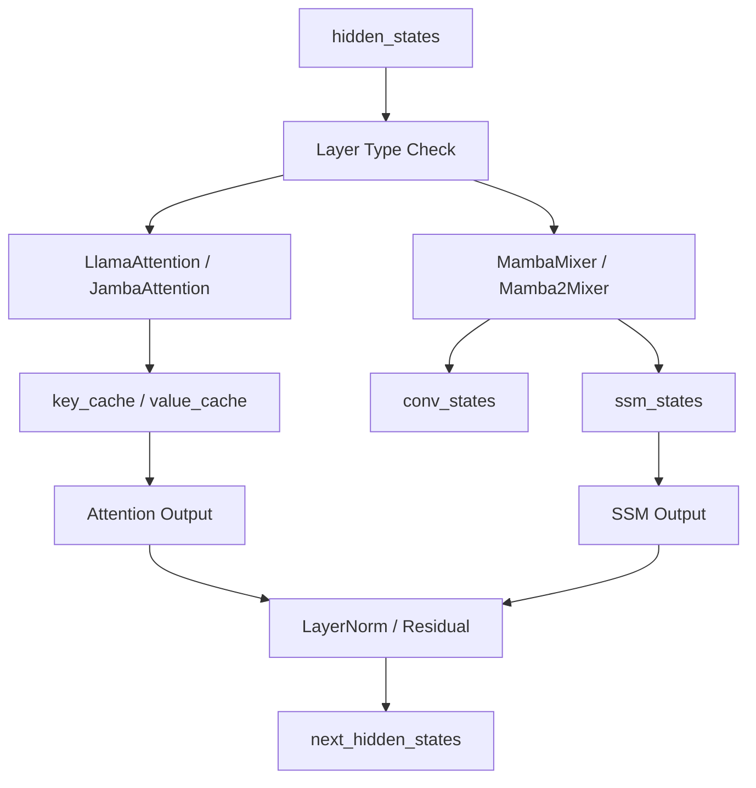
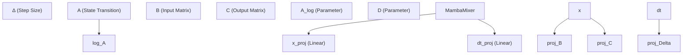

# 状态空间与循环模型 (State Space and Recurrent Models)

相关源文件

-   [docs/source/en/model\_doc/falcon\_mamba.md](https://github.com/huggingface/transformers/blob/9a9997fd/docs/source/en/model_doc/falcon_mamba.md?plain=1)
-   [docs/source/en/model\_doc/granitemoehybrid.md](https://github.com/huggingface/transformers/blob/9a9997fd/docs/source/en/model_doc/granitemoehybrid.md?plain=1)
-   [src/transformers/models/bamba/modeling\_bamba.py](https://github.com/huggingface/transformers/blob/9a9997fd/src/transformers/models/bamba/modeling_bamba.py)
-   [src/transformers/models/bamba/modular\_bamba.py](https://github.com/huggingface/transformers/blob/9a9997fd/src/transformers/models/bamba/modular_bamba.py)
-   [src/transformers/models/canine/modeling\_canine.py](https://github.com/huggingface/transformers/blob/9a9997fd/src/transformers/models/canine/modeling_canine.py)
-   [src/transformers/models/ctrl/modeling\_ctrl.py](https://github.com/huggingface/transformers/blob/9a9997fd/src/transformers/models/ctrl/modeling_ctrl.py)
-   [src/transformers/models/dbrx/modeling\_dbrx.py](https://github.com/huggingface/transformers/blob/9a9997fd/src/transformers/models/dbrx/modeling_dbrx.py)
-   [src/transformers/models/falcon\_h1/modeling\_falcon\_h1.py](https://github.com/huggingface/transformers/blob/9a9997fd/src/transformers/models/falcon_h1/modeling_falcon_h1.py)
-   [src/transformers/models/falcon\_h1/modular\_falcon\_h1.py](https://github.com/huggingface/transformers/blob/9a9997fd/src/transformers/models/falcon_h1/modular_falcon_h1.py)
-   [src/transformers/models/falcon\_mamba/configuration\_falcon\_mamba.py](https://github.com/huggingface/transformers/blob/9a9997fd/src/transformers/models/falcon_mamba/configuration_falcon_mamba.py)
-   [src/transformers/models/falcon\_mamba/modeling\_falcon\_mamba.py](https://github.com/huggingface/transformers/blob/9a9997fd/src/transformers/models/falcon_mamba/modeling_falcon_mamba.py)
-   [src/transformers/models/falcon\_mamba/modular\_falcon\_mamba.py](https://github.com/huggingface/transformers/blob/9a9997fd/src/transformers/models/falcon_mamba/modular_falcon_mamba.py)
-   [src/transformers/models/granitemoe/modeling\_granitemoe.py](https://github.com/huggingface/transformers/blob/9a9997fd/src/transformers/models/granitemoe/modeling_granitemoe.py)
-   [src/transformers/models/granitemoehybrid/modeling\_granitemoehybrid.py](https://github.com/huggingface/transformers/blob/9a9997fd/src/transformers/models/granitemoehybrid/modeling_granitemoehybrid.py)
-   [src/transformers/models/granitemoehybrid/modular\_granitemoehybrid.py](https://github.com/huggingface/transformers/blob/9a9997fd/src/transformers/models/granitemoehybrid/modular_granitemoehybrid.py)
-   [src/transformers/models/granitemoeshared/modeling\_granitemoeshared.py](https://github.com/huggingface/transformers/blob/9a9997fd/src/transformers/models/granitemoeshared/modeling_granitemoeshared.py)
-   [src/transformers/models/granitemoeshared/modular\_granitemoeshared.py](https://github.com/huggingface/transformers/blob/9a9997fd/src/transformers/models/granitemoeshared/modular_granitemoeshared.py)
-   [src/transformers/models/jamba/modeling\_jamba.py](https://github.com/huggingface/transformers/blob/9a9997fd/src/transformers/models/jamba/modeling_jamba.py)
-   [src/transformers/models/jamba/modular\_jamba.py](https://github.com/huggingface/transformers/blob/9a9997fd/src/transformers/models/jamba/modular_jamba.py)
-   [src/transformers/models/jetmoe/modeling\_jetmoe.py](https://github.com/huggingface/transformers/blob/9a9997fd/src/transformers/models/jetmoe/modeling_jetmoe.py)
-   [src/transformers/models/mamba/configuration\_mamba.py](https://github.com/huggingface/transformers/blob/9a9997fd/src/transformers/models/mamba/configuration_mamba.py)
-   [src/transformers/models/mamba/modeling\_mamba.py](https://github.com/huggingface/transformers/blob/9a9997fd/src/transformers/models/mamba/modeling_mamba.py)
-   [src/transformers/models/mamba2/configuration\_mamba2.py](https://github.com/huggingface/transformers/blob/9a9997fd/src/transformers/models/mamba2/configuration_mamba2.py)
-   [src/transformers/models/mamba2/modeling\_mamba2.py](https://github.com/huggingface/transformers/blob/9a9997fd/src/transformers/models/mamba2/modeling_mamba2.py)
-   [src/transformers/models/mpt/modeling\_mpt.py](https://github.com/huggingface/transformers/blob/9a9997fd/src/transformers/models/mpt/modeling_mpt.py)
-   [src/transformers/models/olmoe/modeling\_olmoe.py](https://github.com/huggingface/transformers/blob/9a9997fd/src/transformers/models/olmoe/modeling_olmoe.py)
-   [src/transformers/models/openai/modeling\_openai.py](https://github.com/huggingface/transformers/blob/9a9997fd/src/transformers/models/openai/modeling_openai.py)
-   [src/transformers/models/phimoe/modeling\_phimoe.py](https://github.com/huggingface/transformers/blob/9a9997fd/src/transformers/models/phimoe/modeling_phimoe.py)
-   [src/transformers/models/recurrent\_gemma/configuration\_recurrent\_gemma.py](https://github.com/huggingface/transformers/blob/9a9997fd/src/transformers/models/recurrent_gemma/configuration_recurrent_gemma.py)
-   [src/transformers/models/rwkv/configuration\_rwkv.py](https://github.com/huggingface/transformers/blob/9a9997fd/src/transformers/models/rwkv/configuration_rwkv.py)
-   [src/transformers/models/zamba/modeling\_zamba.py](https://github.com/huggingface/transformers/blob/9a9997fd/src/transformers/models/zamba/modeling_zamba.py)
-   [src/transformers/models/zamba2/configuration\_zamba2.py](https://github.com/huggingface/transformers/blob/9a9997fd/src/transformers/models/zamba2/configuration_zamba2.py)
-   [src/transformers/models/zamba2/modeling\_zamba2.py](https://github.com/huggingface/transformers/blob/9a9997fd/src/transformers/models/zamba2/modeling_zamba2.py)
-   [src/transformers/models/zamba2/modular\_zamba2.py](https://github.com/huggingface/transformers/blob/9a9997fd/src/transformers/models/zamba2/modular_zamba2.py)
-   [tests/models/bamba/test\_modeling\_bamba.py](https://github.com/huggingface/transformers/blob/9a9997fd/tests/models/bamba/test_modeling_bamba.py)
-   [tests/models/deepseek\_v3/test\_modeling\_deepseek\_v3.py](https://github.com/huggingface/transformers/blob/9a9997fd/tests/models/deepseek_v3/test_modeling_deepseek_v3.py)
-   [tests/models/falcon\_h1/test\_modeling\_falcon\_h1.py](https://github.com/huggingface/transformers/blob/9a9997fd/tests/models/falcon_h1/test_modeling_falcon_h1.py)
-   [tests/models/falcon\_mamba/test\_modeling\_falcon\_mamba.py](https://github.com/huggingface/transformers/blob/9a9997fd/tests/models/falcon_mamba/test_modeling_falcon_mamba.py)
-   [tests/models/helium/test\_modeling\_helium.py](https://github.com/huggingface/transformers/blob/9a9997fd/tests/models/helium/test_modeling_helium.py)
-   [tests/models/jamba/test\_modeling\_jamba.py](https://github.com/huggingface/transformers/blob/9a9997fd/tests/models/jamba/test_modeling_jamba.py)
-   [tests/models/mamba/test\_modeling\_mamba.py](https://github.com/huggingface/transformers/blob/9a9997fd/tests/models/mamba/test_modeling_mamba.py)
-   [tests/models/mamba2/test\_modeling\_mamba2.py](https://github.com/huggingface/transformers/blob/9a9997fd/tests/models/mamba2/test_modeling_mamba2.py)
-   [tests/models/openai/test\_modeling\_openai.py](https://github.com/huggingface/transformers/blob/9a9997fd/tests/models/openai/test_modeling_openai.py)
-   [tests/models/recurrent\_gemma/test\_modeling\_recurrent\_gemma.py](https://github.com/huggingface/transformers/blob/9a9997fd/tests/models/recurrent_gemma/test_modeling_recurrent_gemma.py)
-   [tests/models/zamba/test\_modeling\_zamba.py](https://github.com/huggingface/transformers/blob/9a9997fd/tests/models/zamba/test_modeling_zamba.py)
-   [tests/models/zamba2/test\_modeling\_zamba2.py](https://github.com/huggingface/transformers/blob/9a9997fd/tests/models/zamba2/test_modeling_zamba2.py)

本页面记录了 `transformers` 库中非 Transformer 序列模型和混合架构的实现。这些模型利用诸如 Mamba 之类的状态空间模型 (State Space Models, SSM)、诸如 RWKV 之类的线性递归机制，或者 SSM 与注意力层的混合组合，以实现相对于序列长度的线性缩放。

## 状态空间模型 (SSM) 概述 (Overview of State Space Models (SSM))

库中的状态空间模型（主要是 Mamba 系列）用选择性扫描 (selective scan) 操作取代了标准的 $O(N^2)$ 注意力机制。这允许在推理过程中保持固定大小的状态，使其对于长上下文生成非常高效。

### Mamba (SSM)

Mamba 架构的核心是 `MambaMixer` [src/transformers/models/mamba/modeling\_mamba.py169-175](https://github.com/huggingface/transformers/blob/9a9997fd/src/transformers/models/mamba/modeling_mamba.py#L169-L175)，它计算状态空间参数 $\Delta, A, B, C$ 和 $D$。与线性时不变系统不同，Mamba 是**选择性的**，因为 $\Delta, B$ 和 $C$ 是输入相关的 [src/transformers/models/mamba/modeling\_mamba.py172-174](https://github.com/huggingface/transformers/blob/9a9997fd/src/transformers/models/mamba/modeling_mamba.py#L172-L174)。

### Mamba2

Mamba2 引入了“结构化状态空间对偶性” (Structured State Space Duality, SSD) 方法。它按块处理序列以提高硬件利用率。关键实用工具包括用于稳定累积和计算的 `segment_sum` [src/transformers/models/mamba2/modeling\_mamba2.py70-88](https://github.com/huggingface/transformers/blob/9a9997fd/src/transformers/models/mamba2/modeling_mamba2.py#L70-L88)，以及用于将张量拆分为与 SSD 内核兼容的序列的 `reshape_into_chunks` [src/transformers/models/mamba2/modeling\_mamba2.py50-67](https://github.com/huggingface/transformers/blob/9a9997fd/src/transformers/models/mamba2/modeling_mamba2.py#L50-L67)。

**来源：**

-   [src/transformers/models/mamba/modeling\_mamba.py](https://github.com/huggingface/transformers/blob/9a9997fd/src/transformers/models/mamba/modeling_mamba.py)
-   [src/transformers/models/mamba2/modeling\_mamba2.py](https://github.com/huggingface/transformers/blob/9a9997fd/src/transformers/models/mamba2/modeling_mamba2.py)

---

## 混合架构 (Hybrid Architectures)

混合模型结合了 Transformer（高容量全局建模）和 SSM（高效长上下文处理）的优势。

### Jamba

Jamba 采用基于块的混合方法，其中各层在注意力 (Attention) 和 Mamba 之间交替。`JambaConfig` 通过 `attn_layer_offset` 和 `attn_layer_period` 定义了交错模式 [src/transformers/models/jamba/test\_modeling\_jamba.py109-111](https://github.com/huggingface/transformers/blob/9a9997fd/src/transformers/models/jamba/test_modeling_jamba.py#L109-L111)。

### Bamba

Bamba 是一种混合模型，它将 Llama 风格的注意力和 MLP 层与 Mamba2 混合器集成在一起。它使用专门的 `HybridMambaAttentionDynamicCache` [src/transformers/models/bamba/modeling\_bamba.py79-91](https://github.com/huggingface/transformers/blob/9a9997fd/src/transformers/models/bamba/modeling_bamba.py#L79-L91) 来管理注意力层的 $O(N)$ KV 缓存和 Mamba 层的 $O(1)$ 状态缓存。

### Zamba2

Zamba2 模型利用“Zamba”骨干网络，通常由一个共享的 Transformer 块和独特的 SSM 层组成。

### 混合模型中的数据流 (Data Flow in Hybrid Models)

下图说明了混合块（例如 Jamba 或 Bamba）内部的路由逻辑及其与缓存系统的交互。

**混合层路由与缓存逻辑**

**来源：**

-   [src/transformers/models/jamba/modeling\_jamba.py77-118](https://github.com/huggingface/transformers/blob/9a9997fd/src/transformers/models/jamba/modeling_jamba.py#L77-L118)
-   [src/transformers/models/bamba/modeling\_bamba.py79-132](https://github.com/huggingface/transformers/blob/9a9997fd/src/transformers/models/bamba/modeling_bamba.py#L79-L132)
-   [src/transformers/models/bamba/modular\_bamba.py85-136](https://github.com/huggingface/transformers/blob/9a9997fd/src/transformers/models/bamba/modular_bamba.py#L85-L136)

---

## 循环模型的缓存管理 (Cache Management for Recurrent Models)

标准的 `DynamicCache` 对于循环模型是不够的，因为 SSM 需要持久的卷积和状态张量，而不是不断增长的 KV 张量。

### MambaCache

`MambaCache` 为每一层存储 `conv_states` 和 `ssm_states` [src/transformers/models/mamba/modeling\_mamba.py108-109](https://github.com/huggingface/transformers/blob/9a9997fd/src/transformers/models/mamba/modeling_mamba.py#L108-L109)。

-   **`conv_states`**：形状为 `(batch, intermediate_size, conv_kernel_size)` [src/transformers/models/mamba/modeling\_mamba.py112-118](https://github.com/huggingface/transformers/blob/9a9997fd/src/transformers/models/mamba/modeling_mamba.py#L112-L118)。
-   **`ssm_states`**：形状为 `(batch, intermediate_size, state_size)` [src/transformers/models/mamba/modeling\_mamba.py119-125](https://github.com/huggingface/transformers/blob/9a9997fd/src/transformers/models/mamba/modeling_mamba.py#L119-L125)。

### 混合缓存实现 (Hybrid Cache Implementation)

`HybridMambaAttentionDynamicCache` 类为包含两种层类型的模型提供统一接口。它维护张量列表，其中索引 `i` 对应第 `i` 层。如果第 `i` 层是 Mamba，则 KV 条目为空；如果是注意力层，则 SSM 条目为空 [src/transformers/models/jamba/modeling\_jamba.py84-88](https://github.com/huggingface/transformers/blob/9a9997fd/src/transformers/models/jamba/modeling_jamba.py#L84-L88)。

**缓存对象结构 (Cache Object Structure)**

| 模型系列 | 缓存类 | 关键属性 |
| --- | --- | --- |
| **Mamba** | `MambaCache` | `conv_states`, `ssm_states` |
| **Mamba2** | `Mamba2Cache` | `conv_states`, `ssm_states` (分组) |
| **Jamba / Bamba** | `HybridMambaAttentionDynamicCache` | `key_cache`, `value_cache`, `conv_states`, `ssm_states` |
| **Falcon Mamba** | `FalconMambaCache` | `conv_states`, `ssm_states` |

**来源：**

-   [src/transformers/models/mamba/modeling\_mamba.py58-89](https://github.com/huggingface/transformers/blob/9a9997fd/src/transformers/models/mamba/modeling_mamba.py#L58-L89)
-   [src/transformers/models/mamba2/modeling\_mamba2.py102-129](https://github.com/huggingface/transformers/blob/9a9997fd/src/transformers/models/mamba2/modeling_mamba2.py#L102-L129)
-   [src/transformers/models/falcon\_mamba/modeling\_falcon\_mamba.py60-91](https://github.com/huggingface/transformers/blob/9a9997fd/src/transformers/models/falcon_mamba/modeling_falcon_mamba.py#L60-L91)

---

## 实现细节：选择性扫描 (Implementation Details: Selective Scan)

库支持多个后端用于 Mamba 选择性扫描操作，以平衡可移植性和性能。

### 扫描后端 (Scan Backends)

1.  **`mambapy`**：如果可用，使用 `pscan` 函数 [src/transformers/models/mamba/modeling\_mamba.py52-55](https://github.com/huggingface/transformers/blob/9a9997fd/src/transformers/models/mamba/modeling_mamba.py#L52-L55)。
2.  **`torch.compile`**：在较新的 Torch 版本 (>= 2.9.0) 中利用 `associative_scan` [src/transformers/models/mamba/modeling\_mamba.py46-49](https://github.com/huggingface/transformers/blob/9a9997fd/src/transformers/models/mamba/modeling_mamba.py#L46-L49)。
3.  **慢速前向 (Slow Forward)**：纯 PyTorch 实现，用作备用或调试，位于 `MambaMixer.slow_forward` [src/transformers/models/mamba/modeling\_mamba.py246-285](https://github.com/huggingface/transformers/blob/9a9997fd/src/transformers/models/mamba/modeling_mamba.py#L246-L285)。

### 代码实体映射：Mamba Mixer (Code Entity Mapping: Mamba Mixer)

下图将 SSM 的数学组件映射到代码库中的特定类属性和函数。

**MambaMixer 代码实体映射**

**来源：**

-   [src/transformers/models/mamba/modeling\_mamba.py169-244](https://github.com/huggingface/transformers/blob/9a9997fd/src/transformers/models/mamba/modeling_mamba.py#L169-L244)
-   [src/transformers/models/mamba/modeling\_mamba.py246-285](https://github.com/huggingface/transformers/blob/9a9997fd/src/transformers/models/mamba/modeling_mamba.py#L246-L285)

---

## RecurrentGemma

RecurrentGemma 是一种结合了线性递归和注意力的专门模型。与标准的 Transformer 不同，它经常无法通过依赖于以特定格式返回 `past_key_values` 的传统生成测试，因为它使用内部循环状态代替 [src/transformers/models/recurrent\_gemma/test\_modeling\_recurrent\_gemma.py59-70](https://github.com/huggingface/transformers/blob/9a9997fd/src/transformers/models/recurrent_gemma/test_modeling_recurrent_gemma.py#L59-L70)。

它定义了两种主要的块类型：`"recurrent"` 和 `"attention"` [src/transformers/models/recurrent\_gemma/test\_modeling\_recurrent\_gemma.py47](https://github.com/huggingface/transformers/blob/9a9997fd/src/transformers/models/recurrent_gemma/test_modeling_recurrent_gemma.py#L47-L47)。它主要针对 `sdpa`（缩放点积注意力, Scaled Dot Product Attention）后端进行了优化 [src/transformers/models/recurrent\_gemma/test\_modeling\_recurrent\_gemma.py55](https://github.com/huggingface/transformers/blob/9a9997fd/src/transformers/models/recurrent_gemma/test_modeling_recurrent_gemma.py#L55-L55)。

**来源：**

-   [src/transformers/models/recurrent\_gemma/test\_modeling\_recurrent\_gemma.py](https://github.com/huggingface/transformers/blob/9a9997fd/src/transformers/models/recurrent_gemma/test_modeling_recurrent_gemma.py)
-   [src/transformers/models/recurrent\_gemma/configuration\_recurrent\_gemma.py](https://github.com/huggingface/transformers/blob/9a9997fd/src/transformers/models/recurrent_gemma/configuration_recurrent_gemma.py)
