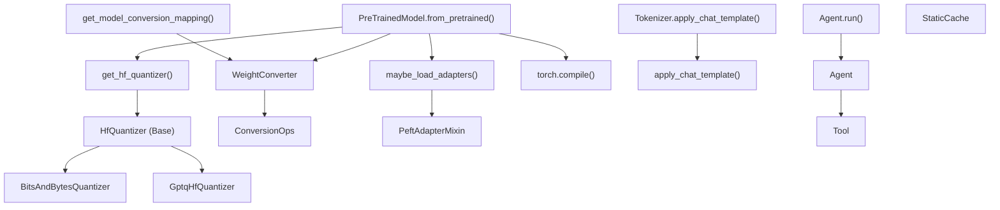
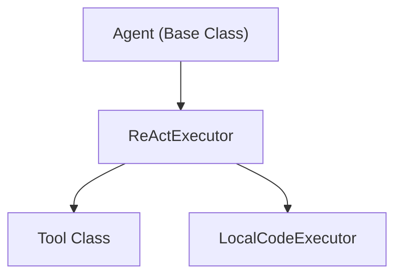

# 高级特性 (Advanced Features)

相关源文件 (Relevant source files)

-   [docs/source/en/main\_classes/quantization.md](https://github.com/huggingface/transformers/blob/9a9997fd/docs/source/en/main_classes/quantization.md?plain=1)
-   [docs/source/en/quantization/metal.md](https://github.com/huggingface/transformers/blob/9a9997fd/docs/source/en/quantization/metal.md?plain=1)
-   [docs/source/en/quantization/overview.md](https://github.com/huggingface/transformers/blob/9a9997fd/docs/source/en/quantization/overview.md?plain=1)
-   [docs/source/en/quantization/torchao.md](https://github.com/huggingface/transformers/blob/9a9997fd/docs/source/en/quantization/torchao.md?plain=1)
-   [setup.py](https://github.com/huggingface/transformers/blob/9a9997fd/setup.py)
-   [src/transformers/conversion\_mapping.py](https://github.com/huggingface/transformers/blob/9a9997fd/src/transformers/conversion_mapping.py)
-   [src/transformers/core\_model\_loading.py](https://github.com/huggingface/transformers/blob/9a9997fd/src/transformers/core_model_loading.py)
-   [src/transformers/dependency\_versions\_table.py](https://github.com/huggingface/transformers/blob/9a9997fd/src/transformers/dependency_versions_table.py)
-   [src/transformers/integrations/\_\_init\_\_.py](https://github.com/huggingface/transformers/blob/9a9997fd/src/transformers/integrations/__init__.py)
-   [src/transformers/integrations/accelerate.py](https://github.com/huggingface/transformers/blob/9a9997fd/src/transformers/integrations/accelerate.py)
-   [src/transformers/integrations/bitsandbytes.py](https://github.com/huggingface/transformers/blob/9a9997fd/src/transformers/integrations/bitsandbytes.py)
-   [src/transformers/integrations/finegrained\_fp8.py](https://github.com/huggingface/transformers/blob/9a9997fd/src/transformers/integrations/finegrained_fp8.py)
-   [src/transformers/integrations/metal\_quantization.py](https://github.com/huggingface/transformers/blob/9a9997fd/src/transformers/integrations/metal_quantization.py)
-   [src/transformers/integrations/mxfp4.py](https://github.com/huggingface/transformers/blob/9a9997fd/src/transformers/integrations/mxfp4.py)
-   [src/transformers/integrations/peft.py](https://github.com/huggingface/transformers/blob/9a9997fd/src/transformers/integrations/peft.py)
-   [src/transformers/integrations/torchao.py](https://github.com/huggingface/transformers/blob/9a9997fd/src/transformers/integrations/torchao.py)
-   [src/transformers/modeling\_utils.py](https://github.com/huggingface/transformers/blob/9a9997fd/src/transformers/modeling_utils.py)
-   [src/transformers/quantizers/auto.py](https://github.com/huggingface/transformers/blob/9a9997fd/src/transformers/quantizers/auto.py)
-   [src/transformers/quantizers/base.py](https://github.com/huggingface/transformers/blob/9a9997fd/src/transformers/quantizers/base.py)
-   [src/transformers/quantizers/quantizer\_bnb\_4bit.py](https://github.com/huggingface/transformers/blob/9a9997fd/src/transformers/quantizers/quantizer_bnb_4bit.py)
-   [src/transformers/quantizers/quantizer\_bnb\_8bit.py](https://github.com/huggingface/transformers/blob/9a9997fd/src/transformers/quantizers/quantizer_bnb_8bit.py)
-   [src/transformers/quantizers/quantizer\_eetq.py](https://github.com/huggingface/transformers/blob/9a9997fd/src/transformers/quantizers/quantizer_eetq.py)
-   [src/transformers/quantizers/quantizer\_finegrained\_fp8.py](https://github.com/huggingface/transformers/blob/9a9997fd/src/transformers/quantizers/quantizer_finegrained_fp8.py)
-   [src/transformers/quantizers/quantizer\_metal.py](https://github.com/huggingface/transformers/blob/9a9997fd/src/transformers/quantizers/quantizer_metal.py)
-   [src/transformers/quantizers/quantizer\_mxfp4.py](https://github.com/huggingface/transformers/blob/9a9997fd/src/transformers/quantizers/quantizer_mxfp4.py)
-   [src/transformers/quantizers/quantizer\_quanto.py](https://github.com/huggingface/transformers/blob/9a9997fd/src/transformers/quantizers/quantizer_quanto.py)
-   [src/transformers/quantizers/quantizer\_torchao.py](https://github.com/huggingface/transformers/blob/9a9997fd/src/transformers/quantizers/quantizer_torchao.py)
-   [src/transformers/testing\_utils.py](https://github.com/huggingface/transformers/blob/9a9997fd/src/transformers/testing_utils.py)
-   [src/transformers/trainer.py](https://github.com/huggingface/transformers/blob/9a9997fd/src/transformers/trainer.py)
-   [src/transformers/trainer\_utils.py](https://github.com/huggingface/transformers/blob/9a9997fd/src/transformers/trainer_utils.py)
-   [src/transformers/training\_args.py](https://github.com/huggingface/transformers/blob/9a9997fd/src/transformers/training_args.py)
-   [src/transformers/utils/\_\_init\_\_.py](https://github.com/huggingface/transformers/blob/9a9997fd/src/transformers/utils/__init__.py)
-   [src/transformers/utils/import\_utils.py](https://github.com/huggingface/transformers/blob/9a9997fd/src/transformers/utils/import_utils.py)
-   [src/transformers/utils/loading\_report.py](https://github.com/huggingface/transformers/blob/9a9997fd/src/transformers/utils/loading_report.py)
-   [src/transformers/utils/quantization\_config.py](https://github.com/huggingface/transformers/blob/9a9997fd/src/transformers/utils/quantization_config.py)
-   [tests/peft\_integration/test\_peft\_integration.py](https://github.com/huggingface/transformers/blob/9a9997fd/tests/peft_integration/test_peft_integration.py)
-   [tests/quantization/bnb/test\_4bit.py](https://github.com/huggingface/transformers/blob/9a9997fd/tests/quantization/bnb/test_4bit.py)
-   [tests/quantization/bnb/test\_mixed\_int8.py](https://github.com/huggingface/transformers/blob/9a9997fd/tests/quantization/bnb/test_mixed_int8.py)
-   [tests/quantization/finegrained\_fp8/test\_fp8.py](https://github.com/huggingface/transformers/blob/9a9997fd/tests/quantization/finegrained_fp8/test_fp8.py)
-   [tests/quantization/gptq/test\_gptq.py](https://github.com/huggingface/transformers/blob/9a9997fd/tests/quantization/gptq/test_gptq.py)
-   [tests/quantization/mxfp4/test\_mxfp4.py](https://github.com/huggingface/transformers/blob/9a9997fd/tests/quantization/mxfp4/test_mxfp4.py)
-   [tests/quantization/torchao\_integration/test\_torchao.py](https://github.com/huggingface/transformers/blob/9a9997fd/tests/quantization/torchao_integration/test_torchao.py)
-   [tests/test\_modeling\_common.py](https://github.com/huggingface/transformers/blob/9a9997fd/tests/test_modeling_common.py)
-   [tests/trainer/test\_trainer.py](https://github.com/huggingface/transformers/blob/9a9997fd/tests/trainer/test_trainer.py)
-   [tests/utils/test\_core\_model\_loading.py](https://github.com/huggingface/transformers/blob/9a9997fd/tests/utils/test_core_model_loading.py)
-   [tests/utils/test\_modeling\_utils.py](https://github.com/huggingface/transformers/blob/9a9997fd/tests/utils/test_modeling_utils.py)
-   [utils/check\_config\_attributes.py](https://github.com/huggingface/transformers/blob/9a9997fd/utils/check_config_attributes.py)

本页概述了 Transformers 库中用于模型优化 (Model Optimization) 和部署 (Deployment) 的高级功能。这些特性通过量化 (Quantization)、权重转换 (Weight Conversion)、适配器集成 (Adapter Integration)、模型编译 (Model Compilation) 和对话处理 (Conversational Handling) 等技术，实现在生产环境中高效地加载和运行模型。

关于基础的模型加载和推理，请参阅 [核心架构 (Core Architecture)](/huggingface/transformers/2-core-architecture)。关于训练相关的特性，请参阅 [训练系统 (Training System)](/huggingface/transformers/3-training-system)。关于文本生成能力，请参阅 [生成系统 (Generation System)](/huggingface/transformers/4-generation-system)。

## 目的与范围 (Purpose and Scope)

高级特性子系统包含六个主要的职能领域：

1.  **量化 (Quantization)** - 通过 `HfQuantizer` 系统降低模型精度 (Precision)，以节省内存并加速推理 (Inference)。
2.  **权重转换 (Weight Conversion)** - 使用 `WeightConverter` 和 `ConversionOps` 在不同的模型架构 (Architecture) 之间转换检查点 (Checkpoint) 格式。
3.  **PEFT/适配器集成 (PEFT/Adapter Integration)** - 通过 `PeftAdapterMixin` 加载和管理参数高效微调 (Parameter-Efficient Fine-Tuning) 适配器。
4.  **模型导出与编译 (Model Export and Compilation)** - 使用 `torch.compile` 和静态缓存 (Static Caching) 为生产环境优化模型。
5.  **聊天模板 (Chat Templates)** - 使用 Jinja2 模板和 `apply_chat_template` 标准化对话输入。
6.  **智能体与工具 (Agents and Tools)** - 使用 `Agent` 和 `Tool` 类构建智能体工作流 (Agentic Workflow)。

这些特性与 `PreTrainedModel.from_pretrained()` [src/transformers/modeling\_utils.py163-184](https://github.com/huggingface/transformers/blob/9a9997fd/src/transformers/modeling_utils.py#L163-L184) 中的模型加载流水线 (Pipeline) 深度集成，并支持从边缘设备 (Edge Device) 到高吞吐量服务器的各种部署场景。

## 系统架构 (System Architecture)

下图展示了高级特性如何接入核心模型加载和执行流程。

### 桥接：API 到代码实体 (Bridge: API to Code Entities)

来源 (Sources): [src/transformers/modeling\_utils.py47-56](https://github.com/huggingface/transformers/blob/9a9997fd/src/transformers/modeling_utils.py#L47-L56) [src/transformers/quantizers/auto.py95](https://github.com/huggingface/transformers/blob/9a9997fd/src/transformers/quantizers/auto.py#L95-L95) [src/transformers/integrations/peft.py72](https://github.com/huggingface/transformers/blob/9a9997fd/src/transformers/integrations/peft.py#L72-L72)

## 量化系统 (Quantization System)

量化系统通过使用较低精度（例如 4-bit 或 8-bit）表示权重 (Weight) 和激活值 (Activation)，来减少模型内存占用。该库通过 `HfQuantizer` 基类和 `QuantizationConfig` 对象支持广泛的方法 [src/transformers/utils/quantization\_config.py43-66](https://github.com/huggingface/transformers/blob/9a9997fd/src/transformers/utils/quantization_config.py#L43-L66)

### 支持的方法 (Supported Methods)

该库集成了多个后端以提供各种量化变体：

-   **bitsandbytes**: 8-bit (`load_in_8bit`) 和 4-bit (`load_in_4bit`) 量化，包括用于 QLoRA 的 NF4 [src/transformers/utils/quantization\_config.py44](https://github.com/huggingface/transformers/blob/9a9997fd/src/transformers/utils/quantization_config.py#L44-L44)
-   **GPTQ/AWQ**: 用于 4-bit 权重的训练后量化 (Post-training quantization) [src/transformers/utils/quantization\_config.py45-46](https://github.com/huggingface/transformers/blob/9a9997fd/src/transformers/utils/quantization_config.py#L45-L46)
-   **TorchAO**: PyTorch 原生架构优化，用于比特级精度 [src/transformers/utils/quantization\_config.py55](https://github.com/huggingface/transformers/blob/9a9997fd/src/transformers/utils/quantization_config.py#L55-L55)
-   **现代格式 (Modern Formats)**: 支持 GGUF、AQLM、HQQ 以及专门的 FP8/MXFP4 格式 [src/transformers/utils/quantization\_config.py47-62](https://github.com/huggingface/transformers/blob/9a9997fd/src/transformers/utils/quantization_config.py#L47-L62)

有关详细的配置和校准 (Calibration) 细节，请参阅 [量化系统 (Quantization System)](/huggingface/transformers/6.1-quantization-system)。

## 权重转换系统 (Weight Conversion System)

在 v5 版本中引入的权重转换系统提供了一种结构化的方式，在不同的架构实现之间转换权重（例如，从遗留检查点转换为新的优化后的混合专家 (MoE) 实现）。

### 转换操作 (Conversion Operations)

系统使用 `WeightConverter` 和 `WeightRenaming` 来定义转换规则 [src/transformers/modeling\_utils.py47-52](https://github.com/huggingface/transformers/blob/9a9997fd/src/transformers/modeling_utils.py#L47-L52)。核心操作包括：

-   **分块/拼接 (Chunk/Concatenate)**: 沿特定维度分割或合并权重。
-   **转置 (Transpose)**: 改变权重方向。
-   **合并模块列表 (MergeModulelist)**: 将嵌套的模块结构展平为统一的张量 (Tensor)。

映射规则在 `conversion_mapping.py` 中按模型家族定义 [src/transformers/conversion\_mapping.py46](https://github.com/huggingface/transformers/blob/9a9997fd/src/transformers/conversion_mapping.py#L46-L46)

有关实现细节以及用于保存的反向转换，请参阅 [权重转换系统 (Weight Conversion System)](/huggingface/transformers/6.2-weight-conversion-system)。

## PEFT 与适配器集成 (PEFT and Adapter Integration)

该库通过 `PeftAdapterMixin` 原生集成了 PEFT（参数高效微调）库。这允许模型动态地加载、启用和禁用适配器（如 LoRA）。

### 核心能力 (Key Capabilities)

-   **加载 (Loading)**: 在模型初始化期间调用 `maybe_load_adapters` 以附加微调后的权重 [src/transformers/modeling\_utils.py72](https://github.com/huggingface/transformers/blob/9a9997fd/src/transformers/modeling_utils.py#L72-L72)
-   **管理 (Management)**: `set_adapter`、`enable_adapters` 和 `disable_adapters` 等方法允许在不重新加载基础模型的情况下热插拔 (Hotswapping) 行为。
-   **训练 (Training)**: 与 `Trainer` 类的集成支持直接训练适配器，同时保持基础权重冻结 [src/transformers/trainer.py128](https://github.com/huggingface/transformers/blob/9a9997fd/src/transformers/trainer.py#L128-L128)

有关适配器状态管理的详细信息，请参阅 [PEFT 与适配器集成 (PEFT and Adapter Integration)](/huggingface/transformers/6.3-peft-and-adapter-integration)。

## 模型导出与编译 (Model Export and Compilation)

对于高性能的生产部署，该库提供了优化执行图 (Execution Graph) 的工具。

### 生产环境特性 (Production Features)

-   **torch.compile**: 与 PyTorch 编译器集成以生成优化的内核 (Kernel) [src/transformers/modeling\_utils.py55](https://github.com/huggingface/transformers/blob/9a9997fd/src/transformers/modeling_utils.py#L55-L55)
-   **静态缓存 (Static Cache)**: 使用 `StaticCache` 预分配 KV 缓存 (KV Cache) 内存，这是在自回归 (Autoregressive) 模型上有效使用 `torch.compile` 的先决条件。
-   **导出格式 (Export Formats)**: 支持 ONNX 和 ExecuTorch，用于跨平台和移动端部署。

有关优化策略，请参阅 [模型导出与编译 (Model Export and Compilation)](/huggingface/transformers/6.4-model-export-and-compilation)。

## 聊天模板与对话处理 (Chat Templates and Conversation Handling)

随着大语言模型 (LLM) 转向基于聊天的界面，该库引入了 `apply_chat_template` 来处理不同提示 (Prompt) 格式（如 ChatML、Llama-3 等）的复杂性。

### 系统组件 (System Components)

-   **Jinja2 模板 (Jinja2 Templates)**: 存储在 `tokenizer_config.json` 中，定义了消息（系统、用户、助手）如何拼接 [src/transformers/utils/chat\_template\_utils.py34](https://github.com/huggingface/transformers/blob/9a9997fd/src/transformers/utils/chat_template_utils.py#L34-L34)
-   **工具调用 (Tool Calling)**: 函数调用和工具使用的模式 (Schema) 已集成到模板逻辑中。
-   **标准化 (Standardization)**: 确保相同的输入消息列表产生的结果与模型训练时使用的格式完全一致。

有关模板语法和工具调用的详细信息，请参阅 [聊天模板与对话处理 (Chat Templates and Conversation Handling)](/huggingface/transformers/6.5-chat-templates-and-conversation-handling)。

## 智能体与工具系统 (Agents and Tools System)

`transformers.agents` 系统允许模型通过执行代码或调用工具与外部环境进行交互。

### 桥接：智能体逻辑到代码实体 (Bridge: Agent Logic to Code Entities)

-   **智能体 (Agent)**: 负责处理“提示-推理-行动”循环的编排器。
-   **工具 (Tool)**: 智能体可以调用的封装函数（例如，图像生成、网络搜索）。
-   **代码执行 (Code Execution)**: 支持安全的本地代码执行，以解决数学或数据任务。

有关构建智能体工作流的信息，请参阅 [智能体与工具系统 (Agents and Tools System)](/huggingface/transformers/6.6-agents-and-tools-system)。

来源 (Sources): [src/transformers/modeling\_utils.py47-133](https://github.com/huggingface/transformers/blob/9a9997fd/src/transformers/modeling_utils.py#L47-L133) [src/transformers/trainer.py72-148](https://github.com/huggingface/transformers/blob/9a9997fd/src/transformers/trainer.py#L72-L148) [src/transformers/utils/quantization\_config.py43-66](https://github.com/huggingface/transformers/blob/9a9997fd/src/transformers/utils/quantization_config.py#L43-L66) [src/transformers/utils/import\_utils.py128-140](https://github.com/huggingface/transformers/blob/9a9997fd/src/transformers/utils/import_utils.py#L128-L140)
