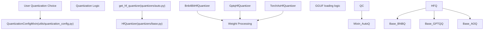

# 量化系统 (Quantization System)

相关源文件 (Relevant source files)

-   [docs/source/en/attention\_interface.md](https://github.com/huggingface/transformers/blob/9a9997fd/docs/source/en/attention_interface.md?plain=1)
-   [docs/source/en/cache\_explanation.md](https://github.com/huggingface/transformers/blob/9a9997fd/docs/source/en/cache_explanation.md?plain=1)
-   [docs/source/en/continuous\_batching.md](https://github.com/huggingface/transformers/blob/9a9997fd/docs/source/en/continuous_batching.md?plain=1)
-   [docs/source/en/gguf.md](https://github.com/huggingface/transformers/blob/9a9997fd/docs/source/en/gguf.md?plain=1)
-   [docs/source/en/model\_doc/code\_llama.md](https://github.com/huggingface/transformers/blob/9a9997fd/docs/source/en/model_doc/code_llama.md?plain=1)
-   [docs/source/en/model\_doc/reformer.md](https://github.com/huggingface/transformers/blob/9a9997fd/docs/source/en/model_doc/reformer.md?plain=1)
-   [docs/source/en/model\_doc/rwkv.md](https://github.com/huggingface/transformers/blob/9a9997fd/docs/source/en/model_doc/rwkv.md?plain=1)
-   [docs/source/en/monkey\_patching.md](https://github.com/huggingface/transformers/blob/9a9997fd/docs/source/en/monkey_patching.md?plain=1)
-   [docs/source/en/perplexity.md](https://github.com/huggingface/transformers/blob/9a9997fd/docs/source/en/perplexity.md?plain=1)
-   [docs/source/en/quantization/concept\_guide.md](https://github.com/huggingface/transformers/blob/9a9997fd/docs/source/en/quantization/concept_guide.md?plain=1)
-   [docs/source/en/quantization/metal.md](https://github.com/huggingface/transformers/blob/9a9997fd/docs/source/en/quantization/metal.md?plain=1)
-   [docs/source/en/quantization/torchao.md](https://github.com/huggingface/transformers/blob/9a9997fd/docs/source/en/quantization/torchao.md?plain=1)
-   [docs/source/en/tokenizer\_summary.md](https://github.com/huggingface/transformers/blob/9a9997fd/docs/source/en/tokenizer_summary.md?plain=1)
-   [docs/source/es/tokenizer\_summary.md](https://github.com/huggingface/transformers/blob/9a9997fd/docs/source/es/tokenizer_summary.md?plain=1)
-   [docs/source/ja/model\_doc/code\_llama.md](https://github.com/huggingface/transformers/blob/9a9997fd/docs/source/ja/model_doc/code_llama.md?plain=1)
-   [docs/source/ko/cache\_explanation.md](https://github.com/huggingface/transformers/blob/9a9997fd/docs/source/ko/cache_explanation.md?plain=1)
-   [docs/source/ko/llm\_optims.md](https://github.com/huggingface/transformers/blob/9a9997fd/docs/source/ko/llm_optims.md?plain=1)
-   [src/transformers/convert\_slow\_tokenizer.py](https://github.com/huggingface/transformers/blob/9a9997fd/src/transformers/convert_slow_tokenizer.py)
-   [src/transformers/integrations/aqlm.py](https://github.com/huggingface/transformers/blob/9a9997fd/src/transformers/integrations/aqlm.py)
-   [src/transformers/integrations/awq.py](https://github.com/huggingface/transformers/blob/9a9997fd/src/transformers/integrations/awq.py)
-   [src/transformers/integrations/bitnet.py](https://github.com/huggingface/transformers/blob/9a9997fd/src/transformers/integrations/bitnet.py)
-   [src/transformers/integrations/bitsandbytes.py](https://github.com/huggingface/transformers/blob/9a9997fd/src/transformers/integrations/bitsandbytes.py)
-   [src/transformers/integrations/eetq.py](https://github.com/huggingface/transformers/blob/9a9997fd/src/transformers/integrations/eetq.py)
-   [src/transformers/integrations/fbgemm\_fp8.py](https://github.com/huggingface/transformers/blob/9a9997fd/src/transformers/integrations/fbgemm_fp8.py)
-   [src/transformers/integrations/finegrained\_fp8.py](https://github.com/huggingface/transformers/blob/9a9997fd/src/transformers/integrations/finegrained_fp8.py)
-   [src/transformers/integrations/ggml.py](https://github.com/huggingface/transformers/blob/9a9997fd/src/transformers/integrations/ggml.py)
-   [src/transformers/integrations/higgs.py](https://github.com/huggingface/transformers/blob/9a9997fd/src/transformers/integrations/higgs.py)
-   [src/transformers/integrations/metal\_quantization.py](https://github.com/huggingface/transformers/blob/9a9997fd/src/transformers/integrations/metal_quantization.py)
-   [src/transformers/integrations/mxfp4.py](https://github.com/huggingface/transformers/blob/9a9997fd/src/transformers/integrations/mxfp4.py)
-   [src/transformers/integrations/quanto.py](https://github.com/huggingface/transformers/blob/9a9997fd/src/transformers/integrations/quanto.py)
-   [src/transformers/integrations/torchao.py](https://github.com/huggingface/transformers/blob/9a9997fd/src/transformers/integrations/torchao.py)
-   [src/transformers/modeling\_gguf\_pytorch\_utils.py](https://github.com/huggingface/transformers/blob/9a9997fd/src/transformers/modeling_gguf_pytorch_utils.py)
-   [src/transformers/models/bark/processing\_bark.py](https://github.com/huggingface/transformers/blob/9a9997fd/src/transformers/models/bark/processing_bark.py)
-   [src/transformers/models/code\_llama/tokenization\_code\_llama.py](https://github.com/huggingface/transformers/blob/9a9997fd/src/transformers/models/code_llama/tokenization_code_llama.py)
-   [src/transformers/models/llama/tokenization\_llama.py](https://github.com/huggingface/transformers/blob/9a9997fd/src/transformers/models/llama/tokenization_llama.py)
-   [src/transformers/models/seamless\_m4t/tokenization\_seamless\_m4t.py](https://github.com/huggingface/transformers/blob/9a9997fd/src/transformers/models/seamless_m4t/tokenization_seamless_m4t.py)
-   [src/transformers/models/siglip/tokenization\_siglip.py](https://github.com/huggingface/transformers/blob/9a9997fd/src/transformers/models/siglip/tokenization_siglip.py)
-   [src/transformers/models/t5/tokenization\_t5.py](https://github.com/huggingface/transformers/blob/9a9997fd/src/transformers/models/t5/tokenization_t5.py)
-   [src/transformers/models/udop/tokenization\_udop.py](https://github.com/huggingface/transformers/blob/9a9997fd/src/transformers/models/udop/tokenization_udop.py)
-   [src/transformers/monkey\_patching.py](https://github.com/huggingface/transformers/blob/9a9997fd/src/transformers/monkey_patching.py)
-   [src/transformers/quantizers/base.py](https://github.com/huggingface/transformers/blob/9a9997fd/src/transformers/quantizers/base.py)
-   [src/transformers/quantizers/quantizer\_aqlm.py](https://github.com/huggingface/transformers/blob/9a9997fd/src/transformers/quantizers/quantizer_aqlm.py)
-   [src/transformers/quantizers/quantizer\_awq.py](https://github.com/huggingface/transformers/blob/9a9997fd/src/transformers/quantizers/quantizer_awq.py)
-   [src/transformers/quantizers/quantizer\_bitnet.py](https://github.com/huggingface/transformers/blob/9a9997fd/src/transformers/quantizers/quantizer_bitnet.py)
-   [src/transformers/quantizers/quantizer\_bnb\_4bit.py](https://github.com/huggingface/transformers/blob/9a9997fd/src/transformers/quantizers/quantizer_bnb_4bit.py)
-   [src/transformers/quantizers/quantizer\_bnb\_8bit.py](https://github.com/huggingface/transformers/blob/9a9997fd/src/transformers/quantizers/quantizer_bnb_8bit.py)
-   [src/transformers/quantizers/quantizer\_compressed\_tensors.py](https://github.com/huggingface/transformers/blob/9a9997fd/src/transformers/quantizers/quantizer_compressed_tensors.py)
-   [src/transformers/quantizers/quantizer\_eetq.py](https://github.com/huggingface/transformers/blob/9a9997fd/src/transformers/quantizers/quantizer_eetq.py)
-   [src/transformers/quantizers/quantizer\_fbgemm\_fp8.py](https://github.com/huggingface/transformers/blob/9a9997fd/src/transformers/quantizers/quantizer_fbgemm_fp8.py)
-   [src/transformers/quantizers/quantizer\_finegrained\_fp8.py](https://github.com/huggingface/transformers/blob/9a9997fd/src/transformers/quantizers/quantizer_finegrained_fp8.py)
-   [src/transformers/quantizers/quantizer\_gptq.py](https://github.com/huggingface/transformers/blob/9a9997fd/src/transformers/quantizers/quantizer_gptq.py)
-   [src/transformers/quantizers/quantizer\_higgs.py](https://github.com/huggingface/transformers/blob/9a9997fd/src/transformers/quantizers/quantizer_higgs.py)
-   [src/transformers/quantizers/quantizer\_metal.py](https://github.com/huggingface/transformers/blob/9a9997fd/src/transformers/quantizers/quantizer_metal.py)
-   [src/transformers/quantizers/quantizer\_mxfp4.py](https://github.com/huggingface/transformers/blob/9a9997fd/src/transformers/quantizers/quantizer_mxfp4.py)
-   [src/transformers/quantizers/quantizer\_quanto.py](https://github.com/huggingface/transformers/blob/9a9997fd/src/transformers/quantizers/quantizer_quanto.py)
-   [src/transformers/quantizers/quantizer\_spqr.py](https://github.com/huggingface/transformers/blob/9a9997fd/src/transformers/quantizers/quantizer_spqr.py)
-   [src/transformers/quantizers/quantizer\_torchao.py](https://github.com/huggingface/transformers/blob/9a9997fd/src/transformers/quantizers/quantizer_torchao.py)
-   [src/transformers/quantizers/quantizer\_vptq.py](https://github.com/huggingface/transformers/blob/9a9997fd/src/transformers/quantizers/quantizer_vptq.py)
-   [tests/models/altclip/test\_processing\_altclip.py](https://github.com/huggingface/transformers/blob/9a9997fd/tests/models/altclip/test_processing_altclip.py)
-   [tests/models/bark/test\_processing\_bark.py](https://github.com/huggingface/transformers/blob/9a9997fd/tests/models/bark/test_processing_bark.py)
-   [tests/models/blip/test\_processing\_blip.py](https://github.com/huggingface/transformers/blob/9a9997fd/tests/models/blip/test_processing_blip.py)
-   [tests/models/code\_llama/test\_tokenization\_code\_llama.py](https://github.com/huggingface/transformers/blob/9a9997fd/tests/models/code_llama/test_tokenization_code_llama.py)
-   [tests/models/diffllama/test\_modeling\_diffllama.py](https://github.com/huggingface/transformers/blob/9a9997fd/tests/models/diffllama/test_modeling_diffllama.py)
-   [tests/models/llama/test\_tokenization\_llama.py](https://github.com/huggingface/transformers/blob/9a9997fd/tests/models/llama/test_tokenization_llama.py)
-   [tests/models/t5/test\_tokenization\_t5.py](https://github.com/huggingface/transformers/blob/9a9997fd/tests/models/t5/test_tokenization_t5.py)
-   [tests/quantization/aqlm\_integration/test\_aqlm.py](https://github.com/huggingface/transformers/blob/9a9997fd/tests/quantization/aqlm_integration/test_aqlm.py)
-   [tests/quantization/autoawq/test\_awq.py](https://github.com/huggingface/transformers/blob/9a9997fd/tests/quantization/autoawq/test_awq.py)
-   [tests/quantization/bitnet\_integration/test\_bitnet.py](https://github.com/huggingface/transformers/blob/9a9997fd/tests/quantization/bitnet_integration/test_bitnet.py)
-   [tests/quantization/bnb/test\_4bit.py](https://github.com/huggingface/transformers/blob/9a9997fd/tests/quantization/bnb/test_4bit.py)
-   [tests/quantization/bnb/test\_mixed\_int8.py](https://github.com/huggingface/transformers/blob/9a9997fd/tests/quantization/bnb/test_mixed_int8.py)
-   [tests/quantization/eetq\_integration/test\_eetq.py](https://github.com/huggingface/transformers/blob/9a9997fd/tests/quantization/eetq_integration/test_eetq.py)
-   [tests/quantization/fbgemm\_fp8/test\_fbgemm\_fp8.py](https://github.com/huggingface/transformers/blob/9a9997fd/tests/quantization/fbgemm_fp8/test_fbgemm_fp8.py)
-   [tests/quantization/finegrained\_fp8/test\_fp8.py](https://github.com/huggingface/transformers/blob/9a9997fd/tests/quantization/finegrained_fp8/test_fp8.py)
-   [tests/quantization/ggml/test\_ggml.py](https://github.com/huggingface/transformers/blob/9a9997fd/tests/quantization/ggml/test_ggml.py)
-   [tests/quantization/gptq/test\_gptq.py](https://github.com/huggingface/transformers/blob/9a9997fd/tests/quantization/gptq/test_gptq.py)
-   [tests/quantization/higgs/test\_higgs.py](https://github.com/huggingface/transformers/blob/9a9997fd/tests/quantization/higgs/test_higgs.py)
-   [tests/quantization/mxfp4/test\_mxfp4.py](https://github.com/huggingface/transformers/blob/9a9997fd/tests/quantization/mxfp4/test_mxfp4.py)
-   [tests/quantization/quanto\_integration/test\_quanto.py](https://github.com/huggingface/transformers/blob/9a9997fd/tests/quantization/quanto_integration/test_quanto.py)
-   [tests/quantization/spqr\_integration/test\_spqr.py](https://github.com/huggingface/transformers/blob/9a9997fd/tests/quantization/spqr_integration/test_spqr.py)
-   [tests/quantization/torchao\_integration/test\_torchao.py](https://github.com/huggingface/transformers/blob/9a9997fd/tests/quantization/torchao_integration/test_torchao.py)
-   [tests/test\_monkey\_patching.py](https://github.com/huggingface/transformers/blob/9a9997fd/tests/test_monkey_patching.py)
-   [tests/tokenization/test\_tokenization\_utils.py](https://github.com/huggingface/transformers/blob/9a9997fd/tests/tokenization/test_tokenization_utils.py)
-   [tests/utils/test\_convert\_slow\_tokenizer.py](https://github.com/huggingface/transformers/blob/9a9997fd/tests/utils/test_convert_slow_tokenizer.py)

## 目的与范围 (Purpose and Scope)

Transformers 库中的量化系统 (Quantization System) 提供了一个统一的框架，用于加载和使用经过降低精度表示（例如 8-bit、4-bit、2-bit 以及 FP8/MXFP4）的模型，以减少内存占用并提高推理 (Inference) 速度。该系统围绕 `HfQuantizer` 基类和一组标准化的配置对象构建，实现了对 `bitsandbytes`、`AutoGPTQ`、`AutoAWQ`、`torchao` 和 `GGUF` 等多种量化后端 (Backend) 的无缝集成。

## 架构概述 (Architecture Overview)

量化系统的结构分为三个不同的层次，将配置与实现桥接起来。

### 系统实体映射 (System Entity Mapping)

下图将自然语言概念映射到实现它们的具体代码实体。

**图表：自然语言到代码实体映射 (Natural Language to Code Entity Mapping)**

来源 (Sources): [src/transformers/quantizers/base.py73-84](https://github.com/huggingface/transformers/blob/9a9997fd/src/transformers/quantizers/base.py#L73-L84) [src/transformers/utils/quantization\_config.py91-100](https://github.com/huggingface/transformers/blob/9a9997fd/src/transformers/utils/quantization_config.py#L91-L100) [src/transformers/quantizers/auto.py36-45](https://github.com/huggingface/transformers/blob/9a9997fd/src/transformers/quantizers/auto.py#L36-L45)

### 模型加载期间的数据流 (Data Flow during Model Loading)

当调用 `from_pretrained` 并携带 `quantization_config` 时，会发生以下序列：

> **[Mermaid sequence]**
> *(图表结构无法解析)*

**图表：量化加载流 (Quantization Loading Flow)**

来源 (Sources): [src/transformers/quantizers/base.py155-172](https://github.com/huggingface/transformers/blob/9a9997fd/src/transformers/quantizers/base.py#L155-L172) [src/transformers/quantizers/quantizer\_bnb\_4bit.py168-185](https://github.com/huggingface/transformers/blob/9a9997fd/src/transformers/quantizers/quantizer_bnb_4bit.py#L168-L185) [src/transformers/modeling\_utils.py779-857](https://github.com/huggingface/transformers/blob/9a9997fd/src/transformers/modeling_utils.py#L779-L857)

## HfQuantizer 框架 (HfQuantizer Framework)

`HfQuantizer` 是在 `src/transformers/quantizers/base.py` 中定义的抽象基类。它为权重加载前后的模型操作提供了接口。

### 核心实现细节 (Key Implementation Details)

-   **`preprocess_model`**: 此方法在模型初始化时（通常是在 `meta` 设备上）被调用。它允许量化器执行模块的原地替换 (In-place replacement)（例如，将 `torch.nn.Linear` 替换为 `bitsandbytes.nn.Linear4bit`） [src/transformers/quantizers/base.py155-171](https://github.com/huggingface/transformers/blob/9a9997fd/src/transformers/quantizers/base.py#L155-L171)
-   **`postprocess_model`**: 在权重加载后执行，以完成量化状态的最终确定 [src/transformers/quantizers/base.py173-174](https://github.com/huggingface/transformers/blob/9a9997fd/src/transformers/quantizers/base.py#L173-L174)
-   **`is_trainable`**: 一个指示该方法是否支持微调 (Fine-tuning)（如 QLoRA）的属性。通常只有 8-bit 方法支持全量梯度 (Full gradients)，而 4-bit 通常需要 PEFT 适配器 (Adapter) [src/transformers/quantizers/quantizer\_bnb\_4bit.py153-155](https://github.com/huggingface/transformers/blob/9a9997fd/src/transformers/quantizers/quantizer_bnb_4bit.py#L153-L155)
-   **`get_weight_conversions`**: 返回 `WeightConverter` 对象列表，这些对象定义了如何将标准权重转换为量化器所需的特定格式（例如，将 4-bit 值打包到 `int8` 容器中） [src/transformers/quantizers/quantizer\_bnb\_4bit.py168-185](https://github.com/huggingface/transformers/blob/9a9997fd/src/transformers/quantizers/quantizer_bnb_4bit.py#L168-L185)

来源 (Sources): [src/transformers/quantizers/base.py73-174](https://github.com/huggingface/transformers/blob/9a9997fd/src/transformers/quantizers/base.py#L73-L174) [src/transformers/quantizers/quantizer\_bnb\_4bit.py45-185](https://github.com/huggingface/transformers/blob/9a9997fd/src/transformers/quantizers/quantizer_bnb_4bit.py#L45-L185)

## 支持的量化方法 (Supported Quantization Methods)

### bitsandbytes (4-bit & 8-bit)

-   **4-bit (QLoRA)**: 使用 `Bnb4BitHfQuantizer`。支持 `NF4` (NormalFloat4) 和 `FP4` 数据类型 (Dtype)。实现了双重量化 (Double quantization) 以减少量化常量的内存开销 [src/transformers/quantizers/quantizer\_bnb\_4bit.py45-54](https://github.com/huggingface/transformers/blob/9a9997fd/src/transformers/quantizers/quantizer_bnb_4bit.py#L45-L54)
-   **8-bit (LLM.int8())**: 使用 `Bnb8BitHfQuantizer`。具有离群值分解 (Outlier decomposition) 特性，其中高幅度特征在 FP16 中处理，其他在 Int8 中处理 [src/transformers/quantizers/quantizer\_bnb\_8bit.py44-53](https://github.com/huggingface/transformers/blob/9a9997fd/src/transformers/quantizers/quantizer_bnb_8bit.py#L44-L53)

### GGUF (GGML)

与 `gguf` 库的集成允许直接从 `.gguf` 文件加载模型。

-   **映射 (Mapping)**: `src/transformers/integrations/ggml.py` 中的 `GGUF_CONFIG_MAPPING` 将 GGUF 元数据键映射到 Transformers 的配置属性 [src/transformers/integrations/ggml.py35-149](https://github.com/huggingface/transformers/blob/9a9997fd/src/transformers/integrations/ggml.py#L35-L149)
-   **张量处理 (Tensor Processing)**: `LlamaTensorProcessor` 和 `Qwen2MoeTensorProcessor` 处理架构差异，例如反转 RoPE 相关权重中的置换 (Permutation) [src/transformers/modeling\_gguf\_pytorch\_utils.py88-115](https://github.com/huggingface/transformers/blob/9a9997fd/src/transformers/modeling_gguf_pytorch_utils.py#L88-L115)

### torchao

一个 PyTorch 原生的量化工具包。

-   **量化器 (Quantizer)**: `src/transformers/quantizers/quantizer_torchao.py` 中的 `TorchAoHfQuantizer`。
-   **能力**: 支持 `Int4WeightOnly`、`Int8WeightOnly` 和 `Float8` 量化。它利用 `torch.compile` 实现高性能内核 (Kernel) [src/transformers/quantizers/quantizer\_torchao.py58-160](https://github.com/huggingface/transformers/blob/9a9997fd/src/transformers/quantizers/quantizer_torchao.py#L58-L160)
-   **序列化 (Serialization)**: 使用 `flatten_tensor_state_dict` 使张量子类 (Tensor Subclass) 与 `safetensors` 兼容 [src/transformers/quantizers/quantizer\_torchao.py87-91](https://github.com/huggingface/transformers/blob/9a9997fd/src/transformers/quantizers/quantizer_torchao.py#L87-L91)

### FineGrainedFP8

用于块级 (Block-wise) FP8 量化的专门实现（例如，用于 DeepSeek-V3）。

-   **内核 (Kernels)**: 分派给 `CUTLASS`（用于 SM90/Hopper）或 `Triton` 内核 [src/transformers/integrations/finegrained\_fp8.py165-184](https://github.com/huggingface/transformers/blob/9a9997fd/src/transformers/integrations/finegrained_fp8.py#L165-L184)
-   **块大小 (Block Sizes)**: 权重通常使用 \[128, 128\] 块，激活值使用 \[1, 128\] [src/transformers/integrations/finegrained\_fp8.py101-104](https://github.com/huggingface/transformers/blob/9a9997fd/src/transformers/integrations/finegrained_fp8.py#L101-L104)

### 其他方法 (Other Methods)

| 方法 (Method) | 量化器类 (Quantizer Class) | 后端库 (Backend Library) |
| --- | --- | --- |
| **GPTQ** | `GptqHfQuantizer` | `auto-gptq` |
| **AWQ** | `AwqHfQuantizer` | `autoawq` |
| **AQLM** | `AqlmHfQuantizer` | `aqlm` |
| **HQQ** | `HqqHfQuantizer` | `hqq` |
| **MXFP4** | `Mxfp4HfQuantizer` | `mxfp4` |
| **BitNet** | `BitNetHfQuantizer` | `bitnet` |

来源 (Sources): [src/transformers/quantizers/quantizer\_gptq.py](https://github.com/huggingface/transformers/blob/9a9997fd/src/transformers/quantizers/quantizer_gptq.py) [src/transformers/quantizers/quantizer\_awq.py](https://github.com/huggingface/transformers/blob/9a9997fd/src/transformers/quantizers/quantizer_awq.py) [src/transformers/quantizers/quantizer\_aqlm.py](https://github.com/huggingface/transformers/blob/9a9997fd/src/transformers/quantizers/quantizer_aqlm.py) [src/transformers/quantizers/quantizer\_mxfp4.py](https://github.com/huggingface/transformers/blob/9a9997fd/src/transformers/quantizers/quantizer_mxfp4.py) [src/transformers/quantizers/quantizer\_bitnet.py](https://github.com/huggingface/transformers/blob/9a9997fd/src/transformers/quantizers/quantizer_bitnet.py)

## 校准与权重转换 (Calibration and Weight Conversion)

对于 GPTQ 或 AWQ 等训练后量化 (PTQ) 方法，系统区分了：

1.  **预量化模型 (Pre-quantized models)**: 已经以量化格式存储在 Hub 上的模型。`pre_quantized=True` 是默认值 [src/transformers/quantizers/base.py90](https://github.com/huggingface/transformers/blob/9a9997fd/src/transformers/quantizers/base.py#L90-L90)
2.  **实时量化 (On-the-fly quantization)**: 需要 `pre_quantized=False` 和校准数据集 (Calibration dataset)。`HfQuantizer.requires_calibration` 属性标记了这一需求 [src/transformers/quantizers/base.py86](https://github.com/huggingface/transformers/blob/9a9997fd/src/transformers/quantizers/base.py#L86-L86)

### 权重转换逻辑 (Weight Conversion Logic)

量化器在加载过程中使用 `WeightConverter` 和 `ConversionOps`（在 `src/transformers/core_model_loading.py` 中定义）来重塑 (Reshape) 和打包权重。例如，`Bnb4bitDeserialize` 定义了从状态字典 (State Dict) 中提取 `absmax` 和 `quant_map` 以重构 `Params4bit` 对象的模式 [src/transformers/quantizers/quantizer\_bnb\_4bit.py168-185](https://github.com/huggingface/transformers/blob/9a9997fd/src/transformers/quantizers/quantizer_bnb_4bit.py#L168-L185)

来源 (Sources): [src/transformers/quantizers/base.py86-97](https://github.com/huggingface/transformers/blob/9a9997fd/src/transformers/quantizers/base.py#L86-L97) [src/transformers/quantizers/quantizer\_bnb\_4bit.py168-185](https://github.com/huggingface/transformers/blob/9a9997fd/src/transformers/quantizers/quantizer_bnb_4bit.py#L168-L185) [src/transformers/modeling\_gguf\_pytorch\_utils.py62-86](https://github.com/huggingface/transformers/blob/9a9997fd/src/transformers/modeling_gguf_pytorch_utils.py#L62-L86)

## 与训练集成 (Integration with Training)

量化模型通常被用作参数高效微调 (PEFT) 的基础模型 (Base Model)。

-   **Trainer 校验**: `Trainer` 检查 `hf_quantizer.is_trainable` 和 `hf_quantizer.is_qat_trainable` 以确保模型确实可以接收梯度或与适配器一起使用 [src/transformers/trainer.py500-529](https://github.com/huggingface/transformers/blob/9a9997fd/src/transformers/trainer.py#L500-L529)
-   **设备放置 (Device Placement)**: 使用 `bitsandbytes` 量化的模型具有严格的设备放置规则；量化后不能使用 `.to()` 移动它们 [src/transformers/trainer.py568-573](https://github.com/huggingface/transformers/blob/9a9997fd/src/transformers/trainer.py#L568-L573)

来源 (Sources): [src/transformers/trainer.py500-573](https://github.com/huggingface/transformers/blob/9a9997fd/src/transformers/trainer.py#L500-L573) [src/transformers/quantizers/base.py152-154](https://github.com/huggingface/transformers/blob/9a9997fd/src/transformers/quantizers/base.py#L152-L154)
