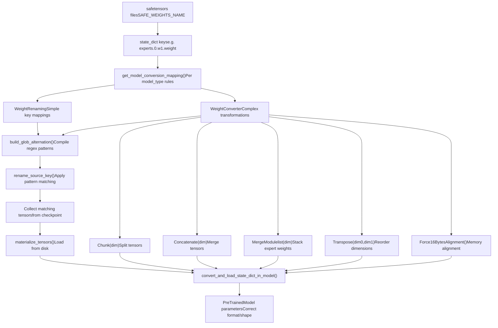
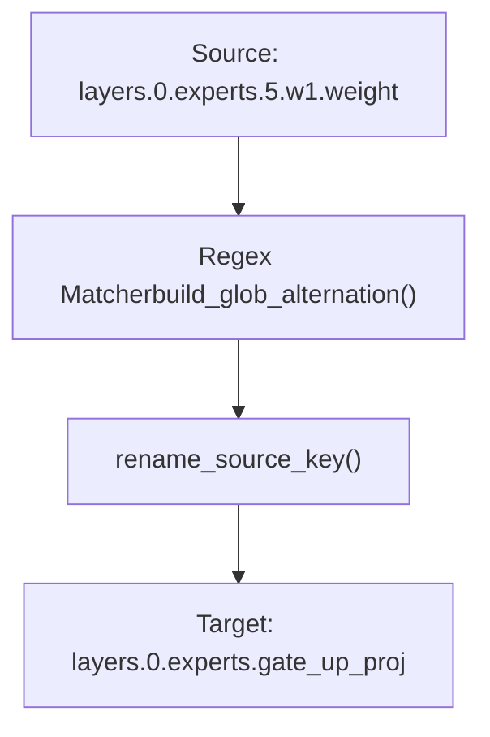

# 权重转换系统 (Weight Conversion System)

相关源文件 (Relevant source files)

-   [MIGRATION\_GUIDE\_V5.md](https://github.com/huggingface/transformers/blob/9a9997fd/MIGRATION_GUIDE_V5.md?plain=1)
-   [docs/source/en/main\_classes/quantization.md](https://github.com/huggingface/transformers/blob/9a9997fd/docs/source/en/main_classes/quantization.md?plain=1)
-   [docs/source/en/quantization/overview.md](https://github.com/huggingface/transformers/blob/9a9997fd/docs/source/en/quantization/overview.md?plain=1)
-   [docs/source/en/serve-cli/serving.md](https://github.com/huggingface/transformers/blob/9a9997fd/docs/source/en/serve-cli/serving.md?plain=1)
-   [docs/source/en/weightconverter.md](https://github.com/huggingface/transformers/blob/9a9997fd/docs/source/en/weightconverter.md?plain=1)
-   [examples/3D\_parallel.py](https://github.com/huggingface/transformers/blob/9a9997fd/examples/3D_parallel.py)
-   [examples/pytorch/3d\_parallel\_checks.py](https://github.com/huggingface/transformers/blob/9a9997fd/examples/pytorch/3d_parallel_checks.py)
-   [examples/pytorch/context\_parallel.py](https://github.com/huggingface/transformers/blob/9a9997fd/examples/pytorch/context_parallel.py)
-   [setup.py](https://github.com/huggingface/transformers/blob/9a9997fd/setup.py)
-   [src/transformers/cli/add\_new\_model\_like.py](https://github.com/huggingface/transformers/blob/9a9997fd/src/transformers/cli/add_new_model_like.py)
-   [src/transformers/cli/chat.py](https://github.com/huggingface/transformers/blob/9a9997fd/src/transformers/cli/chat.py)
-   [src/transformers/cli/download.py](https://github.com/huggingface/transformers/blob/9a9997fd/src/transformers/cli/download.py)
-   [src/transformers/cli/serve.py](https://github.com/huggingface/transformers/blob/9a9997fd/src/transformers/cli/serve.py)
-   [src/transformers/cli/system.py](https://github.com/huggingface/transformers/blob/9a9997fd/src/transformers/cli/system.py)
-   [src/transformers/cli/transformers.py](https://github.com/huggingface/transformers/blob/9a9997fd/src/transformers/cli/transformers.py)
-   [src/transformers/conversion\_mapping.py](https://github.com/huggingface/transformers/blob/9a9997fd/src/transformers/conversion_mapping.py)
-   [src/transformers/core\_model\_loading.py](https://github.com/huggingface/transformers/blob/9a9997fd/src/transformers/core_model_loading.py)
-   [src/transformers/data/datasets/glue.py](https://github.com/huggingface/transformers/blob/9a9997fd/src/transformers/data/datasets/glue.py)
-   [src/transformers/data/processors/glue.py](https://github.com/huggingface/transformers/blob/9a9997fd/src/transformers/data/processors/glue.py)
-   [src/transformers/dependency\_versions\_table.py](https://github.com/huggingface/transformers/blob/9a9997fd/src/transformers/dependency_versions_table.py)
-   [src/transformers/integrations/\_\_init\_\_.py](https://github.com/huggingface/transformers/blob/9a9997fd/src/transformers/integrations/__init__.py)
-   [src/transformers/integrations/accelerate.py](https://github.com/huggingface/transformers/blob/9a9997fd/src/transformers/integrations/accelerate.py)
-   [src/transformers/integrations/moe.py](https://github.com/huggingface/transformers/blob/9a9997fd/src/transformers/integrations/moe.py)
-   [src/transformers/integrations/peft.py](https://github.com/huggingface/transformers/blob/9a9997fd/src/transformers/integrations/peft.py)
-   [src/transformers/integrations/tensor\_parallel.py](https://github.com/huggingface/transformers/blob/9a9997fd/src/transformers/integrations/tensor_parallel.py)
-   [src/transformers/modeling\_layers.py](https://github.com/huggingface/transformers/blob/9a9997fd/src/transformers/modeling_layers.py)
-   [src/transformers/modeling\_utils.py](https://github.com/huggingface/transformers/blob/9a9997fd/src/transformers/modeling_utils.py)
-   [src/transformers/models/cohere/tokenization\_cohere.py](https://github.com/huggingface/transformers/blob/9a9997fd/src/transformers/models/cohere/tokenization_cohere.py)
-   [src/transformers/quantizers/auto.py](https://github.com/huggingface/transformers/blob/9a9997fd/src/transformers/quantizers/auto.py)
-   [src/transformers/testing\_utils.py](https://github.com/huggingface/transformers/blob/9a9997fd/src/transformers/testing_utils.py)
-   [src/transformers/trainer.py](https://github.com/huggingface/transformers/blob/9a9997fd/src/transformers/trainer.py)
-   [src/transformers/trainer\_utils.py](https://github.com/huggingface/transformers/blob/9a9997fd/src/transformers/trainer_utils.py)
-   [src/transformers/training\_args.py](https://github.com/huggingface/transformers/blob/9a9997fd/src/transformers/training_args.py)
-   [src/transformers/utils/\_\_init\_\_.py](https://github.com/huggingface/transformers/blob/9a9997fd/src/transformers/utils/__init__.py)
-   [src/transformers/utils/import\_utils.py](https://github.com/huggingface/transformers/blob/9a9997fd/src/transformers/utils/import_utils.py)
-   [src/transformers/utils/loading\_report.py](https://github.com/huggingface/transformers/blob/9a9997fd/src/transformers/utils/loading_report.py)
-   [src/transformers/utils/logging.py](https://github.com/huggingface/transformers/blob/9a9997fd/src/transformers/utils/logging.py)
-   [src/transformers/utils/quantization\_config.py](https://github.com/huggingface/transformers/blob/9a9997fd/src/transformers/utils/quantization_config.py)
-   [tests/cli/test\_serve.py](https://github.com/huggingface/transformers/blob/9a9997fd/tests/cli/test_serve.py)
-   [tests/models/deepseek\_vl/test\_modeling\_deepseek\_vl.py](https://github.com/huggingface/transformers/blob/9a9997fd/tests/models/deepseek_vl/test_modeling_deepseek_vl.py)
-   [tests/models/deepseek\_vl\_hybrid/test\_modeling\_deepseek\_vl\_hybrid.py](https://github.com/huggingface/transformers/blob/9a9997fd/tests/models/deepseek_vl_hybrid/test_modeling_deepseek_vl_hybrid.py)
-   [tests/peft\_integration/test\_peft\_integration.py](https://github.com/huggingface/transformers/blob/9a9997fd/tests/peft_integration/test_peft_integration.py)
-   [tests/tensor\_parallel/test\_tensor\_parallel.py](https://github.com/huggingface/transformers/blob/9a9997fd/tests/tensor_parallel/test_tensor_parallel.py)
-   [tests/test\_modeling\_common.py](https://github.com/huggingface/transformers/blob/9a9997fd/tests/test_modeling_common.py)
-   [tests/trainer/test\_trainer.py](https://github.com/huggingface/transformers/blob/9a9997fd/tests/trainer/test_trainer.py)
-   [tests/utils/test\_core\_model\_loading.py](https://github.com/huggingface/transformers/blob/9a9997fd/tests/utils/test_core_model_loading.py)
-   [tests/utils/test\_modeling\_utils.py](https://github.com/huggingface/transformers/blob/9a9997fd/tests/utils/test_modeling_utils.py)
-   [tests/vlm\_tester.py](https://github.com/huggingface/transformers/blob/9a9997fd/tests/vlm_tester.py)
-   [utils/check\_config\_attributes.py](https://github.com/huggingface/transformers/blob/9a9997fd/utils/check_config_attributes.py)

权重转换系统 (Weight Conversion System) 提供了在加载预训练模型 (Pretrained Model) 时自动转换检查点 (Checkpoint) 权重格式的基础架构。该系统在 v5 版本中引入，使得模型能够加载以旧格式、不同架构或针对特定硬件/量化方案优化的格式保存的检查点。转换过程在 `from_pretrained` 流程中透明地发生，无需用户手动转换检查点。

关于通用的模型加载机制，请参阅 [模型加载与权重管理 (Model Loading and Weight Management)](/huggingface/transformers/2.2-model-loading-and-weight-management)。关于量化相关的权重转换，请参阅 [6.1 量化系统 (Quantization System)](https://github.com/huggingface/transformers/blob/9a9997fd/6.1 Quantization System)。关于 PEFT 适配器 (Adapter) 权重的处理，请参阅 [6.3 PEFT 与适配器集成 (PEFT and Adapter Integration)](https://github.com/huggingface/transformers/blob/9a9997fd/6.3 PEFT and Adapter Integration)。

## 系统概述 (System Overview)

权重转换系统在模型加载期间运行，将检查点权重转换为模型架构所期望的格式。这是必要的，原因如下：

1.  **架构演进 (Architecture Evolution)**: 模型实现随时间而改变（例如，将独立的 `w1` 和 `w3` 层合并为 `gate_up_proj`）。
2.  **检查点格式多样性 (Checkpoint Format Diversity)**: 不同的训练框架产生不同的检查点格式。
3.  **优化需求 (Optimization Requirements)**: 某些架构需要特定的张量布局 (Tensor Layout)（例如，用于分组矩阵乘法的 16 字节对齐）。
4.  **混合专家 (Mixture-of-Experts)**: 专家权重可能需要合并、分割或重塑 (Reshape) 以提高执行效率。
5.  **多模态模型 (Multi-modal Models)**: 视觉/语言组件具有不同的检查点惯例。

### 系统架构：代码实体空间 (System Architecture: Code Entity Space)

下图将权重转换的逻辑流映射到代码库中定义的特定类和函数。


**来源 (Sources)**: [src/transformers/core\_model\_loading.py1-900](https://github.com/huggingface/transformers/blob/9a9997fd/src/transformers/core_model_loading.py#L1-L900) [src/transformers/conversion\_mapping.py1-550](https://github.com/huggingface/transformers/blob/9a9997fd/src/transformers/conversion_mapping.py#L1-L550) [src/transformers/modeling\_utils.py46-52](https://github.com/huggingface/transformers/blob/9a9997fd/src/transformers/modeling_utils.py#L46-L52)

## 核心组件 (Core Components)

### WeightTransform 基类 (WeightTransform Base Class)

`WeightTransform` 是权重转换规则的基类，提供模式匹配 (Pattern Matching) 和张量收集功能。它是 `WeightRenaming` 和 `WeightConverter` 的父类。

| 属性 (Attribute) | 类型 (Type) | 目的 (Purpose) |
| --- | --- | --- |
| `source_patterns` | `list[str]` | 匹配检查点键的模式（例如 `"experts.*.w1.weight"`） |
| `target_patterns` | `list[str]` | 目标模型参数名称 |
| `compiled_sources` | `re.Pattern` | 用于高效匹配的已编译正则表达式 |
| `collected_tensors` | `dict` | 加载过程中匹配到的张量 |

核心方法：

-   `rename_source_key(source_key)`: 尝试根据模式重命名检查点键 [src/transformers/core\_model\_loading.py616-641](https://github.com/huggingface/transformers/blob/9a9997fd/src/transformers/core_model_loading.py#L616-L641)
-   `materialize_tensors()`: 从磁盘加载收集到的张量（异步或同步） [src/transformers/core\_model\_loading.py660-684](https://github.com/huggingface/transformers/blob/9a9997fd/src/transformers/core_model_loading.py#L660-L684)
-   `reverse_transform()`: 创建用于保存的反向映射 [src/transformers/core\_model\_loading.py642-658](https://github.com/huggingface/transformers/blob/9a9997fd/src/transformers/core_model_loading.py#L642-L658)

**来源 (Sources)**: [src/transformers/core\_model\_loading.py541-685](https://github.com/huggingface/transformers/blob/9a9997fd/src/transformers/core_model_loading.py#L541-L685)

### WeightRenaming

`WeightRenaming` 处理简单的键到键映射，不涉及张量操作。当模型组件在建模文件中被移动或重命名，但其结构与检查点中保持一致时，使用此方法。

Mixtral 转换的用法示例 [src/transformers/conversion\_mapping.py196-221](https://github.com/huggingface/transformers/blob/9a9997fd/src/transformers/conversion_mapping.py#L196-L221):

```
WeightRenaming(".block_sparse_moe.", ".mlp.")
```
这会将检查点键中所有出现的 `.block_sparse_moe.` 重命名为 `.mlp.`。

**来源 (Sources)**: [src/transformers/core\_model\_loading.py687-723](https://github.com/huggingface/transformers/blob/9a9997fd/src/transformers/core_model_loading.py#L687-L723) [src/transformers/conversion\_mapping.py196-221](https://github.com/huggingface/transformers/blob/9a9997fd/src/transformers/conversion_mapping.py#L196-L221)

### WeightConverter

`WeightConverter` 应用一系列操作 (`ConversionOps`) 来执行超越简单重命名的张量变换。它支持三种转换类型：

-   **一对一**: 单个源 → 单个目标，包含变换。
-   **多对一**: 多个源 → 单个目标（例如，拼接）。
-   **一对多**: 单个源 → 多个目标（例如，分块）。

示例：Mixtral MoE 专家融合 [src/transformers/conversion\_mapping.py198-221](https://github.com/huggingface/transformers/blob/9a9997fd/src/transformers/conversion_mapping.py#L198-L221):

```
WeightConverter(    source_patterns=[        ".experts.*.w1.weight",  # Gate projection        ".experts.*.w3.weight",  # Up projection    ],    target_patterns=".experts.gate_up_proj",    operations=[        MergeModulelist(dim=0),  # Stack experts: [num_experts, hidden, ffn]        Concatenate(dim=1),      # Fuse gate+up: [num_experts, hidden, 2*ffn]    ],)
```
**来源 (Sources)**: [src/transformers/core\_model\_loading.py732-800](https://github.com/huggingface/transformers/blob/9a9997fd/src/transformers/core_model_loading.py#L732-L800) [src/transformers/conversion\_mapping.py196-281](https://github.com/huggingface/transformers/blob/9a9997fd/src/transformers/conversion_mapping.py#L196-L281)

## 转换操作 (ConversionOps)

所有操作都继承自 `ConversionOps` 基类 [src/transformers/core\_model\_loading.py84-102](https://github.com/huggingface/transformers/blob/9a9997fd/src/transformers/core_model_loading.py#L84-L102)

### 标准操作 (Standard Operations)

| 操作 (Operation) | 功能 | 反向操作 |
| --- | --- | --- |
| `Chunk(dim)` | 沿某一维度将张量分割为大小相等的部分 [src/transformers/core\_model\_loading.py104-130](https://github.com/huggingface/transformers/blob/9a9997fd/src/transformers/core_model_loading.py#L104-L130) | `Concatenate(dim)` |
| `Concatenate(dim)` | 沿某一维度合并多个张量，保持源顺序 [src/transformers/core\_model\_loading.py132-167](https://github.com/huggingface/transformers/blob/9a9997fd/src/transformers/core_model_loading.py#L132-L167) | `Chunk(dim)` |
| `MergeModulelist(dim)` | 沿第一维度将张量列表堆叠为单个张量（例如用于 MoE） [src/transformers/core\_model\_loading.py169-207](https://github.com/huggingface/transformers/blob/9a9997fd/src/transformers/core_model_loading.py#L169-L207) | `SplitModulelist(dim)` |
| `SplitModulelist(dim)` | 将批处理后的专家分割回单个张量 [src/transformers/core\_model\_loading.py209-246](https://github.com/huggingface/transformers/blob/9a9997fd/src/transformers/core_model_loading.py#L209-L246) | `MergeModulelist(dim)` |
| `Transpose(dim0, dim1)` | 转置张量维度，可选在转置前检查形状 [src/transformers/core\_model\_loading.py248-296](https://github.com/huggingface/transformers/blob/9a9997fd/src/transformers/core_model_loading.py#L248-L296) | `Transpose(dim1, dim0)` |
| `Force16BytesAlignment()` | 通过必要时克隆来确保张量在内存中 16 字节对齐（某些 CUDA 内核需要） [src/transformers/core\_model\_loading.py455-489](https://github.com/huggingface/transformers/blob/9a9997fd/src/transformers/core_model_loading.py#L455-L489) | 自身 (幂等) |

### 专门操作 (Specialized Operations)

-   **PermuteForRope**: 对复数旋转位置嵌入 (RoPE) 权重应用置换，以拆分 sin/cos 格式 [src/transformers/core\_model\_loading.py298-330](https://github.com/huggingface/transformers/blob/9a9997fd/src/transformers/core_model_loading.py#L298-L330)
-   **ErnieFuseAndSplitTextVisionExperts**: 用于 ERNIE 模型的特殊 MoE 操作，分割模块列表并在目标键（文本/视觉）上进行融合 [src/transformers/core\_model\_loading.py332-391](https://github.com/huggingface/transformers/blob/9a9997fd/src/transformers/core_model_loading.py#L332-L391)

**来源 (Sources)**: [src/transformers/core\_model\_loading.py84-489](https://github.com/huggingface/transformers/blob/9a9997fd/src/transformers/core_model_loading.py#L84-L489)

## 转换映射注册表 (Conversion Mapping Registry)

`_checkpoint_conversion_mapping` 字典存储了每个模型类型的转换规则。可以通过 `get_model_conversion_mapping(model_type)` 访问这些规则 [src/transformers/conversion\_mapping.py510-563](https://github.com/huggingface/transformers/blob/9a9997fd/src/transformers/conversion_mapping.py#L510-L563)

### 模型类型别名 (Model Type Aliasing)

`_MODEL_TO_CONVERSION_PATTERN` 将模型类型映射到基础模式 [src/transformers/conversion\_mapping.py37-82](https://github.com/huggingface/transformers/blob/9a9997fd/src/transformers/conversion_mapping.py#L37-L82):

```
_MODEL_TO_CONVERSION_PATTERN = {    "mixtral": "mixtral",    "minimax": "mixtral",        # 使用 Mixtral 转换规则    "minimax_m2": "mixtral",    "qwen2_moe": "qwen2_moe",    "deepseek_v2": "qwen2_moe",  # 使用 Qwen2-MoE 转换规则}
```
### 模式匹配逻辑 (Pattern Matching Logic)

系统使用带有 `*` 通配符的 glob 风格模式，通过 `build_glob_alternation()` 编译成高效的正则表达式 [src/transformers/core\_model\_loading.py52-81](https://github.com/huggingface/transformers/blob/9a9997fd/src/transformers/core_model_loading.py#L52-L81)


**来源 (Sources)**: [src/transformers/conversion\_mapping.py37-82](https://github.com/huggingface/transformers/blob/9a9997fd/src/transformers/conversion_mapping.py#L37-L82) [src/transformers/core\_model\_loading.py52-81](https://github.com/huggingface/transformers/blob/9a9997fd/src/transformers/core_model_loading.py#L52-L81) [src/transformers/core\_model\_loading.py616-641](https://github.com/huggingface/transformers/blob/9a9997fd/src/transformers/core_model_loading.py#L616-L641)

## 转换执行流程 (Conversion Execution Flow)

### 加载集成 (Loading Integration)

在 `from_pretrained` 期间，`LoadStateDictConfig` 对象携带 `weight_mapping` [src/transformers/modeling\_utils.py161-180](https://github.com/huggingface/transformers/blob/9a9997fd/src/transformers/modeling_utils.py#L161-L180)。核心逻辑位于 `convert_and_load_state_dict_in_model()` [src/transformers/core\_model\_loading.py875-1195](https://github.com/huggingface/transformers/blob/9a9997fd/src/transformers/core_model_loading.py#L875-L1195)

1.  **遍历键**: 加载器遍历检查点键。
2.  **匹配与收集**: 如果一个键匹配 `WeightTransform`，该张量将被添加到 `collected_tensors`。
3.  **实例化 (Materialize)**: 一旦找到转换的所有部分，就会调用 `materialize_tensors()` [src/transformers/core\_model\_loading.py660-684](https://github.com/huggingface/transformers/blob/9a9997fd/src/transformers/core_model_loading.py#L660-L684)
4.  **转换**: 依次应用 `ConversionOps`。
5.  **分配**: 结果张量被加载到模型的 `state_dict` 中。

### 用于保存的反向转换 (Reverse Conversion for Saving)

当通过 `save_pretrained` 保存模型时，系统可以反转变换，以原始检查点格式保存。这由 `revert_weight_conversion()` 处理 [src/transformers/core\_model\_loading.py1383-1450](https://github.com/huggingface/transformers/blob/9a9997fd/src/transformers/core_model_loading.py#L1383-L1450)

-   源模式和目标模式被交换。
-   使用 `op.reverse_op` 反转并重新排序操作 [src/transformers/core\_model\_loading.py642-658](https://github.com/huggingface/transformers/blob/9a9997fd/src/transformers/core_model_loading.py#L642-L658)
-   **注意**: 量化操作通常是不可逆的，如果尝试反转将引发错误 [src/transformers/core\_model\_loading.py644-646](https://github.com/huggingface/transformers/blob/9a9997fd/src/transformers/core_model_loading.py#L644-L646)

**来源 (Sources)**: [src/transformers/modeling\_utils.py161-180](https://github.com/huggingface/transformers/blob/9a9997fd/src/transformers/modeling_utils.py#L161-L180) [src/transformers/core\_model\_loading.py875-1195](https://github.com/huggingface/transformers/blob/9a9997fd/src/transformers/core_model_loading.py#L875-L1195) [src/transformers/core\_model\_loading.py1383-1450](https://github.com/huggingface/transformers/blob/9a9997fd/src/transformers/core_model_loading.py#L1383-L1450)

## PEFT 与适配器集成 (PEFT and Adapter Integration)

PEFT 适配器权重（如 LoRA）通常需要专门的转换，以匹配已融合的基础模型层。例如，MoE 模型中的 LoRA B 权重需要通过 `PeftConcatenate` 进行块对角拼接 (Block-diagonal concatenation) [src/transformers/integrations/peft.py86-163](https://github.com/huggingface/transformers/blob/9a9997fd/src/transformers/integrations/peft.py#L86-L163)

`build_peft_weight_mapping()` 函数通过添加适配器前缀并处理 LoRA 特定的张量形状，为 PEFT 调整了基础模型转换 [src/transformers/integrations/peft.py261-299](https://github.com/huggingface/transformers/blob/9a9997fd/src/transformers/integrations/peft.py#L261-L299)

**来源 (Sources)**: [src/transformers/integrations/peft.py86-341](https://github.com/huggingface/transformers/blob/9a9997fd/src/transformers/integrations/peft.py#L86-L341)
