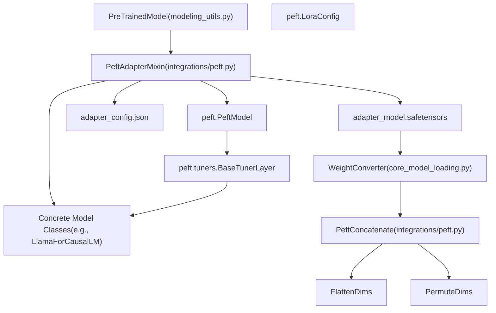
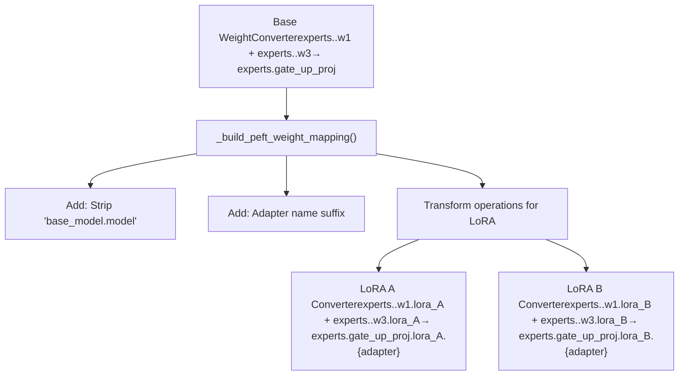
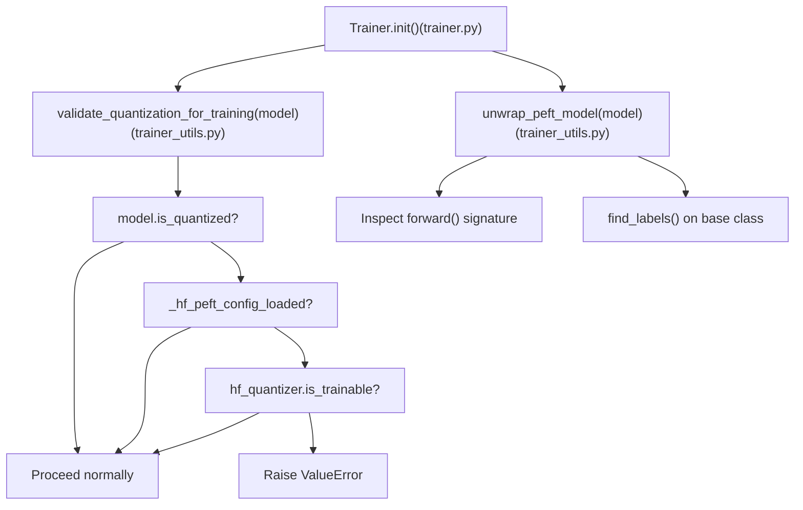

# PEFT 与适配器集成 (PEFT and Adapter Integration)

相关源文件 (Relevant source files)

-   [docs/source/en/main\_classes/quantization.md](https://github.com/huggingface/transformers/blob/9a9997fd/docs/source/en/main_classes/quantization.md?plain=1)
-   [docs/source/en/quantization/overview.md](https://github.com/huggingface/transformers/blob/9a9997fd/docs/source/en/quantization/overview.md?plain=1)
-   [setup.py](https://github.com/huggingface/transformers/blob/9a9997fd/setup.py)
-   [src/transformers/conversion\_mapping.py](https://github.com/huggingface/transformers/blob/9a9997fd/src/transformers/conversion_mapping.py)
-   [src/transformers/core\_model\_loading.py](https://github.com/huggingface/transformers/blob/9a9997fd/src/transformers/core_model_loading.py)
-   [src/transformers/dependency\_versions\_table.py](https://github.com/huggingface/transformers/blob/9a9997fd/src/transformers/dependency_versions_table.py)
-   [src/transformers/integrations/\_\_init\_\_.py](https://github.com/huggingface/transformers/blob/9a9997fd/src/transformers/integrations/__init__.py)
-   [src/transformers/integrations/accelerate.py](https://github.com/huggingface/transformers/blob/9a9997fd/src/transformers/integrations/accelerate.py)
-   [src/transformers/integrations/peft.py](https://github.com/huggingface/transformers/blob/9a9997fd/src/transformers/integrations/peft.py)
-   [src/transformers/modeling\_utils.py](https://github.com/huggingface/transformers/blob/9a9997fd/src/transformers/modeling_utils.py)
-   [src/transformers/quantizers/auto.py](https://github.com/huggingface/transformers/blob/9a9997fd/src/transformers/quantizers/auto.py)
-   [src/transformers/testing\_utils.py](https://github.com/huggingface/transformers/blob/9a9997fd/src/transformers/testing_utils.py)
-   [src/transformers/trainer.py](https://github.com/huggingface/transformers/blob/9a9997fd/src/transformers/trainer.py)
-   [src/transformers/trainer\_utils.py](https://github.com/huggingface/transformers/blob/9a9997fd/src/transformers/trainer_utils.py)
-   [src/transformers/training\_args.py](https://github.com/huggingface/transformers/blob/9a9997fd/src/transformers/training_args.py)
-   [src/transformers/utils/\_\_init\_\_.py](https://github.com/huggingface/transformers/blob/9a9997fd/src/transformers/utils/__init__.py)
-   [src/transformers/utils/import\_utils.py](https://github.com/huggingface/transformers/blob/9a9997fd/src/transformers/utils/import_utils.py)
-   [src/transformers/utils/loading\_report.py](https://github.com/huggingface/transformers/blob/9a9997fd/src/transformers/utils/loading_report.py)
-   [src/transformers/utils/quantization\_config.py](https://github.com/huggingface/transformers/blob/9a9997fd/src/transformers/utils/quantization_config.py)
-   [tests/peft\_integration/test\_peft\_integration.py](https://github.com/huggingface/transformers/blob/9a9997fd/tests/peft_integration/test_peft_integration.py)
-   [tests/test\_modeling\_common.py](https://github.com/huggingface/transformers/blob/9a9997fd/tests/test_modeling_common.py)
-   [tests/trainer/test\_trainer.py](https://github.com/huggingface/transformers/blob/9a9997fd/tests/trainer/test_trainer.py)
-   [tests/utils/test\_core\_model\_loading.py](https://github.com/huggingface/transformers/blob/9a9997fd/tests/utils/test_core_model_loading.py)
-   [tests/utils/test\_modeling\_utils.py](https://github.com/huggingface/transformers/blob/9a9997fd/tests/utils/test_modeling_utils.py)
-   [utils/check\_config\_attributes.py](https://github.com/huggingface/transformers/blob/9a9997fd/utils/check_config_attributes.py)

本文档描述了 transformers 如何与 PEFT（参数高效微调 (Parameter-Efficient Fine-Tuning)）库集成，以支持加载、管理和训练适配器 (Adapter) 权重。适配器是参数高效的模块（如 LoRA、IA³ 等），可以注入到预训练模型中，而无需修改基础模型 (Base Model) 权重。

有关在模型加载期间使用的通用权重转换系统的信息，请参阅第 6.2 页。有关模型加载和检查点 (Checkpoint) 管理的信息，请参阅第 2.2 页。有关量化系统 (Quantization System) 的详细信息，请参阅第 6.1 页。

## 架构概述 (Architecture Overview)

PEFT 集成通过 `PeftAdapterMixin` 类实现，该类混入到 `PreTrainedModel` 中以提供适配器管理能力。集成支持从 Hub 或本地文件加载适配器、动态添加新适配器、在多个适配器之间切换，以及针对 MoE（混合专家 (Mixture-of-Experts)）模型的专门权重转换。支持的最低 PEFT 版本记录在 `MIN_PEFT_VERSION = "0.18.0"` \[src/transformers/integrations/peft.py:72\] 中。

### 图表：从自然语言到代码实体空间的桥接（架构） (Diagram: Bridge from Natural Language to Code Entity Space (Architecture))

**来源 (Sources):** \[src/transformers/integrations/peft.py:362-379\], \[src/transformers/modeling\_utils.py:56\]

## 适配器加载工作流 (Adapter Loading Workflow)

当使用 `from_pretrained()` 加载模型时，系统会检查适配器配置，如果存在则自动加载。工作流涉及发现适配器文件、创建权重映射 (Weight Mapping) 以及将适配器模块注入到模型中。

> **[Mermaid sequence]**
> *(图表结构无法解析)*

**核心函数 (Key Functions):**

| 函数 | 位置 | 目的 |
| --- | --- | --- |
| `maybe_load_adapters()` | \[src/transformers/integrations/peft.py:664-718\] | 在 `from_pretrained()` 期间发现并触发适配器加载 |
| `load_adapter()` | \[src/transformers/integrations/peft.py:384-533\] | 加载适配器权重的核心入口点 |
| `inject_adapter_in_model()` | \[src/transformers/integrations/peft.py:620-662\] | 使用 PEFT 适配器模块包装模型层 |

**来源 (Sources):** \[src/transformers/integrations/peft.py:664-718\], \[src/transformers/integrations/peft.py:384-533\]

## PeftAdapterMixin API

`PeftAdapterMixin` 类提供了管理模型上适配器的各种方法。这些方法在任何 `PreTrainedModel` 实例上均可使用。

### 核心方法 (Core Methods)

**`load_adapter()`** - 从文件或 Hub 加载适配器权重

-   **参数:**
    -   `peft_model_id` (str): 适配器的路径或 Hub 标识符
    -   `adapter_name` (str): 分配给适配器的名称（默认："default"）
    -   `hotswap` (bool | "auto"): 是否原地替换 (Replace in-place) 现有适配器
    -   `is_trainable` (bool): 适配器是否应为可训练的
-   **位置:** \[src/transformers/integrations/peft.py:384-533\]

**`add_adapter()`** - 使用给定的配置添加新适配器

-   **参数:**
    -   `adapter_config`: PEFT 配置对象（例如 `LoraConfig`）
    -   `adapter_name` (str): 新适配器的名称
-   **位置:** \[src/transformers/integrations/peft.py:535-569\]

**`set_adapter()`** - 激活特定的适配器

-   **参数:**
    -   `adapter_name` (str | list\[str\]): 要激活的适配器名称
-   **位置:** \[src/transformers/integrations/peft.py:571-597\]

**`enable_adapters()`** / **`disable_adapters()`** - 启用或禁用所有适配器

-   **位置:** \[src/transformers/integrations/peft.py:608-618\]

**来源 (Sources):** \[src/transformers/integrations/peft.py:362-662\]

## PEFT 适配器的权重映射 (Weight Mapping for PEFT Adapters)

PEFT 适配器需要专门的权重映射，因为适配器权重必须与应用在基础模型权重上的变换 (Transformation) 相匹配。例如，如果基础模型权重被融合 (Fused)（如 `gate_proj` 和 `up_proj` → `gate_up_proj`），则相应的 LoRA 权重也必须被正确融合。

### 标准适配器权重映射 (Standard Adapter Weight Mapping)

`_build_peft_weight_mapping()` 函数通过修改基础模型的转换映射来创建适配器的权重转换：

**来源 (Sources):** \[src/transformers/integrations/peft.py:195-308\]

## MoE 适配器的权重转换 (MoE Adapter Weight Conversion)

混合专家 (MoE) 模型需要对适配器权重进行特殊处理，因为基础权重是融合且堆叠的。`PeftConcatenate` 类实现了 LoRA B 矩阵的块对角拼接 (Block-diagonal concatenation)，以在基础权重融合时保持数学正确性。

**实现细节 (Implementation Details):**

| 张量类型 (Tensor Type) | 维度 | 操作 | 结果形状 |
| --- | --- | --- | --- |
| LoRA A (2D) | (out\_feat, rank) | 普通拼接 | (N \* out\_feat, N \* rank) |
| LoRA A (3D MoE) | (experts, out\_feat, rank) | 拼接后展平 | (2 \* rank \* experts, 2 \* out\_feat) |
| LoRA B (2D) | (rank, in\_feat) | 块对角 (Block diagonal) | (N \* rank, N \* in\_feat) |
| LoRA B (3D MoE) | (experts, rank, in\_feat) | 块对角 + 置换 + 展平 | (2 \* rank \* experts, 2 \* in\_feat) |

**来源 (Sources):** \[src/transformers/integrations/peft.py:75-135\], \[src/transformers/integrations/peft.py:229-306\]

## 适配器热插拔 (Adapter Hotswapping)

热插拔支持在不重新编译 (Recompilation) 的情况下原地替换现有适配器的权重。这对于使用 `torch.compile()` 的模型至关重要，因为加载新适配器通常会触发昂贵的重新编译。

### 启用热插拔 (Enabling Hotswap)

在编译之前，调用 `enable_peft_hotswap()` \[src/transformers/integrations/peft.py:720-782\] 以准备模型。

**行为 (Behavior):**

1.  将热插拔配置存储在 `_prepare_peft_hotswap_kwargs` 中。
2.  当调用 `load_adapter()` 且 `hotswap=True` 或 `hotswap="auto"` 时 \[src/transformers/integrations/peft.py:421-479\]:
    -   重用现有的适配器槽位 (Slot)。
    -   原地替换权重。
    -   通过 PEFT 的 `hotswap_adapter()` 自动处理秩 (Rank)/alpha 缩放差异。

**来源 (Sources):** \[src/transformers/integrations/peft.py:720-782\], \[src/transformers/integrations/peft.py:421-479\]

## Trainer 集成 (Trainer Integration)

`src/transformers/trainer.py` 中的 `Trainer` 类具有若干感知 PEFT 的行为，在对配备适配器或经过量化的模型进行微调时必须了解这些行为。

### `validate_quantization_for_training`

在 `Trainer.__init__()` \[src/transformers/trainer.py:442\] 中调用，此函数对量化模型强制执行安全规则：

| 检查条件 | 结果 |
| --- | --- |
| 量化模型 + 已应用 `torch.compile()` | 引发 `ValueError` |
| 量化基础模型且没有 PEFT 适配器，且量化器不可训练 | 引发 `ValueError` |
| 不支持 QAT 的量化模型且没有 PEFT 适配器 | 引发 `ValueError` |

### `unwrap_peft_model`

在 `Trainer` 中用于剥离 PEFT 包装器 (Wrapper)，以便检查底层模型（例如，读取标签名称或签名）。当可用时，它会调用 `model.get_base_model()`。

用于：

-   \[src/transformers/trainer.py:494\] — 在检查 forward 签名之前进行剥离。
-   \[src/transformers/trainer.py:509\] — 在查找标签名称之前进行剥离。

### 图表：从自然语言到代码实体空间的桥接（Trainer 流程） (Diagram: Bridge from Natural Language to Code Entity Space (Trainer Flow))

**来源 (Sources):** \[src/transformers/trainer.py:442\], \[src/transformers/trainer\_utils.py:69-140\]

## 多适配器管理 (Multi-Adapter Management)

系统支持同时加载和管理多个适配器。用户可以使用 `set_adapter(name)` 在它们之间切换，或者使用 `enable_adapters()` 和 `disable_adapters()` 全局启用或禁用它们。

**来源 (Sources):** \[src/transformers/integrations/peft.py:571-618\]
