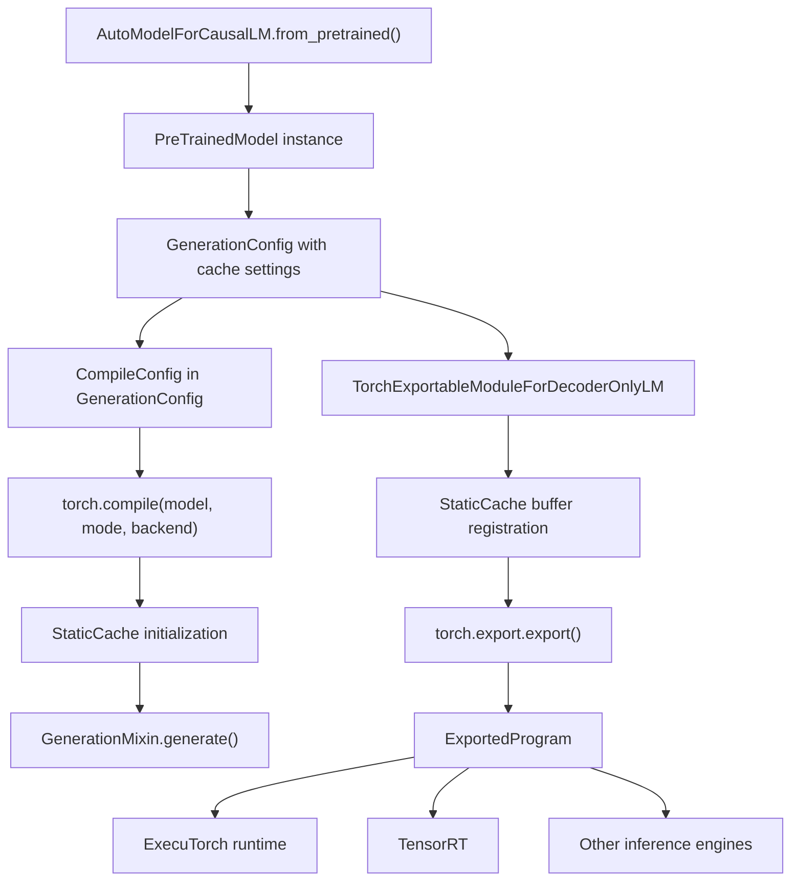
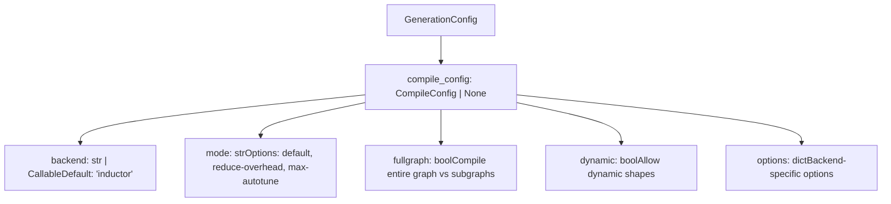
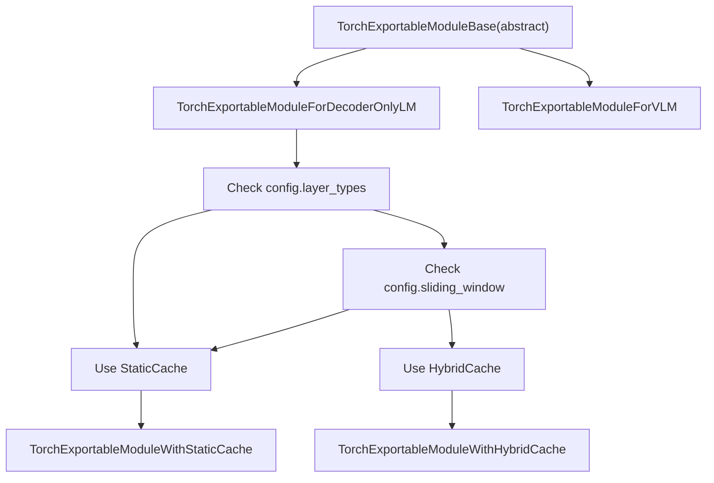
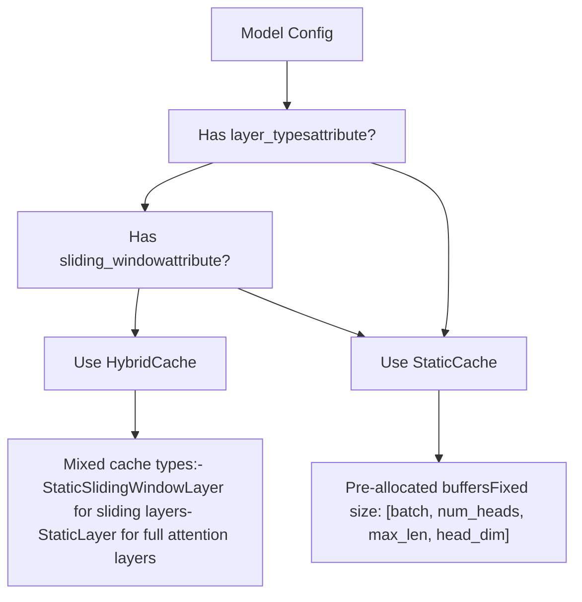

# 模型导出与编译 (Model Export and Compilation)

相关源文件 (Relevant source files)

-   [docs/source/en/model\_doc/albert.md](https://github.com/huggingface/transformers/blob/9a9997fd/docs/source/en/model_doc/albert.md?plain=1)
-   [docs/source/en/model\_doc/myt5.md](https://github.com/huggingface/transformers/blob/9a9997fd/docs/source/en/model_doc/myt5.md?plain=1)
-   [src/transformers/integrations/executorch.py](https://github.com/huggingface/transformers/blob/9a9997fd/src/transformers/integrations/executorch.py)
-   [src/transformers/integrations/flex\_attention.py](https://github.com/huggingface/transformers/blob/9a9997fd/src/transformers/integrations/flex_attention.py)
-   [src/transformers/models/albert/modeling\_albert.py](https://github.com/huggingface/transformers/blob/9a9997fd/src/transformers/models/albert/modeling_albert.py)
-   [src/transformers/models/funnel/modeling\_funnel.py](https://github.com/huggingface/transformers/blob/9a9997fd/src/transformers/models/funnel/modeling_funnel.py)
-   [src/transformers/models/llama4/configuration\_llama4.py](https://github.com/huggingface/transformers/blob/9a9997fd/src/transformers/models/llama4/configuration_llama4.py)
-   [src/transformers/models/llama4/convert\_llama4\_weights\_to\_hf.py](https://github.com/huggingface/transformers/blob/9a9997fd/src/transformers/models/llama4/convert_llama4_weights_to_hf.py)
-   [src/transformers/models/llama4/modeling\_llama4.py](https://github.com/huggingface/transformers/blob/9a9997fd/src/transformers/models/llama4/modeling_llama4.py)
-   [src/transformers/models/mllama/convert\_mllama\_weights\_to\_hf.py](https://github.com/huggingface/transformers/blob/9a9997fd/src/transformers/models/mllama/convert_mllama_weights_to_hf.py)
-   [src/transformers/models/mobilebert/modeling\_mobilebert.py](https://github.com/huggingface/transformers/blob/9a9997fd/src/transformers/models/mobilebert/modeling_mobilebert.py)
-   [src/transformers/models/mpnet/modeling\_mpnet.py](https://github.com/huggingface/transformers/blob/9a9997fd/src/transformers/models/mpnet/modeling_mpnet.py)
-   [src/transformers/models/myt5/\_\_init\_\_.py](https://github.com/huggingface/transformers/blob/9a9997fd/src/transformers/models/myt5/__init__.py)
-   [src/transformers/models/myt5/convert\_myt5\_original\_tf\_checkpoint\_to\_pytorch.py](https://github.com/huggingface/transformers/blob/9a9997fd/src/transformers/models/myt5/convert_myt5_original_tf_checkpoint_to_pytorch.py)
-   [src/transformers/models/myt5/tokenization\_myt5.py](https://github.com/huggingface/transformers/blob/9a9997fd/src/transformers/models/myt5/tokenization_myt5.py)
-   [src/transformers/models/nystromformer/modeling\_nystromformer.py](https://github.com/huggingface/transformers/blob/9a9997fd/src/transformers/models/nystromformer/modeling_nystromformer.py)
-   [src/transformers/models/vilt/modeling\_vilt.py](https://github.com/huggingface/transformers/blob/9a9997fd/src/transformers/models/vilt/modeling_vilt.py)
-   [src/transformers/models/visual\_bert/modeling\_visual\_bert.py](https://github.com/huggingface/transformers/blob/9a9997fd/src/transformers/models/visual_bert/modeling_visual_bert.py)
-   [tests/models/aya\_vision/test\_modeling\_aya\_vision.py](https://github.com/huggingface/transformers/blob/9a9997fd/tests/models/aya_vision/test_modeling_aya_vision.py)
-   [tests/models/cohere2/test\_modeling\_cohere2.py](https://github.com/huggingface/transformers/blob/9a9997fd/tests/models/cohere2/test_modeling_cohere2.py)
-   [tests/models/gemma/test\_modeling\_gemma.py](https://github.com/huggingface/transformers/blob/9a9997fd/tests/models/gemma/test_modeling_gemma.py)
-   [tests/models/gemma2/test\_modeling\_gemma2.py](https://github.com/huggingface/transformers/blob/9a9997fd/tests/models/gemma2/test_modeling_gemma2.py)
-   [tests/models/glm/test\_modeling\_glm.py](https://github.com/huggingface/transformers/blob/9a9997fd/tests/models/glm/test_modeling_glm.py)
-   [tests/models/granitemoehybrid/test\_modeling\_granitemoehybrid.py](https://github.com/huggingface/transformers/blob/9a9997fd/tests/models/granitemoehybrid/test_modeling_granitemoehybrid.py)
-   [tests/models/llama/test\_modeling\_llama.py](https://github.com/huggingface/transformers/blob/9a9997fd/tests/models/llama/test_modeling_llama.py)
-   [tests/models/mistral/test\_modeling\_mistral.py](https://github.com/huggingface/transformers/blob/9a9997fd/tests/models/mistral/test_modeling_mistral.py)
-   [tests/models/mixtral/test\_modeling\_mixtral.py](https://github.com/huggingface/transformers/blob/9a9997fd/tests/models/mixtral/test_modeling_mixtral.py)
-   [tests/models/mra/test\_modeling\_mra.py](https://github.com/huggingface/transformers/blob/9a9997fd/tests/models/mra/test_modeling_mra.py)
-   [tests/models/myt5/\_\_init\_\_.py](https://github.com/huggingface/transformers/blob/9a9997fd/tests/models/myt5/__init__.py)
-   [tests/models/myt5/test\_tokenization\_myt5.py](https://github.com/huggingface/transformers/blob/9a9997fd/tests/models/myt5/test_tokenization_myt5.py)
-   [tests/models/olmo/test\_modeling\_olmo.py](https://github.com/huggingface/transformers/blob/9a9997fd/tests/models/olmo/test_modeling_olmo.py)
-   [tests/models/olmo2/test\_modeling\_olmo2.py](https://github.com/huggingface/transformers/blob/9a9997fd/tests/models/olmo2/test_modeling_olmo2.py)
-   [tests/models/phi3/test\_modeling\_phi3.py](https://github.com/huggingface/transformers/blob/9a9997fd/tests/models/phi3/test_modeling_phi3.py)
-   [tests/models/qwen2/test\_modeling\_qwen2.py](https://github.com/huggingface/transformers/blob/9a9997fd/tests/models/qwen2/test_modeling_qwen2.py)
-   [tests/models/qwen2\_moe/test\_modeling\_qwen2\_moe.py](https://github.com/huggingface/transformers/blob/9a9997fd/tests/models/qwen2_moe/test_modeling_qwen2_moe.py)
-   [tests/models/qwen3/test\_modeling\_qwen3.py](https://github.com/huggingface/transformers/blob/9a9997fd/tests/models/qwen3/test_modeling_qwen3.py)
-   [tests/models/qwen3\_moe/test\_modeling\_qwen3\_moe.py](https://github.com/huggingface/transformers/blob/9a9997fd/tests/models/qwen3_moe/test_modeling_qwen3_moe.py)
-   [tests/models/starcoder2/test\_modeling\_starcoder2.py](https://github.com/huggingface/transformers/blob/9a9997fd/tests/models/starcoder2/test_modeling_starcoder2.py)

## 概述 (Overview)

本页介绍了用于生产环境部署的模型优化基础架构，重点关注 PyTorch 2.x 的原生能力：

-   **torch.compile**: 使用 `torch.compile()` 和 `CompileConfig` 进行即时编译 (JIT Compilation)，以加速推理。
-   **torch.export**: 将模型预先导出 (AOT export) 为 `ExportedProgram`，以便部署到 ExecuTorch 等专用运行时 (Runtime)。
-   **静态缓存 (Static caching)**: 预分配 KV 缓存 (KV-cache)，这是图稳定 (Graph-stable) 的编译和导出所必需的。
-   **Flex Attention**: 集成了 `torch.nn.attention.flex_attention` 以使用优化的注意力内核 (Attention Kernel)。
-   **ExecuTorch 集成**: 通过 `TorchExportableModuleForDecoderOnlyLM` 实现在边缘设备 (Edge Device) 上的部署。

---

## 导出与编译概述 (Export and Compilation Overview)

Transformers 库为部署的模型提供了两条主要的优化路径：

1.  **torch.compile**: 即时编译，通过优化模型执行图 (Execution Graph) 来加速推理，同时保持与 PyTorch 的完全兼容性。
2.  **torch.export**: 预先导出，生成一个静态计算图，适用于部署到 ExecuTorch 等专用运行时。

这两种方法都要求模型使用**静态缓存 (Static Caching)** 机制来预分配内存缓冲区，从而支持图捕获 (Graph Capture) 和优化。

### 系统架构 (System Architecture)

图表：模型导出与编译路径 (Diagram: Model Export and Compilation Paths)


**来源 (Sources):** [src/transformers/modeling\_utils.py1-300](https://github.com/huggingface/transformers/blob/9a9997fd/src/transformers/modeling_utils.py#L1-L300) [src/transformers/generation/utils.py338-365](https://github.com/huggingface/transformers/blob/9a9997fd/src/transformers/generation/utils.py#L338-L365) [src/transformers/generation/configuration\_utils.py83-282](https://github.com/huggingface/transformers/blob/9a9997fd/src/transformers/generation/configuration_utils.py#L83-L282) [src/transformers/integrations/executorch.py186-448](https://github.com/huggingface/transformers/blob/9a9997fd/src/transformers/integrations/executorch.py#L186-L448)

---

## torch.compile 集成 (torch.compile Integration)

### 编译需求 (Compilation Requirements)

PyTorch 的 `torch.compile()` 通过即时编译优化执行图。对于带有 KV 缓存的生成过程，需要使用 `StaticCache`：

| 需求 | 原因 |
| --- | --- |
| 预分配缓冲区 (Pre-allocated buffers) | 动态分配会破坏 `torch.compile()` 中的图捕获 |
| 固定张量形状 (Fixed tensor shapes) | 支持内核融合 (Kernel Fusion) 和内存优化 |
| 可编译操作 (Compilable operations) | `StaticCache.update()` 仅使用图兼容的操作 |

**来源 (Sources):** [src/transformers/cache\_utils.py460-580](https://github.com/huggingface/transformers/blob/9a9997fd/src/transformers/cache_utils.py#L460-L580) [src/transformers/generation/utils.py1200-1400](https://github.com/huggingface/transformers/blob/9a9997fd/src/transformers/generation/utils.py#L1200-L1400)

### Flex Attention 集成 (Flex Attention Integration)

Transformers 集成了 `torch.nn.attention.flex_attention`，以提供高度优化的注意力内核，这些内核是原生可编译的。`WrappedFlexAttention` 单例 (Singleton) 确保内核只被编译一次。

```
# 在建模文件中的用法（例如 Llama 或 Gemma2）from transformers.integrations.flex_attention import compile_friendly_flex_attention # 在 forward pass 内部attn_output = compile_friendly_flex_attention(    query, key, value, training=self.training, block_mask=block_mask)
```
**来源 (Sources):** [src/transformers/integrations/flex\_attention.py59-98](https://github.com/huggingface/transformers/blob/9a9997fd/src/transformers/integrations/flex_attention.py#L59-L98) [src/transformers/integrations/flex\_attention.py114-129](https://github.com/huggingface/transformers/blob/9a9997fd/src/transformers/integrations/flex_attention.py#L114-L129) [tests/models/gemma2/test\_modeling\_gemma2.py130-132](https://github.com/huggingface/transformers/blob/9a9997fd/tests/models/gemma2/test_modeling_gemma2.py#L130-L132)

### CompileConfig

`GenerationConfig` 中的 `CompileConfig` 数据类 (Dataclass) 控制编译行为：

图表：CompileConfig 结构 (Diagram: CompileConfig Structure)


**来源 (Sources):** [src/transformers/generation/configuration\_utils.py1-100](https://github.com/huggingface/transformers/blob/9a9997fd/src/transformers/generation/configuration_utils.py#L1-L100) [src/transformers/generation/utils.py50-100](https://github.com/huggingface/transformers/blob/9a9997fd/src/transformers/generation/utils.py#L50-L100)

### 配合编译进行生成 (Generation with Compilation)

对生成过程进行编译有两种方法：

**方法 1：通过 GenerationConfig 编译整个模型**

```
from transformers import AutoModelForCausalLM, GenerationConfig, CompileConfig model = AutoModelForCausalLM.from_pretrained("meta-llama/Llama-2-7b-hf") # 配置编译model.generation_config = GenerationConfig(    cache_implementation="static",    max_length=100,    compile_config=CompileConfig(        backend="inductor",        mode="reduce-overhead",        fullgraph=True    )) # 生成 - 自动使用 torch.compileoutputs = model.generate(input_ids, max_new_tokens=50)
```
**方法 2：手动编译前向传递 (Forward Pass)**

```
import torch # 仅编译 forward 方法model.forward = torch.compile(    model.forward,     mode="reduce-overhead",    fullgraph=True) # 使用静态缓存进行生成outputs = model.generate(    input_ids,    max_new_tokens=50,    cache_implementation="static")
```
**来源 (Sources):** [src/transformers/generation/utils.py1200-1400](https://github.com/huggingface/transformers/blob/9a9997fd/src/transformers/generation/utils.py#L1200-L1400) [tests/models/llama/test\_modeling\_llama.py193-226](https://github.com/huggingface/transformers/blob/9a9997fd/tests/models/llama/test_modeling_llama.py#L193-L226) [tests/models/gemma/test\_modeling\_gemma.py322-352](https://github.com/huggingface/transformers/blob/9a9997fd/tests/models/gemma/test_modeling_gemma.py#L322-L352)

### 配合 torch.compile 进行训练 (Training with torch.compile)

`TrainingArguments` 类支持在训练期间进行编译：

```
from transformers import TrainingArguments, Trainer training_args = TrainingArguments(    output_dir="./output",    torch_compile=True,                    # 启用编译    torch_compile_backend="inductor",      # 后端选择    torch_compile_mode="default",          # 编译模式) trainer = Trainer(    model=model,    args=training_args,    train_dataset=dataset) trainer.train()  # 模型将自动编译
```
**来源 (Sources):** [src/transformers/training\_args.py306-320](https://github.com/huggingface/transformers/blob/9a9997fd/src/transformers/training_args.py#L306-L320) [src/transformers/trainer.py362-610](https://github.com/huggingface/transformers/blob/9a9997fd/src/transformers/trainer.py#L362-L610)

---

## 用于部署的 torch.export (torch.export for Deployment)

### 导出基础架构 (Export Infrastructure)

`src/transformers/integrations/executorch.py` 模块提供了用于导出的包装类 (Wrapper Class)：

图表：导出包装类层级 (Diagram: Export Wrapper Class Hierarchy)


| 类 (Class) | 目的 (Purpose) |
| --- | --- |
| `TorchExportableModuleForDecoderOnlyLM` | 为大语言模型 (LLM) 自动选择缓存并导出。 [src/transformers/integrations/executorch.py186-448](https://github.com/huggingface/transformers/blob/9a9997fd/src/transformers/integrations/executorch.py#L186-L448) |
| `TorchExportableModuleWithStaticCache` | 为全注意力 (Full attention) 模型导出。 [src/transformers/integrations/executorch.py450-542](https://github.com/huggingface/transformers/blob/9a9997fd/src/transformers/integrations/executorch.py#L450-L542) |
| `TorchExportableModuleForVLM` | 为视觉语言模型 (VLM) 进行基于组件的导出。 [src/transformers/integrations/executorch.py34-184](https://github.com/huggingface/transformers/blob/9a9997fd/src/transformers/integrations/executorch.py#L34-L184) |

**来源 (Sources):** [src/transformers/integrations/executorch.py1-600](https://github.com/huggingface/transformers/blob/9a9997fd/src/transformers/integrations/executorch.py#L1-L600)

### 视觉语言模型导出 (Vision-Language Model Export)

对于 SmolVLM2 等多模态模型 (Multimodal Model)，导出过程会将组件分离，以便独立优化视觉编码器 (Vision Encoder)、连接器 (Connector) 和文本解码器 (Text Decoder)。

```
# VLM 导出示例from transformers.integrations.executorch import TorchExportableModuleForVLM vlm_exportable = TorchExportableModuleForVLM(model)exported_components = vlm_exportable.export()# 返回 {"vision_encoder": ..., "connector": ..., "text_decoder": ...}
```
**来源 (Sources):** [src/transformers/integrations/executorch.py34-153](https://github.com/huggingface/transformers/blob/9a9997fd/src/transformers/integrations/executorch.py#L34-L153)

---

## 用于导出的缓存管理 (Cache Management for Export)

### StaticCache 与 HybridCache (StaticCache vs HybridCache)


**来源 (Sources):** [src/transformers/integrations/executorch.py213-224](https://github.com/huggingface/transformers/blob/9a9997fd/src/transformers/integrations/executorch.py#L213-L224)

### 用于导出的缓冲区注册 (Buffer Registration for Export)

为了使导出的图有效，缓存张量必须注册为模块缓冲区 (Module Buffer)。这由导出包装类自动处理：

```
# 来自 TorchExportableModuleWithStaticCache.__init__for i, layer in enumerate(self.static_cache.layers):    self.register_buffer(f"key_cache_{i}", layer.keys, persistent=False)    self.register_buffer(f"value_cache_{i}", layer.values, persistent=False)
```
**来源 (Sources):** [src/transformers/integrations/executorch.py538-541](https://github.com/huggingface/transformers/blob/9a9997fd/src/transformers/integrations/executorch.py#L538-L541)

---

## 使用导出的模型进行生成 (Generation with Exported Models)

`TorchExportableModuleWithStaticCache.generate()` 方法提供了一个简化的生成循环，逐个令牌 (Token) 地驱动 `ExportedProgram`。

### 填充与解码循环 (Prefill and Decode Loop)

1.  **填充 (Prefill)**: 顺序处理提示令牌，以填充 `StaticCache`。
2.  **解码 (Decode)**: 逐一生成新令牌，直到达到 EOS 或 `max_new_tokens`。

```
# TorchExportableModuleWithStaticCache.generate 内部逻辑for i in range(input_ids.shape[1]):    # 填充的前向传递    outputs = exported_module(input_ids=curr_input, cache_position=curr_pos)    # 解码循环for _ in range(max_new_tokens):    outputs = exported_module(input_ids=last_token, cache_position=curr_pos)    next_token = outputs.argmax(dim=-1)
```
**来源 (Sources):** [src/transformers/integrations/executorch.py380-440](https://github.com/huggingface/transformers/blob/9a9997fd/src/transformers/integrations/executorch.py#L380-L440)

---

## 模型特定支持 (Model-Specific Support)

### 支持编译和导出的架构 (Supported Architectures for Compilation and Export)

| 模型家族 | 编译支持 | 导出支持 | 备注 |
| --- | --- | --- | --- |
| Llama | 是 | 是 | 静态缓存测试的基准。 [tests/models/llama/test\_modeling\_llama.py229](https://github.com/huggingface/transformers/blob/9a9997fd/tests/models/llama/test_modeling_llama.py#L229-L229) |
| Gemma/Gemma2 | 是 | 是 | 支持 Flex Attention。 [tests/models/gemma2/test\_modeling\_gemma2.py130](https://github.com/huggingface/transformers/blob/9a9997fd/tests/models/gemma2/test_modeling_gemma2.py#L130-L130) |
| Qwen2/Qwen3 | 是 | 是 | 包括 MoE 变体。 [tests/models/qwen3/test\_modeling\_qwen3.py202](https://github.com/huggingface/transformers/blob/9a9997fd/tests/models/qwen3/test_modeling_qwen3.py#L202-L202) |
| Mistral | 是 | 是 | 通过 HybridCache 支持滑动窗口 (Sliding window)。 [tests/models/mistral/test\_modeling\_mistral.py211](https://github.com/huggingface/transformers/blob/9a9997fd/tests/models/mistral/test_modeling_mistral.py#L211-L211) |
| Phi3 | 是 | 是 | 已通过 `Phi3MiniWithStaticCache` 验证。 [tests/models/phi3/test\_modeling\_phi3.py44](https://github.com/huggingface/transformers/blob/9a9997fd/tests/models/phi3/test_modeling_phi3.py#L44-L44) |

**来源 (Sources):** [tests/models/llama/test\_modeling\_llama.py](https://github.com/huggingface/transformers/blob/9a9997fd/tests/models/llama/test_modeling_llama.py) [tests/models/mistral/test\_modeling\_mistral.py](https://github.com/huggingface/transformers/blob/9a9997fd/tests/models/mistral/test_modeling_mistral.py) [tests/models/phi3/test\_modeling\_phi3.py](https://github.com/huggingface/transformers/blob/9a9997fd/tests/models/phi3/test_modeling_phi3.py) [src/transformers/integrations/executorch.py](https://github.com/huggingface/transformers/blob/9a9997fd/src/transformers/integrations/executorch.py)
