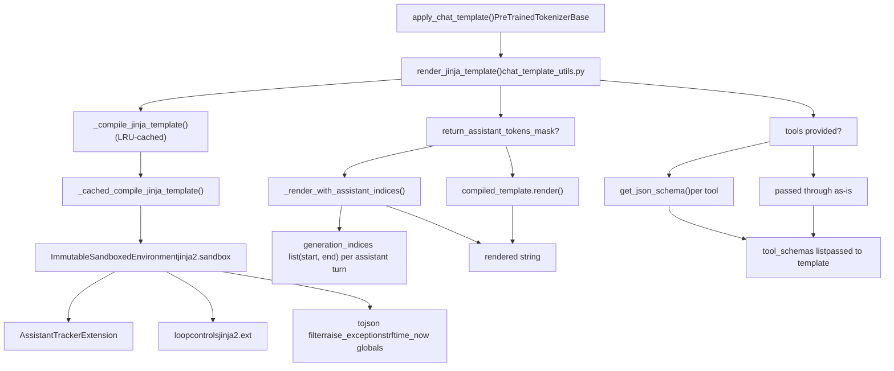
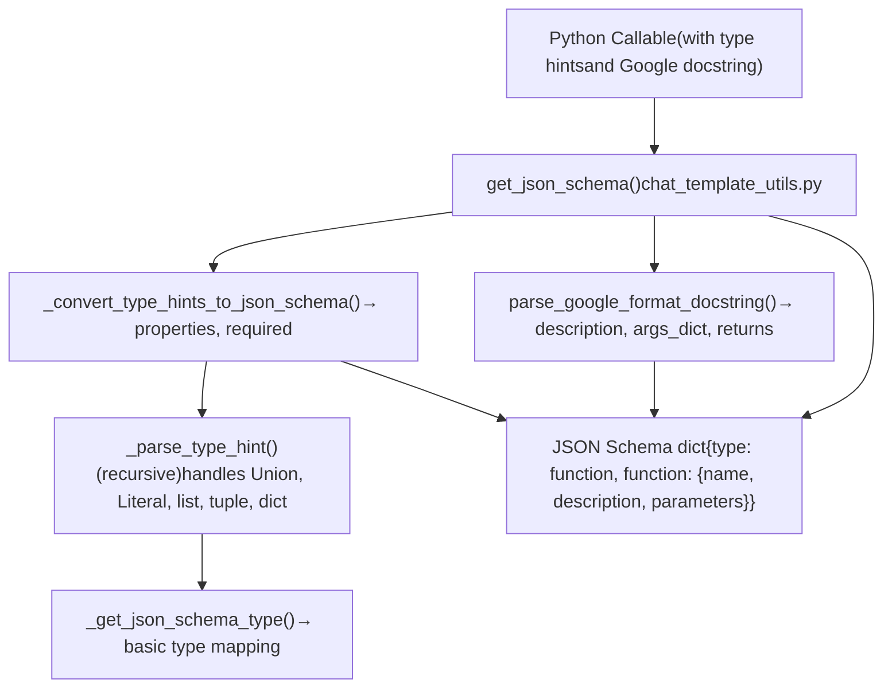
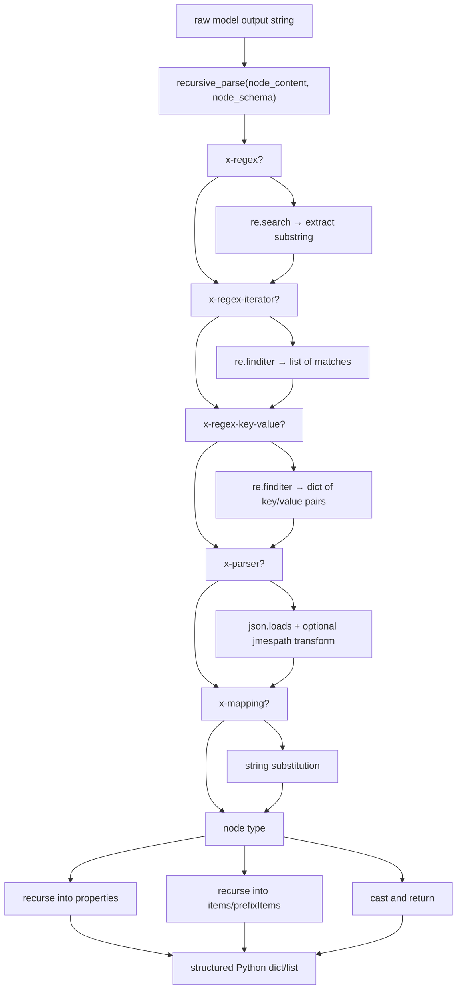
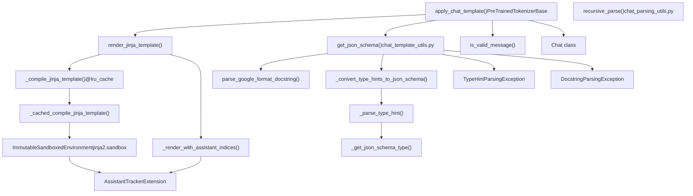

# 聊天模板与对话处理 (Chat Templates and Conversation Handling)

相关源文件 (Relevant source files)

-   [docs/source/en/chat\_extras.md](https://github.com/huggingface/transformers/blob/9a9997fd/docs/source/en/chat_extras.md?plain=1)
-   [docs/source/en/chat\_response\_parsing.md](https://github.com/huggingface/transformers/blob/9a9997fd/docs/source/en/chat_response_parsing.md?plain=1)
-   [docs/source/en/chat\_templating.md](https://github.com/huggingface/transformers/blob/9a9997fd/docs/source/en/chat_templating.md?plain=1)
-   [docs/source/en/chat\_templating\_writing.md](https://github.com/huggingface/transformers/blob/9a9997fd/docs/source/en/chat_templating_writing.md?plain=1)
-   [docs/source/en/model\_doc/pix2struct.md](https://github.com/huggingface/transformers/blob/9a9997fd/docs/source/en/model_doc/pix2struct.md?plain=1)
-   [docs/source/es/chat\_templating.md](https://github.com/huggingface/transformers/blob/9a9997fd/docs/source/es/chat_templating.md?plain=1)
-   [docs/source/ja/chat\_templating.md](https://github.com/huggingface/transformers/blob/9a9997fd/docs/source/ja/chat_templating.md?plain=1)
-   [docs/source/zh/chat\_templating.md](https://github.com/huggingface/transformers/blob/9a9997fd/docs/source/zh/chat_templating.md?plain=1)
-   [src/transformers/cli/\_\_init\_\_.py](https://github.com/huggingface/transformers/blob/9a9997fd/src/transformers/cli/__init__.py)
-   [src/transformers/models/fsmt/convert\_fsmt\_original\_pytorch\_checkpoint\_to\_pytorch.py](https://github.com/huggingface/transformers/blob/9a9997fd/src/transformers/models/fsmt/convert_fsmt_original_pytorch_checkpoint_to_pytorch.py)
-   [src/transformers/models/gpt\_neox\_japanese/tokenization\_gpt\_neox\_japanese.py](https://github.com/huggingface/transformers/blob/9a9997fd/src/transformers/models/gpt_neox_japanese/tokenization_gpt_neox_japanese.py)
-   [src/transformers/models/ovis2/image\_processing\_ovis2.py](https://github.com/huggingface/transformers/blob/9a9997fd/src/transformers/models/ovis2/image_processing_ovis2.py)
-   [src/transformers/models/pix2struct/\_\_init\_\_.py](https://github.com/huggingface/transformers/blob/9a9997fd/src/transformers/models/pix2struct/__init__.py)
-   [src/transformers/utils/chat\_parsing\_utils.py](https://github.com/huggingface/transformers/blob/9a9997fd/src/transformers/utils/chat_parsing_utils.py)
-   [src/transformers/utils/chat\_template\_utils.py](https://github.com/huggingface/transformers/blob/9a9997fd/src/transformers/utils/chat_template_utils.py)
-   [tests/models/pix2struct/test\_image\_processing\_pix2struct.py](https://github.com/huggingface/transformers/blob/9a9997fd/tests/models/pix2struct/test_image_processing_pix2struct.py)
-   [tests/utils/test\_chat\_parsing\_utils.py](https://github.com/huggingface/transformers/blob/9a9997fd/tests/utils/test_chat_parsing_utils.py)
-   [tests/utils/test\_chat\_template\_utils.py](https://github.com/huggingface/transformers/blob/9a9997fd/tests/utils/test_chat_template_utils.py)
-   [utils/add\_pipeline\_model\_mapping\_to\_test.py](https://github.com/huggingface/transformers/blob/9a9997fd/utils/add_pipeline_model_mapping_to_test.py)
-   [utils/deprecate\_models.py](https://github.com/huggingface/transformers/blob/9a9997fd/utils/deprecate_models.py)
-   [utils/models\_to\_deprecate.py](https://github.com/huggingface/transformers/blob/9a9997fd/utils/models_to_deprecate.py)

本页介绍了 `transformers` 中的聊天模板 (Chat Template) 系统：Jinja 风格的模板如何存储在分词器 (Tokenizer) 上，`apply_chat_template` 如何将对话转换为令牌 (Token) 序列，Python 函数如何转换为 JSON 工具模式 (Tool Schema)，以及如何使用响应模式 (Response Schema) 将模型输出解析回结构化数据。

---

## 概念背景 (Conceptual Background)

经过对话微调 (Chat-tuned) 的语言模型本质上是执行序列持续生成的自回归语言模型 (Causal LM)。为了区分不同的说话者（用户、助手、系统），这些模型在训练数据中使用了特定的控制令牌 (Control Token)，如 `<|user|>` 或 `[INST]`。由于每个模型家族使用的格式都不同，`transformers` 使用**聊天模板**——存储在分词器配置中的 Jinja2 字符串——来确保输入符合模型的训练分布。

```
输入:  [{"role": "user", "content": "Hi"}, ...]
           ↓  apply_chat_template
输出: "<|im_start|>user\nHi<|im_end|>\n<|im_start|>assistant\n"
```
渲染后的字符串随后被分词并传递给 `model.generate()`。使用错误的模板会导致模型性能显著下降 [docs/source/en/chat\_templating.md23-74](https://github.com/huggingface/transformers/blob/9a9997fd/docs/source/en/chat_templating.md?plain=1#L23-L74)

---

## 核心数据结构 (Core Data Structures)

### 消息格式 (Message Format)

每条消息都是一个至少包含 `role` 和 `content` 键的字典 (`dict`)。类型别名 `ChatType` 被定义为 `list[dict[str, Any]]` [src/transformers/utils/chat\_template\_utils.py54](https://github.com/huggingface/transformers/blob/9a9997fd/src/transformers/utils/chat_template_utils.py#L54-L54)

| 键 (Key) | 类型 (Type) | 常用值 |
| --- | --- | --- |
| `role` | `str` | `"user"`, `"assistant"`, `"system"`, `"tool"` |
| `content` | `str` 或 `list[dict]` | 文本字符串，或内容字典列表（多模态 (Multimodal)） |
| `tool_calls` | `list[dict]` | 来自助手的工具调用 (Tool Call) 请求（可选） |

`is_valid_message` 函数用于校验一个字典是否同时具有 `role` 和 `content` 键 [src/transformers/utils/chat\_template\_utils.py584-592](https://github.com/huggingface/transformers/blob/9a9997fd/src/transformers/utils/chat_template_utils.py#L584-L592)

### 模板存储 (Template Storage)

模板以 Jinja2 字符串的形式存储在分词器的 `chat_template` 属性中 [docs/source/en/chat\_templating.md28-29](https://github.com/huggingface/transformers/blob/9a9997fd/docs/source/en/chat_templating.md?plain=1#L28-L29)。它通常定义在 `tokenizer_config.json` 中。如果未提供模板，则可能会根据模型类使用默认模板。

---

## `apply_chat_template` 方法

`apply_chat_template` 是处理对话的主要接口。它负责渲染、工具模式生成以及可选的分词操作。

### 核心参数 (Key Parameters)

| 参数 | 类型 | 描述 |
| --- | --- | --- |
| `conversation` | `list[dict]` | 消息字典列表 [docs/source/en/chat\_templating.md76-84](https://github.com/huggingface/transformers/blob/9a9997fd/docs/source/en/chat_templating.md?plain=1#L76-L84) |
| `tools` | `list` | 用于工具使用的 Python 函数或 JSON 模式 [docs/source/en/chat\_extras.md25-30](https://github.com/huggingface/transformers/blob/9a9997fd/docs/source/en/chat_extras.md?plain=1#L25-L30) |
| `add_generation_prompt` | `bool` | 追加指示助手响应开始的令牌 [docs/source/en/chat\_templating.md129-134](https://github.com/huggingface/transformers/blob/9a9997fd/docs/source/en/chat_templating.md?plain=1#L129-L134) |
| `tokenize` | `bool` | 如果为 `True`，返回令牌 ID；如果为 `False`，返回渲染后的字符串 [docs/source/en/chat\_templating.md84](https://github.com/huggingface/transformers/blob/9a9997fd/docs/source/en/chat_templating.md?plain=1#L84-L84) |
| `return_assistant_tokens_mask` | `bool` | 返回标识助手令牌的掩码 (Mask)，对训练非常有用 [src/transformers/utils/chat\_template\_utils.py481-495](https://github.com/huggingface/transformers/blob/9a9997fd/src/transformers/utils/chat_template_utils.py#L481-L495) |

---

## Jinja 渲染流水线 (Jinja Rendering Pipeline)

**标题：apply\_chat\_template 渲染流水线 (apply\_chat\_template rendering pipeline)**


来源 (Sources): [src/transformers/utils/chat\_template\_utils.py403-581](https://github.com/huggingface/transformers/blob/9a9997fd/src/transformers/utils/chat_template_utils.py#L403-L581)

### 环境配置 (Environment Configuration)

渲染引擎使用了一个 `ImmutableSandboxedEnvironment` [src/transformers/utils/chat\_template\_utils.py410](https://github.com/huggingface/transformers/blob/9a9997fd/src/transformers/utils/chat_template_utils.py#L410-L410)，并带有特定的扩展：

-   **AssistantTracker**: 跟踪 `` 标签内内容的字符偏移量 (Offset)，以生成令牌掩码 [src/transformers/utils/chat\_template\_utils.py415-455](https://github.com/huggingface/transformers/blob/9a9997fd/src/transformers/utils/chat_template_utils.py#L415-L455)
-   **自定义过滤器 (Custom Filters)**: 包括一个优化后的 `tojson` 过滤器和一个用于注入当前时间的 `strftime_now` 全局变量 [src/transformers/utils/chat\_template\_utils.py463-475](https://github.com/huggingface/transformers/blob/9a9997fd/src/transformers/utils/chat_template_utils.py#L463-L475)

---

## 工具使用：模式生成 (Tool Use: Schema Generation)

支持“函数调用 (Function-calling)”的模型需要 JSON 模式格式的工具描述。`apply_chat_template` 通过使用 `get_json_schema` 解析 Python 函数来自动化这一过程 [src/transformers/utils/chat\_template\_utils.py247-382](https://github.com/huggingface/transformers/blob/9a9997fd/src/transformers/utils/chat_template_utils.py#L247-L382)

**标题：Python 函数到 JSON 模式的转换 (Python function to JSON schema conversion)**


来源 (Sources): [src/transformers/utils/chat\_template\_utils.py83-382](https://github.com/huggingface/transformers/blob/9a9997fd/src/transformers/utils/chat_template_utils.py#L83-L382) [tests/utils/test\_chat\_template\_utils.py22-147](https://github.com/huggingface/transformers/blob/9a9997fd/tests/utils/test_chat_template_utils.py#L22-L147)

### Python 工具的要求 (Requirements for Python Tools)

1.  **Google 风格文档字符串 (Google-style Docstrings)**: 用于提取函数及其参数的描述 [docs/source/en/chat\_extras.md29-41](https://github.com/huggingface/transformers/blob/9a9997fd/docs/source/en/chat_extras.md?plain=1#L29-L41)
2.  **类型提示 (Type Hints)**: 所有参数必须有类型提示，以便生成 JSON 的 `type` 字段 [src/transformers/utils/chat\_template\_utils.py180-244](https://github.com/huggingface/transformers/blob/9a9997fd/src/transformers/utils/chat_template_utils.py#L180-L244)

---

## 响应解析 (Response Parsing)

随着模型输出变得更加结构化（如发出 reasoning/thinking 块或工具调用），简单的字符串解码已不足够。`parse_response` 方法使用**响应模式 (Response Schema)** 将模型的原始输出转换回结构化的消息字典 [docs/source/en/chat\_response\_parsing.md56-98](https://github.com/huggingface/transformers/blob/9a9997fd/docs/source/en/chat_response_parsing.md?plain=1#L56-L98)

### `recursive_parse` 实现

`src/transformers/utils/chat_parsing_utils.py` 中的解析器使用正则表达式 (Regex) 和可选的 JSON 解析器来分解字符串 [src/transformers/utils/chat\_parsing\_utils.py43-238](https://github.com/huggingface/transformers/blob/9a9997fd/src/transformers/utils/chat_parsing_utils.py#L43-L238)

**标题：recursive\_parse 模式驱动解析 (recursive\_parse schema-driven parsing)**


来源 (Sources): [src/transformers/utils/chat\_parsing\_utils.py29-238](https://github.com/huggingface/transformers/blob/9a9997fd/src/transformers/utils/chat_parsing_utils.py#L29-L238) [tests/utils/test\_chat\_parsing\_utils.py23-181](https://github.com/huggingface/transformers/blob/9a9997fd/tests/utils/test_chat_parsing_utils.py#L23-L181)

### 自定义模式关键字 (Custom Schema Keywords)

-   `x-regex`: 从字符串中提取特定组 [src/transformers/utils/chat\_parsing\_utils.py84-88](https://github.com/huggingface/transformers/blob/9a9997fd/src/transformers/utils/chat_parsing_utils.py#L84-L88)
-   `x-regex-iterator`: 查找多次出现（例如，多个工具调用） [src/transformers/utils/chat\_parsing\_utils.py89-98](https://github.com/huggingface/transformers/blob/9a9997fd/src/transformers/utils/chat_parsing_utils.py#L89-L98)
-   `x-parser`: 通常为 `"json"`，可以包含 `jmespath` 转换 [src/transformers/utils/chat\_parsing\_utils.py119-144](https://github.com/huggingface/transformers/blob/9a9997fd/src/transformers/utils/chat_parsing_utils.py#L119-L144)

---

## 组件摘要 (Component Summary)

**标题：聊天模板系统 — 核心代码实体 (Chat template system — key code entities)**


来源 (Sources): [src/transformers/utils/chat\_template\_utils.py1-604](https://github.com/huggingface/transformers/blob/9a9997fd/src/transformers/utils/chat_template_utils.py#L1-L604) [src/transformers/utils/chat\_parsing\_utils.py1-238](https://github.com/huggingface/transformers/blob/9a9997fd/src/transformers/utils/chat_parsing_utils.py#L1-L238)
