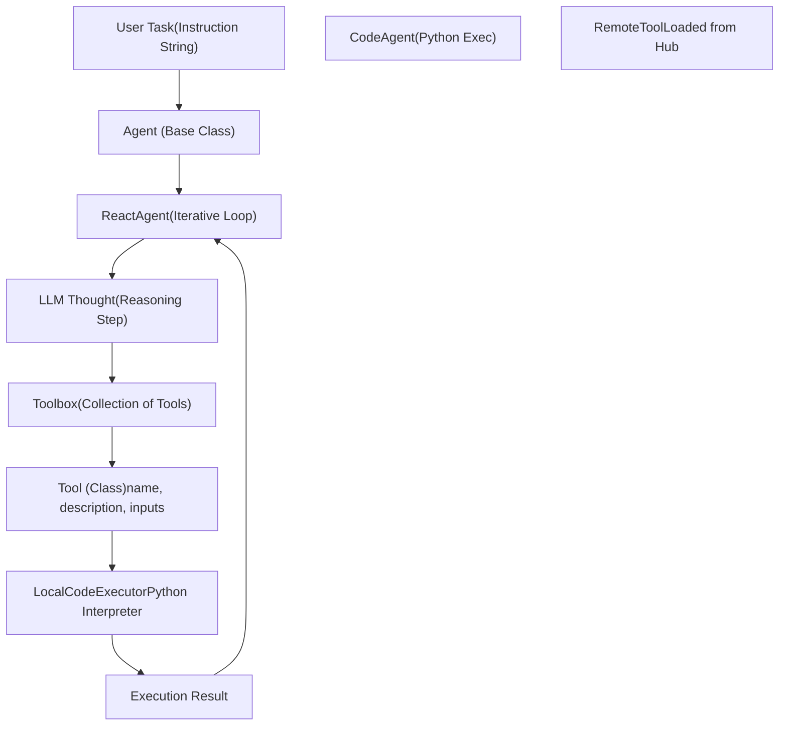
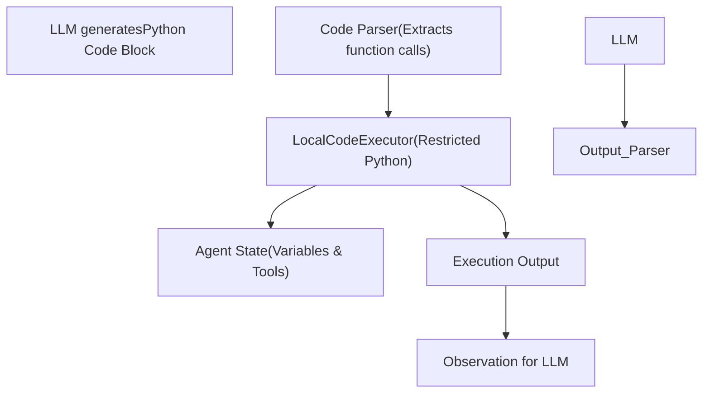

# 智能体与工具系统 (Agents and Tools System)

相关源文件 (Relevant source files)

-   [docs/source/ko/\_toctree.yml](https://github.com/huggingface/transformers/blob/9a9997fd/docs/source/ko/_toctree.yml)

## 目的与范围 (Purpose and Scope)

`transformers.agents` 系统提供了一个框架，用于构建由大语言模型 (LLM) 驱动的自主智能体 (Autonomous Agent)，这些智能体可以与外部工具和可执行环境进行交互。该系统使模型能够对任务进行推理、规划多步工作流、调用工具以收集信息或执行操作，并基于工具输出生成响应。

本文档涵盖：

-   `Agent` 基类及其专用实现（例如 `CodeAgent`、`ReactAgent`）。
-   通过 `Tool` 类进行工具定义和注册。
-   ReAct (推理与行动 (Reasoning and Acting)) 提示逻辑和迭代执行循环。
-   代码执行沙箱 (Sandboxing) 和安全性。
-   与 Hugging Face Hub 集成，用于共享和加载工具。

来源 (Sources): [docs/source/ko/\_toctree.yml88-99](https://github.com/huggingface/transformers/blob/9a9997fd/docs/source/ko/_toctree.yml#L88-L99) [docs/source/ko/\_toctree.yml111-113](https://github.com/huggingface/transformers/blob/9a9997fd/docs/source/ko/_toctree.yml#L111-L113)

---

## 核心架构：从自然语言到代码执行 (Core Architecture: From Natural Language to Code Execution)

智能体系统弥合了自然语言指令与确定性代码或 API 执行之间的鸿沟。主要的入口点是 `Agent` 类，它协调 `LanguageModel`、一组 `Tool` 对象和执行环境之间的交互。

**图表：自然语言到代码实体映射 (Diagram: Mapping Natural Language to Code Entities)**

来源 (Sources): [docs/source/ko/\_toctree.yml88-94](https://github.com/huggingface/transformers/blob/9a9997fd/docs/source/ko/_toctree.yml#L88-L94) [docs/source/ko/\_toctree.yml111-113](https://github.com/huggingface/transformers/blob/9a9997fd/docs/source/ko/_toctree.yml#L111-L113)

---

## 工具集成 (Tool Integration)

### `Tool` 类

`Tool` 是智能体能力的基本单元。它封装了特定的函数、其元数据（供 LLM 理解何时使用它）以及其执行逻辑。

| 属性 (Attribute) | 角色 |
| --- | --- |
| `name` | 在 LLM 提示词中使用的唯一标识符。 |
| `description` | 对工具用途的自然语言解释。 |
| `inputs` | 定义预期参数名称、类型和描述的字典。 |
| `output_type` | 工具返回的数据类型。 |
| `call()` | 包含实际执行逻辑的方法。 |

### 工具发现与加载 (Tool Discovery and Loading)

工具可以本地定义，也可以使用 `load_tool()` 从 Hugging Face Hub 加载。这实现了一个模块化生态系统，其中专门的工具（例如图像生成、网络搜索、文档解析）可以被共享和重用。

来源 (Sources): [docs/source/ko/\_toctree.yml113](https://github.com/huggingface/transformers/blob/9a9997fd/docs/source/ko/_toctree.yml#L113-L113)

---

## 智能体执行框架 (Agent Execution Framework)

### ReAct 策略 (`ReactAgent`)

`ReactAgent` 实现了“推理与行动 (Reasoning and Acting)”模式。它遵循生成“Thought (想法)”、选择“Tool (工具)”并处理“Observation (观察)”（工具输出）的循环。

1.  **提示 (Prompting)**: 智能体在初始化时带有一个包含工具描述和少样本示例 (Few-shot examples) 的系统提示词。
2.  **迭代 (Iteration)**: 智能体进入一个循环（最多 `max_iterations` 次）。
3.  **解析 (Parsing)**: 对 LLM 输出进行解析，以提取工具名称和参数。
4.  **执行 (Execution)**: `Toolbox` 将调用分派给相应的 `Tool`。
5.  **观察 (Observation)**: 结果作为“Observation”追加到聊天记录中，然后循环重复。

### 代码执行型智能体 (`CodeAgent`)

`CodeAgent` 代表了一种更高级的模式，LLM 生成实际的 Python 代码片段，而不仅仅是简单的工具调用。

-   **逻辑**: 智能体编写一段 Python 代码，该代码可能调用多个工具或执行数据操作。
-   **执行**: 此代码在受限环境中使用 `LocalCodeExecutor` 执行。
-   **状态**: 智能体跨代码块维护本地状态（变量）。

**图表：CodeAgent 执行内部流程 (Diagram: CodeAgent Execution Internal Flow)**

来源 (Sources): [docs/source/ko/\_toctree.yml97-98](https://github.com/huggingface/transformers/blob/9a9997fd/docs/source/ko/_toctree.yml#L97-L98) [docs/source/ko/\_toctree.yml111](https://github.com/huggingface/transformers/blob/9a9997fd/docs/source/ko/_toctree.yml#L111-L111)

---

## 安全性与沙箱 (Security and Sandboxing)

由于智能体（尤其是 `CodeAgent`）可以执行生成的代码，安全性是首要关注点。`transformers.agents` 系统实施了多项保障措施：

1.  **受限导入 (Restricted Imports)**: `LocalCodeExecutor` 限制了智能体可以导入哪些 Python 模块。
2.  **执行限制 (Execution Limits)**: 对执行时间和递归深度进行约束，以防止死循环或资源枯竭。
3.  **工具作用域 (Tool Scoping)**: 工具仅能访问显式传递给它们的参数，除非另有规定，否则无法访问整个智能体状态。
4.  **环境隔离 (Environment Isolation)**: 鼓励用户在处理不受信任的输入时，在隔离环境（Docker 或虚拟机）中运行智能体。

来源 (Sources): [docs/source/ko/\_toctree.yml97-99](https://github.com/huggingface/transformers/blob/9a9997fd/docs/source/ko/_toctree.yml#L97-L99)

---

## Tiny-Agents 与 CLI 集成 (Tiny-Agents and CLI Integration)

`Tiny-Agents` 系统为部署智能体工作流提供了一个轻量级入口。

-   **CLI 工具**: `tiny-agents` CLI 允许用户直接从终端运行智能体。
-   **MCP (模型上下文协议 (Model Context Protocol))**: 对 MCP 的支持使智能体能够无缝连接到标准化的外部数据源和工具提供商。
-   **RAG 集成**: 智能体可以在生成响应之前使用检索工具查询向量数据库或文档索引。

| 特性 (Feature) | 描述 |
| --- | --- |
| **交互模式 (Interactive Mode)** | 在终端中与智能体进行实时对话。 |
| **工具注册表 (Tool Registry)** | 一个集中式的 `Toolbox`，管理本地和远程工具。 |
| **遥测 (Telemetry)** | 记录工具调用和执行追踪，用于调试。 |

来源 (Sources): [docs/source/ko/\_toctree.yml88-89](https://github.com/huggingface/transformers/blob/9a9997fd/docs/source/ko/_toctree.yml#L88-L89) [docs/source/ko/\_toctree.yml97-98](https://github.com/huggingface/transformers/blob/9a9997fd/docs/source/ko/_toctree.yml#L97-L98)

---

## 构建工作流 (Building Workflows)

构建复杂的智能体工作流涉及：

1.  **模型选择 (Model Selection)**: 选择一个能够遵循复杂指令的 LLM（例如 Llama-3、Qwen2.5）。
2.  **工具选择 (Tool Selection)**: 为 `Toolbox` 配备必要的能力。
3.  **模板自定义 (Template Customization)**: 使用 `apply_chat_template` 确保智能体以模型偏好的格式接收指令。
4.  **循环管理 (Loop Management)**: 配置 `max_iterations` 和错误处理，以管理智能体的自主性。

来源 (Sources): [docs/source/ko/\_toctree.yml84-86](https://github.com/huggingface/transformers/blob/9a9997fd/docs/source/ko/_toctree.yml#L84-L86) [docs/source/ko/\_toctree.yml111-113](https://github.com/huggingface/transformers/blob/9a9997fd/docs/source/ko/_toctree.yml#L111-L113)
