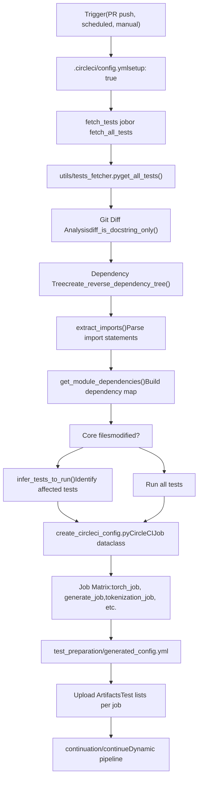
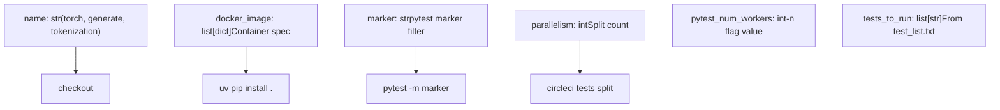

# 开发基础设施 (Development Infrastructure)

相关源文件 (Relevant source files)

-   [.circleci/config.yml](https://github.com/huggingface/transformers/blob/9a9997fd/.circleci/config.yml)
-   [.circleci/create\_circleci\_config.py](https://github.com/huggingface/transformers/blob/9a9997fd/.circleci/create_circleci_config.py)
-   [.github/workflows/check-workflow-permissions.yml](https://github.com/huggingface/transformers/blob/9a9997fd/.github/workflows/check-workflow-permissions.yml)
-   [.github/workflows/check\_failed\_tests.yml](https://github.com/huggingface/transformers/blob/9a9997fd/.github/workflows/check_failed_tests.yml)
-   [.github/workflows/get-pr-info.yml](https://github.com/huggingface/transformers/blob/9a9997fd/.github/workflows/get-pr-info.yml)
-   [.github/workflows/get-pr-number.yml](https://github.com/huggingface/transformers/blob/9a9997fd/.github/workflows/get-pr-number.yml)
-   [.github/workflows/model\_jobs.yml](https://github.com/huggingface/transformers/blob/9a9997fd/.github/workflows/model_jobs.yml)
-   [.github/workflows/new\_model\_pr\_merged\_notification.yml](https://github.com/huggingface/transformers/blob/9a9997fd/.github/workflows/new_model_pr_merged_notification.yml)
-   [.github/workflows/pr-repo-consistency-bot.yml](https://github.com/huggingface/transformers/blob/9a9997fd/.github/workflows/pr-repo-consistency-bot.yml)
-   [.github/workflows/pr\_build\_doc\_with\_comment.yml](https://github.com/huggingface/transformers/blob/9a9997fd/.github/workflows/pr_build_doc_with_comment.yml)
-   [.github/workflows/pr\_slow\_ci\_suggestion.yml](https://github.com/huggingface/transformers/blob/9a9997fd/.github/workflows/pr_slow_ci_suggestion.yml)
-   [.github/workflows/push-important-models.yml](https://github.com/huggingface/transformers/blob/9a9997fd/.github/workflows/push-important-models.yml)
-   [.github/workflows/self-comment-ci.yml](https://github.com/huggingface/transformers/blob/9a9997fd/.github/workflows/self-comment-ci.yml)
-   [.github/workflows/self-scheduled-caller.yml](https://github.com/huggingface/transformers/blob/9a9997fd/.github/workflows/self-scheduled-caller.yml)
-   [.github/workflows/self-scheduled.yml](https://github.com/huggingface/transformers/blob/9a9997fd/.github/workflows/self-scheduled.yml)
-   [.github/workflows/slack-report.yml](https://github.com/huggingface/transformers/blob/9a9997fd/.github/workflows/slack-report.yml)
-   [.github/workflows/ssh-runner.yml](https://github.com/huggingface/transformers/blob/9a9997fd/.github/workflows/ssh-runner.yml)
-   [conftest.py](https://github.com/huggingface/transformers/blob/9a9997fd/conftest.py)
-   [src/transformers/models/pi0/modular\_pi0.py](https://github.com/huggingface/transformers/blob/9a9997fd/src/transformers/models/pi0/modular_pi0.py)
-   [src/transformers/utils/network\_logging.py](https://github.com/huggingface/transformers/blob/9a9997fd/src/transformers/utils/network_logging.py)
-   [tests/repo\_utils/test\_mlinter.py](https://github.com/huggingface/transformers/blob/9a9997fd/tests/repo_utils/test_mlinter.py)
-   [tests/repo\_utils/test\_tests\_fetcher.py](https://github.com/huggingface/transformers/blob/9a9997fd/tests/repo_utils/test_tests_fetcher.py)
-   [tests/utils/test\_network\_logging.py](https://github.com/huggingface/transformers/blob/9a9997fd/tests/utils/test_network_logging.py)
-   [utils/check\_bad\_commit.py](https://github.com/huggingface/transformers/blob/9a9997fd/utils/check_bad_commit.py)
-   [utils/compare\_test\_runs.py](https://github.com/huggingface/transformers/blob/9a9997fd/utils/compare_test_runs.py)
-   [utils/get\_ci\_error\_statistics.py](https://github.com/huggingface/transformers/blob/9a9997fd/utils/get_ci_error_statistics.py)
-   [utils/get\_pr\_run\_slow\_jobs.py](https://github.com/huggingface/transformers/blob/9a9997fd/utils/get_pr_run_slow_jobs.py)
-   [utils/get\_previous\_daily\_ci.py](https://github.com/huggingface/transformers/blob/9a9997fd/utils/get_previous_daily_ci.py)
-   [utils/important\_models.txt](https://github.com/huggingface/transformers/blob/9a9997fd/utils/important_models.txt)
-   [utils/mlinter/README.md](https://github.com/huggingface/transformers/blob/9a9997fd/utils/mlinter/README.md?plain=1)
-   [utils/mlinter/\_\_init\_\_.py](https://github.com/huggingface/transformers/blob/9a9997fd/utils/mlinter/__init__.py)
-   [utils/mlinter/\_\_main\_\_.py](https://github.com/huggingface/transformers/blob/9a9997fd/utils/mlinter/__main__.py)
-   [utils/mlinter/\_helpers.py](https://github.com/huggingface/transformers/blob/9a9997fd/utils/mlinter/_helpers.py)
-   [utils/mlinter/mlinter.py](https://github.com/huggingface/transformers/blob/9a9997fd/utils/mlinter/mlinter.py)
-   [utils/mlinter/rules.toml](https://github.com/huggingface/transformers/blob/9a9997fd/utils/mlinter/rules.toml)
-   [utils/not\_doctested.txt](https://github.com/huggingface/transformers/blob/9a9997fd/utils/not_doctested.txt)
-   [utils/notification\_service.py](https://github.com/huggingface/transformers/blob/9a9997fd/utils/notification_service.py)
-   [utils/pr\_slow\_ci\_models.py](https://github.com/huggingface/transformers/blob/9a9997fd/utils/pr_slow_ci_models.py)
-   [utils/process\_bad\_commit\_report.py](https://github.com/huggingface/transformers/blob/9a9997fd/utils/process_bad_commit_report.py)
-   [utils/set\_cuda\_devices\_for\_ci.py](https://github.com/huggingface/transformers/blob/9a9997fd/utils/set_cuda_devices_for_ci.py)
-   [utils/split\_model\_tests.py](https://github.com/huggingface/transformers/blob/9a9997fd/utils/split_model_tests.py)
-   [utils/tests\_fetcher.py](https://github.com/huggingface/transformers/blob/9a9997fd/utils/tests_fetcher.py)

本文档涵盖了维护 Transformers 库的 持续集成 (Continuous Integration, CI)、测试和 构建基础设施 (Build Infrastructure)。这包括 CI/CD 流水线 (Pipeline)、Docker 镜像管理、测试选择机制以及分布式测试执行系统。

有关包的内部结构和 延迟加载 (Lazy Loading) 的信息，请参阅 [包结构与延迟加载 (Package Structure and Lazy Loading)](/huggingface/transformers/7.1-package-structure-and-lazy-loading)。有关构建系统和依赖项，请参阅 [构建与依赖管理 (Build and Dependency Management)](/huggingface/transformers/7.2-build-and-dependency-management)。有关测试框架和组织，请参阅 [测试基础设施 (Testing Infrastructure)](/huggingface/transformers/7.3-testing-infrastructure)。有关详细的 CI/CD 编排，请参阅 [CI/CD 流水线与测试编排 (CI/CD Pipeline and Test Orchestration)](/huggingface/transformers/7.4-cicd-pipeline-and-test-orchestration)。

## 概述 (Overview)

Transformers 的开发基础设施旨在验证分布在多种硬件配置（NVIDIA GPU、AMD GPU、CPU）、框架（PyTorch、TensorFlow、Flax）和专业配置（量化、分布式训练、张量并行）中的 400 多个模型实现。该系统使用智能测试选择来在保持全面覆盖的同时最小化 CI 时间。

**来源 (Sources)**: [.circleci/create\_circleci\_config.py1-56](https://github.com/huggingface/transformers/blob/9a9997fd/.circleci/create_circleci_config.py#L1-L56) [utils/tests\_fetcher.py1-49](https://github.com/huggingface/transformers/blob/9a9997fd/utils/tests_fetcher.py#L1-L49)

## CI/CD 架构 (CI/CD Architecture)

CI/CD 系统分为两个阶段运行：(1) **设置阶段 (Setup phase)** 根据代码更改确定要运行哪些测试，以及 (2) **执行阶段 (Execution phase)** 在专门的 Docker 容器中并行运行这些测试。

### 设置阶段：测试选择 (Setup Phase: Test Selection)


**来源 (Sources)**: [.circleci/config.yml1-89](https://github.com/huggingface/transformers/blob/9a9997fd/.circleci/config.yml#L1-L89) [utils/tests\_fetcher.py16-49](https://github.com/huggingface/transformers/blob/9a9997fd/utils/tests_fetcher.py#L16-L49) [.circleci/create\_circleci\_config.py120-133](https://github.com/huggingface/transformers/blob/9a9997fd/.circleci/create_circleci_config.py#L120-L133)

`tests_fetcher.py` 模块实现了基于依赖关系的测试选择：

-   **`get_all_tests()`**: 遍历 `tests` 文件夹以返回文件/子文件夹列表，排除 `sagemaker` 等非 CI 文件夹 [utils/tests\_fetcher.py165-191](https://github.com/huggingface/transformers/blob/9a9997fd/utils/tests_fetcher.py#L165-L191)
-   **`clean_code()`**: 移除 文档字符串 (Docstrings) 和注释，以检测 差异 (Diff) 是否具有实质内容 [utils/tests\_fetcher.py106-135](https://github.com/huggingface/transformers/blob/9a9997fd/utils/tests_fetcher.py#L106-L135)
-   **`keep_doc_examples_only()`**: 过滤内容以识别更改是否仅影响文档示例 [utils/tests\_fetcher.py138-162](https://github.com/huggingface/transformers/blob/9a9997fd/utils/tests_fetcher.py#L138-L162)

会触发完整 CI 的 核心文件 (Core files) 在 `CORE_FILES` 中定义 [utils/tests\_fetcher.py76-84](https://github.com/huggingface/transformers/blob/9a9997fd/utils/tests_fetcher.py#L76-L84)：

```
CORE_FILES = (    "setup.py",    ".circleci/create_circleci_config.py",    "src/transformers/modeling_utils.py",    "src/transformers/core_model_loading.py",    "src/transformers/cache_utils.py",    "src/transformers/generation/utils.py",    "src/transformers/utils/output_capturing.py",)
```
**来源 (Sources)**: [utils/tests\_fetcher.py76-84](https://github.com/huggingface/transformers/blob/9a9997fd/utils/tests_fetcher.py#L76-L84)

### 执行阶段：作业定义 (Execution Phase: Job Definitions)

`CircleCIJob` 数据类 (Dataclass) 定义了测试作业配置：


**来源 (Sources)**: [.circleci/create\_circleci\_config.py84-133](https://github.com/huggingface/transformers/blob/9a9997fd/.circleci/create_circleci_config.py#L84-L133) [.circleci/create\_circleci\_config.py146-157](https://github.com/huggingface/transformers/blob/9a9997fd/.circleci/create_circleci_config.py#L146-L157)

每个作业的 `to_dict()` 方法生成 CircleCI YAML，其步骤包括：

1.  **环境设置 (Environment Setup)**: 配置 `COMMON_ENV_VARIABLES`，例如 `TRANSFORMERS_IS_CI=True` 和 `PYTEST_TIMEOUT=120` [.circleci/create\_circleci\_config.py25-34](https://github.com/huggingface/transformers/blob/9a9997fd/.circleci/create_circleci_config.py#L25-L34)
2.  **依赖安装 (Dependency Installation)**: 为了提高速度使用 `uv pip install`，包括一个经过修补的 `pytest` 以确保进程退出 [.circleci/create\_circleci\_config.py112-117](https://github.com/huggingface/transformers/blob/9a9997fd/.circleci/create_circleci_config.py#L112-L117)
3.  **重试逻辑 (Retry Logic)**: 使用 `FLAKY_TEST_FAILURE_PATTERNS`（例如 `OSError`、`ConnectionError`、`HTTPError`）来识别值得重新运行的 瞬态故障 (Transient failures) [.circleci/create\_circleci\_config.py41-56](https://github.com/huggingface/transformers/blob/9a9997fd/.circleci/create_circleci_config.py#L41-L56)

## GitHub Actions 工作流 (GitHub Actions Workflows)

虽然 CircleCI 处理大部分 CPU/GPU 测试，但 GitHub Actions 管理编排、定期作业以及特定的 NVIDIA/AMD 运行器 (Runner) 任务。

### 定期和推送 CI (Scheduled and Push CI)

-   **Nvidia CI**: 通过 `self-scheduled.yml` 中的 `workflow_call` 触发，管理 `run_models_gpu`、`run_trainer_and_fsdp_gpu` 和 `run_quantization_torch_gpu` 等作业 [.github/workflows/self-scheduled.yml1-68](https://github.com/huggingface/transformers/blob/9a9997fd/.github/workflows/self-scheduled.yml#L1-L68)
-   **重要模型 (Important Models)**: `push-important-models.yml` 识别核心文件（例如 `modeling_utils.py`、`cache_utils.py`）中的更改，并为 `IMPORTANT_MODELS` 中列出的模型触发 慢速测试 (Slow tests) [.github/workflows/push-important-models.yml84-125](https://github.com/huggingface/transformers/blob/9a9997fd/.github/workflows/push-important-models.yml#L84-L125)

### PR 评论 CI (PR Comment CI)

维护者可以通过评论 `run-slow` 在 PR 上触发慢速测试。这由 `self-comment-ci.yml` 处理，它会：

1.  根据授权维护者列表验证 执行者 (Actor) [.github/workflows/self-comment-ci.yml30](https://github.com/huggingface/transformers/blob/9a9997fd/.github/workflows/self-comment-ci.yml#L30-L30)
2.  执行安全检查以确保评论晚于最后一次 提交 (Commit) [.github/workflows/self-comment-ci.yml41-60](https://github.com/huggingface/transformers/blob/9a9997fd/.github/workflows/self-comment-ci.yml#L41-L60)
3.  使用 `utils/pr_slow_ci_models.py` 根据评论正文确定要测试哪些模型 [.github/workflows/self-comment-ci.yml85-93](https://github.com/huggingface/transformers/blob/9a9997fd/.github/workflows/self-comment-ci.yml#L85-L93)

**来源 (Sources)**: [.github/workflows/self-scheduled.yml1-68](https://github.com/huggingface/transformers/blob/9a9997fd/.github/workflows/self-scheduled.yml#L1-L68) [.github/workflows/push-important-models.yml1-158](https://github.com/huggingface/transformers/blob/9a9997fd/.github/workflows/push-important-models.yml#L1-L158) [.github/workflows/self-comment-ci.yml1-165](https://github.com/huggingface/transformers/blob/9a9997fd/.github/workflows/self-comment-ci.yml#L1-L165)

## 测试基础设施工具 (Testing Infrastructure Tools)

### 故障分析：check\_bad\_commit.py (Failure Analysis: check\_bad\_commit.py)

`utils/check_bad_commit.py` 脚本使用 `git bisect` 来识别引入测试故障的具体提交。它创建一个临时的 `target_script.py` 来运行 `pytest`，并在发生故障时返回非零退出代码 [utils/check\_bad\_commit.py28-79](https://github.com/huggingface/transformers/blob/9a9997fd/utils/check_bad_commit.py#L28-L79)

### 静态分析：mlinter (Static Analysis: mlinter)

`mlinter` 工具专门为建模文件提供 静态分析 (Static analysis)，确保符合库标准 [utils/mlinter/mlinter.py1-50](https://github.com/huggingface/transformers/blob/9a9997fd/utils/mlinter/mlinter.py#L1-L50)

### 报告：notification\_service.py (Reporting: notification\_service.py)

CI 结果被汇总并通过 `utils/notification_service.py` 报告给 Slack。它解析测试结果以统计成功次数、故障次数（单 GPU 对比多 GPU）和错误次数 [utils/notification\_service.py74-102](https://github.com/huggingface/transformers/blob/9a9997fd/utils/notification_service.py#L74-L102)

| 结果类别 (Result Category) | 映射键 (Mapping Key) |
| --- | --- |
| 模型 (Models) | `run_models_gpu` |
| 训练器与 FSDP (Trainer & FSDP) | `run_trainer_and_fsdp_gpu` |
| 流水线 (Pipelines) | `run_pipelines_torch_gpu` |
| DeepSpeed | `run_torch_cuda_extensions_gpu` |
| 量化 (Quantization) | `run_quantization_torch_gpu` |

**来源 (Sources)**: [utils/check\_bad\_commit.py119-180](https://github.com/huggingface/transformers/blob/9a9997fd/utils/check_bad_commit.py#L119-L180) [utils/notification\_service.py34-55](https://github.com/huggingface/transformers/blob/9a9997fd/utils/notification_service.py#L34-L55) [utils/mlinter/mlinter.py1-20](https://github.com/huggingface/transformers/blob/9a9997fd/utils/mlinter/mlinter.py#L1-L20)

## Pytest 配置 (Pytest Configuration)

`conftest.py` 文件为所有测试定义了环境：

-   **设备过滤 (Device Filtering)**: `NOT_DEVICE_TESTS` 列出了应始终在 CPU 上运行的测试（例如 `test_tokenization`、`test_configuration_utils`） [conftest.py38-73](https://github.com/huggingface/transformers/blob/9a9997fd/conftest.py#L38-L73)
-   **自定义标记 (Custom Markers)**: 添加了 `accelerate_tests`、`torch_compile_test` 和 `flash_attn_test` 等标记 [conftest.py85-100](https://github.com/huggingface/transformers/blob/9a9997fd/conftest.py#L85-L100)
-   **环境微调 (Environment Tweaks)**: 默认禁用 `safetensors` 转换，并为 PyTorch 配置 `TF32` 设置 [conftest.py101-151](https://github.com/huggingface/transformers/blob/9a9997fd/conftest.py#L101-L151)

**来源 (Sources)**: [conftest.py15-160](https://github.com/huggingface/transformers/blob/9a9997fd/conftest.py#L15-L160)
