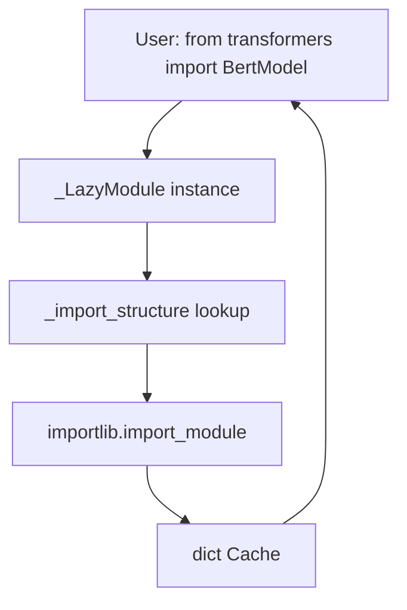
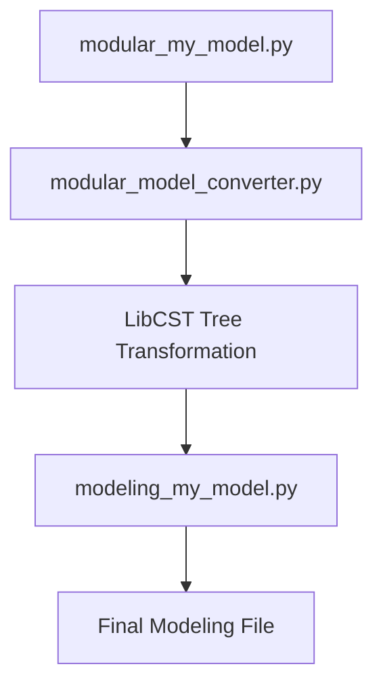

# 包结构与延迟加载 (Package Structure and Lazy Loading)

相关源文件 (Relevant source files)

-   [.ai/AGENTS.md](https://github.com/huggingface/transformers/blob/9a9997fd/.ai/AGENTS.md?plain=1)
-   [.ai/skills/add-or-fix-type-checking/SKILL.md](https://github.com/huggingface/transformers/blob/9a9997fd/.ai/skills/add-or-fix-type-checking/SKILL.md?plain=1)
-   [.gitignore](https://github.com/huggingface/transformers/blob/9a9997fd/.gitignore)
-   [AGENTS.md](https://github.com/huggingface/transformers/blob/9a9997fd/AGENTS.md?plain=1)
-   [CLAUDE.md](https://github.com/huggingface/transformers/blob/9a9997fd/CLAUDE.md?plain=1)
-   [CONTRIBUTING.md](https://github.com/huggingface/transformers/blob/9a9997fd/CONTRIBUTING.md?plain=1)
-   [Makefile](https://github.com/huggingface/transformers/blob/9a9997fd/Makefile)
-   [docs/source/en/\_toctree.yml](https://github.com/huggingface/transformers/blob/9a9997fd/docs/source/en/_toctree.yml)
-   [docs/source/en/index.md](https://github.com/huggingface/transformers/blob/9a9997fd/docs/source/en/index.md?plain=1)
-   [docs/source/en/model\_doc/paddleocr\_vl.md](https://github.com/huggingface/transformers/blob/9a9997fd/docs/source/en/model_doc/paddleocr_vl.md?plain=1)
-   [docs/source/en/model\_output\_tracing.md](https://github.com/huggingface/transformers/blob/9a9997fd/docs/source/en/model_output_tracing.md?plain=1)
-   [docs/source/en/modular\_transformers.md](https://github.com/huggingface/transformers/blob/9a9997fd/docs/source/en/modular_transformers.md?plain=1)
-   [docs/source/en/pr\_checks.md](https://github.com/huggingface/transformers/blob/9a9997fd/docs/source/en/pr_checks.md?plain=1)
-   [docs/source/es/pr\_checks.md](https://github.com/huggingface/transformers/blob/9a9997fd/docs/source/es/pr_checks.md?plain=1)
-   [docs/source/it/pr\_checks.md](https://github.com/huggingface/transformers/blob/9a9997fd/docs/source/it/pr_checks.md?plain=1)
-   [docs/source/ja/pr\_checks.md](https://github.com/huggingface/transformers/blob/9a9997fd/docs/source/ja/pr_checks.md?plain=1)
-   [docs/source/ko/pr\_checks.md](https://github.com/huggingface/transformers/blob/9a9997fd/docs/source/ko/pr_checks.md?plain=1)
-   [examples/modular-transformers/configuration\_duplicated\_method.py](https://github.com/huggingface/transformers/blob/9a9997fd/examples/modular-transformers/configuration_duplicated_method.py)
-   [examples/modular-transformers/configuration\_my\_new\_model.py](https://github.com/huggingface/transformers/blob/9a9997fd/examples/modular-transformers/configuration_my_new_model.py)
-   [examples/modular-transformers/configuration\_my\_new\_model2.py](https://github.com/huggingface/transformers/blob/9a9997fd/examples/modular-transformers/configuration_my_new_model2.py)
-   [examples/modular-transformers/configuration\_new\_model.py](https://github.com/huggingface/transformers/blob/9a9997fd/examples/modular-transformers/configuration_new_model.py)
-   [examples/modular-transformers/image\_processing\_new\_imgproc\_model.py](https://github.com/huggingface/transformers/blob/9a9997fd/examples/modular-transformers/image_processing_new_imgproc_model.py)
-   [examples/modular-transformers/modeling\_dummy\_bert.py](https://github.com/huggingface/transformers/blob/9a9997fd/examples/modular-transformers/modeling_dummy_bert.py)
-   [examples/modular-transformers/modeling\_from\_uppercase\_model.py](https://github.com/huggingface/transformers/blob/9a9997fd/examples/modular-transformers/modeling_from_uppercase_model.py)
-   [examples/modular-transformers/modeling\_global\_indexing.py](https://github.com/huggingface/transformers/blob/9a9997fd/examples/modular-transformers/modeling_global_indexing.py)
-   [examples/modular-transformers/modeling\_multimodal2.py](https://github.com/huggingface/transformers/blob/9a9997fd/examples/modular-transformers/modeling_multimodal2.py)
-   [examples/modular-transformers/modeling\_my\_new\_model2.py](https://github.com/huggingface/transformers/blob/9a9997fd/examples/modular-transformers/modeling_my_new_model2.py)
-   [examples/modular-transformers/modeling\_new\_task\_model.py](https://github.com/huggingface/transformers/blob/9a9997fd/examples/modular-transformers/modeling_new_task_model.py)
-   [examples/modular-transformers/modeling\_roberta.py](https://github.com/huggingface/transformers/blob/9a9997fd/examples/modular-transformers/modeling_roberta.py)
-   [examples/modular-transformers/modeling\_super.py](https://github.com/huggingface/transformers/blob/9a9997fd/examples/modular-transformers/modeling_super.py)
-   [examples/modular-transformers/modeling\_switch\_function.py](https://github.com/huggingface/transformers/blob/9a9997fd/examples/modular-transformers/modeling_switch_function.py)
-   [examples/modular-transformers/modeling\_test\_detr.py](https://github.com/huggingface/transformers/blob/9a9997fd/examples/modular-transformers/modeling_test_detr.py)
-   [examples/modular-transformers/modular\_multimodal2.py](https://github.com/huggingface/transformers/blob/9a9997fd/examples/modular-transformers/modular_multimodal2.py)
-   [examples/modular-transformers/modular\_new\_model.py](https://github.com/huggingface/transformers/blob/9a9997fd/examples/modular-transformers/modular_new_model.py)
-   [src/transformers/\_\_init\_\_.py](https://github.com/huggingface/transformers/blob/9a9997fd/src/transformers/__init__.py)
-   [src/transformers/\_typing.py](https://github.com/huggingface/transformers/blob/9a9997fd/src/transformers/_typing.py)
-   [src/transformers/generation/streamers.py](https://github.com/huggingface/transformers/blob/9a9997fd/src/transformers/generation/streamers.py)
-   [src/transformers/models/\_\_init\_\_.py](https://github.com/huggingface/transformers/blob/9a9997fd/src/transformers/models/__init__.py)
-   [src/transformers/models/auto/configuration\_auto.py](https://github.com/huggingface/transformers/blob/9a9997fd/src/transformers/models/auto/configuration_auto.py)
-   [src/transformers/models/auto/feature\_extraction\_auto.py](https://github.com/huggingface/transformers/blob/9a9997fd/src/transformers/models/auto/feature_extraction_auto.py)
-   [src/transformers/models/auto/image\_processing\_auto.py](https://github.com/huggingface/transformers/blob/9a9997fd/src/transformers/models/auto/image_processing_auto.py)
-   [src/transformers/models/auto/modeling\_auto.py](https://github.com/huggingface/transformers/blob/9a9997fd/src/transformers/models/auto/modeling_auto.py)
-   [src/transformers/models/auto/processing\_auto.py](https://github.com/huggingface/transformers/blob/9a9997fd/src/transformers/models/auto/processing_auto.py)
-   [src/transformers/models/auto/tokenization\_auto.py](https://github.com/huggingface/transformers/blob/9a9997fd/src/transformers/models/auto/tokenization_auto.py)
-   [src/transformers/models/paddleocr\_vl/\_\_init\_\_.py](https://github.com/huggingface/transformers/blob/9a9997fd/src/transformers/models/paddleocr_vl/__init__.py)
-   [src/transformers/utils/dummy\_pt\_objects.py](https://github.com/huggingface/transformers/blob/9a9997fd/src/transformers/utils/dummy_pt_objects.py)
-   [tests/generation/test\_streamers.py](https://github.com/huggingface/transformers/blob/9a9997fd/tests/generation/test_streamers.py)
-   [tests/repo\_utils/modular/test\_conversion\_order.py](https://github.com/huggingface/transformers/blob/9a9997fd/tests/repo_utils/modular/test_conversion_order.py)
-   [utils/add\_dates.py](https://github.com/huggingface/transformers/blob/9a9997fd/utils/add_dates.py)
-   [utils/check\_modular\_conversion.py](https://github.com/huggingface/transformers/blob/9a9997fd/utils/check_modular_conversion.py)
-   [utils/check\_repo.py](https://github.com/huggingface/transformers/blob/9a9997fd/utils/check_repo.py)
-   [utils/checkers.py](https://github.com/huggingface/transformers/blob/9a9997fd/utils/checkers.py)
-   [utils/create\_dependency\_mapping.py](https://github.com/huggingface/transformers/blob/9a9997fd/utils/create_dependency_mapping.py)
-   [utils/get\_test\_reports.py](https://github.com/huggingface/transformers/blob/9a9997fd/utils/get_test_reports.py)
-   [utils/modular\_model\_converter.py](https://github.com/huggingface/transformers/blob/9a9997fd/utils/modular_model_converter.py)

## 目的与范围 (Purpose and Scope)

本页面记录了 `transformers` 库的内部组织结构，重点介绍了代码库如何实现 延迟加载 (Lazy Loading) 以最小化 导入时间 (Import time) 和 内存占用 (Memory footprint)。它解释了 `__init__.py` 文件、`_LazyModule` 系统、针对缺失后端的 哑对象 (Dummy objects) 以及用于生成新模型实现的 模块化建模 (Modular modeling) 模式。

有关 Auto 类如何发现并实例化模型的信息，请参阅 [Auto 类与模型发现 (Auto Classes and Model Discovery)](/huggingface/transformers/2.1-auto-classes-and-model-discovery)。有关模型加载和权重管理的详细信息，请参阅 [模型加载与权重管理 (Model Loading and Weight Management)](/huggingface/transformers/2.2-model-loading-and-weight-management)。

---

## 包结构概览 (Package Structure Overview)

该库组织为分层模块结构，旨在将模型架构与核心实用程序以及高级 API 隔离。

```
src/transformers/
├── __init__.py                    # Main entry point with lazy loading
├── models/
│   ├── __init__.py               # Model registry with lazy imports
│   ├── auto/                     # Auto classes for automatic model selection
│   │   ├── modeling_auto.py      # AutoModel* mappings
│   │   ├── configuration_auto.py # AutoConfig mappings
│   │   ├── tokenization_auto.py  # AutoTokenizer mappings
│   │   └── auto_factory.py       # _LazyAutoMapping logic
│   ├── bert/                     # Individual model implementations
│   ├── llama/
│   └── ...                       # 400+ model types
├── utils/
│   ├── import_utils.py           # _LazyModule and dependency checks
│   ├── dummy_pt_objects.py      # PyTorch dependency stubs
│   └── ...
├── modular_model_converter.py     # Tool for generating model files
└── ...
```
**关键设计原则 (Key Design Principle)**: 该库推迟了所有重量级导入（PyTorch、TensorFlow、模型实现），直到它们真正被请求。这使得 `import transformers` 可以在几毫秒内完成。

**来源 (Sources)**: [src/transformers/\_\_init\_\_.py15-58](https://github.com/huggingface/transformers/blob/9a9997fd/src/transformers/__init__.py#L15-L58) [src/transformers/models/\_\_init\_\_.py14-20](https://github.com/huggingface/transformers/blob/9a9997fd/src/transformers/models/__init__.py#L14-L20)

---

## \_import\_structure 字典 (The \_import\_structure Dictionary)

### 结构与目的 (Structure and Purpose)

每个实现延迟加载的 `__init__.py` 文件都会定义一个 `_import_structure` 字典。此字典将子模块名称（键）映射到导出的对象名称列表（值）：

```
_import_structure = {    "configuration_utils": ["PreTrainedConfig", "PretrainedConfig"],    "generation": [        "AsyncTextIteratorStreamer",        "CompileConfig",        "GenerationConfig",        # ...    ],    "models.auto": [        "AutoConfig",        "AutoModel",        # ...    ],}
```
这充当了 `_LazyModule` 用于在不执行底层文件的情况下解析属性的 清单 (Manifest)。

**来源 (Sources)**: [src/transformers/\_\_init\_\_.py63-274](https://github.com/huggingface/transformers/blob/9a9997fd/src/transformers/__init__.py#L63-L274)

### 条件注册与哑对象 (Conditional Registration and Dummy Objects)

该库在初始化期间检查后端的可用性（例如 `is_torch_available()`）。如果缺失某个后端，它会使用来自 `dummy_pt_objects.py` 等文件的哑对象填充 `_import_structure`。

```
try:    if not is_torch_available():        raise OptionalDependencyNotAvailable()except OptionalDependencyNotAvailable:    from .utils import dummy_pt_objects    _import_structure["utils.dummy_pt_objects"] = [        name for name in dir(dummy_pt_objects) if not name.startswith("_")    ]else:    _import_structure["modeling_utils"] = ["PreTrainedModel"]    # ... add real PyTorch objects
```
**来源 (Sources)**: [src/transformers/\_\_init\_\_.py350-430](https://github.com/huggingface/transformers/blob/9a9997fd/src/transformers/__init__.py#L350-L430) [src/transformers/utils/dummy\_pt\_objects.py1-10](https://github.com/huggingface/transformers/blob/9a9997fd/src/transformers/utils/dummy_pt_objects.py#L1-L10)

---

## \_LazyModule 实现 (\_LazyModule Implementation)

### 延迟加载的机制 (Mechanics of Deferred Loading)

`_LazyModule` 类（在 `utils/import_utils.py` 中定义）通过 `__getattr__` 拦截属性访问。当用户请求一个对象（例如 `BertModel`）时，延迟模块会：

1.  通过 `_import_structure` 识别包含该对象的子模块。
2.  使用 `importlib.import_module` 加载该子模块。
3.  检索该对象并将其缓存到模块的 `__dict__` 中。


**来源 (Sources)**: [src/transformers/\_\_init\_\_.py15-25](https://github.com/huggingface/transformers/blob/9a9997fd/src/transformers/__init__.py#L15-L25) [src/transformers/utils/import\_utils.py](https://github.com/huggingface/transformers/blob/9a9997fd/src/transformers/utils/import_utils.py)

---

## 模型注册与 Auto 映射 (Model Registration and Auto Mappings)

### Auto 类与 \_LazyAutoMapping (Auto Classes and \_LazyAutoMapping)

为了避免在使用 `AutoModel` 时将所有 400 多个模型加载到内存中，该库使用了 `_LazyAutoMapping`。此类包装了大型字典 `MODEL_MAPPING_NAMES` 和 `CONFIG_MAPPING_NAMES`。

| 映射字典 (Mapping Dictionary) | 文件 (File) | 目的 (Purpose) |
| --- | --- | --- |
| `CONFIG_MAPPING_NAMES` | `models/auto/configuration_auto.py` | 将 `model_type`（例如 "llama"）映射到配置类名称 ("LlamaConfig") |
| `MODEL_MAPPING_NAMES` | `models/auto/modeling_auto.py` | 将 `model_type` 映射到基础模型类名称 ("LlamaModel") |
| `TOKENIZER_MAPPING_NAMES` | `models/auto/tokenization_auto.py` | 将 `model_type` 映射到分词器类名称 |

**来源 (Sources)**: [src/transformers/models/auto/configuration\_auto.py34-180](https://github.com/huggingface/transformers/blob/9a9997fd/src/transformers/models/auto/configuration_auto.py#L34-L180) [src/transformers/models/auto/modeling\_auto.py41-190](https://github.com/huggingface/transformers/blob/9a9997fd/src/transformers/models/auto/modeling_auto.py#L41-L190) [src/transformers/models/auto/tokenization\_auto.py64-150](https://github.com/huggingface/transformers/blob/9a9997fd/src/transformers/models/auto/tokenization_auto.py#L64-L150)

### 映射初始化 (Mapping Initialization)

`_LazyAutoMapping` 消费这些字典，并且仅在访问特定键时才执行实际导入：

```
# In modeling_auto.pyMODEL_MAPPING = _LazyAutoMapping(CONFIG_MAPPING_NAMES, MODEL_MAPPING_NAMES)
```
**来源 (Sources)**: [src/transformers/models/auto/modeling\_auto.py21-38](https://github.com/huggingface/transformers/blob/9a9997fd/src/transformers/models/auto/modeling_auto.py#L21-L38)

---

## 模块化模型模式 (Modular Model Patterns)

### modular\_\*.py 模式 (The modular\_\*.py Pattern)

为了减少类似模型架构（例如，不同的基于 Llama 的模型）之间的代码重复，该库使用了模块化定义模式。开发人员创建一个包含核心逻辑的 `modular_*.py` 文件，该文件随后被用于生成标准的建模文件。

### modular\_model\_converter 工具 (modular\_model\_converter Tool)

`modular_model_converter.py` 脚本自动从模块化定义生成建模文件。它使用 `libcst` 来解析和转换代码、替换名称并调整导入。

**转换器中的关键函数 (Key Functions in Converter)**:

-   `get_cased_name(lowercase_name)`: 使用 `CONFIG_MAPPING_NAMES` 作为参考，将 `my_model` 转换为 `MyModel`。 [utils/modular\_model\_converter.py86-94](https://github.com/huggingface/transformers/blob/9a9997fd/utils/modular_model_converter.py#L86-L94)
-   `ReplaceNameTransformer`: 一个 `CSTTransformer`，它重命名类、注释和字符串以匹配新模型名称。 [utils/modular\_model\_converter.py106-116](https://github.com/huggingface/transformers/blob/9a9997fd/utils/modular_model_converter.py#L106-L116)
-   `get_module_source_from_name(module_name)`: 检索模块的源代码以进行转换。 [utils/modular\_model\_converter.py53-61](https://github.com/huggingface/transformers/blob/9a9997fd/utils/modular_model_converter.py#L53-L61)


**来源 (Sources)**: [utils/modular\_model\_converter.py44-50](https://github.com/huggingface/transformers/blob/9a9997fd/utils/modular_model_converter.py#L44-L50) [utils/modular\_model\_converter.py106-160](https://github.com/huggingface/transformers/blob/9a9997fd/utils/modular_model_converter.py#L106-L160)

---

## 注册流程总结 (Summary of Registration Flow)

> **[Mermaid sequence]**
> *(图表结构无法解析)*

**来源 (Sources)**: [src/transformers/\_\_init\_\_.py15-58](https://github.com/huggingface/transformers/blob/9a9997fd/src/transformers/__init__.py#L15-L58) [src/transformers/models/auto/auto\_factory.py](https://github.com/huggingface/transformers/blob/9a9997fd/src/transformers/models/auto/auto_factory.py)
