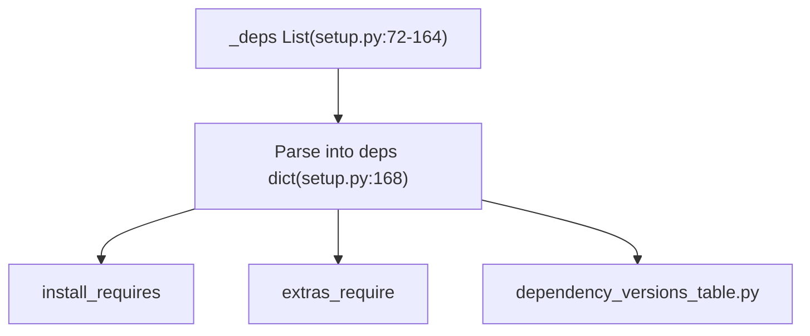
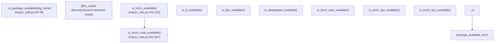
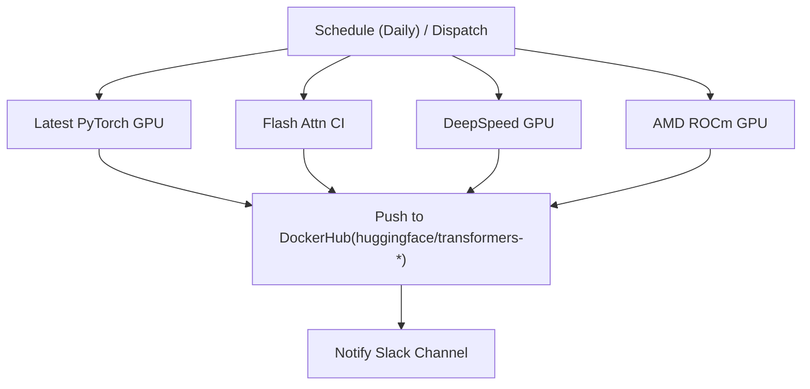

# 构建与依赖管理 (Build and Dependency Management)

相关源文件 (Relevant source files)

-   [.github/workflows/add-model-like.yml](https://github.com/huggingface/transformers/blob/9a9997fd/.github/workflows/add-model-like.yml)
-   [.github/workflows/build-docker-images.yml](https://github.com/huggingface/transformers/blob/9a9997fd/.github/workflows/build-docker-images.yml)
-   [.github/workflows/build-nightly-ci-docker-images.yml](https://github.com/huggingface/transformers/blob/9a9997fd/.github/workflows/build-nightly-ci-docker-images.yml)
-   [.github/workflows/build-past-ci-docker-images.yml](https://github.com/huggingface/transformers/blob/9a9997fd/.github/workflows/build-past-ci-docker-images.yml)
-   [.github/workflows/check\_tiny\_models.yml](https://github.com/huggingface/transformers/blob/9a9997fd/.github/workflows/check_tiny_models.yml)
-   [.github/workflows/doctest\_job.yml](https://github.com/huggingface/transformers/blob/9a9997fd/.github/workflows/doctest_job.yml)
-   [.github/workflows/doctests.yml](https://github.com/huggingface/transformers/blob/9a9997fd/.github/workflows/doctests.yml)
-   [.github/workflows/release-conda.yml](https://github.com/huggingface/transformers/blob/9a9997fd/.github/workflows/release-conda.yml)
-   [.github/workflows/self-nightly-caller.yml](https://github.com/huggingface/transformers/blob/9a9997fd/.github/workflows/self-nightly-caller.yml)
-   [.github/workflows/self-scheduled-amd-mi250-caller.yml](https://github.com/huggingface/transformers/blob/9a9997fd/.github/workflows/self-scheduled-amd-mi250-caller.yml)
-   [.github/workflows/self-scheduled-amd-mi325-caller.yml](https://github.com/huggingface/transformers/blob/9a9997fd/.github/workflows/self-scheduled-amd-mi325-caller.yml)
-   [.github/workflows/self-scheduled-amd-mi355-caller.yml](https://github.com/huggingface/transformers/blob/9a9997fd/.github/workflows/self-scheduled-amd-mi355-caller.yml)
-   [.github/workflows/stale.yml](https://github.com/huggingface/transformers/blob/9a9997fd/.github/workflows/stale.yml)
-   [.github/workflows/update\_metdata.yml](https://github.com/huggingface/transformers/blob/9a9997fd/.github/workflows/update_metdata.yml)
-   [docker/consistency.dockerfile](https://github.com/huggingface/transformers/blob/9a9997fd/docker/consistency.dockerfile)
-   [docker/custom-tokenizers.dockerfile](https://github.com/huggingface/transformers/blob/9a9997fd/docker/custom-tokenizers.dockerfile)
-   [docker/examples-torch.dockerfile](https://github.com/huggingface/transformers/blob/9a9997fd/docker/examples-torch.dockerfile)
-   [docker/exotic-models.dockerfile](https://github.com/huggingface/transformers/blob/9a9997fd/docker/exotic-models.dockerfile)
-   [docker/pipeline-torch.dockerfile](https://github.com/huggingface/transformers/blob/9a9997fd/docker/pipeline-torch.dockerfile)
-   [docker/quality.dockerfile](https://github.com/huggingface/transformers/blob/9a9997fd/docker/quality.dockerfile)
-   [docker/torch-light.dockerfile](https://github.com/huggingface/transformers/blob/9a9997fd/docker/torch-light.dockerfile)
-   [docker/transformers-all-latest-gpu/Dockerfile](https://github.com/huggingface/transformers/blob/9a9997fd/docker/transformers-all-latest-gpu/Dockerfile)
-   [docker/transformers-pytorch-amd-gpu/Dockerfile](https://github.com/huggingface/transformers/blob/9a9997fd/docker/transformers-pytorch-amd-gpu/Dockerfile)
-   [docker/transformers-pytorch-deepspeed-amd-gpu/Dockerfile](https://github.com/huggingface/transformers/blob/9a9997fd/docker/transformers-pytorch-deepspeed-amd-gpu/Dockerfile)
-   [docker/transformers-pytorch-deepspeed-latest-gpu/Dockerfile](https://github.com/huggingface/transformers/blob/9a9997fd/docker/transformers-pytorch-deepspeed-latest-gpu/Dockerfile)
-   [docker/transformers-pytorch-deepspeed-nightly-gpu/Dockerfile](https://github.com/huggingface/transformers/blob/9a9997fd/docker/transformers-pytorch-deepspeed-nightly-gpu/Dockerfile)
-   [docker/transformers-pytorch-gpu/Dockerfile](https://github.com/huggingface/transformers/blob/9a9997fd/docker/transformers-pytorch-gpu/Dockerfile)
-   [docker/transformers-quantization-latest-gpu/Dockerfile](https://github.com/huggingface/transformers/blob/9a9997fd/docker/transformers-quantization-latest-gpu/Dockerfile)
-   [pyproject.toml](https://github.com/huggingface/transformers/blob/9a9997fd/pyproject.toml)

本页面记录了 `transformers` 库如何管理其 构建配置 (Build configuration)、依赖项和安装选项。这包括 `setup.py` 配置、依赖版本控制、针对不同后端的 可选额外项 (Optional extras)，以及用于 持续集成 (Continuous Integration, CI) 的 Docker 基础设施。

---

## 概述 (Overview)

`transformers` 库使用一个集中式依赖管理系统，该系统：

-   定义了所有安装所需的 **核心依赖 (Core dependencies)**。
-   指定了针对特定后端（PyTorch、TensorFlow、Flax）、模态（视觉、音频、视频）和集成（DeepSpeed、Accelerate）的 **可选额外项 (Optional extras)**。
-   维护一个 **版本表 (Version table)**，用于在整个代码库和文档中保持一致的依赖跟踪。
-   提供 **运行时检查 (Runtime checks)** 以检测可用的后端和硬件。
-   编排 **Docker 镜像 (Docker images)**，用于在多种环境（NVIDIA GPU、AMD ROCm、量化、DeepSpeed）中进行测试。

---

## 安装配置 (Setup Configuration)

### 包元数据与构建系统 (Package Metadata and Build System)

主要构建配置在 `setup.py` 中定义，使用标准的 Python 打包工具。该库支持 **Python 3.10 至 3.14** [setup.py50-51](https://github.com/huggingface/transformers/blob/9a9997fd/setup.py#L50-L51)

```mermaid
flowchart TD
    setup_py["setup.pyBuild Configuration"]
    deps_dict["_deps ListAll dependency specs"]
    extras_dict["extras DictionaryOptional feature groups"]
    install_requires["install_requiresCore dependencies"]
    torch["extras['torch']"]
    vision["extras['vision']"]
    audio["extras['audio']"]
    testing["extras['testing']"]
    dev["extras['dev']"]

    setup --> py_deps_dict
    deps --> dict_extras_dict
    deps --> dict_install_requires
    extras --> dict_torch
    extras --> dict_vision
    extras --> dict_audio
    extras --> dict_testing
    extras --> dict_dev
```

`python_requires` 约束是动态生成的，以匹配受支持的范围 [setup.py315-322](https://github.com/huggingface/transformers/blob/9a9997fd/setup.py#L315-L322)。包元数据，包括名称、版本和 入口点 (Entry points)（如 `transformers-cli`），被传递给 `setuptools.setup()` [setup.py324-344](https://github.com/huggingface/transformers/blob/9a9997fd/setup.py#L324-L344)。

**来源 (Sources):** [setup.py50-51](https://github.com/huggingface/transformers/blob/9a9997fd/setup.py#L50-L51) [setup.py315-344](https://github.com/huggingface/transformers/blob/9a9997fd/setup.py#L315-L344)

---

## 依赖规范 (Dependency Specification)

### 集中式依赖列表 (Centralized Dependency List)

所有依赖项都在 `setup.py` 中的 `_deps` 列表中定义 [setup.py72-164](https://github.com/huggingface/transformers/blob/9a9997fd/setup.py#L72-L164)。此列表充当版本约束的单一 真实源 (Single source of truth)。

`_deps` 列表包含如下条目：

-   `"torch>=2.4"`: 最低 PyTorch 版本 [setup.py155](https://github.com/huggingface/transformers/blob/9a9997fd/setup.py#L155-L155)
-   `"tokenizers>=0.22.0,<=0.23.0"`: 针对基于 Rust 的分词器后端的版本固定 [setup.py154](https://github.com/huggingface/transformers/blob/9a9997fd/setup.py#L154-L154)
-   `"huggingface-hub>=1.3.0,<2.0"`: 与 Model Hub 的集成 [setup.py108](https://github.com/huggingface/transformers/blob/9a9997fd/setup.py#L108-L108)

**来源 (Sources):** [setup.py72-168](https://github.com/huggingface/transformers/blob/9a9997fd/setup.py#L72-L168) [setup.py108](https://github.com/huggingface/transformers/blob/9a9997fd/setup.py#L108-L108) [setup.py154-155](https://github.com/huggingface/transformers/blob/9a9997fd/setup.py#L154-L155)

### 核心依赖 (Core Dependencies)

**核心依赖 (Core dependencies)**（默认安装）是库的基本功能（如配置加载和基础分词）所需的依赖项 [setup.py263-273](https://github.com/huggingface/transformers/blob/9a9997fd/setup.py#L263-L273)。

| 包 (Package) | 版本 (Version) | 目的 (Purpose) |
| --- | --- | --- |
| `huggingface-hub` | `>=1.3.0,<2.0` | 模型/数据集下载和 Hub API |
| `numpy` | `>=1.17` | 数值运算 |
| `packaging` | `>=20.0` | 版本比较 |
| `pyyaml` | `>=5.1` | YAML 配置解析 |
| `regex` | `>=2025.10.22` | 用于分词器的高级正则 |
| `tokenizers` | `>=0.22.0,<=0.23.0` | 快速分词执行 |
| `safetensors` | `>=0.4.3` | 安全且快速的权重加载 |
| `tqdm` | `>=4.27` | 进度条 |

**来源 (Sources):** [setup.py263-273](https://github.com/huggingface/transformers/blob/9a9997fd/setup.py#L263-L273)

---

## 可选额外项与后端管理 (Optional Extras and Backend Management)

### 功能组 (Feature Groups)

可选依赖项被组织成 `extras`，允许用户仅安装他们需要的部分 [setup.py175-260](https://github.com/huggingface/transformers/blob/9a9997fd/setup.py#L175-L260)。

-   **框架 (Frameworks)**: `torch`（包括 `accelerate`）、`tf` (TensorFlow)、`flax`。
-   **模态 (Modalities)**: `vision` (`Pillow`、`torchvision`)、`audio` (`librosa`、`phonemizer`)、`video` (`av`)。
-   **集成 (Integrations)**: `deepspeed`、`accelerate`、`onnxruntime`、`peft`。
-   **服务 (Serving)**: `serving`（包括 `fastapi`、`uvicorn`、`openai`）。
-   **开发 (Development)**: `testing`、`quality`（包括 `ruff`）、`dev`（安装几乎所有内容）。

### 依赖版本表 (Dependency Version Table)

为了确保一致性，来自 `setup.py` 的 `_deps` 列表被镜像到一个静态文件中：`src/transformers/dependency_versions_table.py` [src/transformers/dependency\_versions\_table.py1-94](https://github.com/huggingface/transformers/blob/9a9997fd/src/transformers/dependency_versions_table.py#L1-L94)。此文件通过运行 `make fix-repo` 或 `python setup.py deps_table_update` 自动生成，后者会调用 `DepsTableUpdateCommand` [setup.py276-312](https://github.com/huggingface/transformers/blob/9a9997fd/setup.py#L276-L312)。

**来源 (Sources):** [setup.py175-260](https://github.com/huggingface/transformers/blob/9a9997fd/setup.py#L175-L260) [setup.py276-312](https://github.com/huggingface/transformers/blob/9a9997fd/setup.py#L276-L312) [src/transformers/dependency\_versions\_table.py1-94](https://github.com/huggingface/transformers/blob/9a9997fd/src/transformers/dependency_versions_table.py#L1-L94)

---

## 运行时依赖检测 (Runtime Dependency Detection)

该库使用 `import_utils.py` 在运行时检测可用的后端，而不会触发昂贵的导入。

### 检测架构 (Detection Architecture)

`_is_package_available` 函数使用 `importlib.util.find_spec` 来检查包是否存在 [src/transformers/utils/import\_utils.py48-78](https://github.com/huggingface/transformers/blob/9a9997fd/src/transformers/utils/import_utils.py#L48-L78)。结果使用 `@lru_cache` 缓存以确保性能。还提供了硬件特定的检查（CUDA、MPS、NPU、XPU），用于控制模型放置和 内核 (Kernel) 选择 [src/transformers/utils/import\_utils.py202-320](https://github.com/huggingface/transformers/blob/9a9997fd/src/transformers/utils/import_utils.py#L202-L320)。

**来源 (Sources):** [src/transformers/utils/import\_utils.py48-78](https://github.com/huggingface/transformers/blob/9a9997fd/src/transformers/utils/import_utils.py#L48-L78) [src/transformers/utils/import\_utils.py142-150](https://github.com/huggingface/transformers/blob/9a9997fd/src/transformers/utils/import_utils.py#L142-L150) [src/transformers/utils/import\_utils.py202-320](https://github.com/huggingface/transformers/blob/9a9997fd/src/transformers/utils/import_utils.py#L202-L320)

---

## 用于 CI 的 Docker 基础设施 (Docker Infrastructure for CI)

该库维护了多个 Dockerfile，以为 CI/CD 提供可复现的环境，测试各种硬件和软件配置。

### 1\. All-Latest-GPU (NVIDIA)

这是在 NVIDIA 硬件上测试最新功能的主要镜像。

-   **基础镜像 (Base)**: `nvidia/cuda:12.6.0-cudnn-devel-ubuntu22.04` [docker/transformers-all-latest-gpu/Dockerfile1](https://github.com/huggingface/transformers/blob/9a9997fd/docker/transformers-all-latest-gpu/Dockerfile#L1-L1)
-   **关键组件**: 安装 PyTorch（通常是 nightly 或最新稳定版）、`accelerate`、`peft`、`optimum`、`bitsandbytes` 和 `flash-attn` [docker/transformers-all-latest-gpu/Dockerfile49-95](https://github.com/huggingface/transformers/blob/9a9997fd/docker/transformers-all-latest-gpu/Dockerfile#L49-L95)
-   **构建逻辑**: 它支持有条件地安装 Flash Attention 2，并处理 `ninja` 以避免特定测试中的 CUDA 内存错误 [docker/transformers-all-latest-gpu/Dockerfile95-100](https://github.com/huggingface/transformers/blob/9a9997fd/docker/transformers-all-latest-gpu/Dockerfile#L95-L100)。

### 2\. 量化镜像 (Quantization Image)

专门用于测试 `transformers` 支持的广泛量化后端。

-   **后端 (Backends)**: 安装 `bitsandbytes`、`hqq`、`gguf`、`optimum-quanto`、`compressed-tensors`、`auto-round` 和 `torchao` [docker/transformers-quantization-latest-gpu/Dockerfile41-65](https://github.com/huggingface/transformers/blob/9a9997fd/docker/transformers-quantization-latest-gpu/Dockerfile#L41-L65)
-   **最近添加**: 包括 `fouroversix` 和 `fp-quant` [docker/transformers-quantization-latest-gpu/Dockerfile82-85](https://github.com/huggingface/transformers/blob/9a9997fd/docker/transformers-quantization-latest-gpu/Dockerfile#L82-L85)。

### 3\. DeepSpeed 镜像 (DeepSpeed Image)

为分布式训练测试而优化。

-   **基础镜像 (Base)**: `nvcr.io/nvidia/pytorch:24.08-py3` [docker/transformers-pytorch-deepspeed-latest-gpu2](https://github.com/huggingface/transformers/blob/9a9997fd/docker/transformers-pytorch-deepspeed-latest-gpu#L2-L2)
-   **优化**: 预编译 DeepSpeed C++/CUDA 算子 (Ops) (`DS_BUILD_CPU_ADAM=1`、`DS_BUILD_FUSED_ADAM=1`) 以防止第一次测试运行时发生超时 [docker/transformers-pytorch-deepspeed-latest-gpu/Dockerfile46](https://github.com/huggingface/transformers/blob/9a9997fd/docker/transformers-pytorch-deepspeed-latest-gpu/Dockerfile#L46-L46)。

### 4\. AMD ROCm 镜像 (AMD ROCm Image)

为 AMD GPU 提供测试。

-   **基础镜像 (Base)**: `rocm/pytorch:rocm7.1_ubuntu22.04_py3.10_pytorch_release_2.8.0` [docker/transformers-pytorch-amd-gpu/Dockerfile1](https://github.com/huggingface/transformers/blob/9a9997fd/docker/transformers-pytorch-amd-gpu/Dockerfile#L1-L1)
-   **细节**: 卸载了 `pynvml` 和 `apex` 等 NVIDIA 特定库 [docker/transformers-pytorch-amd-gpu/Dockerfile31](https://github.com/huggingface/transformers/blob/9a9997fd/docker/transformers-pytorch-amd-gpu/Dockerfile#L31-L31)。它从源代码构建 AMD 兼容的 Flash Attention [docker/transformers-pytorch-amd-gpu/Dockerfile41-44](https://github.com/huggingface/transformers/blob/9a9997fd/docker/transformers-pytorch-amd-gpu/Dockerfile#L41-L44)。

**来源 (Sources):** [docker/transformers-all-latest-gpu/Dockerfile1-100](https://github.com/huggingface/transformers/blob/9a9997fd/docker/transformers-all-latest-gpu/Dockerfile#L1-L100) [docker/transformers-quantization-latest-gpu/Dockerfile41-85](https://github.com/huggingface/transformers/blob/9a9997fd/docker/transformers-quantization-latest-gpu/Dockerfile#L41-L85) [docker/transformers-pytorch-deepspeed-latest-gpu/Dockerfile2-46](https://github.com/huggingface/transformers/blob/9a9997fd/docker/transformers-pytorch-deepspeed-latest-gpu/Dockerfile#L2-L46) [docker/transformers-pytorch-amd-gpu/Dockerfile1-44](https://github.com/huggingface/transformers/blob/9a9997fd/docker/transformers-pytorch-amd-gpu/Dockerfile#L1-L44)

---

## CI 构建编排 (CI Build Orchestration)

Docker 镜像通过 GitHub Actions 定期工作流构建并推送到 DockerHub [.github/workflows/build-docker-images.yml1-15](https://github.com/huggingface/transformers/blob/9a9997fd/ .github/workflows/build-docker-images.yml#L1-L15)。

工作流使用 `docker/build-push-action` 并传递构建参数如 `REF=main`，以确保镜像包含来自仓库的最新代码 [.github/workflows/build-docker-images.yml43-47](https://github.com/huggingface/transformers/blob/9a9997fd/ .github/workflows/build-docker-images.yml#L43-L47)。对于 AMD 镜像，一个专门的缓存步骤会拉取并将镜像保存到持久挂载点，以加速后续的 CI 运行 [.github/workflows/build-docker-images.yml203-224](https://github.com/huggingface/transformers/blob/9a9997fd/ .github/workflows/build-docker-images.yml#L203-L224)。

**来源 (Sources):** [.github/workflows/build-docker-images.yml1-15](https://github.com/huggingface/transformers/blob/9a9997fd/ .github/workflows/build-docker-images.yml#L1-L15) [.github/workflows/build-docker-images.yml43-47](https://github.com/huggingface/transformers/blob/9a9997fd/ .github/workflows/build-docker-images.yml#L43-L47) [.github/workflows/build-docker-images.yml203-224](https://github.com/huggingface/transformers/blob/9a9997fd/ .github/workflows/build-docker-images.yml#L203-L224)
