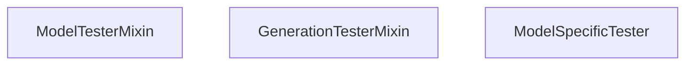

# 测试基础设施 (Testing Infrastructure)

相关源文件 (Relevant source files)

-   [.circleci/config.yml](https://github.com/huggingface/transformers/blob/9a9997fd/.circleci/config.yml)
-   [.circleci/create\_circleci\_config.py](https://github.com/huggingface/transformers/blob/9a9997fd/.circleci/create_circleci_config.py)
-   [conftest.py](https://github.com/huggingface/transformers/blob/9a9997fd/conftest.py)
-   [docs/source/en/main\_classes/quantization.md](https://github.com/huggingface/transformers/blob/9a9997fd/docs/source/en/main_classes/quantization.md?plain=1)
-   [docs/source/en/model\_doc/t5gemma.md](https://github.com/huggingface/transformers/blob/9a9997fd/docs/source/en/model_doc/t5gemma.md?plain=1)
-   [docs/source/en/quantization/overview.md](https://github.com/huggingface/transformers/blob/9a9997fd/docs/source/en/quantization/overview.md?plain=1)
-   [setup.py](https://github.com/huggingface/transformers/blob/9a9997fd/setup.py)
-   [src/transformers/conversion\_mapping.py](https://github.com/huggingface/transformers/blob/9a9997fd/src/transformers/conversion_mapping.py)
-   [src/transformers/core\_model\_loading.py](https://github.com/huggingface/transformers/blob/9a9997fd/src/transformers/core_model_loading.py)
-   [src/transformers/dependency\_versions\_table.py](https://github.com/huggingface/transformers/blob/9a9997fd/src/transformers/dependency_versions_table.py)
-   [src/transformers/integrations/\_\_init\_\_.py](https://github.com/huggingface/transformers/blob/9a9997fd/src/transformers/integrations/__init__.py)
-   [src/transformers/integrations/accelerate.py](https://github.com/huggingface/transformers/blob/9a9997fd/src/transformers/integrations/accelerate.py)
-   [src/transformers/integrations/peft.py](https://github.com/huggingface/transformers/blob/9a9997fd/src/transformers/integrations/peft.py)
-   [src/transformers/modeling\_utils.py](https://github.com/huggingface/transformers/blob/9a9997fd/src/transformers/modeling_utils.py)
-   [src/transformers/models/dia/configuration\_dia.py](https://github.com/huggingface/transformers/blob/9a9997fd/src/transformers/models/dia/configuration_dia.py)
-   [src/transformers/models/pi0/modular\_pi0.py](https://github.com/huggingface/transformers/blob/9a9997fd/src/transformers/models/pi0/modular_pi0.py)
-   [src/transformers/models/t5gemma/configuration\_t5gemma.py](https://github.com/huggingface/transformers/blob/9a9997fd/src/transformers/models/t5gemma/configuration_t5gemma.py)
-   [src/transformers/models/t5gemma/modeling\_t5gemma.py](https://github.com/huggingface/transformers/blob/9a9997fd/src/transformers/models/t5gemma/modeling_t5gemma.py)
-   [src/transformers/models/t5gemma/modular\_t5gemma.py](https://github.com/huggingface/transformers/blob/9a9997fd/src/transformers/models/t5gemma/modular_t5gemma.py)
-   [src/transformers/models/t5gemma2/configuration\_t5gemma2.py](https://github.com/huggingface/transformers/blob/9a9997fd/src/transformers/models/t5gemma2/configuration_t5gemma2.py)
-   [src/transformers/models/t5gemma2/modeling\_t5gemma2.py](https://github.com/huggingface/transformers/blob/9a9997fd/src/transformers/models/t5gemma2/modeling_t5gemma2.py)
-   [src/transformers/models/t5gemma2/modular\_t5gemma2.py](https://github.com/huggingface/transformers/blob/9a9997fd/src/transformers/models/t5gemma2/modular_t5gemma2.py)
-   [src/transformers/quantizers/auto.py](https://github.com/huggingface/transformers/blob/9a9997fd/src/transformers/quantizers/auto.py)
-   [src/transformers/testing\_utils.py](https://github.com/huggingface/transformers/blob/9a9997fd/src/transformers/testing_utils.py)
-   [src/transformers/trainer.py](https://github.com/huggingface/transformers/blob/9a9997fd/src/transformers/trainer.py)
-   [src/transformers/trainer\_utils.py](https://github.com/huggingface/transformers/blob/9a9997fd/src/transformers/trainer_utils.py)
-   [src/transformers/training\_args.py](https://github.com/huggingface/transformers/blob/9a9997fd/src/transformers/training_args.py)
-   [src/transformers/utils/\_\_init\_\_.py](https://github.com/huggingface/transformers/blob/9a9997fd/src/transformers/utils/__init__.py)
-   [src/transformers/utils/import\_utils.py](https://github.com/huggingface/transformers/blob/9a9997fd/src/transformers/utils/import_utils.py)
-   [src/transformers/utils/loading\_report.py](https://github.com/huggingface/transformers/blob/9a9997fd/src/transformers/utils/loading_report.py)
-   [src/transformers/utils/network\_logging.py](https://github.com/huggingface/transformers/blob/9a9997fd/src/transformers/utils/network_logging.py)
-   [src/transformers/utils/quantization\_config.py](https://github.com/huggingface/transformers/blob/9a9997fd/src/transformers/utils/quantization_config.py)
-   [tests/models/csm/test\_modeling\_csm.py](https://github.com/huggingface/transformers/blob/9a9997fd/tests/models/csm/test_modeling_csm.py)
-   [tests/models/dia/test\_modeling\_dia.py](https://github.com/huggingface/transformers/blob/9a9997fd/tests/models/dia/test_modeling_dia.py)
-   [tests/models/glm\_ocr/test\_modeling\_glm\_ocr.py](https://github.com/huggingface/transformers/blob/9a9997fd/tests/models/glm_ocr/test_modeling_glm_ocr.py)
-   [tests/models/t5gemma/test\_modeling\_t5gemma.py](https://github.com/huggingface/transformers/blob/9a9997fd/tests/models/t5gemma/test_modeling_t5gemma.py)
-   [tests/models/t5gemma2/test\_modeling\_t5gemma2.py](https://github.com/huggingface/transformers/blob/9a9997fd/tests/models/t5gemma2/test_modeling_t5gemma2.py)
-   [tests/peft\_integration/test\_peft\_integration.py](https://github.com/huggingface/transformers/blob/9a9997fd/tests/peft_integration/test_peft_integration.py)
-   [tests/repo\_utils/test\_mlinter.py](https://github.com/huggingface/transformers/blob/9a9997fd/tests/repo_utils/test_mlinter.py)
-   [tests/repo\_utils/test\_tests\_fetcher.py](https://github.com/huggingface/transformers/blob/9a9997fd/tests/repo_utils/test_tests_fetcher.py)
-   [tests/test\_modeling\_common.py](https://github.com/huggingface/transformers/blob/9a9997fd/tests/test_modeling_common.py)
-   [tests/trainer/test\_trainer.py](https://github.com/huggingface/transformers/blob/9a9997fd/tests/trainer/test_trainer.py)
-   [tests/utils/test\_core\_model\_loading.py](https://github.com/huggingface/transformers/blob/9a9997fd/tests/utils/test_core_model_loading.py)
-   [tests/utils/test\_modeling\_utils.py](https://github.com/huggingface/transformers/blob/9a9997fd/tests/utils/test_modeling_utils.py)
-   [tests/utils/test\_network\_logging.py](https://github.com/huggingface/transformers/blob/9a9997fd/tests/utils/test_network_logging.py)
-   [utils/check\_config\_attributes.py](https://github.com/huggingface/transformers/blob/9a9997fd/utils/check_config_attributes.py)
-   [utils/check\_modeling\_structure.py](https://github.com/huggingface/transformers/blob/9a9997fd/utils/check_modeling_structure.py)
-   [utils/mlinter/README.md](https://github.com/huggingface/transformers/blob/9a9997fd/utils/mlinter/README.md?plain=1)
-   [utils/mlinter/\_\_init\_\_.py](https://github.com/huggingface/transformers/blob/9a9997fd/utils/mlinter/__init__.py)
-   [utils/mlinter/\_\_main\_\_.py](https://github.com/huggingface/transformers/blob/9a9997fd/utils/mlinter/__main__.py)
-   [utils/mlinter/\_helpers.py](https://github.com/huggingface/transformers/blob/9a9997fd/utils/mlinter/_helpers.py)
-   [utils/mlinter/mlinter.py](https://github.com/huggingface/transformers/blob/9a9997fd/utils/mlinter/mlinter.py)
-   [utils/mlinter/rules.toml](https://github.com/huggingface/transformers/blob/9a9997fd/utils/mlinter/rules.toml)
-   [utils/not\_doctested.txt](https://github.com/huggingface/transformers/blob/9a9997fd/utils/not_doctested.txt)
-   [utils/tests\_fetcher.py](https://github.com/huggingface/transformers/blob/9a9997fd/utils/tests_fetcher.py)

## 目的与范围 (Purpose and Scope)

测试基础设施为 Transformers 库提供了跨 400 多个模型架构、多种硬件配置（NVIDIA/AMD GPU、CPU、NPU、XPU）以及不同执行模式（单 GPU、多 GPU、量化、分布式训练）的全面验证。本页面记录了测试组织方式、用于模型和分词器验证的基础 混入类 (Mixins)、针对硬件要求的 标记 (Markers) 以及 `mlinter` 静态分析工具。

---

## 测试文件组织与结构 (Test File Organization and Structure)

测试在 `tests/` 目录中按层次组织，以确保模块化和易于发现：

| 目录模式 (Directory Pattern) | 目的 (Purpose) | 示例 (Example) |
| --- | --- | --- |
| `tests/models/{model_name}/` | 模型特定测试 | `tests/models/bert/`, `tests/models/llama/` [tests/models/t5gemma/test\_modeling\_t5gemma.py1-20](https://github.com/huggingface/transformers/blob/9a9997fd/tests/models/t5gemma/test_modeling_t5gemma.py#L1-L20) |
| `tests/tokenization/` | 分词器测试 | 跨模型分词验证 |
| `tests/pipelines/` | 流水线 API 测试 | 端到端推理工作流 |
| `tests/generation/` | 生成系统测试 | 自回归解码、采样 [tests/test\_modeling\_common.py118](https://github.com/huggingface/transformers/blob/9a9997fd/tests/test_modeling_common.py#L118-L118) |
| `tests/trainer/` | 训练基础设施 | 训练器、分布式策略 [tests/trainer/test\_trainer.py15-18](https://github.com/huggingface/transformers/blob/9a9997fd/tests/trainer/test_trainer.py#L15-L18) |
| `tests/quantization/` | 量化测试 | AWQ、GPTQ、bitsandbytes 验证 |

**来源 (Sources):** [tests/models/t5gemma/test\_modeling\_t5gemma.py1-20](https://github.com/huggingface/transformers/blob/9a9997fd/tests/models/t5gemma/test_modeling_t5gemma.py#L1-L20) [tests/trainer/test\_trainer.py15-18](https://github.com/huggingface/transformers/blob/9a9997fd/tests/trainer/test_trainer.py#L15-L18) [tests/test\_modeling\_common.py118](https://github.com/huggingface/transformers/blob/9a9997fd/tests/test_modeling_common.py#L118-L118)

---

## 测试混入类与通用逻辑 (Test Mixins and Common Logic)

为了在数百个模型中保持一致性，Transformers 使用了基于 Mixin 的架构。这些混入类提供了一套标准的测试电池，每个模型或分词器都必须通过。

### ModelTesterMixin

`ModelTesterMixin`（及其派生类如 `GenerationTesterMixin`）为 PyTorch 模型定义了标准测试 [tests/test\_modeling\_common.py118](https://github.com/huggingface/transformers/blob/9a9997fd/tests/test_modeling_common.py#L118-L118)。

关键验证逻辑包括：

-   **前向传递一致性 (Forward Pass Consistency)**: 确保 `eager` 模式与 `SDPA` (Scaled Dot Product Attention) 输出匹配 [tests/test\_modeling\_common.py155-210](https://github.com/huggingface/transformers/blob/9a9997fd/tests/test_modeling_common.py#L155-L210)。
-   **权重初始化 (Weight Initialization)**: 检查权重是否根据模型的 `_init_weights` 方法进行初始化 [src/transformers/modeling\_utils.py1105-1120](https://github.com/huggingface/transformers/blob/9a9997fd/src/transformers/modeling_utils.py#L1105-L1120)。
-   **绑定权重 (Tied Weights)**: 验证绑定的嵌入（例如输入和输出嵌入）共享相同的内存存储 [src/transformers/modeling\_utils.py1124-1140](https://github.com/huggingface/transformers/blob/9a9997fd/src/transformers/modeling_utils.py#L1124-L1140)。

**来源 (Sources):** [tests/test\_modeling\_common.py118](https://github.com/huggingface/transformers/blob/9a9997fd/tests/test_modeling_common.py#L118-L118) [tests/test\_modeling\_common.py155-210](https://github.com/huggingface/transformers/blob/9a9997fd/tests/test_modeling_common.py#L155-L210) [src/transformers/modeling\_utils.py1105-1140](https://github.com/huggingface/transformers/blob/9a9997fd/src/transformers/modeling_utils.py#L1105-L1140)

---

## 测试标记与硬件要求 (Test Markers and Hardware Requirements)

Transformers 使用 `pytest` 标记来根据硬件可用性和执行速度来过滤测试。这些在 `src/transformers/testing_utils.py` 中定义和检查。

### 常见硬件标记 (Common Hardware Markers)

| 标记 (Marker) | 实用函数 (Utility Function) | 要求 (Requirement) |
| --- | --- | --- |
| `@slow` | `slow` | 仅在设置 `RUN_SLOW=1` 时运行 [tests/test\_modeling\_common.py105](https://github.com/huggingface/transformers/blob/9a9997fd/tests/test_modeling_common.py#L105-L105) |
| `@require_torch` | `require_torch` | 需要安装 PyTorch [src/transformers/testing\_utils.py151](https://github.com/huggingface/transformers/blob/9a9997fd/src/transformers/testing_utils.py#L151-L151) |
| `@require_flash_attn` | `require_flash_attn` | 需要 `flash_attn` 库 [tests/test\_modeling\_common.py90](https://github.com/huggingface/transformers/blob/9a9997fd/tests/test_modeling_common.py#L90-L90) |
| `@require_accelerate` | `require_accelerate` | 需要 `accelerate` 库 [tests/test\_modeling\_common.py87](https://github.com/huggingface/transformers/blob/9a9997fd/tests/test_modeling_common.py#L87-L87) |
| `@require_bitsandbytes` | `require_bitsandbytes` | 需要用于量化的 `bitsandbytes` [tests/test\_modeling\_common.py88](https://github.com/huggingface/transformers/blob/9a9997fd/tests/test_modeling_common.py#L88-L88) |

### GPU 与多加速器逻辑 (GPU and Multi-Accelerator Logic)

基础设施通过 `IS_CUDA_SYSTEM`、`IS_ROCM_SYSTEM`、`IS_XPU_SYSTEM` 和 `IS_NPU_SYSTEM` 来区分不同的后端类型 [src/transformers/testing\_utils.py235-238](https://github.com/huggingface/transformers/blob/9a9997fd/src/transformers/testing_utils.py#L235-L238)。

需要特定加速器数量的测试使用：

-   `require_torch_multi_gpu`: 检查是否有 >1 个 CUDA 设备 [tests/test\_modeling\_common.py100](https://github.com/huggingface/transformers/blob/9a9997fd/tests/test_modeling_common.py#L100-L100)。
-   `require_torch_accelerator`: 对任何受支持的加速器（CUDA、XPU、NPU、MLU、MUSA）的通用检查 [tests/trainer/test\_trainer.py62](https://github.com/huggingface/transformers/blob/9a9997fd/tests/trainer/test_trainer.py#L62-L62)。

**来源 (Sources):** [src/transformers/testing\_utils.py235-238](https://github.com/huggingface/transformers/blob/9a9997fd/src/transformers/testing_utils.py#L235-L238) [tests/test\_modeling\_common.py87-100](https://github.com/huggingface/transformers/blob/9a9997fd/tests/test_modeling_common.py#L87-L100) [tests/trainer/test\_trainer.py61-68](https://github.com/huggingface/transformers/blob/9a9997fd/tests/trainer/test_trainer.py#L61-L68)

---

## 集成与训练测试 (Integration and Training Tests)

### 训练器集成 (Trainer Integration)

`Trainer` 会在可复现性、梯度累积和混合精度 (FP16/BF16/TF32) 方面进行测试 [tests/trainer/test\_trainer.py15-18](https://github.com/huggingface/transformers/blob/9a9997fd/tests/trainer/test_trainer.py#L15-L18)。

> **[Mermaid sequence]**
> *(图表结构无法解析)*

-   **梯度累积 (Gradient Accumulation)**: 通过确保 `gradient_accumulation_steps=2` 且批量大小减半时产生的 损失 (Loss) 与完整批量大小产生的一致来进行验证 [tests/trainer/test\_trainer.py165-173](https://github.com/huggingface/transformers/blob/9a9997fd/tests/trainer/test_trainer.py#L165-L173)。
-   **混合精度 (Mixed Precision)**: `test_mixed_fp16` 检查 `GradScaler` 是否能防止 梯度溢出 (Gradient overflow) [tests/trainer/test\_trainer.py114-123](https://github.com/huggingface/transformers/blob/9a9997fd/tests/trainer/test_trainer.py#L114-L123)。

**来源 (Sources):** [tests/trainer/test\_trainer.py96-141](https://github.com/huggingface/transformers/blob/9a9997fd/tests/trainer/test_trainer.py#L96-L141) [tests/trainer/test\_trainer.py165-173](https://github.com/huggingface/transformers/blob/9a9997fd/tests/trainer/test_trainer.py#L165-L173)

---

## mlinter: 建模文件的静态分析 (mlinter: Static Analysis for Modeling Files)

`mlinter` 工具（建模 Linter）是一种专门的静态分析工具，用于维护库中数百个建模文件的代码质量和一致性 [utils/mlinter/mlinter.py1-50](https://github.com/huggingface/transformers/blob/9a9997fd/utils/mlinter/mlinter.py#L1-L50)。

### 关键能力 (Key Capabilities)

1.  **导入验证 (Import Verification)**: 确保建模文件仅导入允许的依赖项，并遵循延迟加载模式。
2.  **命名规范 (Naming Conventions)**: 验证类名（例如 `{ModelName}PreTrainedModel`、`{ModelName}Model`）是否遵循库标准。
3.  **文档字符串验证 (Docstring Validation)**: 检查所需文档字符串的存在性和正确性，如 `add_start_docstrings` [src/transformers/utils/\_\_init\_\_.py36-43](https://github.com/huggingface/transformers/blob/9a9997fd/src/transformers/utils/__init__.py#L36-L43)。
4.  **模块化结构 (Modular Structure)**: 对于使用模块化系统的模型，`mlinter` 会验证生成的代码是否与 `modular_*.py` 中的模块化定义相匹配 [src/transformers/models/t5gemma/modular\_t5gemma.py1-20](https://github.com/huggingface/transformers/blob/9a9997fd/src/transformers/models/t5gemma/modular_t5gemma.py#L1-L20)。

**来源 (Sources):** [utils/mlinter/mlinter.py1-50](https://github.com/huggingface/transformers/blob/9a9997fd/utils/mlinter/mlinter.py#L1-L50) [src/transformers/utils/\_\_init\_\_.py36-43](https://github.com/huggingface/transformers/blob/9a9997fd/src/transformers/utils/__init__.py#L36-L43) [src/transformers/models/t5gemma/modular\_t5gemma.py1-20](https://github.com/huggingface/transformers/blob/9a9997fd/src/transformers/models/t5gemma/modular_t5gemma.py#L1-L20)

---

## CI/CD 与依赖管理 (CI/CD and Dependency Management)

测试基础设施依赖于严格版本化的依赖表，以确保可复现的测试环境。

### 依赖表 (Dependency Table)

`src/transformers/dependency_versions_table.py` 文件从 `setup.py` 自动生成，包含所有可选和必选依赖项的固定版本 [src/transformers/dependency\_versions\_table.py1-4](https://github.com/huggingface/transformers/blob/9a9997fd/src/transformers/dependency_versions_table.py#L1-L4)。

-   **PyTorch**: 所需版本为 `>=2.4` [src/transformers/dependency\_versions\_table.py77](https://github.com/huggingface/transformers/blob/9a9997fd/src/transformers/dependency_versions_table.py#L77-L77)。
-   **Accelerate**: 所需版本为 `>=1.1.0` [src/transformers/dependency\_versions\_table.py6](https://github.com/huggingface/transformers/blob/9a9997fd/src/transformers/dependency_versions_table.py#L6-L6)。
-   **Tokenizers**: 所需版本为 `0.22.0 到 0.23.0` [src/transformers/dependency\_versions\_table.py76](https://github.com/huggingface/transformers/blob/9a9997fd/src/transformers/dependency_versions_table.py#L76-L76)。

### CircleCI 作业生成 (CircleCI Job Generation)

脚本 `.circleci/create_circleci_config.py` 动态创建测试矩阵。它使用 `FLAKY_TEST_FAILURE_PATTERNS` 来识别瞬态故障（例如 `ConnectionError`、`Timeout`），并使用 `pytest-rerunfailures` 自动重新运行它们 [.circleci/create\_circleci\_config.py41-56](https://github.com/huggingface/transformers/blob/9a9997fd/.circleci/create_circleci_config.py#L41-L56)。

**来源 (Sources):** [src/transformers/dependency\_versions\_table.py1-94](https://github.com/huggingface/transformers/blob/9a9997fd/src/transformers/dependency_versions_table.py#L1-L94) [.circleci/create\_circleci\_config.py41-56](https://github.com/huggingface/transformers/blob/9a9997fd/.circleci/create_circleci_config.py#L41-L56)
