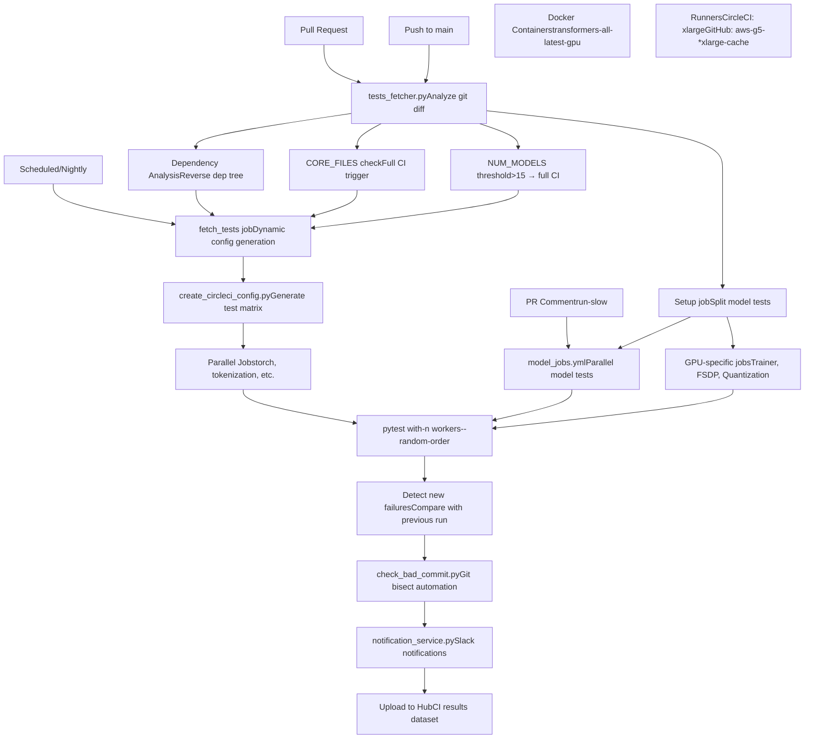
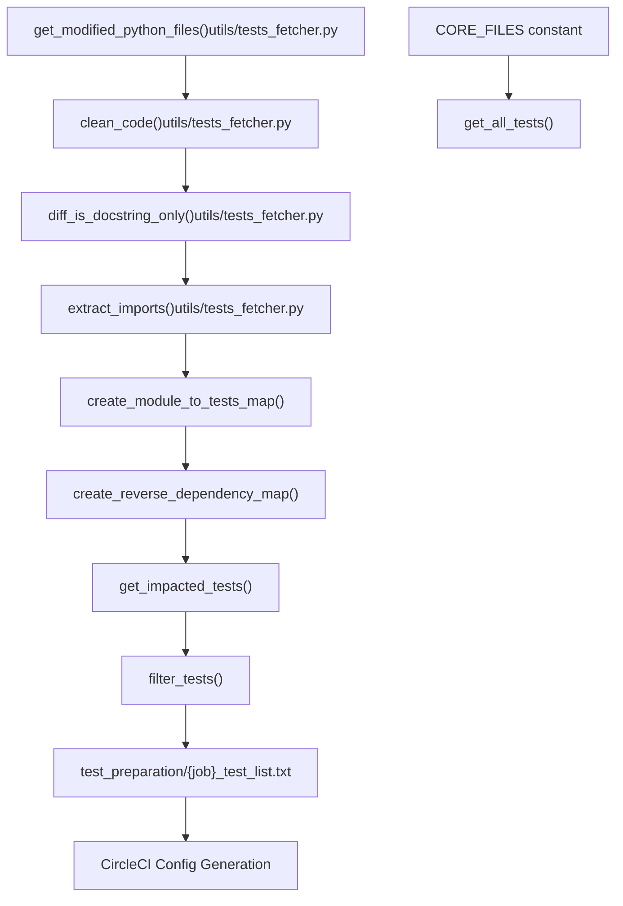
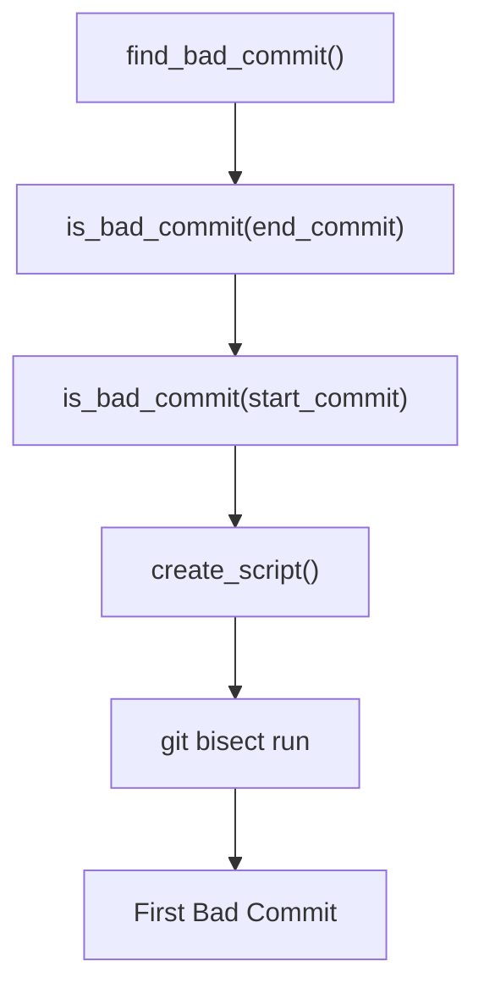

# CI/CD 流水线与测试编排 (CI/CD Pipeline and Test Orchestration)

相关源文件 (Relevant source files)

-   [.circleci/config.yml](https://github.com/huggingface/transformers/blob/9a9997fd/.circleci/config.yml)
-   [.circleci/create\_circleci\_config.py](https://github.com/huggingface/transformers/blob/9a9997fd/.circleci/create_circleci_config.py)
-   [.github/workflows/benchmark.yml](https://github.com/huggingface/transformers/blob/9a9997fd/.github/workflows/benchmark.yml)
-   [.github/workflows/benchmark\_v2.yml](https://github.com/huggingface/transformers/blob/9a9997fd/.github/workflows/benchmark_v2.yml)
-   [.github/workflows/benchmark\_v2\_a10\_caller.yml](https://github.com/huggingface/transformers/blob/9a9997fd/.github/workflows/benchmark_v2_a10_caller.yml)
-   [.github/workflows/benchmark\_v2\_mi325\_caller.yml](https://github.com/huggingface/transformers/blob/9a9997fd/.github/workflows/benchmark_v2_mi325_caller.yml)
-   [.github/workflows/check-workflow-permissions.yml](https://github.com/huggingface/transformers/blob/9a9997fd/.github/workflows/check-workflow-permissions.yml)
-   [.github/workflows/check\_failed\_tests.yml](https://github.com/huggingface/transformers/blob/9a9997fd/.github/workflows/check_failed_tests.yml)
-   [.github/workflows/get-pr-info.yml](https://github.com/huggingface/transformers/blob/9a9997fd/.github/workflows/get-pr-info.yml)
-   [.github/workflows/get-pr-number.yml](https://github.com/huggingface/transformers/blob/9a9997fd/.github/workflows/get-pr-number.yml)
-   [.github/workflows/model\_jobs.yml](https://github.com/huggingface/transformers/blob/9a9997fd/.github/workflows/model_jobs.yml)
-   [.github/workflows/new\_model\_pr\_merged\_notification.yml](https://github.com/huggingface/transformers/blob/9a9997fd/.github/workflows/new_model_pr_merged_notification.yml)
-   [.github/workflows/pr-repo-consistency-bot.yml](https://github.com/huggingface/transformers/blob/9a9997fd/.github/workflows/pr-repo-consistency-bot.yml)
-   [.github/workflows/pr\_build\_doc\_with\_comment.yml](https://github.com/huggingface/transformers/blob/9a9997fd/.github/workflows/pr_build_doc_with_comment.yml)
-   [.github/workflows/pr\_slow\_ci\_suggestion.yml](https://github.com/huggingface/transformers/blob/9a9997fd/.github/workflows/pr_slow_ci_suggestion.yml)
-   [.github/workflows/push-important-models.yml](https://github.com/huggingface/transformers/blob/9a9997fd/.github/workflows/push-important-models.yml)
-   [.github/workflows/self-comment-ci.yml](https://github.com/huggingface/transformers/blob/9a9997fd/.github/workflows/self-comment-ci.yml)
-   [.github/workflows/self-scheduled-caller.yml](https://github.com/huggingface/transformers/blob/9a9997fd/.github/workflows/self-scheduled-caller.yml)
-   [.github/workflows/self-scheduled.yml](https://github.com/huggingface/transformers/blob/9a9997fd/.github/workflows/self-scheduled.yml)
-   [.github/workflows/slack-report.yml](https://github.com/huggingface/transformers/blob/9a9997fd/.github/workflows/slack-report.yml)
-   [.github/workflows/ssh-runner.yml](https://github.com/huggingface/transformers/blob/9a9997fd/.github/workflows/ssh-runner.yml)
-   [benchmark\_v2/.gitignore](https://github.com/huggingface/transformers/blob/9a9997fd/benchmark_v2/.gitignore)
-   [benchmark\_v2/README.md](https://github.com/huggingface/transformers/blob/9a9997fd/benchmark_v2/README.md?plain=1)
-   [benchmark\_v2/framework/benchmark\_config.py](https://github.com/huggingface/transformers/blob/9a9997fd/benchmark_v2/framework/benchmark_config.py)
-   [benchmark\_v2/framework/benchmark\_runner.py](https://github.com/huggingface/transformers/blob/9a9997fd/benchmark_v2/framework/benchmark_runner.py)
-   [benchmark\_v2/framework/data\_classes.py](https://github.com/huggingface/transformers/blob/9a9997fd/benchmark_v2/framework/data_classes.py)
-   [benchmark\_v2/framework/hardware\_metrics.py](https://github.com/huggingface/transformers/blob/9a9997fd/benchmark_v2/framework/hardware_metrics.py)
-   [benchmark\_v2/requirements.txt](https://github.com/huggingface/transformers/blob/9a9997fd/benchmark_v2/requirements.txt)
-   [benchmark\_v2/run\_benchmarks.py](https://github.com/huggingface/transformers/blob/9a9997fd/benchmark_v2/run_benchmarks.py)
-   [conftest.py](https://github.com/huggingface/transformers/blob/9a9997fd/conftest.py)
-   [src/transformers/models/pi0/modular\_pi0.py](https://github.com/huggingface/transformers/blob/9a9997fd/src/transformers/models/pi0/modular_pi0.py)
-   [src/transformers/utils/network\_logging.py](https://github.com/huggingface/transformers/blob/9a9997fd/src/transformers/utils/network_logging.py)
-   [tests/repo\_utils/test\_mlinter.py](https://github.com/huggingface/transformers/blob/9a9997fd/tests/repo_utils/test_mlinter.py)
-   [tests/repo\_utils/test\_tests\_fetcher.py](https://github.com/huggingface/transformers/blob/9a9997fd/tests/repo_utils/test_tests_fetcher.py)
-   [tests/utils/test\_network\_logging.py](https://github.com/huggingface/transformers/blob/9a9997fd/tests/utils/test_network_logging.py)
-   [utils/check\_bad\_commit.py](https://github.com/huggingface/transformers/blob/9a9997fd/utils/check_bad_commit.py)
-   [utils/compare\_test\_runs.py](https://github.com/huggingface/transformers/blob/9a9997fd/utils/compare_test_runs.py)
-   [utils/get\_ci\_error\_statistics.py](https://github.com/huggingface/transformers/blob/9a9997fd/utils/get_ci_error_statistics.py)
-   [utils/get\_pr\_run\_slow\_jobs.py](https://github.com/huggingface/transformers/blob/9a9997fd/utils/get_pr_run_slow_jobs.py)
-   [utils/get\_previous\_daily\_ci.py](https://github.com/huggingface/transformers/blob/9a9997fd/utils/get_previous_daily_ci.py)
-   [utils/important\_models.txt](https://github.com/huggingface/transformers/blob/9a9997fd/utils/important_models.txt)
-   [utils/mlinter/README.md](https://github.com/huggingface/transformers/blob/9a9997fd/utils/mlinter/README.md?plain=1)
-   [utils/mlinter/\_\_init\_\_.py](https://github.com/huggingface/transformers/blob/9a9997fd/utils/mlinter/__init__.py)
-   [utils/mlinter/\_\_main\_\_.py](https://github.com/huggingface/transformers/blob/9a9997fd/utils/mlinter/__main__.py)
-   [utils/mlinter/\_helpers.py](https://github.com/huggingface/transformers/blob/9a9997fd/utils/mlinter/_helpers.py)
-   [utils/mlinter/mlinter.py](https://github.com/huggingface/transformers/blob/9a9997fd/utils/mlinter/mlinter.py)
-   [utils/mlinter/rules.toml](https://github.com/huggingface/transformers/blob/9a9997fd/utils/mlinter/rules.toml)
-   [utils/not\_doctested.txt](https://github.com/huggingface/transformers/blob/9a9997fd/utils/not_doctested.txt)
-   [utils/notification\_service.py](https://github.com/huggingface/transformers/blob/9a9997fd/utils/notification_service.py)
-   [utils/pr\_slow\_ci\_models.py](https://github.com/huggingface/transformers/blob/9a9997fd/utils/pr_slow_ci_models.py)
-   [utils/process\_bad\_commit\_report.py](https://github.com/huggingface/transformers/blob/9a9997fd/utils/process_bad_commit_report.py)
-   [utils/set\_cuda\_devices\_for\_ci.py](https://github.com/huggingface/transformers/blob/9a9997fd/utils/set_cuda_devices_for_ci.py)
-   [utils/split\_model\_tests.py](https://github.com/huggingface/transformers/blob/9a9997fd/utils/split_model_tests.py)
-   [utils/tests\_fetcher.py](https://github.com/huggingface/transformers/blob/9a9997fd/utils/tests_fetcher.py)

## 目的与范围 (Purpose and Scope)

本文档描述了 Transformers 库的 持续集成与持续部署 (Continuous Integration and Continuous Deployment, CI/CD) 基础设施。它涵盖了测试选择策略、CircleCI 与 GitHub Actions 之间的并行测试执行、故障检测机制以及报告系统。有关测试框架和测试工具本身的信息，请参阅 [7.3](https://github.com/huggingface/transformers/blob/9a9997fd/7.3)。有关包构建和依赖管理，请参阅 [7.1](https://github.com/huggingface/transformers/blob/9a9997fd/7.1) 和 [7.2](https://github.com/huggingface/transformers/blob/9a9997fd/7.2)。

CI/CD 系统的设计目标是最大程度地减少测试执行时间，同时维持对 200 多个模型架构的全面覆盖。它通过基于 git 差异的智能测试选择、多个运行器之间的并行执行以及包括 git bisect 自动化在内的复杂故障分析来实现这一目标。

---

## 系统架构概览 (System Architecture Overview)


**系统架构 (System Architecture)**: CI/CD 系统利用两个主要的执行平台：用于 CPU/质量测试的 CircleCI 和用于 GPU 加速工作负载的 GitHub Actions。集中式测试抓取器最大程度地减少了冗余执行，而 `check_bad_commit.py` 则自动化了回归原因的识别。

来源 (Sources): [.circleci/config.yml1-139](https://github.com/huggingface/transformers/blob/9a9997fd/.circleci/config.yml#L1-L139) [utils/tests\_fetcher.py1-49](https://github.com/huggingface/transformers/blob/9a9997fd/utils/tests_fetcher.py#L1-L49) [.github/workflows/self-scheduled.yml1-65](https://github.com/huggingface/transformers/blob/9a9997fd/.github/workflows/self-scheduled.yml#L1-L65) [utils/check\_bad\_commit.py119-129](https://github.com/huggingface/transformers/blob/9a9997fd/utils/check_bad_commit.py#L119-L129)

---

## 测试选择策略 (Test Selection Strategy)

测试选择系统分析 git 差异，以确定哪些测试需要运行，从而显着减少大多数 PR 的 CI 时间。

### 测试抓取器架构 (Test Fetcher Architecture)


**测试选择流程 (Test Selection Flow)**: 系统通过 `get_modified_python_files()` 分析 git 差异，并通过 `clean_code()` 过滤掉非功能性更改。它通过使用 `extract_imports()` 解析导入来映射依赖关系，从而构建逆向依赖图。如果修改影响了 `CORE_FILES` 或超过 `NUM_MODELS_TO_TRIGGER_FULL_CI` 个模型，则触发完整套件。

来源 (Sources): [utils/tests\_fetcher.py106-135](https://github.com/huggingface/transformers/blob/9a9997fd/utils/tests_fetcher.py#L106-L135) [utils/tests\_fetcher.py193-216](https://github.com/huggingface/transformers/blob/9a9997fd/utils/tests_fetcher.py#L193-L216) [utils/tests\_fetcher.py562-641](https://github.com/huggingface/transformers/blob/9a9997fd/utils/tests_fetcher.py#L562-L641) [utils/tests\_fetcher.py809-863](https://github.com/huggingface/transformers/blob/9a9997fd/utils/tests_fetcher.py#L809-L863) [utils/tests\_fetcher.py71-84](https://github.com/huggingface/transformers/blob/9a9997fd/utils/tests_fetcher.py#L71-L84)

### 核心组件与阈值 (Core Components and Thresholds)

| 组件 (Component) | 标识符 (Identifier) | 数值 / 角色 (Value / Role) |
| --- | --- | --- |
| **全 CI 阈值 (Full CI Threshold)** | `NUM_MODELS_TO_TRIGGER_FULL_CI` | 15 个模型 [utils/tests\_fetcher.py72](https://github.com/huggingface/transformers/blob/9a9997fd/utils/tests_fetcher.py#L72-L72) |
| **关键文件 (Critical Files)** | `CORE_FILES` | `setup.py`、`modeling_utils.py`、`cache_utils.py` 等 [utils/tests\_fetcher.py76-84](https://github.com/huggingface/transformers/blob/9a9997fd/utils/tests_fetcher.py#L76-L84) |
| **依赖映射器 (Dependency Mapper)** | `create_reverse_dependency_map` | 递归构建受影响模块的映射 [utils/tests\_fetcher.py809](https://github.com/huggingface/transformers/blob/9a9997fd/utils/tests_fetcher.py#L809-L809) |
| **代码清洗器 (Code Sanitizer)** | `clean_code` | 移除 文档字符串 (Docstrings) 和注释，以获取纯功能差异 [utils/tests\_fetcher.py106](https://github.com/huggingface/transformers/blob/9a9997fd/utils/tests_fetcher.py#L106-L106) |

---

## CircleCI 流水线编排 (CircleCI Pipeline Orchestration)

CircleCI 是基于 CPU 的测试和质量检查的主要运行器。它使用动态配置生成步骤来优化运行器分配。

### 动态配置生成 (Dynamic Config Generation)

脚本 `.circleci/create_circleci_config.py` 将测试抓取器的输出转换为 CircleCI YAML 配置。

```
# From .circleci/create_circleci_config.py@dataclassclass CircleCIJob:    name: str    parallelism: Optional[int] = 0    pytest_num_workers: int = 8    resource_class: Optional[str] = "xlarge"    tests_to_run: Optional[list[str]] = None     def to_dict(self):        # Generates the CircleCI job definition with environment and steps        # ...
```
**关键执行参数 (Key Execution Parameters)**:

-   **环境 (Environment)**: `TRANSFORMERS_IS_CI: True`、`PYTEST_TIMEOUT: 120` [.circleci/create\_circleci\_config.py25-34](https://github.com/huggingface/transformers/blob/9a9997fd/.circleci/create_circleci_config.py#L25-L34)
-   **不稳定重试 (Flaky Retries)**: `FLAKY_TEST_FAILURE_PATTERNS` 定义了诸如 `OSError` 或 `ConnectionError` 之类的字符串，这些字符串会触发自动重新运行 [.circleci/create\_circleci\_config.py41-56](https://github.com/huggingface/transformers/blob/9a9997fd/.circleci/create_circleci_config.py#L41-L56)
-   **并行度 (Parallelism)**: `tests_torch` 或 `tests_tokenization` 等作业利用带有并行度和 `pytest-xdist` 工作线程的 `CircleCIJob` [.circleci/create\_circleci\_config.py84-91](https://github.com/huggingface/transformers/blob/9a9997fd/.circleci/create_circleci_config.py#L84-L91)

来源 (Sources): [.circleci/create\_circleci\_config.py25-34](https://github.com/huggingface/transformers/blob/9a9997fd/.circleci/create_circleci_config.py#L25-L34) [.circleci/create\_circleci\_config.py84-95](https://github.com/huggingface/transformers/blob/9a9997fd/.circleci/create_circleci_config.py#L84-L95) [.circleci/create\_circleci\_config.py134-157](https://github.com/huggingface/transformers/blob/9a9997fd/.circleci/create_circleci_config.py#L134-L157)

---

## GitHub Actions 与 GPU 编排 (GitHub Actions and GPU Orchestration)

GPU 测试通过 GitHub Actions 编排，主要使用 AWS G5 实例。

### 工作流层次结构 (Workflow Hierarchy)

1.  **`self-scheduled.yml`**: GPU 作业的核心定义，包括 `run_models_gpu`、`run_trainer_and_fsdp_gpu` 和 `run_quantization_torch_gpu` [.github/workflows/self-scheduled.yml65-132](https://github.com/huggingface/transformers/blob/9a9997fd/.github/workflows/self-scheduled.yml#L65-L132)
2.  **`model_jobs.yml`**: 一个可重用的工作流，处理 Docker 容器内的实际执行，并带有 `nvidia-smi` 验证和环境打印功能 [.github/workflows/model\_jobs.yml48-116](https://github.com/huggingface/transformers/blob/9a9997fd/.github/workflows/model_jobs.yml#L48-L116)
3.  **`self-comment-ci.yml`**: 允许维护者通过 PR 评论触发 "慢速" CI 运行，并使用 `pr_slow_ci_models.py` 解析模型名称 [.github/workflows/self-comment-ci.yml27-94](https://github.com/huggingface/transformers/blob/9a9997fd/.github/workflows/self-comment-ci.yml#L27-L94)

### 模型测试拆分 (Model Test Splitting)

为了平衡负载，`self-scheduled.yml` 中的 `setup` 作业利用 `utils/split_model_tests.py` 将模型目录划分为 `folder_slices` [.github/workflows/self-scheduled.yml101-118](https://github.com/huggingface/transformers/blob/9a9997fd/.github/workflows/self-scheduled.yml#L101-L118)

来源 (Sources): [.github/workflows/self-scheduled.yml65-118](https://github.com/huggingface/transformers/blob/9a9997fd/.github/workflows/self-scheduled.yml#L65-L118) [.github/workflows/model\_jobs.yml1-46](https://github.com/huggingface/transformers/blob/9a9997fd/.github/workflows/model_jobs.yml#L1-L46) [.github/workflows/self-comment-ci.yml85-94](https://github.com/huggingface/transformers/blob/9a9997fd/.github/workflows/self-comment-ci.yml#L85-L94)

---

## 故障分析与通知 (Failure Analysis and Notifications)

Transformers 采用自动化回归分析系统，以维持 `main` 分支的稳定性。

### 自动化 Git Bisect (check\_bad\_commit.py) (Automated Git Bisect (check\_bad\_commit.py))

当测试失败时，会调用 `find_bad_commit` 在已知的 "良好" 提交和当前的 "不良" 提交之间进行向后搜索。


-   **`create_script(target_test)`**: 生成一个独立的 Python 脚本，该脚本安装库并运行带有 `--flake-finder` 的 `pytest`，以确保故障是可复现的 [utils/check\_bad\_commit.py28-79](https://github.com/huggingface/transformers/blob/9a9997fd/utils/check_bad_commit.py#L28-L79)
-   **不稳定检测 (Flaky Detection)**: 如果测试在检查期间在同一个提交上失败后又通过了，则将其标记为 `flaky` 而不是回归 [utils/check\_bad\_commit.py157-175](https://github.com/huggingface/transformers/blob/9a9997fd/utils/check_bad_commit.py#L157-L175)

来源 (Sources): [utils/check\_bad\_commit.py28-79](https://github.com/huggingface/transformers/blob/9a9997fd/utils/check_bad_commit.py#L28-L79) [utils/check\_bad\_commit.py119-156](https://github.com/huggingface/transformers/blob/9a9997fd/utils/check_bad_commit.py#L119-L156) [utils/check\_bad\_commit.py172-185](https://github.com/huggingface/transformers/blob/9a9997fd/utils/check_bad_commit.py#L172-L185)

### Slack 与 Hub 集成 (Slack and Hub Integration)

`notification_service.py` 脚本汇总结果并将其传达给团队。

-   **`Message` 类**: 将 `model_results` 和 `additional_results` 合并为一个报告 [utils/notification\_service.py138-191](https://github.com/huggingface/transformers/blob/9a9997fd/utils/notification_service.py#L138-L191)
-   **新故障检测 (New Failure Detection)**: `get_new_failures` 将当前构件与 `prev_ci_artifacts` 进行比较，以突出显示回归 [utils/notification\_service.py787-800](https://github.com/huggingface/transformers/blob/9a9997fd/utils/notification_service.py#L787-800)
-   **Hub 上传 (Hub Upload)**: 结果被上传到 Hugging Face Hub（例如 `hf-internal-testing/transformers_daily_ci`），以便进行历史跟踪和公开可见性 [utils/notification\_service.py30-31](https://github.com/huggingface/transformers/blob/9a9997fd/utils/notification_service.py#L30-L31) [utils/notification\_service.py596-609](https://github.com/huggingface/transformers/blob/9a9997fd/utils/notification_service.py#L596-L609)

来源 (Sources): [utils/notification\_service.py138-191](https://github.com/huggingface/transformers/blob/9a9997fd/utils/notification_service.py#L138-L191) [utils/notification\_service.py787-800](https://github.com/huggingface/transformers/blob/9a9997fd/utils/notification_service.py#L787-800) [utils/notification\_service.py596-609](https://github.com/huggingface/transformers/blob/9a9997fd/utils/notification_service.py#L596-L609)

---

## 测试配置 (Test Configuration (conftest.py))

根目录下的 `conftest.py` 配置了全局 `pytest` 环境。

-   **标记 (Markers)**: 定义了自定义标记，如 `accelerate_tests`、`torch_compile_test` 和 `flash_attn_test` [conftest.py85-100](https://github.com/huggingface/transformers/blob/9a9997fd/conftest.py#L85-L100)
-   **设备管理 (Device Management)**: `NOT_DEVICE_TESTS` 识别了应始终在 CPU 上运行的测试（例如分词、配置实用程序） [conftest.py38-73](https://github.com/huggingface/transformers/blob/9a9997fd/conftest.py#L38-L73)
-   **网络调试 (Network Debugging)**: 注册了 `register_network_debug_plugin` 以在 CI 期间捕获与网络相关的问题 [conftest.py35](https://github.com/huggingface/transformers/blob/9a9997fd/conftest.py#L35-L35) [conftest.py102](https://github.com/huggingface/transformers/blob/9a9997fd/conftest.py#L102-L102)

来源 (Sources): [conftest.py38-73](https://github.com/huggingface/transformers/blob/9a9997fd/conftest.py#L38-L73) [conftest.py85-102](https://github.com/huggingface/transformers/blob/9a9997fd/conftest.py#L85-L102) [conftest.py148-155](https://github.com/huggingface/transformers/blob/9a9997fd/conftest.py#L148-L155)
