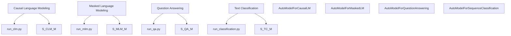

# 示例与任务脚本 (Examples and Task Scripts)

相关源文件 (Relevant source files)

-   [docs/source/en/model\_doc/paddleocr\_vl.md](https://github.com/huggingface/transformers/blob/9a9997fd/docs/source/en/model_doc/paddleocr_vl.md?plain=1)
-   [examples/modular-transformers/configuration\_duplicated\_method.py](https://github.com/huggingface/transformers/blob/9a9997fd/examples/modular-transformers/configuration_duplicated_method.py)
-   [examples/modular-transformers/configuration\_my\_new\_model.py](https://github.com/huggingface/transformers/blob/9a9997fd/examples/modular-transformers/configuration_my_new_model.py)
-   [examples/modular-transformers/configuration\_my\_new\_model2.py](https://github.com/huggingface/transformers/blob/9a9997fd/examples/modular-transformers/configuration_my_new_model2.py)
-   [examples/modular-transformers/configuration\_new\_model.py](https://github.com/huggingface/transformers/blob/9a9997fd/examples/modular-transformers/configuration_new_model.py)
-   [examples/modular-transformers/image\_processing\_new\_imgproc\_model.py](https://github.com/huggingface/transformers/blob/9a9997fd/examples/modular-transformers/image_processing_new_imgproc_model.py)
-   [examples/modular-transformers/modeling\_dummy\_bert.py](https://github.com/huggingface/transformers/blob/9a9997fd/examples/modular-transformers/modeling_dummy_bert.py)
-   [examples/modular-transformers/modeling\_from\_uppercase\_model.py](https://github.com/huggingface/transformers/blob/9a9997fd/examples/modular-transformers/modeling_from_uppercase_model.py)
-   [examples/modular-transformers/modeling\_global\_indexing.py](https://github.com/huggingface/transformers/blob/9a9997fd/examples/modular-transformers/modeling_global_indexing.py)
-   [examples/modular-transformers/modeling\_multimodal2.py](https://github.com/huggingface/transformers/blob/9a9997fd/examples/modular-transformers/modeling_multimodal2.py)
-   [examples/modular-transformers/modeling\_my\_new\_model2.py](https://github.com/huggingface/transformers/blob/9a9997fd/examples/modular-transformers/modeling_my_new_model2.py)
-   [examples/modular-transformers/modeling\_new\_task\_model.py](https://github.com/huggingface/transformers/blob/9a9997fd/examples/modular-transformers/modeling_new_task_model.py)
-   [examples/modular-transformers/modeling\_roberta.py](https://github.com/huggingface/transformers/blob/9a9997fd/examples/modular-transformers/modeling_roberta.py)
-   [examples/modular-transformers/modeling\_super.py](https://github.com/huggingface/transformers/blob/9a9997fd/examples/modular-transformers/modeling_super.py)
-   [examples/modular-transformers/modeling\_switch\_function.py](https://github.com/huggingface/transformers/blob/9a9997fd/examples/modular-transformers/modeling_switch_function.py)
-   [examples/modular-transformers/modeling\_test\_detr.py](https://github.com/huggingface/transformers/blob/9a9997fd/examples/modular-transformers/modeling_test_detr.py)
-   [examples/modular-transformers/modular\_multimodal2.py](https://github.com/huggingface/transformers/blob/9a9997fd/examples/modular-transformers/modular_multimodal2.py)
-   [examples/modular-transformers/modular\_new\_model.py](https://github.com/huggingface/transformers/blob/9a9997fd/examples/modular-transformers/modular_new_model.py)
-   [examples/pytorch/audio-classification/run\_audio\_classification.py](https://github.com/huggingface/transformers/blob/9a9997fd/examples/pytorch/audio-classification/run_audio_classification.py)
-   [examples/pytorch/image-classification/run\_image\_classification.py](https://github.com/huggingface/transformers/blob/9a9997fd/examples/pytorch/image-classification/run_image_classification.py)
-   [examples/pytorch/image-classification/run\_image\_classification\_no\_trainer.py](https://github.com/huggingface/transformers/blob/9a9997fd/examples/pytorch/image-classification/run_image_classification_no_trainer.py)
-   [examples/pytorch/image-pretraining/run\_mae.py](https://github.com/huggingface/transformers/blob/9a9997fd/examples/pytorch/image-pretraining/run_mae.py)
-   [examples/pytorch/image-pretraining/run\_mim.py](https://github.com/huggingface/transformers/blob/9a9997fd/examples/pytorch/image-pretraining/run_mim.py)
-   [examples/pytorch/image-pretraining/run\_mim\_no\_trainer.py](https://github.com/huggingface/transformers/blob/9a9997fd/examples/pytorch/image-pretraining/run_mim_no_trainer.py)
-   [examples/pytorch/language-modeling/run\_clm.py](https://github.com/huggingface/transformers/blob/9a9997fd/examples/pytorch/language-modeling/run_clm.py)
-   [examples/pytorch/language-modeling/run\_clm\_no\_trainer.py](https://github.com/huggingface/transformers/blob/9a9997fd/examples/pytorch/language-modeling/run_clm_no_trainer.py)
-   [examples/pytorch/language-modeling/run\_mlm.py](https://github.com/huggingface/transformers/blob/9a9997fd/examples/pytorch/language-modeling/run_mlm.py)
-   [examples/pytorch/language-modeling/run\_mlm\_no\_trainer.py](https://github.com/huggingface/transformers/blob/9a9997fd/examples/pytorch/language-modeling/run_mlm_no_trainer.py)
-   [examples/pytorch/language-modeling/run\_plm.py](https://github.com/huggingface/transformers/blob/9a9997fd/examples/pytorch/language-modeling/run_plm.py)
-   [examples/pytorch/multiple-choice/run\_swag.py](https://github.com/huggingface/transformers/blob/9a9997fd/examples/pytorch/multiple-choice/run_swag.py)
-   [examples/pytorch/multiple-choice/run\_swag\_no\_trainer.py](https://github.com/huggingface/transformers/blob/9a9997fd/examples/pytorch/multiple-choice/run_swag_no_trainer.py)
-   [examples/pytorch/question-answering/run\_qa.py](https://github.com/huggingface/transformers/blob/9a9997fd/examples/pytorch/question-answering/run_qa.py)
-   [examples/pytorch/question-answering/run\_qa\_beam\_search.py](https://github.com/huggingface/transformers/blob/9a9997fd/examples/pytorch/question-answering/run_qa_beam_search.py)
-   [examples/pytorch/question-answering/run\_qa\_beam\_search\_no\_trainer.py](https://github.com/huggingface/transformers/blob/9a9997fd/examples/pytorch/question-answering/run_qa_beam_search_no_trainer.py)
-   [examples/pytorch/question-answering/run\_qa\_no\_trainer.py](https://github.com/huggingface/transformers/blob/9a9997fd/examples/pytorch/question-answering/run_qa_no_trainer.py)
-   [examples/pytorch/question-answering/run\_seq2seq\_qa.py](https://github.com/huggingface/transformers/blob/9a9997fd/examples/pytorch/question-answering/run_seq2seq_qa.py)
-   [examples/pytorch/semantic-segmentation/run\_semantic\_segmentation.py](https://github.com/huggingface/transformers/blob/9a9997fd/examples/pytorch/semantic-segmentation/run_semantic_segmentation.py)
-   [examples/pytorch/semantic-segmentation/run\_semantic\_segmentation\_no\_trainer.py](https://github.com/huggingface/transformers/blob/9a9997fd/examples/pytorch/semantic-segmentation/run_semantic_segmentation_no_trainer.py)
-   [examples/pytorch/speech-recognition/run\_speech\_recognition\_ctc.py](https://github.com/huggingface/transformers/blob/9a9997fd/examples/pytorch/speech-recognition/run_speech_recognition_ctc.py)
-   [examples/pytorch/speech-recognition/run\_speech\_recognition\_ctc\_adapter.py](https://github.com/huggingface/transformers/blob/9a9997fd/examples/pytorch/speech-recognition/run_speech_recognition_ctc_adapter.py)
-   [examples/pytorch/speech-recognition/run\_speech\_recognition\_seq2seq.py](https://github.com/huggingface/transformers/blob/9a9997fd/examples/pytorch/speech-recognition/run_speech_recognition_seq2seq.py)
-   [examples/pytorch/summarization/run\_summarization.py](https://github.com/huggingface/transformers/blob/9a9997fd/examples/pytorch/summarization/run_summarization.py)
-   [examples/pytorch/summarization/run\_summarization\_no\_trainer.py](https://github.com/huggingface/transformers/blob/9a9997fd/examples/pytorch/summarization/run_summarization_no_trainer.py)
-   [examples/pytorch/text-classification/run\_classification.py](https://github.com/huggingface/transformers/blob/9a9997fd/examples/pytorch/text-classification/run_classification.py)
-   [examples/pytorch/text-classification/run\_glue.py](https://github.com/huggingface/transformers/blob/9a9997fd/examples/pytorch/text-classification/run_glue.py)
-   [examples/pytorch/text-classification/run\_glue\_no\_trainer.py](https://github.com/huggingface/transformers/blob/9a9997fd/examples/pytorch/text-classification/run_glue_no_trainer.py)
-   [examples/pytorch/text-classification/run\_xnli.py](https://github.com/huggingface/transformers/blob/9a9997fd/examples/pytorch/text-classification/run_xnli.py)
-   [examples/pytorch/token-classification/run\_ner.py](https://github.com/huggingface/transformers/blob/9a9997fd/examples/pytorch/token-classification/run_ner.py)
-   [examples/pytorch/token-classification/run\_ner\_no\_trainer.py](https://github.com/huggingface/transformers/blob/9a9997fd/examples/pytorch/token-classification/run_ner_no_trainer.py)
-   [examples/pytorch/translation/run\_translation.py](https://github.com/huggingface/transformers/blob/9a9997fd/examples/pytorch/translation/run_translation.py)
-   [examples/pytorch/translation/run\_translation\_no\_trainer.py](https://github.com/huggingface/transformers/blob/9a9997fd/examples/pytorch/translation/run_translation_no_trainer.py)
-   [src/transformers/models/paddleocr\_vl/\_\_init\_\_.py](https://github.com/huggingface/transformers/blob/9a9997fd/src/transformers/models/paddleocr_vl/__init__.py)
-   [tests/repo\_utils/modular/test\_conversion\_order.py](https://github.com/huggingface/transformers/blob/9a9997fd/tests/repo_utils/modular/test_conversion_order.py)
-   [utils/add\_dates.py](https://github.com/huggingface/transformers/blob/9a9997fd/utils/add_dates.py)
-   [utils/check\_modular\_conversion.py](https://github.com/huggingface/transformers/blob/9a9997fd/utils/check_modular_conversion.py)
-   [utils/create\_dependency\_mapping.py](https://github.com/huggingface/transformers/blob/9a9997fd/utils/create_dependency_mapping.py)
-   [utils/modular\_model\_converter.py](https://github.com/huggingface/transformers/blob/9a9997fd/utils/modular_model_converter.py)

`examples/` 目录提供了一套全面的脚本，用于在各个领域（包括自然语言处理 (Natural Language Processing, NLP)、计算机视觉 (Computer Vision, CV) 和音频）微调和评估 🤗 Transformers 模型。这些脚本既是生产就绪型工具，也是供用户根据其特定任务进行调整的教学模板。

## 脚本架构 (Script Architectures)

示例脚本通常分为两种实现风格：

1.  **基于训练器的脚本 (Trainer-based Scripts)**: 这些脚本利用高级 `Trainer`（或 `Seq2SeqTrainer`）API 来处理训练循环、分布式策略和评估。它们可以通过 `TrainingArguments` 进行高度配置 [examples/pytorch/text-classification/run\_classification.py53](https://github.com/huggingface/transformers/blob/9a9997fd/examples/pytorch/text-classification/run_classification.py#L53-L53)。
2.  **无训练器（基于 Accelerate）的脚本 (No-Trainer (Accelerate-based) Scripts)**: 这些脚本使用 🤗 Accelerate 库提供 "原始" PyTorch 训练循环。它们提供了训练过程的最大透明度和控制权，非常适合需要自定义优化步骤或数据流的用户 [examples/pytorch/language-modeling/run\_clm\_no\_trainer.py50](https://github.com/huggingface/transformers/blob/9a9997fd/examples/pytorch/language-modeling/run_clm_no_trainer.py#L50-L50)。

### 自然语言空间到代码实体空间的映射 (Natural Language Space to Code Entity Space)

下图将高级 NLP 任务映射到代码库中使用的特定脚本实体和 `AutoModel` 类。

**任务到脚本映射 (Task to Script Mapping)**

**来源 (Sources):** [examples/pytorch/language-modeling/run\_clm\_no\_trainer.py64](https://github.com/huggingface/transformers/blob/9a9997fd/examples/pytorch/language-modeling/run_clm_no_trainer.py#L64-L64) [examples/pytorch/language-modeling/run\_mlm\_no\_trainer.py64](https://github.com/huggingface/transformers/blob/9a9997fd/examples/pytorch/language-modeling/run_mlm_no_trainer.py#L64-L64) [examples/pytorch/text-classification/run\_classification.py47](https://github.com/huggingface/transformers/blob/9a9997fd/examples/pytorch/text-classification/run_classification.py#L47-L47) [examples/pytorch/question-answering/run\_qa\_no\_trainer.py47](https://github.com/huggingface/transformers/blob/9a9997fd/examples/pytorch/question-answering/run_qa_no_trainer.py#L47-L47)

---

## 核心任务实现 (Core Task Implementations)

### 因果与掩码语言建模 (Causal and Masked Language Modeling)

`run_clm.py` 和 `run_mlm.py` 等脚本用于预训练或微调 GPT-2、BERT 和 RoBERTa 等模型。它们通过将样本连接成固定 `block_size` 的块来处理大规模文本数据 [examples/pytorch/language-modeling/run\_clm\_no\_trainer.py186-194](https://github.com/huggingface/transformers/blob/9a9997fd/examples/pytorch/language-modeling/run_clm_no_trainer.py#L186-L194)。

### 问答 (QA) (Question Answering (QA))

QA 脚本既支持 SQuAD 样式的 抽取式问答 (Extractive answering)，也支持针对 XLNet 等模型的基于 束搜索 (Beam-search) 的问答 [examples/pytorch/question-answering/run\_qa\_beam\_search\_no\_trainer.py48](https://github.com/huggingface/transformers/blob/9a9997fd/examples/pytorch/question-answering/run_qa_beam_search_no_trainer.py#L48-L48)。这里使用的一个关键实用程序是 `postprocess_qa_predictions`，它将模型 逻辑值 (Logits) 映射回原始上下文文本 [examples/pytorch/question-answering/run\_qa\_no\_trainer.py40](https://github.com/huggingface/transformers/blob/9a9997fd/examples/pytorch/question-answering/run_qa_no_trainer.py#L40-L40)。

### 计算机视觉任务 (Computer Vision Tasks)

该库提供的示例包括：

-   **图像分类 (Image Classification)**: 使用 `AutoModelForImageClassification` 和 `AutoImageProcessor` [examples/pytorch/image-classification/run\_image\_classification\_no\_trainer.py59](https://github.com/huggingface/transformers/blob/9a9997fd/examples/pytorch/image-classification/run_image_classification_no_trainer.py#L59-L59)。
-   **语义分割 (Semantic Segmentation)**: 使用 `AutoModelForSemanticSegmentation` 以及来自 `albumentations` 库的专门数据增强 [examples/pytorch/semantic-segmentation/run\_semantic\_segmentation\_no\_trainer.py36-54](https://github.com/huggingface/transformers/blob/9a9997fd/examples/pytorch/semantic-segmentation/run_semantic_segmentation_no_trainer.py#L36-L54)。
-   **掩码图像建模 (Masked Image Modeling (MIM))**: 使用 `AutoModelForMaskedImageModeling` 预训练 ViT 等模型 [examples/pytorch/image-pretraining/run\_mim\_no\_trainer.py49](https://github.com/huggingface/transformers/blob/9a9997fd/examples/pytorch/image-pretraining/run_mim_no_trainer.py#L49-L49)。

---

## 模块化 Transformers 示例 (Modular Transformers Examples)

`examples/modular-transformers/` 目录展示了添加新模型的 "模块化 (Modular)" 方法。该系统允许开发人员通过继承现有组件来定义模型，而不是复制数千行代码。

### 模块化工作流 (The Modular Workflow)

1.  **定义模块化文件 (Define Modular File)**: 使用模块化导入创建 `modular_new_model.py` 文件。
2.  **生成建模代码 (Generate Modeling Code)**: 运行 `modular_model_converter.py` 工具。
3.  **自动转换 (Automatic Conversion)**: 该工具使用 `libcst` 解析模块化文件并生成标准的 `modeling_new_model.py` 文件 [utils/modular\_model\_converter.py106-114](https://github.com/huggingface/transformers/blob/9a9997fd/utils/modular_model_converter.py#L106-L114)。

**模块化转换流程 (Modular Conversion Flow)**

> **[Mermaid sequence]**
> *(图表结构无法解析)*

**来源 (Sources):** [utils/modular\_model\_converter.py44-50](https://github.com/huggingface/transformers/blob/9a9997fd/utils/modular_model_converter.py#L44-L50) [utils/modular\_model\_converter.py106-116](https://github.com/huggingface/transformers/blob/9a9997fd/utils/modular_model_converter.py#L106-L116) [utils/check\_modular\_conversion.py91-97](https://github.com/huggingface/transformers/blob/9a9997fd/utils/check_modular_conversion.py#L91-L97)

### 关键模块化组件 (Key Modular Components)

-   **ReplaceNameTransformer**: 一个 `libcst` 转换器，它将基础模型名称（例如 "Llama"）替换为新模型名称，同时保留大小写（驼峰式 CamelCase、下划线式 snake\_case、全大写 UPPER\_CASE） [utils/modular\_model\_converter.py106-129](https://github.com/huggingface/transformers/blob/9a9997fd/utils/modular_model_converter.py#L106-L129)。
-   **依赖解析 (Dependency Resolution)**: 系统使用 `find_priority_list` 根据模块化文件的相互依赖关系来确定其处理顺序 [utils/check\_modular\_conversion.py11-14](https://github.com/huggingface/transformers/blob/9a9997fd/utils/check_modular_conversion.py#L11-L14)。
-   **CI 强制执行 (CI Enforcement)**: `check_modular_conversion.py` 脚本通过比较内容并运行 `ruff` 进行格式化，确保生成的建模文件与其模块化源保持同步 [utils/check\_modular\_conversion.py65-88](https://github.com/huggingface/transformers/blob/9a9997fd/utils/check_modular_conversion.py#L65-L88)。

**来源 (Sources):**

-   `examples/pytorch/language-modeling/run_clm_no_trainer.py`
-   `examples/pytorch/image-classification/run_image_classification_no_trainer.py`
-   `examples/pytorch/semantic-segmentation/run_semantic_segmentation_no_trainer.py`
-   `utils/modular_model_converter.py`
-   `utils/check_modular_conversion.py`
-   `examples/modular-transformers/modeling_new_task_model.py`
