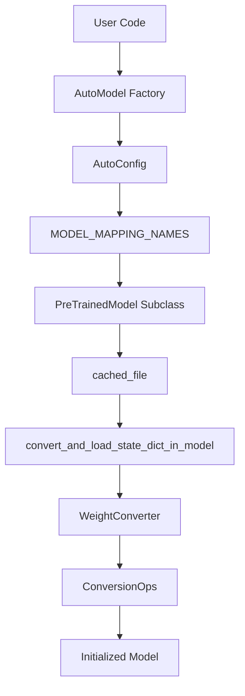
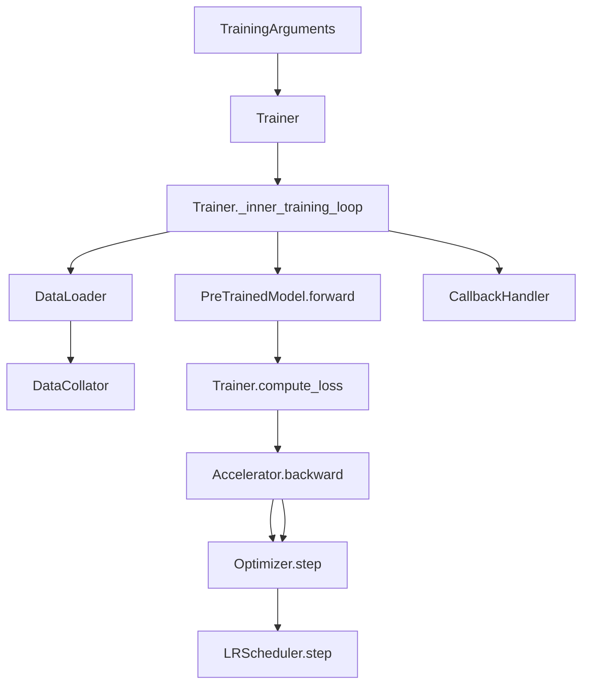

# 术语表 (Glossary)

相关源文件 (Relevant source files)

-   [MIGRATION\_GUIDE\_V5.md](https://github.com/huggingface/transformers/blob/9a9997fd/MIGRATION_GUIDE_V5.md?plain=1)
-   [docs/source/en/\_toctree.yml](https://github.com/huggingface/transformers/blob/9a9997fd/docs/source/en/_toctree.yml)
-   [docs/source/en/generation\_strategies.md](https://github.com/huggingface/transformers/blob/9a9997fd/docs/source/en/generation_strategies.md?plain=1)
-   [docs/source/en/index.md](https://github.com/huggingface/transformers/blob/9a9997fd/docs/source/en/index.md?plain=1)
-   [docs/source/en/internal/generation\_utils.md](https://github.com/huggingface/transformers/blob/9a9997fd/docs/source/en/internal/generation_utils.md?plain=1)
-   [docs/source/en/main\_classes/quantization.md](https://github.com/huggingface/transformers/blob/9a9997fd/docs/source/en/main_classes/quantization.md?plain=1)
-   [docs/source/en/main\_classes/text\_generation.md](https://github.com/huggingface/transformers/blob/9a9997fd/docs/source/en/main_classes/text_generation.md?plain=1)
-   [docs/source/en/quantization/overview.md](https://github.com/huggingface/transformers/blob/9a9997fd/docs/source/en/quantization/overview.md?plain=1)
-   [docs/source/en/serve-cli/serving.md](https://github.com/huggingface/transformers/blob/9a9997fd/docs/source/en/serve-cli/serving.md?plain=1)
-   [setup.py](https://github.com/huggingface/transformers/blob/9a9997fd/setup.py)
-   [src/transformers/\_\_init\_\_.py](https://github.com/huggingface/transformers/blob/9a9997fd/src/transformers/__init__.py)
-   [src/transformers/cache\_utils.py](https://github.com/huggingface/transformers/blob/9a9997fd/src/transformers/cache_utils.py)
-   [src/transformers/cli/add\_new\_model\_like.py](https://github.com/huggingface/transformers/blob/9a9997fd/src/transformers/cli/add_new_model_like.py)
-   [src/transformers/cli/chat.py](https://github.com/huggingface/transformers/blob/9a9997fd/src/transformers/cli/chat.py)
-   [src/transformers/cli/download.py](https://github.com/huggingface/transformers/blob/9a9997fd/src/transformers/cli/download.py)
-   [src/transformers/cli/serve.py](https://github.com/huggingface/transformers/blob/9a9997fd/src/transformers/cli/serve.py)
-   [src/transformers/cli/system.py](https://github.com/huggingface/transformers/blob/9a9997fd/src/transformers/cli/system.py)
-   [src/transformers/cli/transformers.py](https://github.com/huggingface/transformers/blob/9a9997fd/src/transformers/cli/transformers.py)
-   [src/transformers/configuration\_utils.py](https://github.com/huggingface/transformers/blob/9a9997fd/src/transformers/configuration_utils.py)
-   [src/transformers/conversion\_mapping.py](https://github.com/huggingface/transformers/blob/9a9997fd/src/transformers/conversion_mapping.py)
-   [src/transformers/core_model_loading.py](https://github.com/huggingface/transformers/blob/9a9997fd/src/transformers/core_model_loading.py)
-   [src/transformers/data/datasets/glue.py](https://github.com/huggingface/transformers/blob/9a9997fd/src/transformers/data/datasets/glue.py)
-   [src/transformers/data/processors/glue.py](https://github.com/huggingface/transformers/blob/9a9997fd/src/transformers/data/processors/glue.py)
-   [src/transformers/dependency\_versions\_table.py](https://github.com/huggingface/transformers/blob/9a9997fd/src/transformers/dependency_versions_table.py)
-   [src/transformers/feature\_extraction\_utils.py](https://github.com/huggingface/transformers/blob/9a9997fd/src/transformers/feature_extraction_utils.py)
-   [src/transformers/file\_utils.py](https://github.com/huggingface/transformers/blob/9a9997fd/src/transformers/file_utils.py)
-   [src/transformers/generation/\_\_init\_\_.py](https://github.com/huggingface/transformers/blob/9a9997fd/src/transformers/generation/__init__.py)
-   [src/transformers/generation/candidate\_generator.py](https://github.com/huggingface/transformers/blob/9a9997fd/src/transformers/generation/candidate_generator.py)
-   [src/transformers/generation/configuration\_utils.py](https://github.com/huggingface/transformers/blob/9a9997fd/src/transformers/generation/configuration_utils.py)
-   [src/transformers/generation/logits\_process.py](https://github.com/huggingface/transformers/blob/9a9997fd/src/transformers/generation/logits_process.py)
-   [src/transformers/generation/stopping\_criteria.py](https://github.com/huggingface/transformers/blob/9a9997fd/src/transformers/generation/stopping_criteria.py)
-   [src/transformers/generation/utils.py](https://github.com/huggingface/transformers/blob/9a9997fd/src/transformers/generation/utils.py)
-   [src/transformers/image\_processing\_base.py](https://github.com/huggingface/transformers/blob/9a9997fd/src/transformers/image_processing_base.py)
-   [src/transformers/integrations/\_\_init\_\_.py](https://github.com/huggingface/transformers/blob/9a9997fd/src/transformers/integrations/__init__.py)
-   [src/transformers/integrations/accelerate.py](https://github.com/huggingface/transformers/blob/9a9997fd/src/transformers/integrations/accelerate.py)
-   [src/transformers/integrations/peft.py](https://github.com/huggingface/transformers/blob/9a9997fd/src/transformers/integrations/peft.py)
-   [src/transformers/modeling\_utils.py](https://github.com/huggingface/transformers/blob/9a9997fd/src/transformers/modeling_utils.py)
-   [src/transformers/models/\_\_init\_\_.py](https://github.com/huggingface/transformers/blob/9a9997fd/src/transformers/models/__init__.py)
-   [src/transformers/models/auto/configuration\_auto.py](https://github.com/huggingface/transformers/blob/9a9997fd/src/transformers/models/auto/configuration_auto.py)
-   [src/transformers/models/auto/feature\_extraction\_auto.py](https://github.com/huggingface/transformers/blob/9a9997fd/src/transformers/models/auto/feature_extraction_auto.py)
-   [src/transformers/models/auto/image\_processing\_auto.py](https://github.com/huggingface/transformers/blob/9a9997fd/src/transformers/models/auto/image_processing_auto.py)
-   [src/transformers/models/auto/modeling\_auto.py](https://github.com/huggingface/transformers/blob/9a9997fd/src/transformers/models/auto/modeling_auto.py)
-   [src/transformers/models/auto/processing\_auto.py](https://github.com/huggingface/transformers/blob/9a9997fd/src/transformers/models/auto/processing_auto.py)
-   [src/transformers/models/auto/tokenization\_auto.py](https://github.com/huggingface/transformers/blob/9a9997fd/src/transformers/models/auto/tokenization_auto.py)
-   [src/transformers/models/auto/video\_processing\_auto.py](https://github.com/huggingface/transformers/blob/9a9997fd/src/transformers/models/auto/video_processing_auto.py)
-   [src/transformers/models/clvp/modeling\_clvp.py](https://github.com/huggingface/transformers/blob/9a9997fd/src/transformers/models/clvp/modeling_clvp.py)
-   [src/transformers/models/cohere/tokenization\_cohere.py](https://github.com/huggingface/transformers/blob/9a9997fd/src/transformers/models/cohere/tokenization_cohere.py)
-   [src/transformers/processing\_utils.py](https://github.com/huggingface/transformers/blob/9a9997fd/src/transformers/processing_utils.py)
-   [src/transformers/pytorch\_utils.py](https://github.com/huggingface/transformers/blob/9a9997fd/src/transformers/pytorch_utils.py)
-   [src/transformers/quantizers/auto.py](https://github.com/huggingface/transformers/blob/9a9997fd/src/transformers/quantizers/auto.py)
-   [src/transformers/testing\_utils.py](https://github.com/huggingface/transformers/blob/9a9997fd/src/transformers/testing_utils.py)
-   [src/transformers/tokenization\_utils\_base.py](https://github.com/huggingface/transformers/blob/9a9997fd/src/transformers/tokenization_utils_base.py)
-   [src/transformers/trainer.py](https://github.com/huggingface/transformers/blob/9a9997fd/src/transformers/trainer.py)
-   [src/transformers/trainer\_utils.py](https://github.com/huggingface/transformers/blob/9a9997fd/src/transformers/trainer_utils.py)
-   [src/transformers/training\_args.py](https://github.com/huggingface/transformers/blob/9a9997fd/src/transformers/training_args.py)
-   [src/transformers/utils/\_\_init\_\_.py](https://github.com/huggingface/transformers/blob/9a9997fd/src/transformers/utils/__init__.py)
-   [src/transformers/utils/dummy\_pt\_objects.py](https://github.com/huggingface/transformers/blob/9a9997fd/src/transformers/utils/dummy_pt_objects.py)
-   [src/transformers/utils/hub.py](https://github.com/huggingface/transformers/blob/9a9997fd/src/transformers/utils/hub.py)
-   [src/transformers/utils/import\_utils.py](https://github.com/huggingface/transformers/blob/9a9997fd/src/transformers/utils/import_utils.py)
-   [src/transformers/utils/loading\_report.py](https://github.com/huggingface/transformers/blob/9a9997fd/src/transformers/utils/loading_report.py)
-   [src/transformers/utils/logging.py](https://github.com/huggingface/transformers/blob/9a9997fd/src/transformers/utils/logging.py)
-   [src/transformers/utils/quantization\_config.py](https://github.com/huggingface/transformers/blob/9a9997fd/src/transformers/utils/quantization_config.py)
-   [src/transformers/video\_processing\_utils.py](https://github.com/huggingface/transformers/blob/9a9997fd/src/transformers/video_processing_utils.py)
-   [tests/cli/test\_serve.py](https://github.com/huggingface/transformers/blob/9a9997fd/tests/cli/test_serve.py)
-   [tests/generation/test\_candidate\_generator.py](https://github.com/huggingface/transformers/blob/9a9997fd/tests/generation/test_candidate_generator.py)
-   [tests/generation/test\_configuration\_utils.py](https://github.com/huggingface/transformers/blob/9a9997fd/tests/generation/test_configuration_utils.py)
-   [tests/generation/test\_logits\_process.py](https://github.com/huggingface/transformers/blob/9a9997fd/tests/generation/test_logits_process.py)
-   [tests/generation/test\_stopping\_criteria.py](https://github.com/huggingface/transformers/blob/9a9997fd/tests/generation/test_stopping_criteria.py)
-   [tests/generation/test\_utils.py](https://github.com/huggingface/transformers/blob/9a9997fd/tests/generation/test_utils.py)
-   [tests/models/auto/test\_processor\_auto.py](https://github.com/huggingface/transformers/blob/9a9997fd/tests/models/auto/test_processor_auto.py)
-   [tests/peft\_integration/test\_peft\_integration.py](https://github.com/huggingface/transformers/blob/9a9997fd/tests/peft_integration/test_peft_integration.py)
-   [tests/test\_modeling\_common.py](https://github.com/huggingface/transformers/blob/9a9997fd/tests/test_modeling_common.py)
-   [tests/trainer/test\_trainer.py](https://github.com/huggingface/transformers/blob/9a9997fd/tests/trainer/test_trainer.py)
-   [tests/utils/test\_cache\_utils.py](https://github.com/huggingface/transformers/blob/9a9997fd/tests/utils/test_cache_utils.py)
-   [tests/utils/test\_configuration\_utils.py](https://github.com/huggingface/transformers/blob/9a9997fd/tests/utils/test_configuration_utils.py)
-   [tests/utils/test\_core\_model\_loading.py](https://github.com/huggingface/transformers/blob/9a9997fd/tests/utils/test_core_model_loading.py)
-   [tests/utils/test\_feature\_extraction\_utils.py](https://github.com/huggingface/transformers/blob/9a9997fd/tests/utils/test_feature_extraction_utils.py)
-   [tests/utils/test\_image\_processing\_utils.py](https://github.com/huggingface/transformers/blob/9a9997fd/tests/utils/test_image_processing_utils.py)
-   [tests/utils/test\_modeling\_utils.py](https://github.com/huggingface/transformers/blob/9a9997fd/tests/utils/test_modeling_utils.py)
-   [tests/utils/test\_tokenization\_utils.py](https://github.com/huggingface/transformers/blob/9a9997fd/tests/utils/test_tokenization_utils.py)
-   [utils/check\_config\_attributes.py](https://github.com/huggingface/transformers/blob/9a9997fd/utils/check_config_attributes.py)
-   [utils/check\_repo.py](https://github.com/huggingface/transformers/blob/9a9997fd/utils/check_repo.py)

本术语表定义了整个 Hugging Face `transformers` 库中使用的代码库特定术语、行话和领域概念。它提供了高级概念与其技术实现之间的映射。

## 核心抽象 (Core Abstractions)

### 自动类 (Auto Classes)

一个统一的接口，允许用户根据模型标识符（本地路径或 Hub ID）实例化正确的模型、配置 (Configuration) 或分词器 (Tokenizer) 类。它依赖于诸如 `MODEL_MAPPING_NAMES` 和 `CONFIG_MAPPING_NAMES` 之类的映射字典。

-   **实现 (Implementation)**：`AutoModel`、`AutoConfig`、`AutoTokenizer`。
-   **机制 (Mechanism)**：使用 `_LazyAutoMapping` 来延迟导入，直到根据 `config.json` 中发现的 `model_type` 请求特定类。
-   **来源 (Sources)**：[src/transformers/models/auto/modeling\_auto.py41-186](https://github.com/huggingface/transformers/blob/9a9997fd/src/transformers/models/auto/modeling_auto.py#L41-L186) [src/transformers/models/auto/auto\_factory.py24](https://github.com/huggingface/transformers/blob/9a9997fd/src/transformers/models/auto/auto_factory.py#L24-L24)

### PreTrainedModel

库中所有 PyTorch 模型的基类。它处理权重初始化、加载 (`from_pretrained`)、保存 (`save_pretrained`)，以及常见的实用程序，如调整令牌嵌入 (Token Embeddings) 大小或修剪头部 (Pruning Heads)。

-   **实现 (Implementation)**：`modeling_utils.py` 中的 `PreTrainedModel`。
-   **来源 (Sources)**：[src/transformers/modeling\_utils.py1210](https://github.com/huggingface/transformers/blob/9a9997fd/src/transformers/modeling_utils.py#L1210-L1210)

### 流水线 (Pipeline)

一个高级包装器，它抽象了特定任务（例如 `text-generation`、`image-classification`）的预处理 (Preprocessing)、模型前向传播 (Forward Pass) 和后处理 (Postprocessing) 的复杂性。

-   **实现 (Implementation)**：`Pipeline` 类和 `pipeline` 工厂函数。
-   **来源 (Sources)**：[src/transformers/pipelines/\_\_init\_\_.py138-170](https://github.com/huggingface/transformers/blob/9a9997fd/src/transformers/pipelines/__init__.py#L138-L170)

## 代码实体映射：模型加载 (Code Entity Mapping: Model Loading)

下图将“加载模型”这一自然语言概念与 `from_pretrained` 流程中涉及的具体代码实体联系起来。

**模型加载生命周期 (Model Loading Lifecycle)**

-   **来源 (Sources)**：[src/transformers/modeling\_utils.py47-52](https://github.com/huggingface/transformers/blob/9a9997fd/src/transformers/modeling_utils.py#L47-L52) [src/transformers/models/auto/modeling\_auto.py41-80](https://github.com/huggingface/transformers/blob/9a9997fd/src/transformers/models/auto/modeling_auto.py#L41-L80) [src/transformers/utils/hub.py108](https://github.com/huggingface/transformers/blob/9a9997fd/src/transformers/utils/hub.py#L108-L108)

## 生成术语 (Generation Terminology)

### KV 缓存 (KV Cache)

在自回归解码 (Autoregressive Decoding) 期间存储先前令牌的 Key 和 Value 张量 (Tensors) 的系统，以避免冗余计算。

-   **实现 (Implementation)**：`Cache` 基类及其变体，如 `DynamicCache`、`StaticCache` 和 `QuantizedCache`。
-   **来源 (Sources)**：[src/transformers/cache\_utils.py30-35](https://github.com/huggingface/transformers/blob/9a9997fd/src/transformers/cache_utils.py#L30-L35)

### Logits 处理器 (Logits Processor)

在最终采样/贪婪选择之前，修改语言模型预测分数 (Logits) 的类。

-   **实现 (Implementation)**：包含 `TemperatureLogitsWarper`、`TopKLogitsWarper` 和 `RepetitionPenaltyLogitsProcessor` 等对象的 `LogitsProcessorList`。
-   **来源 (Sources)**：[src/transformers/generation/logits\_process.py73-100](https://github.com/huggingface/transformers/blob/9a9997fd/src/transformers/generation/logits_process.py#L73-L100)

### 辅助解码 (Assisted Decoding / Speculative Decoding)

一种生成策略，其中较小的“草稿 (Draft)”模型提出候选令牌 (Candidate Tokens)，然后由较大的“目标 (Target)”模型并行验证。

-   **实现 (Implementation)**：`AssistedCandidateGenerator` 和 `CandidateGenerator`。
-   **来源 (Sources)**：[src/transformers/generation/candidate\_generator.py53-60](https://github.com/huggingface/transformers/blob/9a9997fd/src/transformers/generation/candidate_generator.py#L53-L60)

## 训练与基础设施 (Training & Infrastructure)

### 训练器 (Trainer)

一个完整的 PyTorch 模型训练和评估接口。它抽象了训练循环，包括梯度累积 (Gradient Accumulation)、混合精度 (Mixed Precision) 和分布式训练 (Distributed Training)。

-   **实现 (Implementation)**：`Trainer` 类。
-   **来源 (Sources)**：[src/transformers/trainer.py15-16](https://github.com/huggingface/transformers/blob/9a9997fd/src/transformers/trainer.py#L15-L16)

### 训练参数 (TrainingArguments)

一个包含 `Trainer` 的所有超参数 (Hyperparameters) 和配置标志的数据类。

-   **实现 (Implementation)**：`TrainingArguments`。
-   **来源 (Sources)**：[src/transformers/training\_args.py179-188](https://github.com/huggingface/transformers/blob/9a9997fd/src/transformers/training_args.py#L179-L188)

### 延迟加载 (Lazy Loading)

一种防止 `import transformers` 一次性将所有模型代码和后端（PyTorch、TensorFlow、Flax）加载到内存中的机制。

-   **实现 (Implementation)**：`utils/import_utils.py` 中的 `_LazyModule` 和 `__init__.py` 中的 `_import_structure` 字典。
-   **来源 (Sources)**：[src/transformers/\_\_init\_\_.py15-19](https://github.com/huggingface/transformers/blob/9a9997fd/src/transformers/__init__.py#L15-L19) [src/transformers/utils/import\_utils.py33](https://github.com/huggingface/transformers/blob/9a9997fd/src/transformers/utils/import_utils.py#L33-L33)

## 技术行话表 (Technical Jargon Table)

| 术语 (Term) | 定义 (Definition) | 代码指针 (Code Pointer) |
| --- | --- | --- |
| **模块化 Transformers (Modular Transformers)** | 一个 v5+ 系统，用于以模块化方式定义模型，以实现更轻松的权重转换和组件重用。 | `modular_transformers.py` |
| **权重转换 (Weight Conversion)** | 将外部检查点键（例如，来自原始 LLaMA 仓库）映射到内部 `transformers` 命名约定的过程。 | `<FileRef file-url="https://github.com/huggingface/transformers/blob/9a9997fd/src/transformers/core_model_loading.py#L48-L49" min=48 max=49 file-path="src/transformers/core_model_loading.py">Hii</FileRef>` |
| **状态字典 (State Dict)** | 一个 Python 字典对象，将每个层映射到其参数张量 (Parameter Tensor)。 | `<FileRef file-url="https://github.com/huggingface/transformers/blob/9a9997fd/src/transformers/modeling_utils.py#L130-L130" min=130 file-path="src/transformers/modeling_utils.py">Hii</FileRef>` |
| **绑定权重 (Tie Weights)** | 在两个层之间共享权重的做法（例如，输入嵌入和 LM 头部 (LM head)）。 | `<FileRef file-url="https://github.com/huggingface/transformers/blob/9a9997fd/src/transformers/modeling_utils.py#L1255-L1255" min=1255 file-path="src/transformers/modeling_utils.py">Hii</FileRef>` |
| **SDPA** | 缩放点积注意力 (Scaled Dot Product Attention)；优化后的 PyTorch 原生注意力实现。 | `<FileRef file-url="https://github.com/huggingface/transformers/blob/9a9997fd/src/transformers/modeling_utils.py#L73-L73" min=73 file-path="src/transformers/modeling_utils.py">Hii</FileRef>` |
| **GQA / MQA** | 分组查询注意力 (Grouped-Query Attention) 和多查询注意力 (Multi-Query Attention)；LLM 中 KV 缓存的优化。 | `<FileRef file-url="https://github.com/huggingface/transformers/blob/9a9997fd/src/transformers/modeling_utils.py#L80-L83" min=80 max=83 file-path="src/transformers/modeling_utils.py">Hii</FileRef>` |

## 代码实体映射：训练循环 (Code Entity Mapping: Training Loop)

该图将高级训练步骤映射到 `Trainer` 基础设施中处理它们的特定类和方法。

**训练器执行流程 (Trainer Execution Flow)**

-   **来源 (Sources)**：[src/transformers/trainer.py84-92](https://github.com/huggingface/transformers/blob/9a9997fd/src/transformers/trainer.py#L84-L92) [src/transformers/trainer.py1535-1540](https://github.com/huggingface/transformers/blob/9a9997fd/src/transformers/trainer.py#L1535-L1540) [src/transformers/training\_args.py179](https://github.com/huggingface/transformers/blob/9a9997fd/src/transformers/training_args.py#L179-L179) [src/transformers/data/data\_collator.py56](https://github.com/huggingface/transformers/blob/9a9997fd/src/transformers/data/data_collator.py#L56-L56)
