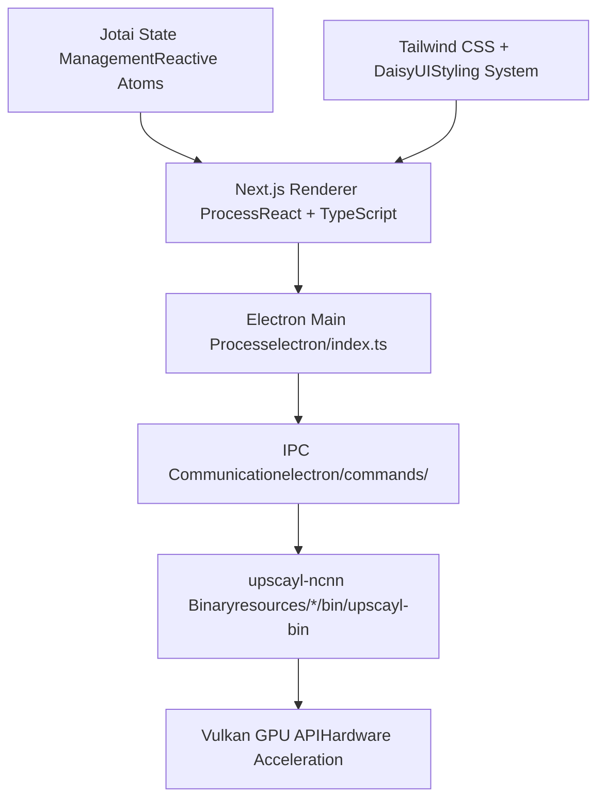
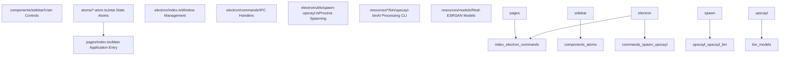

# 概述 (Overview)

相关源文件

-   [.github/workflows/stale.yml](https://github.com/upscayl/upscayl/blob/1fdbd3e5/.github/workflows/stale.yml)
-   [README.md](https://github.com/upscayl/upscayl/blob/1fdbd3e5/README.md?plain=1)
-   [electron/utils/show-notification.ts](https://github.com/upscayl/upscayl/blob/1fdbd3e5/electron/utils/show-notification.ts)
-   [package-lock.json](https://github.com/upscayl/upscayl/blob/1fdbd3e5/package-lock.json)
-   [package.json](https://github.com/upscayl/upscayl/blob/1fdbd3e5/package.json)
-   [renderer/components/sidebar/settings-tab/auto-update-toggle.tsx](https://github.com/upscayl/upscayl/blob/1fdbd3e5/renderer/components/sidebar/settings-tab/auto-update-toggle.tsx)
-   [renderer/components/sidebar/settings-tab/enable-contributions-toggle.tsx](https://github.com/upscayl/upscayl/blob/1fdbd3e5/renderer/components/sidebar/settings-tab/enable-contributions-toggle.tsx)
-   [upscayl.mp4](https://github.com/upscayl/upscayl/blob/1fdbd3e5/upscayl.mp4)

本文档提供了对 Upscayl 的高层级介绍，Upscayl 是一款免费且开源的 AI (人工智能) 图像放大器应用程序。它涵盖了应用程序的核心用途、技术栈、架构设计和关键特性。有关特定子系统的详细信息，请参阅 [项目结构 (Project Structure)](/upscayl/upscayl/1.1-project-structure)、[应用程序架构 (Application Architecture)](/upscayl/upscayl/2-application-architecture) 和 [核心功能 (Core Functionality)](/upscayl/upscayl/3-core-functionality)。

## 什么是 Upscayl

Upscayl 是一款跨平台桌面应用程序，它使用先进的 AI 算法来放大和增强低分辨率图像，而不会损失质量。该应用程序利用 Real-ESRGAN 模型和 Vulkan GPU 加速 (GPU Acceleration) 来执行高质量的图像放大。

**核心用途**：使用户能够通过直观的桌面界面，使用 AI 模型放大图像，支持单张图像处理、批量操作和自定义模型集成。

**目标平台**：Windows 10+、macOS 12+ 以及配备 Vulkan 兼容 GPU 的 Linux 发行版。

来源：[README.md52-57](https://github.com/upscayl/upscayl/blob/1fdbd3e5/README.md?plain=1#L52-L57) [package.json26-27](https://github.com/upscayl/upscayl/blob/1fdbd3e5/package.json#L26-L27)

## 技术栈 (Technology Stack)

Upscayl 使用现代的基于 Electron 的架构构建，该架构分离了用户界面和 AI 处理系统之间的关注点。

### 应用程序框架

**前端技术**：

-   **Next.js 15.x**：基于 React 的渲染进程，用于 UI 组件
-   **TypeScript**：整个代码库中的类型安全开发
-   **Jotai**：用于响应式 UI 更新的原子状态管理
-   **Tailwind CSS + DaisyUI**：带有组件库的实用程序优先样式

**桌面框架**：

-   **Electron 33.x**：跨平台桌面应用程序框架
-   **electron-builder**：打包和分发系统

**AI 处理**：

-   **upscayl-ncnn**：用于 AI 模型执行的自定义基于 NCNN 的 CLI (命令行界面) 工具
-   **Vulkan API**：用于 AI 推理的 GPU 加速

来源：[package.json214-223](https://github.com/upscayl/upscayl/blob/1fdbd3e5/package.json#L214-L223) [package.json225-256](https://github.com/upscayl/upscayl/blob/1fdbd3e5/package.json#L225-L256)

## 高层级架构

该应用程序在用户界面层和 AI 处理后端之间遵循清晰的分离，通过 Electron 的 IPC (Inter-Process Communication，进程间通信) 系统进行通信。

### 核心系统组件

### 进程通信流

> **[Mermaid sequence]**
> *(图表结构无法解析)*

来源：[electron/index.ts37](https://github.com/upscayl/upscayl/blob/1fdbd3e5/electron/index.ts#L37-L37) [electron/commands/](https://github.com/upscayl/upscayl/blob/1fdbd3e5/electron/commands/) [electron/utils/spawn-upscayl.ts](https://github.com/upscayl/upscayl/blob/1fdbd3e5/electron/utils/spawn-upscayl.ts) [package.json82-105](https://github.com/upscayl/upscayl/blob/1fdbd3e5/package.json#L82-L105)

## 关键特性

### 图像处理能力

| 特性 | 描述 | 实现 |
| --- | --- | --- |
| **单张图像放大** | 使用 AI 模型处理单张图像 | `imageUpscayl` 命令处理程序 |
| **批量处理** | 放大目录中的多张图像 | `batchUpscayl` 命令处理程序 |
| **双重放大** | 用于极致增强的两阶段放大 | `doubleUpscayl` 命令处理程序 |
| **自定义模型** | 支持用户导入的 AI 模型 | 模型验证和加载系统 |

### 内置 AI 模型

该应用程序包含多个针对不同图像类型优化的预训练 Real-ESRGAN 模型：

-   **upscayl-standard-4x**：通用放大模型
-   **remacri-4x**：Foolhardy 的模型，针对各种内容进行了优化
-   **high-fidelity-4x**：用于高质量结果的 HFA2k 模型
-   **ultrasharp-4x**：Kim2091 的模型，用于锐利的细节增强

来源：[common/models-list.ts](https://github.com/upscayl/upscayl/blob/1fdbd3e5/common/models-list.ts) [README.md230-232](https://github.com/upscayl/upscayl/blob/1fdbd3e5/README.md?plain=1#L230-L232)

### 平台集成

**跨平台分发**：

-   **Linux**：Flatpak、AppImage、DEB/RPM 软件包、Snap
-   **macOS**：DMG 安装程序、Mac App Store、Homebrew Cask
-   **Windows**：NSIS 安装程序、便携式 ZIP

**硬件要求**：

-   兼容 Vulkan 的 GPU (推荐专用 GPU)
-   足够的显存 (VRAM) 用于模型加载和处理

来源：[package.json169-195](https://github.com/upscayl/upscayl/blob/1fdbd3e5/package.json#L169-L195) [README.md81-141](https://github.com/upscayl/upscayl/blob/1fdbd3e5/README.md?plain=1#L81-L141)

## 开发工作流

该应用程序使用标准的 Node.js 开发工作流，包含 TypeScript 编译和 Electron 打包。

**关键命令**：

-   `npm run start`：带有热重载 (Hot reload) 的开发服务器
-   `npm run build`：生产环境构建编译
-   `npm run dist`：使用 electron-builder 进行跨平台打包

**构建配置**：

-   TypeScript 编译到 `export/` 目录
-   Next.js 静态导出到 `renderer/out/`
-   在 `resources/*/bin/` 中捆绑特定于平台的二进制文件

来源：[package.json38-71](https://github.com/upscayl/upscayl/blob/1fdbd3e5/package.json#L38-L71)

## 项目范围

本概述涵盖了 Upscayl 的基本架构和目的。有关实现细节，请参阅：

-   **代码组织**：[项目结构 (Project Structure)](/upscayl/upscayl/1.1-project-structure)
-   **Electron 架构**：[应用程序架构 (Application Architecture)](/upscayl/upscayl/2-application-architecture)
-   **AI 处理**：[核心功能 (Core Functionality)](/upscayl/upscayl/3-core-functionality)
-   **用户界面**：[用户界面 (User Interface)](/upscayl/upscayl/4-user-interface)
-   **平台支持**：[平台支持 (Platform Support)](/upscayl/upscayl/5-platform-support)
-   **构建系统**：[构建与部署 (Build and Deployment)](/upscayl/upscayl/6-build-and-deployment)
