# 项目结构 (Project Structure)

相关源文件

-   [.gitignore](https://github.com/upscayl/upscayl/blob/1fdbd3e5/.gitignore)
-   [next.config.js](https://github.com/upscayl/upscayl/blob/1fdbd3e5/next.config.js)
-   [notarize.js](https://github.com/upscayl/upscayl/blob/1fdbd3e5/notarize.js)
-   [package-lock.json](https://github.com/upscayl/upscayl/blob/1fdbd3e5/package-lock.json)
-   [package.json](https://github.com/upscayl/upscayl/blob/1fdbd3e5/package.json)
-   [renderer/components/sidebar/settings-tab/auto-update-toggle.tsx](https://github.com/upscayl/upscayl/blob/1fdbd3e5/renderer/components/sidebar/settings-tab/auto-update-toggle.tsx)
-   [renderer/components/sidebar/settings-tab/enable-contributions-toggle.tsx](https://github.com/upscayl/upscayl/blob/1fdbd3e5/renderer/components/sidebar/settings-tab/enable-contributions-toggle.tsx)
-   [renderer/components/sidebar/upscayl-tab/upscayl-steps.tsx](https://github.com/upscayl/upscayl/blob/1fdbd3e5/renderer/components/sidebar/upscayl-tab/upscayl-steps.tsx)
-   [renderer/tsconfig.json](https://github.com/upscayl/upscayl/blob/1fdbd3e5/renderer/tsconfig.json)
-   [scripts/generate-schema.js](https://github.com/upscayl/upscayl/blob/1fdbd3e5/scripts/generate-schema.js)
-   [scripts/validate-schema.js](https://github.com/upscayl/upscayl/blob/1fdbd3e5/scripts/validate-schema.js)
-   [tsconfig.json](https://github.com/upscayl/upscayl/blob/1fdbd3e5/tsconfig.json)

本文档概述了 Upscayl 仓库结构，解释了代码库是如何组织的、主要目录以及组件之间的关系。重点是帮助开发人员理解项目中文件和文件夹的物理排列，而不是运行时架构 (有关应用程序架构的信息，请参阅 [应用程序架构 (Application Architecture)](/upscayl/upscayl/2-application-architecture))。

## 仓库结构概览

Upscayl 被构建为一个带有基于 Next.js/React 的前端的 Electron 应用程序。代码库在前端 (渲染进程) 和后端 (主进程) 组件之间遵循清晰的分离，并为各种平台提供了额外的资源。

### 高层级仓库结构

```mermaid
flowchart TD
    EXPORT["export/"]
    R_OUT["renderer/out/"]
    NODE["node_modules/"]
    SCR_VALIDATE["validate-schema.js"]
    SCR_GENERATE["generate-schema.js"]
    COM_FEATURE["feature-flags.ts"]
    COM_ELECTRON["electron-commands.ts"]
    COM_MODELS["models-list.ts"]
    RES_MODELS["models/"]
    RES_BIN["${os}/bin/upscayl-bin"]
    RES_ICONS["icons/"]
    RES_ENTITLEMENTS["entitlements.*.plist"]
    R_PAGES["pages/"]
    R_COMPONENTS["components/"]
    R_ATOMS["atoms/"]
    R_LOCALES["locales/"]
    R_TSCONFIG["tsconfig.json"]
    EL_INDEX["index.ts"]
    EL_COMMANDS["commands/"]
    EL_UTILS["utils/"]
    MAIN["package.json(main: export/electron/index.js)"]
    TS["tsconfig.json"]
    NEXT["next.config.js"]
    IGNORE[".gitignore"]
    NOTARIZE["notarize.js"]

    ROOT --> ELECTRON
    ROOT --> RENDERER
    ROOT --> RESOURCES
    ROOT --> COMMON
    ROOT --> SCRIPTS
    ROOT --> OUTPUT
```
来源：[package.json37](https://github.com/upscayl/upscayl/blob/1fdbd3e5/package.json#L37-L37) [tsconfig.json18-25](https://github.com/upscayl/upscayl/blob/1fdbd3e5/tsconfig.json#L18-L25) [next.config.js5-16](https://github.com/upscayl/upscayl/blob/1fdbd3e5/next.config.js#L5-L16) [notarize.js1-19](https://github.com/upscayl/upscayl/blob/1fdbd3e5/notarize.js#L1-L19)

<old\_str>

## 后端组织 (Electron)

`electron/` 目录包含 Electron 应用程序的主进程 (Main process) 代码。这是与操作系统交互、管理窗口和处理文件操作的后端层。

### Electron 主进程结构

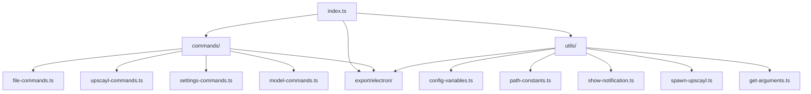
### 主进程职责

主进程 (`electron/index.ts`) 负责：

-   管理应用程序生命周期和窗口创建
-   从 `commands/` 目录注册 IPC 命令处理程序
-   生成用于 AI 图像处理的 `upscayl-bin` 进程
-   处理文件系统操作和路径管理
-   管理用于用户首选项的 electron-settings
-   通过 `electron-updater` 进行系统通知和自动更新

### IPC 通信流

> **[Mermaid sequence]**
> *(图表结构无法解析)*

来源：[package.json37](https://github.com/upscayl/upscayl/blob/1fdbd3e5/package.json#L37-L37) [tsconfig.json13](https://github.com/upscayl/upscayl/blob/1fdbd3e5/tsconfig.json#L13-L13) [tsconfig.json19](https://github.com/upscayl/upscayl/blob/1fdbd3e5/tsconfig.json#L19-L19) </old\_str> <new\_str>

## 主要目录 (Main Directories)

该仓库被组织为以下主要目录：

| 目录 | 用途 | 关键文件 | 输出位置 |
| --- | --- | --- | --- |
| `electron/` | Electron 主进程代码、IPC 处理程序、系统实用程序 | `index.ts`, `commands/`, `utils/` | `export/electron/` |
| `renderer/` | Next.js/React UI、组件、状态管理、本地化 | `pages/`, `components/`, `atoms/`, `locales/` | `renderer/out/` |
| `resources/` | AI 模型、平台二进制文件、图标、权限声明 | `models/`, `{os}/bin/`, `icons/`, `*.plist` | 与应用程序一起打包 |
| `common/` | 进程间共享的代码 | `feature-flags.ts`, `electron-commands.ts`, `models-list.ts` | `export/common/` |
| `scripts/` | 构建实用程序和验证 | `validate-schema.js`, `generate-schema.js` | 不适用 (仅限开发) |
| `export/` | 编译后的 TypeScript 输出 | 生成的 `.js` 文件 | 被 `electron-builder` 使用 |

### 配置文件

| 文件 | 用途 |
| --- | --- |
| `package.json` | 主要项目配置、依赖项、构建脚本、electron-builder 配置 |
| `tsconfig.json` | 带有路径映射 (Path mappings) 的根 TypeScript 配置 |
| `renderer/tsconfig.json` | 渲染进程特定的 TypeScript 配置 |
| `next.config.js` | 用于静态导出的 Next.js 配置 |
| `notarize.js` | 用于 App Store 构建的 macOS 公证 (Notarization) 脚本 |
| `.gitignore` | 构建输出和依赖项的 Git 忽略模式 |

来源：[package.json37](https://github.com/upscayl/upscayl/blob/1fdbd3e5/package.json#L37-L37) [package.json196-198](https://github.com/upscayl/upscayl/blob/1fdbd3e5/package.json#L196-L198) [tsconfig.json6](https://github.com/upscayl/upscayl/blob/1fdbd3e5/tsconfig.json#L6-L6) [tsconfig.json12-16](https://github.com/upscayl/upscayl/blob/1fdbd3e5/tsconfig.json#L12-L16) [renderer/tsconfig.json17-22](https://github.com/upscayl/upscayl/blob/1fdbd3e5/renderer/tsconfig.json#L17-L22) [next.config.js5-16](https://github.com/upscayl/upscayl/blob/1fdbd3e5/next.config.js#L5-L16) [notarize.js4-19](https://github.com/upscayl/upscayl/blob/1fdbd3e5/notarize.js#L4-L19)

## 主要目录

该仓库被组织为以下主要目录：

| 目录 | 用途 |
| --- | --- |
| `electron/` | 包含 Electron 主进程代码，包括 IPC 通信处理程序和实用函数 |
| `renderer/` | 包含基于 Next.js/React 的 UI，包括页面、组件、样式和本地化文件 |
| `resources/` | 包含 AI 模型、特定于平台的二进制文件、图标和权限声明 (Entitlements) |
| `common/` | 包含渲染进程和主进程之间的共享代码，如类型、常量和特性标志 (Feature flags) |
| `scripts/` | 包含构建和实用脚本，包括本地化的模式验证 |
| `build/` | 包含构建配置和资产 (Assets) |
| `export/` | 编译后的 TypeScript 文件的输出目录 |

来源：[package.json197-198](https://github.com/upscayl/upscayl/blob/1fdbd3e5/package.json#L197-L198) [package.json82-104](https://github.com/upscayl/upscayl/blob/1fdbd3e5/package.json#L82-L104) [tsconfig.json6-7](https://github.com/upscayl/upscayl/blob/1fdbd3e5/tsconfig.json#L6-L7)

## 前端组织 (渲染进程)

`renderer/` 目录包含应用程序的基于 Next.js/React 的前端。其结构遵循 Next.js 约定，但针对 Electron 静态导出进行了调整。

### 渲染进程结构

```mermaid
flowchart TD
    EN_JSON["en.json (base)"]
    OTHER_LOCALES["*.json (other languages)"]
    USER_SETTINGS["user-settings-atom.ts"]
    TRANSLATIONS["translations-atom.ts"]
    IMAGE_PATH["image-path-atom.ts"]
    MODEL["model-atom.ts"]
    UPSCAYL_TAB["upscayl-tab/"]
    UPSCAYL_STEPS["upscayl-steps.tsx"]
    SELECT_MODEL["select-model-dialog.tsx"]
    SETTINGS_TAB["settings-tab/"]
    AUTO_UPDATE["auto-update-toggle.tsx"]
    CONTRIBUTIONS["enable-contributions-toggle.tsx"]
    SIDEBAR["sidebar/"]
    HOOKS["hooks/"]
    UI["ui/"]
    MAIN_CONTENT["main-content/"]
    PAGES["pages/"]
    COMPONENTS["components/"]
    ATOMS["atoms/"]
    LOCALES["locales/"]
    LIB["lib/"]
    STYLES["styles/"]
    R_CONFIG["tsconfig.json"]
    RENDERER_OUT["renderer/out/"]

    PAGES --> COMPONENTS
    COMPONENTS --> ATOMS
    COMPONENTS --> LOCALES
    COMPONENTS --> LIB
    PAGES --> RENDERER_OUT
    COMPONENTS --> RENDERER_OUT
    UPSCAYL --> TAB_UPSCAYL_STEPS
    UPSCAYL --> TAB_SELECT_MODEL
    SETTINGS --> TAB_AUTO_UPDATE
    SETTINGS --> TAB_CONTRIBUTIONS
```
### 组件组织示例

关键组件文件及其结构：

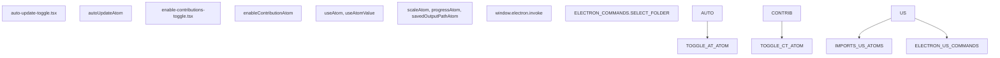
### 前端技术栈

-   **Next.js**：在 `next.config.js` 中使用 `output: "export"` 配置为静态导出
-   **React**：带有函数组件和 Hook 的 UI 框架
-   **Jotai**：带有原子状态 (Atomic state) 更新的状态管理
-   **Tailwind CSS + DaisyUI**：带有组件库的实用程序优先 CSS 框架
-   **TypeScript**：带有渲染进程特定 `tsconfig.json` 配置的类型安全
-   **国际化**：带有模式验证 (Schema validation) 的基于 JSON 的区域设置文件

来源：[renderer/components/sidebar/upscayl-tab/upscayl-steps.tsx1-17](https://github.com/upscayl/upscayl/blob/1fdbd3e5/renderer/components/sidebar/upscayl-tab/upscayl-steps.tsx#L1-L17) [renderer/components/sidebar/settings-tab/auto-update-toggle.tsx1-27](https://github.com/upscayl/upscayl/blob/1fdbd3e5/renderer/components/sidebar/settings-tab/auto-update-toggle.tsx#L1-L27) [renderer/components/sidebar/settings-tab/enable-contributions-toggle.tsx1-31](https://github.com/upscayl/upscayl/blob/1fdbd3e5/renderer/components/sidebar/settings-tab/enable-contributions-toggle.tsx#L1-L31) [renderer/tsconfig.json17-22](https://github.com/upscayl/upscayl/blob/1fdbd3e5/renderer/tsconfig.json#L17-L22) [next.config.js5-16](https://github.com/upscayl/upscayl/blob/1fdbd3e5/next.config.js#L5-L16)

## 构建配置 (Build Configuration)

Upscayl 使用 Electron Builder 进行打包和分发。构建配置在 `package.json` 的 `build` 键下定义，并为特定平台提供了额外的配置文件。

### 构建系统架构

```mermaid
flowchart TD
    PKG_BUILD["package.json build"]
    MAS_JSON["mas.json"]
    MAS_DEV["mas-dev.json"]
    MAC_DEV["mac-dev.json"]
    NOTARIZE_JS["notarize.js"]
    TSC["tsc (TypeScript compilation)"]
    VALIDATE["validate-schema"]
    NEXT_BUILD["next build renderer"]
    ELECTRON_BUILDER["electron-builder"]
    DIST_MAC["dist:mac, dist:mac-arm64"]
    DIST_WIN["dist:win, dist:msi"]
    DIST_LINUX["dist:appimage, dist:flatpak, dist:deb, dist:rpm"]
    DIST_MAS["dist:mas, dist:mas-dev"]
    EXPORT_DIR["export/"]
    RENDERER_OUT["renderer/out/"]
    LOCALES["renderer/locales/*.json"]
    MAC_DMG["macOS DMG"]
    MAC_ZIP["macOS ZIP (Universal)"]
    WIN_NSIS["Windows NSIS Installer"]
    LINUX_APPIMAGE["Linux AppImage"]
    FLATPAK["Flatpak Package"]
    MAS_PKG["Mac App Store Package"]

    TSC --> EXPORT_DIR
    NEXT --> BUILD_RENDERER_OUT
    VALIDATE --> LOCALES
    ELECTRON --> BUILDER_PKG_BUILD
    DIST --> MAS_MAS_JSON
    DIST --> MAC_NOTARIZE_JS
    DIST --> MAC_MAC_DMG
    DIST --> MAC_MAC_ZIP
    DIST --> WIN_WIN_NSIS
    DIST --> LINUX_LINUX_APPIMAGE
    DIST --> LINUX_FLATPAK
    DIST --> MAS_MAS_PKG
```
### 资源打包配置

```mermaid
flowchart TD
    PLATFORM_BINS["resources/${os}/bin → resources/bin"]
    AI_MODELS["resources/models → resources/models"]
    ICONS["resources/icons/.png → resources/.png"]
    ASAR_TRUE["asar: true"]
    ASAR_UNPACK["asarUnpack: /node_modules/sharp//*"]
    MAC_CONFIG["mac: hardenedRuntime, entitlements, minimumSystemVersion"]
    WIN_CONFIG["win: publisherName, NSIS installer"]
    LINUX_CONFIG["linux: category, maintainer, multiple targets"]
    MAS_CONFIG["mas: category, entitlements, provisioningProfile"]
    NOTARIZE["notarize.js"]

    MAC --> CONFIG_NOTARIZE
    EXTRA --> FILES_PLATFORM_BINS
    ASAR --> CONFIG_ASAR_UNPACK
```
### 模式验证系统 (Schema Validation System)

构建过程包括对国际化文件的验证：

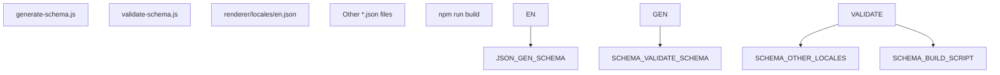
### 构建脚本流

完整的构建过程遵循以下顺序：

1.  `tsc` - 将 TypeScript 文件编译到 `export/` 目录
2.  `validate-schema` - 根据基础模式 (Base schema) 验证所有区域设置文件
3.  `next build renderer` - 构建 Next.js 应用到 `renderer/out/`
4.  `electron-builder` - 使用平台特定的配置打包应用程序

来源：[package.json73-202](https://github.com/upscayl/upscayl/blob/1fdbd3e5/package.json#L73-L202) [package.json38-71](https://github.com/upscayl/upscayl/blob/1fdbd3e5/package.json#L38-L71) [notarize.js4-19](https://github.com/upscayl/upscayl/blob/1fdbd3e5/notarize.js#L4-L19) [scripts/validate-schema.js8-36](https://github.com/upscayl/upscayl/blob/1fdbd3e5/scripts/validate-schema.js#L8-L36) [scripts/generate-schema.js1-36](https://github.com/upscayl/upscayl/blob/1fdbd3e5/scripts/generate-schema.js#L1-L36)

## 资源与资产 (Resources and Assets)

`resources/` 目录包含应用程序所需的各种资产和平台特定文件：

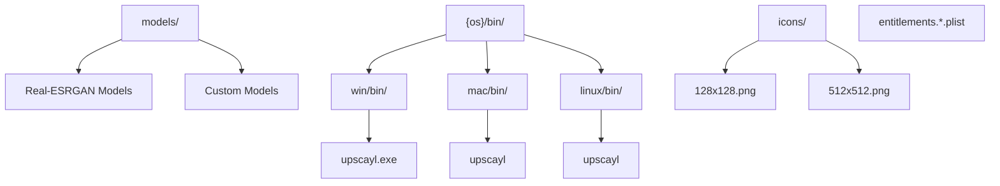
资源目录包含：

-   **AI 模型**：用于图像放大的预训练模型 (Real-ESRGAN)
-   **特定于平台的二进制文件**：针对不同操作系统编译的二进制文件 (upscayl-bin)
-   **图标**：各种格式和分辨率的应用程序图标
-   **权限声明 (Entitlements)**：用于 App Store 合规和公证的 macOS 特定权限文件

来源：[package.json82-104](https://github.com/upscayl/upscayl/blob/1fdbd3e5/package.json#L82-L104) [package.json106-127](https://github.com/upscayl/upscayl/blob/1fdbd3e5/package.json#L106-L127) [package.json97-104](https://github.com/upscayl/upscayl/blob/1fdbd3e5/package.json#L97-L104)

## 开发与构建工作流

开发与构建工作流是通过 `package.json` 脚本编排的，这些脚本处理 TypeScript 编译、验证和打包。

### 开发工作流

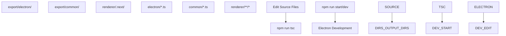
### 生产构建流水线

```mermaid
flowchart TD
    BUILD_START["npm run build"]
    TSC_COMPILE["tsc"]
    VALIDATE_STEP["validate-schema"]
    NEXT_BUILD["next build renderer"]
    BUILD_COMPLETE["Build Complete"]
    EN_BASE["en.json (base schema)"]
    OTHER_LANGS["All *.json locale files"]
    GEN_SCRIPT["generate-schema.js"]
    VAL_SCRIPT["validate-schema.js"]
    DIST_COMMAND["npm run dist"]
    ELECTRON_BUILDER["electron-builder"]
    PLATFORM_PACKAGES["Platform-specific packages"]

    BUILD --> START_TSC_COMPILE
    TSC --> COMPILE_VALIDATE_STEP
    VALIDATE --> STEP_NEXT_BUILD
    NEXT --> BUILD_BUILD_COMPLETE
    VALIDATE --> STEP_GEN_SCRIPT
    GEN --> SCRIPT_EN_BASE
    VAL --> SCRIPT_OTHER_LANGS
    BUILD --> COMPLETE_DIST_COMMAND
    DIST --> COMMAND_ELECTRON_BUILDER
    ELECTRON --> BUILDER_PLATFORM_PACKAGES
```
### 特定于平台的构建命令

```mermaid
flowchart TD
    DIST_DMG["dist:dmg"]
    DIST_APPIMAGE["dist:appimage"]
    DIST_FLATPAK["dist:flatpak"]
    DIST_DEB["dist:deb"]
    DIST_RPM["dist:rpm"]
    DIST_MAC["dist:macUniversal macOS"]
    DIST_MAC_ARM["dist:mac-arm64ARM64 macOS"]
    DIST_WIN["dist:winWindows NSIS"]
    DIST_LINUX["dist:linuxAll Linux formats"]
    DIST_MAS["dist:masMac App Store"]
    ENABLE_STORE["enable-store(modifies feature-flags.ts)"]
    DISABLE_STORE["disable-store(reverts feature-flags.ts)"]
    NOTARIZE_FLOW["macOS notarization(notarize.js)"]

    DIST --> MAS_ENABLE_STORE
    DIST --> MAS_NOTARIZE_FLOW
    PLATFORM --> SCRIPTS_SPECIFIC_FORMATS
```
### 关键脚本命令

| 命令 | 用途 | 步骤 |
| --- | --- | --- |
| `npm run dev` | 开发 | `tsc` → 启动 Electron |
| `npm run build` | 生产构建 | `tsc` → `validate-schema` → `next build renderer` |
| `npm run dist` | 打包分发 | `build` → `electron-builder` |
| `npm run validate-schema` | 验证 i18n 文件 | 根据 `en.json` 模式检查所有区域设置文件 |

该工作流清晰地分离了关注点：TypeScript 编译处理后端，Next.js 处理前端构建，模式验证确保 i18n 一致性，而 electron-builder 处理最终打包及平台特定配置。

来源：[package.json38-71](https://github.com/upscayl/upscayl/blob/1fdbd3e5/package.json#L38-L71) [scripts/validate-schema.js8-36](https://github.com/upscayl/upscayl/blob/1fdbd3e5/scripts/validate-schema.js#L8-L36) [scripts/generate-schema.js1-36](https://github.com/upscayl/upscayl/blob/1fdbd3e5/scripts/generate-schema.js#L1-L36) [package.json69-70](https://github.com/upscayl/upscayl/blob/1fdbd3e5/package.json#L69-L70)

## 特定于平台的组件

Upscayl 支持多个平台，并针对每个平台进行了特定的调整：

| 平台 | 特定组件 | 构建脚本 |
| --- | --- | --- |
| Windows | Windows 特定二进制文件和 NSIS 安装程序 | `dist:win`, `dist:msi` |
| macOS | 通用和 ARM64 构建、App Store (MAS) 打包、权限声明、公证 | `dist:mac`, `dist:mac-arm64`, `dist:mas` |
| Linux | 多种分发格式 (AppImage, Flatpak, DEB, RPM) | `dist:appimage`, `dist:flatpak`, `dist:deb`, `dist:rpm` |

每个平台都有：

-   用于 AI 放大引擎的自定义二进制可执行文件 (`upscayl-bin`)
-   特定于平台的打包配置
-   文件路径处理调整
-   特定于操作系统的 UI 调整
-   用于平台特定行为的特性标志 (例如，`APP_STORE_BUILD`)

来源：[package.json128-195](https://github.com/upscayl/upscayl/blob/1fdbd3e5/package.json#L128-L195) [package.json45-67](https://github.com/upscayl/upscayl/blob/1fdbd3e5/package.json#L45-L67) [renderer/components/sidebar/upscayl-tab/upscayl-steps.tsx204-214](https://github.com/upscayl/upscayl/blob/1fdbd3e5/renderer/components/sidebar/upscayl-tab/upscayl-steps.tsx#L204-L214)

## 目录关系

此图显示了不同目录中的代码如何相互交互：

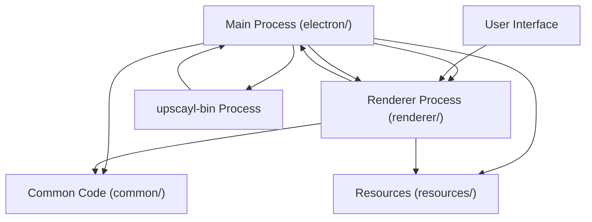
来源：[package.json37-38](https://github.com/upscayl/upscayl/blob/1fdbd3e5/package.json#L37-L38) [renderer/components/sidebar/upscayl-tab/upscayl-steps.tsx62](https://github.com/upscayl/upscayl/blob/1fdbd3e5/renderer/components/sidebar/upscayl-tab/upscayl-steps.tsx#L62-L62)

## 开发与构建工作流

开发与构建工作流在 package.json 脚本中定义：

-   **开发**：`npm run start` 或 `npm run dev` 编译 TypeScript 并运行 Electron
-   **构建**：`npm run build` 编译 TypeScript、验证模式并构建 Next.js 渲染进程
-   **打包**：`npm run dist` 构建并打包应用程序以供分发
-   **平台特定构建**：针对每个平台和分发格式的单独脚本
-   **模式验证**：`npm run validate-schema` 根据模式验证本地化文件

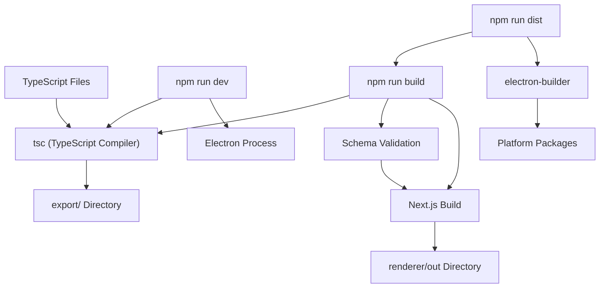
开发工作流涉及编辑源目录中的文件，运行开发服务器以测试更改，并使用构建脚本创建可分发的包。

来源：[package.json38-72](https://github.com/upscayl/upscayl/blob/1fdbd3e5/package.json#L38-L72) [package.json42-43](https://github.com/upscayl/upscayl/blob/1fdbd3e5/package.json#L42-L43) [scripts/validate-schema.js8-36](https://github.com/upscayl/upscayl/blob/1fdbd3e5/scripts/validate-schema.js#L8-L36)

## 结论

对 Upscayl 项目结构的概述为理解代码库的组织方式奠定了基础。主进程 (后端) 和渲染进程 (前端) 之间的清晰分离是标准的 Electron 模式，而资源和平台特定代码的组织突出了该应用程序的跨平台特性。

有关这些组件在运行时如何交互的更多详细信息，请参阅 [应用程序架构 (Application Architecture)](/upscayl/upscayl/2-application-architecture) 以及随后关于特定子系统的页面。
