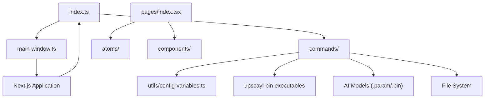
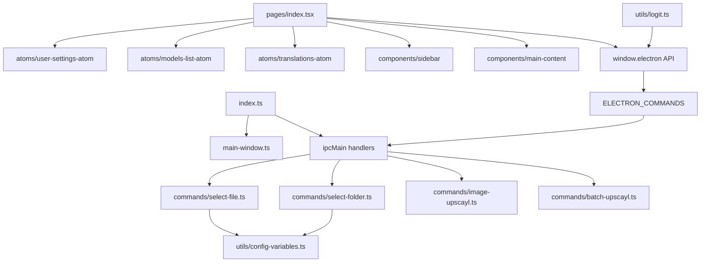
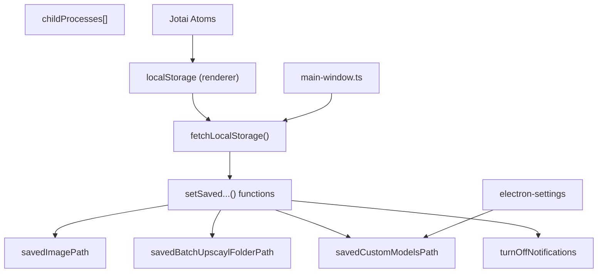
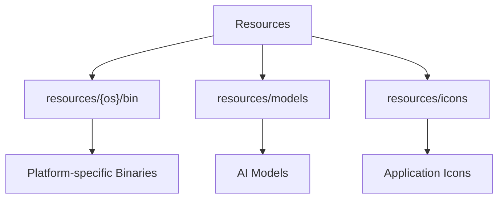
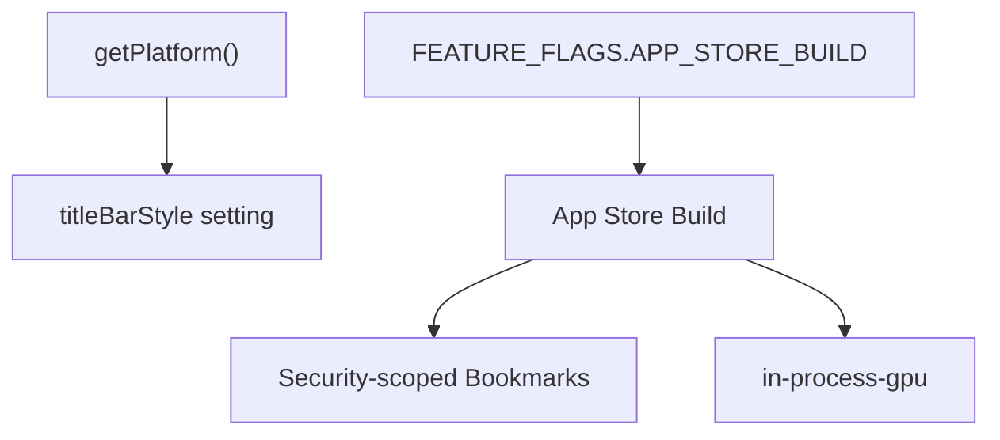
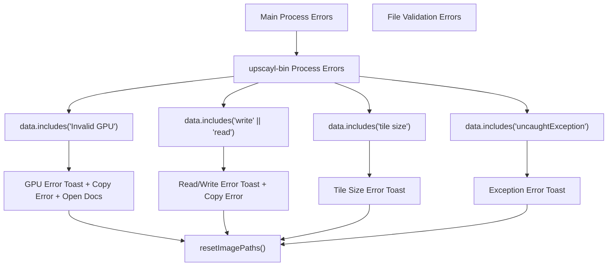

# Application Architecture (应用架构)

Relevant source files (相关源文件)

-   [electron/commands/custom-models-select.ts](https://github.com/upscayl/upscayl/blob/1fdbd3e5/electron/commands/custom-models-select.ts)
-   [electron/commands/get-models-list.ts](https://github.com/upscayl/upscayl/blob/1fdbd3e5/electron/commands/get-models-list.ts)
-   [electron/commands/select-file.ts](https://github.com/upscayl/upscayl/blob/1fdbd3e5/electron/commands/select-file.ts)
-   [electron/commands/select-folder.ts](https://github.com/upscayl/upscayl/blob/1fdbd3e5/electron/commands/select-folder.ts)
-   [electron/commands/stop.ts](https://github.com/upscayl/upscayl/blob/1fdbd3e5/electron/commands/stop.ts)
-   [electron/index.ts](https://github.com/upscayl/upscayl/blob/1fdbd3e5/electron/index.ts)
-   [electron/main-window.ts](https://github.com/upscayl/upscayl/blob/1fdbd3e5/electron/main-window.ts)
-   [electron/utils/config-variables.ts](https://github.com/upscayl/upscayl/blob/1fdbd3e5/electron/utils/config-variables.ts)
-   [electron/utils/get-models.ts](https://github.com/upscayl/upscayl/blob/1fdbd3e5/electron/utils/get-models.ts)
-   [electron/utils/logit.ts](https://github.com/upscayl/upscayl/blob/1fdbd3e5/electron/utils/logit.ts)
-   [renderer/pages/index.tsx](https://github.com/upscayl/upscayl/blob/1fdbd3e5/renderer/pages/index.tsx)

本页面提供了 Upscayl 核心架构的概述，解释了应用程序的高层组织以及其主要组件如何交互。有关特定子系统的详细信息，请参阅 [Main Process (主进程)](/upscayl/upscayl/2.1-main-process)、[Renderer Process (渲染进程)](/upscayl/upscayl/2.2-renderer-process) 和 [State Management (状态管理)](/upscayl/upscayl/2.3-inter-process-communication)。

## System Overview (系统概述)

Upscayl 是作为一个带有 Next.js React 前端的 Electron 应用程序构建的。它遵循标准的 Electron 架构，带有一个处理系统级操作的 Main Process，以及一个管理用户界面的 Renderer Process。应用程序的核心功能围绕着由平台特定 `upscayl-bin` 可执行文件执行的 AI-powered image upscaling (AI 驱动的图像放大)。

Sources: [electron/index.ts1-125](https://github.com/upscayl/upscayl/blob/1fdbd3e5/electron/index.ts#L1-L125) [electron/main-window.ts1-82](https://github.com/upscayl/upscayl/blob/1fdbd3e5/electron/main-window.ts#L1-L82) [renderer/pages/index.tsx1-360](https://github.com/upscayl/upscayl/blob/1fdbd3e5/renderer/pages/index.tsx#L1-L360) [electron/utils/config-variables.ts1-126](https://github.com/upscayl/upscayl/blob/1fdbd3e5/electron/utils/config-variables.ts#L1-L126)

## Process Architecture (进程架构)

Upscayl 遵循 Electron 的 Process Model (进程模型)，具有两种主要的进程类型：

1.  **Main Process**: 一个单一的 Node.js 进程，控制应用程序的生命周期，管理窗口并处理系统级操作
2.  **Renderer Process**: 一个基于 Chromium 的进程，使用 Next.js 和 React 渲染用户界面

Sources: [electron/index.ts1-125](https://github.com/upscayl/upscayl/blob/1fdbd3e5/electron/index.ts#L1-L125) [electron/main-window.ts1-82](https://github.com/upscayl/upscayl/blob/1fdbd3e5/electron/main-window.ts#L1-L82) [renderer/pages/index.tsx1-360](https://github.com/upscayl/upscayl/blob/1fdbd3e5/renderer/pages/index.tsx#L1-L360) [electron/commands/select-file.ts1-87](https://github.com/upscayl/upscayl/blob/1fdbd3e5/electron/commands/select-file.ts#L1-L87) [electron/commands/select-folder.ts1-50](https://github.com/upscayl/upscayl/blob/1fdbd3e5/electron/commands/select-folder.ts#L1-L50) [electron/utils/config-variables.ts1-126](https://github.com/upscayl/upscayl/blob/1fdbd3e5/electron/utils/config-variables.ts#L1-L126)

## Initialization Flow (初始化流程)

当 Upscayl 启动时，它遵循以下初始化序列：

> **[Mermaid sequence]**
> *(图表结构无法解析)*

Sources: [electron/index.ts28-71](https://github.com/upscayl/upscayl/blob/1fdbd3e5/electron/index.ts#L28-L71) [electron/main-window.ts12-75](https://github.com/upscayl/upscayl/blob/1fdbd3e5/electron/main-window.ts#L12-L75) [renderer/pages/index.tsx27-295](https://github.com/upscayl/upscayl/blob/1fdbd3e5/renderer/pages/index.tsx#L27-L295) [electron/utils/config-variables.ts82-125](https://github.com/upscayl/upscayl/blob/1fdbd3e5/electron/utils/config-variables.ts#L82-L125)

## Command-based Architecture (基于命令的架构)

Upscayl 使用 Command-based Architecture 进行 Main Process 和 Renderer Process 之间的通信。命令在一个共享的常量文件中定义，并由 Main Process 中专门的 handler (处理器) 函数处理。

### Command Registration (命令注册)

Main Process 使用 `ipcMain.handle()` 处理 Request-Response Patterns (请求-响应模式)，并使用 `ipcMain.on()` 处理 Fire-and-forget Commands (发后即忘命令) 来注册 IPC handler：

```mermaid
flowchart TD
    IPCMain["ipcMain"]
    SelectFileCmd["ELECTRON_COMMANDS.SELECT_FILE"]
    SelectFolderCmd["ELECTRON_COMMANDS.SELECT_FOLDER"]
    CustomModelsCmd["ELECTRON_COMMANDS.SELECT_CUSTOM_MODEL_FOLDER"]
    GetGPUInfo["get-gpu-info"]
    GetAppVersion["get-app-version"]
    StopCmd["ELECTRON_COMMANDS.STOP"]
    OpenFolderCmd["ELECTRON_COMMANDS.OPEN_FOLDER"]
    GetModelsCmd["ELECTRON_COMMANDS.GET_MODELS_LIST"]
    UpscaylCmd["ELECTRON_COMMANDS.UPSCAYL"]
    FolderUpscaylCmd["ELECTRON_COMMANDS.FOLDER_UPSCAYL"]
    DoubleUpscaylCmd["ELECTRON_COMMANDS.DOUBLE_UPSCAYL"]
    PasteImageCmd["ELECTRON_COMMANDS.PASTE_IMAGE"]
    SelectFileHandler["commands/select-file.ts"]
    SelectFolderHandler["commands/select-folder.ts"]
    CustomModelsHandler["commands/custom-models-select.ts"]
    StopHandler["commands/stop.ts"]
    ImageUpscaylHandler["commands/image-upscayl.ts"]
    BatchUpscaylHandler["commands/batch-upscayl.ts"]
    DoubleUpscaylHandler["commands/double-upscayl.ts"]
    PasteImageHandler["commands/paste-image.ts"]

    SelectFileCmd --> SelectFileHandler
    SelectFolderCmd --> SelectFolderHandler
    CustomModelsCmd --> CustomModelsHandler
    StopCmd --> StopHandler
    UpscaylCmd --> ImageUpscaylHandler
    FolderUpscaylCmd --> BatchUpscaylHandler
    DoubleUpscaylCmd --> DoubleUpscaylHandler
    PasteImageCmd --> PasteImageHandler
```

Sources: [electron/index.ts84-124](https://github.com/upscayl/upscayl/blob/1fdbd3e5/electron/index.ts#L84-L124) [electron/commands/select-file.ts8-86](https://github.com/upscayl/upscayl/blob/1fdbd3e5/electron/commands/select-file.ts#L8-L86) [electron/commands/select-folder.ts10-49](https://github.com/upscayl/upscayl/blob/1fdbd3e5/electron/commands/select-folder.ts#L10-L49) [electron/commands/stop.ts5-16](https://github.com/upscayl/upscayl/blob/1fdbd3e5/electron/commands/stop.ts#L5-L16) [electron/commands/custom-models-select.ts14-68](https://github.com/upscayl/upscayl/blob/1fdbd3e5/electron/commands/custom-models-select.ts#L14-L68)

### Configuration Management (配置管理)

应用程序使用具有三个存储层的 Hybrid Configuration (混合配置) 方法：

**Configuration Variables (配置变量):**

| Variable | Storage | Purpose |
| --- | --- | --- |
| `savedImagePath` | Main process memory | 用于文件对话框的最后选择的图像路径 |
| `savedBatchUpscaylFolderPath` | Main process memory | 用于批量操作的最后选择的文件夹路径 |
| `savedCustomModelsPath` | Main process memory | 自定义模型文件夹位置 |
| `childProcesses` | Main process memory | 用于取消的活动放大进程 |
| `turnOffNotifications` | Main process memory | 通知偏好设置 |

Sources: [electron/utils/config-variables.ts1-126](https://github.com/upscayl/upscayl/blob/1fdbd3e5/electron/utils/config-variables.ts#L1-L126) [electron/main-window.ts53-70](https://github.com/upscayl/upscayl/blob/1fdbd3e5/electron/main-window.ts#L53-L70) [electron/commands/select-file.ts36-39](https://github.com/upscayl/upscayl/blob/1fdbd3e5/electron/commands/select-file.ts#L36-L39) [electron/commands/select-folder.ts11-22](https://github.com/upscayl/upscayl/blob/1fdbd3e5/electron/commands/select-folder.ts#L11-L22)

## Resource Management (资源管理)

Upscayl 管理平台特定的资源，特别是 AI upscaling binary (AI 放大二进制文件) 和模型文件：

Sources: [package.json82-104](https://github.com/upscayl/upscayl/blob/1fdbd3e5/package.json#L82-L104)

## Build System (构建系统)

Upscayl 支持多个平台，并为每个平台提供了专门的构建配置：

| Platform | Build Targets | Special Handling |
| --- | --- | --- |
| Windows | NSIS installer, ZIP | \- |
| macOS | DMG, ZIP, Universal binary | Notarization (公证), hardened runtime (硬化运行时) |
| Linux | AppImage, Flatpak, DEB, RPM | \- |
| Mac App Store | MAS package | 特殊权限, in-process GPU |

Sources: [package.json38-71](https://github.com/upscayl/upscayl/blob/1fdbd3e5/package.json#L38-L71) [package.json127-195](https://github.com/upscayl/upscayl/blob/1fdbd3e5/package.json#L127-L195) [electron/index.ts78-82](https://github.com/upscayl/upscayl/blob/1fdbd3e5/electron/index.ts#L78-L82)

## Platform-specific Considerations (平台特定注意事项)

Upscayl 包含平台特定的代码路径，以处理操作系统之间的差异：

Sources: [electron/main-window.ts30](https://github.com/upscayl/upscayl/blob/1fdbd3e5/electron/main-window.ts#L30-L30) [electron/index.ts78-82](https://github.com/upscayl/upscayl/blob/1fdbd3e5/electron/index.ts#L78-L82) [electron/commands/select-file.ts36-39](https://github.com/upscayl/upscayl/blob/1fdbd3e5/electron/commands/select-file.ts#L36-L39)

## IPC Communication Pattern (IPC 通信模式)

应用程序使用具有两种主要通信方法的 Bidirectional IPC (Inter-Process Communication，双向进程间通信) 模式：

**Request-Response Pattern (invoke/handle):**

> **[Mermaid sequence]**
> *(图表结构无法解析)*

**Event Broadcasting Pattern (on/send):**

> **[Mermaid sequence]**
> *(图表结构无法解析)*

**Renderer 中的 IPC Event Listener (事件监听器):** `Home` 组件为这些事件设置了监听器：

-   `ELECTRON_COMMANDS.LOG` - 后端日志记录
-   `ELECTRON_COMMANDS.SCALING_AND_CONVERTING` - 处理状态
-   `ELECTRON_COMMANDS.UPSCAYL_PROGRESS` - 单张图像进度
-   `ELECTRON_COMMANDS.FOLDER_UPSCAYL_PROGRESS` - 批量进度
-   `ELECTRON_COMMANDS.DOUBLE_UPSCAYL_PROGRESS` - 双重放大进度
-   `ELECTRON_COMMANDS.UPSCAYL_DONE` - 单张图像完成
-   `ELECTRON_COMMANDS.FOLDER_UPSCAYL_DONE` - 批量完成
-   `ELECTRON_COMMANDS.DOUBLE_UPSCAYL_DONE` - 双重放大完成
-   `ELECTRON_COMMANDS.CUSTOM_MODEL_FILES_LIST` - 自定义模型列表更新

Sources: [renderer/pages/index.tsx52-64](https://github.com/upscayl/upscayl/blob/1fdbd3e5/renderer/pages/index.tsx#L52-L64) [renderer/pages/index.tsx168-294](https://github.com/upscayl/upscayl/blob/1fdbd3e5/renderer/pages/index.tsx#L168-L294) [electron/index.ts88-90](https://github.com/upscayl/upscayl/blob/1fdbd3e5/electron/index.ts#L88-L90) [electron/commands/select-file.ts8-84](https://github.com/upscayl/upscayl/blob/1fdbd3e5/electron/commands/select-file.ts#L8-L84) [electron/utils/logit.ts5-15](https://github.com/upscayl/upscayl/blob/1fdbd3e5/electron/utils/logit.ts#L5-L15)

## Error Handling (错误处理)

Upscayl 实现了对不同错误类型进行分类的 Centralized Error Handling (集中式错误处理) 机制：

**Error Handling Flow (错误处理流程):**

1.  在进度更新或显式错误事件中检测到错误
2.  `handleErrors()` 函数通过内容匹配对错误进行分类
3.  显示带有操作按钮的适当 Toast Notifications (Toast 通知)
4.  通过 `resetImagePaths()` 重置应用程序状态
5.  某些错误包括 "Copy Error (复制错误)" 和 "Open Docs (打开文档)" 操作

**Error Event Types (错误事件类型):**

-   `ELECTRON_COMMANDS.UPSCAYL_ERROR` - 显式错误事件
-   `ELECTRON_COMMANDS.UPSCAYL_WARNING` - 警告通知
-   包含错误文本的进度事件 (GPU, read/write, tile size, exceptions)

Sources: [renderer/pages/index.tsx105-166](https://github.com/upscayl/upscayl/blob/1fdbd3e5/renderer/pages/index.tsx#L105-L166) [renderer/pages/index.tsx179-191](https://github.com/upscayl/upscayl/blob/1fdbd3e5/renderer/pages/index.tsx#L179-L191) [renderer/pages/index.tsx308-319](https://github.com/upscayl/upscayl/blob/1fdbd3e5/renderer/pages/index.tsx#L308-L319)

## Application Structure Overview (应用程序结构概述)

下表总结了 Upscayl 代码库中的关键目录及其用途：

| Directory | Purpose |
| --- | --- |
| `electron/` | 包含 Main Process 代码 |
| `electron/commands/` | IPC 消息的命令 handler |
| `electron/utils/` | Main Process 使用的实用函数 |
| `renderer/` | 包含 Renderer Process 代码 (React 应用程序) |
| `renderer/pages/` | React 页面组件 |
| `renderer/components/` | 可重用的 React 组件 |
| `renderer/atoms/` | 用于状态管理的 Jotai atom |
| `common/` | Main Process 和 Renderer Process 之间的共享代码 |
| `resources/` | 应用程序资源，包括二进制文件和模型 |

Sources: [package.json37](https://github.com/upscayl/upscayl/blob/1fdbd3e5/package.json#L37-L37) [package.json82-104](https://github.com/upscayl/upscayl/blob/1fdbd3e5/package.json#L82-L104) [electron/index.ts3-22](https://github.com/upscayl/upscayl/blob/1fdbd3e5/electron/index.ts#L3-L22)

## Summary (总结)

Upscayl 遵循清晰的 Separation of Concerns (关注点分离)，Electron Main Process 处理系统级操作，React Renderer Process 提供用户界面。这些进程之间的通信通过使用命令模式的定义良好的 IPC 机制进行。该应用程序旨在跨平台，并针对平台特定要求进行了专门处理，特别是针对 Mac App Store 构建。

有关特定子系统的更多详细信息，请参阅 [Main Process (主进程)](/upscayl/upscayl/2.1-main-process)、[Renderer Process (渲染进程)](/upscayl/upscayl/2.2-renderer-process) 和 [State Management (状态管理)](/upscayl/upscayl/2.3-inter-process-communication)。
