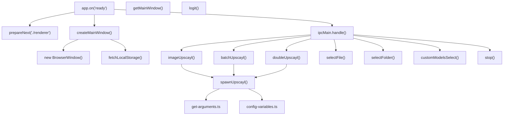
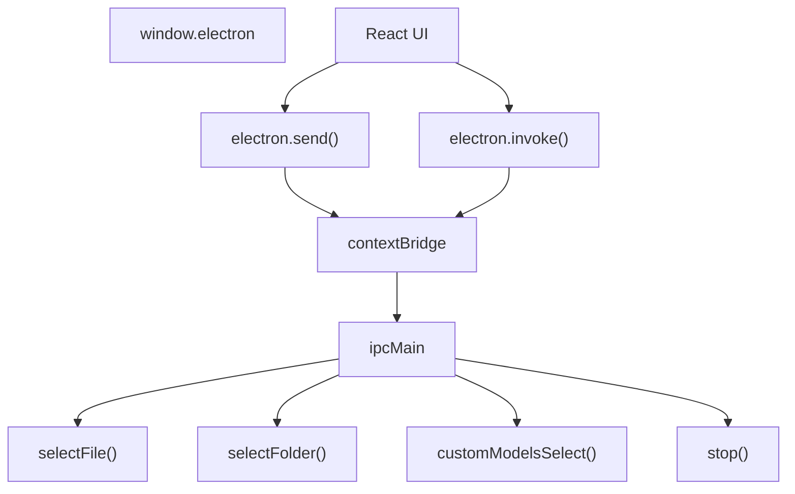
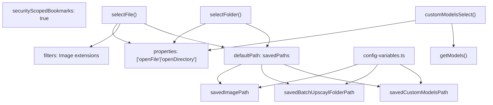
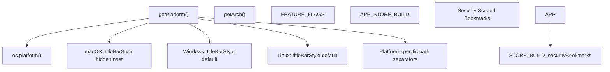
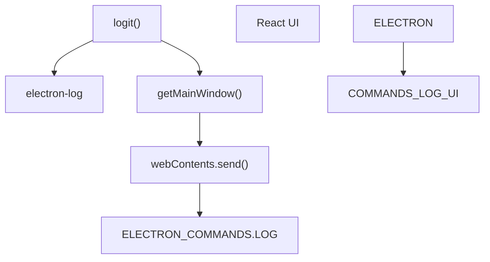

# Main Process (主进程)

Relevant source files (相关源文件)

-   [common/types/types.d.ts](https://github.com/upscayl/upscayl/blob/1fdbd3e5/common/types/types.d.ts)
-   [electron/commands/batch-upscayl.ts](https://github.com/upscayl/upscayl/blob/1fdbd3e5/electron/commands/batch-upscayl.ts)
-   [electron/commands/custom-models-select.ts](https://github.com/upscayl/upscayl/blob/1fdbd3e5/electron/commands/custom-models-select.ts)
-   [electron/commands/double-upscayl.ts](https://github.com/upscayl/upscayl/blob/1fdbd3e5/electron/commands/double-upscayl.ts)
-   [electron/commands/get-models-list.ts](https://github.com/upscayl/upscayl/blob/1fdbd3e5/electron/commands/get-models-list.ts)
-   [electron/commands/image-upscayl.ts](https://github.com/upscayl/upscayl/blob/1fdbd3e5/electron/commands/image-upscayl.ts)
-   [electron/commands/select-file.ts](https://github.com/upscayl/upscayl/blob/1fdbd3e5/electron/commands/select-file.ts)
-   [electron/commands/select-folder.ts](https://github.com/upscayl/upscayl/blob/1fdbd3e5/electron/commands/select-folder.ts)
-   [electron/commands/stop.ts](https://github.com/upscayl/upscayl/blob/1fdbd3e5/electron/commands/stop.ts)
-   [electron/main-window.ts](https://github.com/upscayl/upscayl/blob/1fdbd3e5/electron/main-window.ts)
-   [electron/utils/config-variables.ts](https://github.com/upscayl/upscayl/blob/1fdbd3e5/electron/utils/config-variables.ts)
-   [electron/utils/get-arguments.ts](https://github.com/upscayl/upscayl/blob/1fdbd3e5/electron/utils/get-arguments.ts)
-   [electron/utils/get-models.ts](https://github.com/upscayl/upscayl/blob/1fdbd3e5/electron/utils/get-models.ts)
-   [electron/utils/logit.ts](https://github.com/upscayl/upscayl/blob/1fdbd3e5/electron/utils/logit.ts)

Electron Main Process (主进程) 作为 Upscayl 桌面应用程序的 Backend Orchestrator (后端协调器)。它管理系统资源，协调 AI 放大操作，并提供与 Renderer Process (渲染进程) 的安全 IPC (进程间通信) 通信。主进程架构围绕 Command Handler (命令处理器) 构建，执行文件操作、进程管理和模型选择。

## Overview (概述)

Main Process 实现了模块化的 Command-based Architecture (基于命令的架构)，具有以下核心职责：

| Component | Primary Files | Purpose |
| --- | --- | --- |
| Window Management (窗口管理) | `electron/main-window.ts` | `createMainWindow()`, `getMainWindow()` 函数 |
| IPC Command Handlers (IPC 命令处理器) | `electron/commands/*.ts` | 文件操作、放大命令、模型管理 |
| Process Management (进程管理) | `electron/utils/spawn-upscayl.ts` | 用于 AI binary 执行的 `spawnUpscayl()` 函数 |
| Configuration (配置) | `electron/utils/config-variables.ts` | 状态管理和 localStorage 持久化 |
| Utilities (实用工具) | `electron/utils/*.ts` | 日志记录、设备规格、路径处理 |

### Main Process Code Architecture (主进程代码架构)


Sources: [electron/main-window.ts1-82](https://github.com/upscayl/upscayl/blob/1fdbd3e5/electron/main-window.ts#L1-L82) [electron/commands/image-upscayl.ts1-186](https://github.com/upscayl/upscayl/blob/1fdbd3e5/electron/commands/image-upscayl.ts#L1-L186) [electron/commands/batch-upscayl.ts1-159](https://github.com/upscayl/upscayl/blob/1fdbd3e5/electron/commands/batch-upscayl.ts#L1-L159) [electron/commands/double-upscayl.ts1-230](https://github.com/upscayl/upscayl/blob/1fdbd3e5/electron/commands/double-upscayl.ts#L1-L230) [electron/utils/spawn-upscayl.ts1-26](https://github.com/upscayl/upscayl/blob/1fdbd3e5/electron/utils/spawn-upscayl.ts#L1-L26) [electron/utils/config-variables.ts1-126](https://github.com/upscayl/upscayl/blob/1fdbd3e5/electron/utils/config-variables.ts#L1-L126)

## Initialization Process (初始化过程)

应用程序启动始于 `electron/index.ts`，具有一系列初始化步骤，准备主进程，建立 IPC 通信，并创建应用程序窗口。

### Startup Sequence (启动序列)

> **[Mermaid sequence]**
> *(图表结构无法解析)*

初始化过程为 `common/electron-commands.ts` 中定义的所有主要命令注册 IPC handler。每个处理器对应于 `electron/commands/` 中的一个特定操作模块。

### IPC Handler Registration (IPC 处理器注册)

Main Process 为以下命令类型注册处理器：

| Command | Handler Function | Purpose |
| --- | --- | --- |
| `SELECT_FILE` | `selectFile()` | 图像文件选择对话框 |
| `SELECT_FOLDER` | `selectFolder()` | 批量处理文件夹选择 |
| `UPSCAYL` | `imageUpscayl()` | 单张图像放大 |
| `FOLDER_UPSCAYL` | `batchUpscayl()` | 文件夹批量放大 |
| `DOUBLE_UPSCAYL` | `doubleUpscayl()` | 两阶段放大过程 |
| `STOP` | `stop()` | 进程终止 |
| `SELECT_CUSTOM_MODEL_FOLDER` | `customModelsSelect()` | 自定义 AI 模型选择 |

Sources: [electron/main-window.ts12-75](https://github.com/upscayl/upscayl/blob/1fdbd3e5/electron/main-window.ts#L12-L75) [electron/commands/select-file.ts8-84](https://github.com/upscayl/upscayl/blob/1fdbd3e5/electron/commands/select-file.ts#L8-L84) [electron/commands/batch-upscayl.ts20-156](https://github.com/upscayl/upscayl/blob/1fdbd3e5/electron/commands/batch-upscayl.ts#L20-L156) [electron/commands/image-upscayl.ts26-183](https://github.com/upscayl/upscayl/blob/1fdbd3e5/electron/commands/image-upscayl.ts#L26-L183)

### Main Entry Point (主入口点)

应用程序的主入口点在 `electron/index.ts` 中，它执行以下步骤：

1.  初始化日志记录
2.  准备 Next.js Renderer Process
3.  注册用于处理文件路径的文件协议
4.  创建主应用程序窗口
5.  注册用于与渲染器通信的 IPC handler
6.  设置平台特定配置
7.  配置 Auto-updates (自动更新，用于非 App Store 构建)

初始化代码段注册文件协议以处理文件访问：

```
protocol.registerFileProtocol("file", (request, callback) => {  const pathname = decodeURI(request.url.replace("file:///", ""));  callback(pathname);});
```
Sources: [electron/main-window.ts33-41](https://github.com/upscayl/upscayl/blob/1fdbd3e5/electron/main-window.ts#L33-L41)

## Window Management (窗口管理)

`electron/main-window.ts` 模块通过两个主要函数管理主应用程序窗口：`createMainWindow()` 和 `getMainWindow()`。窗口配置包括平台特定的适配和安全设置。

### BrowserWindow Configuration (BrowserWindow 配置)


窗口管理系统包括：

1.  **Window Creation (窗口创建)**: 具有指定尺寸的 `new BrowserWindow()` [electron/main-window.ts16-31](https://github.com/upscayl/upscayl/blob/1fdbd3e5/electron/main-window.ts#L16-L31)
2.  **Platform Adaptation (平台适配)**: `titleBarStyle: getPlatform() === "mac" ? "hiddenInset" : "default"` [electron/main-window.ts30](https://github.com/upscayl/upscayl/blob/1fdbd3e5/electron/main-window.ts#L30-L30)
3.  **Security Configuration (安全配置)**: 位于 `join(__dirname, "preload.js")` 的 Preload script (预加载脚本) [electron/main-window.ts28](https://github.com/upscayl/upscayl/blob/1fdbd3e5/electron/main-window.ts#L28-L28)
4.  **URL Loading (URL 加载)**: 开发构建与生产构建的条件加载 [electron/main-window.ts33-41](https://github.com/upscayl/upscayl/blob/1fdbd3e5/electron/main-window.ts#L33-L41)
5.  **External Link Handling (外部链接处理)**: 用于安全的 `webContents.setWindowOpenHandler()` [electron/main-window.ts43-46](https://github.com/upscayl/upscayl/blob/1fdbd3e5/electron/main-window.ts#L43-L46)
6.  **LocalStorage Initialization (LocalStorage 初始化)**: 窗口创建后的 `fetchLocalStorage()` 调用 [electron/main-window.ts53](https://github.com/upscayl/upscayl/blob/1fdbd3e5/electron/main-window.ts#L53-L53)

### Window Lifecycle Management (窗口生命周期管理)

窗口遵循特定的初始化序列：

1.  使用配置创建 `BrowserWindow` 实例
2.  加载渲染器 URL (开发或生产)
3.  设置外部链接处理器以确保安全
4.  在 `ready-to-show` 事件时显示窗口
5.  从 localStorage 获取配置
6.  初始化 auto-updater (仅生产环境)
7.  向渲染器发送平台信息

Sources: [electron/main-window.ts12-75](https://github.com/upscayl/upscayl/blob/1fdbd3e5/electron/main-window.ts#L12-L75) [electron/utils/get-device-specs.ts1-20](https://github.com/upscayl/upscayl/blob/1fdbd3e5/electron/utils/get-device-specs.ts#L1-L20)

## IPC Communication (IPC 通信)

Main Process 通过 IPC 通道与 Renderer Process 通信。通信通过 Preload script 辅助，该脚本向渲染器暴露安全的 IPC 方法。

### IPC Communication Flow (IPC 通信流)


### Preload Script (预加载脚本)

`electron/preload.ts` 中的 Preload script 在主进程和渲染进程之间建立了安全桥梁：


Preload script 向渲染器暴露以下 API：

1.  **send()**: 与主进程的单向通信
2.  **on()**: 监听来自主进程的事件
3.  **invoke()**: 具有返回值的双向通信
4.  **Platform detection (平台检测)**: 用于操作系统特定行为的 `getPlatform()`
5.  **System information (系统信息)**: 设备规格和应用程序版本

Main Process 为渲染器可以调用的各种命令注册处理器：

1.  文件/文件夹选择对话框
2.  图像放大操作
3.  模型选择和管理
4.  进程控制 (启动/停止)
5.  系统信息检索

Sources: [electron/preload.ts1-21](https://github.com/upscayl/upscayl/blob/1fdbd3e5/electron/preload.ts#L1-L21)

### IPC Command System (IPC 命令系统)

Main Process 实现了基于命令的架构，其中每个命令由 `electron/commands/` 中的专门模块处理。命令在 `common/electron-commands.ts` 中定义，并通过 `ipcMain.handle()` 注册。

### Core Command Handlers Architecture (核心命令处理器架构)

```mermaid
flowchart TD
    SELECT_FILE["SELECT_FILE"]
    SELECT_FOLDER["SELECT_FOLDER"]
    UPSCAYL["UPSCAYL"]
    FOLDER_UPSCAYL["FOLDER_UPSCAYL"]
    DOUBLE_UPSCAYL["DOUBLE_UPSCAYL"]
    STOP["STOP"]
    SELECT_CUSTOM_MODEL_FOLDER["SELECT_CUSTOM_MODEL_FOLDER"]
    GET_MODELS_LIST["GET_MODELS_LIST"]
    selectFile["selectFile(event, payload)"]
    selectFolder["selectFolder(event, message)"]
    imageUpscayl["imageUpscayl(event, payload)"]
    batchUpscayl["batchUpscayl(event, payload)"]
    doubleUpscayl["doubleUpscayl(event, payload)"]
    stop["stop(event, payload)"]
    customModelsSelect["customModelsSelect(event, message)"]
    getModelsList["getModelsList(event, payload)"]

    SELECT --> FILE_selectFile
    SELECT --> FOLDER_selectFolder
    UPSCAYL --> imageUpscayl
    FOLDER --> UPSCAYL_batchUpscayl
    DOUBLE --> UPSCAYL_doubleUpscayl
    STOP --> stop
    SELECT --> CUSTOM_MODEL_FOLDER_customModelsSelect
    GET --> MODELS_LIST_getModelsList
```


### Command Handler Patterns (命令处理器模式)

每个命令处理器遵循一致的模式：

1.  **Input Validation (输入验证)**: 提取并验证有效负载参数
2.  **Main Window Access (主窗口访问)**: 使用 `getMainWindow()` 访问渲染器
3.  **Operation Execution (操作执行)**: 执行文件系统或进程操作
4.  **Response Handling (响应处理)**: 通过 `mainWindow.webContents.send()` 发送结果

来自 `imageUpscayl()` 的示例：

```
const imageUpscayl = async (event, payload: ImageUpscaylPayload) => {  const mainWindow = getMainWindow();  if (!mainWindow) return;    // Extract payload parameters  const { imagePath, outputPath, model, scale, gpuId } = payload;    // Execute upscaling operation  const upscayl = spawnUpscayl(getSingleImageArguments({...}), logit);    // Handle process events and send responses  upscayl.process.on("close", () => {    mainWindow.webContents.send(ELECTRON_COMMANDS.UPSCAYL_DONE, outFile);  });};
```
Sources: [electron/commands/image-upscayl.ts26-183](https://github.com/upscayl/upscayl/blob/1fdbd3e5/electron/commands/image-upscayl.ts#L26-L183) [electron/commands/batch-upscayl.ts20-156](https://github.com/upscayl/upscayl/blob/1fdbd3e5/electron/commands/batch-upscayl.ts#L20-L156) [electron/commands/double-upscayl.ts27-227](https://github.com/upscayl/upscayl/blob/1fdbd3e5/electron/commands/double-upscayl.ts#L27-L227) [electron/commands/select-file.ts8-84](https://github.com/upscayl/upscayl/blob/1fdbd3e5/electron/commands/select-file.ts#L8-L84) [electron/commands/stop.ts5-14](https://github.com/upscayl/upscayl/blob/1fdbd3e5/electron/commands/stop.ts#L5-L14)

## File System Operations (文件系统操作)

Main Process 通过 Electron 的 dialog API 和路径管理实用工具提供安全的文件系统访问。所有文件操作都通过专门的命令模块处理，这些模块实现了验证和平台特定的安全功能。

### File System Command Architecture (文件系统命令架构)


### File Selection Implementation (文件选择实现)

`selectFile()` 函数实现了带有验证的图像文件选择：

1.  **Dialog Configuration (对话框配置)**: 使用具有图像文件过滤器的 `dialog.showOpenDialog()` [electron/commands/select-file.ts11-34](https://github.com/upscayl/upscayl/blob/1fdbd3e5/electron/commands/select-file.ts#L11-L34)
2.  **File Validation (文件验证)**: 针对允许的格式检查文件扩展名 [electron/commands/select-file.ts47-65](https://github.com/upscayl/upscayl/blob/1fdbd3e5/electron/commands/select-file.ts#L47-L65)
3.  **Path Persistence (路径持久化)**: 通过 `setSavedImagePath()` 更新 `savedImagePath` [electron/commands/select-file.ts45](https://github.com/upscayl/upscayl/blob/1fdbd3e5/electron/commands/select-file.ts#L45-L45)
4.  **Security Bookmarks (安全书签)**: 处理 App Store 沙箱要求 [electron/commands/select-file.ts36-39](https://github.com/upscayl/upscayl/blob/1fdbd3e5/electron/commands/select-file.ts#L36-L39)

### Folder Operations (文件夹操作)

`selectFolder()` 函数管理用于批量操作的目录选择：

1.  **Directory Selection (目录选择)**: `properties: ["openDirectory"]` 配置 [electron/commands/select-folder.ts28-32](https://github.com/upscayl/upscayl/blob/1fdbd3e5/electron/commands/select-folder.ts#L28-L32)
2.  **Bookmark Management (书签管理)**: 用于 App Store 构建的 Security scoped bookmarks (安全范围书签) [electron/commands/select-folder.ts12-22](https://github.com/upscayl/upscayl/blob/1fdbd3e5/electron/commands/select-folder.ts#L12-L22)
3.  **Path Storage (路径存储)**: 更新 `savedBatchUpscaylFolderPath` 状态 [electron/commands/select-folder.ts43](https://github.com/upscayl/upscayl/blob/1fdbd3e5/electron/commands/select-folder.ts#L43-L43)

### Custom Model Management (自定义模型管理)

`customModelsSelect()` 函数处理 AI 模型文件夹选择：

1.  **Folder Validation (文件夹验证)**: 确保选择的文件夹命名为 "models" [electron/commands/custom-models-select.ts42-55](https://github.com/upscayl/upscayl/blob/1fdbd3e5/electron/commands/custom-models-select.ts#L42-L55)
2.  **Model Discovery (模型发现)**: 使用 `getModels()` 扫描 `.param` 和 `.bin` 文件 [electron/commands/custom-models-select.ts57-61](https://github.com/upscayl/upscayl/blob/1fdbd3e5/electron/commands/custom-models-select.ts#L57-L61)
3.  **Model List Response (模型列表响应)**: 向渲染器发送 `CUSTOM_MODEL_FILES_LIST` [electron/commands/custom-models-select.ts58-61](https://github.com/upscayl/upscayl/blob/1fdbd3e5/electron/commands/custom-models-select.ts#L58-L61)

Sources: [electron/commands/select-file.ts8-84](https://github.com/upscayl/upscayl/blob/1fdbd3e5/electron/commands/select-file.ts#L8-L84) [electron/commands/select-folder.ts10-47](https://github.com/upscayl/upscayl/blob/1fdbd3e5/electron/commands/select-folder.ts#L10-L47) [electron/commands/custom-models-select.ts14-66](https://github.com/upscayl/upscayl/blob/1fdbd3e5/electron/commands/custom-models-select.ts#L14-L66) [electron/utils/get-models.ts7-73](https://github.com/upscayl/upscayl/blob/1fdbd3e5/electron/utils/get-models.ts#L7-L73)

## Configuration Management (配置管理)

`electron/utils/config-variables.ts` 模块为主进程提供了集中式的 State Management (状态管理)。它维护了跨操作持久化的应用程序状态，并提供了与渲染器 localStorage 的同步。

### Configuration Variables Architecture (配置变量架构)


### State Variables (状态变量)

配置系统管理以下状态类别：

| Category | Variables | Purpose |
| --- | --- | --- |
| File Paths (文件路径) | `savedImagePath`, `savedBatchUpscaylFolderPath`, `savedCustomModelsPath` | 对话框默认路径 |
| Process Control (进程控制) | `stopped`, `childProcesses[]` | 放大进程管理 |
| User Preferences (用户偏好) | `turnOffNotifications` | 应用程序行为设置 |

### LocalStorage Synchronization (LocalStorage 同步)

`fetchLocalStorage()` 函数桥接了主进程状态与渲染器 localStorage：

```
// GET LAST IMAGE PATH FROM LOCAL STORAGEmainWindow.webContents  .executeJavaScript('localStorage.getItem("lastImagePath");', true)  .then((lastImagePath: string | null) => {    if (lastImagePath && lastImagePath.length > 0) {      setSavedImagePath(lastImagePath);    }  });
```
### Process State Management (进程状态管理)

子进程跟踪通过 `childProcesses` 数组实现：

1.  **Process Registration (进程注册)**: `setChildProcesses()` 添加生成的进程 [electron/utils/config-variables.ts67-79](https://github.com/upscayl/upscayl/blob/1fdbd3e5/electron/utils/config-variables.ts#L67-L79)
2.  **Process Termination (进程终止)**: `stop()` 命令迭代并杀死所有进程 [electron/commands/stop.ts10-13](https://github.com/upscayl/upscayl/blob/1fdbd3e5/electron/commands/stop.ts#L10-L13)
3.  **State Flags (状态标志)**: `stopped` 布尔值控制进程生命周期 [electron/utils/config-variables.ts42-65](https://github.com/upscayl/upscayl/blob/1fdbd3e5/electron/utils/config-variables.ts#L42-L65)

配置系统通过 `logit()` 实用工具为所有状态更改提供日志记录，确保状态修改的可追溯性。

Sources: [electron/utils/config-variables.ts10-125](https://github.com/upscayl/upscayl/blob/1fdbd3e5/electron/utils/config-variables.ts#L10-L125) [electron/commands/stop.ts5-14](https://github.com/upscayl/upscayl/blob/1fdbd3e5/electron/commands/stop.ts#L5-L14) [electron/utils/logit.ts5-13](https://github.com/upscayl/upscayl/blob/1fdbd3e5/electron/utils/logit.ts#L5-L13)

## Platform-Specific Adaptations (平台特定适配)

Main Process 包含针对不同平台的特殊处理，特别是为了 macOS App Store 的合规性。

### Platform Detection and Adaptation (平台检测与适配)


关键平台适配包括：

1.  **macOS App Store Build**: 用于沙箱合规性的特殊配置

    -   使用 `app.startAccessingSecurityScopedResource()` 的用于文件访问的 Security scoped bookmarks
    -   在 `electron-settings` 中存储书签
2.  **Window Management (窗口管理)**: 基于不同平台的不同标题栏样式

    -   macOS 为 `titleBarStyle: "hiddenInset"`
    -   Windows 和 Linux 为 `titleBarStyle: "default"`
3.  **File Path Handling (文件路径处理)**: 平台特定的路径分隔符

    -   Windows 使用 `\\` 反斜杠
    -   类 Unix 系统使用 `/` 正斜杠

Sources: [electron/main-window.ts30-31](https://github.com/upscayl/upscayl/blob/1fdbd3e5/electron/main-window.ts#L30-L31) [electron/commands/select-file.ts36-39](https://github.com/upscayl/upscayl/blob/1fdbd3e5/electron/commands/select-file.ts#L36-L39) [electron/utils/get-device-specs.ts6-20](https://github.com/upscayl/upscayl/blob/1fdbd3e5/electron/utils/get-device-specs.ts#L6-L20) [electron/utils/slash.ts1-4](https://github.com/upscayl/upscayl/blob/1fdbd3e5/electron/utils/slash.ts#L1-L4)

## Logging and Error Handling (日志记录与错误处理)

Main Process 实现了统一的日志记录系统，捕获来自主进程和渲染进程的日志。

### Logging Architecture (日志记录架构)


日志记录系统：

1.  使用 `electron-log` 进行持久化文件日志记录
2.  通过 `webContents.send()` 将日志转发到 Renderer Process 进行显示
3.  为用户友好的错误消息提供结构化的错误处理
4.  通过 `logit()` 实用函数集中化日志记录

`logit()` 函数作为一个集中式日志记录机制：

-   写入 electron-log 以进行文件持久化
-   通过 IPC 向渲染器发送日志消息以进行实时显示
-   采用可变参数以实现灵活的消息格式化

Sources: [electron/utils/logit.ts5-13](https://github.com/upscayl/upscayl/blob/1fdbd3e5/electron/utils/logit.ts#L5-L13)

## Upscaling Process Management (放大进程管理)

Main Process 通过三个主要的命令处理器编排 AI 放大操作：`imageUpscayl()`、`batchUpscayl()` 和 `doubleUpscayl()`。每个处理器通过 `spawnUpscayl()` 实用工具管理子进程生成、进度监控和结果交付。

### Upscaling Command Flow (放大命令流)

> **[Mermaid sequence]**
> *(图表结构无法解析)*

### Process Management Implementation (进程管理实现)

放大系统实现了三种不同的操作模式：

| Command Handler | File | Purpose | Key Functions |
| --- | --- | --- | --- |
| `imageUpscayl()` | `electron/commands/image-upscayl.ts` | 单张图像处理 | `getSingleImageArguments()`, `spawnUpscayl()` |
| `batchUpscayl()` | `electron/commands/batch-upscayl.ts` | 文件夹批量处理 | `getBatchArguments()`, `spawnUpscayl()` |
| `doubleUpscayl()` | `electron/commands/double-upscayl.ts` | 双阶段放大 | `getDoubleUpscaleArguments()`, dual process spawning |

### Argument Generation System (参数生成系统)

```mermaid
flowchart TD
    getSingleImageArguments["getSingleImageArguments()"]
    getBatchArguments["getBatchArguments()"]
    getDoubleUpscaleArguments["getDoubleUpscaleArguments()"]
    getDoubleUpscaleSecondPassArguments["getDoubleUpscaleSecondPassArguments()"]
    inputFlag["-i inputPath"]
    outputFlag["-o outputPath"]
    modelFlag["-m modelsPath"]
    nameFlag["-n modelName"]
    gpuFlag["-g gpuId"]
    scaleFlag["-s scale"]
    formatFlag["-f saveImageAs"]
    customWidthFlag["-w customWidth"]
    compressionFlag["-c compression"]
    tileSizeFlag["-t tileSize"]
    ttaModeFlag["-x ttaMode"]

    getSingleImageArguments --> inputFlag
    getSingleImageArguments --> outputFlag
    getSingleImageArguments --> modelFlag
    getBatchArguments --> inputFlag
    getBatchArguments --> outputFlag
    getDoubleUpscaleArguments --> inputFlag
    getDoubleUpscaleArguments --> outputFlag
```


### Process Event Handling (进程事件处理)

每个放大命令处理器遵循一致的事件处理模式：

1.  **Data Events (数据事件)**: `upscayl.process.stderr.on("data", onData)` 用于进度监控 [electron/commands/image-upscayl.ts128-143](https://github.com/upscayl/upscayl/blob/1fdbd3e5/electron/commands/image-upscayl.ts#L128-L143)
2.  **Error Events (错误事件)**: `upscayl.process.on("error", onError)` 用于失败处理 [electron/commands/image-upscayl.ts144-154](https://github.com/upscayl/upscayl/blob/1fdbd3e5/electron/commands/image-upscayl.ts#L144-L154)
3.  **Close Events (关闭事件)**: `upscayl.process.on("close", onClose)` 用于完成处理 [electron/commands/image-upscayl.ts155-177](https://github.com/upscayl/upscayl/blob/1fdbd3e5/electron/commands/image-upscayl.ts#L155-L177)

### Process Control and Termination (进程控制与终止)

`stop()` 命令提供集中式的进程终止：

```
const stop = async (event, payload) => {  setStopped(true);  mainWindow && mainWindow.setProgressBar(-1);  childProcesses.forEach((child) => {    logit("🛑 Stopping Upscaling Process", child.process.pid);    child.kill();  });};
```
这确保了当用户取消操作时，所有活动的放大进程都能被正确终止。

Sources: [electron/commands/image-upscayl.ts26-183](https://github.com/upscayl/upscayl/blob/1fdbd3e5/electron/commands/image-upscayl.ts#L26-L183) [electron/commands/batch-upscayl.ts20-156](https://github.com/upscayl/upscayl/blob/1fdbd3e5/electron/commands/batch-upscayl.ts#L20-L156) [electron/commands/double-upscayl.ts27-227](https://github.com/upscayl/upscayl/blob/1fdbd3e5/electron/commands/double-upscayl.ts#L27-L227) [electron/utils/get-arguments.ts6-247](https://github.com/upscayl/upscayl/blob/1fdbd3e5/electron/utils/get-arguments.ts#L6-L247) [electron/commands/stop.ts5-14](https://github.com/upscayl/upscayl/blob/1fdbd3e5/electron/commands/stop.ts#L5-L14)

## Summary (总结)

Upscayl 中的 Main Process 作为应用程序的主干，管理系统资源，处理文件操作并协调放大活动。它遵循基于命令的架构与渲染进程通信，具有清晰的 Separation of Concerns，以实现可维护性和可扩展性。
