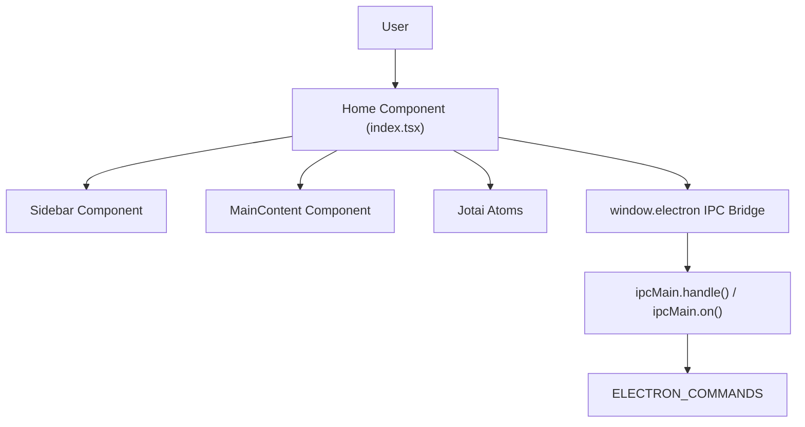
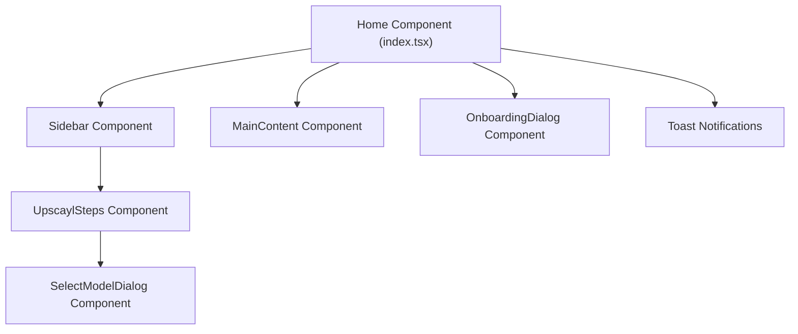
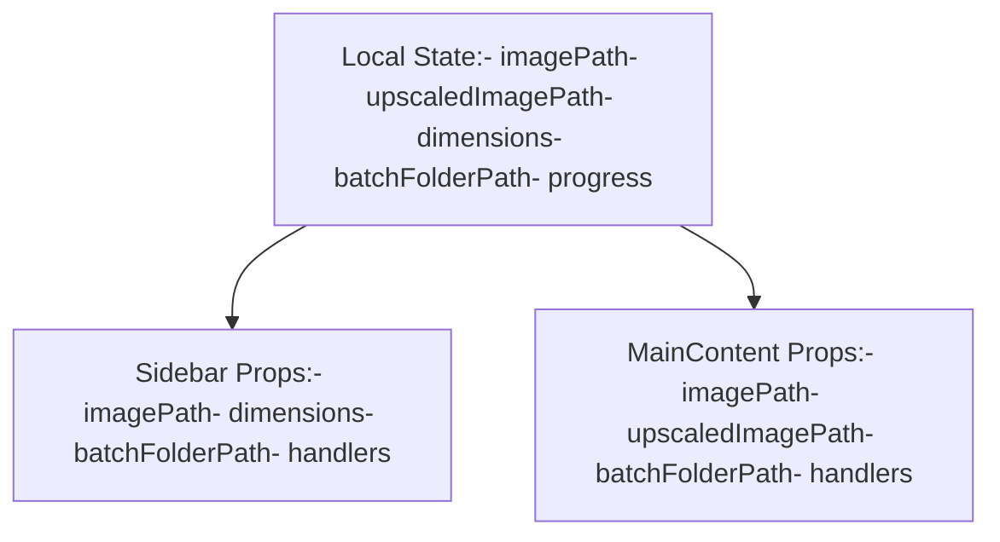
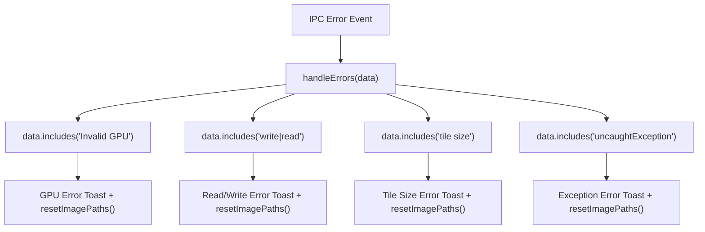
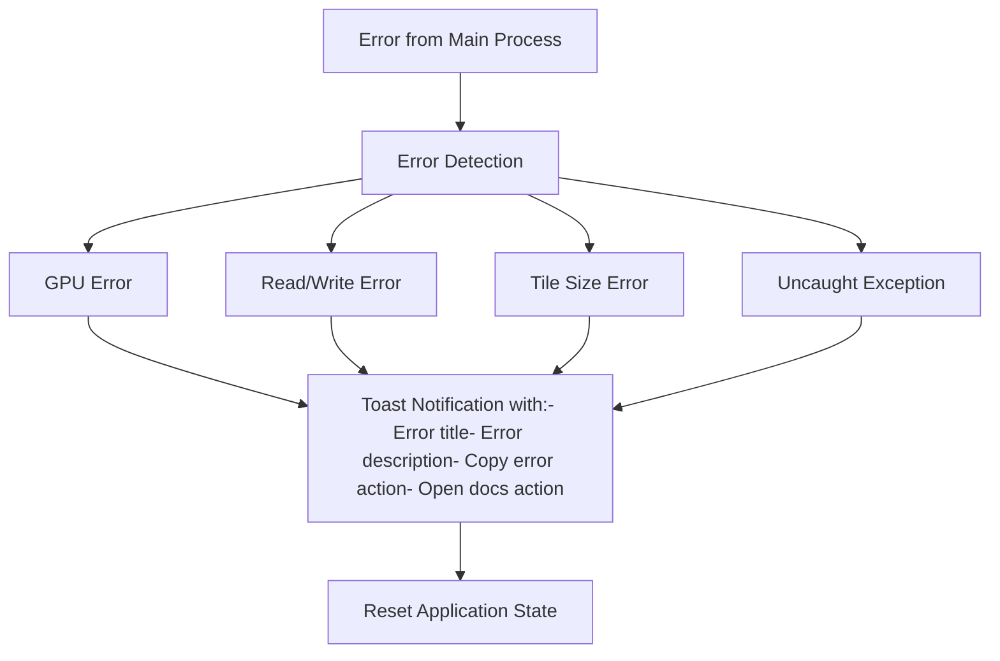
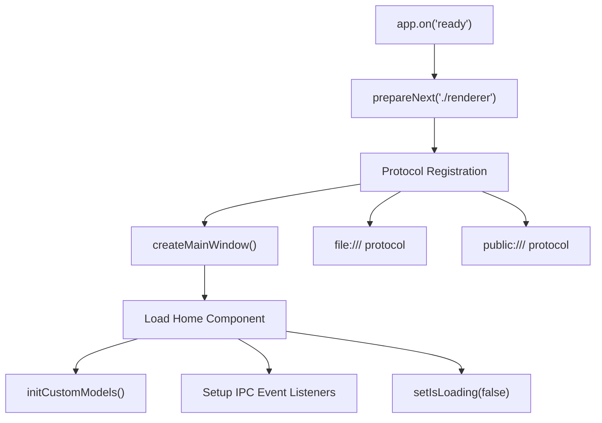

# Renderer Process (渲染进程)

Relevant source files (相关源文件)

-   [electron/index.ts](https://github.com/upscayl/upscayl/blob/1fdbd3e5/electron/index.ts)
-   [package-lock.json](https://github.com/upscayl/upscayl/blob/1fdbd3e5/package-lock.json)
-   [package.json](https://github.com/upscayl/upscayl/blob/1fdbd3e5/package.json)
-   [renderer/components/sidebar/settings-tab/auto-update-toggle.tsx](https://github.com/upscayl/upscayl/blob/1fdbd3e5/renderer/components/sidebar/settings-tab/auto-update-toggle.tsx)
-   [renderer/components/sidebar/settings-tab/enable-contributions-toggle.tsx](https://github.com/upscayl/upscayl/blob/1fdbd3e5/renderer/components/sidebar/settings-tab/enable-contributions-toggle.tsx)
-   [renderer/pages/index.tsx](https://github.com/upscayl/upscayl/blob/1fdbd3e5/renderer/pages/index.tsx)

Renderer Process (渲染进程) 是 Upscayl 的前端用户界面层，使用带有 TypeScript 的 Next.js React 应用程序构建。它在与 Electron Main Process (主进程) 不同的独立进程中运行，并处理 UI 渲染、State Management (状态管理) 和 IPC (进程间通信) 通信。有关主进程后端功能的详细信息，请参阅 [Main Process (主进程)](/upscayl/upscayl/2.1-main-process)。

## Overview (概述)

Renderer Process 是一个配置为 Static Export (静态导出) 的 Next.js 应用程序，为 Upscayl 提供了完整的用户界面。它使用带有 Jotai 状态管理的 React 组件，并通过 IPC 命令与 Electron Main Process 进行通信以执行放大操作。

**Next.js Configuration (Next.js 配置)**

渲染器使用 Next.js 的静态导出模式，并针对 Electron 进行了特定的优化：

| Configuration | Value | Purpose |
| --- | --- | --- |
| `output` | `"export"` | 静态 HTML/CSS/JS 生成 |
| `images.unoptimized` | `true` | 禁用 Next.js 图像优化 |
| `experimental.externalDir` | `true` | 允许从渲染器目录之外进行导入 |

Sources: [next.config.js5-12](https://github.com/upscayl/upscayl/blob/1fdbd3e5/next.config.js#L5-L12)

**Renderer Process Architecture (渲染进程架构)**

Sources: [renderer/pages/index.tsx1-360](https://github.com/upscayl/upscayl/blob/1fdbd3e5/renderer/pages/index.tsx#L1-L360) [electron/index.ts84-124](https://github.com/upscayl/upscayl/blob/1fdbd3e5/electron/index.ts#L84-L124)

## Component Structure (组件结构)

渲染器遵循以 `Home` 组件为根的 React 组件架构。该应用程序被结构化为一个 Single-page Application (单页面应用程序)，主布局分为 `Sidebar` 和 `MainContent` 部分。

**Component Hierarchy (组件层级)**

**Key Component Responsibilities (关键组件职责)**

| Component | File Location | Primary Functions |
| --- | --- | --- |
| `Home` | `renderer/pages/index.tsx` | 根状态管理、IPC 事件处理、布局 |
| `Sidebar` | Imported at line 18 | 模型选择、设置、放大控制 |
| `MainContent` | Imported at line 19 | 图像显示、对比视图、拖放 |
| `OnboardingDialog` | Imported at line 24 | 初次用户引导 |
| `UpscaylSteps` | `renderer/components/sidebar/upscayl-tab/upscayl-steps.tsx` | 分步放大工作流 |

Sources: [renderer/pages/index.tsx18-19](https://github.com/upscayl/upscayl/blob/1fdbd3e5/renderer/pages/index.tsx#L18-L19) [renderer/pages/index.tsx327-355](https://github.com/upscayl/upscayl/blob/1fdbd3e5/renderer/pages/index.tsx#L327-L355) [renderer/components/sidebar/upscayl-tab/upscayl-steps.tsx22-37](https://github.com/upscayl/upscayl/blob/1fdbd3e5/renderer/components/sidebar/upscayl-tab/upscayl-steps.tsx#L22-L37)

## State Management (状态管理)

渲染器使用 Jotai 进行 Atomic State Management (原子状态管理)，每个 atom (原子) 处理一个特定的应用程序状态。状态通过 `useAtom`、`useAtomValue` 和 `useSetAtom` 钩子进行管理。

**Jotai Atom Architecture (Jotai Atom 架构)**

```mermaid
flowchart TD
    batchModeAtom["batchModeAtom"]
    savedOutputPathAtom["savedOutputPathAtom"]
    progressAtom["progressAtom"]
    rememberOutputFolderAtom["rememberOutputFolderAtom"]
    userStatsAtom["userStatsAtom"]
    scaleAtom["scaleAtom"]
    customWidthAtom["customWidthAtom"]
    useCustomWidthAtom["useCustomWidthAtom"]
    customModelIdsAtom["customModelIdsAtom"]
    translationAtom["translationAtom"]
    HomeComponent["Home Component"]
    UpscaylStepsComponent["UpscaylSteps Component"]

    HomeComponent --> batchModeAtom
    HomeComponent --> savedOutputPathAtom
    HomeComponent --> progressAtom
    HomeComponent --> userStatsAtom
    HomeComponent --> customModelIdsAtom
    HomeComponent --> translationAtom
    UpscaylStepsComponent --> scaleAtom
    UpscaylStepsComponent --> customWidthAtom
    UpscaylStepsComponent --> useCustomWidthAtom
```

**State Usage Patterns (状态使用模式)**

| Hook Pattern | Example Usage | Purpose |
| --- | --- | --- |
| `useAtomValue` | `useAtomValue(translationAtom)` | 对 atom 状态的只读访问 |
| `useSetAtom` | `useSetAtom(progressAtom)` | 用于更新状态的只写访问 |
| `useAtom` | `useAtom(scaleAtom)` | 对 atom 的读写访问 |

Sources: [renderer/pages/index.tsx4-12](https://github.com/upscayl/upscayl/blob/1fdbd3e5/renderer/pages/index.tsx#L4-L12) [renderer/pages/index.tsx42-50](https://github.com/upscayl/upscayl/blob/1fdbd3e5/renderer/pages/index.tsx#L42-L50) [renderer/components/sidebar/upscayl-tab/upscayl-steps.tsx50-55](https://github.com/upscayl/upscayl/blob/1fdbd3e5/renderer/components/sidebar/upscayl-tab/upscayl-steps.tsx#L50-L55)

## Component State and Props Flow (组件状态与 Props 流)

Home 组件维护主应用程序状态，并将其作为 props (属性) 传递给子组件 (Sidebar 和 MainContent)。这创建了一个 Unidirectional Data Flow (单向数据流)，其中 Home 组件中的状态更改会传递到子组件。

Sources: [renderer/pages/index.tsx35-50](https://github.com/upscayl/upscayl/blob/1fdbd3e5/renderer/pages/index.tsx#L35-L50) [renderer/pages/index.tsx325-345](https://github.com/upscayl/upscayl/blob/1fdbd3e5/renderer/pages/index.tsx#L325-L345)

## IPC Communication Pattern (IPC 通信模式)

渲染器通过 `window.electron` 桥接方法与主进程通信。`Home` 组件建立事件监听器并使用 `ELECTRON_COMMANDS` 常量调用命令。

**IPC Communication Flow (IPC 通信流)**

> **[Mermaid sequence]**
> *(图表结构无法解析)*

**IPC Command Invocation Examples (IPC 命令调用示例)**

| Action | IPC Call | Handler Location |
| --- | --- | --- |
| Select File | `window.electron.invoke(ELECTRON_COMMANDS.SELECT_FILE)` | [electron/index.ts90](https://github.com/upscayl/upscayl/blob/1fdbd3e5/electron/index.ts#L90-L90) |
| Select Folder | `window.electron.invoke(ELECTRON_COMMANDS.SELECT_FOLDER)` | [electron/index.ts88](https://github.com/upscayl/upscayl/blob/1fdbd3e5/electron/index.ts#L88-L88) |
| Start Upscaling | `window.electron.on(ELECTRON_COMMANDS.UPSCAYL, ...)` | [electron/index.ts99](https://github.com/upscayl/upscayl/blob/1fdbd3e5/electron/index.ts#L99-L99) |
| Batch Processing | `window.electron.on(ELECTRON_COMMANDS.FOLDER_UPSCAYL, ...)` | [electron/index.ts101](https://github.com/upscayl/upscayl/blob/1fdbd3e5/electron/index.ts#L101-L101) |

Sources: [renderer/pages/index.tsx54](https://github.com/upscayl/upscayl/blob/1fdbd3e5/renderer/pages/index.tsx#L54-L54) [renderer/pages/index.tsx168-294](https://github.com/upscayl/upscayl/blob/1fdbd3e5/renderer/pages/index.tsx#L168-L294) [electron/index.ts84-105](https://github.com/upscayl/upscayl/blob/1fdbd3e5/electron/index.ts#L84-L105)

## Key Components (关键组件)

### Home Component (Home 组件)

Home 组件 (`index.tsx`) 是渲染进程的主入口点。它：

1.  管理应用程序状态
2.  建立与主进程的 IPC 通信
3.  处理图像选择和验证
4.  协调放大过程
5.  渲染主 UI 布局

Sources: [renderer/pages/index.tsx27-352](https://github.com/upscayl/upscayl/blob/1fdbd3e5/renderer/pages/index.tsx#L27-L352)

### Sidebar Component (Sidebar 组件)

Sidebar 组件处理：

1.  模型选择
2.  缩放设置
3.  处理选项
4.  触发放大操作

Sources: [renderer/pages/index.tsx325-333](https://github.com/upscayl/upscayl/blob/1fdbd3e5/renderer/pages/index.tsx#L325-L333)

### MainContent Component (MainContent 组件)

MainContent 组件负责：

1.  显示选定和放大的图像
2.  图像对比界面
3.  Drag-and-drop (拖放) 功能
4.  图像尺寸显示

Sources: [renderer/pages/index.tsx334-345](https://github.com/upscayl/upscayl/blob/1fdbd3e5/renderer/pages/index.tsx#L334-L345)

## Event Handling (事件处理)

`Home` 组件在 `useEffect` 中建立事件监听器，以处理来自主进程的 IPC 事件。每个监听器管理放大工作流的特定阶段，并相应地更新 UI。

**IPC Event Listeners (IPC 事件监听器)**

| Event Command | Handler Location | State Updates |
| --- | --- | --- |
| `ELECTRON_COMMANDS.LOG` | [renderer/pages/index.tsx168-170](https://github.com/upscayl/upscayl/blob/1fdbd3e5/renderer/pages/index.tsx#L168-L170) | 仅控制台日志记录 |
| `ELECTRON_COMMANDS.SCALING_AND_CONVERTING` | [renderer/pages/index.tsx172-177](https://github.com/upscayl/upscayl/blob/1fdbd3e5/renderer/pages/index.tsx#L172-L177) | `setProgress("PROCESSING")` |
| `ELECTRON_COMMANDS.UPSCAYL_WARNING` | [renderer/pages/index.tsx179-184](https://github.com/upscayl/upscayl/blob/1fdbd3e5/renderer/pages/index.tsx#L179-L184) | Toast 通知 |
| `ELECTRON_COMMANDS.UPSCAYL_ERROR` | [renderer/pages/index.tsx186-192](https://github.com/upscayl/upscayl/blob/1fdbd3e5/renderer/pages/index.tsx#L186-L192) | Toast + `resetImagePaths()` |
| `ELECTRON_COMMANDS.UPSCAYL_PROGRESS` | [renderer/pages/index.tsx194-207](https://github.com/upscayl/upscayl/blob/1fdbd3e5/renderer/pages/index.tsx#L194-L207) | `setProgress(data)` + 错误处理 |
| `ELECTRON_COMMANDS.FOLDER_UPSCAYL_PROGRESS` | [renderer/pages/index.tsx209-221](https://github.com/upscayl/upscayl/blob/1fdbd3e5/renderer/pages/index.tsx#L209-L221) | 批量进度更新 |
| `ELECTRON_COMMANDS.DOUBLE_UPSCAYL_PROGRESS` | [renderer/pages/index.tsx223-235](https://github.com/upscayl/upscayl/blob/1fdbd3e5/renderer/pages/index.tsx#L223-L235) | 双重放大进度 |
| `ELECTRON_COMMANDS.UPSCAYL_DONE` | [renderer/pages/index.tsx237-250](https://github.com/upscayl/upscayl/blob/1fdbd3e5/renderer/pages/index.tsx#L237-L250) | `setUpscaledImagePath()` + 统计数据 |
| `ELECTRON_COMMANDS.FOLDER_UPSCAYL_DONE` | [renderer/pages/index.tsx252-267](https://github.com/upscayl/upscayl/blob/1fdbd3e5/renderer/pages/index.tsx#L252-L267) | `setUpscaledBatchFolderPath()` |
| `ELECTRON_COMMANDS.DOUBLE_UPSCAYL_DONE` | [renderer/pages/index.tsx269-285](https://github.com/upscayl/upscayl/blob/1fdbd3e5/renderer/pages/index.tsx#L269-L285) | 最终图像路径 + 重置计数器 |
| `ELECTRON_COMMANDS.CUSTOM_MODEL_FILES_LIST` | [renderer/pages/index.tsx287-294](https://github.com/upscayl/upscayl/blob/1fdbd3e5/renderer/pages/index.tsx#L287-L294) | `setModelIds(data)` |

**Error Handling Pattern (错误处理模式)**

Sources: [renderer/pages/index.tsx104-295](https://github.com/upscayl/upscayl/blob/1fdbd3e5/renderer/pages/index.tsx#L104-L295) [renderer/pages/index.tsx105-166](https://github.com/upscayl/upscayl/blob/1fdbd3e5/renderer/pages/index.tsx#L105-L166)

## Error Handling (错误处理)

Renderer Process 实现了全面的错误处理系统，该系统：

1.  捕获来自主进程的特定错误类型
2.  使用 Toast 通知系统显示适当的错误消息
3.  提供有关错误的上下文信息
4.  提供复制错误详细信息或打开文档等操作
5.  在需要时重置应用程序状态

Sources: [renderer/pages/index.tsx105-166](https://github.com/upscayl/upscayl/blob/1fdbd3e5/renderer/pages/index.tsx#L105-L166)

## Image Processing Workflow (图像处理工作流)

Renderer Process 通过一系列状态更新和 IPC 通信来管理图像处理工作流：

1.  用户选择图像或文件夹
2.  渲染器验证选择
3.  用户配置放大设置
4.  用户启动放大
5.  渲染器与主进程通信
6.  主进程执行放大
7.  渲染器接收进度更新
8.  渲染器显示放大结果

Sources: [renderer/pages/index.tsx52-101](https://github.com/upscayl/upscayl/blob/1fdbd3e5/renderer/pages/index.tsx#L52-L101) [renderer/pages/index.tsx172-277](https://github.com/upscayl/upscayl/blob/1fdbd3e5/renderer/pages/index.tsx#L172-L277)

## Initialization and Setup (初始化与设置)

渲染器初始化遵循在主进程和渲染进程之间协调的特定序列。

**Main Process Setup (主进程设置)**

1.  **Next.js Preparation**: `prepareNext("./renderer")` 为 Electron 配置 Next.js
2.  **Protocol Registration (协议注册)**: 注册文件和公共协议以加载资产
3.  **Main Window Creation (主窗口创建)**: `createMainWindow()` 生成渲染进程

**Renderer Process Initialization (渲染进程初始化)**

**Home Component Initialization Sequence (Home 组件初始化序列)**

| Step | Code Location | Purpose |
| --- | --- | --- |
| Custom Models Init | [renderer/pages/index.tsx33](https://github.com/upscayl/upscayl/blob/1fdbd3e5/renderer/pages/index.tsx#L33-L33) | 加载可用的 AI 模型 |
| State Initialization | [renderer/pages/index.tsx35-50](https://github.com/upscayl/upscayl/blob/1fdbd3e5/renderer/pages/index.tsx#L35-L50) | 设置局部组件状态 |
| IPC Listeners Setup | [renderer/pages/index.tsx104-295](https://github.com/upscayl/upscayl/blob/1fdbd3e5/renderer/pages/index.tsx#L104-L295) | 注册事件处理器 |
| Loading State Update | [renderer/pages/index.tsx298-300](https://github.com/upscayl/upscayl/blob/1fdbd3e5/renderer/pages/index.tsx#L298-L300) | 隐藏加载微标 |
| System Info Logging | [renderer/pages/index.tsx302-305](https://github.com/upscayl/upscayl/blob/1fdbd3e5/renderer/pages/index.tsx#L302-L305) | 记录系统信息 |

Sources: [electron/index.ts28-50](https://github.com/upscayl/upscayl/blob/1fdbd3e5/electron/index.ts#L28-L50) [renderer/pages/index.tsx27-305](https://github.com/upscayl/upscayl/blob/1fdbd3e5/renderer/pages/index.tsx#L27-L305)

## Conclusion (结论)

Upscayl 中的 Renderer Process 作为应用程序的面向用户层，在与主进程通信以执行资源密集型任务的同时，提供了用于图像放大的界面。它利用 React 进行 UI 渲染，利用 Jotai 进行状态管理，并利用 Electron 的 IPC 系统与主进程通信。
