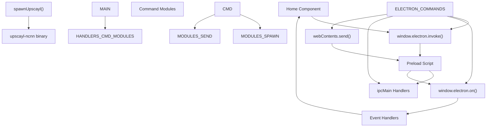
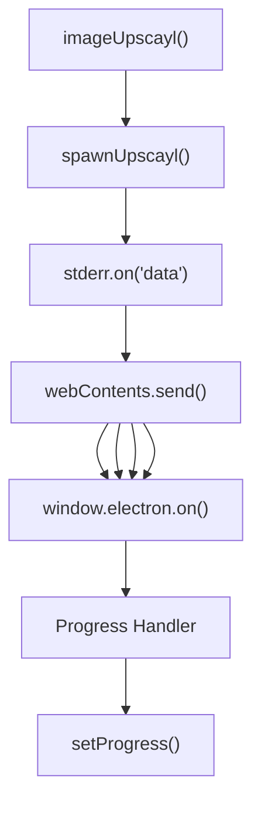
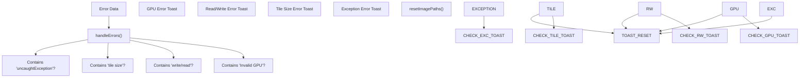

# Inter-Process Communication (进程间通信)

Relevant source files (相关源文件)

-   [common/types/types.d.ts](https://github.com/upscayl/upscayl/blob/1fdbd3e5/common/types/types.d.ts)
-   [electron/commands/batch-upscayl.ts](https://github.com/upscayl/upscayl/blob/1fdbd3e5/electron/commands/batch-upscayl.ts)
-   [electron/commands/double-upscayl.ts](https://github.com/upscayl/upscayl/blob/1fdbd3e5/electron/commands/double-upscayl.ts)
-   [electron/commands/image-upscayl.ts](https://github.com/upscayl/upscayl/blob/1fdbd3e5/electron/commands/image-upscayl.ts)
-   [electron/index.ts](https://github.com/upscayl/upscayl/blob/1fdbd3e5/electron/index.ts)
-   [electron/utils/get-arguments.ts](https://github.com/upscayl/upscayl/blob/1fdbd3e5/electron/utils/get-arguments.ts)
-   [renderer/pages/index.tsx](https://github.com/upscayl/upscayl/blob/1fdbd3e5/renderer/pages/index.tsx)

本文档涵盖了 Upscayl 中的 Inter-Process Communication (IPC，进程间通信) 系统，详细说明了 Electron Main Process (主进程) 和 Next.js Renderer Process (渲染进程) 如何交换命令、事件和数据。IPC 层作为用户界面和核心放大功能之间的桥梁。

有关主进程架构的信息，请参阅 [Main Process (主进程)](/upscayl/upscayl/2.1-main-process)。有关渲染进程的详细信息，请参阅 [Renderer Process (渲染进程)](/upscayl/upscayl/2.2-renderer-process)。

## IPC Architecture Overview (IPC 架构概述)

Upscayl 使用 Electron 内置的 IPC 系统来实现 Main Process (Node.js 后端) 和 Renderer Process (Next.js 前端) 之间的通信。通信遵循 Command-response Pattern (命令-响应模式)，并对长时间运行的操作进行异步事件处理。


Sources: [electron/index.ts84-124](https://github.com/upscayl/upscayl/blob/1fdbd3e5/electron/index.ts#L84-L124) [renderer/pages/index.tsx52-84](https://github.com/upscayl/upscayl/blob/1fdbd3e5/renderer/pages/index.tsx#L52-L84) [renderer/pages/index.tsx104-302](https://github.com/upscayl/upscayl/blob/1fdbd3e5/renderer/pages/index.tsx#L104-L302)

## Command Registration System (命令注册系统)

Main Process 根据操作类型，使用 Synchronous (同步) (`ipcMain.on`) 和 Asynchronous (异步) (`ipcMain.handle`) 模式注册 IPC handler。

### Synchronous Command Handlers (同步命令处理器)

这些处理器处理不需要返回值的 Fire-and-forget Commands (发后即忘命令)：

| Command | Handler Function | Purpose |
| --- | --- | --- |
| `STOP` | `stop` | 终止正在运行的放大进程 |
| `OPEN_FOLDER` | `openFolder` | 打开文件系统文件夹 |
| `GET_MODELS_LIST` | `getModelsList` | 检索可用的 AI 模型 |
| `UPSCAYL` | `imageUpscayl` | 开始单张图像放大 |
| `FOLDER_UPSCAYL` | `batchUpscayl` | 开始文件夹批量放大 |
| `DOUBLE_UPSCAYL` | `doubleUpscayl` | 开始双阶段放大 |
| `PASTE_IMAGE` | `pasteImage` | 处理剪贴板图像粘贴 |

### Asynchronous Command Handlers (异步命令处理器)

这些处理器返回并使用 `ipcMain.handle`：

| Command | Handler Function | Return Type |
| --- | --- | --- |
| `SELECT_FOLDER` | `selectFolder` | 文件夹路径字符串 |
| `SELECT_FILE` | `selectFile` | 文件路径字符串 |
| `SELECT_CUSTOM_MODEL_FOLDER` | `customModelsSelect` | 自定义模型路径 |
| `get-gpu-info` | 内联处理器 | GPU 信息对象 |
| `get-app-version` | 内联处理器 | 版本字符串 |

Sources: [electron/index.ts84-124](https://github.com/upscayl/upscayl/blob/1fdbd3e5/electron/index.ts#L84-L124)

## Command Invocation Pattern (命令调用模式)

Renderer Process 使用一致的模式来调用命令并处理响应：

> **[Mermaid sequence]**
> *(图表结构无法解析)*

Sources: [renderer/pages/index.tsx52-66](https://github.com/upscayl/upscayl/blob/1fdbd3e5/renderer/pages/index.tsx#L52-L66)

## Event-Based Progress Communication (基于事件的进度通信)

像图像放大这样长时间运行的操作，使用基于事件的通信来提供实时进度更新：


### Progress Event Types (进度事件类型)

Renderer Process 监听多种事件类型以获得全面的反馈：

| Event | Purpose | Data Format |
| --- | --- | --- |
| `UPSCAYL_PROGRESS` | 进度百分比 | 字符串 (例如，"45.67%") |
| `UPSCAYL_DONE` | 完成并带有输出路径 | 字符串 (文件路径) |
| `UPSCAYL_ERROR` | 错误信息 | 字符串 (错误消息) |
| `UPSCAYL_WARNING` | 非致命警告 | 字符串 (警告消息) |
| `SCALING_AND_CONVERTING` | 处理状态 | 空 |
| `METADATA_ERROR` | 元数据复制失败 | 字符串 (错误详情) |

Sources: [renderer/pages/index.tsx168-301](https://github.com/upscayl/upscayl/blob/1fdbd3e5/renderer/pages/index.tsx#L168-L301)

## Single Image Upscaling Data Flow (单张图像放大数据流)

此示例演示了单张图像放大的完整 IPC 流：

> **[Mermaid sequence]**
> *(图表结构无法解析)*

### Payload Structure (有效负载结构)

`ImageUpscaylPayload` 包含放大所需的所有参数：

```
// From common/types/types.d.tsexport type ImageUpscaylPayload = {  imagePath: string;  outputPath: string;  scale: string;  model: string;  gpuId: string;  saveImageAs: ImageFormat;  overwrite: boolean;  compression: string;  customWidth: string;  useCustomWidth: boolean;  tileSize: number;  ttaMode: boolean;  copyMetadata: boolean;};
```
Sources: [common/types/types.d.ts3-18](https://github.com/upscayl/upscayl/blob/1fdbd3e5/common/types/types.d.ts#L3-L18) [electron/commands/image-upscayl.ts26-183](https://github.com/upscayl/upscayl/blob/1fdbd3e5/electron/commands/image-upscayl.ts#L26-L183)

## Error Handling and Recovery (错误处理与恢复)

IPC 系统包括全面的错误处理，并对不同错误类型进行 Pattern Matching (模式匹配)：


渲染器中的错误处理系统提供了用户友好的错误消息，并带有复制错误详情或打开文档等可操作选项。

Sources: [renderer/pages/index.tsx105-166](https://github.com/upscayl/upscayl/blob/1fdbd3e5/renderer/pages/index.tsx#L105-L166)

## Batch and Double Upscaling IPC Patterns (批量与双重放大 IPC 模式)

批量放大和双重放大都遵循类似的 IPC 模式，但具有不同的事件通道：

### Batch Upscaling Events (批量放大事件)

-   `FOLDER_UPSCAYL_PROGRESS` - 批量处理的进度更新
-   `FOLDER_UPSCAYL_DONE` - 完成并带有输出文件夹路径

### Double Upscaling Events (双重放大事件)

-   `DOUBLE_UPSCAYL_PROGRESS` - 双阶段放大的进度
-   `DOUBLE_UPSCAYL_DONE` - 两个阶段都完成后完成

每个命令模块 (`batchUpscayl`, `doubleUpscayl`) 都实现了相同的带有进程生成和进度报告的事件驱动模式。

Sources: [electron/commands/batch-upscayl.ts20-156](https://github.com/upscayl/upscayl/blob/1fdbd3e5/electron/commands/batch-upscayl.ts#L20-L156) [electron/commands/double-upscayl.ts27-227](https://github.com/upscayl/upscayl/blob/1fdbd3e5/electron/commands/double-upscayl.ts#L27-L227)
