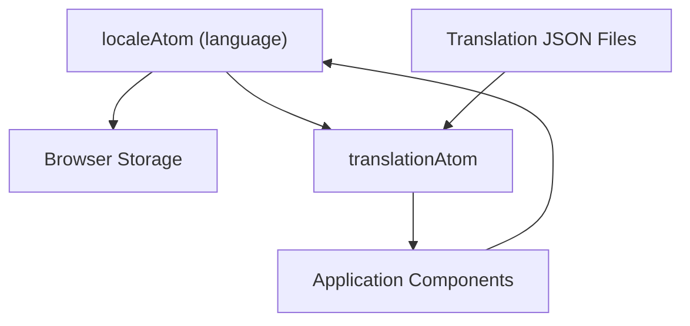
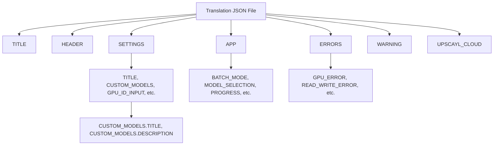
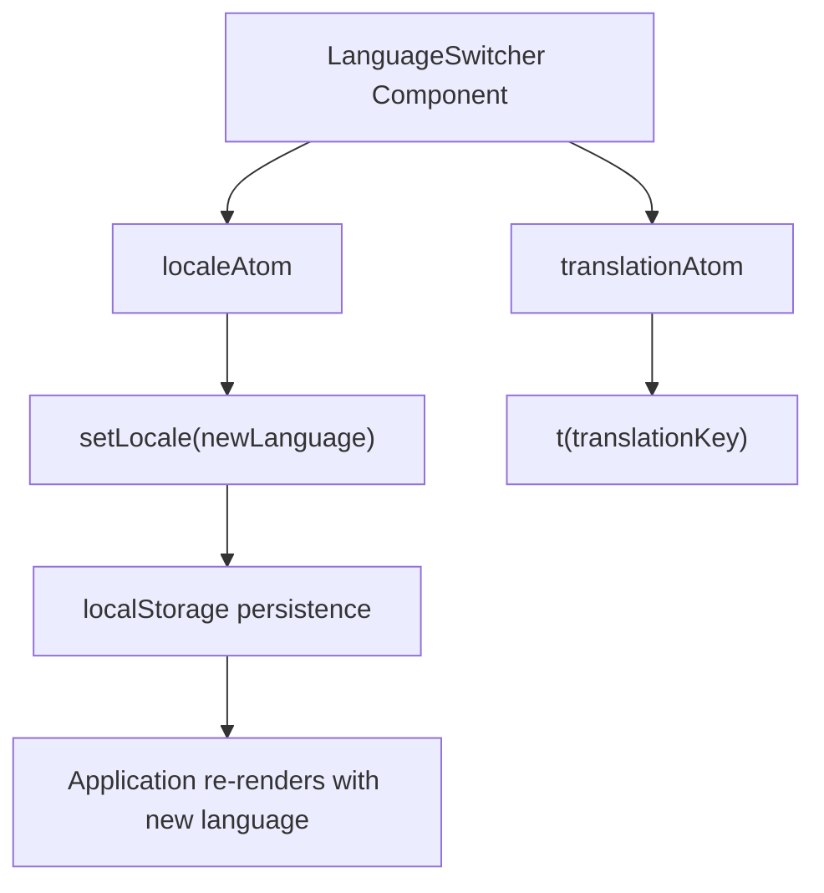

# State Management (状态管理)

Relevant source files (相关源文件)

-   [renderer/atoms/user-settings-atom.ts](https://github.com/upscayl/upscayl/blob/1fdbd3e5/renderer/atoms/user-settings-atom.ts)
-   [renderer/components/sidebar/index.tsx](https://github.com/upscayl/upscayl/blob/1fdbd3e5/renderer/components/sidebar/index.tsx)
-   [renderer/components/sidebar/settings-tab/index.tsx](https://github.com/upscayl/upscayl/blob/1fdbd3e5/renderer/components/sidebar/settings-tab/index.tsx)
-   [renderer/locales/en.json](https://github.com/upscayl/upscayl/blob/1fdbd3e5/renderer/locales/en.json)
-   [renderer/locales/es.json](https://github.com/upscayl/upscayl/blob/1fdbd3e5/renderer/locales/es.json)
-   [renderer/locales/fr.json](https://github.com/upscayl/upscayl/blob/1fdbd3e5/renderer/locales/fr.json)
-   [renderer/locales/ja.json](https://github.com/upscayl/upscayl/blob/1fdbd3e5/renderer/locales/ja.json)
-   [renderer/locales/ru.json](https://github.com/upscayl/upscayl/blob/1fdbd3e5/renderer/locales/ru.json)
-   [renderer/locales/vi.json](https://github.com/upscayl/upscayl/blob/1fdbd3e5/renderer/locales/vi.json)
-   [renderer/locales/zh.json](https://github.com/upscayl/upscayl/blob/1fdbd3e5/renderer/locales/zh.json)

## Purpose and Scope (目的与范围)

本文档详细介绍了 Upscayl 中的 State Management (状态管理) 方法，重点说明了如何在整个应用程序中组织、访问和更新应用程序状态。本页面主要涵盖了使用 Jotai atom (原子) 进行全局状态管理，以及在适当的情况下使用局部组件状态。

## Overview of State Management (状态管理概述)

Upscayl 使用两种主要机制进行状态管理：

1.  **Local Component State (局部组件状态)**: 使用 React 的 `useState` 钩子处理组件特定状态
2.  **Global Application State (全局应用程序状态)**: 使用 Jotai atom 处理需要在多个组件之间访问的状态

应用程序维护各种方面的状态，包括：

-   图像处理 (路径、尺寸、进度)
-   用户设置 (批量模式、输出路径、压缩设置)
-   模型选择和配置
-   Internationalization (国际化，语言环境和翻译)

### State Management Architecture (状态管理架构)

#### State Management Architecture

```mermaid
flowchart TD
    AppState["Application State"]
    LocalState["Local Component State"]
    GlobalState["Global Jotai Atoms"]
    imagePath["imagePath (useState)"]
    upscaledImagePath["upscaledImagePath (useState)"]
    dimensions["dimensions (useState)"]
    selectedTab["selectedTab (useState)"]
    isCopied["isCopied (useState)"]
    UserSettings["User Settings"]
    ProcessingControl["Processing Control"]
    PathManagement["Path Management"]
    UIState["UI State"]
    AdvancedSettings["Advanced Settings"]
    AppSettings["Application Settings"]
    selectedModelIdAtom["selectedModelIdAtom"]
    scaleAtom["scaleAtom"]
    saveImageAsAtom["saveImageAsAtom"]
    compressionAtom["compressionAtom"]
    gpuIdAtom["gpuIdAtom"]
    batchModeAtom["batchModeAtom"]
    doubleUpscaylAtom["doubleUpscaylAtom"]
    progressAtom["progressAtom"]
    overwriteAtom["overwriteAtom"]
    ttaModeAtom["ttaModeAtom"]
    savedOutputPathAtom["savedOutputPathAtom"]
    customModelsPathAtom["customModelsPathAtom"]
    rememberOutputFolderAtom["rememberOutputFolderAtom"]
    showSidebarAtom["showSidebarAtom"]
    viewTypeAtom["viewTypeAtom"]
    lensSizeAtom["lensSizeAtom"]
    customWidthAtom["customWidthAtom"]
    useCustomWidthAtom["useCustomWidthAtom"]
    tileSizeAtom["tileSizeAtom"]
    copyMetadataAtom["copyMetadataAtom"]
    autoUpdateAtom["autoUpdateAtom"]
    turnOffNotificationsAtom["turnOffNotificationsAtom"]
    enableContributionAtom["enableContributionAtom"]
    userStatsAtom["userStatsAtom"]

    AppState --> LocalState
    AppState --> GlobalState
    LocalState --> imagePath
    LocalState --> upscaledImagePath
    LocalState --> dimensions
    LocalState --> selectedTab
    LocalState --> isCopied
    GlobalState --> UserSettings
    GlobalState --> ProcessingControl
    GlobalState --> PathManagement
    GlobalState --> UIState
    GlobalState --> AdvancedSettings
    GlobalState --> AppSettings
    UserSettings --> selectedModelIdAtom
    UserSettings --> scaleAtom
    UserSettings --> saveImageAsAtom
    UserSettings --> compressionAtom
    UserSettings --> gpuIdAtom
    ProcessingControl --> batchModeAtom
    ProcessingControl --> doubleUpscaylAtom
    ProcessingControl --> progressAtom
    ProcessingControl --> overwriteAtom
    ProcessingControl --> ttaModeAtom
    PathManagement --> savedOutputPathAtom
    PathManagement --> customModelsPathAtom
    PathManagement --> rememberOutputFolderAtom
    UIState --> showSidebarAtom
    UIState --> viewTypeAtom
    UIState --> lensSizeAtom
    AdvancedSettings --> customWidthAtom
    AdvancedSettings --> useCustomWidthAtom
    AdvancedSettings --> tileSizeAtom
    AdvancedSettings --> copyMetadataAtom
    AppSettings --> autoUpdateAtom
    AppSettings --> turnOffNotificationsAtom
    AppSettings --> enableContributionAtom
    AppSettings --> userStatsAtom
```


Sources: [renderer/pages/index.tsx4-18](https://github.com/upscayl/upscayl/blob/1fdbd3e5/renderer/pages/index.tsx#L4-L18) [renderer/atoms/translations-atom.ts69-87](https://github.com/upscayl/upscayl/blob/1fdbd3e5/renderer/atoms/translations-atom.ts#L69-L87)

## Jotai Atoms

Upscayl 使用 Jotai (一个极简的 React 状态管理库) 来管理全局应用程序状态。Jotai 基于 atom 的概念，atom 是可以由组件直接使用的独立状态单元。

### Key Atoms (关键 Atom)

Upscayl 中的主要 atom 根据其用途分为几个类别：

#### User Settings Atoms (用户设置 Atom)

| Atom | Type | Purpose |
| --- | --- | --- |
| `selectedModelIdAtom` | `atomWithStorage<ModelId | string>` | 当前选定的用于放大的 AI 模型 |
| `scaleAtom` | `atomWithStorage<string>` | 图像放大倍数 (默认: "4") |
| `saveImageAsAtom` | `atomWithStorage<ImageFormat>` | 输出图像格式 (PNG, JPG, WEBP) |
| `compressionAtom` | `atomWithStorage<number>` | 图像压缩级别 |
| `gpuIdAtom` | `atomWithStorage<string>` | 用于处理的 GPU ID |

#### Processing Control Atoms (处理控制 Atom)

| Atom | Type | Purpose |
| --- | --- | --- |
| `batchModeAtom` | `atom<boolean>` | 控制批量处理模式 |
| `doubleUpscaylAtom` | `atomWithStorage<boolean>` | 启用双重放大 |
| `progressAtom` | `atom<string>` | 当前放大进度状态 |
| `overwriteAtom` | `atomWithStorage<boolean>` | 覆盖现有的输出文件 |
| `ttaModeAtom` | `atomWithStorage<boolean>` | Test Time Augmentation (测试时增强) 模式 |

#### Path and File Management Atoms (路径和文件管理 Atom)

| Atom | Type | Purpose |
| --- | --- | --- |
| `savedOutputPathAtom` | `atomWithStorage<string | null>` | 上次使用的输出目录路径 |
| `customModelsPathAtom` | `atomWithStorage<string | null>` | 自定义 AI 模型文件夹的路径 |
| `rememberOutputFolderAtom` | `atomWithStorage<boolean>` | 在会话之间记住输出文件夹 |

#### UI State Atoms (UI 状态 Atom)

| Atom | Type | Purpose |
| --- | --- | --- |
| `showSidebarAtom` | `atomWithStorage<boolean>` | 侧边栏可见性状态 |
| `viewTypeAtom` | `atomWithStorage<"slider" | "lens">` | 图像对比视图模式 |
| `lensSizeAtom` | `atomWithStorage<number>` | 透镜视图的大小 (默认: 100) |

#### Advanced Settings Atoms (高级设置 Atom)

| Atom | Type | Purpose |
| --- | --- | --- |
| `customWidthAtom` | `atomWithStorage<number>` | 自定义输出图像宽度 |
| `useCustomWidthAtom` | `atomWithStorage<boolean>` | 启用自定义宽度而非比例 |
| `tileSizeAtom` | `atomWithStorage<number | null>` | 用于处理的自定义分块大小 |
| `copyMetadataAtom` | `atomWithStorage<boolean>` | 将 EXIF 元数据复制到输出 |

#### Application Settings Atoms (应用程序设置 Atom)

| Atom | Type | Purpose |
| --- | --- | --- |
| `autoUpdateAtom` | `atomWithStorage<boolean>` | 自动更新检查 |
| `turnOffNotificationsAtom` | `atomWithStorage<boolean>` | 禁用系统通知 |
| `enableContributionAtom` | `atomWithStorage<boolean>` | 启用匿名使用情况跟踪 |
| `userStatsAtom` | `atomWithStorage<object>` | 用户统计信息和使用情况跟踪 |

### Atom Definition Patterns (Atom 定义模式)

Upscayl 中的 atom 根据其持久化和复杂性要求遵循几种常见模式：

#### Persistent Storage Atoms (持久化存储 Atom)

大多数用户设置使用 `atomWithStorage` 来实现跨会话的持久化：

```
// Basic persistent atoms with default valuesexport const selectedModelIdAtom = atomWithStorage<ModelId | string>(  "selectedModelId",  "upscayl-standard-4x",); export const scaleAtom = atomWithStorage<string>("scale", "4"); export const saveImageAsAtom = atomWithStorage<ImageFormat>(  "saveImageAs",   "png",); // Boolean toggles with defaultsexport const doubleUpscaylAtom = atomWithStorage("doubleUpscayl", false);export const overwriteAtom = atomWithStorage("overwrite", false);export const ttaModeAtom = atomWithStorage("ttaMode", false);
```
#### Transient State Atoms (瞬态状态 Atom)

一些 atom 使用基本的 `atom` 处理不需要持久化的临时状态：

```
// UI state that resets on app restartexport const batchModeAtom = atom<boolean>(false);export const progressAtom = atom<string>("");
```
#### Complex Object Atoms (复杂对象 Atom)

`userStatsAtom` 演示了如何存储复杂对象：

```
export const userStatsAtom = atomWithStorage("userStats", {  totalUpscayls: 0,  doubleUpscayls: 0,  batchUpscayls: 0,  imageUpscayls: 0,  averageUpscaylTime: 0,  lastUpscaylDuration: 0,  lastUsedAt: 0,});
```
#### Nullable Value Atoms (可为空值 Atom)

一些 atom 通过适当的类型处理可选值：

```
export const savedOutputPathAtom = atomWithStorage<string | null>(  "savedOutputPath",  null,); export const tileSizeAtom = atomWithStorage<number | null>("tileSize", null);
```
Sources: [renderer/atoms/user-settings-atom.ts11-103](https://github.com/upscayl/upscayl/blob/1fdbd3e5/renderer/atoms/user-settings-atom.ts#L11-L103)

## Component Interaction with State (组件与状态的交互)

Upscayl 中的组件使用 Jotai 提供的钩子与 atom 进行交互：

-   `useAtom`: 用于读取和写入 atom
-   `useAtomValue`: 用于对 atom 的只读访问
-   `useSetAtom`: 用于对 atom 的只写访问

### Example Usage Patterns (示例使用模式)

#### Atom Usage in Sidebar Component (Sidebar 组件中的 Atom 使用)

```mermaid
flowchart TD
    Sidebar["Sidebar Component"]
    ReadOnly["Read-Only Access (useAtomValue)"]
    WriteOnly["Write-Only Access (useSetAtom)"]
    ReadWrite["Read-Write Access (useAtom)"]
    overwrite["overwriteAtom"]
    outputPath["savedOutputPathAtom"]
    logData["logAtom"]
    noImageProcessing["noImageProcessingAtom"]
    customWidth["customWidthAtom"]
    useCustomWidth["useCustomWidthAtom"]
    tileSize["tileSizeAtom"]
    ttaMode["ttaModeAtom"]
    setProgress["progressAtom"]
    setDontShowCloudModal["dontShowCloudModalAtom"]
    setUserStats["userStatsAtom"]
    selectedModelId["selectedModelIdAtom"]
    doubleUpscayl["doubleUpscaylAtom"]
    gpuId["gpuIdAtom"]
    saveImageAs["saveImageAsAtom"]
    compression["compressionAtom"]
    batchMode["batchModeAtom"]
    scale["scaleAtom"]
    showSidebar["showSidebarAtom"]
    copyMetadata["copyMetadataAtom"]

    Sidebar --> ReadOnly
    Sidebar --> WriteOnly
    Sidebar --> ReadWrite
    ReadOnly --> overwrite
    ReadOnly --> outputPath
    ReadOnly --> logData
    ReadOnly --> noImageProcessing
    ReadOnly --> customWidth
    ReadOnly --> useCustomWidth
    ReadOnly --> tileSize
    ReadOnly --> ttaMode
    WriteOnly --> setProgress
    WriteOnly --> setDontShowCloudModal
    WriteOnly --> setUserStats
    ReadWrite --> selectedModelId
    ReadWrite --> doubleUpscayl
    ReadWrite --> gpuId
    ReadWrite --> saveImageAs
    ReadWrite --> compression
    ReadWrite --> batchMode
    ReadWrite --> scale
    ReadWrite --> showSidebar
    ReadWrite --> copyMetadata
```


Sidebar 组件展示了全面的 atom 使用模式：

**Read-only access (只读访问)** 用于组件仅需要观察的状态：

```
// Lines 82-97 in sidebar/index.tsxconst overwrite = useAtomValue(overwriteAtom);const outputPath = useAtomValue(savedOutputPathAtom);const noImageProcessing = useAtomValue(noImageProcessingAtom);const customWidth = useAtomValue(customWidthAtom);const ttaMode = useAtomValue(ttaModeAtom);
```
**Write-only access (只写访问)** 用于组件仅需要更新的状态：

```
// Lines 85, 89, 95 in sidebar/index.tsx  const setProgress = useSetAtom(progressAtom);const setDontShowCloudModal = useSetAtom(dontShowCloudModalAtom);const setUserStats = useSetAtom(userStatsAtom);
```
**Read-write access (读写访问)** 用于组件既需要读取又需要更新的状态：

```
// Lines 73-97 in sidebar/index.tsxconst [selectedModelId, setSelectedModelId] = useAtom(selectedModelIdAtom);const [doubleUpscayl, setDoubleUpscayl] = useAtom(doubleUpscaylAtom);const [compression, setCompression] = useAtom(compressionAtom);const [batchMode, setBatchMode] = useAtom(batchModeAtom);const [showSidebar, setShowSidebar] = useAtom(showSidebarAtom);
```
Sources: [renderer/components/sidebar/index.tsx73-97](https://github.com/upscayl/upscayl/blob/1fdbd3e5/renderer/components/sidebar/index.tsx#L73-L97)

## Data Flow (数据流)

Upscayl 中的数据流遵循 Reactive Pattern (响应式模式)，其中状态更改会触发组件重新渲染：

> **[Mermaid sequence]**
> *(图表结构无法解析)*

Sources: [renderer/pages/index.tsx52-101](https://github.com/upscayl/upscayl/blob/1fdbd3e5/renderer/pages/index.tsx#L52-L101) [electron/index.ts84-120](https://github.com/upscayl/upscayl/blob/1fdbd3e5/electron/index.ts#L84-L120)

### Example: Image Upscaling Flow (示例：图像放大流程)

当用户选择图像进行放大时：

1.  UI 组件调用 Electron 命令来选择文件
2.  Electron Main Process 返回文件路径
3.  组件更新局部状态 (`imagePath`)，可能还会更新全局状态
4.  当放大开始时，从 Electron 接收进度更新
5.  这些更新存储在 `progressAtom` 中
6.  订阅了 `progressAtom` 的组件使用新的进度信息重新渲染

### Real-world Example: Upscaling Process State Flow (实际示例：放大过程状态流)

放大过程演示了跨多个 atom 的全面状态管理：

#### Upscaling Handler State Usage (放大处理器状态使用)

```mermaid
flowchart TD
    upscaylHandler["upscaylHandler()"]
    StateReads["Read Atom Values"]
    StateWrites["Update Atom Values"]
    imagePath["imagePath (local state)"]
    batchFolderPath["batchFolderPath (local state)"]
    outputPath["outputPath (savedOutputPathAtom)"]
    selectedModelId["selectedModelId (selectedModelIdAtom)"]
    gpuId["gpuId (gpuIdAtom)"]
    saveImageAs["saveImageAs (saveImageAsAtom)"]
    scale["scale (scaleAtom)"]
    doubleUpscayl["doubleUpscayl (doubleUpscaylAtom)"]
    batchMode["batchMode (batchModeAtom)"]
    compression["compression (compressionAtom)"]
    customWidth["customWidth (customWidthAtom)"]
    useCustomWidth["useCustomWidth (useCustomWidthAtom)"]
    tileSize["tileSize (tileSizeAtom)"]
    ttaMode["ttaMode (ttaModeAtom)"]
    copyMetadata["copyMetadata (copyMetadataAtom)"]
    setProgress["setProgress (progressAtom)"]
    setUserStats["setUserStats (userStatsAtom)"]
    setUpscaledImagePath["setUpscaledImagePath (local)"]
    setUpscaledBatchFolderPath["setUpscaledBatchFolderPath (local)"]

    upscaylHandler --> StateReads
    upscaylHandler --> StateWrites
    StateReads --> imagePath
    StateReads --> batchFolderPath
    StateReads --> outputPath
    StateReads --> selectedModelId
    StateReads --> gpuId
    StateReads --> saveImageAs
    StateReads --> scale
    StateReads --> doubleUpscayl
    StateReads --> batchMode
    StateReads --> compression
    StateReads --> customWidth
    StateReads --> useCustomWidth
    StateReads --> tileSize
    StateReads --> ttaMode
    StateReads --> copyMetadata
    StateWrites --> setProgress
    StateWrites --> setUserStats
    StateWrites --> setUpscaledImagePath
    StateWrites --> setUpscaledBatchFolderPath
```


Sidebar 组件中的 `upscaylHandler` 函数演示了多个 atom 在放大过程中如何协调：

**State reading (状态读取)** 用于配置 (第 99-177 行)：

```
// Read processing modeif (doubleUpscayl) { /* Double upscaling logic */ }else if (batchMode) { /* Batch processing logic */ } else { /* Single image logic */ } // Read all configuration from atomsmodel: selectedModelId,gpuId: gpuId.length === 0 ? null : gpuId,saveImageAs,scale,compression: compression.toString(),customWidth: customWidth > 0 ? customWidth.toString() : null,useCustomWidth,tileSize,ttaMode,copyMetadata,
```
**State updating (状态更新)** 用于进度和统计信息 (第 125-131, 154-159, 179-185 行)：

```
// Update user statisticssetUserStats((prev) => ({  ...prev,  totalUpscayls: prev.totalUpscayls + 1,  lastUsedAt: new Date().getTime(),  doubleUpscayls: prev.doubleUpscayls + 1,  imageUpscayls: prev.imageUpscayls + 1,})); // Update progress statussetProgress(t("APP.PROGRESS.WAIT_TITLE"));
```
Sources: [renderer/components/sidebar/index.tsx99-194](https://github.com/upscayl/upscayl/blob/1fdbd3e5/renderer/components/sidebar/index.tsx#L99-L194)

## Persistent State (持久化状态)

Upscayl 使用 Jotai 的 `atomWithStorage` 在会话之间持久化某些状态值。这将 atom 的值存储在 localStorage 或其他存储机制中。


例如，`localeAtom` 使用 `atomWithStorage` 定义，以持久化用户的语言偏好：

```
export const localeAtom = atomWithStorage<Locales>("language", "en");
```
这确保了用户的语言偏好在跨浏览器会话时被记住，从而提供一致的体验。

Sources: [renderer/atoms/translations-atom.ts69](https://github.com/upscayl/upscayl/blob/1fdbd3e5/renderer/atoms/translations-atom.ts#L69-L69)

## Internationalization System (国际化系统)

Upscayl 通过一套全面的 JSON 翻译文件和基于 Jotai 的语言选择状态管理来实现 Internationalization (国际化)。

### Translation File Structure (翻译文件结构)

应用程序支持多种语言，并为每种语言环境提供专门的 JSON 文件：

#### Available Locales (可用语言环境)

| Language | File | Importance Score |
| --- | --- | --- |
| Chinese | `zh.json` | 18.74 |
| English | `en.json` | 18.48 |
| Russian | `ru.json` | 16.06 |
| French | `fr.json` | 15.09 |
| Spanish | `es.json` | 14.22 |
| Japanese | `ja.json` | 13.25 |
| Vietnamese | `vi.json` | 6.54 |

#### Translation Key Structure (翻译键结构)

每个语言环境文件都遵循层次结构来组织翻译：


### Language Switcher Implementation (语言切换器实现)

设置选项卡中的 LanguageSwitcher 组件允许用户更改应用程序语言：


该组件使用对语言状态的读写访问：

```
// Read current locale and get setter functionconst [locale, setLocale] = useAtom(localeAtom);// Get translation functionconst t = useAtomValue(translationAtom);
```
### Translation Usage Patterns (翻译使用模式)

整个应用程序中的组件使用一致的模式访问翻译：

```
// In SettingsTab component (lines 63)const t = useAtomValue(translationAtom); // Usage in JSX<p>{t("SETTINGS.SUPPORT.TITLE")}</p><button>{t("SETTINGS.SUPPORT.DOCS_BUTTON_TITLE")}</button>
```
翻译系统支持用于动态内容的参数替换：

```
// From locale files - dynamic parameter example"KEEP_CURRENT_FORMAT": "Keep {format}""SUGGEST_JPG_DESCRIPTION": "For better metadata compatibility across different systems, we recommend using JPG format. Would you like to change?"
```
Sources: [renderer/locales/en.json1-314](https://github.com/upscayl/upscayl/blob/1fdbd3e5/renderer/locales/en.json#L1-L314) [renderer/locales/zh.json1-314](https://github.com/upscayl/upscayl/blob/1fdbd3e5/renderer/locales/zh.json#L1-L314) [renderer/locales/ru.json1-314](https://github.com/upscayl/upscayl/blob/1fdbd3e5/renderer/locales/ru.json#L1-L314) [renderer/locales/fr.json1-314](https://github.com/upscayl/upscayl/blob/1fdbd3e5/renderer/locales/fr.json#L1-L314) [renderer/locales/es.json1-315](https://github.com/upscayl/upscayl/blob/1fdbd3e5/renderer/locales/es.json#L1-L315) [renderer/locales/ja.json1-314](https://github.com/upscayl/upscayl/blob/1fdbd3e5/renderer/locales/ja.json#L1-L314) [renderer/locales/vi.json1-314](https://github.com/upscayl/upscayl/blob/1fdbd3e5/renderer/locales/vi.json#L1-L314) [renderer/components/sidebar/settings-tab/index.tsx63](https://github.com/upscayl/upscayl/blob/1fdbd3e5/renderer/components/sidebar/settings-tab/index.tsx#L63-L63)

## User Statistics and Analytics (用户统计与分析)

Upscayl 通过 `userStatsAtom` 跟踪全面的用户统计信息，以提供对使用模式和应用程序性能的洞察。

### Statistics Schema (统计架构)

`userStatsAtom` 存储以下指标：

```
export const userStatsAtom = atomWithStorage("userStats", {  totalUpscayls: 0,        // Total number of upscaling operations  doubleUpscayls: 0,       // Count of double upscaling operations    batchUpscayls: 0,        // Count of batch processing operations  imageUpscayls: 0,        // Count of single image operations  averageUpscaylTime: 0,   // Average processing time per operation  lastUpscaylDuration: 0,  // Duration of the most recent operation  lastUsedAt: 0,          // Timestamp of last application usage});
```
### Statistics Updates During Processing (处理期间的统计信息更新)

Sidebar 组件更新不同操作类型的统计信息：

#### Double Upscaling Statistics (双重放大统计信息)

```
// Lines 125-131 in sidebar/index.tsxsetUserStats((prev) => ({  ...prev,  totalUpscayls: prev.totalUpscayls + 1,  lastUsedAt: new Date().getTime(),  doubleUpscayls: prev.doubleUpscayls + 1,  imageUpscayls: prev.imageUpscayls + 1,}));
```
#### Batch Processing Statistics (批量处理统计信息)

```
// Lines 154-159 in sidebar/index.tsxsetUserStats((prev) => ({  ...prev,  totalUpscayls: prev.totalUpscayls + 1,  lastUsedAt: new Date().getTime(),  batchUpscayls: prev.doubleUpscayls + 1, // Note: This appears to be a bug - should be prev.batchUpscayls + 1}));
```
#### Single Image Statistics (单张图像统计信息)

```
// Lines 179-184 in sidebar/index.tsxsetUserStats((prev) => ({  ...prev,  totalUpscayls: prev.totalUpscayls + 1,  lastUsedAt: new Date().getTime(),  imageUpscayls: prev.imageUpscayls + 1,}));
```
### Statistics Display (统计信息显示)

统计信息通过 MoreOptionsDrawer 组件暴露给用户，该组件显示：

-   Total Upscayls (`TOTAL_UPSCAYLS`)
-   Total Batch Upscayls (`TOTAL_BATCH_UPSCAYLS`)
-   Total Image Upscayls (`TOTAL_IMAGE_UPSCAYLS`)
-   Total Double Upscayls (`TOTAL_DOUBLE_UPSCAYLS`)
-   Average Upscayl Time (`AVERAGE_UPSCAYL_TIME`)
-   Last Upscayl Duration (`LAST_UPSCAYL_DURATION`)
-   Last Used At (`LAST_USED_AT`)

Sources: [renderer/atoms/user-settings-atom.ts89-97](https://github.com/upscayl/upscayl/blob/1fdbd3e5/renderer/atoms/user-settings-atom.ts#L89-L97) [renderer/components/sidebar/index.tsx125-131](https://github.com/upscayl/upscayl/blob/1fdbd3e5/renderer/components/sidebar/index.tsx#L125-L131) [renderer/components/sidebar/index.tsx154-159](https://github.com/upscayl/upscayl/blob/1fdbd3e5/renderer/components/sidebar/index.tsx#L154-L159) [renderer/components/sidebar/index.tsx179-184](https://github.com/upscayl/upscayl/blob/1fdbd3e5/renderer/components/sidebar/index.tsx#L179-L184)

## Conclusion (结论)

Upscayl 中的状态管理方法将局部组件状态与全局 Jotai atom 相结合，创建了一个灵活且可维护的系统。这种方法允许：

-   在适当时使用组件特定状态
-   在需要时跨组件共享状态
-   为用户偏好提供持久化状态
-   为翻译等复杂转换提供派生状态

该系统实现了图像放大所需的复杂 UI 交互，同时保持了代码的可读性和性能。
