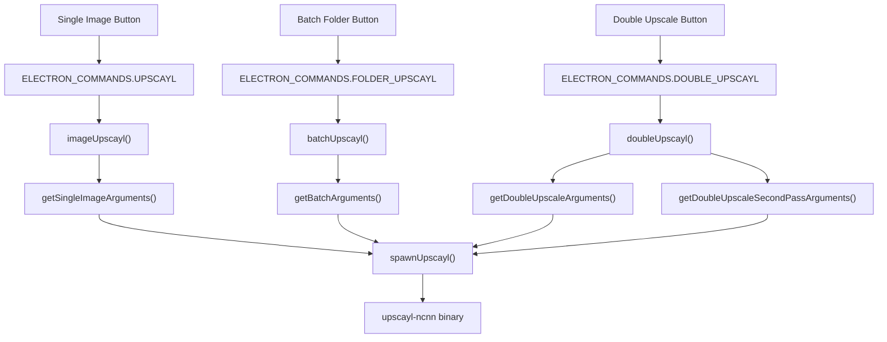

# 核心功能 (Core Functionality)

相关源文件

-   [.github/workflows/stale.yml](https://github.com/upscayl/upscayl/blob/1fdbd3e5/.github/workflows/stale.yml)
-   [README.md](https://github.com/upscayl/upscayl/blob/1fdbd3e5/README.md?plain=1)
-   [common/types/types.d.ts](https://github.com/upscayl/upscayl/blob/1fdbd3e5/common/types/types.d.ts)
-   [electron/commands/batch-upscayl.ts](https://github.com/upscayl/upscayl/blob/1fdbd3e5/electron/commands/batch-upscayl.ts)
-   [electron/commands/double-upscayl.ts](https://github.com/upscayl/upscayl/blob/1fdbd3e5/electron/commands/double-upscayl.ts)
-   [electron/commands/image-upscayl.ts](https://github.com/upscayl/upscayl/blob/1fdbd3e5/electron/commands/image-upscayl.ts)
-   [electron/utils/get-arguments.ts](https://github.com/upscayl/upscayl/blob/1fdbd3e5/electron/utils/get-arguments.ts)
-   [electron/utils/show-notification.ts](https://github.com/upscayl/upscayl/blob/1fdbd3e5/electron/utils/show-notification.ts)
-   [upscayl.mp4](https://github.com/upscayl/upscayl/blob/1fdbd3e5/upscayl.mp4)

本文档涵盖了 Upscayl 为用户提供的主要 图像放大 (Image Upscaling) 能力，包括三种主要的放大模式、底层处理架构，以及这些功能如何与应用程序的技术组件集成。

有关公开这些功能的 用户界面 (User Interface) 组件的详细信息，请参阅 [用户界面](/upscayl/upscayl/4-user-interface)。有关特定平台的实现细节，请参阅 [平台支持](/upscayl/upscayl/5-platform-support)。

## 概述 (Overview)

Upscayl 提供了三种主要的放大模式，每种模式都针对不同的用例设计：

| 模式 | 用途 | 实现 |
| --- | --- | --- |
| **单张图像 (Single Image)** | 具有完全控制权地放大单张图像 | `imageUpscayl` 命令 |
| **批量处理 (Batch Processing)** | 放大整个文件夹的图像 | `batchUpscayl` 命令 |
| **双重放大 (Double Upscaling)** | 为了获得最大质量的两阶段放大 | `doubleUpscayl` 命令 |

所有模式都利用相同的底层 `upscayl-ncnn` 二进制文件，但具有不同的 参数 (Argument) 配置和 工作流程 (Workflow)。

## 放大模式架构 (Upscaling Modes Architecture)

来源： [electron/commands/image-upscayl.ts26](https://github.com/upscayl/upscayl/blob/1fdbd3e5/electron/commands/image-upscayl.ts#L26-L26) [electron/commands/batch-upscayl.ts20](https://github.com/upscayl/upscayl/blob/1fdbd3e5/electron/commands/batch-upscayl.ts#L20-L20) [electron/commands/double-upscayl.ts27](https://github.com/upscayl/upscayl/blob/1fdbd3e5/electron/commands/double-upscayl.ts#L27-L27) [electron/utils/get-arguments.ts6-247](https://github.com/upscayl/upscayl/blob/1fdbd3e5/electron/utils/get-arguments.ts#L6-L247)

## 核心处理管道 (Core Processing Pipeline)

所有放大操作都遵循通用的处理管道，并带有特定模式的变体：

> **[Mermaid sequence]**
> *(图表结构无法解析)*

来源： [electron/commands/image-upscayl.ts103-182](https://github.com/upscayl/upscayl/blob/1fdbd3e5/electron/commands/image-upscayl.ts#L103-L182) [electron/utils/spawn-upscayl.ts](https://github.com/upscayl/upscayl/blob/1fdbd3e5/electron/utils/spawn-upscayl.ts) [common/types/types.d.ts3-53](https://github.com/upscayl/upscayl/blob/1fdbd3e5/common/types/types.d.ts#L3-L53)

## 载荷 (Payload) 类型系统

每种放大模式都使用特定的 载荷 (Payload) 类型，该类型定义了所需的参数：

来源： [common/types/types.d.ts3-53](https://github.com/upscayl/upscayl/blob/1fdbd3e5/common/types/types.d.ts#L3-L53)

## 通用处理特性 (Common Processing Features)

### 参数构建 (Argument Construction)

所有模式都通过 `get-arguments.ts` 模块使用一致的参数构建模式，该模块为 `upscayl-ncnn` 二进制文件构建 命令行界面 (CLI) 参数：

-   **模型选择**： `-m` 用于模型路径， `-n` 用于模型名称
-   **输入/输出**： `-i` 用于输入， `-o` 用于输出
-   **缩放**： `-s` 用于缩放系数， `-w` 用于自定义宽度
-   **硬件**： `-g` 用于 GPU ID 选择
-   **格式**： `-f` 用于输出格式， `-c` 用于压缩
-   **高级**： `-t` 用于分块大小， `-x` 用于 TTA 模式

来源： [electron/utils/get-arguments.ts6-69](https://github.com/upscayl/upscayl/blob/1fdbd3e5/electron/utils/get-arguments.ts#L6-L69)

### 进度监控 (Progress Monitoring)

每个命令处理器都通过 解析标准错误 (stderr parsing) 实现一致的进度监控：

-   **数据事件**：解析进度百分比和状态消息
-   **错误检测**：识别输出中的 "Error" 或 "failed" 关键字
-   **进度条**：通过 `mainWindow.setProgressBar()` 更新 Electron 的进度条
-   **进程间通信 (IPC)**：通过特定的事件通道向渲染器发送进度更新

来源： [electron/commands/image-upscayl.ts128-143](https://github.com/upscayl/upscayl/blob/1fdbd3e5/electron/commands/image-upscayl.ts#L128-L143) [electron/commands/batch-upscayl.ts74-91](https://github.com/upscayl/upscayl/blob/1fdbd3e5/electron/commands/batch-upscayl.ts#L74-L91)

### 错误处理 (Error Handling)

所有处理模式都实现了标准化的错误处理：

-   **进程终止**：在检测到错误时杀死子进程
-   **用户通知**：通过 IPC 向渲染器发送错误消息
-   **系统通知**：通过 `showNotification()` 显示桌面通知
-   **清理**：重置进度条和处理状态

来源： [electron/commands/image-upscayl.ts144-154](https://github.com/upscayl/upscayl/blob/1fdbd3e5/electron/commands/image-upscayl.ts#L144-L154) [electron/utils/show-notification.ts5-31](https://github.com/upscayl/upscayl/blob/1fdbd3e5/electron/utils/show-notification.ts#L5-L31)

### 文件管理 (File Management)

所有模式下的常见文件操作包括：

-   **路径验证**：在处理前检查文件是否存在
-   **输出目录创建**：确保输出路径存在
-   **文件名生成**：构建带有模型和缩放后缀的输出名称
-   **元数据 (Metadata)** 保留：通过 `copyMetadata()` 可选地复制 EXIF 数据

来源： [electron/commands/image-upscayl.ts51-77](https://github.com/upscayl/upscayl/blob/1fdbd3e5/electron/commands/image-upscayl.ts#L51-L77) [electron/commands/batch-upscayl.ts37-44](https://github.com/upscayl/upscayl/blob/1fdbd3e5/electron/commands/batch-upscayl.ts#L37-L44)

这些核心功能为 Upscayl 中所有的图像放大操作奠定了基础，每种模式都在这些通用模式的基础上构建，同时实现了针对单张图像、批量处理或多阶段放大的特定模式逻辑。
