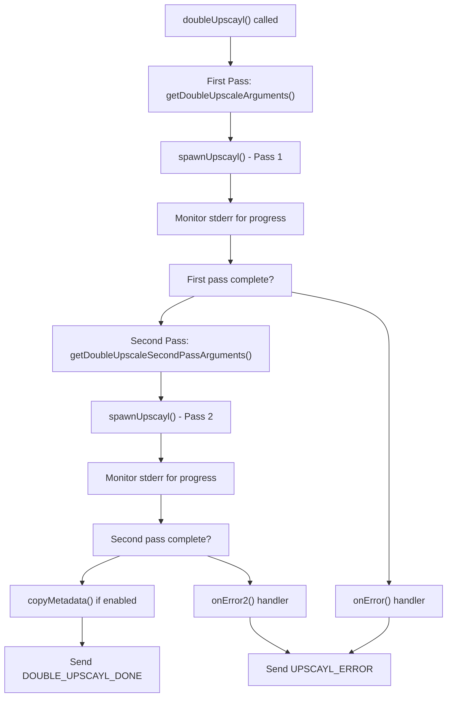
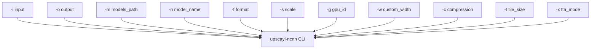
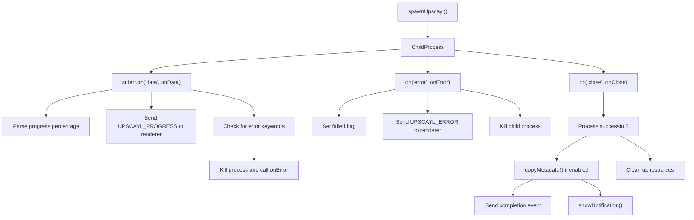
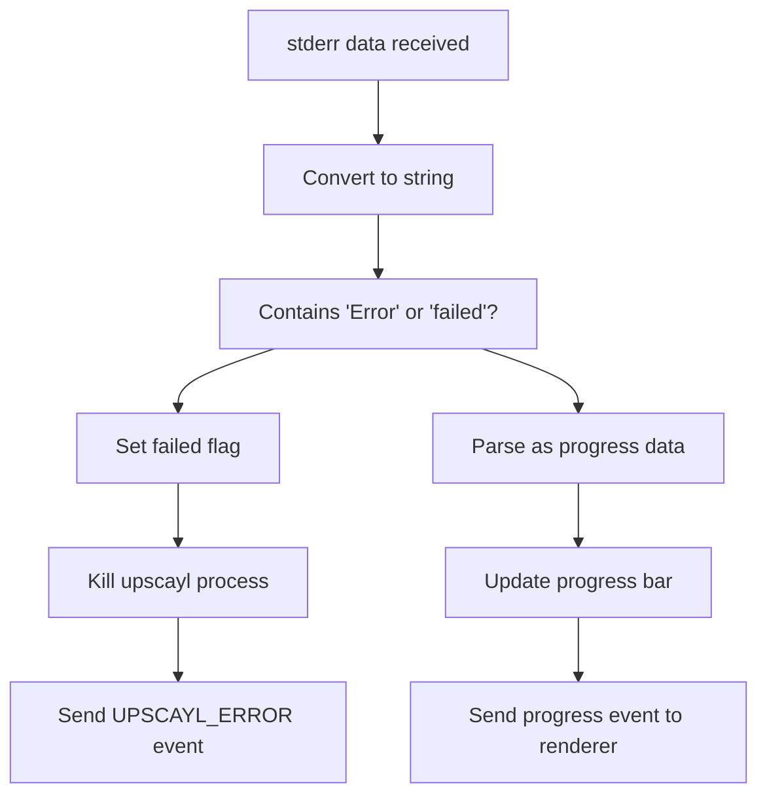

# 图像放大流程 (Image Upscaling Process)

相关源文件

-   [.github/workflows/stale.yml](https://github.com/upscayl/upscayl/blob/1fdbd3e5/.github/workflows/stale.yml)
-   [README.md](https://github.com/upscayl/upscayl/blob/1fdbd3e5/README.md?plain=1)
-   [common/types/types.d.ts](https://github.com/upscayl/upscayl/blob/1fdbd3e5/common/types/types.d.ts)
-   [electron/commands/batch-upscayl.ts](https://github.com/upscayl/upscayl/blob/1fdbd3e5/electron/commands/batch-upscayl.ts)
-   [electron/commands/double-upscayl.ts](https://github.com/upscayl/upscayl/blob/1fdbd3e5/electron/commands/double-upscayl.ts)
-   [electron/commands/image-upscayl.ts](https://github.com/upscayl/upscayl/blob/1fdbd3e5/electron/commands/image-upscayl.ts)
-   [electron/utils/get-arguments.ts](https://github.com/upscayl/upscayl/blob/1fdbd3e5/electron/utils/get-arguments.ts)
-   [electron/utils/show-notification.ts](https://github.com/upscayl/upscayl/blob/1fdbd3e5/electron/utils/show-notification.ts)
-   [upscayl.mp4](https://github.com/upscayl/upscayl/blob/1fdbd3e5/upscayl.mp4)

本文档涵盖了 Upscayl 中核心的 图像放大 (Image Upscaling) 功能，详细说明了图像如何从用户输入经过 AI 增强 (AI Enhancement) 到最终输出的处理过程。这包括三种主要的放大模式（单张、批量和双重放大）、底层的二进制执行过程 (Binary Execution Process) 以及进度监控 (Progress Monitoring)。

有关 AI 模型管理和选择的信息，请参阅 [AI 模型](/upscayl/upscayl/3.2-ai-models)。有关执行实际处理的特定平台 `upscayl-ncnn` 二进制文件的详细信息，请参阅 [平台特定二进制文件](/upscayl/upscayl/3.3-platform-specific-binaries)。

## 概述 (Overview)

Upscayl 的图像放大过程通过一个 命令与控制架构 (Command-and-control Architecture) 运行，其中 Electron 主进程 (Main Process) 编排外部 `upscayl-ncnn` 二进制文件的执行。该过程涉及 载荷构建 (Payload Construction)、参数生成、进程生成 (Process Spawning)、进度监控和 后处理 (Post-processing) 步骤。

### 高层放大工作流程 (High-Level Upscaling Workflow)

> **[Mermaid sequence]**
> *(图表结构无法解析)*

**来源：** [electron/commands/image-upscayl.ts26-183](https://github.com/upscayl/upscayl/blob/1fdbd3e5/electron/commands/image-upscayl.ts#L26-L183) [electron/commands/batch-upscayl.ts20-156](https://github.com/upscayl/upscayl/blob/1fdbd3e5/electron/commands/batch-upscayl.ts#L20-L156) [electron/commands/double-upscayl.ts27-229](https://github.com/upscayl/upscayl/blob/1fdbd3e5/electron/commands/double-upscayl.ts#L27-L229)

## 放大模式 (Upscaling Modes)

Upscayl 支持三种不同的放大模式，每种模式都由主进程中专门的 命令处理器 (Command Handlers) 处理。

### 单张图像放大 (Single Image Upscaling)

`imageUpscayl` 函数通过 `ImageUpscaylPayload` 类型处理单张图像处理。

| 参数 | 类型 | 用途 |
| --- | --- | --- |
| `imagePath` | string | 源图像路径 |
| `outputPath` | string | 输出目录 |
| `scale` | string | 放大系数 |
| `model` | string | AI 模型标识符 |
| `gpuId` | string | GPU 设备选择 |
| `saveImageAs` | ImageFormat | 输出格式 (png, jpg, webp) |
| `overwrite` | boolean | 替换现有文件 |
| `compression` | string | 压缩级别 |
| `customWidth` | string | 自定义宽度覆盖 |
| `useCustomWidth` | boolean | 启用自定义宽度模式 |
| `tileSize` | number | 处理分块大小 |
| `ttaMode` | boolean | 测试时增强 (Test-time augmentation) |
| `copyMetadata` | boolean | 保留 EXIF 数据 |

该过程使用以下模式构建输出文件名：

```
{fileName}_upscayl_{scale}x_{model}.{saveImageAs}
```
**来源：** [electron/commands/image-upscayl.ts26-59](https://github.com/upscayl/upscayl/blob/1fdbd3e5/electron/commands/image-upscayl.ts#L26-L59) [common/types/types.d.ts3-18](https://github.com/upscayl/upscayl/blob/1fdbd3e5/common/types/types.d.ts#L3-L18)

### 批量放大 (Batch Upscaling)

`batchUpscayl` 函数使用 `BatchUpscaylPayload` 类型处理整个目录。它创建一个具有命名模式的专门输出子目录：

```
upscayl_{saveImageAs}_{model}_{scale}x
```
批量处理器迭代输入目录中所有受支持的图像文件，并通过单次 `upscayl-ncnn` 调用按顺序处理它们。

**来源：** [electron/commands/batch-upscayl.ts20-44](https://github.com/upscayl/upscayl/blob/1fdbd3e5/electron/commands/batch-upscayl.ts#L20-L44) [common/types/types.d.ts39-53](https://github.com/upscayl/upscayl/blob/1fdbd3e5/common/types/types.d.ts#L39-L53)

### 双重放大 (Double Upscaling)

`doubleUpscayl` 函数使用 `DoubleUpscaylPayload` 类型执行两阶段放大。此模式对同一张图像运行两次放大过程，以获得更高质量的结果。


**来源：** [electron/commands/double-upscayl.ts61-227](https://github.com/upscayl/upscayl/blob/1fdbd3e5/electron/commands/double-upscayl.ts#L61-L227) [common/types/types.d.ts20-37](https://github.com/upscayl/upscayl/blob/1fdbd3e5/common/types/types.d.ts#L20-L37)

## 命令参数构建 (Command Argument Construction)

`get-arguments.ts` 模块为 `upscayl-ncnn` 二进制文件构建命令行参数。每种放大模式都使用特定的参数构建器函数。

### 参数构建器函数 (Argument Builder Functions)

| 函数 | 用途 | 关键参数 |
| --- | --- | --- |
| `getSingleImageArguments` | 单张图像处理 | `-i`, `-o`, `-s`, `-m`, `-n`, `-g`, `-f` |
| `getBatchArguments` | 批量目录处理 | 输入/输出目录而非文件 |
| `getDoubleUpscaleArguments` | 双重放大的第一阶段 | 标准单张图像参数 |
| `getDoubleUpscaleSecondPassArguments` | 使用第一阶段输出的第二阶段 | 输入和输出都指向同一个文件 |

### 通用 CLI 参数 (Common CLI Arguments)


参数构建逻辑包括条件缩放：如果模型的原生缩放比例与请求的缩放比例匹配，且未指定自定义宽度，则省略 `-s` 缩放参数。

**来源：** [electron/utils/get-arguments.ts6-247](https://github.com/upscayl/upscayl/blob/1fdbd3e5/electron/utils/get-arguments.ts#L6-L247)

## 进程生成与监控 (Process Spawning and Monitoring)

来自生成实用程序的 `spawnUpscayl` 函数创建并管理 `upscayl-ncnn` 子进程 (Child Process)。每个命令处理器都会设置三个关键的 事件监听器 (Event Listeners)。

### 事件处理器架构 (Event Handler Architecture)


### 进度监控 (Progress Monitoring)

进度数据通过 `stderr` (标准错误) 从 `upscayl-ncnn` 二进制文件流出。处理器解析百分比值并通过 IPC 事件 (IPC Events) 将其转发到渲染器：

-   单张放大： `ELECTRON_COMMANDS.UPSCAYL_PROGRESS`
-   批量放大： `ELECTRON_COMMANDS.FOLDER_UPSCAYL_PROGRESS`
-   双重放大： `ELECTRON_COMMANDS.DOUBLE_UPSCAYL_PROGRESS`

**来源：** [electron/commands/image-upscayl.ts128-143](https://github.com/upscayl/upscayl/blob/1fdbd3e5/electron/commands/image-upscayl.ts#L128-L143) [electron/commands/batch-upscayl.ts74-91](https://github.com/upscayl/upscayl/blob/1fdbd3e5/electron/commands/batch-upscayl.ts#L74-L91) [electron/commands/double-upscayl.ts108-125](https://github.com/upscayl/upscayl/blob/1fdbd3e5/electron/commands/double-upscayl.ts#L108-L125)

## 错误处理与边缘情况 (Error Handling and Edge Cases)

### 文件系统验证 (File System Validation)

放大过程包括几个验证步骤：

1.  **输出文件存在检查**：如果目标文件已存在且 `overwrite` 为 false，则该过程立即返回现有文件。
2.  **文件名长度验证**：Windows 系统具有 255 个字符的路径限制，这会触发警告或错误。
3.  **模型路径解析**：默认模型使用 `modelsPath`，而自定义模型使用 `savedCustomModelsPath`。

### 进程失败检测 (Process Failure Detection)

错误检测通过 `stderr` 监控发生。处理器在输出流中搜索特定的关键字（"Error", "failed"），如果检测到，则立即终止进程。


**来源：** [electron/commands/image-upscayl.ts136-142](https://github.com/upscayl/upscayl/blob/1fdbd3e5/electron/commands/image-upscayl.ts#L136-L142) [electron/commands/batch-upscayl.ts82-87](https://github.com/upscayl/upscayl/blob/1fdbd3e5/electron/commands/batch-upscayl.ts#L82-L87) [electron/commands/double-upscayl.ts118-121](https://github.com/upscayl/upscayl/blob/1fdbd3e5/electron/commands/double-upscayl.ts#L118-L121)

## 后处理操作 (Post-Processing Operations)

### 元数据复制 (Metadata Copying)

当载荷中启用了 `copyMetadata` 时，该过程使用 `copyMetadata` 实用程序将 EXIF 数据从源图像传输到放大后的输出。这发生在成功完成之后但在发送完成事件之前。

对于批量操作，元数据复制会迭代所有输出文件，并尝试通过文件名将它们与相应的输入文件相匹配。

### 完成通知 (Completion Notifications)

`showNotification` 函数在成功完成时显示系统通知。它会根据安装方法（Flatpak, AppImage, DEB, RPM, Windows, macOS）自动选择合适的图标路径。

**来源：** [electron/commands/image-upscayl.ts161-176](https://github.com/upscayl/upscayl/blob/1fdbd3e5/electron/commands/image-upscayl.ts#L161-L176) [electron/commands/batch-upscayl.ts113-136](https://github.com/upscayl/upscayl/blob/1fdbd3e5/electron/commands/batch-upscayl.ts#L113-L136) [electron/utils/show-notification.ts5-31](https://github.com/upscayl/upscayl/blob/1fdbd3e5/electron/utils/show-notification.ts#L5-L31)
