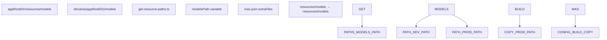
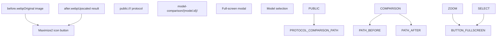

# AI 模型 (AI Models)

相关源文件

-   [common/feature-flags.ts](https://github.com/upscayl/upscayl/blob/1fdbd3e5/common/feature-flags.ts)
-   [common/models-list.ts](https://github.com/upscayl/upscayl/blob/1fdbd3e5/common/models-list.ts)
-   [electron/commands/auto-update.ts](https://github.com/upscayl/upscayl/blob/1fdbd3e5/electron/commands/auto-update.ts)
-   [electron/preload.ts](https://github.com/upscayl/upscayl/blob/1fdbd3e5/electron/preload.ts)
-   [electron/utils/get-device-specs.ts](https://github.com/upscayl/upscayl/blob/1fdbd3e5/electron/utils/get-device-specs.ts)
-   [electron/utils/get-resource-paths.ts](https://github.com/upscayl/upscayl/blob/1fdbd3e5/electron/utils/get-resource-paths.ts)
-   [electron/utils/slash.ts](https://github.com/upscayl/upscayl/blob/1fdbd3e5/electron/utils/slash.ts)
-   [electron/utils/spawn-upscayl.ts](https://github.com/upscayl/upscayl/blob/1fdbd3e5/electron/utils/spawn-upscayl.ts)
-   [mas.json](https://github.com/upscayl/upscayl/blob/1fdbd3e5/mas.json)
-   [renderer/components/main-content/onboarding-dialog.tsx](https://github.com/upscayl/upscayl/blob/1fdbd3e5/renderer/components/main-content/onboarding-dialog.tsx)
-   [renderer/components/sidebar/upscayl-tab/select-model-dialog.tsx](https://github.com/upscayl/upscayl/blob/1fdbd3e5/renderer/components/sidebar/upscayl-tab/select-model-dialog.tsx)
-   [renderer/pages/\_app.tsx](https://github.com/upscayl/upscayl/blob/1fdbd3e5/renderer/pages/_app.tsx)
-   [resources/models/high-fidelity-4x.bin](https://github.com/upscayl/upscayl/blob/1fdbd3e5/resources/models/high-fidelity-4x.bin)
-   [resources/models/high-fidelity-4x.param](https://github.com/upscayl/upscayl/blob/1fdbd3e5/resources/models/high-fidelity-4x.param)

本文档涵盖了 Upscayl 中可用的 AI 放大模型，包括内置的 Real-ESRGAN 变体、模型管理系统、自定义模型 (Custom Model) 支持以及用于模型选择的用户界面。有关使用这些模型的实际图像放大过程的信息，请参阅 [图像放大流程](/upscayl/upscayl/3.1-image-upscaling-process)。有关执行这些模型的平台特定二进制文件的详细信息，请参阅 [平台特定二进制文件](/upscayl/upscayl/3.3-platform-specific-binaries)。

## 内置 AI 模型 (Built-in AI Models)

Upscayl 包含七个内置 AI 模型，均为针对不同用例优化的 Real-ESRGAN 变体。这些模型在中央模型注册表 (Model Registry) 中定义，并提供 4 倍放大能力。

### 模型注册表 (Model Registry)

可用模型通过一个 TypeScript 注册表进行中央管理，该注册表将模型标识符映射到其配置：

| 模型 ID | 用途 | 描述 |
| --- | --- | --- |
| `upscayl-standard-4x` | 通用 | 适用于大多数图像的默认均衡模型 |
| `upscayl-lite-4x` | 轻量级 | 处理速度更快，但质量有所降低 |
| `high-fidelity-4x` | 高质量 | 针对细节丰富的图像的最佳质量输出 |
| `remacri-4x` | Foolhardy 模型 | 社区创建的变体 |
| `ultramix-balanced-4x` | 均衡处理 | 针对混合内容进行了优化 |
| `ultrasharp-4x` | 锐利细节 | Kim2091 增强锐度的模型 |
| `digital-art-4x` | 数字艺术 | 专为数字艺术和图形设计 |

```mermaid
flowchart TD
    MODELS_LIST["MODELS objectcommon/models-list.ts"]
    MODEL_ID["ModelId type"]
    STANDARD["upscayl-standard-4x"]
    LITE["upscayl-lite-4x"]
    HIFI["high-fidelity-4x"]
    REMACRI["remacri-4x"]
    ULTRAMIX["ultramix-balanced-4x"]
    ULTRASHARP["ultrasharp-4x"]
    DIGITAL["digital-art-4x"]
    PARAM_FILES["*.param filesresources/models/"]
    BIN_FILES["*.bin filesresources/models/"]

    MODELS --> LIST_STANDARD
    MODELS --> LIST_LITE
    MODELS --> LIST_HIFI
    MODELS --> LIST_REMACRI
    MODELS --> LIST_ULTRAMIX
    MODELS --> LIST_ULTRASHARP
    MODELS --> LIST_DIGITAL
    MODEL --> ID_MODELS_LIST
    STANDARD --> PARAM_FILES
    HIFI --> PARAM_FILES
    PARAM --> FILES_BIN_FILES
```

来源： [common/models-list.ts1-26](https://github.com/upscayl/upscayl/blob/1fdbd3e5/common/models-list.ts#L1-L26)

## 模型管理系统 (Model Management System)

模型管理系统处理模型存储、路径解析以及与应用程序资源分发系统的集成。

### 资源路径管理 (Resource Path Management)

模型文件存储在特定平台的路径中，这些路径在开发构建 (Development Build) 和生产构建 (Production Build) 之间会有所变化：

来源： [electron/utils/get-resource-paths.ts20-24](https://github.com/upscayl/upscayl/blob/1fdbd3e5/electron/utils/get-resource-paths.ts#L20-L24) [mas.json14-19](https://github.com/upscayl/upscayl/blob/1fdbd3e5/mas.json#L14-L19)

### 模型文件结构 (Model File Structure)

每个 AI 模型都由两个 NCNN 格式的文件组成——一个参数文件 (`.param`) 和一个二进制权重文件 (`.bin`)。参数文件使用基于文本的格式定义神经网络架构 (Neural Network Architecture)。

来源： [resources/models/high-fidelity-4x.param1-1000](https://github.com/upscayl/upscayl/blob/1fdbd3e5/resources/models/high-fidelity-4x.param#L1-L1000)

## 模型选择界面 (Model Selection Interface)

模型选择的用户界面提供了视觉对比能力，并通过复杂的对话框系统支持内置模型和自定义模型。

### 选择对话框组件 (Selection Dialog Component)

模型选择由一个专门的 React 组件处理，该组件与应用程序的状态管理 (State Management) 集成：

```mermaid
flowchart TD
    SELECT_DIALOG["SelectModelDialogselect-model-dialog.tsx"]
    DIALOG_TRIGGER["DialogTrigger button"]
    SCROLL_AREA["ScrollArea with models"]
    SELECTED_ATOM["selectedModelIdAtom"]
    CUSTOM_ATOM["customModelIdsAtom"]
    MODEL_CARDS["Model comparison cards"]
    BEFORE_IMG["before.webp images"]
    AFTER_IMG["after.webp images"]
    ZOOM_MODAL["Full-screen zoom modal"]
    USE_TRANSLATION["useTranslation hook"]
    MODEL_NAMES["Translated model names"]
    MODEL_DESC["Translated descriptions"]

    SELECT --> DIALOG_DIALOG_TRIGGER
    SELECT --> DIALOG_SCROLL_AREA
    SCROLL --> AREA_MODEL_CARDS
    MODEL --> CARDS_BEFORE_IMG
    MODEL --> CARDS_AFTER_IMG
    MODEL --> CARDS_ZOOM_MODAL
    SELECTED --> ATOM_SELECT_DIALOG
    CUSTOM --> ATOM_SELECT_DIALOG
    USE --> TRANSLATION_MODEL_NAMES
    USE --> TRANSLATION_MODEL_DESC
    MODEL --> NAMES_MODEL_CARDS
    MODEL --> DESC_MODEL_CARDS
```

来源： [renderer/components/sidebar/upscayl-tab/select-model-dialog.tsx21-182](https://github.com/upscayl/upscayl/blob/1fdbd3e5/renderer/components/sidebar/upscayl-tab/select-model-dialog.tsx#L21-L182)

### 视觉模型对比 (Visual Model Comparison)

每个模型都配有前后对比图像，以帮助用户理解视觉差异：

来源： [renderer/components/sidebar/upscayl-tab/select-model-dialog.tsx82-91](https://github.com/upscayl/upscayl/blob/1fdbd3e5/renderer/components/sidebar/upscayl-tab/select-model-dialog.tsx#L82-L91) [renderer/components/sidebar/upscayl-tab/select-model-dialog.tsx149-166](https://github.com/upscayl/upscayl/blob/1fdbd3e5/renderer/components/sidebar/upscayl-tab/select-model-dialog.tsx#L149-L166)

## 自定义模型支持 (Custom Model Support)

系统支持用户导入的自定义模型与内置模型并存，这些模型通过状态管理系统中的一个单独 原子 (Atom) 进行管理。

### 自定义模型集成 (Custom Model Integration)

自定义模型与内置模型分开存储，并集成到选择界面中：

```mermaid
flowchart TD
    CUSTOM_IDS["customModelIdsAtom"]
    CUSTOM_LIST["User-imported model list"]
    BUILT_IN_SECTION["Built-in models section"]
    CUSTOM_SECTION["Custom models section"]
    SEPARATOR["Section separator"]
    HANDLE_SELECT["handleModelSelect function"]
    SET_SELECTED["setSelectedModelId"]
    POSTHOG["Analytics tracking"]

    CUSTOM --> IDS_CUSTOM_LIST
    CUSTOM --> LIST_CUSTOM_SECTION
    BUILT --> IN_SECTION_SEPARATOR
    SEPARATOR --> CUSTOM_SECTION
    CUSTOM --> SECTION_HANDLE_SELECT
    BUILT --> IN_SECTION_HANDLE_SELECT
    HANDLE --> SELECT_SET_SELECTED
    HANDLE --> SELECT_POSTHOG
```

来源： [renderer/components/sidebar/upscayl-tab/select-model-dialog.tsx25](https://github.com/upscayl/upscayl/blob/1fdbd3e5/renderer/components/sidebar/upscayl-tab/select-model-dialog.tsx#L25-L25) [renderer/components/sidebar/upscayl-tab/select-model-dialog.tsx116-131](https://github.com/upscayl/upscayl/blob/1fdbd3e5/renderer/components/sidebar/upscayl-tab/select-model-dialog.tsx#L116-L131)

## 与处理管道的集成 (Integration with Processing Pipeline)

所选的 AI 模型通过状态管理系统和命令参数生成与图像处理管道集成。

### 模型到处理流程 (Model to Processing Flow)

> **[Mermaid sequence]**
> *(图表结构无法解析)*

模型选择直接影响传递给 `upscayl-bin` 可执行文件的命令行参数，从而决定为放大操作加载哪些神经网络权重。

来源： [renderer/components/sidebar/upscayl-tab/select-model-dialog.tsx29-38](https://github.com/upscayl/upscayl/blob/1fdbd3e5/renderer/components/sidebar/upscayl-tab/select-model-dialog.tsx#L29-L38)
