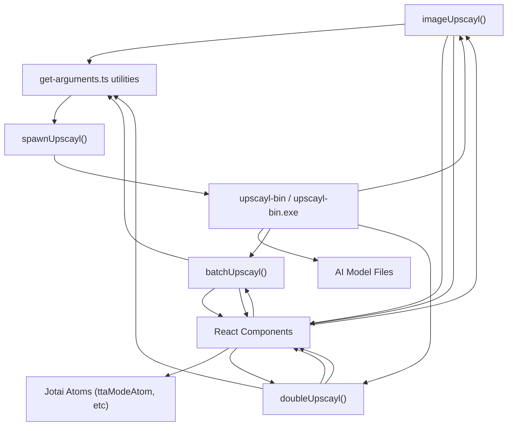
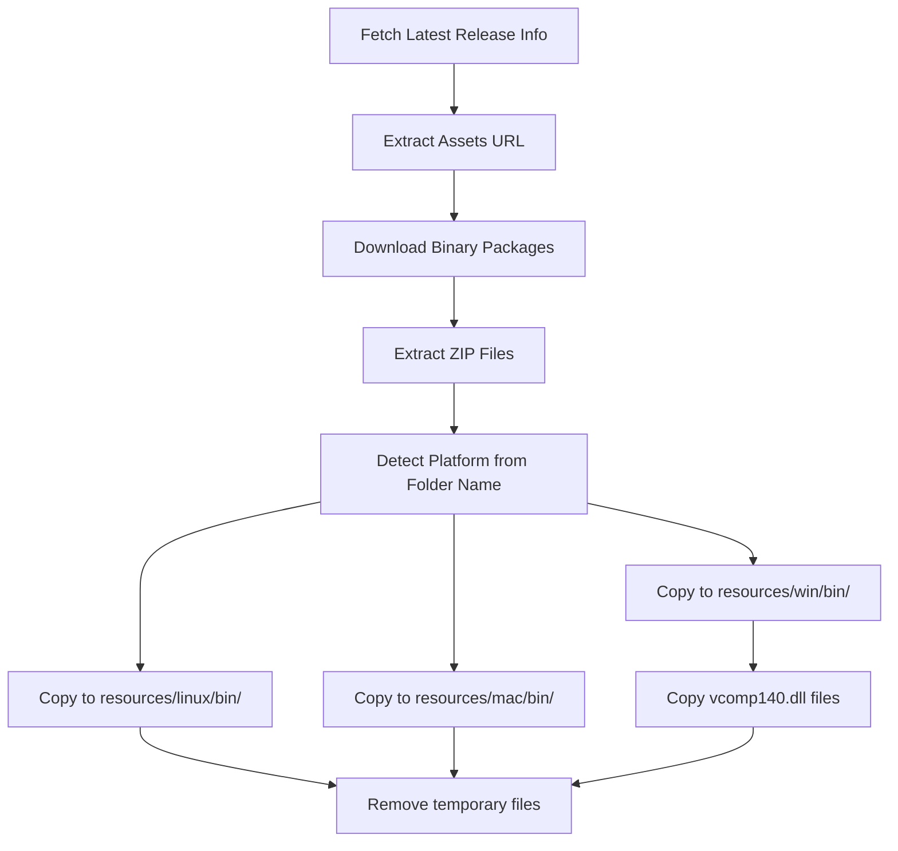

# 平台特定二进制文件 (Platform-Specific Binaries)

相关源文件

-   [.github/workflows/stale.yml](https://github.com/upscayl/upscayl/blob/1fdbd3e5/.github/workflows/stale.yml)
-   [README.md](https://github.com/upscayl/upscayl/blob/1fdbd3e5/README.md?plain=1)
-   [electron/utils/show-notification.ts](https://github.com/upscayl/upscayl/blob/1fdbd3e5/electron/utils/show-notification.ts)
-   [resources/linux/bin/upscayl-bin](https://github.com/upscayl/upscayl/blob/1fdbd3e5/resources/linux/bin/upscayl-bin)
-   [resources/mac/bin/upscayl-bin](https://github.com/upscayl/upscayl/blob/1fdbd3e5/resources/mac/bin/upscayl-bin)
-   [resources/win/bin/upscayl-bin.exe](https://github.com/upscayl/upscayl/blob/1fdbd3e5/resources/win/bin/upscayl-bin.exe)
-   [resources/win/bin/vcomp140.dll](https://github.com/upscayl/upscayl/blob/1fdbd3e5/resources/win/bin/vcomp140.dll)
-   [resources/win/bin/vcomp140d.dll](https://github.com/upscayl/upscayl/blob/1fdbd3e5/resources/win/bin/vcomp140d.dll)
-   [update\_upscayl\_ncnn\_binaries.sh](https://github.com/upscayl/upscayl/blob/1fdbd3e5/update_upscayl_ncnn_binaries.sh)
-   [upscayl.mp4](https://github.com/upscayl/upscayl/blob/1fdbd3e5/upscayl.mp4)

## 目的与概述 (Purpose and Overview)

本页面记录了在 Upscayl 中执行核心图像放大操作的平台特定二进制可执行文件。这些 原生可执行文件 (Native Executables) 包含 神经网络处理引擎 (Neural Network Processing Engine)，负责处理应用 AI 模型来放大图像的计算密集型任务。每个二进制文件都是专门针对 Windows、macOS 或 Linux 编译的，以确保在不同操作系统上获得最佳性能。

有关与这些二进制文件一起使用的 AI 模型的信息，请参阅 [AI 模型](/upscayl/upscayl/3.2-ai-models)。

## 二进制文件位置与结构 (Binary Locations and Structure)

平台特定二进制文件组织在 resources 文件夹内的专用目录中：

| 平台 | 二进制文件位置 | 其他文件 |
| --- | --- | --- |
| Linux | `resources/linux/bin/upscayl-bin` | 无 |
| macOS | `resources/mac/bin/upscayl-bin` | 无 |
| Windows | `resources/win/bin/upscayl-bin.exe` | `vcomp140.dll` (Visual C++ 运行时依赖 (Visual C++ Runtime Dependency)) |

来源： [update\_upscayl\_ncnn\_binaries.sh26-33](https://github.com/upscayl/upscayl/blob/1fdbd3e5/update_upscayl_ncnn_binaries.sh#L26-L33)

## 集成架构 (Integration Architecture)

下图说明了平台特定二进制文件如何与 Electron 应用程序集成：

来源： [electron/commands/image-upscayl.ts94-111](https://github.com/upscayl/upscayl/blob/1fdbd3e5/electron/commands/image-upscayl.ts#L94-L111) [electron/commands/batch-upscayl.ts48-65](https://github.com/upscayl/upscayl/blob/1fdbd3e5/electron/commands/batch-upscayl.ts#L48-L65) [electron/commands/double-upscayl.ts60-78](https://github.com/upscayl/upscayl/blob/1fdbd3e5/electron/commands/double-upscayl.ts#L60-L78)

## 放大处理流程 (Upscaling Process Flow)

以下序列图显示了使用平台特定二进制文件放大图像时的详细处理流程：

> **[Mermaid sequence]**
> *(图表结构无法解析)*

来源： [electron/commands/image-upscayl.ts119-159](https://github.com/upscayl/upscayl/blob/1fdbd3e5/electron/commands/image-upscayl.ts#L119-L159) [electron/commands/batch-upscayl.ts72-126](https://github.com/upscayl/upscayl/blob/1fdbd3e5/electron/commands/batch-upscayl.ts#L72-L126) [electron/commands/double-upscayl.ts141-207](https://github.com/upscayl/upscayl/blob/1fdbd3e5/electron/commands/double-upscayl.ts#L141-L207)

## 二进制命令行参数 (Binary Command Arguments)

平台特定二进制文件接受各种 命令行参数 (Command-line Arguments) 来控制放大过程。这些参数由代码库中的实用函数生成：

| 参数 | 描述 | 示例用法 |
| --- | --- | --- |
| `-i` | 输入图像或目录路径 | `-i /path/to/image.jpg` |
| `-o` | 输出图像或目录路径 | `-o /path/to/output.png` |
| `-s` | 缩放系数 (Scale Factor) (当与模型默认值不同时) | `-s 4` |
| `-m` | AI 模型目录路径 | `-m /path/to/models` |
| `-n` | 模型名称 | `-n realesrgan-x4plus` |
| `-g` | GPU ID (针对多 GPU 系统) | `-g 0` |
| `-f` | 输出格式 (png, jpg 等) | `-f png` |
| `-w` | 自定义宽度 (缩放的替代方案) | `-w 1920` |
| `-c` | 压缩级别 | `-c 95` |
| `-t` | 分块大小 (Tile Size) (用于内存管理 (Memory Management)) | `-t 512` |
| `-x` | 启用 TTA 模式 (无值的标志) | `-x` |

参数生成逻辑包括条件检查，以仅包含相关选项：

-   缩放参数仅在与模型的默认缩放比例不同时才包含
-   GPU ID 仅在指定时才包含
-   仅当用户选择此模式而非缩放时才包含自定义宽度
-   TTA 模式标志仅在启用时才包含

来源： [electron/utils/get-arguments.ts6-69](https://github.com/upscayl/upscayl/blob/1fdbd3e5/electron/utils/get-arguments.ts#L6-L69) [electron/utils/get-arguments.ts71-122](https://github.com/upscayl/upscayl/blob/1fdbd3e5/electron/utils/get-arguments.ts#L71-L122) [electron/utils/get-arguments.ts124-183](https://github.com/upscayl/upscayl/blob/1fdbd3e5/electron/utils/get-arguments.ts#L124-L183) [electron/utils/get-arguments.ts185-247](https://github.com/upscayl/upscayl/blob/1fdbd3e5/electron/utils/get-arguments.ts#L185-L247)

## 放大模式 (Upscaling Modes)

平台特定二进制文件支持三种不同的放大模式，每种模式都有其自身的实现和用例：

### 1\. 单张图像放大 (Single Image Upscaling)

由 `electron/commands/image-upscayl.ts` 中的 `imageUpscayl` 管理：

-   一次放大一张图像
-   在处理前检查输出文件是否已存在
-   根据输入、模型和缩放设置构建输出文件名
-   将进度更新流式传输到 UI
-   处理包含特殊字符 (Special Characters) 的路径的编码/解码

关键实现细节：

-   计算输出文件路径，格式为： `[filename]_upscayl_[scale]x_[model].[format]`
-   根据二进制文件输出设置主窗口进度条
-   在成功完成时显示通知

来源： [electron/commands/image-upscayl.ts24-161](https://github.com/upscayl/upscayl/blob/1fdbd3e5/electron/commands/image-upscayl.ts#L24-L161)

### 2\. 批量放大 (Batch Upscaling)

由 `electron/commands/batch-upscayl.ts` 中的 `batchUpscayl` 管理：

-   处理指定文件夹中的所有图像
-   创建一个专用输出文件夹，命名格式为： `upscayl_[format]_[model]_[scale]x`
-   即使某些图像失败也继续处理
-   为批量处理过程提供持续的进度反馈

关键实现细节：

-   如果输出目录不存在，则创建它
-   使用相同的二进制文件，但参数结构不同
-   根据是否发生任何错误显示具有不同消息的通知

来源： [electron/commands/batch-upscayl.ts19-133](https://github.com/upscayl/upscayl/blob/1fdbd3e5/electron/commands/batch-upscayl.ts#L19-L133)

### 3\. 双重放大 (Double Upscaling)

由 `electron/commands/double-upscayl.ts` 中的 `doubleUpscayl` 管理：

-   执行两个连续的放大阶段以获得增强的结果
-   第一阶段产生中间结果
-   第二阶段处理中间结果以产生最终输出
-   两个阶段使用相同的输出路径

关键实现细节：

-   为每个放大阶段设置单独的事件处理器
-   仅在第一阶段成功完成时才启动第二阶段
-   额外的参数（如压缩和 TTA 模式）应用于第二阶段

来源： [electron/commands/double-upscayl.ts26-215](https://github.com/upscayl/upscayl/blob/1fdbd3e5/electron/commands/double-upscayl.ts#L26-L215)

## 二进制更新过程 (Binary Update Process)

平台特定二进制文件使用 `update_upscayl_ncnn_binaries.sh` 脚本进行更新。该脚本：

此更新过程允许核心放大功能独立于主应用程序进行演进，从而能够在无需完整应用程序更新的情况下实现放大引擎的性能改进和错误修复。

来源： [update\_upscayl\_ncnn\_binaries.sh3-42](https://github.com/upscayl/upscayl/blob/1fdbd3e5/update_upscayl_ncnn_binaries.sh#L3-L42)

## 配置选项 (Configuration Options)

用户可以通过几种 UI 设置来配置二进制文件的操作方式，这些设置最终会影响传递给二进制文件的命令行参数：

1.  **TTA 模式**：测试时增强 (Test Time Augmentation) 以处理速度为代价提高质量

    -   由 React UI 中的 `ttaModeAtom` 管理
    -   启用时作为 `-x` 标志添加到二进制参数中
    -   可通过设置界面切换
2.  **自定义宽度与缩放**：用户可以在以下选项之间进行选择：

    -   缩放系数 (例如 2x, 4x) - 使用 `-s` 参数
    -   自定义宽度 (特定的像素宽度) - 使用 `-w` 参数
3.  **输出格式**：通过 `-f` 参数控制输出文件格式

    -   选项通常包括 PNG, JPG 和其他常见格式
4.  **压缩级别**：通过 `-c` 参数控制输出质量/大小

    -   值越高产生的图像质量越好，文件也越大
5.  **分块大小**：通过 `-t` 参数控制内存使用

    -   较大的分块速度可能更快，但需要更多的 GPU 内存
    -   较小的分块在资源有限的系统上表现更好

来源： [common/types/types.d.ts3-50](https://github.com/upscayl/upscayl/blob/1fdbd3e5/common/types/types.d.ts#L3-L50) [renderer/components/sidebar/settings-tab/tta-mode-toggle.tsx5-27](https://github.com/upscayl/upscayl/blob/1fdbd3e5/renderer/components/sidebar/settings-tab/tta-mode-toggle.tsx#L5-L27)

## 技术注意事项 (Technical Considerations)

在使用平台特定二进制文件时，应考虑以下几个技术方面：

1.  **二进制依赖**：

    -   Windows 二进制文件需要 Visual C++ Redistributable 库 (已包含为 DLL)
    -   所有平台在可用时都利用 GPU 加速
2.  **错误处理**：

    -   二进制文件通过 stderr 通信错误
    -   Electron 进程监控输出中的 "Error" 或 "failed" 等关键字
    -   正确的错误报告会被传递回 UI
3.  **资源管理**：

    -   二进制进程在 `childProcesses` 数组中被跟踪，以便潜在的终止操作
    -   `stopped` 标志在用户取消操作时管理正常终止
4.  **跨平台兼容性**：

    -   文件路径处理考虑了平台差异 (反斜杠与正斜杠)
    -   检查路径长度限制 (特别是针对 Windows)
    -   路径中的特殊字符被正确编码/解码

二进制文件代表了 Upscayl 的核心计算引擎，处理实际的 AI 处理，而 Electron 应用程序提供用户界面和进程管理。

来源： [electron/commands/image-upscayl.ts62-67](https://github.com/upscayl/upscayl/blob/1fdbd3e5/electron/commands/image-upscayl.ts#L62-L67) [electron/commands/image-upscayl.ts114-145](https://github.com/upscayl/upscayl/blob/1fdbd3e5/electron/commands/image-upscayl.ts#L114-L145) [electron/commands/batch-upscayl.ts67-99](https://github.com/upscayl/upscayl/blob/1fdbd3e5/electron/commands/batch-upscayl.ts#L67-L99) [electron/commands/double-upscayl.ts82-207](https://github.com/upscayl/upscayl/blob/1fdbd3e5/electron/commands/double-upscayl.ts#L82-L207)
