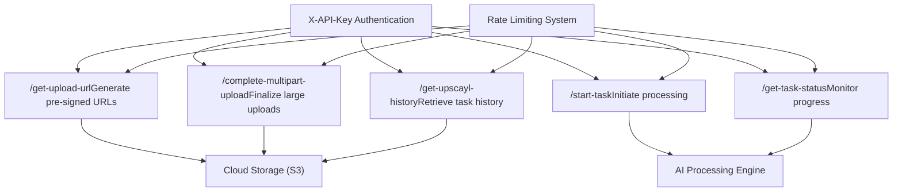

# Upscayl 云端 API (Upscayl Cloud API)

相关源文件

-   [docs/complete-a-multipart-upload.mdx](https://github.com/upscayl/upscayl/blob/1fdbd3e5/docs/complete-a-multipart-upload.mdx?plain=1)
-   [docs/get-task-status.mdx](https://github.com/upscayl/upscayl/blob/1fdbd3e5/docs/get-task-status.mdx?plain=1)
-   [docs/get-upload-url.mdx](https://github.com/upscayl/upscayl/blob/1fdbd3e5/docs/get-upload-url.mdx?plain=1)
-   [docs/get-upscayl-history.mdx](https://github.com/upscayl/upscayl/blob/1fdbd3e5/docs/get-upscayl-history.mdx?plain=1)
-   [docs/history/get-image-processing-history.mdx](https://github.com/upscayl/upscayl/blob/1fdbd3e5/docs/history/get-image-processing-history.mdx?plain=1)
-   [docs/mint.json](https://github.com/upscayl/upscayl/blob/1fdbd3e5/docs/mint.json)
-   [docs/openapi.yaml](https://github.com/upscayl/upscayl/blob/1fdbd3e5/docs/openapi.yaml)
-   [docs/start-a-new-task.mdx](https://github.com/upscayl/upscayl/blob/1fdbd3e5/start-a-new-task.mdx?plain=1)
-   [docs/tasks/check-task-status.mdx](https://github.com/upscayl/upscayl/blob/1fdbd3e5/docs/tasks/check-task-status.mdx?plain=1)
-   [docs/tasks/start-upscaling-task.mdx](https://github.com/upscayl/upscayl/blob/1fdbd3e5/docs/tasks/start-upscaling-task.mdx?plain=1)
-   [docs/upload/complete-multipart-upload.mdx](https://github.com/upscayl/upscayl/blob/1fdbd3e5/docs/upload/complete-multipart-upload.mdx?plain=1)
-   [docs/upload/generate-pre-signed-upload-url.mdx](https://github.com/upscayl/upscayl/blob/1fdbd3e5/docs/upload/generate-pre-signed-upload-url.mdx?plain=1)

Upscayl 云端 API 通过 RESTful 接口 (RESTful Interface) 提供基于云端的 AI 图像放大服务。该系统通过提供 服务端处理 (Server-side Processing) 能力来补充桌面应用程序，使用户能够放大图像而无需本地 GPU 资源 (GPU Resources) 或安装 AI 模型。

本文档涵盖了云端 API 的架构、端点 (Endpoint)、身份验证和集成模式。有关桌面应用程序核心图像处理工作流程的信息，请参阅 [图像放大流程](/upscayl/upscayl/3.1-image-upscaling-process)。有关在桌面和云端处理中使用的 AI 模型的详细信息，请参阅 [AI 模型](/upscayl/upscayl/3.2-ai-models)。

## API 架构概述 (API Architecture Overview)

Upscayl 云端 API 遵循 基于任务的处理模型 (Task-based Processing Model)，用户在该模型中上传图像、启动处理任务并 轮询 (Poll) 结果。系统支持单张图像和批量处理工作流程。

### 核心工作流程 (Core Workflow)

> **[Mermaid sequence]**
> *(图表结构无法解析)*

来源： [docs/openapi.yaml271-751](https://github.com/upscayl/upscayl/blob/1fdbd3e5/docs/openapi.yaml#L271-L751)

### API 端点架构 (API Endpoint Architecture)


来源： [docs/openapi.yaml271-751](https://github.com/upscayl/upscayl/blob/1fdbd3e5/docs/openapi.yaml#L271-L751) [docs/mint.json66-74](https://github.com/upscayl/upscayl/blob/1fdbd3e5/docs/mint.json#L66-L74)

## 身份验证系统 (Authentication System)

API 通过 `X-API-Key` 请求头使用 API 密钥身份验证 (API Key Authentication)。所有端点都需要有效的身份验证凭据。

### 身份验证配置 (Authentication Configuration)

| 组件 | 实现 |
| --- | --- |
| **方案类型** | `apiKey` |
| **请求头名称** | `X-API-Key` |
| **位置** | HTTP Header |
| **安全范围 (Security Scope)** | 所有端点 |

### 速率限制 (Rate Limiting)

API 对每个端点实施了速率限制，以确保服务的稳定性：

| 端点 | 限制 | 周期 |
| --- | --- | --- |
| `/get-upload-url` | 100 次请求 | 1 小时 |
| `/start-task` | 50 次请求 | 1 小时 |
| `/get-task-status` | 100 次请求 | 1 小时 |
| `/get-upscayl-history` | 100 次请求 | 1 小时 |
| `/complete-multipart-upload` | 50 次请求 | 1 小时 |

来源： [docs/openapi.yaml66-70](https://github.com/upscayl/upscayl/blob/1fdbd3e5/docs/openapi.yaml#L66-L70) [docs/openapi.yaml285-287](https://github.com/upscayl/upscayl/blob/1fdbd3e5/docs/openapi.yaml#L285-L287) [docs/openapi.yaml407-409](https://github.com/upscayl/upscayl/blob/1fdbd3e5/docs/openapi.yaml#L407-L409) [docs/openapi.yaml495-497](https://github.com/upscayl/upscayl/blob/1fdbd3e5/docs/openapi.yaml#L495-L497) [docs/openapi.yaml550-552](https://github.com/upscayl/upscayl/blob/1fdbd3e5/docs/openapi.yaml#L550-L552) [docs/openapi.yaml663-665](https://github.com/upscayl/upscayl/blob/1fdbd3e5/docs/openapi.yaml#L663-L665)

## API 端点 (API Endpoints)

### 上传管理 (Upload Management)

#### 生成预签名上传 URL (Generate Pre-signed Upload URL)

`/get-upload-url` 端点为直接向云存储上传文件创建安全的、有时限的 URL。

**请求 架构 (Schema)：**

```
{  "originalFileName": "vacation-photo.jpeg",  "fileType": "image/jpeg",   "fileSize": 1048576}
```
**支持的文件类型：**

-   `image/jpeg`
-   `image/png`
-   `image/webp`

**文件大小限制：**

-   最大：100MB (104,857,600 字节)
-   最小：1 字节

**响应架构：**

```
{  "status": "success",  "data": {    "uploadURL": "https://storage.upscayl.com/upload/abc123",    "fileName": "f7d9a2b4-vacation-photo.jpeg",    "fileType": "image/jpeg",    "fileSize": 1048576,    "originalFileName": "vacation-photo.jpeg",    "createdAt": 1633024800000,    "expiresAt": 1633028400000  }}
```
来源： [docs/openapi.yaml272-395](https://github.com/upscayl/upscayl/blob/1fdbd3e5/docs/openapi.yaml#L272-L395)

#### 完成分段上传 (Complete Multipart Upload)

`/complete-multipart-upload` 端点通过合并已上传的部分来最终确定 (Finalize) 大文件上传。

**请求架构：**

```
{  "data": {    "uploadId": "abc123def456",    "key": "uploads/image.jpg",    "parts": [      {        "PartNumber": 1,        "ETag": "a1b2c3d4"      }    ]  }}
```
来源： [docs/openapi.yaml652-751](https://github.com/upscayl/upscayl/blob/1fdbd3e5/docs/openapi.yaml#L652-L751)

### 任务管理 (Task Management)

#### 启动处理任务 (Start Processing Task)

`/start-task` 端点使用指定的参数启动图像放大。

**支持的 AI 模型：**

-   `upscayl-standard-4x`
-   `upscayl-lite-4x`
-   `clear-boost-4x`
-   `crystal-plus-4x`
-   `digital-art-4x`
-   `digital-art-plus-4x`
-   `natural-max-4x`
-   `natural-plus-4x`
-   `nature-boost-4x`
-   `pure-boost-4x`
-   `quick-clear-4x`
-   `texture-boost-4x`

**处理选项：**

-   **缩放系数：** `"2"`, `"4"`, `"8"`
-   **输出格式：** `png`, `jpg`, `webp`
-   **人脸增强 (Face enhancement)：** 布尔标志
-   **批量模式：** 多文件处理

来源： [docs/openapi.yaml539-651](https://github.com/upscayl/upscayl/blob/1fdbd3e5/docs/openapi.yaml#L539-L651) [docs/openapi.yaml576-590](https://github.com/upscayl/upscayl/blob/1fdbd3e5/docs/openapi.yaml#L576-L590)

#### 检查任务状态 (Check Task Status)

`/get-task-status` 端点监控处理进度并获取结果。

**状态值：**

-   `pending` - 任务已加入处理队列
-   `processing` - 正在处理中
-   `completed` - 处理成功完成
-   `failed` - 处理遇到错误

**响应包含：**

-   处理进度百分比
-   应用的模型和缩放系数
-   已处理文件的元数据
-   下载和缩略图链接
-   积分 (Credit) 扣除信息

来源： [docs/openapi.yaml484-538](https://github.com/upscayl/upscayl/blob/1fdbd3e5/docs/openapi.yaml#L484-L538)

### 历史记录管理 (History Management)

#### 获取处理历史记录 (Get Processing History)

`/get-upscayl-history` 端点检索 (Retrieve) 带有过滤选项的分页处理历史记录。

**过滤参数：**

-   `timestampOffset` - 用于分页的起始时间戳
-   `batch` - 按批量处理状态过滤
-   `failed` - 按失败状态过滤
-   `limit` - 每页结果数 (1-100, 默认 20)
-   `processed` - 按处理状态过滤

**分页 (Pagination) 响应：**

```
{  "status": "success",  "pagination": {    "total": 150,    "hasMore": true,    "nextOffset": 1633024800000  },  "data": [...]}
```
来源： [docs/openapi.yaml396-483](https://github.com/upscayl/upscayl/blob/1fdbd3e5/docs/openapi.yaml#L396-L483)

## 数据模型 (Data Models)

### 核心架构 (Core Schemas)

API 定义了几个用于管理文件和任务的关键数据结构：

#### ProcessedFile 架构

```
interface ProcessedFile {  fileName: string;  fileType: string;  path: string;  createdAt: number; // Unix timestamp  expiresAt: number; // Unix timestamp  originalFileName: string;  fileSize: number;  downloadLink: string; // URI  thumbnailLink: string; // URI  finalFileSize: number;  processedFileName: string;  dimensions: {    width: number;    height: number;  };}
```
#### TaskStatus 架构

```
interface TaskStatus {  status: "success";  data: {    batchMode: boolean;    enhanceFace: boolean;    error?: string;    files: ProcessedFile[];    model: string; // AI model identifier    progress: string; // Percentage    scale: string; // Scale factor    status: "pending" | "processing" | "completed" | "failed";    saveImageAs: "png" | "jpg" | "webp";    creditsDeducted: boolean;    deductedCredits?: number;  };}
```
来源： [docs/openapi.yaml218-255](https://github.com/upscayl/upscayl/blob/1fdbd3e5/docs/openapi.yaml#L218-L255) [docs/openapi.yaml72-135](https://github.com/upscayl/upscayl/blob/1fdbd3e5/docs/openapi.yaml#L72-L135)

## 错误处理 (Error Handling)

### 标准错误响应 (Standard Error Response)

```
{  "error": "ERROR_CODE",  "message": "Human-readable error description"}
```
### 常见错误代码 (Common Error Codes)

| HTTP 状态码 | 错误代码 | 描述 |
| --- | --- | --- |
| 400 | `BAD_REQUEST` | 无效的请求参数 |
| 400 | `INVALID_FILE_TYPE` | 不支持的文件格式 |
| 400 | `FILE_SIZE_EXCEEDED` | 文件超过 100MB 限制 |
| 401 | `UNAUTHORIZED` | 无效或缺失 API 密钥 |
| 402 | `INSUFFICIENT_CREDITS` | 积分不足，无法处理 |
| 404 | `NOT_FOUND` | 未找到资源 |
| 429 | `RATE_LIMIT_EXCEEDED` | 请求过多 |
| 500 | `INTERNAL_SERVER_ERROR` | 意外的服务器错误 |

来源： [docs/openapi.yaml18-65](https://github.com/upscayl/upscayl/blob/1fdbd3e5/docs/openapi.yaml#L18-L65) [docs/openapi.yaml371-395](https://github.com/upscayl/upscayl/blob/1fdbd3e5/docs/openapi.yaml#L371-L395) [docs/openapi.yaml639-648](https://github.com/upscayl/upscayl/blob/1fdbd3e5/docs/openapi.yaml#L639-L648)

## 集成模式 (Integration Patterns)

### 基于积分的处理 (Credit-Based Processing)

API 基于积分系统运行，处理任务会根据以下因素消耗积分：

-   图像尺寸和文件大小
-   所选 AI 模型的复杂程度
-   处理缩放系数
-   额外功能 (人脸增强)

`TaskStatus` 响应包含积分扣除信息：

-   `creditsDeducted` - 指示是否扣除积分的布尔值
-   `deductedCredits` - 消耗的积分数量

### 异步处理 (Asynchronous Processing)

所有图像处理都是 异步处理 (Asynchronous Processing)，要求客户端：

1.  通过 `/start-task` 启动任务
2.  通过 `/get-task-status` 轮询状态
3.  在状态变为 `completed` 时下载结果

此模式允许 API 处理长时间运行的 AI 处理操作，而不会阻塞客户端连接。

来源： [docs/openapi.yaml131-135](https://github.com/upscayl/upscayl/blob/1fdbd3e5/docs/openapi.yaml#L131-L135) [docs/openapi.yaml215-217](https://github.com/upscayl/upscayl/blob/1fdbd3e5/docs/openapi.yaml#L215-L217)
