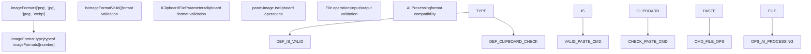
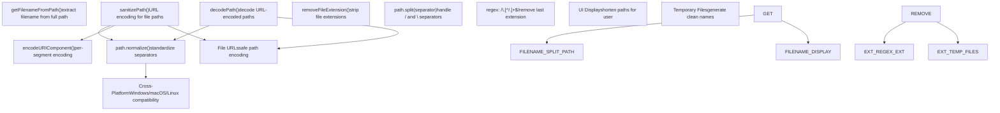

# 图像处理 (Image Handling)

相关源文件

-   [common/decode-path.ts](https://github.com/upscayl/upscayl/blob/1fdbd3e5/common/decode-path.ts)
-   [common/get-file-name.ts](https://github.com/upscayl/upscayl/blob/1fdbd3e5/common/get-file-name.ts)
-   [common/image-formats.ts](https://github.com/upscayl/upscayl/blob/1fdbd3e5/common/image-formats.ts)
-   [common/sanitize-path.ts](https://github.com/upscayl/upscayl/blob/1fdbd3e5/common/sanitize-path.ts)
-   [electron/commands/paste-image.ts](https://github.com/upscayl/upscayl/blob/1fdbd3e5/electron/commands/paste-image.ts)
-   [electron/types/types.d.ts](https://github.com/upscayl/upscayl/blob/1fdbd3e5/electron/types/types.d.ts)
-   [electron/utils/remove-file-extension.ts](https://github.com/upscayl/upscayl/blob/1fdbd3e5/electron/utils/remove-file-extension.ts)
-   [renderer/public/logo.svg](https://github.com/upscayl/upscayl/blob/1fdbd3e5/renderer/public/logo.svg)

本文档涵盖了 Upscayl 的图像文件处理系统，包括受支持的格式、文件操作、剪贴板集成 (Clipboard Integration) 和 路径实用程序 (Path Utilities)。该系统管理进入 AI 放大工作流程的图像输入/输出操作。

有关 AI 放大过程本身的信息，请参阅 [图像放大流程](/upscayl/upscayl/3.1-image-upscaling-process)。有关显示图像的 UI 组件，请参阅 [主要 UI 组件](/upscayl/upscayl/4.1-main-ui-components)。

## 受支持的图像格式 (Supported Image Formats)

Upscayl 支持在共享配置中定义的一组特定图像格式。应用程序会根据这些受支持的格式验证所有输入和输出。


**来源：** [common/image-formats.ts1](https://github.com/upscayl/upscayl/blob/1fdbd3e5/common/image-formats.ts#L1-L1) [electron/types/types.d.ts1-3](https://github.com/upscayl/upscayl/blob/1fdbd3e5/electron/types/types.d.ts#L1-L3) [electron/commands/paste-image.ts18-20](https://github.com/upscayl/upscayl/blob/1fdbd3e5/electron/commands/paste-image.ts#L18-L20)

`imageFormats` 数组定义了四种受支持的格式：PNG, JPG, JPEG 和 WebP。 `ImageFormat` 类型在整个应用程序中提供编译时类型安全性，确保仅处理有效的格式。

| 格式 | 扩展名 | 用途 |
| --- | --- | --- |
| PNG | `.png` | 无损格式 (Lossless Format)，支持透明度 (Transparency) |
| JPEG | `.jpg`, `.jpeg` | 有损格式 (Lossy Format)，文件较小 |
| WebP | `.webp` | 现代格式，压缩效果好 |

## 剪贴板集成 (Clipboard Integration)

剪贴板集成系统允许用户直接从系统剪贴板将图像粘贴到 Upscayl 中进行处理。

> **[Mermaid sequence]**
> *(图表结构无法解析)*

**来源：** [electron/commands/paste-image.ts32-61](https://github.com/upscayl/upscayl/blob/1fdbd3e5/electron/commands/paste-image.ts#L32-L61)

### 剪贴板文件参数 (Clipboard File Parameters)

`IClipboardFileParameters` 接口定义了剪贴板图像数据的结构：

```
interface IClipboardFileParameters {  name: string;           // Original filename  path: string;           // Destination path  extension: ImageFormat; // Validated format  size: number;          // File size in bytes  type: string;          // MIME type  encodedBuffer: string; // Base64 encoded image data}
```
**来源：** [electron/commands/paste-image.ts9-16](https://github.com/upscayl/upscayl/blob/1fdbd3e5/electron/commands/paste-image.ts#L9-L16)

### 剪贴板处理流程 (Clipboard Processing Flow)

1.  **格式验证**： `isImageFormatValid()` 函数对照受支持的格式数组进行检查
2.  **临时文件创建**： `createTempFileFromClipboard()` 将 base64 数据转换为文件缓冲区 (File Buffer)
3.  **文件系统写入**：缓冲区被写入 临时文件位置 (temporary file location)
4.  **成功/错误处理**：IPC 事件将结果传回给渲染器

**来源：** [electron/commands/paste-image.ts22-30](https://github.com/upscayl/upscayl/blob/1fdbd3e5/electron/commands/paste-image.ts#L22-L30) [electron/commands/paste-image.ts39-58](https://github.com/upscayl/upscayl/blob/1fdbd3e5/electron/commands/paste-image.ts#L39-L58)

## 路径处理实用程序 (Path Handling Utilities)

Upscayl 包含几个用于在不同操作系统和上下文中管理文件路径的实用程序。


**来源：** [common/get-file-name.ts1-5](https://github.com/upscayl/upscayl/blob/1fdbd3e5/common/get-file-name.ts#L1-L5) [common/sanitize-path.ts1-23](https://github.com/upscayl/upscayl/blob/1fdbd3e5/common/sanitize-path.ts#L1-L23) [common/decode-path.ts1-5](https://github.com/upscayl/upscayl/blob/1fdbd3e5/common/decode-path.ts#L1-L5) [electron/utils/remove-file-extension.ts1-8](https://github.com/upscayl/upscayl/blob/1fdbd3e5/electron/utils/remove-file-extension.ts#L1-L8)

### 文件名提取 (Filename Extraction)

`getFilenameFromPath()` 函数处理 跨平台 (Cross-platform) 路径分隔符：

-   检测路径是使用正斜杠 (`/`) 还是反斜杠 (`\`)
-   拆分路径并返回最后一个段（文件名）
-   对于无效路径返回空字符串

**来源：** [common/get-file-name.ts1-5](https://github.com/upscayl/upscayl/blob/1fdbd3e5/common/get-file-name.ts#L1-L5)

### 路径清理 (Path Sanitization)

`sanitizePath()` 函数为安全 URL 使用准备文件路径：

1.  **规范化 (Normalization)**：将反斜杠转换为正斜杠以实现 Windows 兼容性
2.  **分段**：将路径拆分为各个组件
3.  **编码**：对每个段单独应用 `encodeURIComponent()`
4.  **重构**：用正斜杠重新连接编码后的段

**来源：** [common/sanitize-path.ts4-22](https://github.com/upscayl/upscayl/blob/1fdbd3e5/common/sanitize-path.ts#L4-L22)

### 扩展名处理 (Extension Handling)

`removeFileExtension()` 函数使用 正则表达式 (Regex) 模式在保留基础文件名的同时去除文件扩展名。这对于生成输出文件名和临时文件名非常有用。

**来源：** [electron/utils/remove-file-extension.ts6-8](https://github.com/upscayl/upscayl/blob/1fdbd3e5/electron/utils/remove-file-extension.ts#L6-L8)

## 文件操作集成 (File Operation Integration)

图像处理实用程序通过几个关键接触点与更广泛的 Upscayl 工作流程集成。


**来源：** [electron/commands/paste-image.ts32-61](https://github.com/upscayl/upscayl/blob/1fdbd3e5/electron/commands/paste-image.ts#L32-L61)

### 错误处理 (Error Handling)

图像处理系统实现了全面的错误处理：

-   **格式验证错误**：无效格式会触发带有 "Unsupported Image Format" 的 `PASTE_IMAGE_SAVE_ERROR`
-   **文件系统错误**：I/O 失败会被记录并传达给渲染器进程
-   **数据缺失错误**：在处理前验证剪贴板数据是否完整

**来源：** [electron/commands/paste-image.ts46-58](https://github.com/upscayl/upscayl/blob/1fdbd3e5/electron/commands/paste-image.ts#L46-L58)

### 元数据保留 (Metadata Preservation)

虽然不直接由核心图像实用程序处理，但当用户设置中启用了 "Copy EXIF metadata" 选项时，系统会在放大过程中保留图像元数据。这种集成发生在 AI 处理期间的图像处理阶段之后。

## 集成点 (Integration Points)

图像处理系统连接到其他几个 Upscayl 子系统：

| 系统 | 集成点 | 用途 |
| --- | --- | --- |
| **IPC 命令** | `ELECTRON_COMMANDS.PASTE_IMAGE*` | 剪贴板操作 |
| **状态管理** | 输入路径原子 (Atoms) | 文件选择状态 |
| **AI 处理** | `upscayl-ncnn` 二进制文件 | 处理前的格式验证 |
| **UI 组件** | 图像查看器和对话框 | 显示和交互 |
| **设置系统** | 格式首选项 | 输出格式选择 |

**来源：** [electron/commands/paste-image.ts5](https://github.com/upscayl/upscayl/blob/1fdbd3e5/electron/commands/paste-image.ts#L5-L5) [electron/commands/paste-image.ts42-50](https://github.com/upscayl/upscayl/blob/1fdbd3e5/electron/commands/paste-image.ts#L42-L50)

图像处理系统作为 Upscayl 中所有文件操作的基础，确保在图像进入 AI 放大管道之前提供一致的格式支持、跨平台兼容性和可靠的文件处理。
