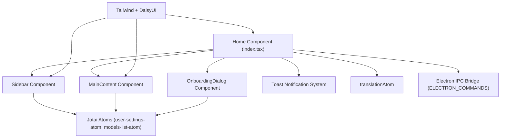
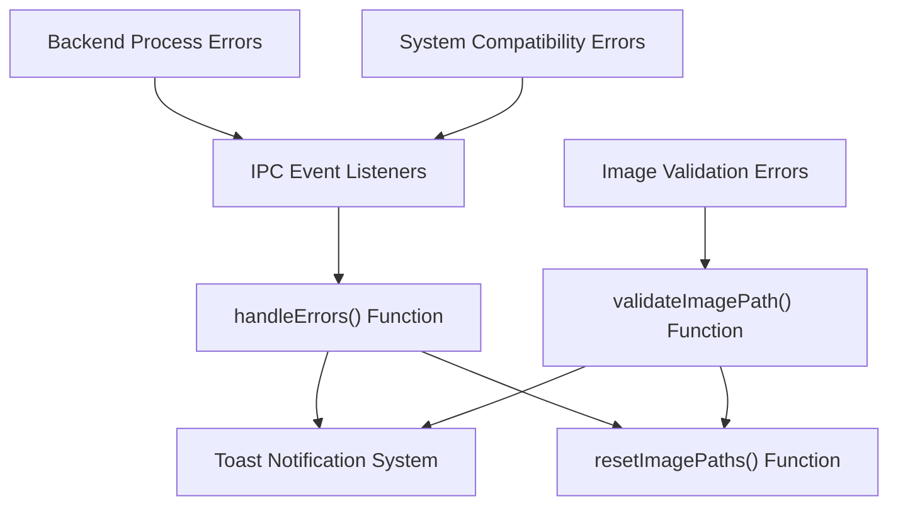
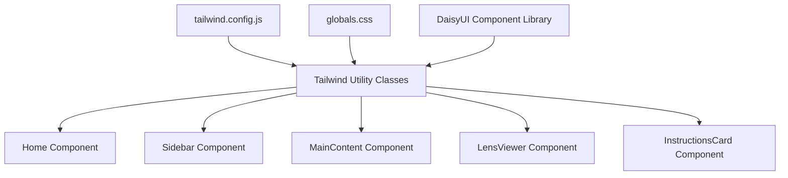
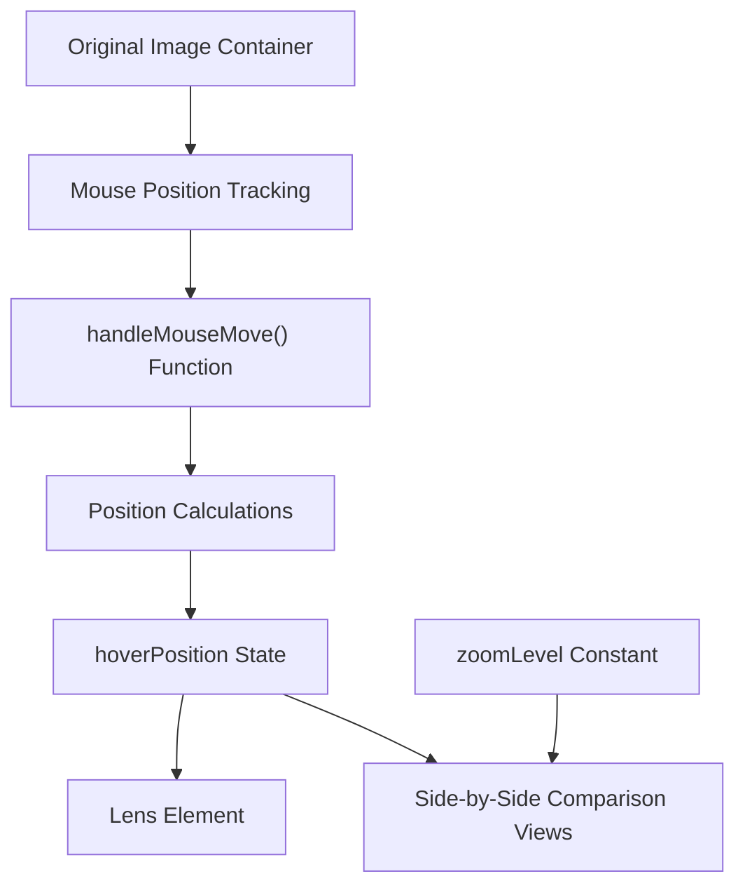

# User Interface (用户界面)

相关源文件

-   [electron/index.ts](https://github.com/upscayl/upscayl/blob/1fdbd3e5/electron/index.ts)
-   [renderer/components/main-content/index.tsx](https://github.com/upscayl/upscayl/blob/1fdbd3e5/renderer/components/main-content/index.tsx)
-   [renderer/components/main-content/instructions-card.tsx](https://github.com/upscayl/upscayl/blob/1fdbd3e5/renderer/components/main-content/instructions-card.tsx)
-   [renderer/components/main-content/lens-view.tsx](https://github.com/upscayl/upscayl/blob/1fdbd3e5/renderer/components/main-content/lens-view.tsx)
-   [renderer/pages/index.tsx](https://github.com/upscayl/upscayl/blob/1fdbd3e5/renderer/pages/index.tsx)

## Purpose and Scope (目的与范围)

本文档提供了 Upscayl 用户界面的技术概述。它涵盖了 UI Architecture (UI 架构)、Component (组件) 结构、Styling (样式) 方法和 Interaction Patterns (交互模式)。有关底层 Application Architecture (应用架构) 的信息，请参见 [应用架构](/upscayl/upscayl/2-application-architecture)；有关图像放大功能的详细信息，请参见 [核心功能](/upscayl/upscayl/3-core-functionality)。

## UI Architecture 概述

Upscayl 的用户界面是使用 Electron 框架内的 React 构建的。UI 被实现为一个在 Electron Renderer Process (渲染进程) 中运行的 Next.js 应用程序，为 Image Upscaling (图像放大) 提供了直观的界面，同时提供高级配置选项。

### UI Component Hierarchy (UI 组件层级)


来源： [renderer/pages/index.tsx18-26](https://github.com/upscayl/upscayl/blob/1fdbd3e5/renderer/pages/index.tsx#L18-L26) [renderer/pages/index.tsx327-354](https://github.com/upscayl/upscayl/blob/1fdbd3e5/renderer/pages/index.tsx#L327-L354) [electron/index.ts4-7](https://github.com/upscayl/upscayl/blob/1fdbd3e5/electron/index.ts#L4-L7)

## 主要 UI 结构

Upscayl UI 由带有 Sidebar (侧边栏) 和内容区域的主要 Layout (布局) 组成。这种结构允许用户在侧边栏中配置设置，同时在 MainContent (主内容) 区域查看和对比图像。

### 组件关系和 Props (属性)

主要的 UI 布局定义在 `Home` 组件 (`index.tsx`) 中，该组件作为根组件并协调所有 UI 元素之间的交互。组件结构遵循父子关系，其中 `Home` 组件管理 State (状态) 并将其作为 Props 传递给子组件。

来源： [renderer/pages/index.tsx27-357](https://github.com/upscayl/upscayl/blob/1fdbd3e5/renderer/pages/index.tsx#L27-L357) [renderer/pages/index.tsx332-354](https://github.com/upscayl/upscayl/blob/1fdbd3e5/renderer/pages/index.tsx#L332-L354)

## 组件拆解

### Home 组件

`Home` 组件 (`index.tsx`) 是主要的容器，用于：

-   使用 React 的 `useState` 和 Jotai Atoms (Jotai 原子) 初始化应用程序状态
-   为 Electron IPC 命令设置事件监听器
-   通过 `selectImageHandler` 和 `selectFolderHandler` 处理图像/文件夹选择
-   管理放大过程状态和 Error Handling (错误处理)
-   渲染侧边栏、主内容和 OnboardingDialog (入门对话框)

根布局结构定义为：

```
<div className="flex h-screen w-screen flex-row overflow-hidden bg-base-300">
  <Sidebar {...sidebarProps} />
  <MainContent {...mainContentProps} />
  <OnboardingDialog />
</div>
```
由 Home 组件管理的 Key State (关键状态) 元素包括：

-   `imagePath` 和 `upscaledImagePath` - 原始图像和处理后图像的路径
-   `batchFolderPath` and `upscaledBatchFolderPath` - 批量处理的路径
-   `dimensions` - 用于显示的图像 Dimensions (尺寸)
-   `progress` - 当前处理 Progress (进度)（通过 `progressAtom`）
-   `doubleUpscaylCounter` - Double Upscaling (双重放大) 过程的计数器

来源： [renderer/pages/index.tsx27-357](https://github.com/upscayl/upscayl/blob/1fdbd3e5/renderer/pages/index.tsx#L27-L357) [renderer/pages/index.tsx35-50](https://github.com/upscayl/upscayl/blob/1fdbd3e5/renderer/pages/index.tsx#L35-L50) [renderer/pages/index.tsx327-354](https://github.com/upscayl/upscayl/blob/1fdbd3e5/renderer/pages/index.tsx#L327-L354)

### Sidebar 组件

`Sidebar` 组件包含：

-   Model (模型) 选择控制
-   处理设置（缩放、格式选项）
-   Batch Mode (批量模式) 切换
-   用于开始放大过程的操作按钮
-   输出路径的配置选项

Sidebar 从 Home 组件接收 Props，包括：

-   `imagePath` - 所选图像的路径
-   `dimensions` - 图像尺寸
-   `batchFolderPath` - 批量处理的路径
-   用于图像/文件夹选择的处理函数

来源： [renderer/pages/index.tsx332-340](https://github.com/upscayl/upscayl/blob/1fdbd3e5/renderer/pages/index.tsx#L332-L340)

### 主内容区域

`MainContent` 组件显示：

-   原始图像 Preview (预览)
-   放大后的图像预览
-   Comparison Tools (对比工具)（Slider (滑块) 或 Lens View (镜片视图)）
-   文件的 Drag and Drop (拖放) 区域
-   处理过程中的进度指示器
-   未选择图像时的说明卡片

该组件接收 Props，包括图像路径、文件夹路径以及用于图像操作的处理函数。

来源： [renderer/pages/index.tsx341-353](https://github.com/upscayl/upscayl/blob/1fdbd3e5/renderer/pages/index.tsx#L341-L353)

## 用户交互流程

### 图像处理工作流

> **[Mermaid sequence]**
> *(图表结构无法解析)*

该图显示了从用户交互到图像处理和结果显示的完整流程。Home 组件通过处理用户输入、与 Electron 主进程通信以及根据处理事件更新 UI 来协调此流程。

来源： [renderer/pages/index.tsx52-101](https://github.com/upscayl/upscayl/blob/1fdbd3e5/renderer/pages/index.tsx#L52-L101) [renderer/pages/index.tsx172-207](https://github.com/upscayl/upscayl/blob/1fdbd3e5/renderer/pages/index.tsx#L172-L207) [renderer/pages/index.tsx236-250](https://github.com/upscayl/upscayl/blob/1fdbd3e5/renderer/pages/index.tsx#L236-L250)

## State Management (状态管理)

Upscayl 使用 Jotai 进行状态管理。UI 组件与各种原子进行交互，以维护和同步整个应用程序的状态。

### 状态架构

```mermaid
flowchart TD
    Home["Home Component (index.tsx)"]
    Sidebar["Sidebar Component"]
    MainContent["MainContent Component"]
    LocalState["React useState"]
    ImagePath["imagePath"]
    UpscaledPath["upscaledImagePath"]
    BatchFolder["batchFolderPath"]
    UpscaledBatch["upscaledBatchFolderPath"]
    Dimensions["dimensions"]
    DoubleCounter["doubleUpscaylCounter"]
    BatchMode["batchModeAtom"]
    Progress["progressAtom"]
    Models["customModelIdsAtom"]
    OutputPath["savedOutputPathAtom"]
    RememberOutput["rememberOutputFolderAtom"]
    UserStats["userStatsAtom"]
    Translation["translationAtom"]

    Home --> LocalState
    LocalState --> ImagePath
    LocalState --> UpscaledPath
    LocalState --> BatchFolder
    LocalState --> UpscaledBatch
    LocalState --> Dimensions
    LocalState --> DoubleCounter
    Home --> BatchMode
    Home --> Progress
    Home --> Models
    Home --> OutputPath
    Home --> RememberOutput
    Home --> UserStats
    Home --> Translation
    Sidebar --> BatchMode
    Sidebar --> Models
    Sidebar --> OutputPath
    Sidebar --> Translation
    MainContent --> ImagePath
    MainContent --> UpscaledPath
    MainContent --> BatchFolder
    MainContent --> UpscaledBatch
    MainContent --> Progress
    MainContent --> Translation
```


状态管理系统结合了 React 的局部组件状态（使用 `useState`）用于 UI 特定状态，以及 Jotai 原子用于需要在组件之间共享的全应用状态。

关键的 Jotai 原子包括：

-   `batchModeAtom` - 控制是否启用批量处理
-   `progressAtom` - 跟踪当前处理进度
-   `customModelIdsAtom` - 存储可用的 AI 模型
-   `savedOutputPathAtom` - 记住输出目录
-   `rememberOutputFolderAtom` - 切换是否记住输出文件夹
-   `translationAtom` - 处理 Internationalization (国际化)
-   `userStatsAtom` - 跟踪使用统计信息

来源： [renderer/pages/index.tsx4-17](https://github.com/upscayl/upscayl/blob/1fdbd3e5/renderer/pages/index.tsx#L4-L17) [renderer/pages/index.tsx35-50](https://github.com/upscayl/upscayl/blob/1fdbd3e5/renderer/pages/index.tsx#L35-L50) [renderer/pages/index.tsx236-284](https://github.com/upscayl/upscayl/blob/1fdbd3e5/renderer/pages/index.tsx#L236-L284)

## Error Handling 和通知

UI 使用 Toast Notification System (Toast 通知系统) 向用户显示错误和重要消息。错误处理通过事件监听器实现，这些监听器捕获来自后端处理的错误并显示相应的消息。

### 错误处理流程


UI 处理的错误类别包括：

-   GPU 兼容性错误（`Invalid GPU` 消息）
-   文件读写错误（权限问题）
-   图像格式验证错误（不支持的格式）
-   Tile size (切片大小) 错误（图像处理限制）
-   处理引擎中未捕获的异常

错误处理系统使用来自 UI 组件库的 `useToast` Hook (钩子) 来显示用户友好的错误消息，并提供相应的操作，如复制错误详情或打开文档。

来源： [renderer/pages/index.tsx86-101](https://github.com/upscayl/upscayl/blob/1fdbd3e5/renderer/pages/index.tsx#L86-L101) [renderer/pages/index.tsx104-166](https://github.com/upscayl/upscayl/blob/1fdbd3e5/renderer/pages/index.tsx#L104-L166) [renderer/pages/index.tsx186-192](https://github.com/upscayl/upscayl/blob/1fdbd3e5/renderer/pages/index.tsx#L186-L192)

## Styling System (样式系统)

### Tailwind CSS 和 DaisyUI 集成

Upscayl 使用带有 DaisyUI 插件的 Tailwind CSS 进行组件样式设计。这为整个应用程序提供了一个具有实用优先 CSS 类的统一设计系统。


该应用程序使用一个名为 "upscayl" 的自定义主题，具有基于板岩色的深色配色方案。样式直接在组件 JSX 中使用 Tailwind 的实用类应用。

### 组件样式示例

Home 组件使用 Tailwind 类进行布局：

```
<div className="flex h-screen w-screen flex-row overflow-hidden bg-base-300">
  <Sidebar {...sidebarProps} />
  <MainContent {...mainContentProps} />
  <OnboardingDialog />
</div>
```
LensViewer 组件使用 Tailwind 定位和美化对比镜片：

```
<div
  className="pointer-events-none absolute hidden cursor-cell border border-primary bg-black/10 group-hover:block"
  style={{
    left: `${hoverPosition.relativeMouseX}px`,
    top: `${hoverPosition.mouseY}px`,
    transform: "translate(-50%, -50%)",
    height: `48px`,
    width: `48px`,
  }}
/>
```
InstructionsCard 组件使用带有 Tailwind 类的 DaisyUI 组件：

```
<div className="flex flex-col items-center gap-4 rounded-btn bg-base-200 p-4">
  <p className="text-lg font-semibold">
    {batchMode
      ? t("APP.RIGHT_PANE_INFO.SELECT_FOLDER")
      : t("APP.RIGHT_PANE_INFO.SELECT_IMAGE")}
  </p>
  {/* Additional content */}
  <p className="badge badge-primary text-sm">Upscayl v{version}</p>
</div>
```
来源： [renderer/pages/index.tsx327-354](https://github.com/upscayl/upscayl/blob/1fdbd3e5/renderer/pages/index.tsx#L327-L354) [renderer/components/main-content/lens-view.tsx102-166](https://github.com/upscayl/upscayl/blob/1fdbd3e5/renderer/components/main-content/lens-view.tsx#L102-L166) [renderer/components/main-content/instructions-card.tsx8-27](https://github.com/upscayl/upscayl/blob/1fdbd3e5/renderer/components/main-content/instructions-card.tsx#L8-L27)

## 专用 UI 组件

### 图像对比工具

Upscayl 提供了用于对比原始图像和放大图像的专用 UI 组件：

#### LensViewer 组件

`LensViewer` 组件实现了一个放大镜，当用户在图像上移动时，并排显示原始版本和放大版本的图像。这允许对放大结果进行详细对比。


LensViewer 组件：

-   跟踪鼠标在原始图像上的位置
-   计算用于镜片显示的相对位置
-   渲染一个随光标移动的镜片元素
-   显示原始图像和放大图像的放大视图
-   将缩放级别应用于对比视图

来源： [renderer/components/main-content/lens-view.tsx3-170](https://github.com/upscayl/upscayl/blob/1fdbd3e5/renderer/components/main-content/lens-view.tsx#L3-L170)

### 教学 UI 元素

`InstructionsCard` 组件根据当前应用程序状态为用户提供上下文指导：

```
<div className="flex flex-col items-center gap-4 rounded-btn bg-base-200 p-4">
  <p className="text-lg font-semibold">
    {batchMode
      ? t("APP.RIGHT_PANE_INFO.SELECT_FOLDER")
      : t("APP.RIGHT_PANE_INFO.SELECT_IMAGE")}
  </p>
  {/* Conditional instructions based on mode */}
  <p className="badge badge-primary text-sm">Upscayl v{version}</p>
</div>
```
该组件根据用户是在批量模式还是单图模式下调整其内容，为每个工作流提供适当的说明。

来源： [renderer/components/main-content/instructions-card.tsx5-30](https://github.com/upscayl/upscayl/blob/1fdbd3e5/renderer/components/main-content/instructions-card.tsx#L5-L30)

## UI-Electron Communication (UI-Electron 通信)

UI 通过 IPC Bridge (IPC 桥接) 与 Electron 后端通信。这允许 UI 触发文件操作、开始处理并接收来自主进程的更新。

### IPC 通信架构

> **[Mermaid sequence]**
> *(图表结构无法解析)*

### 关键 IPC 命令

UI 与 Electron 主进程之间的通信围绕 `ELECTRON_COMMANDS` 常量中定义的一组预定义命令进行：

| 命令 | 方向 | 目的 |
| --- | --- | --- |
| `SELECT_FILE` | UI → Main | 打开文件选择对话框 |
| `SELECT_FOLDER` | UI → Main | 打开文件夹选择对话框 |
| `UPSCAYL` | UI → Main | 处理单张图像 |
| `FOLDER_UPSCAYL` | UI → Main | 批量处理图像 |
| `DOUBLE_UPSCAYL` | UI → Main | 对图像进行两次处理 |
| `UPSCAYL_PROGRESS` | Main → UI | 发送处理进度更新 |
| `UPSCAYL_DONE` | Main → UI | 处理完成时通知 |
| `UPSCAYL_ERROR` | Main → UI | 发送错误通知 |
| `UPSCAYL_WARNING` | Main → UI | 发送警告通知 |
| `PASTE_IMAGE` | UI → Main | 处理粘贴的图像数据 |
| `LOG` | Main → UI | 向 UI 发送日志消息 |

Home 组件在 `useEffect` Hook 中为这些命令设置事件监听器，确保 UI 在整个应用程序生命周期内都能响应来自主进程的事件。

来源： [renderer/pages/index.tsx104-295](https://github.com/upscayl/upscayl/blob/1fdbd3e5/renderer/pages/index.tsx#L104-L295) [electron/index.ts84-105](https://github.com/upscayl/upscayl/blob/1fdbd3e5/electron/index.ts#L84-L105) [common/electron-commands.ts](https://github.com/upscayl/upscayl/blob/1fdbd3e5/common/electron-commands.ts)

## 结论

Upscayl 的用户界面旨在为 AI 图像放大提供直观且强大的界面。该 UI 使用 React 构建，并使用 Tailwind CSS 设计样式，通过 IPC 与 Electron 后端进行通信。这种架构允许在不同平台上提供响应迅速且原生感十足的体验，同时保持一致的设计语言。
