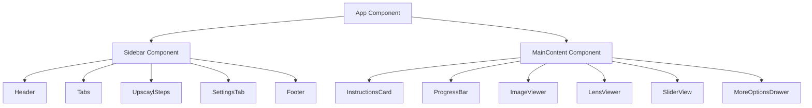
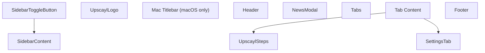
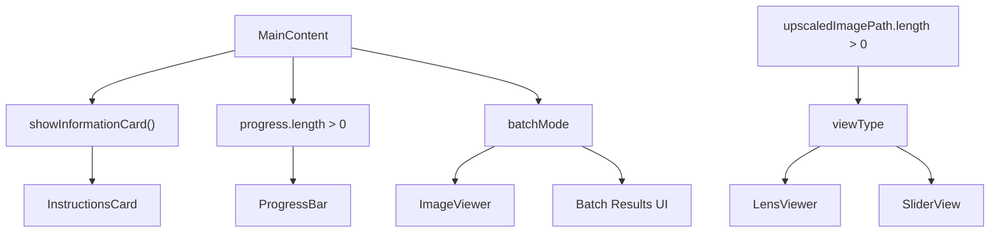
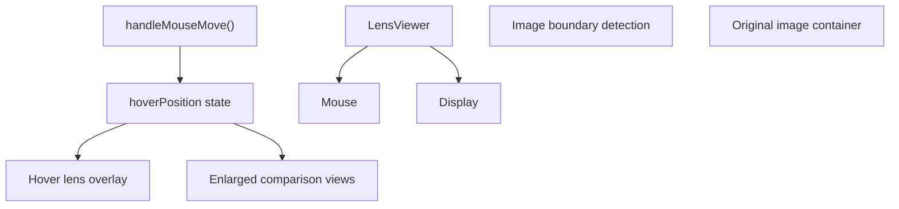

# 主要 UI 组件 (Main UI Components)

相关源文件

-   [renderer/components/main-content/index.tsx](https://github.com/upscayl/upscayl/blob/1fdbd3e5/renderer/components/main-content/index.tsx)
-   [renderer/components/main-content/instructions-card.tsx](https://github.com/upscayl/upscayl/blob/1fdbd3e5/renderer/components/main-content/instructions-card.tsx)
-   [renderer/components/main-content/lens-view.tsx](https://github.com/upscayl/upscayl/blob/1fdbd3e5/renderer/components/main-content/lens-view.tsx)
-   [renderer/components/sidebar/index.tsx](https://github.com/upscayl/upscayl/blob/1fdbd3e5/renderer/components/sidebar/index.tsx)
-   [renderer/locales/en.json](https://github.com/upscayl/upscayl/blob/1fdbd3e5/renderer/locales/en.json)
-   [renderer/locales/es.json](https://github.com/upscayl/upscayl/blob/1fdbd3e5/renderer/locales/es.json)
-   [renderer/locales/fr.json](https://github.com/upscayl/upscayl/blob/1fdbd3e5/renderer/locales/fr.json)
-   [renderer/locales/ja.json](https://github.com/upscayl/upscayl/blob/1fdbd3e5/renderer/locales/ja.json)
-   [renderer/locales/ru.json](https://github.com/upscayl/upscayl/blob/1fdbd3e5/renderer/locales/ru.json)
-   [renderer/locales/vi.json](https://github.com/upscayl/upscayl/blob/1fdbd3e5/renderer/locales/vi.json)
-   [renderer/locales/zh.json](https://github.com/upscayl/upscayl/blob/1fdbd3e5/renderer/locales/zh.json)

本文档涵盖了构成 Upscayl Desktop Application Interface (桌面应用程序界面) 的主要用户界面组件。它侧重于 React 组件结构、Layout (布局) 组织以及 Renderer Process (渲染进程) 内的组件交互。

有关整个应用程序架构和进程分离的信息，请参见 [应用架构](/upscayl/upscayl/2-application-architecture)。有关状态管理模式的详细信息，请参见 [状态管理](/upscayl/upscayl/2.4-state-management)。有关样式和主题的信息，请参见 [样式与主题](/upscayl/upscayl/4.2-styling-and-theming)。

## UI Architecture (UI 架构) 概述

Upscayl 的用户界面是在 Electron 渲染进程中使用 React 组件构建的。主要布局由一个用于控制的可折叠 Sidebar (侧边栏) 和一个用于图像显示及交互的 MainContent (主内容) 区域组成。

### 主要布局结构

来源： [renderer/components/sidebar/index.tsx46-261](https://github.com/upscayl/upscayl/blob/1fdbd3e5/renderer/components/sidebar/index.tsx#L46-L261) [renderer/components/main-content/index.tsx48-355](https://github.com/upscayl/upscayl/blob/1fdbd3e5/renderer/components/main-content/index.tsx#L48-L355)

### 组件状态管理集成

来源： [renderer/components/sidebar/index.tsx4-24](https://github.com/upscayl/upscayl/blob/1fdbd3e5/renderer/components/sidebar/index.tsx#L4-L24) [renderer/components/main-content/index.tsx5-13](https://github.com/upscayl/upscayl/blob/1fdbd3e5/renderer/components/main-content/index.tsx#L5-L13)

## Sidebar 组件

`Sidebar` 组件作为主要控制界面，包含所有用户设置和 Workflow Steps (工作流步骤)。它支持折叠功能，并适应不同操作系统的要求。

### 核心结构

侧边栏包含两个可通过 `Tabs` (选项卡) 组件访问的主要选项卡：

-   **Upscayl 选项卡** (`selectedTab === 0`)：包含主要的工作流步骤
-   **设置选项卡** (`selectedTab === 1`)：包含应用程序配置选项

侧边栏的 Visibility (可见性) 由 `showSidebarAtom` 状态控制，并包含通过位于侧边栏容器外部的切换按钮实现的 Responsive Behavior (响应式行为)。

来源： [renderer/components/sidebar/index.tsx196-260](https://github.com/upscayl/upscayl/blob/1fdbd3e5/renderer/components/sidebar/index.tsx#L196-L260) [renderer/components/sidebar/sidebar-button.tsx](https://github.com/upscayl/upscayl/blob/1fdbd3e5/renderer/components/sidebar/sidebar-button.tsx)

### UpscaylSteps 组件

`UpscaylSteps` 组件通过四个步骤实现了主要的工作流界面：

| 步骤 | 组件 | 目的 |
| --- | --- | --- |
| 1 | File Selection (文件选择) | 选择单张图像或批量文件夹 |
| 2 | Model Selection (模型选择) | 选择 AI 放大模型 |
| 3 | Output Path (输出路径) | 设置目标文件夹 |
| 4 | Scale & Execute (缩放与执行) | 配置缩放并开始处理 |

该组件通过 `batchMode` 原子处理单张图像和 Batch Processing (批量处理) 之间的 Mode Switching (模式切换)，动态更新界面和可用选项。

来源： [renderer/components/sidebar/upscayl-tab/upscayl-steps.tsx](https://github.com/upscayl/upscayl/blob/1fdbd3e5/renderer/components/sidebar/upscayl-tab/upscayl-steps.tsx) [renderer/locales/en.json119-181](https://github.com/upscayl/upscayl/blob/1fdbd3e5/renderer/locales/en.json#L119-L181)

### SettingsTab 组件

`SettingsTab` 提供了对 Advanced Configuration (高级配置) 选项的访问，包括：

-   GPU 设置和自定义模型
-   图像格式和压缩选项
-   高级处理参数（TTA mode (TTA 模式)、Tile size (切片大小)）
-   应用程序偏好设置（通知、主题、语言）

来源： [renderer/components/sidebar/settings-tab/index.tsx](https://github.com/upscayl/upscayl/blob/1fdbd3e5/renderer/components/sidebar/settings-tab/index.tsx) [renderer/locales/en.json14-111](https://github.com/upscayl/upscayl/blob/1fdbd3e5/renderer/locales/en.json#L14-L111)

## MainContent 组件

`MainContent` 组件管理中央显示区域，并处理主要的用户交互，包括 Drag and Drop (拖放)、剪贴板操作和图像查看。

### 内容显示逻辑

主内容根据应用程序状态动态渲染不同的组件：

来源： [renderer/components/main-content/index.tsx80-94](https://github.com/upscayl/upscayl/blob/1fdbd3e5/renderer/components/main-content/index.tsx#L80-L94) [renderer/components/main-content/index.tsx291-350](https://github.com/upscayl/upscayl/blob/1fdbd3e5/renderer/components/main-content/index.tsx#L291-L350)

### 拖放实现

该组件实现了全面的拖放功能：

-   **Event Handlers (事件处理器)**: `handleDragEnter`、`handleDragLeave`、`handleDragOver`、`handleDrop`
-   **文件验证**: 根据 `VALID_IMAGE_FORMATS` 检查文件类型
-   **路径管理**: 自动设置输出路径并验证图像路径

来源： [renderer/components/main-content/index.tsx97-163](https://github.com/upscayl/upscayl/blob/1fdbd3e5/renderer/components/main-content/index.tsx#L97-L163)

### Clipboard Integration (剪贴板集成)

剪贴板功能支持直接将图像粘贴到应用程序中：

-   **粘贴处理器**: `handlePaste()` 处理剪贴板数据
-   **文件处理**: 将剪贴板图像转换为 Base64 并发送到主进程
-   **临时文件管理**: 使用基于时间戳的命名创建临时文件

来源： [renderer/components/main-content/index.tsx165-239](https://github.com/upscayl/upscayl/blob/1fdbd3e5/renderer/components/main-content/index.tsx#L165-L239)

## 图像查看组件

### ImageViewer 组件

基本的图像查看器在处理前显示所选图像，并为应用程序处理尺寸检测。

来源： [renderer/components/main-content/image-viewer.tsx](https://github.com/upscayl/upscayl/blob/1fdbd3e5/renderer/components/main-content/image-viewer.tsx)

### LensViewer 组件

`LensViewer` 提供了一个带有基于悬停的 Magnification (放大倍数) 的交互式对比工具：

关键特性：

-   **4x Zoom Level (缩放级别)**: 可配置的放大倍数用于详细对比
-   **实时定位**: 计算鼠标相对于图像边界的位置
-   **双视图显示**: 同时显示原始版本和放大版本

来源： [renderer/components/main-content/lens-view.tsx1-171](https://github.com/upscayl/upscayl/blob/1fdbd3e5/renderer/components/main-content/lens-view.tsx#L1-L171)

### SliderView 组件

`SliderView` 提供了并排对比，带有一个可调节的分割线，用于对比原始图像和放大图像。

来源： [renderer/components/main-content/slider-view.tsx](https://github.com/upscayl/upscayl/blob/1fdbd3e5/renderer/components/main-content/slider-view.tsx)

## 交互元素

### MoreOptionsDrawer 组件

提供额外的查看控制和统计信息：

-   **View Mode Toggle (视图模式切换)**: 在镜片和滑块视图之间切换
-   **缩放控制**: 调整图像查看的缩放级别
-   **Usage Statistics (使用统计)**: 显示来自 `userStatsAtom` 的用户统计信息
-   **重置功能**: 清除当前图像选择

来源： [renderer/components/main-content/more-options-drawer.tsx](https://github.com/upscayl/upscayl/blob/1fdbd3e5/renderer/components/main-content/more-options-drawer.tsx)

### ProgressBar 组件

显示带有不同模式的处理进度：

-   **单张图像进度**: 显示单张图像的处理状态
-   **批量进度**: 显示带有文件计数的批量处理
-   **停止功能**: 允许用户取消正在进行的操作

该组件根据 `batchMode` 状态和用于 Multi-pass processing (多轮处理) 的 `doubleUpscaylCounter` 调整其显示。

来源： [renderer/components/main-content/progress-bar.tsx](https://github.com/upscayl/upscayl/blob/1fdbd3e5/renderer/components/main-content/progress-bar.tsx)

### InstructionsCard 组件

当没有加载图像时为用户提供上下文指导：

-   **模式特定说明**: 针对单张和批量模式的不同消息
-   **Internationalization (国际化)**: 使用翻译键支持多语言
-   **版本显示**: 显示当前应用程序版本

来源： [renderer/components/main-content/instructions-card.tsx1-31](https://github.com/upscayl/upscayl/blob/1fdbd3e5/renderer/components/main-content/instructions-card.tsx#L1-L31)

## 平台特定元素

### MacTitlebarDragRegion 组件

处理 macOS 特定的窗口管理要求，在侧边栏折叠时为应用程序窗口提供一个 Draggable region (可拖拽区域)。

来源： [renderer/components/main-content/mac-titlebar-drag-region.tsx](https://github.com/upscayl/upscayl/blob/1fdbd3e5/renderer/components/main-content/mac-titlebar-drag-region.tsx)

### 响应式行为

UI 适应不同的屏幕尺寸和平台要求：

-   **侧边栏折叠**: 在较小屏幕上保持功能
-   **触摸支持**: 为具有触摸功能的设备提供响应式设计
-   **平台检测**: 根据 `window.electron.platform` 进行条件渲染

来源： [renderer/components/sidebar/index.tsx216-218](https://github.com/upscayl/upscayl/blob/1fdbd3e5/renderer/components/sidebar/index.tsx#L216-L218)
