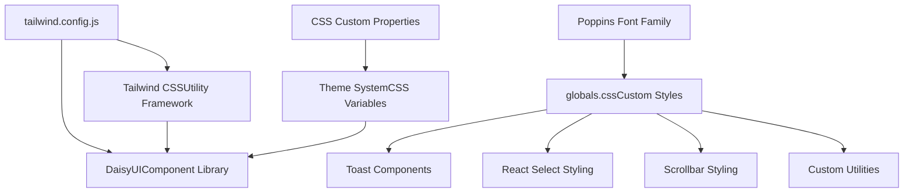
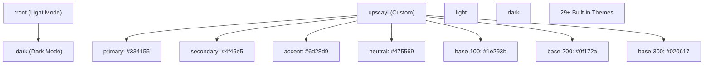
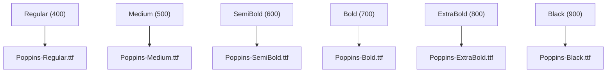
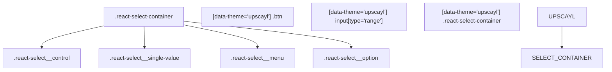
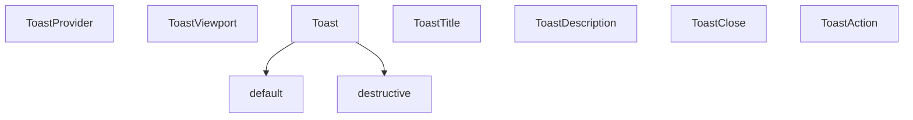
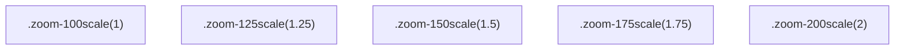
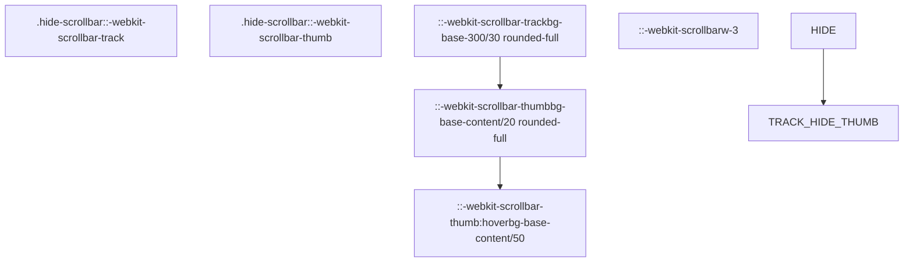

# 样式与主题 (Styling and Theming)

相关源文件

-   [renderer/components/ui/toast.tsx](https://github.com/upscayl/upscayl/blob/1fdbd3e5/renderer/components/ui/toast.tsx)
-   [renderer/components/ui/toaster.tsx](https://github.com/upscayl/upscayl/blob/1fdbd3e5/renderer/components/ui/toaster.tsx)
-   [renderer/components/ui/use-toast.ts](https://github.com/upscayl/upscayl/blob/1fdbd3e5/renderer/components/ui/use-toast.ts)
-   [renderer/public/Upscayl New Page.png](https://github.com/upscayl/upscayl/blob/1fdbd3e5/renderer/public/Upscayl New Page.png)
-   [renderer/public/down-arrow.svg](https://github.com/upscayl/upscayl/blob/1fdbd3e5/renderer/public/down-arrow.svg)
-   [renderer/styles/globals.css](https://github.com/upscayl/upscayl/blob/1fdbd3e5/renderer/styles/globals.css)
-   [tailwind.config.js](https://github.com/upscayl/upscayl/blob/1fdbd3e5/tailwind.config.js)

本文档涵盖了 Upscayl 的样式和主题系统，该系统基于 Tailwind CSS 和 DaisyUI 构建。该系统通过支持多个主题、自定义 Typography (排版) 和专用组件样式，提供了一致的视觉设计。有关 UI 组件及其行为的信息，请参见 [主要 UI 组件](/upscayl/upscayl/4.1-main-ui-components)。

## Styling Architecture (样式架构)

Upscayl 采用分层样式方法，结合了作为基础的 Tailwind CSS、用于组件样式的 DaisyUI 以及用于应用程序特定需求的 Custom Styles (自定义样式)。

来源： [tailwind.config.js1-159](https://github.com/upscayl/upscayl/blob/1fdbd3e5/tailwind.config.js#L1-L159) [renderer/styles/globals.css38-40](https://github.com/upscayl/upscayl/blob/1fdbd3e5/renderer/styles/globals.css#L38-L40)

## Theme System (主题系统)

该应用程序使用 CSS Custom Properties (CSS 自定义属性) 和 DaisyUI 的主题配置实现了一个全面的主题系统。主要主题是自定义的 "upscayl" 主题，具有针对 Light Mode (浅色模式) 和 Dark Mode (深色模式) 的特定 Color Scheme (配色方案)。

### 主题配置

主题系统支持通过在根元素上切换 CSS 类来在浅色和深色模式之间进行动态切换。

来源： [tailwind.config.js105-127](https://github.com/upscayl/upscayl/blob/1fdbd3e5/tailwind.config.js#L105-L127) [renderer/styles/globals.css50-110](https://github.com/upscayl/upscayl/blob/1fdbd3e5/renderer/styles/globals.css#L50-L110)

### 颜色系统集成

Tailwind 配置将 DaisyUI 颜色令牌映射到 Semantic Name (语义名称)，在实用程序框架和组件库之间建立了桥梁：

| 语义名称 | DaisyUI Token (DaisyUI 令牌) | 目的 |
| --- | --- | --- |
| `background` | `base-100` | 主背景颜色 |
| `foreground` | `base-content` | 主要文本颜色 |
| `border` | `primary` | 边框元素 |
| `destructive` | `error` | 错误状态 |
| `muted` | `base-300` | 弱化元素 |

来源： [tailwind.config.js43-77](https://github.com/upscayl/upscayl/blob/1fdbd3e5/tailwind.config.js#L43-L77)

## Typography (排版)

应用程序使用 Poppins Font Family (Poppins 字体族)，具有通过自定义 `@font-face` 声明加载的多个 Weight Variants (字重变体)。

### 字体加载配置

默认情况下，所有元素都通过基础层样式接收 Poppins 字体族：`font-family: "Poppins", sans-serif`。

来源： [renderer/styles/globals.css1-36](https://github.com/upscayl/upscayl/blob/1fdbd3e5/renderer/styles/globals.css#L1-L36) [renderer/styles/globals.css42-46](https://github.com/upscayl/upscayl/blob/1fdbd3e5/renderer/styles/globals.css#L42-L46)

## 组件样式

### React Select 组件

应用程序包含了对 `react-select` 组件的全面样式设计，以匹配整体主题：

样式设计确保了在不同主题上下文下的一致外观，并针对自定义的 "upscayl" 主题进行了特定的覆盖。

来源： [renderer/styles/globals.css144-177](https://github.com/upscayl/upscayl/blob/1fdbd3e5/renderer/styles/globals.css#L144-L177) [renderer/styles/globals.css208-230](https://github.com/upscayl/upscayl/blob/1fdbd3e5/renderer/styles/globals.css#L208-L230)

### Toast 通知样式

Toast 系统使用 Radix UI Primitives (Radix UI 基元)，并通过 Class Variance Authority (CVA) 进行自定义样式设计：

来源： [renderer/components/ui/toast.tsx25-39](https://github.com/upscayl/upscayl/blob/1fdbd3e5/renderer/components/ui/toast.tsx#L25-L39) [renderer/components/ui/toaster.tsx11-33](https://github.com/upscayl/upscayl/blob/1fdbd3e5/renderer/components/ui/toaster.tsx#L11-L33)

## Custom Utilities (自定义实用程序) 和动画

### Utility Classes (实用工具类)

应用程序为常见模式定义了几个自定义实用工具类：

| 类 | 目的 | 实现 |
| --- | --- | --- |
| `.animate` | 标准过渡 | `transition-all duration-300 ease-in-out` |
| `.step-heading` | 章节标题 | `mb-2 font-semibold` |
| `.full-width` | 全宽元素 | `w-full` |
| `.hide-scrollbar` | 隐藏滚动条 | Webkit 滚动条样式 |

### 缩放变换

自定义缩放类提供了精确的比例控制：

来源： [renderer/styles/globals.css136-186](https://github.com/upscayl/upscayl/blob/1fdbd3e5/renderer/styles/globals.css#L136-L186) [renderer/styles/globals.css188-202](https://github.com/upscayl/upscayl/blob/1fdbd3e5/renderer/styles/globals.css#L188-L202)

### Animation Keyframes (动画关键帧)

系统包含了自定义动画，以增强用户体验：

-   **animate-step-in**: 用于步骤切换的淡入和滑动动画
-   **sk-rotateplane**: 用于 Loading Spinners (加载动画) 的 3D 旋转动画
-   **marquee/marquee2**: Marquee (跑马灯) 文本动画

来源： [renderer/styles/globals.css204-306](https://github.com/upscayl/upscayl/blob/1fdbd3e5/renderer/styles/globals.css#L204-L306) [tailwind.config.js19-32](https://github.com/upscayl/upscayl/blob/1fdbd3e5/tailwind.config.js#L19-L32)

## 滚动条自定义

自定义滚动条样式为整个应用程序提供了一致的外观：

来源： [renderer/styles/globals.css111-134](https://github.com/upscayl/upscayl/blob/1fdbd3e5/renderer/styles/globals.css#L111-L134)

## 平台特定样式

### macOS 集成

应用程序包含了针对 macOS 集成的平台特定样式：

-   **mac-titlebar**: 通过 `-webkit-app-region: drag` 实现 Window Dragging (窗口拖拽)
-   **checkerboard**: 用于图像查看的透明度棋盘格背景

来源： [renderer/styles/globals.css236-260](https://github.com/upscayl/upscayl/blob/1fdbd3e5/renderer/styles/globals.css#L236-L260)
