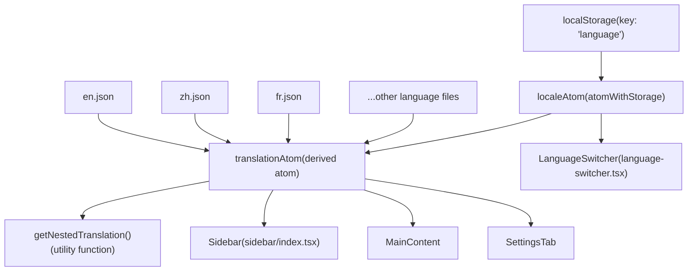
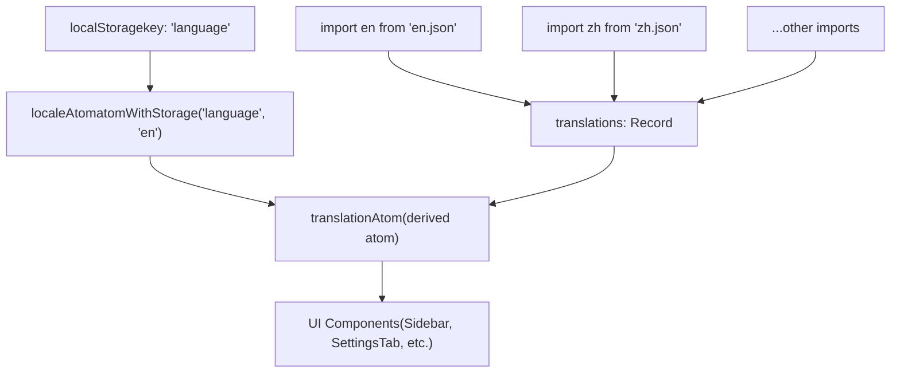
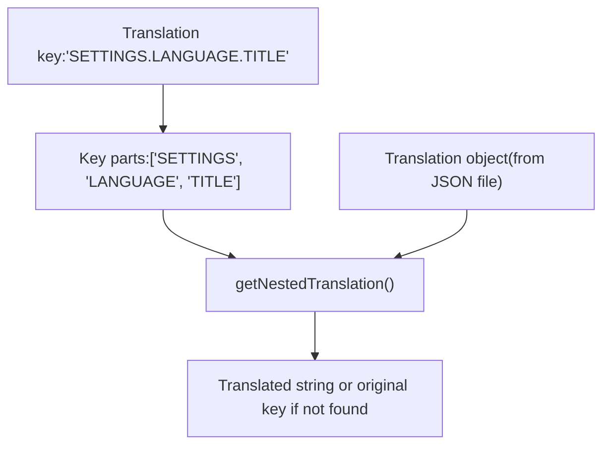
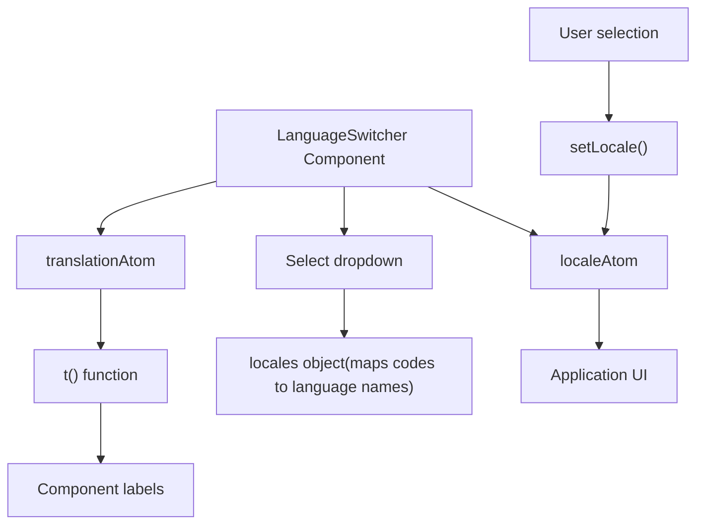
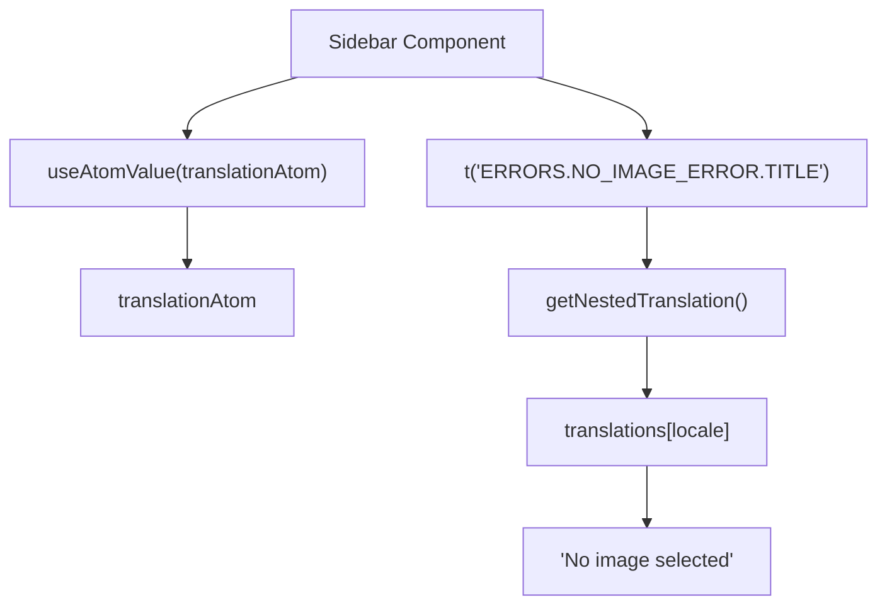
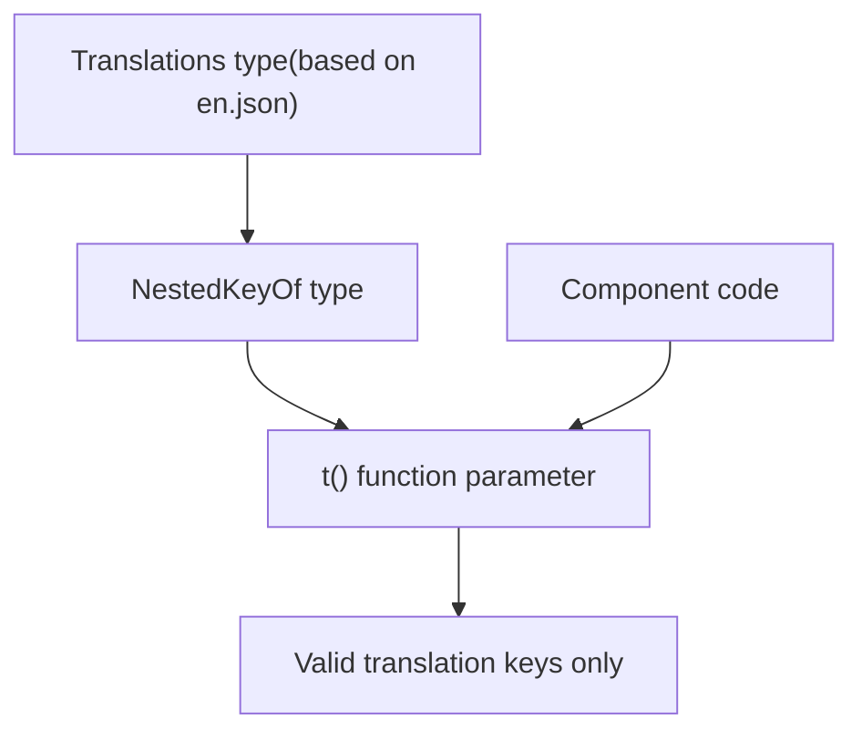
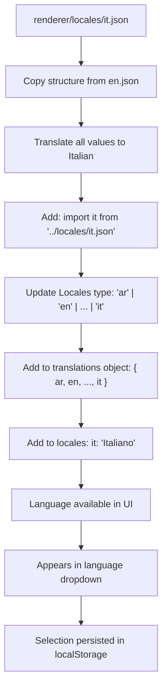

# 国际化 (Internationalization)

相关源文件

-   [renderer/atoms/translations-atom.ts](https://github.com/upscayl/upscayl/blob/1fdbd3e5/renderer/atoms/translations-atom.ts)
-   [renderer/components/sidebar/index.tsx](https://github.com/upscayl/upscayl/blob/1fdbd3e5/renderer/components/sidebar/index.tsx)
-   [renderer/components/sidebar/settings-tab/language-switcher.tsx](https://github.com/upscayl/upscayl/blob/1fdbd3e5/renderer/components/sidebar/settings-tab/language-switcher.tsx)
-   [renderer/locales/ar.json](https://github.com/upscayl/upscayl/blob/1fdbd3e5/renderer/locales/ar.json)
-   [renderer/locales/ca-val.json](https://github.com/upscayl/upscayl/blob/1fdbd3e5/renderer/locales/ca-val.json)
-   [renderer/locales/de.json](https://github.com/upscayl/upscayl/blob/1fdbd3e5/renderer/locales/de.json)
-   [renderer/locales/en.json](https://github.com/upscayl/upscayl/blob/1fdbd3e5/renderer/locales/en.json)
-   [renderer/locales/es.json](https://github.com/upscayl/upscayl/blob/1fdbd3e5/renderer/locales/es.json)
-   [renderer/locales/fr.json](https://github.com/upscayl/upscayl/blob/1fdbd3e5/renderer/locales/fr.json)
-   [renderer/locales/id.json](https://github.com/upscayl/upscayl/blob/1fdbd3e5/renderer/locales/id.json)
-   [renderer/locales/it.json](https://github.com/upscayl/upscayl/blob/1fdbd3e5/renderer/locales/it.json)
-   [renderer/locales/ja.json](https://github.com/upscayl/upscayl/blob/1fdbd3e5/renderer/locales/ja.json)
-   [renderer/locales/pt-br.json](https://github.com/upscayl/upscayl/blob/1fdbd3e5/renderer/locales/pt-br.json)
-   [renderer/locales/ru.json](https://github.com/upscayl/upscayl/blob/1fdbd3e5/renderer/locales/ru.json)
-   [renderer/locales/tr.json](https://github.com/upscayl/upscayl/blob/1fdbd3e5/renderer/locales/tr.json)
-   [renderer/locales/uk.json](https://github.com/upscayl/upscayl/blob/1fdbd3e5/renderer/locales/uk.json)
-   [renderer/locales/vi.json](https://github.com/upscayl/upscayl/blob/1fdbd3e5/renderer/locales/vi.json)
-   [renderer/locales/zh.json](https://github.com/upscayl/upscayl/blob/1fdbd3e5/renderer/locales/zh.json)

本页面记录了 Upscayl 中的 Internationalization (国际化) (i18n) 系统，该系统允许应用程序以多种语言呈现其用户界面。该系统提供了存储翻译、选择语言以及在整个应用程序中访问 Translated Strings (翻译字符串) 的机制。

## 概述

Upscayl 使用一个 JSON-based translation system (基于 JSON 的翻译系统)，并结合 Jotai Atoms (Jotai 原子) 进行 State Management (状态管理)。该国际化系统旨在 React 组件中实现 Type-safe (类型安全) 且易于使用。翻译以 Hierarchical structure (分层结构) 组织，允许按 Feature area (功能区域) 对字符串进行逻辑分组。

**国际化系统架构**


来源：

-   [renderer/atoms/translations-atom.ts](https://github.com/upscayl/upscayl/blob/1fdbd3e5/renderer/atoms/translations-atom.ts)
-   [renderer/components/sidebar/settings-tab/language-switcher.tsx](https://github.com/upscayl/upscayl/blob/1fdbd3e5/renderer/components/sidebar/settings-tab/language-switcher.tsx)

## 支持的语言

Upscayl 目前支持以下语言：

| 区域代码 | 语言名称 | 翻译文件 |
| --- | --- | --- |
| ar | العربية | ar.json |
| en | English | en.json |
| tr | Türkçe | tr.json |
| ru | Русский | ru.json |
| uk | Українська | uk.json |
| ja | 日本語 | ja.json |
| zh | 简体中文 | zh.json |
| es | Español | es.json |
| fr | Français | fr.json |
| de | Deutsch | de.json |
| vi | Tiếng Việt | vi.json |
| pt | Português (Portugal) | pt.json |
| ptBR | Português (Brasil) | pt-br.json |
| id | Bahasa Indonesia | id.json |
| caVAL | Català (Valencià) | ca-val.json |

这些语言在 `LanguageSwitcher` 的 `locales` 对象中定义，并在 `translations-atom.ts` 中定义为 `Locales` 类型。每种语言在 `renderer/locales/` 目录中都有一个相应的 JSON 文件。

来源：

-   [renderer/components/sidebar/settings-tab/language-switcher.tsx4-20](https://github.com/upscayl/upscayl/blob/1fdbd3e5/renderer/components/sidebar/settings-tab/language-switcher.tsx#L4-L20)
-   [renderer/atoms/translations-atom.ts21](https://github.com/upscayl/upscayl/blob/1fdbd3e5/renderer/atoms/translations-atom.ts#L21-L21)
-   [renderer/atoms/translations-atom.ts2-16](https://github.com/upscayl/upscayl/blob/1fdbd3e5/renderer/atoms/translations-atom.ts#L2-L16)

## 翻译状态管理

国际化系统围绕两个关键的 Jotai 原子构建：

1.  `localeAtom`：存储当前选定的 Locale Code (区域代码)（例如 "en"、"zh"）
2.  `translationAtom`：提供一个根据当前区域设置返回翻译字符串的函数

**翻译状态流**


`localeAtom` 使用 Jotai 的 `atomWithStorage` 将用户的语言偏好持久化在 localStorage 中，确保在不同会话之间记住选定的语言。`translationAtom` 是一个 Derived atom (派生原子)，它使用当前区域设置来提供翻译函数。

来源：

-   [renderer/atoms/translations-atom.ts69-87](https://github.com/upscayl/upscayl/blob/1fdbd3e5/renderer/atoms/translations-atom.ts#L69-L87)

### 翻译文件结构

每种语言都在 `renderer/locales/` 目录下的 JSON 文件中定义，具有键和翻译值的层次结构。该结构包括应用程序不同部分的主要部分：

```
{  "TITLE": "Upscayl",  "INTRO": "Introducing Upscayl Cloud!",  "HEADER": {    "GITHUB_BUTTON_TITLE": "Star us on GitHub 😁",    "DESCRIPTION": "AI Image Upscaler"  },  "SETTINGS": {    "TITLE": "Settings",    "LANGUAGE": {      "TITLE": "UPSCAYL LANGUAGE"    },    "THEME": {      "TITLE": "UPSCAYL THEME"    }  },  "APP": {    "TITLE": "Upscayl",    "PROGRESS": {      "WAIT_TITLE": "Hold on...",      "SUCCESS_TITLE": "Upscayl Successful!"    }  },  "ERRORS": {    "NO_IMAGE_ERROR": {      "TITLE": "No image selected",      "DESCRIPTION": "Please select an image to upscale"    }  }}
```
英语翻译文件 (`en.json`) 作为所有其他语言的参考模型。每个语言文件都遵循相同的结构，但每个键都有对应的翻译值。`translations-atom.ts` 中的 `translations` 对象导入所有语言文件，并通过 `Translations` 类型提供类型安全。

来源：

-   [renderer/locales/en.json1-313](https://github.com/upscayl/upscayl/blob/1fdbd3e5/renderer/locales/en.json#L1-L313)
-   [renderer/locales/zh.json1-313](https://github.com/upscayl/upscayl/blob/1fdbd3e5/renderer/locales/zh.json#L1-L313)
-   [renderer/locales/fr.json1-313](https://github.com/upscayl/upscayl/blob/1fdbd3e5/renderer/locales/fr.json#L1-L313)
-   [renderer/atoms/translations-atom.ts20-39](https://github.com/upscayl/upscayl/blob/1fdbd3e5/renderer/atoms/translations-atom.ts#L20-L39)

### 翻译解析

系统使用 Dot notation (点表示法) 来访问嵌套翻译。例如，`"SETTINGS.LANGUAGE.TITLE"` 将检索 `translations[locale].SETTINGS.LANGUAGE.TITLE` 处的翻译。

`getNestedTranslation` 函数处理此解析：


该函数通过点分割键，然后使用生成的各部分遍历翻译对象。如果找不到键，它将返回原始键作为 Fallback (回退)。

来源：

-   [renderer/atoms/translations-atom.ts51-66](https://github.com/upscayl/upscayl/blob/1fdbd3e5/renderer/atoms/translations-atom.ts#L51-L66)

## Language Switcher 组件

`LanguageSwitcher` (语言切换器) 组件提供了一个用于更改应用程序语言的用户界面：


该组件按显示名称对语言进行字母排序，并在用户选择新语言时更新 `localeAtom`。它还使用翻译函数以当前语言显示语言选择器的 Label (标签)。

来源：

-   [renderer/components/sidebar/settings-tab/language-switcher.tsx22-52](https://github.com/upscayl/upscayl/blob/1fdbd3e5/renderer/components/sidebar/settings-tab/language-switcher.tsx#L22-L52)

## 在组件中使用翻译

组件通过使用 `useAtomValue(translationAtom)` 来获取翻译函数，从而访问翻译。翻译函数根据当前区域设置返回翻译后的字符串：

```
// 组件中的使用示例const t = useAtomValue(translationAtom); // 基本翻译<p>{t("APP.PROGRESS.WAIT_TITLE")}</p>  // "Hold on..." // 带参数的翻译t("UPSCAYL_CLOUD.ALREADY_REGISTERED_ALERT", { name: userName })// 将 "Thank you {name}! It seems..." 中的 {name} 替换为 userName 的值
```
**组件翻译使用模式**


代码库中的实际示例 include `Sidebar` 组件中的错误消息和整个应用程序中的 Toast 通知。翻译函数通过将 `{paramName}` Placeholders (占位符) 替换为提供的参数对象中的值来支持 Parameter substitution (参数替换)。

来源：

-   [renderer/components/sidebar/index.tsx66](https://github.com/upscayl/upscayl/blob/1fdbd3e5/renderer/components/sidebar/index.tsx#L66-L66)
-   [renderer/components/sidebar/index.tsx188-192](https://github.com/upscayl/upscayl/blob/1fdbd3e5/renderer/components/sidebar/index.tsx#L188-L192)
-   [renderer/atoms/translations-atom.ts72-87](https://github.com/upscayl/upscayl/blob/1fdbd3e5/renderer/atoms/translations-atom.ts#L72-L87)
-   [renderer/atoms/translations-atom.ts82-85](https://github.com/upscayl/upscayl/blob/1fdbd3e5/renderer/atoms/translations-atom.ts#L82-L85)

## 类型安全

系统通过 TypeScript 确保翻译键的 Type-safe (类型安全)：

1.  翻译文件被导入并键入为 `Translations`
2.  `NestedKeyOf<Translations>` 类型创建所有可能的有效键路径
3.  翻译函数要求键必须匹配此类型


此类型系统通过提供 Compile-time checking (编译时检查)，防止使用无效翻译键导致的错误。`NestedKeyOf` 类型会 Recursive (递归) 地生成通过翻译对象的所有可能的点表示法路径。

来源：

-   [renderer/atoms/translations-atom.ts20-48](https://github.com/upscayl/upscayl/blob/1fdbd3e5/renderer/atoms/translations-atom.ts#L20-L48)
-   [renderer/atoms/translations-atom.ts42-48](https://github.com/upscayl/upscayl/blob/1fdbd3e5/renderer/atoms/translations-atom.ts#L42-L48)

## 翻译流程

当组件需要显示翻译后的文本时，会发生以下过程：

> **[Mermaid sequence]**
> *(图表结构无法解析)*

翻译函数还支持参数替换，将 `{name}` 之类的占位符替换为提供的参数对象中的值。

来源：

-   [renderer/atoms/translations-atom.ts72-87](https://github.com/upscayl/upscayl/blob/1fdbd3e5/renderer/atoms/translations-atom.ts#L72-L87)
-   [renderer/atoms/translations-atom.ts51-66](https://github.com/upscayl/upscayl/blob/1fdbd3e5/renderer/atoms/translations-atom.ts#L51-L66)
-   [renderer/atoms/translations-atom.ts82-85](https://github.com/upscayl/upscayl/blob/1fdbd3e5/renderer/atoms/translations-atom.ts#L82-L85)

## 添加新语言

要添加对新语言的支持（例如意大利语）：

1.  **创建翻译文件**：`renderer/locales/it.json`，遵循 `en.json` 的结构
2.  **更新 translations-atom.ts**：
    -   添加导入：`import it from "../locales/it.json";`
    -   添加到 `Locales` 类型：`"ar" | "en" | ... | "it"`
    -   添加到 `translations` 对象：`{ ar, en, ..., it }`
3.  **更新 language-switcher.tsx**：
    -   添加到 `locales` 对象：`it: "Italiano"`

**新语言集成步骤**


新语言将自动出现在 `LanguageSwitcher` 下拉菜单中，并在整个应用程序中得到正确的类型定义。

来源：

-   [renderer/atoms/translations-atom.ts2-16](https://github.com/upscayl/upscayl/blob/1fdbd3e5/renderer/atoms/translations-atom.ts#L2-L16)
-   [renderer/atoms/translations-atom.ts21](https://github.com/upscayl/upscayl/blob/1fdbd3e5/renderer/atoms/translations-atom.ts#L21-L21)
-   [renderer/atoms/translations-atom.ts23-39](https://github.com/upscayl/upscayl/blob/1fdbd3e5/renderer/atoms/translations-atom.ts#L23-L39)
-   [renderer/components/sidebar/settings-tab/language-switcher.tsx4-20](https://github.com/upscayl/upscayl/blob/1fdbd3e5/renderer/components/sidebar/settings-tab/language-switcher.tsx#L4-L20)

## Language Persistence (语言持久化)

系统使用来自 Jotai 的 `atomWithStorage` 将用户的语言偏好持久化在 localStorage 中，确保在不同会话之间记住选定的语言：

```
export const localeAtom = atomWithStorage<Locales>("language", "en");
```
这创建了一个原子，其初始值从 localStorage（使用键 "language"）读取，如果找不到值，则默认为 "en"。对该原子的任何更新都会自动持久化到 localStorage。

来源：

-   [renderer/atoms/translations-atom.ts69](https://github.com/upscayl/upscayl/blob/1fdbd3e5/renderer/atoms/translations-atom.ts#L69-L69)
-   [renderer/atoms/translations-atom.ts17](https://github.com/upscayl/upscayl/blob/1fdbd3e5/renderer/atoms/translations-atom.ts#L17-L17)

## 示例：语言切换流程

当用户更改应用程序语言时，会发生以下序列：

> **[Mermaid sequence]**
> *(图表结构无法解析)*

来源：

-   [renderer/components/sidebar/settings-tab/language-switcher.tsx36](https://github.com/upscayl/upscayl/blob/1fdbd3e5/renderer/components/sidebar/settings-tab/language-switcher.tsx#L36-L36)
-   [renderer/atoms/translations-atom.ts69](https://github.com/upscayl/upscayl/blob/1fdbd3e5/renderer/atoms/translations-atom.ts#L69-L69)

通过使用此国际化系统，Upscayl 在保持类型安全和性能的同时，跨多种语言提供了一致的用户体验。
