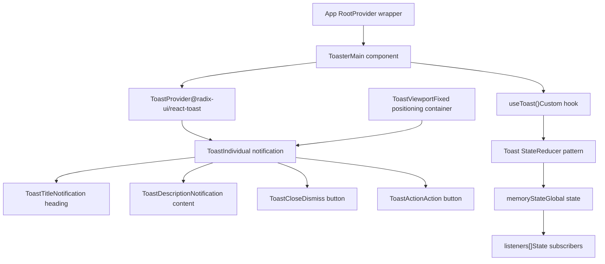
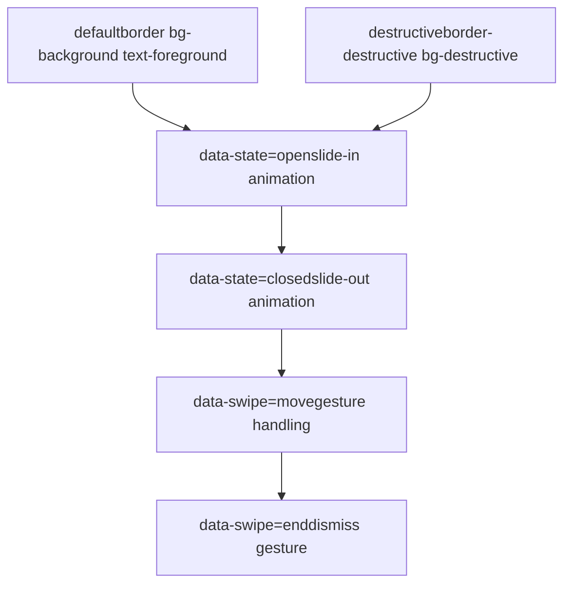
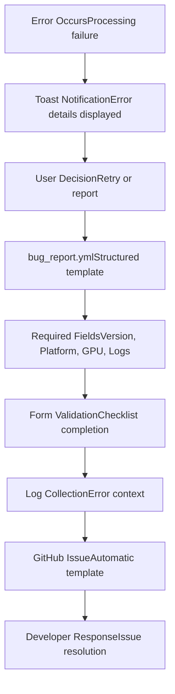
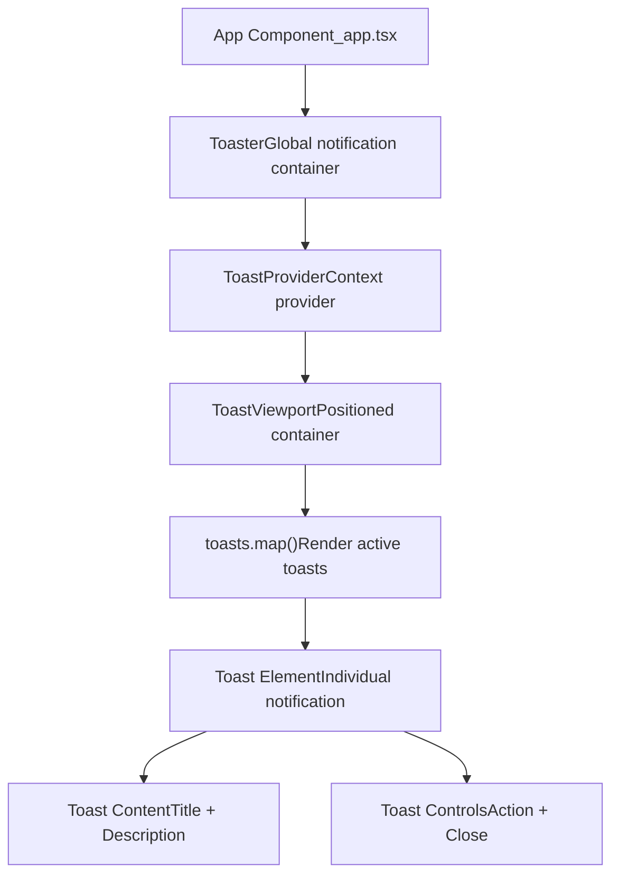

# 通知与反馈 (Notifications and Feedback)

相关源文件

-   [.github/ISSUE\_TEMPLATE/bug\_report.yml](https://github.com/upscayl/upscayl/blob/1fdbd3e5/.github/ISSUE_TEMPLATE/bug_report.yml)
-   [renderer/components/ui/toast.tsx](https://github.com/upscayl/upscayl/blob/1fdbd3e5/renderer/components/ui/toast.tsx)
-   [renderer/components/ui/toaster.tsx](https://github.com/upscayl/upscayl/blob/1fdbd3e5/renderer/components/ui/toaster.tsx)
-   [renderer/components/ui/use-toast.ts](https://github.com/upscayl/upscayl/blob/1fdbd3e5/renderer/components/ui/use-toast.ts)
-   [renderer/public/Upscayl New Page.png](https://github.com/upscayl/upscayl/blob/1fdbd3e5/renderer/public/Upscayl New Page.png)

本文档涵盖了 Upscayl 中的 User Feedback (用户反馈) 机制，包括 Toast Notification System (Toast 通知系统)、Progress Indicators (进度指示器) 和 Error Handling (错误处理)。这些系统在图像处理操作和通用应用程序交互期间为用户提供即时的视觉反馈。

有关这些 UI 组件的样式和主题信息，请参见 [样式与主题](/upscayl/upscayl/4.2-styling-and-theming)。有关显示这些反馈的主要 UI 组件的详细信息，请参见 [主要 UI 组件](/upscayl/upscayl/4.1-main-ui-components)。

## Toast 通知系统

Upscayl 使用 Radix UI Primitives (Radix UI 基元) 和自定义 State Management (状态管理) 实现了一个复杂的 Toast 通知系统。该系统旨在为用户提供关于应用程序状态、错误和操作结果的非侵入性反馈。

### 核心组件架构


来源： [renderer/components/ui/toast.tsx1-127](https://github.com/upscayl/upscayl/blob/1fdbd3e5/renderer/components/ui/toast.tsx#L1-L127) [renderer/components/ui/toaster.tsx1-33](https://github.com/upscayl/upscayl/blob/1fdbd3e5/renderer/components/ui/toaster.tsx#L1-L33) [renderer/components/ui/use-toast.ts1-192](https://github.com/upscayl/upscayl/blob/1fdbd3e5/renderer/components/ui/use-toast.ts#L1-L192)

### Toast 状态管理

Toast 系统使用基于自定义 Reducer 模式的状态管理方法，具有以下关键特性：

| 特性 | 实现 | 值 |
| --- | --- | --- |
| **Toast 限制** | `TOAST_LIMIT` | 一次仅显示 1 条通知 |
| **移除延迟** | `TOAST_REMOVE_DELAY` | 1,000,000 毫秒（持久性） |
| **状态模式** | 带操作的 Reducer | ADD, UPDATE, DISMISS, REMOVE |
| **ID 生成** | 增量计数器 | 线程安全计数 |

状态管理遵循以下流程：

来源： [renderer/components/ui/use-toast.ts75-128](https://github.com/upscayl/upscayl/blob/1fdbd3e5/renderer/components/ui/use-toast.ts#L75-L128) [renderer/components/ui/use-toast.ts9-10](https://github.com/upscayl/upscayl/blob/1fdbd3e5/renderer/components/ui/use-toast.ts#L9-L10)

### Toast 变体和样式

Toast 系统通过 `toastVariants` 配置支持多种视觉 Variants (变体)：


来源： [renderer/components/ui/toast.tsx25-39](https://github.com/upscayl/upscayl/blob/1fdbd3e5/renderer/components/ui/toast.tsx#L25-L39)

## 进度反馈集成

虽然具体的进度指示器实现由其他 UI 组件处理，但 Toast 系统为图像放大操作期间与进度相关的通知提供了基础。

### 进度更新流程

> **[Mermaid sequence]**
> *(图表结构无法解析)*

来源： [renderer/components/ui/use-toast.ts143-170](https://github.com/upscayl/upscayl/blob/1fdbd3e5/renderer/components/ui/use-toast.ts#L143-L170)

## 错误处理和用户反馈

该通知系统提供了标准化的错误报告机制，并与应用程序的错误处理模式集成。

### 错误反馈模式

| 错误类型 | Toast 配置 | 用户操作 |
| --- | --- | --- |
| **处理错误** | `variant: "destructive"` | 重试操作 |
| **File System Errors (文件系统错误)** | `variant: "destructive"` | 检查权限 |
| **GPU/Hardware Errors (GPU/硬件错误)** | `variant: "destructive"` | 检查硬件 |
| **Network Errors (网络错误)** | `variant: "default"` | 重试连接 |

### Bug 报告集成

该应用程序的反馈系统旨在与结构化错误报告模板协同工作：


来源： [.github/ISSUE\_TEMPLATE/bug\_report.yml1-78](https://github.com/upscayl/upscayl/blob/1fdbd3e5/.github/ISSUE_TEMPLATE/bug_report.yml#L1-L78)

## 实现细节

### Toast Hook 使用模式

`useToast` Hook 提供了一个 React 友好的接口来触发通知：

```
// 代码库中的基本使用模式const { toast } = useToast(); // 成功通知toast({  title: "处理完成",  description: "图像已成功放大"}); // 错误通知  toast({  variant: "destructive",  title: "处理失败",  description: "请检查日志以获取详细信息"});
```
### 组件集成

Toast 系统通过 `Toaster` 组件与应用程序集成：


来源： [renderer/components/ui/toaster.tsx11-32](https://github.com/upscayl/upscayl/blob/1fdbd3e5/renderer/components/ui/toaster.tsx#L11-L32)

### Configuration Constants (配置常量)

Toast 系统的行为由关键常量控制：

-   **TOAST\_LIMIT**：设置为 `1` 以防止通知堆积
-   **TOAST\_REMOVE\_DELAY**：设置为 `1000000`（1000 秒）用于持久性通知
-   **定位**：移动设备上视口固定在顶部，桌面设备上固定在右下角

来源： [renderer/components/ui/use-toast.ts9-10](https://github.com/upscayl/upscayl/blob/1fdbd3e5/renderer/components/ui/use-toast.ts#L9-L10) [renderer/components/ui/toast.tsx16-21](https://github.com/upscayl/upscayl/blob/1fdbd3e5/renderer/components/ui/toast.tsx#L16-L21)

该通知系统为整个 Upscayl 应用程序的用户反馈提供了坚实的基础，确保用户在所有应用程序状态和操作中都能收到适当的视觉反馈。
