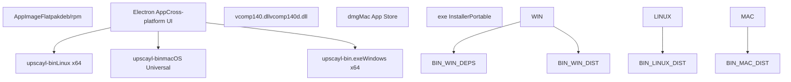
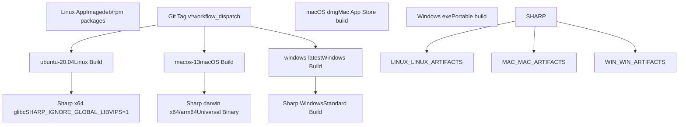
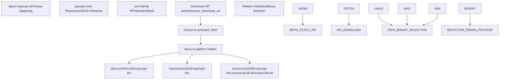

# 平台支持 (Platform Support)

相关源文件 (Source Files)

-   [.github/workflows/main.yml](https://github.com/upscayl/upscayl/blob/1fdbd3e5/.github/workflows/main.yml)
-   [download.jpg](https://github.com/upscayl/upscayl/blob/1fdbd3e5/download.jpg)
-   [resources/linux/bin/upscayl-bin](https://github.com/upscayl/upscayl/blob/1fdbd3e5/resources/linux/bin/upscayl-bin)
-   [resources/mac/bin/upscayl-bin](https://github.com/upscayl/upscayl/blob/1fdbd3e5/resources/mac/bin/upscayl-bin)
-   [resources/win/bin/upscayl-bin.exe](https://github.com/upscayl/upscayl/blob/1fdbd3e5/resources/win/bin/upscayl-bin.exe)
-   [resources/win/bin/vcomp140.dll](https://github.com/upscayl/upscayl/blob/1fdbd3e5/resources/win/bin/vcomp140.dll)
-   [resources/win/bin/vcomp140d.dll](https://github.com/upscayl/upscayl/blob/1fdbd3e5/resources/win/bin/vcomp140d.dll)
-   [screen1.png](https://github.com/upscayl/upscayl/blob/1fdbd3e5/screen1.png)
-   [update\_upscayl\_ncnn\_binaries.sh](https://github.com/upscayl/upscayl/blob/1fdbd3e5/update_upscayl_ncnn_binaries.sh)

本文档涵盖了 Upscayl 的 跨平台架构 (Cross-platform Architecture)、构建系统 (Build System) 以及 平台特定实现 (Platform-specific Implementations)。它详细介绍了应用程序如何通过自动化构建、平台特定 二进制分发 (Binary Distribution) 和多种 打包格式 (Packaging Formats) 来支持 Windows、macOS 和 Linux。

有关整体 应用架构 (Application Architecture) 的信息，请参阅 [应用架构](/upscayl/upscayl/2-application-architecture)。有关 构建与部署 (Build and Deployment) 流程的详细信息，请参阅 [构建与部署](/upscayl/upscayl/6-build-and-deployment)。

## 支持平台概览 (Supported Platforms Overview)

Upscayl 通过结合 Electron 的跨平台能力和平台特定的 AI 处理二进制文件 (AI Processing Binaries)，为三个主要的桌面平台提供 原生支持 (Native Support)。


**来源：** [.github/workflows/main.yml11-69](https://github.com/upscayl/upscayl/blob/1fdbd3e5/.github/workflows/main.yml#L11-L69) [resources/linux/bin/upscayl-bin](https://github.com/upscayl/upscayl/blob/1fdbd3e5/resources/linux/bin/upscayl-bin) [resources/mac/bin/upscayl-bin](https://github.com/upscayl/upscayl/blob/1fdbd3e5/resources/mac/bin/upscayl-bin) [resources/win/bin/upscayl-bin.exe](https://github.com/upscayl/upscayl/blob/1fdbd3e5/resources/win/bin/upscayl-bin.exe)

## 构建系统架构 (Build System Architecture)

平台支持是通过 GitHub Actions 工作流 (Workflow) 编排的，该工作流处理跨平台构建、依赖管理 (Dependency Management) 和分发打包。


**来源：** [.github/workflows/main.yml4-8](https://github.com/upscayl/upscayl/blob/1fdbd3e5/.github/workflows/main.yml#L4-L8) [.github/workflows/main.yml11-28](https://github.com/upscayl/upscayl/blob/1fdbd3e5/.github/workflows/main.yml#L11-L28) [.github/workflows/main.yml30-52](https://github.com/upscayl/upscayl/blob/1fdbd3e5/.github/workflows/main.yml#L30-L52) [.github/workflows/main.yml54-68](https://github.com/upscayl/upscayl/blob/1fdbd3e5/.github/workflows/main.yml#L54-L68)

### 平台特定构建配置 (Platform-Specific Build Configuration)

每个平台都需要特定的构建配置和依赖项：

| 平台 (Platform) | 运行器 (Runner) | Node 版本 (Node Version) | 特殊依赖 (Special Dependencies) | 构建命令 (Build Command) |
| --- | --- | --- | --- | --- |
| Linux | `ubuntu-20.04` | 18 | `elfutils`, `rpm`, `node-gyp` | `npm run publish-linux-app` |
| macOS | `macos-13` | 18 | 代码签名 (Code Signing) 证书、拨备配置文件 (Provisioning Profile) | `npm run publish-mac-universal-app` |
| Windows | `windows-latest` | 18 | 无 | `npm run publish-win-app` |

**来源：** [.github/workflows/main.yml12-13](https://github.com/upscayl/upscayl/blob/1fdbd3e5/.github/workflows/main.yml#L12-L13) [.github/workflows/main.yml31-32](https://github.com/upscayl/upscayl/blob/1fdbd3e5/.github/workflows/main.yml#L31-L32) [.github/workflows/main.yml55-56](https://github.com/upscayl/upscayl/blob/1fdbd3e5/.github/workflows/main.yml#L55-L56)

## 平台特定二进制管理 (Platform-Specific Binary Management)

核心 AI 处理功能依赖于平台特定的 `upscayl-ncnn` 二进制文件，这些文件通过 `upscayl-ncnn` 存储库分发并集成到主应用程序中。


**来源：** [update\_upscayl\_ncnn\_binaries.sh3-11](https://github.com/upscayl/upscayl/blob/1fdbd3e5/update_upscayl_ncnn_binaries.sh#L3-L11) [update\_upscayl\_ncnn\_binaries.sh20-35](https://github.com/upscayl/upscayl/blob/1fdbd3e5/update_upscayl_ncnn_binaries.sh#L20-L35)

### 二进制更新自动化 (Binary Update Automation)

`update_upscayl_ncnn_binaries.sh` 脚本自动化了获取和组织平台特定二进制文件的过程：

```
# Fetch latest release assetsassets_url=$(curl -s https://api.github.com/repos/upscayl/upscayl-ncnn/releases/latest | jq -r '.assets_url') # Download and extract platform-specific binariescurl -s $assets_url | jq -r '.[] | .browser_download_url' | while read -r download_url; do    filename=$(basename $download_url)    curl -LO $download_urldone
```
**来源：** [update\_upscayl\_ncnn\_binaries.sh4](https://github.com/upscayl/upscayl/blob/1fdbd3e5/update_upscayl_ncnn_binaries.sh#L4-L4) [update\_upscayl\_ncnn\_binaries.sh7-11](https://github.com/upscayl/upscayl/blob/1fdbd3e5/update_upscayl_ncnn_binaries.sh#L7-L11)

## Windows 特定依赖项 (Windows-Specific Dependencies)

Windows 构建需要额外的 Visual C++ 运行时 (Visual C++ Runtime) 库，以便 `upscayl-ncnn` 二进制文件正常运行：

| 文件 (File) | 用途 (Purpose) | 位置 (Location) |
| --- | --- | --- |
| `vcomp140.dll` | Visual C++ OpenMP 运行时 (发布版) | `resources/win/bin/` |
| `vcomp140d.dll` | Visual C++ OpenMP 运行时 (调试版) | `resources/win/bin/` |
| `upscayl-bin.exe` | 主要 AI 处理二进制文件 | `resources/win/bin/` |

这些依赖项在二进制更新过程中自动包含，并随 Windows 分发版一起打包。

**来源：** [update\_upscayl\_ncnn\_binaries.sh31-32](https://github.com/upscayl/upscayl/blob/1fdbd3e5/update_upscayl_ncnn_binaries.sh#L31-L32) [resources/win/bin/vcomp140.dll](https://github.com/upscayl/upscayl/blob/1fdbd3e5/resources/win/bin/vcomp140.dll) [resources/win/bin/vcomp140d.dll](https://github.com/upscayl/upscayl/blob/1fdbd3e5/resources/win/bin/vcomp140d.dll)

## 构建环境配置 (Build Environment Configuration)

### Linux 构建环境 (Linux Build Environment)

Linux 构建过程包括针对 Sharp (Sharp) 图像处理库和包生成的特定配置：

```
sudo apt-get install elfutils -ysudo apt install rpmnpm install -g node-gypSHARP_IGNORE_GLOBAL_LIBVIPS=1 npm install --arch=x64 --platform=linux --libc=glibc --build-from-source sharp
```
**来源：** [.github/workflows/main.yml22-27](https://github.com/upscayl/upscayl/blob/1fdbd3e5/.github/workflows/main.yml#L22-L27)

### macOS 构建环境 (macOS Build Environment)

macOS 构建需要使用特定的环境变量进行代码签名和 公证 (Notarization)：

-   `CSC_KEY_PASSWORD`: 代码签名证书密码
-   `CSC_LINK`: 代码签名证书
-   `APPLEID`: Apple Developer ID
-   `APPLEIDPASS`: 应用特定密码
-   `TEAMID`: Apple Developer Team ID
-   `PROVISION_PROFILE`: 用于 Mac App Store 的拨备配置文件

**来源：** [.github/workflows/main.yml32-39](https://github.com/upscayl/upscayl/blob/1fdbd3e5/.github/workflows/main.yml#L32-L39) [.github/workflows/main.yml49](https://github.com/upscayl/upscayl/blob/1fdbd3e5/.github/workflows/main.yml#L49-L49)

### Windows 构建环境 (Windows Build Environment)

Windows 构建使用标准的 Node.js 环境，无需额外的系统依赖，依赖于捆绑的 Visual C++ 运行时库。

**来源：** [.github/workflows/main.yml64-68](https://github.com/upscayl/upscayl/blob/1fdbd3e5/.github/workflows/main.yml#L64-L68)

## 分发集成 (Distribution Integration)

平台支持系统与各种 分发机制 (Distribution Integration) 集成，以便在不同的平台和 包管理器 (Package Manager) 上交付应用程序。每个平台都支持多种分发格式，以适应不同的用户偏好和系统要求。

**来源：** [.github/workflows/main.yml28](https://github.com/upscayl/upscayl/blob/1fdbd3e5/.github/workflows/main.yml#L28-L28) [.github/workflows/main.yml52](https://github.com/upscayl/upscayl/blob/1fdbd3e5/.github/workflows/main.yml#L52-L52) [.github/workflows/main.yml68](https://github.com/upscayl/upscayl/blob/1fdbd3e5/.github/workflows/main.yml#L68-L68)
