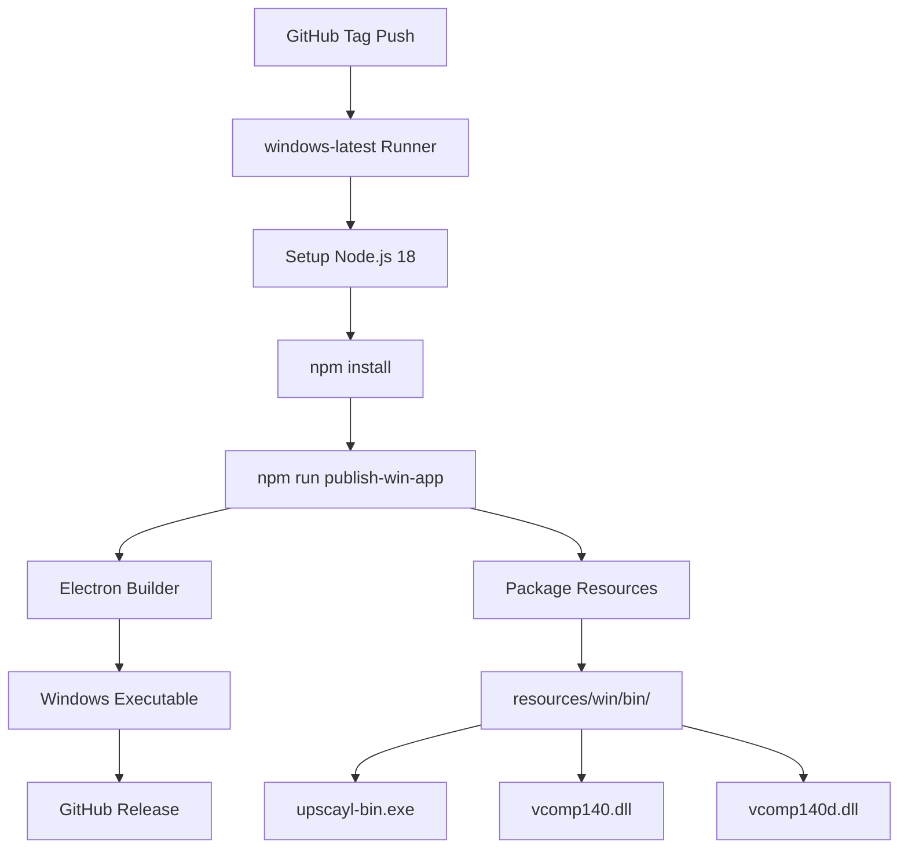
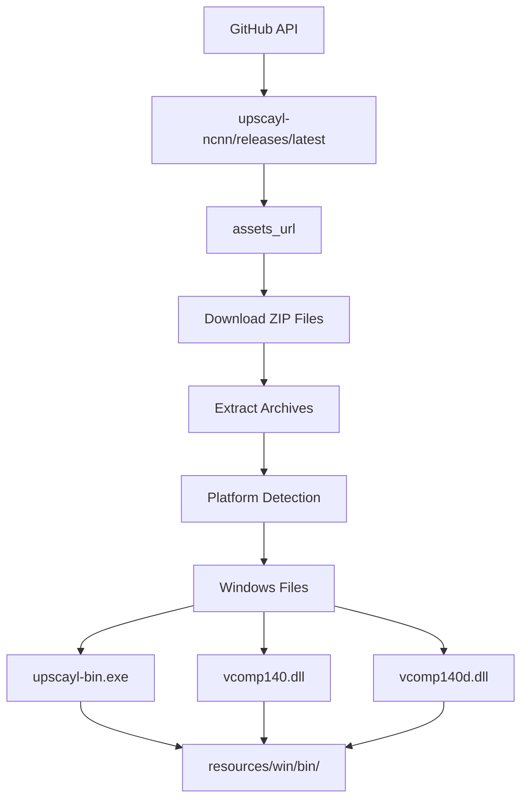
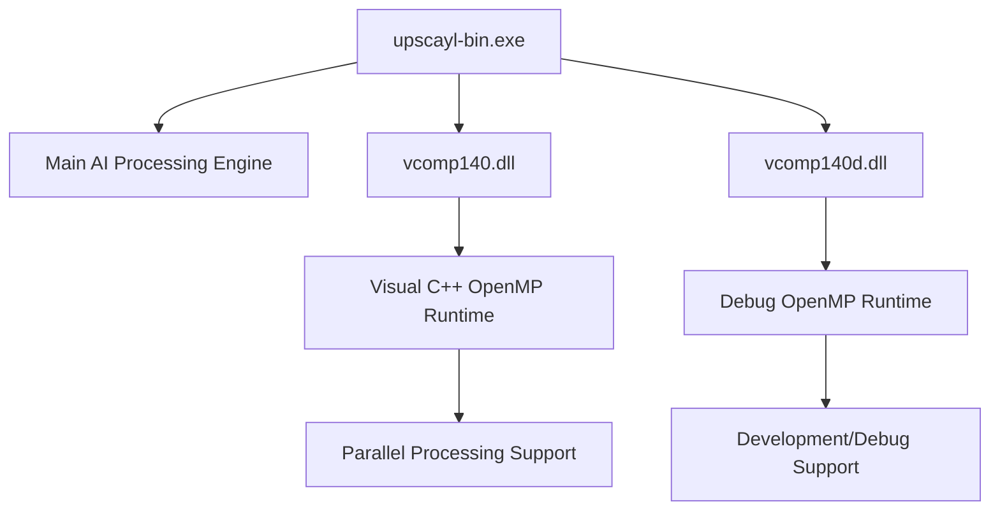

# Windows 支持 (Windows Support)

相关源文件 (Source Files)

-   [.github/workflows/main.yml](https://github.com/upscayl/upscayl/blob/1fdbd3e5/.github/workflows/main.yml)
-   [download.jpg](https://github.com/upscayl/upscayl/blob/1fdbd3e5/download.jpg)
-   [resources/linux/bin/upscayl-bin](https://github.com/upscayl/upscayl/blob/1fdbd3e5/resources/linux/bin/upscayl-bin)
-   [resources/mac/bin/upscayl-bin](https://github.com/upscayl/upscayl/blob/1fdbd3e5/resources/mac/bin/upscayl-bin)
-   [resources/win/bin/upscayl-bin.exe](https://github.com/upscayl/upscayl/blob/1fdbd3e5/resources/win/bin/upscayl-bin.exe)
-   [resources/win/bin/vcomp140.dll](https://github.com/upscayl/upscayl/blob/1fdbd3e5/resources/win/bin/vcomp140.dll)
-   [resources/win/bin/vcomp140d.dll](https://github.com/upscayl/upscayl/blob/1fdbd3e5/resources/win/bin/vcomp140d.dll)
-   [screen1.png](https://github.com/upscayl/upscayl/blob/1fdbd3e5/screen1.png)
-   [update\_upscayl\_ncnn\_binaries.sh](https://github.com/upscayl/upscayl/blob/1fdbd3e5/update_upscayl_ncnn_binaries.sh)

本文档涵盖了 Upscayl 的 Windows 特定实现细节 (Windows-specific implementation details)，包括构建过程、二进制分发以及平台特定依赖项。有关通用平台支持信息，请参阅 [平台支持](/upscayl/upscayl/5-platform-support)。有关所有平台的构建和部署流程，请参阅 [构建与部署](/upscayl/upscayl/6-build-and-deployment)。

## 概览 (Overview)

Upscayl 通过专用的 构建流水线 (Build pipeline) 提供原生 Windows 支持，该流水线生成 Windows 可执行文件 (Windows executable) 并管理平台特定依赖项。Windows 实现包括主要的 `upscayl-bin.exe` 可执行文件和所需的 Visual C++ 运行时库，以在 Windows 系统上实现最佳性能。

## Windows 构建流水线 (Windows Build Pipeline)

Windows 构建过程通过 GitHub Actions 自动化，并生成通过多个渠道分发的平台特定二进制文件。

### CI/CD 构建过程 (CI/CD Build Process)

**Windows 构建工作流**

当与 `v*` 匹配的标签被推送到存储库时，将触发 Windows 构建。该过程在 `windows-latest` GitHub 运行器上运行，并在发布期间使用 `GH_TOKEN` 环境变量进行身份验证。

来源： [.github/workflows/main.yml54-68](https://github.com/upscayl/upscayl/blob/1fdbd3e5/.github/workflows/main.yml#L54-L68)

### 构建配置 (Build Configuration)

Windows 构建过程使用 Electron Builder (Electron Builder) 将应用程序与 Windows 特定配置打包在一起：

| 组件 (Component) | 描述 (Description) | 位置 (Location) |
| --- | --- | --- |
| `upscayl-bin.exe` | 用于 AI 处理的主要 Windows 可执行文件 | `resources/win/bin/upscayl-bin.exe` |
| `vcomp140.dll` | Visual C++ OpenMP 运行时库 | `resources/win/bin/vcomp140.dll` |
| `vcomp140d.dll` | OpenMP 运行时的 调试版 (Debug) | `resources/win/bin/vcomp140d.dll` |

来源： [.github/workflows/main.yml54-68](https://github.com/upscayl/upscayl/blob/1fdbd3e5/.github/workflows/main.yml#L54-L68) [update\_upscayl\_ncnn\_binaries.sh29-33](https://github.com/upscayl/upscayl/blob/1fdbd3e5/update_upscayl_ncnn_binaries.sh#L29-L33)

## Windows 二进制管理 (Windows Binary Management)

Upscayl 使用一个先进的 二进制分发系统 (Binary distribution system)，该系统会自动从 `upscayl-ncnn` 存储库下载并管理平台特定可执行文件。

### 二进制更新过程 (Binary Update Process)

**二进制分发系统**

`update_upscayl_ncnn_binaries.sh` 脚本会自动获取最新的 Windows 二进制文件及其依赖项，确保 Windows 构建始终使用最新的 AI 处理引擎。

来源： [update\_upscayl\_ncnn\_binaries.sh1-43](https://github.com/upscayl/upscayl/blob/1fdbd3e5/update_upscayl_ncnn_binaries.sh#L1-L43)

### 平台特定依赖项 (Platform-Specific Dependencies)

Windows 构建需要其他平台不需要的其他运行时库：

**Windows 依赖结构**

Windows 实现包含 OpenMP 运行时库（`vcomp140.dll` 和 `vcomp140d.dll`），以支持 AI 放大引擎 (AI upscaling engine) 的 并行处理 (Parallel processing) 能力。这些库自动包含在 Windows 分发版中，但其他平台不需要。

来源： [update\_upscayl\_ncnn\_binaries.sh31-32](https://github.com/upscayl/upscayl/blob/1fdbd3e5/update_upscayl_ncnn_binaries.sh#L31-L32)

## 二进制架构 (Binary Architecture)

Windows 可执行文件是一个编译后的二进制文件，它与 Electron 主进程接口以提供 AI 图像放大功能。

### 文件结构 (File Structure)

| 文件 (File) | 大小 (Size) | 用途 (Purpose) |
| --- | --- | --- |
| `upscayl-bin.exe` | ~6.6MB | 主要处理可执行文件 |
| `vcomp140.dll` | ~195KB | OpenMP 运行时库 |
| `vcomp140d.dll` | ~220KB | 调试版 OpenMP 运行时 |

Windows 可执行文件使用 PE (Portable Executable) (PE) 格式，并包含用于 AI 处理操作的 嵌入式依赖项 (Embedded dependencies)。

来源： [resources/win/bin/upscayl-bin.exe1-3](https://github.com/upscayl/upscayl/blob/1fdbd3e5/resources/win/bin/upscayl-bin.exe#L1-L3) [resources/win/bin/vcomp140.dll1-3](https://github.com/upscayl/upscayl/blob/1fdbd3e5/resources/win/bin/vcomp140.dll#L1-L3) [resources/win/bin/vcomp140d.dll1-3](https://github.com/upscayl/upscayl/blob/1fdbd3e5/resources/win/bin/vcomp140d.dll#L1-L3)

## 与主应用程序集成 (Integration with Main Application)

Windows 二进制文件通过用于 Linux 和 macOS 构建的相同 跨平台接口 (Cross-platform interface) 集成到主 Electron 应用程序中，确保在所有支持的平台上具有一致的行为。

### 进程通信 (Process Communication)

> **[Mermaid sequence]**
> *(图表结构无法解析)*

**Windows 进程通信流**

Windows 可执行文件使用与其他平台相同的 IPC 机制 (IPC mechanisms) 与主 Electron 进程通信，确保从应用程序的角度进行 平台无关操作 (Platform-agnostic operation)。

来源： [.github/workflows/main.yml54-68](https://github.com/upscayl/upscayl/blob/1fdbd3e5/.github/workflows/main.yml#L54-L68) [update\_upscayl\_ncnn\_binaries.sh29-33](https://github.com/upscayl/upscayl/blob/1fdbd3e5/update_upscayl_ncnn_binaries.sh#L29-L33)
