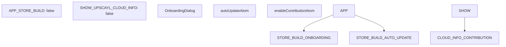
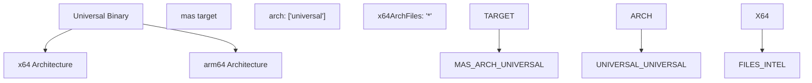

# macOS 支持 (macOS Support)

相关源文件 (Source Files)

-   [.prettierignore](https://github.com/upscayl/upscayl/blob/1fdbd3e5/.prettierignore)
-   [common/feature-flags.ts](https://github.com/upscayl/upscayl/blob/1fdbd3e5/common/feature-flags.ts)
-   [mas.json](https://github.com/upscayl/upscayl/blob/1fdbd3e5/mas.json)
-   [renderer/components/main-content/onboarding-dialog.tsx](https://github.com/upscayl/upscayl/blob/1fdbd3e5/renderer/components/main-content/onboarding-dialog.tsx)
-   [resources/entitlements.mac.plist](https://github.com/upscayl/upscayl/blob/1fdbd3e5/resources/entitlements.mac.plist)
-   [resources/entitlements.mas.inherit.plist](https://github.com/upscayl/upscayl/blob/1fdbd3e5/resources/entitlements.mas.inherit.plist)
-   [resources/entitlements.mas.plist](https://github.com/upscayl/upscayl/blob/1fdbd3e5/resources/entitlements.mas.plist)
-   [resources/icons/128x128.png](https://github.com/upscayl/upscayl/blob/1fdbd3e5/resources/icons/128x128.png)
-   [resources/icons/512x512.png](https://github.com/upscayl/upscayl/blob/1fdbd3e5/resources/icons/512x512.png)
-   [resources/models/high-fidelity-4x.bin](https://github.com/upscayl/upscayl/blob/1fdbd3e5/resources/models/high-fidelity-4x.bin)
-   [resources/models/high-fidelity-4x.param](https://github.com/upscayl/upscayl/blob/1fdbd3e5/resources/models/high-fidelity-4x.param)

本文档涵盖了 Upscayl 的 macOS 平台实现，包括构建配置、 权利 (Entitlements) (Entitlements)、代码签名和通过直接下载及 Mac App Store (MAS) (Mac App Store (MAS)) 进行分发。有关 Windows 特定功能，请参阅 [Windows 支持](/upscayl/upscayl/5.1-windows-support)。有关 Linux 分发方法，请参阅 [Linux 支持](/upscayl/upscayl/5.3-linux-support)。

## 构建配置 (Build Configuration)

Upscayl 支持两个不同的 macOS 构建目标 (Build targets)： 标准 macOS 分发 (Standard macOS distribution) 和 Mac App Store (MAS) 构建，每个目标都有不同的配置和要求。

### Mac App Store 配置 (Mac App Store Configuration)

主要的 MAS 配置定义在 `mas.json` 中，它指定了构建参数 (Build parameters)、Entitlements 和 App Store 分发 (App Store distribution) 的打包要求。

**来源：** [mas.json1-52](https://github.com/upscayl/upscayl/blob/1fdbd3e5/mas.json#L1-L52) [common/feature-flags.ts1-10](https://github.com/upscayl/upscayl/blob/1fdbd3e5/common/feature-flags.ts#L1-L10)

### 构建属性和要求 (Build Properties and Requirements)

| 属性 (Property) | MAS 值 | 标准 macOS 值 | 用途 (Purpose) |
| --- | --- | --- | --- |
| `hardenedRuntime` | `false` | `true` | 强化运行时 (Hardened runtime) 安全执行 |
| `gatekeeperAssess` | `false` | `false` | Gatekeeper 验证绕过 (Gatekeeper validation bypass) |
| `minimumSystemVersion` | 未设置 | `"12.0.0"` | 最低系统版本 (Minimum system version) 要求 |
| `type` | `"distribution"` | `"distribution"` | 签名的 证书类型 (Certificate type) |
| `category` | `"public.app-category.photography"` | `"public.app-category.photography"` | App Store 类别 |

**来源：** [mas.json20-50](https://github.com/upscayl/upscayl/blob/1fdbd3e5/mas.json#L20-L50)

## 权利系统 (Entitlements System)

macOS 构建需要特定的 Entitlements 才能访问系统资源并保持 沙盒合规性 (Sandboxing compliance)，特别是对于 Mac App Store 分发。

### Mac App Store 权利 (Mac App Store Entitlements)

```mermaid
flowchart TD
    NETWORK["com.apple.security.network.client"]
    TEAM_ID["com.apple.developer.team-identifier"]
    APP_IDENTIFIER["com.apple.application-identifier"]
    APP_GROUPS["com.apple.security.application-groups"]
    JIT["com.apple.security.cs.allow-jit"]
    UNSIGNED_MEM["com.apple.security.cs.allow-unsigned-executable-memory"]
    DISABLE_LIB["com.apple.security.cs.disable-library-validation"]
    DYLD_ENV["com.apple.security.cs.allow-dyld-environment-variables"]
    SANDBOX["com.apple.security.app-sandbox"]
    USER_FILES["com.apple.security.files.user-selected.read-write"]
    BOOKMARKS_DOC["com.apple.security.files.bookmarks.document-scope"]
    BOOKMARKS_APP["com.apple.security.files.bookmarks.app-scope"]
    INHERIT["com.apple.security.inherit"]

    TEAM --> ID_APP_IDENTIFIER
    APP --> GROUPS_TEAM_ID
    JIT --> UNSIGNED_MEM
    JIT --> DISABLE_LIB
    SANDBOX --> USER_FILES
    SANDBOX --> BOOKMARKS_DOC
    SANDBOX --> BOOKMARKS_APP
```

**来源：** [resources/entitlements.mas.plist1-34](https://github.com/upscayl/upscayl/blob/1fdbd3e5/resources/entitlements.mas.plist#L1-L34) [resources/entitlements.mas.inherit.plist1-11](https://github.com/upscayl/upscayl/blob/1fdbd3e5/resources/entitlements.mas.inherit.plist#L1-L11)

### 标准 macOS 权利 (Standard macOS Entitlements)

对于非 App Store 分发，Entitlements 集更加宽松，并包含额外的开发能力：

-   `com.apple.security.automation.apple-events` - AppleScript 自动化
-   `com.apple.security.cs.debugger` - 调试能力
-   `com.apple.security.network.server` - 网络服务器功能

**来源：** [resources/entitlements.mac.plist1-26](https://github.com/upscayl/upscayl/blob/1fdbd3e5/resources/entitlements.mac.plist#L1-L26)

## 代码签名和公证 (Code Signing and Notarization)

macOS 构建过程结合了自动代码签名和公证，以便在 App Store 之外进行分发。

> **[Mermaid sequence]**
> *(图表结构无法解析)*

**来源：** [mas.json4](https://github.com/upscayl/upscayl/blob/1fdbd3e5/mas.json#L4-L4)

## 特性标志和平台检测 (Feature Flags and Platform Detection)

macOS 特定的功能通过 特性标志 (Feature Flags) (Feature Flags) 进行控制，这些标志根据构建目标启用或禁用某些能力。

**来源：** [common/feature-flags.ts1-10](https://github.com/upscayl/upscayl/blob/1fdbd3e5/common/feature-flags.ts#L1-L10) [renderer/components/main-content/onboarding-dialog.tsx66-74](https://github.com/upscayl/upscayl/blob/1fdbd3e5/renderer/components/main-content/onboarding-dialog.tsx#L66-L74)

## 资源捆绑和分发 (Resource Bundling and Distribution)

macOS 构建包含平台特定的二进制文件和模型，这些文件在构建过程中作为额外文件捆绑在一起。

### 资源结构 (Resource Structure)

| 资源类型 (Resource Type) | 源路径 (Source Path) | 目标路径 (Target Path) | 用途 (Purpose) |
| --- | --- | --- | --- |
| 平台二进制文件 | `resources/${os}/bin` | `resources/bin` | upscayl-ncnn 可执行文件 |
| AI 模型 | `resources/models` | `resources/models` | Real-ESRGAN 模型文件 |
| Sharp 依赖项 | `node_modules/sharp/**/*` | Unpacked | 图像处理库 |
| IMG 依赖项 | `node_modules/@img/**/*` | Unpacked | 额外的图像实用程序 |

**来源：** [mas.json7-19](https://github.com/upscayl/upscayl/blob/1fdbd3e5/mas.json#L7-L19)

## App Store 合规性 (App Store Compliance)

Mac App Store 构建需要特定配置才能通过 App Store 审核并保持符合 Apple 的指南。

```mermaid
flowchart TD
    SANDBOX_ENABLE["App Sandbox Enabled"]
    FILE_ACCESS["User-Selected File Access Only"]
    NETWORK_CLIENT["Network Client Access"]
    NO_PRIVILEGED["No Privileged Operations"]
    ENTITLEMENTS["entitlements.mas.plist"]
    TEAM_CERT["Team Certificate"]
    PROVISION_PROFILE["Provisioning Profile"]
    APP_GROUPS["Application Groups"]

    SANDBOX --> ENABLE_FILE_ACCESS
    FILE --> ACCESS_ENTITLEMENTS
    NETWORK --> CLIENT_ENTITLEMENTS
    TEAM --> CERT_PROVISION_PROFILE
    PROVISION --> PROFILE_APP_GROUPS
    APP --> GROUPS_ENTITLEMENTS
```

**来源：** [resources/entitlements.mas.plist5-33](https://github.com/upscayl/upscayl/blob/1fdbd3e5/resources/entitlements.mas.plist#L5-L33)

## 通用二进制支持 (Universal Binary Support)

macOS 构建配置通过构建目标规范提供对 Intel (Intel) 和 Apple Silicon (Apple Silicon) Mac 的 通用二进制支持 (Universal binary support)。

**来源：** [mas.json30-35](https://github.com/upscayl/upscayl/blob/1fdbd3e5/mas.json#L30-L35) [mas.json43](https://github.com/upscayl/upscayl/blob/1fdbd3e5/mas.json#L43-L43)

## 平台特定 UI 考虑因素 (Platform-Specific UI Considerations)

虽然大多数 UI 组件与平台无关，但某些元素（如引导对话框）包含 平台感知特性 (Platform-aware features)，例如可能针对 App Store 构建禁用的 自动更新 (Auto-update) 设置。

**来源：** [renderer/components/main-content/onboarding-dialog.tsx66-68](https://github.com/upscayl/upscayl/blob/1fdbd3e5/renderer/components/main-content/onboarding-dialog.tsx#L66-L68)
