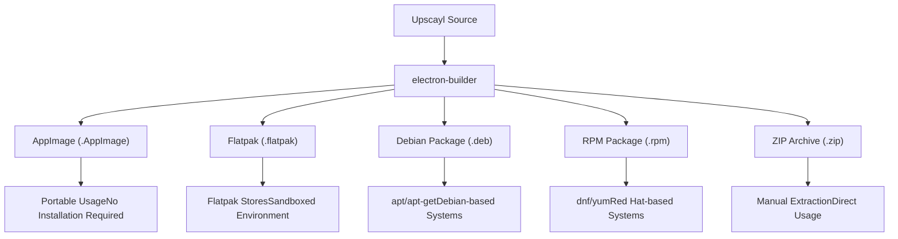
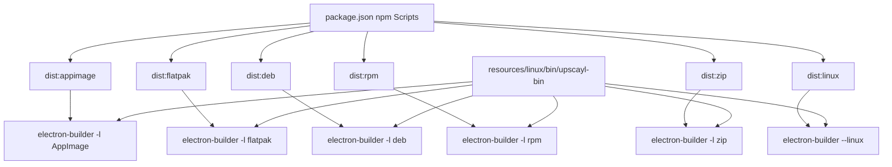
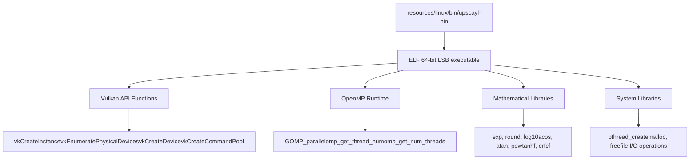
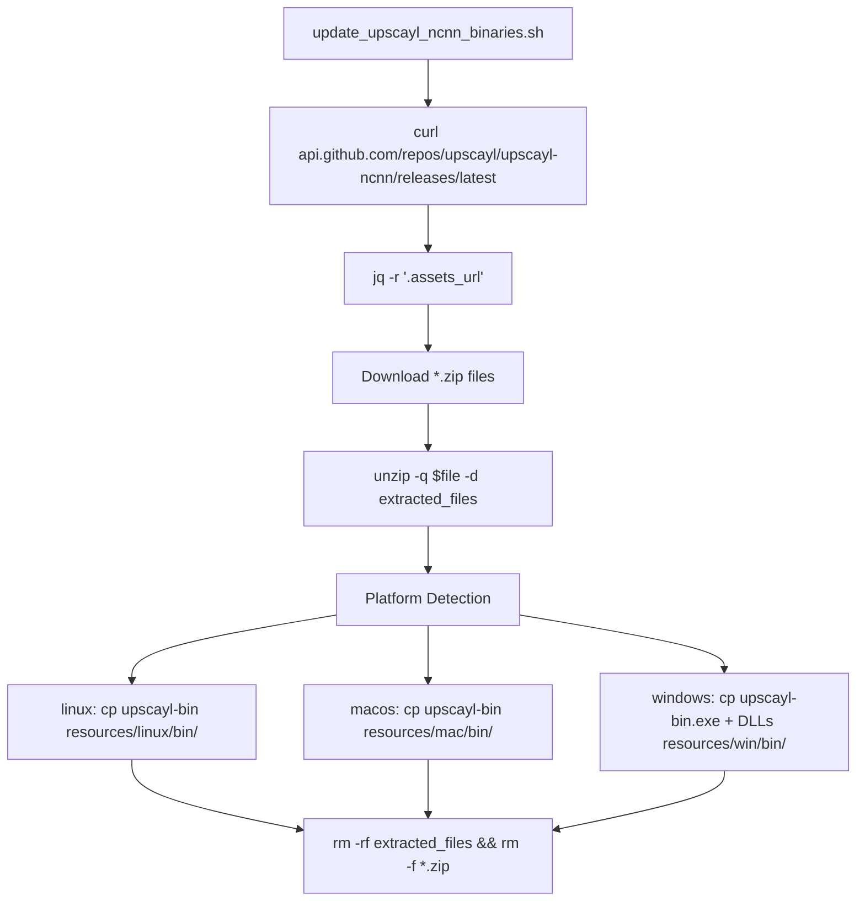

# Linux 支持 (Linux Support)

相关源文件 (Source Files)

-   [1080p\_banner.jpg](https://github.com/upscayl/upscayl/blob/1fdbd3e5/1080p_banner.jpg)
-   [1080p\_explainer.jpg](https://github.com/upscayl/upscayl/blob/1fdbd3e5/1080p_explainer.jpg)
-   [flatpak/org.upscayl.Upscayl.json](https://github.com/upscayl/upscayl/blob/1fdbd3e5/flatpak/org.upscayl.Upscayl.json)
-   [flatpak/org.upscayl.Upscayl.metainfo.xml](https://github.com/upscayl/upscayl/blob/1fdbd3e5/flatpak/org.upscayl.Upscayl.metainfo.xml)
-   [resources/linux/bin/upscayl-bin](https://github.com/upscayl/upscayl/blob/1fdbd3e5/resources/linux/bin/upscayl-bin)
-   [resources/mac/bin/upscayl-bin](https://github.com/upscayl/upscayl/blob/1fdbd3e5/resources/mac/bin/upscayl-bin)
-   [resources/win/bin/upscayl-bin.exe](https://github.com/upscayl/upscayl/blob/1fdbd3e5/resources/win/bin/upscayl-bin.exe)
-   [resources/win/bin/vcomp140.dll](https://github.com/upscayl/upscayl/blob/1fdbd3e5/resources/win/bin/vcomp140.dll)
-   [resources/win/bin/vcomp140d.dll](https://github.com/upscayl/upscayl/blob/1fdbd3e5/resources/win/bin/vcomp140d.dll)
-   [update\_upscayl\_ncnn\_binaries.sh](https://github.com/upscayl/upscayl/blob/1fdbd3e5/update_upscayl_ncnn_binaries.sh)

本文档解释了 Upscayl 的 Linux 特定实现和分发方法，详细说明了如何针对 Linux 平台构建、打包和分发应用程序。它涵盖了不同的 包格式 (Package formats)、 二进制集成 (Binary integration) 以及 Linux 环境特有的注意事项。

## 支持的包格式 (Supported Package Formats)

Upscayl 提供多种分发格式，以确保在整个 Linux 生态系统中的兼容性：


| 格式 (Format) | 用途 (Purpose) | 优点 (Benefits) | 安装方法 (Installation Method) |
| --- | --- | --- | --- |
| AppImage (AppImage) | 单文件便携式应用程序 | 无需安装，可在大多数发行版上运行 | 设置为可执行并直接运行 |
| Flatpak (Flatpak) | 沙盒应用程序包 | 一致的运行时，安全性更高 | 通过 Flatpak 命令或应用商店安装 |
| DEB | 原生 Debian 包 | 与 apt 包管理器集成 | `sudo apt install ./upscayl.deb` |
| RPM | 原生 Red Hat 包 | 与 dnf/yum 包管理器集成 | `sudo dnf install ./upscayl.rpm` |
| ZIP | 简单存档 | 手动安装，适用于自定义设置 | 手动解压并运行 |

来源： [package.json169-180](https://github.com/upscayl/upscayl/blob/1fdbd3e5/package.json#L169-L180) [package.json46-50](https://github.com/upscayl/upscayl/blob/1fdbd3e5/package.json#L46-L50)

## Linux 构建配置 (Linux Build Configuration)

Upscayl 使用 Electron Builder 根据 `package.json` 中的以下配置创建 Linux 包：

```
"linux": {  "target": [    "AppImage",    "zip",    "deb",    "rpm"  ],  "maintainer": "Nayam Amarshe <simplelogin-newsletter.j1zez@aleeas.com>",  "category": "Graphics;2DGraphics;RasterGraphics;ImageProcessing;",  "synopsis": "AI Image Upscaler",  "description": "Free and Open Source AI Image Upscaler",  "icon": "resources/icons/"}
```
Linux 的构建过程通过这些 npm 脚本触发：


来源： [package.json169-180](https://github.com/upscayl/upscayl/blob/1fdbd3e5/package.json#L169-L180) [package.json46-50](https://github.com/upscayl/upscayl/blob/1fdbd3e5/package.json#L46-L50)

## Linux 二进制管理 (Linux Binary Management)

Upscayl 依赖于平台特定二进制文件 (`upscayl-bin`) 来执行 AI 图像放大。此二进制文件是存储在 `resources/linux/bin/upscayl-bin` 的 ELF 64 位可执行文件 (ELF 64-bit executable)，并利用 Vulkan API (Vulkan API) 进行 GPU 加速 (GPU acceleration)。

### upscayl-ncnn 二进制架构 (upscayl-ncnn Binary Architecture)


### 二进制更新过程 (Binary Update Process)

`update_upscayl_ncnn_binaries.sh` 脚本负责获取和更新平台特定二进制文件：


该脚本执行以下关键操作：

1.  从 `api.github.com/repos/upscayl/upscayl-ncnn/releases/latest` 获取最新版本
2.  使用 `curl -LO $download_url` 下载平台特定 ZIP 包
3.  使用 `unzip -q` 将包解压到 `extracted_files/` 目录
4.  识别 Linux 二进制文件并将其复制到 `resources/linux/bin/upscayl-bin`
5.  使用 `rm -rf extracted_files && rm -f *.zip` 进行清理

来源： [update\_upscayl\_ncnn\_binaries.sh1-43](https://github.com/upscayl/upscayl/blob/1fdbd3e5/update_upscayl_ncnn_binaries.sh#L1-L43) [resources/linux/bin/upscayl-bin1-28](https://github.com/upscayl/upscayl/blob/1fdbd3e5/resources/linux/bin/upscayl-bin#L1-L28)

## 放大过程集成 (Upscaling process integration)

Electron 应用程序与 Linux 二进制文件之间的集成遵循以下过程：

> **[Mermaid sequence]**
> *(图表结构无法解析)*

当用户启动放大操作时：

1.  React UI 向 Electron 主进程发送请求
2.  主进程将 Linux 二进制文件作为 子进程 (Child process) 派生
3.  二进制文件通过 Vulkan 利用 GPU 处理图像
4.  结果传回主进程并显示在 UI 中

来源： [resources/linux/bin/upscayl-bin](https://github.com/upscayl/upscayl/blob/1fdbd3e5/resources/linux/bin/upscayl-bin)

## Linux 特定注意事项 (Linux-Specific Considerations)

### 二进制依赖项 (Binary dependencies)

对 `upscayl-bin` 二进制文件的分析显示它需要这些外部依赖项：

| 依赖项 (Dependency) | 描述 (Description) | 用途 (Purpose) |
| --- | --- | --- |
| libvulkan.so.1 | Vulkan 加载器库 (Vulkan loader library) | 用于图像处理的 GPU 加速 |
| libgomp.so.1 | GNU OpenMP 运行时 (OpenMP Runtime) | 并行处理支持 |
| libpthread.so.0 | POSIX 线程库 | 多线程支持 |

这些库必须在用户的系统上可用，Upscayl 才能正常运行。不同的 Linux 包格式处理依赖项的方式不同：

-   **AppImage**: 捆绑了一些依赖项，但必须在系统上安装 Vulkan
-   **Flatpak**: 在运行时中包含所有依赖项
-   **DEB/RPM**: 指定将由包管理器安装的依赖项

### 文件权限 (File permissions)

从 AppImage 或 ZIP 等某些包格式安装时，用户可能需要手动设置执行权限：

```
chmod +x resources/linux/bin/upscayl-bin
```
DEB、RPM 和 Flatpak 等包格式在安装期间自动处理权限。

### 系统集成 (System integration)

不同的包格式提供不同级别的 系统集成 (System integration)：

-   **DEB/RPM**: 自动创建 桌面入口 (Desktop entries) 和 文件关联 (File associations)
-   **AppImage**: 可以使用 AppImageLauncher 等工具进行集成
-   **Flatpak**: 通过 Flatpak 运行时和门户系统进行集成

来源： [resources/linux/bin/upscayl-bin](https://github.com/upscayl/upscayl/blob/1fdbd3e5/resources/linux/bin/upscayl-bin)

## 在 Linux 上从源码构建 (Building from Source for Linux)

要在 Linux 上从源码构建 Upscayl：

1.  克隆存储库
2.  安装依赖项：`npm install`
3.  更新二进制文件：`./update_upscayl_ncnn_binaries.sh`
4.  为您喜欢的格式进行构建：
    -   所有格式：`npm run dist:linux`
    -   仅 AppImage：`npm run dist:appimage`
    -   仅 Flatpak：`npm run dist:flatpak`
    -   仅 DEB：`npm run dist:deb`
    -   仅 RPM：`npm run dist:rpm`
    -   仅 ZIP：`npm run dist:zip`

构建好的包将放置在 `dist` 目录中。

来源： [package.json46-50](https://github.com/upscayl/upscayl/blob/1fdbd3e5/package.json#L46-L50) [package.json61](https://github.com/upscayl/upscayl/blob/1fdbd3e5/package.json#L61-L61) [update\_upscayl\_ncnn\_binaries.sh1-43](https://github.com/upscayl/upscayl/blob/1fdbd3e5/update_upscayl_ncnn_binaries.sh#L1-L43)
