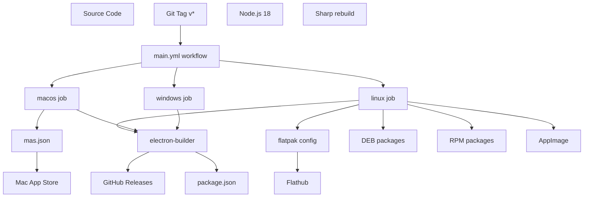
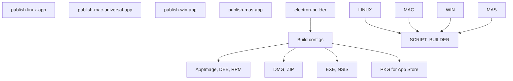
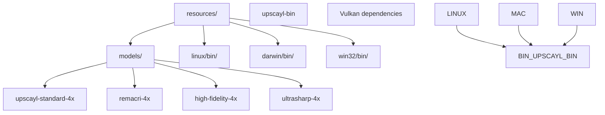
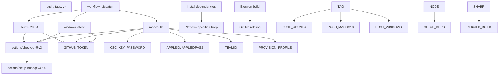
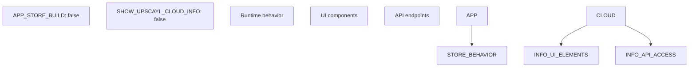

# 构建与部署 (Build and Deployment)

相关源文件 (Source files)

-   [.github/workflows/main.yml](https://github.com/upscayl/upscayl/blob/1fdbd3e5/.github/workflows/main.yml)
-   [common/feature-flags.ts](https://github.com/upscayl/upscayl/blob/1fdbd3e5/common/feature-flags.ts)
-   [download.jpg](https://github.com/upscayl/upscayl/blob/1fdbd3e5/download.jpg)
-   [mas.json](https://github.com/upscayl/upscayl/blob/1fdbd3e5/mas.json)
-   [renderer/components/main-content/onboarding-dialog.tsx](https://github.com/upscayl/upscayl/blob/1fdbd3e5/renderer/components/main-content/onboarding-dialog.tsx)
-   [resources/models/high-fidelity-4x.bin](https://github.com/upscayl/upscayl/blob/1fdbd3e5/resources/models/high-fidelity-4x.bin)
-   [resources/models/high-fidelity-4x.param](https://github.com/upscayl/upscayl/blob/1fdbd3e5/resources/models/high-fidelity-4x.param)
-   [screen1.png](https://github.com/upscayl/upscayl/blob/1fdbd3e5/screen1.png)

本文档涵盖了 Upscayl 的构建系统、打包配置、CI/CD 流水线 (Pipeline) 以及跨多个平台的部署过程。它详细介绍了如何编译、打包 Electron 应用程序 (Electron application)，并通过各种渠道 (Channels)（包括 GitHub Releases、Mac App Store、Flathub 和其他包管理器 (Package managers)）进行分发 (Distribution)。

有关平台特定 (Platform-specific) 功能和运行时 (Runtime) 注意事项的信息，请参阅 [平台支持 (Platform Support)](/upscayl/upscayl/5-platform-support)。有关开发设置 (Development setup) 和本地构建 (Local building) 的信息，请参阅 [设置开发环境 (Setup Development Environment)](/upscayl/upscayl/7.1-setup-development-environment)。

## 构建系统概述 (Build System Overview)

Upscayl 使用一个以 Electron Builder 为中心，并结合 GitHub Actions 进行自动化 (Automated) CI/CD 的跨平台 (Cross-platform) 构建系统。构建过程处理跨平台编译 (Compilation)、代码签名 (Code signing)，并同时分发到多个渠道。

### 构建架构 (Build Architecture)

来源：[.github/workflows/main.yml1-69](https://github.com/upscayl/upscayl/blob/1fdbd3e5/.github/workflows/main.yml#L1-L69) [mas.json1-52](https://github.com/upscayl/upscayl/blob/1fdbd3e5/mas.json#L1-L52)

### 关键构建组件 (Key Build Components)

| 组件 (Component) | 用途 | 配置 |
| --- | --- | --- |
| `electron-builder` | 主要打包工具 (Packaging tool) | `package.json` 脚本 |
| `mas.json` | Mac App Store 构建 | 代码签名、权利 (Entitlements) |
| `main.yml` | CI/CD 自动化 | 平台矩阵、秘密 (Secrets) |
| `Sharp` | 图像处理库 (Image processing library) | 平台特定重新构建 |
| 资源二进制文件 | AI 处理可执行文件 (Executables) | `resources/*/bin/` |

来源：[.github/workflows/main.yml20-28](https://github.com/upscayl/upscayl/blob/1fdbd3e5/.github/workflows/main.yml#L20-L28) [mas.json4-51](https://github.com/upscayl/upscayl/blob/1fdbd3e5/mas.json#L4-L51)

## 构建配置 (Build Configuration)

### Electron Builder 设置

构建系统使用 npm 脚本来协调不同的构建目标 (Targets)：

-   `publish-linux-app` - 具有多种格式的 Linux 构建
-   `publish-mac-universal-app` - 通用 (Universal) macOS 构建
-   `publish-win-app` - Windows 构建
-   `publish-mas-app` - Mac App Store 特定构建

来源：[.github/workflows/main.yml28](https://github.com/upscayl/upscayl/blob/1fdbd3e5/.github/workflows/main.yml#L28-L28) [.github/workflows/main.yml52](https://github.com/upscayl/upscayl/blob/1fdbd3e5/.github/workflows/main.yml#L52-L52) [.github/workflows/main.yml68](https://github.com/upscayl/upscayl/blob/1fdbd3e5/.github/workflows/main.yml#L68-L68)

### 资源管理 (Resource Management)

构建过程包括平台特定的资源：

来源：[mas.json8-19](https://github.com/upscayl/upscayl/blob/1fdbd3e5/mas.json#L8-L19) [resources/models/high-fidelity-4x.param1-10](https://github.com/upscayl/upscayl/blob/1fdbd3e5/resources/models/high-fidelity-4x.param#L1-L10)

## CI/CD 流水线

### GitHub Actions 工作流 (Workflow)

主要的部署工作流由版本标签触发，并处理跨平台的并行构建：

来源：[.github/workflows/main.yml4-8](https://github.com/upscayl/upscayl/blob/1fdbd3e5/.github/workflows/main.yml#L4-L8) [.github/workflows/main.yml32-39](https://github.com/upscayl/upscayl/blob/1fdbd3e5/.github/workflows/main.yml#L32-L39) [.github/workflows/main.yml11-69](https://github.com/upscayl/upscayl/blob/1fdbd3e5/.github/workflows/main.yml#L11-L69)

### 平台特定构建步骤

每个平台都需要特定处理：

**Linux 构建过程：**

-   安装系统依赖项 (Dependencies)（`elfutils`、`rpm`）
-   全局 `node-gyp` 安装
-   针对 `x64/linux/glibc` 的 Sharp 重新构建
-   多种输出格式（AppImage、DEB、RPM）

**macOS 构建过程：**

-   代码签名证书设置（`CSC_LINK`、`CSC_KEY_PASSWORD`）
-   预置描述文件 (Provisioning profile) 部署
-   创建通用二进制文件 (Binaries)（x64 + arm64）
-   使用 Apple ID 凭据进行公证 (Notarization)

**Windows 构建过程：**

-   标准的 npm 依赖项安装
-   Windows 特定的 electron-builder 配置
-   NSIS 安装程序生成

来源：[.github/workflows/main.yml20-28](https://github.com/upscayl/upscayl/blob/1fdbd3e5/.github/workflows/main.yml#L20-L28) [.github/workflows/main.yml45-52](https://github.com/upscayl/upscayl/blob/1fdbd3e5/.github/workflows/main.yml#L45-L52) [.github/workflows/main.yml63-68](https://github.com/upscayl/upscayl/blob/1fdbd3e5/.github/workflows/main.yml#L63-L68)

## 平台特定构建

### macOS 配置

Mac App Store 构建在 `mas.json` 中使用专门配置：

```mermaid
flowchart TD
    MAS_BUILD["mas (App Store)"]
    MAC_BUILD["mac (Direct)"]
    CERT["CSC_LINK certificate"]
    PASSWORD["CSC_KEY_PASSWORD"]
    PROVISION_PROF["embedded.provisionprofile"]
    MAS_ENTITLE["entitlements.mas.plist"]
    MAS_INHERIT["entitlements.mas.inherit.plist"]
    MAC_ENTITLE["entitlements.mac.plist"]
    APP_ID["org.upscayl.Upscayl"]
    CATEGORY["public.app-category.photography"]
    MIN_VERSION["macOS 12.0.0"]
    UNIVERSAL["Universal (x64 + arm64)"]

    MAS --> BUILD_CERT
    MAC --> BUILD_CERT
    CERT --> PASSWORD
    MAS --> BUILD_PROVISION_PROF
    MAS --> BUILD_MAS_ENTITLE
    MAS --> BUILD_MAS_INHERIT
    MAC --> BUILD_MAC_ENTITLE
    MAS --> BUILD_APP_ID
    MAC --> BUILD_APP_ID
    APP --> ID_CATEGORY
    APP --> ID_MIN_VERSION
    APP --> ID_UNIVERSAL
```

来源：[mas.json20-50](https://github.com/upscayl/upscayl/blob/1fdbd3e5/mas.json#L20-L50) [.github/workflows/main.yml49-50](https://github.com/upscayl/upscayl/blob/1fdbd3e5/.github/workflows/main.yml#L49-L50)

### Linux 分发

Linux 构建支持多种分发格式和包管理器：

| 格式 | 使用场景 | 生成者 |
| --- | --- | --- |
| AppImage | Linux 通用二进制文件 | electron-builder |
| DEB | Debian/Ubuntu 软件包 | electron-builder |
| RPM | RedHat/Fedora 软件包 | electron-builder |
| Flatpak | 沙盒 (Sandboxed) 分发 | 单独的工作流 |

构建过程安装分发特定的工具，如 `rpm` 软件包管理器支持。

来源：[.github/workflows/main.yml22-23](https://github.com/upscayl/upscayl/blob/1fdbd3e5/.github/workflows/main.yml#L22-L23)

### 构建中的功能标志 (Feature Flags)

构建时功能标志控制某些功能：

来源：[common/feature-flags.ts1-9](https://github.com/upscayl/upscayl/blob/1fdbd3e5/common/feature-flags.ts#L1-L9)

## 分发渠道

### 自动化发布

构建成功后，构建系统会自动发布到多个渠道：

```mermaid
flowchart TD
    LINUX_BUILD["Linux build"]
    MAC_BUILD["macOS build"]
    WIN_BUILD["Windows build"]
    GITHUB_RELEASES["GitHub Releases"]
    MAC_STORE["Mac App Store"]
    FLATHUB_STORE["Flathub"]
    HOMEBREW["Homebrew"]
    AUR["Arch AUR"]
    CHOCOLATEY["Chocolatey"]

    LINUX --> BUILD_GITHUB_RELEASES
    MAC --> BUILD_GITHUB_RELEASES
    WIN --> BUILD_GITHUB_RELEASES
    MAC --> BUILD_MAC_STORE
    LINUX --> BUILD_FLATHUB_STORE
    GITHUB --> RELEASES_HOMEBREW
    GITHUB --> RELEASES_AUR
    GITHUB --> RELEASES_CHOCOLATEY
```

来源：[.github/workflows/main.yml28](https://github.com/upscayl/upscayl/blob/1fdbd3e5/.github/workflows/main.yml#L28-L28) [.github/workflows/main.yml38](https://github.com/upscayl/upscayl/blob/1fdbd3e5/.github/workflows/main.yml#L38-L38) [.github/workflows/main.yml65](https://github.com/upscayl/upscayl/blob/1fdbd3e5/.github/workflows/main.yml#L65-L65)

### 发布产物管理 (Release Asset Management)

每个平台构建生成特定的产物 (Asset)：

-   **Linux**：`.AppImage`、`.deb`、`.rpm` 文件
-   **macOS**：用于直接分发的 `.dmg`、`.zip`；用于 App Store 的 `.pkg`
-   **Windows**：`.exe` 安装程序、便携 (Portable) 式构建

GitHub 令牌 (Token) (`GH_TOKEN`) 允许自动创建发布并将产物上传到存储库的发布页面。

来源：[.github/workflows/main.yml28](https://github.com/upscayl/upscayl/blob/1fdbd3e5/.github/workflows/main.yml#L28-L28) [.github/workflows/main.yml38](https://github.com/upscayl/upscayl/blob/1fdbd3e5/.github/workflows/main.yml#L38-L38) [.github/workflows/main.yml65](https://github.com/upscayl/upscayl/blob/1fdbd3e5/.github/workflows/main.yml#L65-L65)
