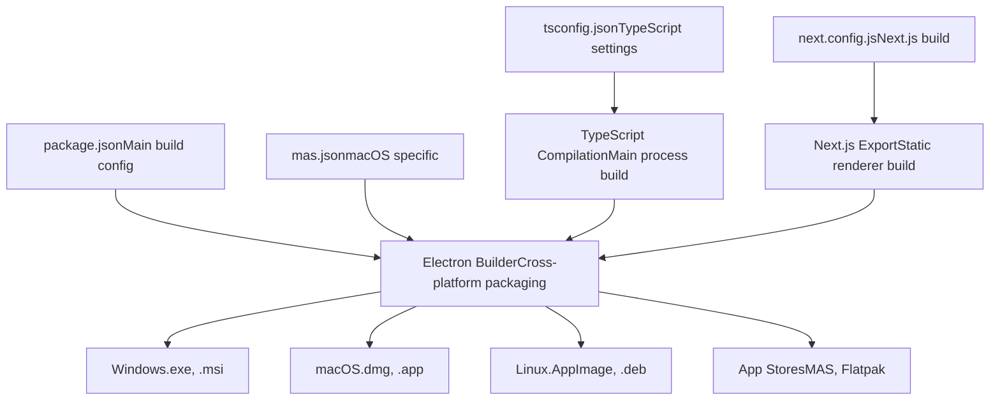
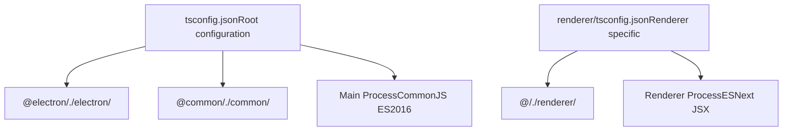
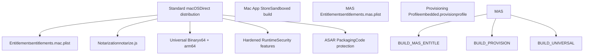
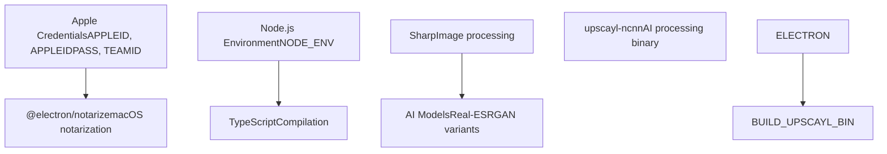
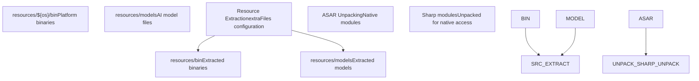
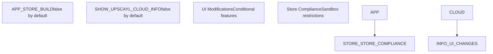
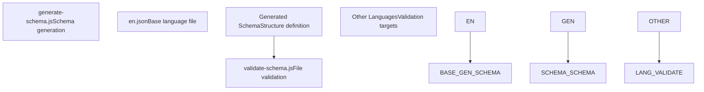

# 构建配置 (Build Configuration)

相关源文件 (Source files)

-   [.gitignore](https://github.com/upscayl/upscayl/blob/1fdbd3e5/.gitignore)
-   [common/feature-flags.ts](https://github.com/upscayl/upscayl/blob/1fdbd3e5/common/feature-flags.ts)
-   [mas.json](https://github.com/upscayl/upscayl/blob/1fdbd3e5/mas.json)
-   [next.config.js](https://github.com/upscayl/upscayl/blob/1fdbd3e5/next.config.js)
-   [notarize.js](https://github.com/upscayl/upscayl/blob/1fdbd3e5/notarize.js)
-   [renderer/components/main-content/onboarding-dialog.tsx](https://github.com/upscayl/upscayl/blob/1fdbd3e5/renderer/components/main-content/onboarding-dialog.tsx)
-   [renderer/components/sidebar/upscayl-tab/upscayl-steps.tsx](https://github.com/upscayl/upscayl/blob/1fdbd3e5/renderer/components/sidebar/upscayl-tab/upscayl-steps.tsx)
-   [renderer/tsconfig.json](https://github.com/upscayl/upscayl/blob/1fdbd3e5/renderer/tsconfig.json)
-   [resources/models/high-fidelity-4x.bin](https://github.com/upscayl/upscayl/blob/1fdbd3e5/resources/models/high-fidelity-4x.bin)
-   [resources/models/high-fidelity-4x.param](https://github.com/upscayl/upscayl/blob/1fdbd3e5/resources/models/high-fidelity-4x.param)
-   [scripts/generate-schema.js](https://github.com/upscayl/upscayl/blob/1fdbd3e5/scripts/generate-schema.js)
-   [scripts/validate-schema.js](https://github.com/upscayl/upscayl/blob/1fdbd3e5/scripts/validate-schema.js)
-   [tsconfig.json](https://github.com/upscayl/upscayl/blob/1fdbd3e5/tsconfig.json)

本文档详细介绍了 Upscayl 的构建配置、环境设置 (Environment setup)、依赖项 (Dependencies) 以及平台特定的构建要求。它涵盖了核心构建系统架构、配置文件以及为 Windows、macOS 和 Linux 平台创建可分发包 (Distributable packages) 的过程。

有关 CI/CD 流水线 (Pipeline) 和自动化构建的信息，请参阅 [CI/CD 流水线](/upscayl/upscayl/6.2-cicd-pipeline)。有关发布和分发过程的详细信息，请参阅 [发布过程](/upscayl/upscayl/6.3-release-process)。

## 构建系统架构 (Build System Architecture)

Upscayl 使用一个结合了 Electron Builder、Next.js 和 TypeScript 编译 (Compilation) 的多层构建系统。构建过程处理主进程 (Main process) 和基于 Next.js 的渲染器进程 (Renderer process)，以及平台特定的原生依赖 (Native dependencies) 和 AI 模型资源 (AI model resources)。

### 核心构建配置流程 (Core Build Configuration Flow)

来源：[package.json](https://github.com/upscayl/upscayl/blob/1fdbd3e5/package.json) [tsconfig.json1-26](https://github.com/upscayl/upscayl/blob/1fdbd3e5/tsconfig.json#L1-L26) [next.config.js1-18](https://github.com/upscayl/upscayl/blob/1fdbd3e5/next.config.js#L1-L18) [mas.json1-51](https://github.com/upscayl/upscayl/blob/1fdbd3e5/mas.json#L1-L51)

### TypeScript 配置

构建系统为应用程序的不同部分使用多个 TypeScript 配置：

根 TypeScript 配置针对主进程使用 CommonJS 模块和 ES2016，而渲染器进程则使用 ESNext 并为 Next.js 处理保留 JSX。

来源：[tsconfig.json2-16](https://github.com/upscayl/upscayl/blob/1fdbd3e5/tsconfig.json#L2-L16) [renderer/tsconfig.json17-22](https://github.com/upscayl/upscayl/blob/1fdbd3e5/renderer/tsconfig.json#L17-L22)

## 平台特定构建配置

### macOS 配置

macOS 构建过程包括标准分发和 Mac App Store 变体，每种变体都有特定的权利 (Entitlements) 和签名要求。

`mas.json` 中的 macOS 配置定义了关键的构建参数，包括最低系统版本、架构支持和安全设置：

-   **通用架构 (Universal Architecture)**：使用 `universal` 目标 (Target) 同时针对 x64 和 ARM64 架构。
-   **硬化运行时 (Hardened Runtime)**：标准构建已启用，但 MAS 构建已禁用。
-   **ASAR 打包 (ASAR Packaging)**：从 ASAR 打包中排除 Sharp 和 @img 模块，以确保原生模块兼容性。
-   **资源提取**：将平台特定的二进制文件 (Binaries) 和 AI 模型复制到应用程序包中。

来源：[mas.json20-35](https://github.com/upscayl/upscayl/blob/1fdbd3e5/mas.json#L20-L35) [mas.json37-49](https://github.com/upscayl/upscayl/blob/1fdbd3e5/mas.json#L37-L49) [mas.json7-18](https://github.com/upscayl/upscayl/blob/1fdbd3e5/mas.json#L7-L18)

### Windows 和 Linux 配置

虽然提供的文件未显示 Windows 和 Linux 特定的配置，但构建系统通过 Electron Builder 的默认配置和跨平台二进制文件管理系统支持这些平台。

来源：[mas.json29-34](https://github.com/upscayl/upscayl/blob/1fdbd3e5/mas.json#L29-L34)

## 环境设置和依赖项

### 构建环境要求

构建过程需要针对不同平台和分发渠道进行特定的环境配置。

macOS 的公证 (Notarization) 过程需要存储在环境变量中的 Apple 开发者凭据：

来源：[notarize.js1-19](https://github.com/upscayl/upscayl/blob/1fdbd3e5/notarize.js#L1-L19)

### Next.js 构建配置

渲染器进程使用 Next.js，并为 Electron 集成进行了特定的导出 (Export) 设置：

-   **静态导出 (Static Export)**：配置为 `output: "export"` 以进行基于文件的服务。
-   **未经优化的图像 (Unoptimized Images)**：为确保 Electron 兼容性，禁用 Next.js 图像优化。
-   **外部目录**：允许从父目录导入。
-   **控制台移除**：在生产构建中清除控制台日志。

来源：[next.config.js5-15](https://github.com/upscayl/upscayl/blob/1fdbd3e5/next.config.js#L5-L15)

## 资产和资源管理 (Asset and Resource Management)

### 二进制文件和模型分发

构建系统通过结构化的资源提取过程管理平台特定的二进制文件和 AI 模型。

构建配置处理几个关键的资源管理任务：

-   **平台特定二进制文件**：`upscayl-ncnn` 可执行文件 (Executables) 从 `resources/${os}/bin` 复制，以保持平台兼容性。
-   **AI 模型文件**：如 `high-fidelity-4x.param` 和 `high-fidelity-4x.bin` 等模型文件被提取到应用程序包中。
-   **原生模块处理**：Sharp 和 @img 模块被排除在 ASAR 打包之外，以保留原生功能。

来源：[mas.json8-18](https://github.com/upscayl/upscayl/blob/1fdbd3e5/mas.json#L8-L18) [mas.json7](https://github.com/upscayl/upscayl/blob/1fdbd3e5/mas.json#L7-L7) [resources/models/high-fidelity-4x.param1-10](https://github.com/upscayl/upscayl/blob/1fdbd3e5/resources/models/high-fidelity-4x.param#L1-L10)

## 功能标志和构建变体

构建系统通过编译时功能标志 (Feature flags) 支持不同的应用程序变体：

这些标志控制应用程序在不同分发渠道中的行为和功能可用性，特别是针对商店合规性 (Store Compliance) 的要求。

来源：[common/feature-flags.ts1-9](https://github.com/upscayl/upscayl/blob/1fdbd3e5/common/feature-flags.ts#L1-L9)

## 构建验证和质量保证

### 架构验证系统 (Schema Validation System)

构建过程包括验证脚本，以确保国际化 (Internationalization) 文件的一致性：

验证系统确保所有本地化文件 (Localization files) 与基础英语语言环境保持一致的结构，防止由于缺少翻译键而导致的运行时错误。

来源：[scripts/generate-schema.js1-36](https://github.com/upscayl/upscayl/blob/1fdbd3e5/scripts/generate-schema.js#L1-L36) [scripts/validate-schema.js8-36](https://github.com/upscayl/upscayl/blob/1fdbd3e5/scripts/validate-schema.js#L8-L36)

### 构建产物管理 (Build Artifact Management)

`.gitignore` 配置将构建产物 (Artifacts) 和敏感文件排除在版本控制之外：

-   **编译后的输出**：`/main/*.js`、`/dist/`、`/export/` 目录。
-   **Next.js 构建**：`/renderer/.next/`、`/renderer/out/` 目录。
-   **平台包**：`.flatpak/`、`build-dir/` 目录。
-   **敏感文件**：`*.provisionprofile`、`*.p12` 证书。

来源：[.gitignore8-9](https://github.com/upscayl/upscayl/blob/1fdbd3e5/.gitignore#L8-L9) [.gitignore15-21](https://github.com/upscayl/upscayl/blob/1fdbd3e5/.gitignore#L15-L21) [.gitignore41-56](https://github.com/upscayl/upscayl/blob/1fdbd3e5/.gitignore#L41-L56)
