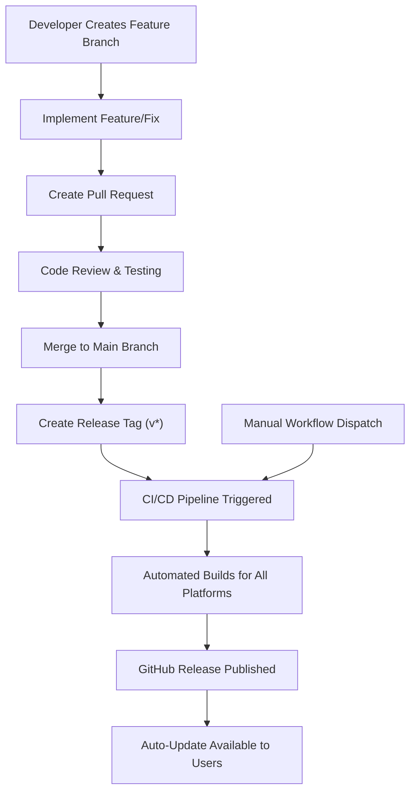
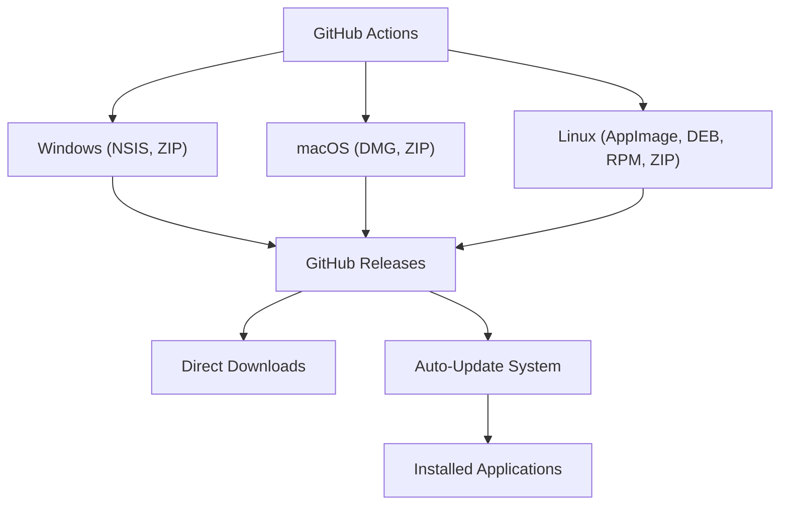
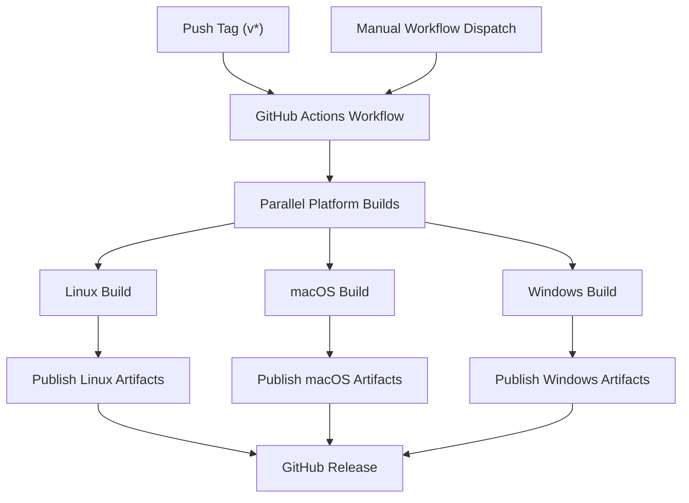
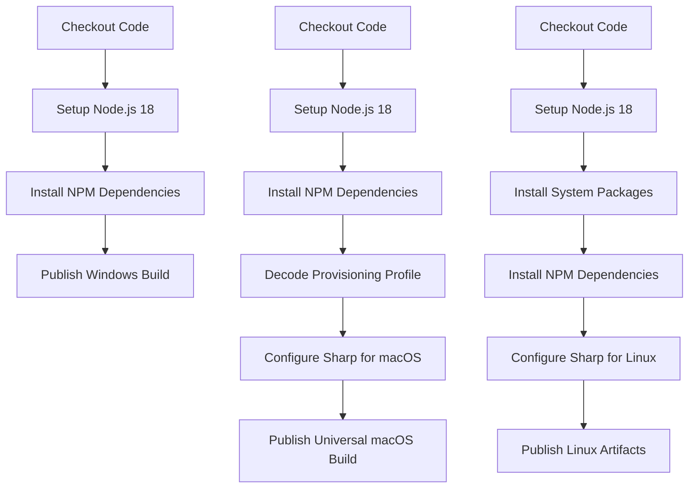
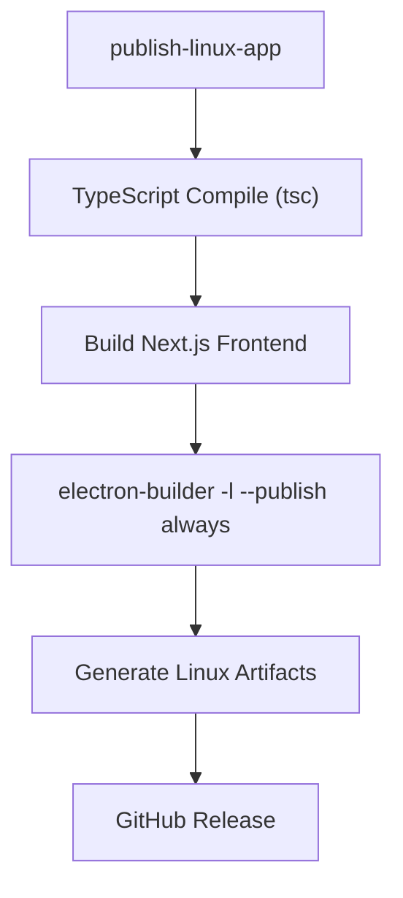
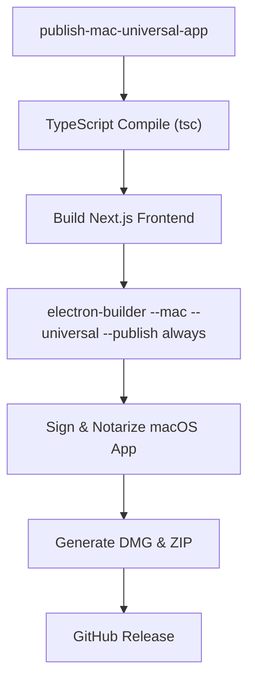
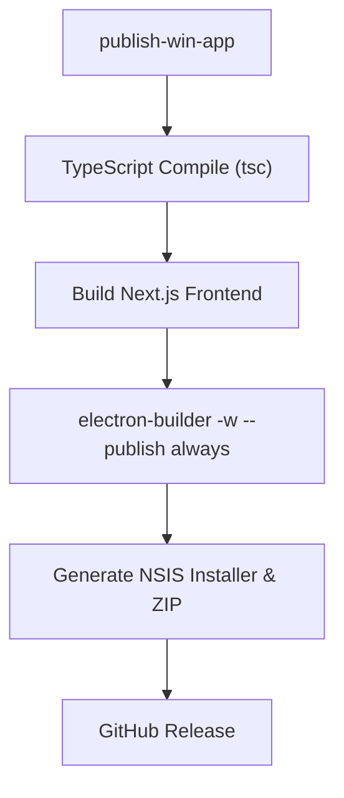
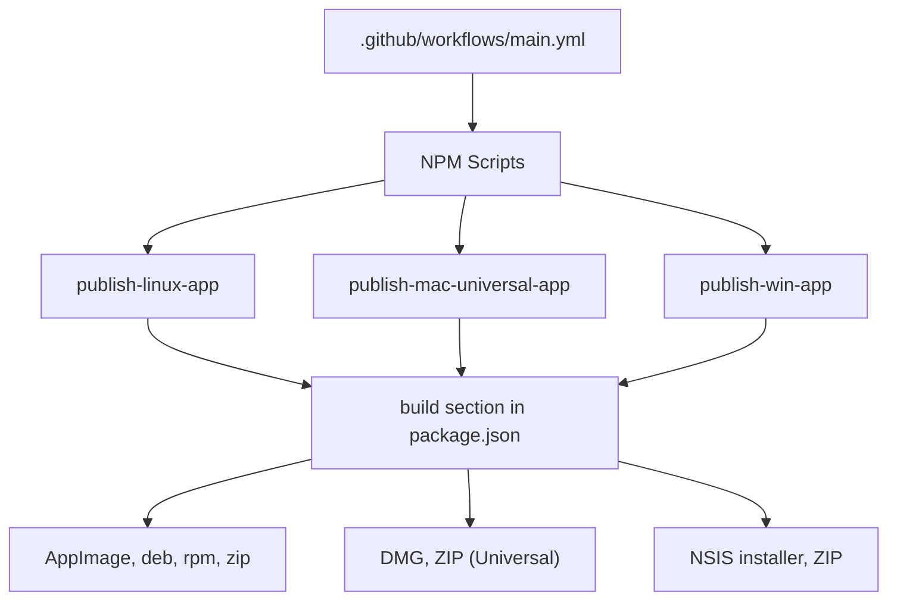

# CI/CD 流水线 (CI/CD Pipeline)

<details>
<summary>相关源文件 (Source files)</summary>

- [.github/workflows/main.yml](https://github.com/upscayl/upscayl/blob/1fdbd3e5/.github/workflows/main.yml)
- [.prettierignore](https://github.com/upscayl/upscayl/blob/1fdbd3e5/.prettierignore)
- [download.jpg](https://github.com/upscayl/upscayl/blob/1fdbd3e5/download.jpg)
- [resources/entitlements.mac.plist](https://github.com/upscayl/upscayl/blob/1fdbd3e5/resources/entitlements.mac.plist)
- [resources/entitlements.mas.inherit.plist](https://github.com/upscayl/upscayl/blob/1fdbd3e5/resources/entitlements.mas.inherit.plist)
- [resources/entitlements.mas.plist](https://github.com/upscayl/upscayl/blob/1fdbd3e5/resources/entitlements.mas.plist)
- [resources/icons/128x128.png](https://github.com/upscayl/upscayl/blob/1fdbd3e5/resources/icons/128x128.png)
- [resources/icons/512x512.png](https://github.com/upscayl/upscayl/blob/1fdbd3e5/resources/icons/512x512.png)
- [screen1.png](https://github.com/upscayl/upscayl/blob/1fdbd3e5/screen1.png)
- [.github/workflows/main.yml4-8](https://github.com/upscayl/upscayl/blob/1fdbd3e5/.github/workflows/main.yml#L4-L8)
- [package.json128-195](https://github.com/upscayl/upscayl/blob/1fdbd3e5/package.json#L128-L195)
- [package.json200-202](https://github.com/upscayl/upscayl/blob/1fdbd3e5/package.json#L200-L202)
- [.github/workflows/main.yml11-68](https://github.com/upscayl/upscayl/blob/1fdbd3e5/.github/workflows/main.yml#L11-L68)
- [.github/workflows/main.yml11-28](https://github.com/upscayl/upscayl/blob/1fdbd3e5/.github/workflows/main.yml#L11-L28)
- [package.json63-64](https://github.com/upscayl/upscayl/blob/1fdbd3e5/package.json#L63-L64)
- [.github/workflows/main.yml30-52](https://github.com/upscayl/upscayl/blob/1fdbd3e5/.github/workflows/main.yml#L30-L52)
- [package.json65-66](https://github.com/upscayl/upscayl/blob/1fdbd3e5/package.json#L65-L66)
- [.github/workflows/main.yml54-68](https://github.com/upscayl/upscayl/blob/1fdbd3e5/.github/workflows/main.yml#L54-L68)
- [package.json64-65](https://github.com/upscayl/upscayl/blob/1fdbd3e5/package.json#L64-L65)
- [package.json73-202](https://github.com/upscayl/upscayl/blob/1fdbd3e5/package.json#L73-L202)
- [package.json169-181](https://github.com/upscayl/upscayl/blob/1fdbd3e5/package.json#L169-L181)
- [package.json128-152](https://github.com/upscayl/upscayl/blob/1fdbd3e5/package.json#L128-L152)
- [package.json182-195](https://github.com/upscayl/upscayl/blob/1fdbd3e5/package.json#L182-L195)
- [.github/workflows/main.yml32-39](https://github.com/upscayl/upscayl/blob/1fdbd3e5/.github/workflows/main.yml#L32-L39)
- [.github/workflows/main.yml65](https://github.com/upscayl/upscayl/blob/1fdbd3e5/.github/workflows/main.yml#L65-L65)
- [.github/workflows/main.yml25-27](https://github.com/upscayl/upscayl/blob/1fdbd3e5/.github/workflows/main.yml#L25-L27)
- [.github/workflows/main.yml47-51](https://github.com/upscayl/upscayl/blob/1fdbd3e5/.github/workflows/main.yml#L47-L51)
- [.github/workflows/main.yml28](https://github.com/upscayl/upscayl/blob/1fdbd3e5/.github/workflows/main.yml#L28-L28)
- [.github/workflows/main.yml38](https://github.com/upscayl/upscayl/blob/1fdbd3e5/.github/workflows/main.yml#L38-L38)
- [main/index.ts](https://github.com/upscayl/upscayl/blob/1fdbd3e5/main/index.ts)
- [package.json82-104](https://github.com/upscayl/upscayl/blob/1fdbd3e5/package.json#L82-L104)
- [package.json76](https://github.com/upscayl/upscayl/blob/1fdbd3e5/package.json#L76-L76)

</details>

## CI/CD 流水线和开发工作流 (Development Workflow)

CI/CD 流水线与整体开发工作流集成如下：


此工作流确保每个正式版本在自动构建并分发给用户之前，都经过了适当的审查和测试。

来源：[.github/workflows/main.yml4-8](https://github.com/upscayl/upscayl/blob/1fdbd3e5/.github/workflows/main.yml#L4-L8)

## 构建产物 (Artifacts) 和分发渠道 (Distribution Channels)

下图显示了来自 CI/CD 流水线的构建产物如何通过各种渠道进行分发：


这种多渠道分发方法确保用户可以通过自己喜欢的方式访问 Upscayl，无论是直接从 GitHub 下载，还是通过现有安装接收自动更新 (Auto-Update)。

来源：[package.json128-195](https://github.com/upscayl/upscayl/blob/1fdbd3e5/package.json#L128-L195) [package.json200-202](https://github.com/upscayl/upscayl/blob/1fdbd3e5/package.json#L200-L202)

# CI/CD 流水线

相关源文件

-   [.github/workflows/main.yml](https://github.com/upscayl/upscayl/blob/1fdbd3e5/.github/workflows/main.yml)
-   [.prettierignore](https://github.com/upscayl/upscayl/blob/1fdbd3e5/.prettierignore)
-   [download.jpg](https://github.com/upscayl/upscayl/blob/1fdbd3e5/download.jpg)
-   [resources/entitlements.mac.plist](https://github.com/upscayl/upscayl/blob/1fdbd3e5/resources/entitlements.mac.plist)
-   [resources/entitlements.mas.inherit.plist](https://github.com/upscayl/upscayl/blob/1fdbd3e5/resources/entitlements.mas.inherit.plist)
-   [resources/entitlements.mas.plist](https://github.com/upscayl/upscayl/blob/1fdbd3e5/resources/entitlements.mas.plist)
-   [resources/icons/128x128.png](https://github.com/upscayl/upscayl/blob/1fdbd3e5/resources/icons/128x128.png)
-   [resources/icons/512x512.png](https://github.com/upscayl/upscayl/blob/1fdbd3e5/resources/icons/512x512.png)
-   [screen1.png](https://github.com/upscayl/upscayl/blob/1fdbd3e5/screen1.png)

本页面记录了用于跨多个平台（Windows、macOS 和 Linux）自动化 Upscayl 构建和发布过程的持续集成和持续部署 (CI/CD) 流水线。有关构建配置本身的信息，请参阅 [构建配置](/upscayl/upscayl/6.1-build-configuration)。

## 概述 (Overview)

Upscayl 的 CI/CD 流水线使用 GitHub Actions 实现，并配置为在推送版本标签或手动触发时自动构建和发布应用程序版本。

### 工作流触发机制 (Workflow Trigger Mechanism)

流水线以两种方式触发：

1.  当以 "v" 开头的标签推送到存储库时自动触发
2.  通过 GitHub 的工作流调度 (Workflow Dispatch) 功能手动触发


来源：[.github/workflows/main.yml4-8](https://github.com/upscayl/upscayl/blob/1fdbd3e5/.github/workflows/main.yml#L4-L8)

## 工作流结构 (Workflow Structure)

流水线由三个并行任务 (Job) 组成，每个任务负责构建和发布特定平台的产物。


来源：[.github/workflows/main.yml11-68](https://github.com/upscayl/upscayl/blob/1fdbd3e5/.github/workflows/main.yml#L11-L68)

## 平台特定构建

### Linux 构建

Linux 构建在 Ubuntu 20.04 上运行，并执行以下步骤：

1.  使用 Node.js 18 设置环境
2.  安装所需的系统软件包（`elfutils`、`rpm`）
3.  安装 npm 依赖项
4.  专门针对 Linux 配置 Sharp 模块
5.  使用 `publish-linux-app` 脚本发布 Linux 产物（AppImage、deb、rpm、zip）


来源：[.github/workflows/main.yml11-28](https://github.com/upscayl/upscayl/blob/1fdbd3e5/.github/workflows/main.yml#L11-L28) [package.json63-64](https://github.com/upscayl/upscayl/blob/1fdbd3e5/package.json#L63-L64)

### macOS 构建

macOS 构建在 macOS 13 上运行，并处理：

1.  包含代码签名所需秘密 (Secrets) 的环境配置
2.  用于商店合规性的预置描述文件 (Provisioning profile) 设置
3.  对通用二进制文件构建 (Intel + ARM) 的 Sharp 模块进行特殊处理
4.  构建并发布通用 macOS 应用程序


来源：[.github/workflows/main.yml30-52](https://github.com/upscayl/upscayl/blob/1fdbd3e5/.github/workflows/main.yml#L30-L52) [package.json65-66](https://github.com/upscayl/upscayl/blob/1fdbd3e5/package.json#L65-L66)

### Windows 构建

Windows 构建任务：

1.  设置 Node.js 18 环境
2.  安装依赖项
3.  构建并发布 Windows 产物（NSIS 安装程序和 ZIP）


来源：[.github/workflows/main.yml54-68](https://github.com/upscayl/upscayl/blob/1fdbd3e5/.github/workflows/main.yml#L54-L68) [package.json64-65](https://github.com/upscayl/upscayl/blob/1fdbd3e5/package.json#L64-L65)

## 构建配置集成

CI/CD 流水线利用 `package.json` 文件中 `build` 部分定义的配置，该部分指定了 Electron Builder 应如何为每个平台打包应用程序。


来源：[package.json73-202](https://github.com/upscayl/upscayl/blob/1fdbd3e5/package.json#L73-L202)

## 平台特定配置详细信息

### Linux 配置

Linux 构建生成多种分发格式：

-   AppImage（通用 Linux 软件包）
-   DEB（Debian/Ubuntu 软件包）
-   RPM（Red Hat/Fedora 软件包）
-   ZIP 归档

```
"linux": {
  "target": ["AppImage", "zip", "deb", "rpm"],
  "category": "Graphics;2DGraphics;RasterGraphics;ImageProcessing;"
}
```
来源：[package.json169-181](https://github.com/upscayl/upscayl/blob/1fdbd3e5/package.json#L169-L181)

### macOS 配置

macOS 构建包括对以下内容的特殊处理：

-   使用 Apple 开发者证书进行代码签名
-   应用程序公证 (Notarization) 过程
-   通用二进制文件支持 (Intel + ARM)
-   Mac App Store 合规性（需要时）

```
"mac": {
  "hardenedRuntime": true,
  "minimumSystemVersion": "12.0.0",
  "target": [
    { "target": "dmg", "arch": ["universal"] },
    { "target": "zip", "arch": ["universal"] }
  ]
}
```
来源：[package.json128-152](https://github.com/upscayl/upscayl/blob/1fdbd3e5/package.json#L128-L152)

### Windows 配置

Windows 构建生成：

-   NSIS 安装程序（带有自定义选项）
-   ZIP 归档

```
"win": {
  "target": ["nsis", "zip"]
},
"nsis": {
  "allowToChangeInstallationDirectory": true,
  "oneClick": false,
  "perMachine": true
}
```
来源：[package.json182-195](https://github.com/upscayl/upscayl/blob/1fdbd3e5/package.json#L182-L195)

## 环境变量和秘密 (Secrets)

CI/CD 流水线使用多个 GitHub 秘密来处理敏感信息：

### macOS 秘密

-   `CSC_KEY_PASSWORD`：代码签名证书的密码
-   `CSC_LINK`：Base64 编码的签名证书
-   `APPLEID`：Apple 开发者 ID
-   `APPLEIDPASS`：Apple 开发者账户密码
-   `TEAMID`：Apple 开发者团队 ID
-   `PROVISION_PROFILE`：Base64 编码的预置描述文件

### 通用秘密

-   `GITHUB_TOKEN`：用于发布版本的 GitHub 令牌 (Token)

来源：[.github/workflows/main.yml32-39](https://github.com/upscayl/upscayl/blob/1fdbd3e5/.github/workflows/main.yml#L32-L39) [.github/workflows/main.yml65](https://github.com/upscayl/upscayl/blob/1fdbd3e5/.github/workflows/main.yml#L65-L65)

## 原生依赖项 (Native Dependencies) 处理

由于 Sharp 图像处理库的原生依赖项，需要对其进行特殊处理：

### Linux 构建

```
rm -rf node_modules/sharpSHARP_IGNORE_GLOBAL_LIBVIPS=1 npm install --arch=x64 --platform=linux --libc=glibc --build-from-source sharp
```
### macOS 构建

```
rm -rf node_modules/sharpnpm install --platform=darwin --arch=x64 sharpnpm rebuild --platform=darwin --arch=arm64 sharp
```
这确保了 Sharp 针对每个目标平台架构都能正确编译。特殊处理是必要的，因为 Sharp 包含原生代码，必须专门针对每个目标平台和架构进行编译，以确保最佳性能。

来源：[.github/workflows/main.yml25-27](https://github.com/upscayl/upscayl/blob/1fdbd3e5/.github/workflows/main.yml#L25-L27) [.github/workflows/main.yml47-51](https://github.com/upscayl/upscayl/blob/1fdbd3e5/.github/workflows/main.yml#L47-L51)

## 发布配置

Upscayl 使用 GitHub 作为其发布提供商，自动将产物发布到 GitHub Releases：

```
"publish": {
  "provider": "github"
}
```
此配置启用了 Electron 的自动更新功能，允许用户在发布新版本时自动接收更新。工作流环境变量 (`GH_TOKEN`) 中提供的 GitHub 令牌用于通过 GitHub 的 API 进行身份验证以发布版本。

来源：[package.json200-202](https://github.com/upscayl/upscayl/blob/1fdbd3e5/package.json#L200-L202) [.github/workflows/main.yml28](https://github.com/upscayl/upscayl/blob/1fdbd3e5/.github/workflows/main.yml#L28-L28) [.github/workflows/main.yml38](https://github.com/upscayl/upscayl/blob/1fdbd3e5/.github/workflows/main.yml#L38-L38) [.github/workflows/main.yml65](https://github.com/upscayl/upscayl/blob/1fdbd3e5/.github/workflows/main.yml#L65-L65)

## 与自动更新机制 (Auto-Update mechanism) 的关系

CI/CD 流水线直接支持 Upscayl 的自动更新功能：

> **[Mermaid sequence]**
> *(图表结构无法解析)*

自动更新机制使用 CI/CD 过程生成的产物向用户提供无缝更新。Upscayl 使用 `electron-updater` 模块实现此功能，该模块会检查 GitHub 发布的新版本并处理下载和安装过程。

来源：[package.json200-202](https://github.com/upscayl/upscayl/blob/1fdbd3e5/package.json#L200-L202) [main/index.ts](https://github.com/upscayl/upscayl/blob/1fdbd3e5/main/index.ts)

## 资产管理

CI/CD 过程处理最终应用程序包中包含的所有必需资产：

```
"extraFiles": [
  {
    "from": "resources/${os}/bin",
    "to": "resources/bin",
    "filter": ["**/*"]
  },
  {
    "from": "resources/models",
    "to": "resources/models",
    "filter": ["**/*"]
  }
]
```
这确保了平台特定的二进制文件和 AI 模型正确包含在最终的应用程序包中。在构建过程中，`${os}` 变量会自动替换为目标平台名称，从而允许正确包含平台特定的二进制文件。

包含的 AI 模型是用于图像放大的 Real-ESRGAN 模型，这对于应用程序的核心功能至关重要。

来源：[package.json82-104](https://github.com/upscayl/upscayl/blob/1fdbd3e5/package.json#L82-L104)

## 产物命名约定 (Artifact Naming Convention)

由 CI/CD 流水线构建的产物遵循一致的命名约定：

```
"artifactName": "${name}-${version}-${os}.${ext}"
```
例如：`upscayl-2.15.0-win.exe` 或 `upscayl-2.15.0-mac.dmg`

来源：[package.json76](https://github.com/upscayl/upscayl/blob/1fdbd3e5/package.json#L76-L76)
